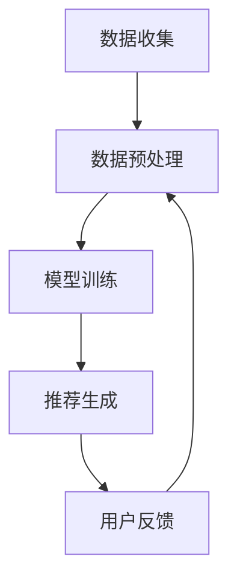

                 

关键词：推荐系统、人工智能、个性化、机器学习、算法、数据分析、用户体验

摘要：本文将探讨推荐系统在人工智能（AI）领域的重要性，以及如何通过个性化的方式提升用户体验。我们将深入分析推荐系统的工作原理、核心算法、数学模型，并通过实际项目实践展示其应用场景。同时，本文还将展望推荐系统在未来的发展趋势与挑战。

## 1. 背景介绍

推荐系统作为人工智能的一个重要分支，已经被广泛应用于电子商务、社交媒体、在线新闻、音乐和视频平台等领域。其目的是通过分析用户的兴趣和行为，为他们提供个性化的内容推荐，从而提高用户满意度和忠诚度。随着大数据和机器学习技术的不断发展，推荐系统在实现精准推荐方面取得了显著成果。

本文将围绕推荐系统的核心概念、算法原理、数学模型以及实际应用，进行深入探讨。通过对推荐系统的全面解析，我们将了解到其如何将一切信息转化为个性化的用户体验。

## 2. 核心概念与联系

### 2.1 推荐系统概述

推荐系统（Recommendation System）是一种信息过滤技术，旨在根据用户的历史行为、偏好和兴趣，为其推荐相关的信息或商品。推荐系统通常分为三种类型：基于内容的推荐、协同过滤推荐和混合推荐。

- **基于内容的推荐**：根据用户对某一内容的偏好，推荐与其相似的内容。这种方法主要依赖于内容的特征提取和匹配。

- **协同过滤推荐**：通过分析用户之间的相似性，推荐其他用户喜欢的商品或内容。协同过滤推荐又分为用户基于的协同过滤和项基于的协同过滤。

- **混合推荐**：结合基于内容和协同过滤推荐的方法，以实现更准确的推荐结果。

### 2.2 推荐系统架构

推荐系统通常由数据收集、数据预处理、模型训练和推荐生成四个主要模块组成。以下是一个典型的推荐系统架构：

- **数据收集**：收集用户的行为数据、兴趣数据以及商品或内容的数据。

- **数据预处理**：对收集到的数据进行分析和清洗，以去除噪声和冗余信息。

- **模型训练**：使用机器学习算法，从预处理后的数据中学习用户偏好和模式。

- **推荐生成**：根据训练好的模型，为用户生成个性化的推荐结果。

- **用户反馈**：收集用户对推荐结果的反馈，用于进一步优化推荐系统。

### 2.3 推荐系统与AI的联系

人工智能（AI）为推荐系统提供了强大的技术支持。以下是一些AI技术在推荐系统中的应用：

- **机器学习算法**：用于模型训练和预测，如协同过滤、矩阵分解、深度学习等。

- **自然语言处理**：用于处理用户生成的内容，如标题、评论等。

- **图像识别**：用于分析商品图片，提取特征并进行推荐。

- **强化学习**：用于优化推荐策略，以提高用户满意度和转化率。

## 3. 核心算法原理 & 具体操作步骤

### 3.1 算法原理概述

推荐系统中的核心算法主要包括基于内容的推荐、协同过滤推荐和混合推荐。以下分别介绍这些算法的原理。

#### 3.1.1 基于内容的推荐

基于内容的推荐（Content-Based Recommendation）方法根据用户对某一内容的偏好，推荐与其相似的内容。其基本原理如下：

1. **内容特征提取**：对商品或内容进行分析，提取出其特征向量。

2. **用户兴趣模型**：根据用户的历史行为和偏好，构建用户兴趣模型。

3. **相似度计算**：计算用户兴趣模型与商品特征向量之间的相似度。

4. **推荐生成**：根据相似度分数，为用户推荐相似度最高的商品或内容。

#### 3.1.2 协同过滤推荐

协同过滤推荐（Collaborative Filtering）方法通过分析用户之间的相似性，推荐其他用户喜欢的商品或内容。其基本原理如下：

1. **用户相似性计算**：计算用户之间的相似度，通常使用余弦相似度或皮尔逊相关系数。

2. **基于用户的推荐**：找到与目标用户最相似的其他用户，推荐这些用户喜欢的商品或内容。

3. **基于项目的推荐**：找到与目标用户最相似的其他用户喜欢的商品或内容，推荐这些商品或内容。

4. **混合推荐**：结合基于用户和基于项目的推荐方法，生成更准确的推荐结果。

#### 3.1.3 混合推荐

混合推荐（Hybrid Recommendation）方法结合基于内容和协同过滤推荐的方法，以提高推荐准确性。其基本原理如下：

1. **内容特征与用户偏好**：结合商品或内容特征和用户偏好，构建用户兴趣模型。

2. **协同过滤**：使用协同过滤方法，计算用户之间的相似性。

3. **内容相似度计算**：计算商品或内容之间的相似度。

4. **推荐生成**：综合考虑用户兴趣模型、协同过滤结果和内容相似度，生成个性化的推荐结果。

### 3.2 算法步骤详解

以下分别详细介绍基于内容的推荐、协同过滤推荐和混合推荐的算法步骤。

#### 3.2.1 基于内容的推荐

1. **数据预处理**：清洗和标准化用户行为数据，提取商品或内容特征。

2. **内容特征提取**：使用词袋模型、TF-IDF等方法，提取商品或内容特征向量。

3. **用户兴趣模型构建**：根据用户的历史行为，使用聚类或机器学习算法，构建用户兴趣模型。

4. **相似度计算**：计算用户兴趣模型与商品特征向量之间的相似度。

5. **推荐生成**：根据相似度分数，为用户推荐相似度最高的商品或内容。

#### 3.2.2 协同过滤推荐

1. **数据预处理**：清洗和标准化用户行为数据，包括评分、购买记录等。

2. **用户相似性计算**：计算用户之间的相似度，使用余弦相似度或皮尔逊相关系数。

3. **基于用户的推荐**：找到与目标用户最相似的其他用户，推荐这些用户喜欢的商品或内容。

4. **基于项目的推荐**：找到与目标用户最相似的其他用户喜欢的商品或内容，推荐这些商品或内容。

5. **混合推荐**：结合基于用户和基于项目的推荐方法，生成更准确的推荐结果。

#### 3.2.3 混合推荐

1. **数据预处理**：清洗和标准化用户行为数据，提取商品或内容特征。

2. **内容特征提取**：使用词袋模型、TF-IDF等方法，提取商品或内容特征向量。

3. **用户兴趣模型构建**：根据用户的历史行为，使用聚类或机器学习算法，构建用户兴趣模型。

4. **协同过滤**：使用协同过滤方法，计算用户之间的相似性。

5. **内容相似度计算**：计算商品或内容之间的相似度。

6. **推荐生成**：综合考虑用户兴趣模型、协同过滤结果和内容相似度，生成个性化的推荐结果。

### 3.3 算法优缺点

#### 3.3.1 基于内容的推荐

**优点**：

- **准确性较高**：通过分析商品或内容的特征，可以生成较为准确的推荐结果。

- **可扩展性较好**：适用于各种类型的内容，如文本、图像、视频等。

- **易于理解**：用户可以直观地了解推荐的原因。

**缺点**：

- **冷启动问题**：对于新用户或新商品，由于缺乏历史数据，难以生成准确的推荐。

- **可扩展性较差**：对于大量商品或内容，特征提取和相似度计算过程复杂。

#### 3.3.2 协同过滤推荐

**优点**：

- **冷启动问题较好解决**：通过分析用户之间的相似性，可以对新用户和新商品进行推荐。

- **可扩展性较好**：适用于大规模用户和商品数据。

- **用户体验较好**：推荐结果更贴近用户实际喜好。

**缺点**：

- **准确性较低**：依赖于用户之间的相似性，容易产生噪声和偏差。

- **可解释性较差**：用户难以了解推荐的原因。

#### 3.3.3 混合推荐

**优点**：

- **准确性较高**：结合了基于内容和协同过滤推荐的方法，可以提高推荐准确性。

- **可扩展性较好**：适用于多种类型的数据和应用场景。

- **用户体验较好**：推荐结果更贴近用户实际喜好。

**缺点**：

- **计算复杂度较高**：需要同时处理内容特征和用户相似性。

- **可解释性较差**：用户难以了解推荐的原因。

### 3.4 算法应用领域

推荐系统在多个领域得到了广泛应用，包括：

- **电子商务**：为用户推荐相关的商品，提高销售额和用户满意度。

- **社交媒体**：为用户推荐感兴趣的朋友、帖子、视频等，提高用户活跃度。

- **在线新闻**：为用户推荐相关的新闻，提高阅读量和广告收益。

- **音乐和视频平台**：为用户推荐感兴趣的音乐、视频，提高用户留存率和付费转化率。

- **教育领域**：为用户推荐合适的学习资源，提高学习效果。

## 4. 数学模型和公式 & 详细讲解 & 举例说明

### 4.1 数学模型构建

推荐系统的数学模型主要包括用户偏好模型、商品特征模型和推荐模型。

#### 4.1.1 用户偏好模型

用户偏好模型用于表示用户对商品或内容的偏好。常见的用户偏好模型有：

- **均值模型**：表示用户对所有商品的总体偏好。

- **偏差模型**：表示用户对特定商品的偏好。

- **隐含因子模型**：通过隐含因子表示用户对商品的偏好。

#### 4.1.2 商品特征模型

商品特征模型用于表示商品的特征。常见的商品特征模型有：

- **词袋模型**：将商品描述转换为词袋向量。

- **TF-IDF模型**：根据词频和文档频率计算商品的特征向量。

- **深度学习模型**：使用神经网络提取商品的特征。

#### 4.1.3 推荐模型

推荐模型用于生成个性化的推荐结果。常见的推荐模型有：

- **基于内容的推荐模型**：使用商品特征和用户偏好计算相似度，生成推荐结果。

- **协同过滤推荐模型**：使用用户相似性和商品评分生成推荐结果。

- **混合推荐模型**：结合基于内容和协同过滤推荐的方法，生成推荐结果。

### 4.2 公式推导过程

以下分别介绍用户偏好模型、商品特征模型和推荐模型的公式推导过程。

#### 4.2.1 用户偏好模型

1. **均值模型**：

$$
R_u = \frac{\sum_{i=1}^{n} r_{ui}}{n}
$$

其中，$R_u$表示用户$u$对所有商品的总体偏好，$r_{ui}$表示用户$u$对商品$i$的评分，$n$表示用户$u$评价的商品数量。

2. **偏差模型**：

$$
R_u = \frac{\sum_{i=1}^{n} r_{ui} - \bar{r}_u \cdot n}{n}
$$

其中，$\bar{r}_u$表示用户$u$对所有商品的总体评分。

3. **隐含因子模型**：

$$
R_{ui} = \langle \theta_u, \phi_i \rangle
$$

其中，$\theta_u$和$\phi_i$分别表示用户$u$和商品$i$的隐含因子向量，$\langle \cdot, \cdot \rangle$表示内积运算。

#### 4.2.2 商品特征模型

1. **词袋模型**：

$$
\textbf{X}_i = (x_{i1}, x_{i2}, ..., x_{im})
$$

其中，$\textbf{X}_i$表示商品$i$的词袋向量，$x_{ij}$表示商品$i$中单词$j$的出现次数。

2. **TF-IDF模型**：

$$
\textbf{X}_i = (\text{T}

