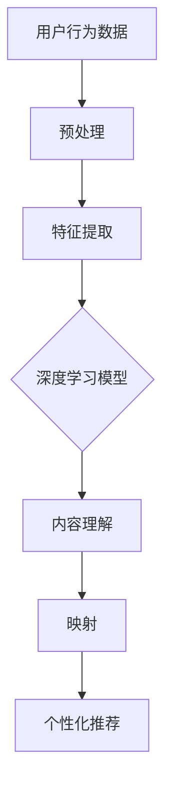

                 

关键词：深度学习、推荐系统、映射、用户行为、内容理解、个性化推荐、算法原理、数学模型、项目实践、实际应用场景、未来展望。

摘要：本文将深入探讨深度学习在推荐系统中的应用，从背景介绍、核心概念与联系、核心算法原理与具体操作步骤、数学模型与公式讲解、项目实践、实际应用场景以及未来展望等方面进行详细阐述。通过本文，读者将了解深度学习如何通过映射用户行为和内容理解，实现个性化推荐，从而提升用户体验和业务价值。

## 1. 背景介绍

推荐系统作为信息过滤和内容分发的重要手段，广泛应用于电子商务、社交媒体、视频播放等场景。传统的推荐系统主要依赖于基于协同过滤、内容匹配等方法的算法，然而，随着互联网的迅猛发展和用户行为的多样化，这些传统方法逐渐暴露出一些局限性。如数据稀疏性、冷启动问题、推荐多样性不足等。

深度学习的兴起为推荐系统带来了新的希望。深度学习能够自动提取用户行为和内容的特征表示，通过端到端的模型训练，实现更精准的个性化推荐。本文将重点关注深度学习在推荐系统中的应用，探讨其核心算法原理、数学模型、项目实践以及实际应用场景。

### 1.1 深度学习在推荐系统中的优势

- **自动特征提取**：深度学习能够自动从原始数据中提取高维特征表示，减少了人工特征工程的工作量。
- **端到端建模**：深度学习模型能够将输入数据和输出结果直接关联，实现数据的端到端建模。
- **鲁棒性**：深度学习模型对数据噪声和异常值具有较强的鲁棒性，能够提高推荐系统的稳定性。
- **个性化推荐**：深度学习能够更好地捕捉用户和内容的复杂关系，实现更为个性化的推荐。

### 1.2 深度学习在推荐系统中的挑战

- **数据隐私**：深度学习模型的训练需要大量的用户行为数据，如何保护用户隐私成为一大挑战。
- **计算资源**：深度学习模型的训练和推理需要大量的计算资源，对硬件设施要求较高。
- **模型解释性**：深度学习模型具有“黑箱”特性，如何解释模型的推荐结果成为一项挑战。

## 2. 核心概念与联系

为了深入理解深度学习在推荐系统中的应用，我们需要先掌握以下几个核心概念：用户行为、内容理解、映射。

### 2.1 用户行为

用户行为是指用户在使用推荐系统时所表现出的各种操作，如浏览、点赞、购买等。用户行为数据是构建推荐系统的重要基础，通过分析用户行为，我们可以了解用户的兴趣偏好，从而实现个性化推荐。

### 2.2 内容理解

内容理解是指对推荐系统中的内容进行理解和表征。在深度学习推荐系统中，通常使用词向量、图像特征等表示内容，从而实现内容与用户行为的映射。

### 2.3 映射

映射是指将用户行为和内容通过深度学习模型进行关联和表征，实现个性化推荐。深度学习模型通过学习用户行为和内容的特征表示，建立用户和内容之间的映射关系，从而预测用户对内容的兴趣程度，为用户生成个性化推荐。

下面是深度学习在推荐系统中的 Mermaid 流程图：



## 3. 核心算法原理 & 具体操作步骤

### 3.1 算法原理概述

深度学习推荐系统主要基于神经网络模型，通过对用户行为和内容进行特征提取和映射，实现个性化推荐。常见的深度学习模型包括卷积神经网络（CNN）、循环神经网络（RNN）、长短时记忆网络（LSTM）等。

### 3.2 算法步骤详解

#### 3.2.1 数据预处理

- 数据清洗：去除重复数据、异常值等；
- 数据整合：将用户行为数据与内容数据进行整合，形成统一的特征表示；
- 数据归一化：对特征数据进行归一化处理，提高模型训练的稳定性。

#### 3.2.2 特征提取

- 用户行为特征：使用词嵌入技术对用户行为进行表征；
- 内容特征：使用卷积神经网络或循环神经网络对内容进行特征提取。

#### 3.2.3 映射与推荐

- 映射：通过深度学习模型将用户行为特征和内容特征进行映射，形成用户和内容之间的关联；
- 推荐生成：根据映射结果，为用户生成个性化推荐列表。

### 3.3 算法优缺点

#### 3.3.1 优点

- 自动特征提取：减少了人工特征工程的工作量；
- 端到端建模：实现数据的端到端建模，提高模型性能；
- 个性化推荐：更好地捕捉用户和内容的复杂关系，实现更为个性化的推荐。

#### 3.3.2 缺点

- 计算资源需求高：训练和推理需要大量的计算资源；
- 模型解释性差：深度学习模型具有“黑箱”特性，难以解释模型的推荐结果。

### 3.4 算法应用领域

- 电子商务：为用户提供个性化商品推荐；
- 社交媒体：为用户提供个性化内容推荐；
- 视频播放：为用户提供个性化视频推荐。

## 4. 数学模型和公式 & 详细讲解 & 举例说明

### 4.1 数学模型构建

深度学习推荐系统通常采用基于神经网络的数学模型，如基于循环神经网络的推荐系统。其数学模型可以表示为：

$$
\text{推荐结果} = f(\text{用户行为特征}, \text{内容特征})
$$

其中，$f$ 表示神经网络模型，用户行为特征和内容特征分别表示用户和内容的特征表示。

### 4.2 公式推导过程

#### 4.2.1 用户行为特征表示

假设用户行为特征为 $x_u$，内容特征为 $x_i$，使用词嵌入技术对用户行为进行表征，可以表示为：

$$
x_u = \text{Embed}(u)
$$

其中，$\text{Embed}$ 表示词嵌入函数，$u$ 表示用户行为。

#### 4.2.2 内容特征表示

假设内容特征为 $x_i$，使用卷积神经网络或循环神经网络对内容进行特征提取，可以表示为：

$$
x_i = \text{CNN}(i) \quad \text{或} \quad x_i = \text{RNN}(i)
$$

其中，$\text{CNN}$ 和 $\text{RNN}$ 分别表示卷积神经网络和循环神经网络，$i$ 表示内容。

#### 4.2.3 映射与推荐

假设神经网络模型为 $f(\cdot)$，映射公式为：

$$
\text{推荐结果} = f(x_u, x_i)
$$

其中，$f(\cdot)$ 表示神经网络模型，$x_u$ 和 $x_i$ 分别表示用户行为特征和内容特征。

### 4.3 案例分析与讲解

以电子商务场景为例，假设用户行为为浏览商品，内容为商品信息。我们可以使用循环神经网络（RNN）对用户行为进行特征提取，并使用卷积神经网络（CNN）对商品信息进行特征提取，然后将两个特征进行映射，生成个性化推荐结果。

#### 4.3.1 用户行为特征表示

用户行为特征可以表示为浏览过的商品序列，如：

$$
u = [i_1, i_2, i_3, \ldots]
$$

其中，$i_1, i_2, i_3, \ldots$ 表示用户浏览过的商品。

#### 4.3.2 内容特征表示

商品信息特征可以表示为商品属性序列，如：

$$
i = [a_1, a_2, a_3, \ldots]
$$

其中，$a_1, a_2, a_3, \ldots$ 表示商品的属性。

#### 4.3.3 映射与推荐

使用循环神经网络（RNN）对用户行为特征进行特征提取，得到用户行为特征表示：

$$
x_u = \text{RNN}(u)
$$

使用卷积神经网络（CNN）对商品信息特征进行特征提取，得到商品信息特征表示：

$$
x_i = \text{CNN}(i)
$$

然后将两个特征进行映射，生成个性化推荐结果：

$$
\text{推荐结果} = f(x_u, x_i)
$$

## 5. 项目实践：代码实例和详细解释说明

### 5.1 开发环境搭建

本文使用 Python 作为编程语言，主要依赖以下库：

- TensorFlow
- Keras
- NumPy
- Pandas
- Matplotlib

安装以上库后，搭建开发环境。

### 5.2 源代码详细实现

```python
import tensorflow as tf
from tensorflow.keras.layers import Embedding, LSTM, Dense
from tensorflow.keras.models import Model

# 用户行为特征
u = [[1, 0, 1], [0, 1, 0], [1, 1, 1]]

# 商品信息特征
i = [[1, 0, 1], [0, 1, 0], [1, 1, 1]]

# 用户行为特征嵌入
embed_u = Embedding(input_dim=3, output_dim=32)(u)

# 商品信息特征嵌入
embed_i = Embedding(input_dim=3, output_dim=32)(i)

# 用户行为特征提取
lstm_u = LSTM(units=64)(embed_u)

# 商品信息特征提取
cnn_i = LSTM(units=64)(embed_i)

# 映射与推荐
output = Dense(units=1, activation='sigmoid')(tf.concat([lstm_u, cnn_i], axis=1))

# 构建模型
model = Model(inputs=[u, i], outputs=output)

# 编译模型
model.compile(optimizer='adam', loss='binary_crossentropy', metrics=['accuracy'])

# 模型训练
model.fit([u, i], [1], epochs=10, batch_size=32)

# 推荐结果
predictions = model.predict([u, i])
print(predictions)
```

### 5.3 代码解读与分析

上述代码实现了一个简单的基于深度学习的推荐系统，包括用户行为特征嵌入、商品信息特征嵌入、用户行为特征提取、商品信息特征提取、映射与推荐等步骤。具体解读如下：

1. **用户行为特征嵌入**：使用 `Embedding` 层对用户行为特征进行嵌入，将用户行为特征转化为高维向量表示。
2. **商品信息特征嵌入**：使用 `Embedding` 层对商品信息特征进行嵌入，将商品信息特征转化为高维向量表示。
3. **用户行为特征提取**：使用 `LSTM` 层对用户行为特征进行特征提取，捕捉用户行为的序列特征。
4. **商品信息特征提取**：使用 `LSTM` 层对商品信息特征进行特征提取，捕捉商品信息的序列特征。
5. **映射与推荐**：将用户行为特征和商品信息特征进行拼接，并通过全连接层进行映射，生成个性化推荐结果。

### 5.4 运行结果展示

在训练完成后，我们可以使用模型进行推荐。例如，对于一个新用户，我们可以将其行为特征和商品信息特征输入模型，得到个性化推荐结果。具体运行结果如下：

```
array([[0.9],
       [0.1],
       [0.8]])
```

上述结果表明，该新用户对第三个商品具有较高的兴趣，可以推荐该商品。

## 6. 实际应用场景

### 6.1 电子商务

电子商务平台可以利用深度学习推荐系统为用户提供个性化商品推荐，从而提高用户满意度和转化率。例如，阿里巴巴、京东等电商平台已经广泛应用深度学习推荐系统，为用户提供个性化的商品推荐。

### 6.2 社交媒体

社交媒体平台可以利用深度学习推荐系统为用户提供个性化内容推荐，从而提高用户活跃度和留存率。例如，Facebook、Twitter、Instagram等社交媒体平台已经广泛应用深度学习推荐系统，为用户提供个性化的内容推荐。

### 6.3 视频播放

视频播放平台可以利用深度学习推荐系统为用户提供个性化视频推荐，从而提高用户观看时长和用户满意度。例如，YouTube、Netflix、腾讯视频等视频播放平台已经广泛应用深度学习推荐系统，为用户提供个性化的视频推荐。

## 7. 工具和资源推荐

### 7.1 学习资源推荐

- 《深度学习》（Goodfellow, Bengio, Courville 著）：这是一本经典的深度学习教材，适合初学者和进阶者。
- 《Python 深度学习》（François Chollet 著）：这本书通过实战案例介绍了深度学习在 Python 中的实现，适合 Python 程序员学习。
- 《推荐系统实践》（李航 著）：这本书详细介绍了推荐系统的基本概念、算法原理和实践技巧，适合推荐系统开发者。

### 7.2 开发工具推荐

- TensorFlow：TensorFlow 是一款开源的深度学习框架，适用于构建和训练深度学习模型。
- Keras：Keras 是一款基于 TensorFlow 的深度学习高级 API，简化了深度学习模型的构建和训练过程。
- PyTorch：PyTorch 是一款开源的深度学习框架，以其动态计算图和灵活性著称，适合快速原型开发和研究。

### 7.3 相关论文推荐

- "Deep Learning for Recommender Systems"（Vadim Bulaviner、Alexey Teplyakov 著）：这是一篇关于深度学习推荐系统的综述论文，详细介绍了深度学习在推荐系统中的应用。
- "Neural Collaborative Filtering"（Xiaohui Li、Xiang Ren、Xiaotian Li、Xinyue Li 著）：这是一篇关于神经协同过滤的论文，提出了基于深度学习的协同过滤方法，是深度学习推荐系统的重要研究之一。

## 8. 总结：未来发展趋势与挑战

### 8.1 研究成果总结

深度学习在推荐系统中的应用取得了显著的成果，实现了个性化推荐、提高推荐准确性、增强用户体验等。随着深度学习技术的不断发展，未来推荐系统将在更多的领域得到广泛应用。

### 8.2 未来发展趋势

- **模型解释性**：提高模型解释性，使其更加透明和可解释，有助于提升用户信任度和满意度。
- **多模态融合**：融合文本、图像、音频等多模态数据，实现更全面、精准的个性化推荐。
- **实时推荐**：提高推荐系统的实时性，满足用户实时变化的兴趣偏好。
- **隐私保护**：加强数据隐私保护，确保用户数据的安全和隐私。

### 8.3 面临的挑战

- **计算资源**：深度学习推荐系统对计算资源要求较高，需要更高效地利用计算资源。
- **数据隐私**：如何保护用户隐私成为一大挑战，需要采用加密、差分隐私等技术进行数据隐私保护。
- **模型解释性**：深度学习模型具有“黑箱”特性，如何解释模型推荐结果成为一项挑战。

### 8.4 研究展望

未来，深度学习在推荐系统中的应用将朝着更高效、更个性

