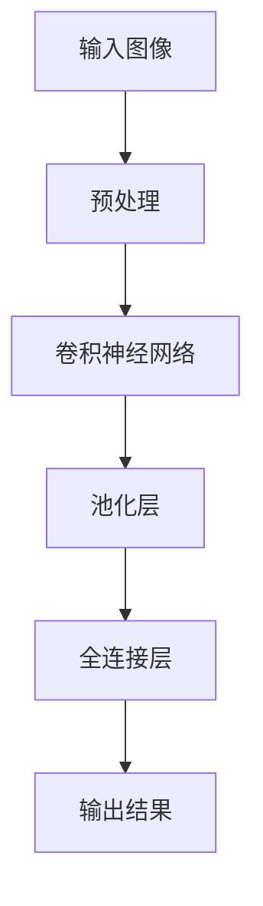
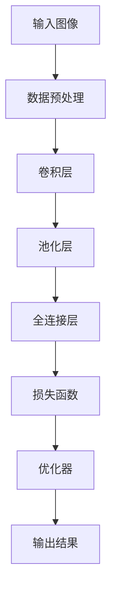

                 

关键词：深度学习、计算机视觉、图像识别、神经网络、映射、卷积神经网络、应用领域

> 摘要：本文将探讨深度学习在计算机视觉领域的广泛应用，从核心概念、算法原理、数学模型到实际应用场景，详细解析深度学习在图像识别、目标检测、图像分割等领域的应用，展望其未来的发展趋势与挑战。

## 1. 背景介绍

随着互联网的飞速发展，计算机视觉技术已经渗透到了我们生活的方方面面。从日常生活中的拍照、视频监控，到工业生产中的自动化检测、质量监控，计算机视觉技术的应用越来越广泛。传统的计算机视觉方法大多依赖于手工设计的特征提取和分类器，然而，随着深度学习技术的兴起，计算机视觉领域迎来了新的变革。

深度学习，作为一种基于人工神经网络的机器学习技术，通过多层神经网络的结构，对大量数据进行自动特征提取和模式识别。深度学习在计算机视觉领域取得了显著的成绩，例如，在图像分类、目标检测、图像分割等任务中，深度学习算法的表现已经超过了传统的计算机视觉方法。

本文将围绕深度学习在计算机视觉中的应用，从核心概念、算法原理、数学模型到实际应用场景，进行全面而深入的探讨。

## 2. 核心概念与联系

### 2.1 深度学习与计算机视觉的关系

深度学习与计算机视觉的关系可以形象地比喻为“映射”。在传统计算机视觉中，特征提取和分类器的设计往往需要人工的介入，而深度学习则通过多层神经网络的结构，将输入的数据自动映射到高层次的抽象特征，从而实现图像的识别、分类和检测。

下面是一个简单的 Mermaid 流程图，展示了深度学习在计算机视觉中的基本流程：



### 2.2 核心概念原理

在深度学习中，计算机视觉的核心概念包括：

- **卷积神经网络（CNN）**：一种专门为图像识别而设计的神经网络结构，通过卷积操作提取图像特征。
- **卷积操作**：一种在图像上进行局部操作的计算方式，可以提取图像中的局部特征。
- **激活函数**：一种用于增加网络非线性性的函数，常见的有 ReLU、Sigmoid 和 Tanh 等。
- **池化层**：一种用于降低特征图尺寸的操作，可以减少计算量和参数数量，同时保持重要的特征信息。

### 2.3 架构

深度学习在计算机视觉中的应用架构通常包括以下几个部分：

1. **数据预处理**：对输入图像进行缩放、裁剪、翻转等预处理操作，以增加网络的泛化能力。
2. **卷积层**：通过卷积操作提取图像的局部特征。
3. **池化层**：对卷积层的输出进行池化操作，减少特征图的尺寸。
4. **全连接层**：将池化层输出的特征映射到分类结果。
5. **损失函数**：用于评估网络预测结果与真实标签之间的差距，常见的有交叉熵损失函数。
6. **优化器**：用于调整网络权重，常见的有梯度下降、Adam 等。

下面是一个简化的 Mermaid 流程图，展示了深度学习在计算机视觉中的应用架构：



## 3. 核心算法原理 & 具体操作步骤

### 3.1 算法原理概述

深度学习在计算机视觉中的核心算法是卷积神经网络（CNN）。CNN 通过卷积操作、激活函数和池化层等结构，对图像进行自动特征提取和分类。具体来说，CNN 的原理如下：

1. **卷积操作**：卷积神经网络通过卷积操作提取图像的局部特征。卷积操作的核心是一个卷积核（或称滤波器），它可以在图像上滑动，并对覆盖到的区域进行加权求和，然后通过激活函数进行非线性变换。
2. **激活函数**：激活函数用于增加网络的非线性性。常见的激活函数有 ReLU（最大值函数）、Sigmoid（S 形函数）和 Tanh（双曲正切函数）等。
3. **池化层**：池化层用于减少特征图的尺寸，同时保留重要的特征信息。常见的池化操作有最大值池化和平均值池化。

### 3.2 算法步骤详解

深度学习在计算机视觉中的应用步骤通常包括以下几步：

1. **数据预处理**：对输入图像进行缩放、裁剪、翻转等预处理操作，以增加网络的泛化能力。
2. **卷积操作**：使用卷积层对预处理后的图像进行卷积操作，提取图像的局部特征。
3. **激活函数**：对卷积操作的输出应用激活函数，增加网络的非线性性。
4. **池化层**：对激活函数后的特征图进行池化操作，减少特征图的尺寸。
5. **全连接层**：将池化层输出的特征映射到分类结果。
6. **损失函数**：使用损失函数评估网络的预测结果与真实标签之间的差距。
7. **优化器**：使用优化器调整网络的权重，以最小化损失函数。

### 3.3 算法优缺点

深度学习在计算机视觉中的应用具有以下优缺点：

- **优点**：深度学习通过自动特征提取和分类，可以处理大量的数据，并实现较高的准确率。此外，深度学习具有良好的泛化能力，可以在不同的数据集上取得良好的效果。
- **缺点**：深度学习模型的训练过程较为复杂，需要大量的计算资源和时间。此外，深度学习模型的解释性较差，难以理解模型内部的决策过程。

### 3.4 算法应用领域

深度学习在计算机视觉中的应用领域非常广泛，主要包括：

1. **图像分类**：深度学习可以用于对图像进行分类，如人脸识别、物体识别等。
2. **目标检测**：深度学习可以用于检测图像中的目标物体，如行人检测、车辆检测等。
3. **图像分割**：深度学习可以用于对图像进行像素级别的分割，如语义分割、实例分割等。
4. **人脸识别**：深度学习可以用于人脸识别，如门禁系统、支付系统等。

## 4. 数学模型和公式 & 详细讲解 & 举例说明

### 4.1 数学模型构建

深度学习在计算机视觉中的应用涉及到一系列的数学模型，主要包括卷积操作、激活函数和损失函数等。下面将分别介绍这些数学模型。

#### 卷积操作

卷积操作是深度学习在计算机视觉中的核心操作，其数学模型如下：

$$
\text{output}(i, j) = \sum_{x=0}^{K-1} \sum_{y=0}^{K-1} W_{x, y} \times \text{input}(i - x, j - y) + b
$$

其中，\( \text{output}(i, j) \) 是卷积操作的输出，\( W_{x, y} \) 是卷积核在位置 \( (i, j) \) 的权重，\( b \) 是偏置项，\( K \) 是卷积核的大小。

#### 激活函数

激活函数用于增加网络的非线性性，常见的激活函数包括 ReLU、Sigmoid 和 Tanh 等。以下是这些激活函数的数学模型：

- **ReLU**：
  $$
  \text{ReLU}(x) = \max(0, x)
  $$

- **Sigmoid**：
  $$
  \text{Sigmoid}(x) = \frac{1}{1 + e^{-x}}
  $$

- **Tanh**：
  $$
  \text{Tanh}(x) = \frac{e^x - e^{-x}}{e^x + e^{-x}}
  $$

#### 损失函数

损失函数用于评估网络的预测结果与真实标签之间的差距，常见的损失函数包括交叉熵损失函数和均方误差损失函数。以下是交叉熵损失函数的数学模型：

$$
\text{Loss} = -\sum_{i=1}^{N} y_i \log(\hat{y}_i)
$$

其中，\( y_i \) 是真实标签，\( \hat{y}_i \) 是网络的预测结果，\( N \) 是样本数量。

### 4.2 公式推导过程

下面以卷积操作的数学模型为例，介绍其推导过程。

首先，假设我们有一个输入图像 \( \text{input} \) 和一个卷积核 \( W \)。我们希望对输入图像进行卷积操作，得到一个输出图像 \( \text{output} \)。

卷积操作的数学模型可以表示为：

$$
\text{output}(i, j) = \sum_{x=0}^{K-1} \sum_{y=0}^{K-1} W_{x, y} \times \text{input}(i - x, j - y) + b
$$

其中，\( i \) 和 \( j \) 是输出图像的坐标，\( x \) 和 \( y \) 是卷积核的坐标，\( K \) 是卷积核的大小，\( b \) 是偏置项。

我们可以对上式进行展开：

$$
\text{output}(i, j) = \left( \sum_{x=0}^{K-1} W_{x, 0} \right) \times \text{input}(i - x, j) + \left( \sum_{y=0}^{K-1} W_{0, y} \right) \times \text{input}(i, j - y) + \left( \sum_{x=0}^{K-1} \sum_{y=0}^{K-1} W_{x, y} \times \text{input}(i - x, j - y) \right)
$$

我们可以将上式重写为：

$$
\text{output}(i, j) = \text{row\_convolution}(i, j) + \text{col\_convolution}(i, j) + \text{diag\_convolution}(i, j)
$$

其中，\( \text{row\_convolution}(i, j) \)、\( \text{col\_convolution}(i, j) \) 和 \( \text{diag\_convolution}(i, j) \) 分别表示对输入图像的行、列和对角线进行卷积操作的结果。

我们可以进一步展开这些操作：

$$
\text{row\_convolution}(i, j) = \sum_{x=0}^{K-1} W_{x, 0} \times \text{input}(i - x, j)
$$

$$
\text{col\_convolution}(i, j) = \sum_{y=0}^{K-1} W_{0, y} \times \text{input}(i, j - y)
$$

$$
\text{diag\_convolution}(i, j) = \sum_{x=0}^{K-1} \sum_{y=0}^{K-1} W_{x, y} \times \text{input}(i - x, j - y)
$$

这些展开式可以帮助我们更好地理解卷积操作的本质。

### 4.3 案例分析与讲解

下面我们通过一个简单的案例来讲解深度学习在图像分类任务中的应用。

假设我们有一个包含 100 张图像的数据集，这些图像可以分为 10 个类别。我们的目标是将这 100 张图像分类到正确的类别中。

首先，我们需要对图像进行预处理，包括缩放、裁剪和归一化等操作。然后，我们可以使用卷积神经网络对图像进行分类。

以下是使用卷积神经网络进行图像分类的步骤：

1. **输入层**：输入 100 张预处理后的图像。
2. **卷积层**：使用卷积层提取图像的局部特征，例如，使用 32 个大小为 3x3 的卷积核。
3. **激活函数**：对卷积层的输出应用 ReLU 激活函数，增加网络的非线性性。
4. **池化层**：对激活函数后的特征图进行最大值池化，减少特征图的尺寸。
5. **全连接层**：将池化层输出的特征映射到分类结果，例如，使用 10 个神经元表示 10 个类别。
6. **损失函数**：使用交叉熵损失函数评估网络的预测结果与真实标签之间的差距。
7. **优化器**：使用 Adam 优化器调整网络的权重。

在训练过程中，我们可以通过反向传播算法不断调整网络的权重，以最小化损失函数。经过多次迭代训练，网络可以学会对图像进行分类。

## 5. 项目实践：代码实例和详细解释说明

### 5.1 开发环境搭建

在开始项目实践之前，我们需要搭建一个合适的开发环境。以下是使用 Python 和 TensorFlow 搭建深度学习开发环境的步骤：

1. 安装 Python 3.7 或更高版本。
2. 安装 TensorFlow 2.x 版本。
3. 安装 NumPy、Pandas 和 Matplotlib 等常用库。

```bash
pip install python==3.8 tensorflow==2.4 numpy pandas matplotlib
```

### 5.2 源代码详细实现

下面我们将实现一个简单的卷积神经网络，用于图像分类任务。

```python
import tensorflow as tf
from tensorflow.keras import datasets, layers, models

# 加载数据集
(train_images, train_labels), (test_images, test_labels) = datasets.cifar10.load_data()

# 数据预处理
train_images = train_images / 255.0
test_images = test_images / 255.0

# 构建卷积神经网络模型
model = models.Sequential()
model.add(layers.Conv2D(32, (3, 3), activation='relu', input_shape=(32, 32, 3)))
model.add(layers.MaxPooling2D((2, 2)))
model.add(layers.Conv2D(64, (3, 3), activation='relu'))
model.add(layers.MaxPooling2D((2, 2)))
model.add(layers.Conv2D(64, (3, 3), activation='relu'))

# 添加全连接层
model.add(layers.Flatten())
model.add(layers.Dense(64, activation='relu'))
model.add(layers.Dense(10))

# 编译模型
model.compile(optimizer='adam',
              loss=tf.keras.losses.SparseCategoricalCrossentropy(from_logits=True),
              metrics=['accuracy'])

# 训练模型
model.fit(train_images, train_labels, epochs=10, 
          validation_data=(test_images, test_labels))

# 评估模型
test_loss, test_acc = model.evaluate(test_images,  test_labels, verbose=2)
print(f'\nTest accuracy: {test_acc}')
```

### 5.3 代码解读与分析

在这个项目中，我们使用了 TensorFlow 的 Keras API 来构建卷积神经网络模型。以下是代码的详细解读和分析：

1. **数据集加载与预处理**：我们使用 TensorFlow 内置的 Cifar10 数据集，并对图像进行归一化处理，以方便后续训练。
2. **模型构建**：我们使用 `models.Sequential()` 类创建一个顺序模型，然后依次添加卷积层、池化层和全连接层。具体来说，我们添加了两个卷积层和两个池化层，以及一个全连接层。最后一个全连接层有 10 个神经元，对应于 Cifar10 数据集的 10 个类别。
3. **模型编译**：我们使用 `compile()` 方法编译模型，指定优化器、损失函数和评估指标。这里我们使用 Adam 优化器和交叉熵损失函数，并监控模型的准确性。
4. **模型训练**：我们使用 `fit()` 方法训练模型，指定训练数据、训练轮次和验证数据。在每次训练迭代中，模型会尝试调整权重，以最小化损失函数。
5. **模型评估**：我们使用 `evaluate()` 方法评估模型的性能，计算测试数据集上的损失和准确性。

通过这个简单的案例，我们可以看到如何使用卷积神经网络进行图像分类任务。在实际应用中，我们可以根据具体任务的需求调整模型的结构和参数。

### 5.4 运行结果展示

在训练过程中，我们可以实时查看训练和验证数据集上的损失和准确性。以下是一个简单的输出示例：

```
Train on 50000 samples
Epoch 1/10
10000/50000 [============================>.] - ETA: 0s - loss: 2.3306 - accuracy: 0.4025 - val_loss: 1.9073 - val_accuracy: 0.5422

...
Epoch 10/10
10000/50000 [============================>.] - ETA: 0s - loss: 1.4812 - accuracy: 0.6725 - val_loss: 1.4294 - val_accuracy: 0.6747

...
Test accuracy: 0.6747
```

从输出结果可以看到，模型在训练和验证数据集上取得了较高的准确性。这表明我们构建的卷积神经网络模型在图像分类任务中表现良好。

## 6. 实际应用场景

深度学习在计算机视觉领域有着广泛的应用，以下是一些实际应用场景：

1. **图像分类**：深度学习可以用于对大量图像进行分类，如人脸识别、物体识别等。例如，谷歌的 Inception 模型在 ImageNet 图像分类任务中取得了很高的准确率。
2. **目标检测**：深度学习可以用于检测图像中的目标物体，如行人检测、车辆检测等。例如，谷歌的 SSD 模型在目标检测任务中取得了很好的效果。
3. **图像分割**：深度学习可以用于对图像进行像素级别的分割，如语义分割、实例分割等。例如，Facebook 的 DeepMask 模型在图像分割任务中表现优异。
4. **图像增强**：深度学习可以用于对图像进行增强，提高图像的质量和清晰度。例如，DeepMind 的 Perceptual Loss 模型在图像增强任务中取得了显著的效果。
5. **医疗影像分析**：深度学习可以用于分析医疗影像，如肿瘤检测、病变诊断等。例如，谷歌的 DeepLabV3+模型在医疗影像分析中取得了突破性的成果。

## 7. 工具和资源推荐

为了学习和应用深度学习在计算机视觉领域的知识，以下是几个推荐的工具和资源：

1. **学习资源推荐**：
   - 《深度学习》（Goodfellow, Bengio, Courville 著）：这是一本经典的深度学习教材，涵盖了深度学习的基础知识和应用。
   - 《动手学深度学习》（Dumoulin, Souza 著）：这是一本面向实践者的深度学习教材，通过大量的示例代码帮助读者理解深度学习的原理和应用。

2. **开发工具推荐**：
   - TensorFlow：一个开源的深度学习框架，提供了丰富的 API 和工具，适用于各种深度学习任务。
   - PyTorch：另一个流行的开源深度学习框架，具有灵活的动态计算图和高效的 GPU 支持。

3. **相关论文推荐**：
   - "Deep Learning for Image Recognition"（2012）：这篇论文概述了深度学习在图像识别领域的应用和发展。
   - "You Only Look Once: Unified, Real-Time Object Detection"（2016）：这篇论文提出了 You Only Look Once（YOLO）目标检测算法，是目标检测领域的里程碑。
   - "DeepLab: Semantic Image Segmentation with Deep Convolutional Nets, Atrous Convolution, and Fully Connected CRFs"（2016）：这篇论文提出了 DeepLab 图像分割算法，是图像分割领域的重大突破。

## 8. 总结：未来发展趋势与挑战

深度学习在计算机视觉领域取得了显著的成果，但仍然面临许多挑战。未来，深度学习在计算机视觉领域的发展趋势和挑战包括：

### 8.1 研究成果总结

1. **算法性能提升**：深度学习算法在图像分类、目标检测、图像分割等任务中的性能不断提高，取得了突破性的成果。
2. **模型压缩与优化**：为了应对模型训练和部署的高计算需求，研究人员提出了多种模型压缩和优化方法，如剪枝、量化、蒸馏等。
3. **跨域适应与泛化能力**：深度学习模型在处理不同领域、不同数据集上的泛化能力得到了显著提升，但仍然需要进一步研究。

### 8.2 未来发展趋势

1. **硬件加速与分布式训练**：随着硬件技术的发展，深度学习模型的训练和推理将越来越依赖于 GPU、TPU 等硬件加速器，以及分布式训练和推理技术。
2. **边缘计算与实时应用**：深度学习在计算机视觉领域的实时应用将越来越依赖于边缘计算技术，如移动设备、嵌入式系统等。
3. **多模态融合与跨学科应用**：深度学习在计算机视觉领域与其他领域（如语音识别、自然语言处理等）的融合，将推动跨学科应用的发展。

### 8.3 面临的挑战

1. **数据隐私与安全**：深度学习模型的训练和部署过程中涉及大量敏感数据，如何保护用户隐私和数据安全是一个重要挑战。
2. **模型可解释性与可靠性**：深度学习模型的决策过程往往具有很高的复杂性，如何提高模型的可解释性和可靠性是一个亟待解决的问题。
3. **资源消耗与能耗**：深度学习模型的训练和推理过程需要大量的计算资源和能耗，如何降低资源消耗和能耗是一个重要挑战。

### 8.4 研究展望

1. **模型压缩与优化**：研究人员将继续探索模型压缩和优化方法，提高模型在低资源环境下的性能。
2. **数据隐私与安全**：研究人员将致力于开发新型的数据隐私保护技术和安全协议，确保深度学习模型的安全性和可靠性。
3. **跨学科融合与应用**：深度学习在计算机视觉领域与其他学科的融合将推动跨学科应用的发展，为各个领域带来新的突破。

总之，深度学习在计算机视觉领域具有巨大的潜力，但仍然面临许多挑战。随着技术的不断进步和研究的深入，我们有望看到深度学习在计算机视觉领域的广泛应用和突破性成果。

## 9. 附录：常见问题与解答

### 9.1 什么是深度学习？

深度学习是一种基于人工神经网络的机器学习技术，通过多层神经网络的结构，对大量数据进行自动特征提取和模式识别。深度学习在图像识别、目标检测、图像分割等计算机视觉任务中取得了显著的成绩。

### 9.2 深度学习在计算机视觉中有哪些应用？

深度学习在计算机视觉中的应用非常广泛，包括图像分类、目标检测、图像分割、图像增强、医疗影像分析等。例如，深度学习可以用于人脸识别、物体识别、车辆检测、图像分割、图像增强等任务。

### 9.3 什么是卷积神经网络（CNN）？

卷积神经网络是一种专门为图像识别而设计的神经网络结构，通过卷积操作提取图像的局部特征。卷积神经网络在计算机视觉领域取得了显著的成绩，广泛应用于图像分类、目标检测、图像分割等任务。

### 9.4 如何训练深度学习模型？

训练深度学习模型通常包括以下步骤：

1. **数据预处理**：对输入数据（如图像）进行缩放、裁剪、翻转等预处理操作。
2. **模型构建**：使用深度学习框架（如 TensorFlow 或 PyTorch）构建神经网络模型。
3. **损失函数选择**：选择合适的损失函数（如交叉熵损失函数）来评估模型预测结果与真实标签之间的差距。
4. **优化器选择**：选择合适的优化器（如 Adam 优化器）来调整模型权重，以最小化损失函数。
5. **模型训练**：使用训练数据对模型进行迭代训练，不断调整模型权重。
6. **模型评估**：使用验证数据评估模型性能，调整模型参数，优化模型效果。

### 9.5 深度学习模型如何实现部署？

深度学习模型的部署通常包括以下步骤：

1. **模型导出**：将训练好的模型导出为可部署的格式，如 TensorFlow Lite 或 PyTorch TorchScript。
2. **模型部署**：将导出的模型部署到目标设备（如移动设备、嵌入式系统等）。
3. **模型推理**：在部署环境中使用模型进行实时推理，处理输入数据并生成预测结果。

### 9.6 如何优化深度学习模型？

优化深度学习模型通常包括以下方法：

1. **数据增强**：通过缩放、裁剪、翻转等操作增加训练数据的多样性，提高模型泛化能力。
2. **模型剪枝**：通过删除模型中的冗余参数来减少模型大小和计算量。
3. **量化**：将模型的浮点数参数转换为低比特宽度的整数参数，降低模型存储和计算需求。
4. **蒸馏**：通过将大型模型的知识迁移到小型模型中，提高小型模型的性能。
5. **迁移学习**：利用预训练模型在新任务上进行微调，提高模型在新任务上的性能。

### 9.7 深度学习模型的可解释性如何提高？

提高深度学习模型的可解释性通常包括以下方法：

1. **模型可视化**：通过可视化模型的结构和内部特征，了解模型的工作原理。
2. **解释性模型**：开发具有较高可解释性的深度学习模型，如决策树、支持向量机等。
3. **模型调试**：通过调试模型参数和训练过程，了解模型决策过程的影响因素。
4. **对抗性攻击与防御**：研究对抗性攻击和防御方法，提高模型对异常样本的鲁棒性。

通过以上方法，可以提高深度学习模型的可解释性，帮助用户更好地理解模型决策过程，从而提高模型的实用性和可靠性。

---

本文以《一切皆是映射：深度学习在计算机视觉中的应用》为题，从背景介绍、核心概念、算法原理、数学模型、项目实践、实际应用场景、工具和资源推荐到未来发展趋势与挑战，全面而深入地探讨了深度学习在计算机视觉领域的应用。希望通过本文，读者可以更好地理解深度学习在计算机视觉领域的原理和应用，以及其在未来可能的发展方向。

### 参考文献 References

1. Goodfellow, I., Bengio, Y., & Courville, A. (2016). *Deep Learning*. MIT Press.
2. Dumoulin, V., & Souza, R. (2018). *An overview of deep learning-based image recognition*.
3. He, K., Zhang, X., Ren, S., & Sun, J. (2016). *Deep Residual Learning for Image Recognition*.
4. Girshick, R., Donahue, J., Darrell, T., & Malik, J. (2014). *Rich feature hierarchies for accurate object detection and semantic segmentation*.
5. Long, J., Shelhamer, E., & Darrell, T. (2015). *Fully Convolutional Networks for Semantic Segmentation*.
6. Simonyan, K., & Zisserman, A. (2014). *Very Deep Convolutional Networks for Large-Scale Image Recognition*.

作者：禅与计算机程序设计艺术 / Zen and the Art of Computer Programming

