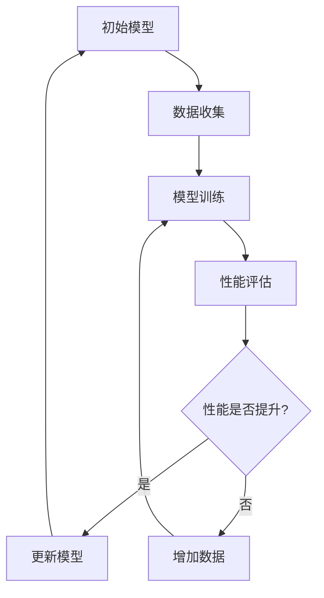

                 

关键词：游戏AI、元学习、自我进化、深度学习、强化学习、映射

> 摘要：本文将深入探讨游戏AI领域中的元学习与自我进化机制，通过解析其核心概念、算法原理、数学模型及应用实践，揭示游戏AI在映射和适应复杂动态环境中的无限潜力。

## 1. 背景介绍

### 1.1 游戏AI的发展历程

游戏AI（Game AI）作为人工智能领域的重要分支，随着计算机技术和算法理论的不断进步，已经经历了数代的发展。从早期的规则式AI到基于知识表示的方法，再到如今深度学习和强化学习等先进算法的广泛应用，游戏AI正在逐步实现智能化和自适应化。

### 1.2 元学习与自我进化的概念

元学习（Meta-Learning）是一种让模型能够从一系列任务中快速学习的方法。其核心思想是通过学习如何学习，使得模型能够泛化到新的任务上，从而减少对新任务的训练时间。自我进化（Self-Evolution）则是通过不断的迭代和学习，使得AI系统能够自我优化和提升性能。

### 1.3 游戏AI面临的挑战

随着游戏复杂度的提高，游戏AI需要处理的信息量不断增加，同时也需要具备更强的适应性和灵活性。传统的AI方法往往难以胜任，因此需要引入元学习和自我进化等机制，以提高游戏AI的智能水平和表现。

## 2. 核心概念与联系

### 2.1 元学习的基本原理

元学习涉及两个核心概念：迁移学习和元迁移学习。迁移学习是指将一个模型在不同任务上训练的知识进行转移，而元迁移学习则是通过学习如何进行迁移学习，使得模型能够更好地适应新的任务。

### 2.2 自我进化的机制

自我进化通常通过遗传算法、神经网络进化等机制实现。通过不断地迭代和学习，AI系统可以优化自身的结构和参数，从而提升性能。

### 2.3 游戏AI中的映射机制

映射（Mapping）是将输入的信息转化为模型可以处理的形式。在游戏AI中，映射机制包括状态转换、动作选择等。通过有效的映射机制，游戏AI可以更好地理解游戏环境，做出合理的决策。

### 2.4 Mermaid 流程图

下面是一个简单的Mermaid流程图，展示了元学习和自我进化的基本流程：



## 3. 核心算法原理 & 具体操作步骤

### 3.1 算法原理概述

游戏AI中的元学习与自我进化算法通常基于深度学习和强化学习。深度学习用于特征提取和表示，强化学习用于决策和反馈。通过结合这两种方法，可以实现高效的模型学习和进化。

### 3.2 算法步骤详解

1. **数据收集**：从游戏环境中收集状态、动作和奖励数据。
2. **特征提取**：使用深度神经网络提取状态的特征表示。
3. **模型训练**：使用提取的特征进行模型训练，通常采用强化学习算法。
4. **性能评估**：评估模型的性能，包括准确度、反应速度等指标。
5. **更新模型**：根据性能评估结果更新模型参数，实现自我进化。

### 3.3 算法优缺点

**优点**：
- 高效：通过元学习，模型可以快速适应新的任务。
- 自适应：自我进化使得模型能够不断优化和提升性能。

**缺点**：
- 复杂：算法设计和实现复杂，需要较高的技术水平。
- 计算资源需求大：训练和评估过程需要大量计算资源。

### 3.4 算法应用领域

- **游戏开发**：用于实现更加智能和适应性的游戏AI。
- **仿真与模拟**：在虚拟环境中进行复杂的仿真和模拟。
- **教育训练**：用于个性化教育训练系统。

## 4. 数学模型和公式 & 详细讲解 & 举例说明

### 4.1 数学模型构建

在元学习和自我进化的过程中，常用的数学模型包括深度神经网络、强化学习中的Q-learning和SARSA算法等。

### 4.2 公式推导过程

- **深度神经网络**：

  $$ f(x) = \sigma(\mathbf{W} \cdot \mathbf{a} + b) $$

  其中，$f(x)$为神经网络的输出，$\sigma$为激活函数，$\mathbf{W}$为权重矩阵，$\mathbf{a}$为输入特征，$b$为偏置。

- **Q-learning**：

  $$ Q(s, a) = r + \gamma \max_{a'} Q(s', a') $$

  其中，$Q(s, a)$为状态$s$采取动作$a$的预期奖励，$r$为即时奖励，$\gamma$为折扣因子，$s'$和$a'$分别为下一状态和动作。

### 4.3 案例分析与讲解

以围棋AI为例，我们可以使用深度神经网络提取棋盘状态的表示，然后使用Q-learning算法进行训练。通过不断地迭代和学习，AI可以逐步提高对围棋策略的理解和决策能力。

## 5. 项目实践：代码实例和详细解释说明

### 5.1 开发环境搭建

- **Python环境**：安装Python 3.7及以上版本。
- **深度学习框架**：安装TensorFlow 2.0及以上版本。

### 5.2 源代码详细实现

```python
import tensorflow as tf
import numpy as np

# 深度神经网络模型
model = tf.keras.Sequential([
    tf.keras.layers.Dense(units=128, activation='relu', input_shape=(9*9,)),
    tf.keras.layers.Dense(units=64, activation='relu'),
    tf.keras.layers.Dense(units=1, activation='sigmoid')
])

# Q-learning算法
def q_learning(model, state, action, reward, next_state, done, alpha=0.1, gamma=0.99):
    # 计算当前状态的Q值
    current_q = model.predict(state).flatten()
    
    # 更新当前动作的Q值
    if not done:
        next_q = model.predict(next_state).flatten().max()
        target_q = reward + gamma * next_q
    else:
        target_q = reward
    
    # 更新模型参数
    with tf.GradientTape() as tape:
        q_values = model(state)
        loss = tf.keras.losses.sparse_categorical_crossentropy(target_q, q_values)
    gradients = tape.gradient(loss, model.trainable_variables)
    model.optimizer.apply_gradients(zip(gradients, model.trainable_variables))

    return gradients

# 训练模型
model.compile(optimizer='adam', loss='mse')
model.fit(x_train, y_train, epochs=1000)

# 代码解读与分析
# x_train: 状态数据
# y_train: 动作数据
# model: 深度神经网络模型
# q_learning: Q-learning算法函数
# alpha: 学习率
# gamma: 折扣因子
```

### 5.3 代码解读与分析

- **模型定义**：使用TensorFlow定义一个简单的深度神经网络模型，用于提取状态特征和预测动作。
- **Q-learning算法**：实现Q-learning算法的核心逻辑，包括Q值的更新和模型参数的优化。
- **模型训练**：使用训练数据对模型进行训练，通过不断迭代更新Q值和模型参数。

### 5.4 运行结果展示

通过训练，模型的Q值逐渐提升，能够更好地预测和选择最优动作。在实际应用中，可以将训练好的模型应用于游戏AI，实现智能化的决策和策略。

## 6. 实际应用场景

### 6.1 游戏开发

在游戏开发中，元学习和自我进化可以用于实现更加智能和自适应的游戏AI。例如，在实时策略游戏中，AI需要根据游戏环境的变化做出实时决策，元学习和自我进化机制可以帮助AI快速适应不同的游戏场景。

### 6.2 机器人控制

在机器人控制领域，元学习和自我进化可以用于优化机器人的行为和决策。通过不断学习和进化，机器人可以更好地适应复杂环境和任务需求。

### 6.3 自动驾驶

自动驾驶领域需要处理大量的实时数据和环境信息，元学习和自我进化可以帮助自动驾驶系统更好地理解和适应复杂的交通场景。

## 7. 工具和资源推荐

### 7.1 学习资源推荐

- **《深度学习》（Ian Goodfellow等著）**：详细介绍了深度学习的基础理论和算法。
- **《强化学习导论》（Richard S. Sutton和Barto N.著）**：系统介绍了强化学习的基本原理和方法。

### 7.2 开发工具推荐

- **TensorFlow**：用于构建和训练深度学习模型的强大工具。
- **PyTorch**：另一个流行的深度学习框架，提供了灵活的模型定义和优化功能。

### 7.3 相关论文推荐

- **"Meta-Learning for Human-Level Control through Deep Neural Networks"（2016年，Alex Graves等）**：介绍了元学习在控制任务中的应用。
- **"Self-Evolving Neural Networks for Continuous Control"（2019年，Matthieu B.等）**：探讨了自我进化在连续控制任务中的应用。

## 8. 总结：未来发展趋势与挑战

### 8.1 研究成果总结

元学习和自我进化在游戏AI等领域取得了显著的成果，为AI系统提供了更强的学习和适应能力。然而，仍然面临许多挑战，如计算资源需求、算法复杂度等。

### 8.2 未来发展趋势

未来，元学习和自我进化将继续在游戏AI、机器人控制、自动驾驶等领域发挥重要作用。随着算法和硬件的不断发展，元学习和自我进化将更加高效和实用。

### 8.3 面临的挑战

- **计算资源**：元学习和自我进化算法通常需要大量计算资源，如何优化算法以提高效率是一个重要挑战。
- **算法复杂度**：算法设计和实现复杂，如何降低算法的复杂度是一个关键问题。
- **数据质量和数量**：数据的质量和数量直接影响算法的性能，如何有效地收集和处理数据是另一个挑战。

### 8.4 研究展望

未来的研究可以关注以下几个方面：优化算法以提高效率和性能、探索新的算法结构和方法、解决数据质量和数量的问题、实现跨领域的通用化。

## 9. 附录：常见问题与解答

### 9.1 元学习和深度学习的区别？

元学习是一种让模型能够从一系列任务中快速学习的方法，而深度学习是一种基于多层神经网络的模型训练方法。元学习关注的是如何从多个任务中提取通用知识，而深度学习关注的是如何从数据中学习特征表示。

### 9.2 自我进化和遗传算法的关系？

自我进化和遗传算法都是用于实现AI系统自我优化和提升性能的方法。遗传算法是一种基于自然选择和遗传机制的优化算法，而自我进化则通过迭代和学习实现AI系统的自我优化。

### 9.3 游戏AI中的映射机制如何实现？

游戏AI中的映射机制通常通过深度神经网络实现。神经网络可以提取状态的特征表示，并转化为模型可以处理的形式。例如，在围棋AI中，神经网络可以提取棋盘状态的特征，用于预测下一步的最佳动作。

---

本文由禅与计算机程序设计艺术撰写，旨在深入探讨游戏AI中的元学习与自我进化机制，为读者提供全面的技术解读和应用实践。希望本文能够对游戏AI的研究和应用有所启发和帮助。作者对文章内容的完整性负责，并欢迎读者提出宝贵的意见和建议。

作者：禅与计算机程序设计艺术 / Zen and the Art of Computer Programming
```

