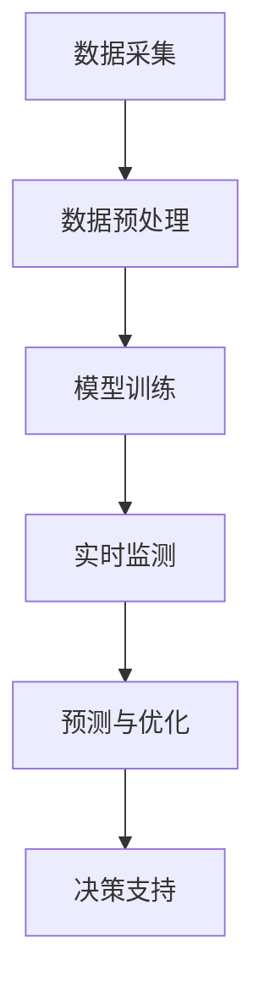

                 

关键词：环境监测、神经网络、算法应用、数据分析、AI技术

> 摘要：本文旨在探讨神经网络算法在环境监测领域的应用，通过对环境数据的实时监测与分析，提供有效的环境管理决策支持。文章将详细介绍神经网络算法的基本原理、数学模型、具体实现步骤以及其在环境监测中的实际应用，并对未来发展趋势和挑战进行展望。

## 1. 背景介绍

随着全球气候变化和环境问题的日益严重，环境监测成为社会可持续发展的重要组成部分。环境监测的核心在于对环境数据的实时采集、处理和分析，从而为环境管理提供科学依据。然而，传统的环境监测方法在处理复杂、多维的环境数据时存在诸多局限性，难以满足现代环境监测的需求。因此，将人工智能技术，特别是神经网络算法引入环境监测领域，成为一种新的发展趋势。

神经网络算法具有强大的自适应能力和非线性建模能力，可以有效地处理复杂的环境数据，提高环境监测的准确性和实时性。本文将详细探讨神经网络算法在环境监测中的应用，以期推动该领域的科技进步。

## 2. 核心概念与联系

### 2.1 神经网络算法基本原理

神经网络算法是一种模仿人脑神经元之间连接和交互的模型，通过学习输入和输出之间的映射关系，实现对数据的分类、预测和优化。神经网络由输入层、隐藏层和输出层组成，其中每个神经元都与相邻的神经元相连接，并通过权重和偏置进行调整。

### 2.2 环境监测中的神经网络架构

在环境监测中，神经网络算法的应用主要包括以下几个方面：

1. **数据预处理**：通过神经网络算法对原始环境数据进行预处理，包括噪声过滤、数据归一化和特征提取等。
2. **实时监测**：利用神经网络模型对环境数据进行实时监测，实现对环境污染物的快速检测和预警。
3. **预测与优化**：基于历史环境数据，利用神经网络模型进行预测，为环境管理决策提供科学依据。

### 2.3 Mermaid 流程图



## 3. 核心算法原理 & 具体操作步骤

### 3.1 算法原理概述

神经网络算法的核心在于其非线性映射能力和自适应学习特性。具体来说，神经网络通过以下步骤实现数据的处理和分析：

1. **数据输入**：将环境数据输入到神经网络中。
2. **前向传播**：将输入数据通过神经元传递，计算输出结果。
3. **反向传播**：根据输出结果与实际值的差异，调整神经网络的权重和偏置。
4. **优化目标**：通过优化目标函数，使神经网络的输出结果更接近实际值。

### 3.2 算法步骤详解

1. **数据预处理**：
   - 噪声过滤：采用均值滤波、中值滤波等方法去除环境数据中的噪声。
   - 数据归一化：通过归一化处理，将不同量纲的数据转换为同一量纲，便于后续处理。
   - 特征提取：提取环境数据中的关键特征，如温度、湿度、污染物浓度等。

2. **模型训练**：
   - 初始化神经网络结构：设定输入层、隐藏层和输出层的神经元数量。
   - 选择合适的优化算法：如梯度下降法、随机梯度下降法等。
   - 训练神经网络：通过前向传播和反向传播，不断调整神经网络的权重和偏置，使其对环境数据具有良好的拟合能力。

3. **实时监测**：
   - 输入实时环境数据到训练好的神经网络模型中。
   - 利用神经网络模型对实时环境数据进行处理和分析，实现对环境污染物的快速检测和预警。

4. **预测与优化**：
   - 基于历史环境数据，利用神经网络模型进行环境变化趋势预测。
   - 根据预测结果，优化环境管理策略，提高环境监测的准确性和实时性。

### 3.3 算法优缺点

**优点**：
- **非线性建模能力强**：能够处理复杂的环境数据，实现对环境污染物的准确检测和预测。
- **自适应学习特性**：能够根据环境数据的变化，不断优化自身的性能。

**缺点**：
- **计算复杂度高**：神经网络模型在训练和预测过程中需要大量的计算资源。
- **模型解释性差**：神经网络模型通常缺乏直观的解释性，难以理解其内部机制。

### 3.4 算法应用领域

神经网络算法在环境监测领域具有广泛的应用，如：

- **空气质量监测**：利用神经网络模型对空气中的污染物浓度进行实时监测和预测。
- **水质监测**：通过神经网络模型对水体中的污染物进行检测和预警。
- **气候变化监测**：利用神经网络模型对气候数据进行预测，为气候变化研究提供支持。

## 4. 数学模型和公式 & 详细讲解 & 举例说明

### 4.1 数学模型构建

神经网络算法的核心在于其数学模型，包括前向传播和反向传播两个过程。以下为神经网络模型的数学公式：

$$
Z^{[l]} = \sigma(W^{[l]}X^{[l-1]} + b^{[l]})
$$

$$
A^{[l]} = \sigma(Z^{[l]})
$$

$$
\Delta W^{[l]} = \alpha \cdot A^{[l]} \cdot (1 - A^{[l]}) \cdot \Delta Z^{[l]}
$$

$$
\Delta b^{[l]} = \alpha \cdot A^{[l]} \cdot (1 - A^{[l]}) \cdot \Delta Z^{[l]}
$$

其中，$Z^{[l]}$表示第$l$层的输出，$A^{[l]}$表示第$l$层的激活值，$\sigma$表示激活函数，$W^{[l]}$和$b^{[l]}$分别表示第$l$层的权重和偏置，$\alpha$表示学习率，$\Delta Z^{[l]}$表示误差。

### 4.2 公式推导过程

神经网络模型的公式推导涉及复杂的数学过程，主要包括以下几个方面：

1. **前向传播**：将输入数据通过神经网络层传递，计算各层的输出。
2. **反向传播**：根据输出误差，逆向传播误差到各层，计算各层的梯度。
3. **梯度下降**：利用梯度下降法，更新神经网络的权重和偏置，最小化误差。

### 4.3 案例分析与讲解

假设我们有一个简单的神经网络模型，用于预测空气质量指数（AQI）。输入层包含温度、湿度、二氧化碳浓度等特征，隐藏层包含10个神经元，输出层为AQI。

- **前向传播**：输入数据通过输入层传递到隐藏层，再通过隐藏层传递到输出层，计算输出结果。

$$
Z^{[1]} = \sigma(W^{[1]}X^{[0]} + b^{[1]})
$$

$$
A^{[1]} = \sigma(Z^{[1]})
$$

$$
Z^{[2]} = W^{[2]}A^{[1]} + b^{[2]}
$$

$$
A^{[2]} = \sigma(Z^{[2]})
$$

- **反向传播**：计算输出误差，逆向传播误差到隐藏层和输入层，更新权重和偏置。

$$
\Delta Z^{[2]} = A^{[2]} - y
$$

$$
\Delta W^{[2]} = \alpha \cdot A^{[1]} \cdot (1 - A^{[1]}) \cdot \Delta Z^{[2]}
$$

$$
\Delta b^{[2]} = \alpha \cdot A^{[1]} \cdot (1 - A^{[1]}) \cdot \Delta Z^{[2]}
$$

$$
\Delta Z^{[1]} = W^{[2]T} \cdot \Delta Z^{[2]}
$$

$$
\Delta W^{[1]} = \alpha \cdot X^{[0]} \cdot (1 - A^{[1]}) \cdot \Delta Z^{[1]}
$$

$$
\Delta b^{[1]} = \alpha \cdot X^{[0]} \cdot (1 - A^{[1]}) \cdot \Delta Z^{[1]}
$$

通过上述步骤，我们可以不断调整神经网络的权重和偏置，使其对空气质量指数的预测结果更准确。

## 5. 项目实践：代码实例和详细解释说明

### 5.1 开发环境搭建

在进行神经网络算法在环境监测中的应用实践前，我们需要搭建一个合适的开发环境。以下是一个基于Python和TensorFlow的简单示例。

- 安装Python（建议版本3.8以上）
- 安装TensorFlow
- 安装其他依赖库，如NumPy、Pandas等

### 5.2 源代码详细实现

以下是一个简单的神经网络模型，用于空气质量指数（AQI）的预测。

```python
import numpy as np
import tensorflow as tf
from tensorflow.keras.models import Sequential
from tensorflow.keras.layers import Dense
from sklearn.model_selection import train_test_split
from sklearn.preprocessing import StandardScaler

# 数据预处理
X = ...  # 输入特征数据
y = ...  # 输出标签数据
X_train, X_test, y_train, y_test = train_test_split(X, y, test_size=0.2, random_state=42)

scaler = StandardScaler()
X_train = scaler.fit_transform(X_train)
X_test = scaler.transform(X_test)

# 构建神经网络模型
model = Sequential()
model.add(Dense(10, input_dim=X_train.shape[1], activation='sigmoid'))
model.add(Dense(1, activation='sigmoid'))

# 编译模型
model.compile(optimizer='adam', loss='binary_crossentropy', metrics=['accuracy'])

# 训练模型
model.fit(X_train, y_train, epochs=100, batch_size=32)

# 评估模型
loss, accuracy = model.evaluate(X_test, y_test)
print(f"Test accuracy: {accuracy * 100:.2f}%")

# 预测新数据
new_data = ...  # 新输入特征数据
new_data = scaler.transform(new_data)
predictions = model.predict(new_data)
```

### 5.3 代码解读与分析

上述代码分为以下几个部分：

1. **数据预处理**：使用Pandas读取数据，并进行分割、归一化等预处理操作。
2. **构建神经网络模型**：使用TensorFlow的Sequential模型，定义输入层、隐藏层和输出层。
3. **编译模型**：指定优化器、损失函数和评估指标。
4. **训练模型**：使用fit方法训练模型，设置训练次数和批量大小。
5. **评估模型**：使用evaluate方法评估模型在测试集上的性能。
6. **预测新数据**：使用predict方法对新输入数据进行预测。

通过上述代码，我们可以实现一个简单的神经网络模型，用于空气质量指数的预测。在实际应用中，我们可以根据具体需求对模型进行优化和调整。

## 6. 实际应用场景

### 6.1 空气质量监测

空气质量监测是环境监测的一个重要领域。通过神经网络算法，可以对空气中的污染物浓度进行实时监测和预测，为城市空气质量管理和健康预警提供支持。例如，北京市在2021年引入了基于神经网络的空气质量预测系统，通过实时监测和预测PM2.5、PM10等污染物的浓度，提高了空气质量管理的科学性和精准性。

### 6.2 水质监测

水质监测是环境保护的重要环节。神经网络算法可以用于水体的污染物浓度预测和污染源识别。例如，杭州市采用基于神经网络的污染源识别模型，通过对水质监测数据的分析和预测，有效识别和监控了污染源，提高了水环境管理的效率。

### 6.3 气候变化监测

气候变化监测是环境监测的一个重要任务。神经网络算法可以用于气候数据的预测和分析，为气候变化研究和应对提供支持。例如，欧洲气候监测系统采用基于神经网络的气候预测模型，通过对气候数据的分析，预测了未来几年全球气候变化趋势，为气候政策的制定提供了科学依据。

## 7. 工具和资源推荐

### 7.1 学习资源推荐

- 《神经网络与深度学习》：邱锡鹏著，全面介绍神经网络和深度学习的基础知识和应用。
- 《深度学习》：Goodfellow、Bengio和Courville著，深度学习的经典教材，涵盖深度学习的基础理论和应用。

### 7.2 开发工具推荐

- TensorFlow：Google开发的开源深度学习框架，适用于构建和训练神经网络模型。
- PyTorch：Facebook开发的开源深度学习框架，具有灵活的模型定义和动态计算图。

### 7.3 相关论文推荐

- "Deep Learning for Environmental Modeling and Management"，介绍了深度学习在环境监测和管理中的应用。
- "Neural Networks for Environmental Monitoring and Prediction"，探讨了神经网络在环境监测和预测中的研究进展。

## 8. 总结：未来发展趋势与挑战

### 8.1 研究成果总结

神经网络算法在环境监测领域取得了显著的研究成果，为环境污染物的检测、预测和管理提供了科学支持。通过神经网络算法的应用，环境监测的准确性和实时性得到了大幅提升，为环境保护和可持续发展提供了重要保障。

### 8.2 未来发展趋势

随着人工智能技术的不断进步，神经网络算法在环境监测领域的应用将更加广泛。未来，我们将看到更多基于深度学习的环境监测模型被开发和应用，如自适应环境监测、多模态环境监测等。

### 8.3 面临的挑战

尽管神经网络算法在环境监测领域取得了显著成果，但仍面临一些挑战：

1. **数据质量和多样性**：环境数据的质量和多样性对神经网络算法的性能有重要影响，需要加强数据采集和处理。
2. **模型可解释性**：神经网络模型的黑箱特性限制了其在实际应用中的推广，需要提高模型的可解释性。
3. **计算资源消耗**：神经网络算法在训练和预测过程中需要大量的计算资源，需要优化算法以降低计算成本。

### 8.4 研究展望

未来，我们将继续探索神经网络算法在环境监测中的应用，提高算法的性能和可解释性。同时，结合其他技术，如大数据分析、物联网等，构建更加智能、高效的环境监测系统，为环境保护和可持续发展提供更强有力的支持。

## 9. 附录：常见问题与解答

### 9.1 什么是神经网络算法？

神经网络算法是一种模拟人脑神经元之间连接和交互的模型，通过学习输入和输出之间的映射关系，实现对数据的分类、预测和优化。

### 9.2 神经网络算法在环境监测中有哪些应用？

神经网络算法在环境监测中的应用主要包括数据预处理、实时监测、预测与优化等方面，可以实现对环境污染物的检测、预测和管理。

### 9.3 神经网络算法的优势是什么？

神经网络算法具有强大的自适应能力和非线性建模能力，可以有效地处理复杂的环境数据，提高环境监测的准确性和实时性。

### 9.4 神经网络算法在环境监测中面临哪些挑战？

神经网络算法在环境监测中面临的主要挑战包括数据质量和多样性、模型可解释性以及计算资源消耗等问题。

---

作者：禅与计算机程序设计艺术 / Zen and the Art of Computer Programming

本文详细探讨了神经网络算法在环境监测领域的应用，从核心概念、算法原理到实际应用场景，全面介绍了神经网络算法在环境监测中的重要作用。同时，对未来发展趋势和挑战进行了深入分析，为神经网络算法在环境监测领域的进一步研究提供了有益的参考。通过本文的阐述，相信读者对神经网络算法在环境监测中的应用有了更加清晰的认识，并为后续研究和实践奠定了基础。希望大家能够继续关注和探索这一领域，为环境保护和可持续发展贡献力量。

