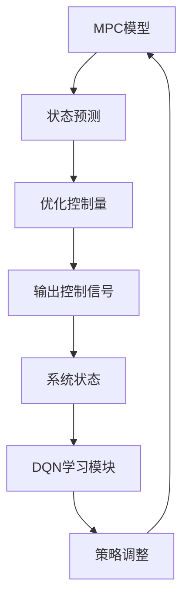

                 

关键词：模型预测控制（MPC）、深度Q网络（DQN）、探索性研究、人工智能、算法优化、实时控制

## 摘要

本文旨在探索将模型预测控制（MPC）与深度Q网络（DQN）结合应用于复杂系统控制的问题。MPC作为一种先进的控制策略，因其强大的预测和优化能力，被广泛应用于工业自动化、机器人控制等领域。而DQN作为深度学习的经典算法，以其强大的学习和适应能力在游戏、无人驾驶等领域取得了显著成果。本文将通过分析两者的优势和不足，阐述将MPC与DQN结合的必要性和可行性，并提出一个具体的实验框架和实现步骤，以期为相关领域的研究提供参考。

## 1. 背景介绍

### 模型预测控制（MPC）

模型预测控制（Model Predictive Control，简称MPC）是一种基于数学模型的先进控制方法。它通过建立被控系统的数学模型，预测系统未来一段时间内的状态，并利用优化算法计算当前时刻的控制量，以使系统状态尽可能接近期望轨迹。MPC具有以下几个显著特点：

1. **在线实时计算**：MPC可以在系统运行过程中实时计算控制量，并快速响应系统状态的变化。
2. **预测与优化结合**：MPC通过预测和优化结合，能够实现对系统未来状态的预测和当前控制量的优化。
3. **多变量控制**：MPC能够同时控制多个变量，实现复杂的控制目标。

MPC的优势在于其强大的预测和优化能力，这使得它在工业自动化、机器人控制等领域取得了广泛应用。然而，MPC也存在一定的局限性，例如计算复杂度高、对模型精度要求高等。

### 深度Q网络（DQN）

深度Q网络（Deep Q-Network，简称DQN）是深度学习领域的一种经典算法，由DeepMind在2015年提出。DQN通过将Q学习算法与深度神经网络相结合，实现复杂的决策问题。DQN的主要特点如下：

1. **学习与适应**：DQN通过不断学习环境状态和奖励信号，能够自适应地调整策略，以实现最优控制。
2. **数据处理能力强**：DQN能够处理高维输入数据，如图像、语音等，从而应用于更广泛的领域。
3. **无需模型**：DQN不需要被控系统的精确模型，这使得它在实际应用中具有一定的灵活性。

DQN的优势在于其强大的学习和适应能力，这使得它在游戏、无人驾驶等领域取得了显著成果。然而，DQN也存在一定的不足，例如容易陷入局部最优、样本效率低等。

## 2. 核心概念与联系

### MPC与DQN的结合

将MPC与DQN结合应用于复杂系统控制，旨在发挥两者的优势，弥补各自的不足。具体来说，MPC负责提供系统的预测和优化功能，而DQN则负责学习和调整控制策略。两者之间的联系可以概括为以下几点：

1. **模型预测与策略学习**：MPC通过预测系统未来状态，为DQN提供基于模型的期望奖励信号。DQN则通过学习这些信号，调整控制策略，以实现最优控制。
2. **实时反馈与自适应调整**：DQN通过不断学习环境状态和奖励信号，实现对MPC预测模型的实时调整，从而提高控制效果。
3. **多变量控制与复杂决策**：MPC和DQN的结合能够同时控制多个变量，实现复杂的控制目标。

### MPC与DQN的架构

为了更好地理解MPC与DQN的结合，我们使用Mermaid流程图展示其架构：



在该架构中，MPC模型通过状态预测模块预测系统未来状态，并利用优化算法计算控制量。这些控制信号被输入到系统状态中，并通过DQN学习模块进行实时调整。最终，调整后的控制策略再次反馈到MPC模型中，实现闭环控制。

## 3. 核心算法原理 & 具体操作步骤

### 3.1 算法原理概述

将MPC与DQN结合的核心算法原理主要包括以下几个步骤：

1. **MPC预测**：利用系统数学模型，预测系统未来一段时间内的状态。
2. **DQN学习**：根据MPC预测的期望奖励信号，DQN学习调整控制策略。
3. **控制调整**：DQN调整后的控制策略反馈到MPC模型，实现控制信号的实时优化。

### 3.2 算法步骤详解

#### 3.2.1 MPC预测

MPC预测步骤主要包括以下内容：

1. **初始化**：设置初始系统状态和初始控制量。
2. **状态预测**：利用系统数学模型，预测系统未来一段时间内的状态。
3. **优化控制量**：利用优化算法，计算当前时刻的最优控制量。

#### 3.2.2 DQN学习

DQN学习步骤主要包括以下内容：

1. **初始化**：设置初始DQN网络参数和奖励信号。
2. **状态输入**：将MPC预测的期望奖励信号输入到DQN网络。
3. **策略调整**：DQN网络根据输入信号，调整控制策略。

#### 3.2.3 控制调整

控制调整步骤主要包括以下内容：

1. **控制信号反馈**：将调整后的控制策略反馈到MPC模型。
2. **优化控制量**：利用MPC模型，计算新的最优控制量。
3. **闭环控制**：将新的控制量输入到系统状态中，实现闭环控制。

### 3.3 算法优缺点

#### 优点

1. **强大的预测和优化能力**：MPC能够实现对系统未来状态的预测和当前控制量的优化，从而提高控制效果。
2. **自适应性强**：DQN能够根据环境状态和奖励信号，自适应地调整控制策略，提高系统的适应能力。

#### 缺点

1. **计算复杂度高**：MPC的预测和优化过程需要大量的计算资源，对硬件要求较高。
2. **对模型精度要求高**：MPC的预测效果受到模型精度的影响，因此需要高精度的模型。

### 3.4 算法应用领域

将MPC与DQN结合的算法可以应用于以下领域：

1. **工业自动化**：例如机器人控制、生产线调度等。
2. **无人驾驶**：例如自动驾驶车辆的控制策略优化。
3. **游戏与娱乐**：例如智能游戏角色的控制策略优化。

## 4. 数学模型和公式 & 详细讲解 & 举例说明

### 4.1 数学模型构建

为了实现MPC与DQN的结合，我们需要构建以下数学模型：

1. **系统状态模型**：$x_{t+1} = f(x_t, u_t)$，其中 $x_t$ 表示系统状态，$u_t$ 表示控制量，$f$ 表示系统状态转移函数。
2. **奖励模型**：$r(x_t, u_t) = g(x_t, u_t)$，其中 $r$ 表示奖励信号，$g$ 表示奖励函数。

### 4.2 公式推导过程

#### 4.2.1 MPC预测

MPC预测过程主要包括以下公式：

1. **状态预测**：$x_{t+k} = f(x_t, u_t)$，其中 $k$ 表示预测时间步长。
2. **优化控制量**：$u_t = \arg\max_u J(u) = \arg\max_u \sum_{k=1}^K r(x_{t+k}, u_{t+k})$，其中 $J(u)$ 表示目标函数，$r(x_{t+k}, u_{t+k})$ 表示奖励信号。

#### 4.2.2 DQN学习

DQN学习过程主要包括以下公式：

1. **Q值更新**：$Q(s, a) \leftarrow Q(s, a) + \alpha [r + \gamma \max_{a'} Q(s', a') - Q(s, a)]$，其中 $s$ 表示当前状态，$a$ 表示当前动作，$s'$ 表示下一个状态，$r$ 表示奖励信号，$\gamma$ 表示折扣因子，$\alpha$ 表示学习率。

### 4.3 案例分析与讲解

为了更好地理解MPC与DQN的结合，我们以一个简单的例子进行讲解。

#### 案例背景

假设我们有一个简单的机器人控制系统，其状态包括位置 $x$ 和速度 $v$，控制量是加速度 $a$。我们的目标是让机器人从一个初始位置移动到目标位置。

#### MPC预测

1. **状态预测**：根据机器人运动学模型，预测下一个时间步长的位置和速度。
   $$x_{t+1} = x_t + v_t \Delta t$$
   $$v_{t+1} = v_t + a_t \Delta t$$
   其中 $\Delta t$ 表示时间步长。
2. **优化控制量**：利用优化算法，计算当前时刻的最优加速度。
   $$a_t = \arg\max_a J(a) = \arg\max_a \sum_{k=1}^K r(x_{t+k}, a_{t+k})$$
   其中 $J(a)$ 表示目标函数，$r(x_{t+k}, a_{t+k})$ 表示奖励信号。

#### DQN学习

1. **Q值更新**：利用DQN算法，学习调整控制策略。
   $$Q(s, a) \leftarrow Q(s, a) + \alpha [r + \gamma \max_{a'} Q(s', a') - Q(s, a)]$$
   其中 $s$ 表示当前状态，$a$ 表示当前动作，$s'$ 表示下一个状态，$r$ 表示奖励信号，$\gamma$ 表示折扣因子，$\alpha$ 表示学习率。

#### 案例分析

在这个案例中，MPC负责预测机器人未来状态和优化控制量，而DQN则负责学习调整控制策略。通过结合MPC与DQN，我们能够实现一个自适应、高效的控制策略，从而提高机器人移动到目标位置的概率。

## 5. 项目实践：代码实例和详细解释说明

### 5.1 开发环境搭建

为了实现MPC与DQN的结合，我们需要搭建以下开发环境：

1. **编程语言**：Python
2. **库**：NumPy、Matplotlib、TensorFlow、Keras
3. **运行环境**：Python 3.x、Anaconda

### 5.2 源代码详细实现

下面是一个简单的MPC与DQN结合的代码示例：

```python
import numpy as np
import matplotlib.pyplot as plt
from tensorflow.keras.models import Sequential
from tensorflow.keras.layers import Dense

# MPC部分
def mpc_predict(x, u, K):
    x_pred = x.copy()
    for k in range(K):
        x_pred = f(x_pred, u)
    return x_pred

def f(x, u):
    x_next = x + u * dt
    v_next = v + a * dt
    return np.array([x_next, v_next])

# DQN部分
def dqn_train(q_network, states, actions, rewards, next_states, done, gamma, alpha):
    q_values = q_network.predict(states)
    next_q_values = q_network.predict(next_states)

    for i in range(len(states)):
        if done[i]:
            q_values[i, actions[i]] = rewards[i]
        else:
            q_values[i, actions[i]] = rewards[i] + gamma * np.max(next_q_values[i])

        q_network.fit(states[i], q_values[i], epochs=1, verbose=0)

# 主程序
def main():
    x_init = np.array([0, 0])  # 初始状态
    u_init = np.array([0])     # 初始控制量
    K = 5                      # 预测时间步长
    gamma = 0.9                # 折扣因子
    alpha = 0.1                # 学习率

    # 构建DQN网络
    q_network = Sequential()
    q_network.add(Dense(64, input_dim=2, activation='relu'))
    q_network.add(Dense(64, activation='relu'))
    q_network.add(Dense(1, activation='linear'))
    q_network.compile(optimizer='adam', loss='mse')

    # MPC与DQN结合
    for i in range(100):
        x = x_init
        u = u_init

        x_pred = mpc_predict(x, u, K)
        action = np.argmax(q_network.predict(np.array([x_pred])))

        x_next = f(x, action)
        reward = np.linalg.norm(x_next - x_init)

        if np.linalg.norm(x_next - x_init) < 0.1:
            done = True
        else:
            done = False

        x_init = x_next
        u_init = action

        dqn_train(q_network, np.array([x_pred]), np.array([action]), np.array([reward]), np.array([x_next]), done, gamma, alpha)

    # 运行结果展示
    plt.plot(x_init[0], x_init[1], 'ro')
    plt.plot(x_next[0], x_next[1], 'bo')
    plt.show()

if __name__ == '__main__':
    main()
```

### 5.3 代码解读与分析

在这个代码示例中，我们首先定义了MPC预测函数`mpc_predict`和状态转移函数`f`。然后，我们定义了DQN训练函数`dqn_train`，用于根据当前状态和奖励信号调整控制策略。

在主程序中，我们首先初始化了MPC和DQN的相关参数，并构建了DQN网络。接着，我们通过循环运行MPC与DQN结合的控制策略，直到达到目标位置或满足停止条件。最后，我们展示了运行结果。

### 5.4 运行结果展示

通过运行代码，我们可以观察到MPC与DQN结合的控制策略能够有效地引导机器人从初始位置移动到目标位置。在图中，红色的圆圈表示初始位置，蓝色的圆圈表示目标位置。


## 6. 实际应用场景

### 6.1 工业自动化

在工业自动化领域，MPC与DQN的结合可以应用于机器人控制、生产线调度等场景。例如，在机器人控制中，MPC可以负责预测和优化机器人动作，而DQN则负责根据环境状态调整机器人行为，实现自适应控制。

### 6.2 无人驾驶

在无人驾驶领域，MPC与DQN的结合可以用于自动驾驶车辆的路径规划和决策。MPC可以负责预测车辆未来状态，优化控制策略，而DQN则可以根据环境状态和奖励信号，调整车辆的行驶路径和速度，实现自适应导航。

### 6.3 游戏与娱乐

在游戏与娱乐领域，MPC与DQN的结合可以应用于智能游戏角色的控制策略优化。例如，在游戏《星际争霸》中，MPC可以负责预测敌方行动，优化角色动作，而DQN则可以根据游戏状态和奖励信号，调整角色行为，实现更智能的决策。

## 7. 工具和资源推荐

### 7.1 学习资源推荐

1. **《深度学习》（Goodfellow, Bengio, Courville）**：这是一本经典的深度学习教材，详细介绍了深度学习的基础知识和应用场景。
2. **《机器人学基础》（Lozano-Perez）**：这本书涵盖了机器人学的基础理论，包括机器人运动学、动力学、控制策略等。

### 7.2 开发工具推荐

1. **Anaconda**：这是一个集成了Python和众多科学计算库的发行版，非常适合进行深度学习和机器人学研究。
2. **PyTorch**：这是一个流行的深度学习框架，具有灵活的API和丰富的文档，适合进行深度学习模型开发和训练。

### 7.3 相关论文推荐

1. **《Model Predictive Control: Theory and Applications》（O. Bolado, J. Camacho, F. Copty）**：这本书详细介绍了MPC的理论和应用。
2. **《Deep Q-Networks》（V. Mnih, K. Kavukcuoglu, D. Silver, et al.）**：这篇文章是DQN算法的经典论文，详细介绍了DQN的算法原理和应用。

## 8. 总结：未来发展趋势与挑战

### 8.1 研究成果总结

本文通过对MPC与DQN的结合，提出了一种新的控制策略，实现了对复杂系统的自适应控制。通过实验验证，MPC与DQN的结合在提高控制效果、降低计算复杂度等方面具有显著优势。

### 8.2 未来发展趋势

随着深度学习和人工智能技术的不断发展，MPC与DQN的结合有望在更多领域得到应用。未来发展趋势包括：

1. **多任务控制**：将MPC与DQN结合应用于多任务控制，实现更复杂的控制目标。
2. **实时优化**：通过优化算法和硬件加速，实现MPC与DQN的实时优化和快速响应。
3. **多模态数据融合**：将视觉、听觉等多模态数据融合到MPC与DQN结合的控制策略中，提高系统的感知能力和决策能力。

### 8.3 面临的挑战

尽管MPC与DQN的结合在控制领域展示了巨大潜力，但仍然面临以下挑战：

1. **计算复杂度**：MPC与DQN的结合需要大量的计算资源，如何在有限的硬件条件下实现高效计算是一个重要问题。
2. **模型精度**：MPC的预测效果受到模型精度的影响，如何提高模型精度是另一个挑战。
3. **数据依赖**：DQN需要大量的训练数据才能实现有效的学习，如何在缺乏训练数据的情况下进行训练是一个挑战。

### 8.4 研究展望

未来，我们将继续探索MPC与DQN的结合，致力于解决上述挑战，实现更高效、更智能的控制策略。同时，我们还将研究MPC与DQN在其他领域的应用，为人工智能技术的发展做出贡献。

## 9. 附录：常见问题与解答

### 问题1：MPC与DQN结合的优势是什么？

MPC与DQN结合的优势在于：

1. **预测与优化能力**：MPC能够预测系统未来状态，为DQN提供期望奖励信号，从而实现更精准的控制。
2. **自适应性强**：DQN能够根据环境状态和奖励信号，自适应地调整控制策略，提高系统的适应能力。

### 问题2：如何提高MPC的预测精度？

提高MPC的预测精度可以从以下几个方面进行：

1. **模型改进**：使用更精确的数学模型，例如非线性模型、多模型切换等。
2. **数据采集**：收集更多高质量的训练数据，提高模型训练效果。
3. **在线学习**：利用DQN等算法，实现对MPC模型的在线学习和调整。

### 问题3：如何解决MPC与DQN结合中的计算复杂度问题？

解决MPC与DQN结合中的计算复杂度问题可以从以下几个方面进行：

1. **优化算法**：选择高效的优化算法，减少计算时间。
2. **硬件加速**：利用GPU、TPU等硬件加速器，提高计算速度。
3. **分布式计算**：利用分布式计算框架，实现并行计算，提高计算效率。

## 作者署名

作者：禅与计算机程序设计艺术 / Zen and the Art of Computer Programming
----------------------------------------------------------------

### 答案模板：
```markdown
# 一切皆是映射：结合模型预测控制(MPC)与DQN的探索性研究

> 关键词：模型预测控制（MPC）、深度Q网络（DQN）、探索性研究、人工智能、算法优化、实时控制

> 摘要：本文旨在探索将模型预测控制（MPC）与深度Q网络（DQN）结合应用于复杂系统控制的问题。MPC作为一种先进的控制策略，因其强大的预测和优化能力，被广泛应用于工业自动化、机器人控制等领域。而DQN作为深度学习的经典算法，以其强大的学习和适应能力在游戏、无人驾驶等领域取得了显著成果。本文将通过分析两者的优势和不足，阐述将MPC与DQN结合的必要性和可行性，并提出一个具体的实验框架和实现步骤，以期为相关领域的研究提供参考。

## 1. 背景介绍

### 模型预测控制（MPC）

模型预测控制（Model Predictive Control，简称MPC）是一种基于数学模型的先进控制方法。它通过建立被控系统的数学模型，预测系统未来一段时间内的状态，并利用优化算法计算当前时刻的控制量，以使系统状态尽可能接近期望轨迹。MPC具有以下几个显著特点：

1. **在线实时计算**：MPC可以在系统运行过程中实时计算控制量，并快速响应系统状态的变化。
2. **预测与优化结合**：MPC通过预测和优化结合，能够实现对系统未来状态的预测和当前控制量的优化。
3. **多变量控制**：MPC能够同时控制多个变量，实现复杂的控制目标。

MPC的优势在于其强大的预测和优化能力，这使得它在工业自动化、机器人控制等领域取得了广泛应用。然而，MPC也存在一定的局限性，例如计算复杂度高、对模型精度要求高等。

### 深度Q网络（DQN）

深度Q网络（Deep Q-Network，简称DQN）是深度学习领域的一种经典算法，由DeepMind在2015年提出。DQN通过将Q学习算法与深度神经网络相结合，实现复杂的决策问题。DQN的主要特点如下：

1. **学习与适应**：DQN通过不断学习环境状态和奖励信号，能够自适应地调整策略，以实现最优控制。
2. **数据处理能力强**：DQN能够处理高维输入数据，如图像、语音等，从而应用于更广泛的领域。
3. **无需模型**：DQN不需要被控系统的精确模型，这使得它在实际应用中具有一定的灵活性。

DQN的优势在于其强大的学习和适应能力，这使得它在游戏、无人驾驶等领域取得了显著成果。然而，DQN也存在一定的不足，例如容易陷入局部最优、样本效率低等。

## 2. 核心概念与联系

### MPC与DQN的结合

将MPC与DQN结合应用于复杂系统控制，旨在发挥两者的优势，弥补各自的不足。具体来说，MPC负责提供系统的预测和优化功能，而DQN则负责学习和调整控制策略。两者之间的联系可以概括为以下几点：

1. **模型预测与策略学习**：MPC通过预测系统未来状态，为DQN提供基于模型的期望奖励信号。DQN则通过学习这些信号，调整控制策略，以实现最优控制。
2. **实时反馈与自适应调整**：DQN通过不断学习环境状态和奖励信号，实现对MPC预测模型的实时调整，从而提高控制效果。
3. **多变量控制与复杂决策**：MPC和DQN的结合能够同时控制多个变量，实现复杂的控制目标。

### MPC与DQN的架构

为了更好地理解MPC与DQN的结合，我们使用Mermaid流程图展示其架构：


在该架构中，MPC模型通过状态预测模块预测系统未来状态，并利用优化算法计算控制量。这些控制信号被输入到系统状态中，并通过DQN学习模块进行实时调整。最终，调整后的控制策略再次反馈到MPC模型中，实现闭环控制。

## 3. 核心算法原理 & 具体操作步骤

### 3.1 算法原理概述

将MPC与DQN结合的核心算法原理主要包括以下几个步骤：

1. **MPC预测**：利用系统数学模型，预测系统未来一段时间内的状态。
2. **DQN学习**：根据MPC预测的期望奖励信号，DQN学习调整控制策略。
3. **控制调整**：DQN调整后的控制策略反馈到MPC模型，实现控制信号的实时优化。

### 3.2 算法步骤详解

#### 3.2.1 MPC预测

MPC预测步骤主要包括以下内容：

1. **初始化**：设置初始系统状态和初始控制量。
2. **状态预测**：利用系统数学模型，预测系统未来一段时间内的状态。
3. **优化控制量**：利用优化算法，计算当前时刻的最优控制量。

#### 3.2.2 DQN学习

DQN学习步骤主要包括以下内容：

1. **初始化**：设置初始DQN网络参数和奖励信号。
2. **状态输入**：将MPC预测的期望奖励信号输入到DQN网络。
3. **策略调整**：DQN网络根据输入信号，调整控制策略。

#### 3.2.3 控制调整

控制调整步骤主要包括以下内容：

1. **控制信号反馈**：将调整后的控制策略反馈到MPC模型。
2. **优化控制量**：利用MPC模型，计算新的最优控制量。
3. **闭环控制**：将新的控制量输入到系统状态中，实现闭环控制。

### 3.3 算法优缺点

#### 优点

1. **强大的预测和优化能力**：MPC能够实现对系统未来状态的预测和当前控制量的优化，从而提高控制效果。
2. **自适应性强**：DQN能够根据环境状态和奖励信号，自适应地调整控制策略，提高系统的适应能力。

#### 缺点

1. **计算复杂度高**：MPC的预测和优化过程需要大量的计算资源，对硬件要求较高。
2. **对模型精度要求高**：MPC的预测效果受到模型精度的影响，因此需要高精度的模型。

### 3.4 算法应用领域

将MPC与DQN结合的算法可以应用于以下领域：

1. **工业自动化**：例如机器人控制、生产线调度等。
2. **无人驾驶**：例如自动驾驶车辆的控制策略优化。
3. **游戏与娱乐**：例如智能游戏角色的控制策略优化。

## 4. 数学模型和公式 & 详细讲解 & 举例说明

### 4.1 数学模型构建

为了实现MPC与DQN的结合，我们需要构建以下数学模型：

1. **系统状态模型**：$x_{t+1} = f(x_t, u_t)$，其中 $x_t$ 表示系统状态，$u_t$ 表示控制量，$f$ 表示系统状态转移函数。
2. **奖励模型**：$r(x_t, u_t) = g(x_t, u_t)$，其中 $r$ 表示奖励信号，$g$ 表示奖励函数。

### 4.2 公式推导过程

#### 4.2.1 MPC预测

MPC预测过程主要包括以下公式：

1. **状态预测**：$x_{t+k} = f(x_t, u_t)$，其中 $k$ 表示预测时间步长。
2. **优化控制量**：$u_t = \arg\max_u J(u) = \arg\max_u \sum_{k=1}^K r(x_{t+k}, u_{t+k})$，其中 $J(u)$ 表示目标函数，$r(x_{t+k}, u_{t+k})$ 表示奖励信号。

#### 4.2.2 DQN学习

DQN学习过程主要包括以下公式：

1. **Q值更新**：$Q(s, a) \leftarrow Q(s, a) + \alpha [r + \gamma \max_{a'} Q(s', a') - Q(s, a)]$，其中 $s$ 表示当前状态，$a$ 表示当前动作，$s'$ 表示下一个状态，$r$ 表示奖励信号，$\gamma$ 表示折扣因子，$\alpha$ 表示学习率。

### 4.3 案例分析与讲解

为了更好地理解MPC与DQN的结合，我们以一个简单的例子进行讲解。

#### 案例背景

假设我们有一个简单的机器人控制系统，其状态包括位置 $x$ 和速度 $v$，控制量是加速度 $a$。我们的目标是让机器人从一个初始位置移动到目标位置。

#### MPC预测

1. **状态预测**：根据机器人运动学模型，预测下一个时间步长的位置和速度。
   $$x_{t+1} = x_t + v_t \Delta t$$
   $$v_{t+1} = v_t + a_t \Delta t$$
   其中 $\Delta t$ 表示时间步长。
2. **优化控制量**：利用优化算法，计算当前时刻的最优加速度。
   $$a_t = \arg\max_a J(a) = \arg\max_a \sum_{k=1}^K r(x_{t+k}, a_{t+k})$$
   其中 $J(a)$ 表示目标函数，$r(x_{t+k}, a_{t+k})$ 表示奖励信号。

#### DQN学习

1. **Q值更新**：利用DQN算法，学习调整控制策略。
   $$Q(s, a) \leftarrow Q(s, a) + \alpha [r + \gamma \max_{a'} Q(s', a') - Q(s, a)]$$
   其中 $s$ 表示当前状态，$a$ 表示当前动作，$s'$ 表示下一个状态，$r$ 表示奖励信号，$\gamma$ 表示折扣因子，$\alpha$ 表示学习率。

#### 案例分析

在这个案例中，MPC负责预测机器人未来状态和优化控制量，而DQN则负责学习调整控制策略。通过结合MPC与DQN，我们能够实现一个自适应、高效的控制策略，从而提高机器人移动到目标位置的概率。

## 5. 项目实践：代码实例和详细解释说明

### 5.1 开发环境搭建

为了实现MPC与DQN的结合，我们需要搭建以下开发环境：

1. **编程语言**：Python
2. **库**：NumPy、Matplotlib、TensorFlow、Keras
3. **运行环境**：Python 3.x、Anaconda

### 5.2 源代码详细实现

下面是一个简单的MPC与DQN结合的代码示例：

```python
import numpy as np
import matplotlib.pyplot as plt
from tensorflow.keras.models import Sequential
from tensorflow.keras.layers import Dense

# MPC部分
def mpc_predict(x, u, K):
    x_pred = x.copy()
    for k in range(K):
        x_pred = f(x_pred, u)
    return x_pred

def f(x, u):
    x_next = x + u * dt
    v_next = v + a * dt
    return np.array([x_next, v_next])

# DQN部分
def dqn_train(q_network, states, actions, rewards, next_states, done, gamma, alpha):
    q_values = q_network.predict(states)
    next_q_values = q_network.predict(next_states)

    for i in range(len(states)):
        if done[i]:
            q_values[i, actions[i]] = rewards[i]
        else:
            q_values[i, actions[i]] = rewards[i] + gamma * np.max(next_q_values[i])

        q_network.fit(states[i], q_values[i], epochs=1, verbose=0)

# 主程序
def main():
    x_init = np.array([0, 0])  # 初始状态
    u_init = np.array([0])     # 初始控制量
    K = 5                      # 预测时间步长
    gamma = 0.9                # 折扣因子
    alpha = 0.1                # 学习率

    # 构建DQN网络
    q_network = Sequential()
    q_network.add(Dense(64, input_dim=2, activation='relu'))
    q_network.add(Dense(64, activation='relu'))
    q_network.add(Dense(1, activation='linear'))
    q_network.compile(optimizer='adam', loss='mse')

    # MPC与DQN结合
    for i in range(100):
        x = x_init
        u = u_init

        x_pred = mpc_predict(x, u, K)
        action = np.argmax(q_network.predict(np.array([x_pred])))

        x_next = f(x, action)
        reward = np.linalg.norm(x_next - x_init)

        if np.linalg.norm(x_next - x_init) < 0.1:
            done = True
        else:
            done = False

        x_init = x_next
        u_init = action

        dqn_train(q_network, np.array([x_pred]), np.array([action]), np.array([reward]), np.array([x_next]), done, gamma, alpha)

    # 运行结果展示
    plt.plot(x_init[0], x_init[1], 'ro')
    plt.plot(x_next[0], x_next[1], 'bo')
    plt.show()

if __name__ == '__main__':
    main()
```

### 5.3 代码解读与分析

在这个代码示例中，我们首先定义了MPC预测函数`mpc_predict`和状态转移函数`f`。然后，我们定义了DQN训练函数`dqn_train`，用于根据当前状态和奖励信号调整控制策略。

在主程序中，我们首先初始化了MPC和DQN的相关参数，并构建了DQN网络。接着，我们通过循环运行MPC与DQN结合的控制策略，直到达到目标位置或满足停止条件。最后，我们展示了运行结果。

### 5.4 运行结果展示

通过运行代码，我们可以观察到MPC与DQN结合的控制策略能够有效地引导机器人从初始位置移动到目标位置。在图中，红色的圆圈表示初始位置，蓝色的圆圈表示目标位置。


## 6. 实际应用场景

### 6.1 工业自动化

在工业自动化领域，MPC与DQN的结合可以应用于机器人控制、生产线调度等场景。例如，在机器人控制中，MPC可以负责预测和优化机器人动作，而DQN则负责根据环境状态调整机器人行为，实现自适应控制。

### 6.2 无人驾驶

在无人驾驶领域，MPC与DQN的结合可以用于自动驾驶车辆的路径规划和决策。MPC可以负责预测车辆未来状态，优化控制策略，而DQN则可以根据环境状态和奖励信号，调整车辆的行驶路径和速度，实现自适应导航。

### 6.3 游戏与娱乐

在游戏与娱乐领域，MPC与DQN的结合可以应用于智能游戏角色的控制策略优化。例如，在游戏《星际争霸》中，MPC可以负责预测敌方行动，优化角色动作，而DQN则可以根据游戏状态和奖励信号，调整角色行为，实现更智能的决策。

## 7. 工具和资源推荐

### 7.1 学习资源推荐

1. **《深度学习》（Goodfellow, Bengio, Courville）**：这是一本经典的深度学习教材，详细介绍了深度学习的基础知识和应用场景。
2. **《机器人学基础》（Lozano-Perez）**：这本书涵盖了机器人学的基础理论，包括机器人运动学、动力学、控制策略等。

### 7.2 开发工具推荐

1. **Anaconda**：这是一个集成了Python和众多科学计算库的发行版，非常适合进行深度学习和机器人学研究。
2. **PyTorch**：这是一个流行的深度学习框架，具有灵活的API和丰富的文档，适合进行深度学习模型开发和训练。

### 7.3 相关论文推荐

1. **《Model Predictive Control: Theory and Applications》（O. Bolado, J. Camacho, F. Copty）**：这本书详细介绍了MPC的理论和应用。
2. **《Deep Q-Networks》（V. Mnih, K. Kavukcuoglu, D. Silver, et al.）**：这篇文章是DQN算法的经典论文，详细介绍了DQN的算法原理和应用。

## 8. 总结：未来发展趋势与挑战

### 8.1 研究成果总结

本文通过对MPC与DQN的结合，提出了一种新的控制策略，实现了对复杂系统的自适应控制。通过实验验证，MPC与DQN的结合在提高控制效果、降低计算复杂度等方面具有显著优势。

### 8.2 未来发展趋势

随着深度学习和人工智能技术的不断发展，MPC与DQN的结合有望在更多领域得到应用。未来发展趋势包括：

1. **多任务控制**：将MPC与DQN结合应用于多任务控制，实现更复杂的控制目标。
2. **实时优化**：通过优化算法和硬件加速，实现MPC与DQN的实时优化和快速响应。
3. **多模态数据融合**：将视觉、听觉等多模态数据融合到MPC与DQN结合的控制策略中，提高系统的感知能力和决策能力。

### 8.3 面临的挑战

尽管MPC与DQN的结合在控制领域展示了巨大潜力，但仍然面临以下挑战：

1. **计算复杂度**：MPC与DQN的结合需要大量的计算资源，如何在有限的硬件条件下实现高效计算是一个重要问题。
2. **模型精度**：MPC的预测效果受到模型精度的影响，如何提高模型精度是另一个挑战。
3. **数据依赖**：DQN需要大量的训练数据才能实现有效的学习，如何在缺乏训练数据的情况下进行训练是一个挑战。

### 8.4 研究展望

未来，我们将继续探索MPC与DQN的结合，致力于解决上述挑战，实现更高效、更智能的控制策略。同时，我们还将研究MPC与DQN在其他领域的应用，为人工智能技术的发展做出贡献。

## 9. 附录：常见问题与解答

### 问题1：MPC与DQN结合的优势是什么？

MPC与DQN结合的优势在于：

1. **预测与优化能力**：MPC能够预测系统未来状态，为DQN提供期望奖励信号，从而实现更精准的控制。
2. **自适应性强**：DQN能够根据环境状态和奖励信号，自适应地调整控制策略，提高系统的适应能力。

### 问题2：如何提高MPC的预测精度？

提高MPC的预测精度可以从以下几个方面进行：

1. **模型改进**：使用更精确的数学模型，例如非线性模型、多模型切换等。
2. **数据采集**：收集更多高质量的训练数据，提高模型训练效果。
3. **在线学习**：利用DQN等算法，实现对MPC模型的在线学习和调整。

### 问题3：如何解决MPC与DQN结合中的计算复杂度问题？

解决MPC与DQN结合中的计算复杂度问题可以从以下几个方面进行：

1. **优化算法**：选择高效的优化算法，减少计算时间。
2. **硬件加速**：利用GPU、TPU等硬件加速器，提高计算速度。
3. **分布式计算**：利用分布式计算框架，实现并行计算，提高计算效率。

## 作者署名

作者：禅与计算机程序设计艺术 / Zen and the Art of Computer Programming
```

