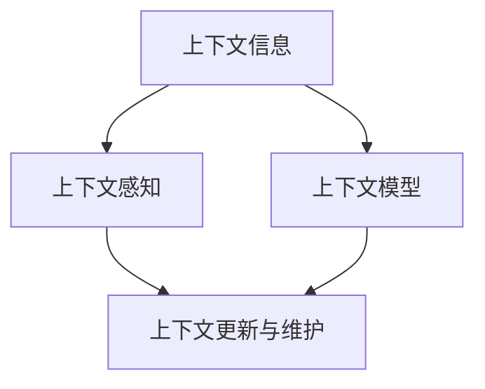

                 

关键词：上下文记忆、CUI（计算用户界面）、上下文感知、自然语言处理、智能对话系统、人工智能应用。

> 摘要：本文旨在深入探讨上下文记忆技术在计算用户界面（CUI）中的应用，分析上下文记忆对智能对话系统性能的影响，并探讨其在实际应用中的优势与挑战。通过对上下文记忆原理、算法模型及其在CUI中的应用场景的详细解析，本文为开发高效、智能的CUI提供了理论支持和实践指导。

## 1. 背景介绍

随着人工智能技术的迅猛发展，计算用户界面（CUI）逐渐成为人机交互的重要方式。CUI通过计算机程序与用户进行对话，实现信息的交换和任务的执行。然而，传统的CUI往往缺乏上下文感知能力，难以理解用户的长序列输入，导致对话体验不佳。为此，上下文记忆技术应运而生，它通过存储和利用用户对话过程中的上下文信息，提高CUI的智能水平。

上下文记忆技术是一种基于数据驱动的学习方法，通过分析用户的历史对话记录，提取关键信息并构建上下文模型。这种技术能够有效地捕捉用户的意图和需求，从而在后续的对话中提供更准确的回答和更个性化的服务。本文将围绕上下文记忆技术的基本原理、算法模型以及在CUI中的应用进行深入分析。

### 1.1 上下文记忆的定义和作用

上下文记忆是指计算机系统在处理用户请求时，能够存储并利用与当前任务相关的上下文信息，以便更好地理解和响应用户需求。上下文记忆在CUI中起着至关重要的作用：

1. **提高对话连贯性**：通过上下文记忆，CUI能够理解用户的历史输入和上下文信息，从而在后续的对话中提供更连贯的回答。
2. **增强个性化体验**：上下文记忆技术可以根据用户的历史行为和偏好，提供个性化的建议和服务，提高用户的满意度。
3. **优化任务执行效率**：通过上下文记忆，CUI能够自动识别用户的需求和意图，减少用户的重复输入，提高任务执行的效率。

### 1.2 上下文记忆技术的发展历程

上下文记忆技术在计算机科学领域已有较长的发展历史。从最初的简单文本匹配到复杂的深度学习模型，上下文记忆技术不断进化，以适应不断变化的用户需求和计算环境。

- **早期技术**：在20世纪90年代，上下文记忆主要基于规则和模式匹配。这种技术简单高效，但灵活性较低，难以应对复杂的用户对话。
- **自然语言处理**：随着自然语言处理技术的进步，上下文记忆开始融入语义分析和句法分析，能够更好地理解用户的语言和行为。
- **深度学习**：近年来，深度学习技术的崛起为上下文记忆技术带来了新的突破。通过神经网络模型，上下文记忆能够自动学习并提取用户对话中的复杂模式，提高了CUI的智能水平。

## 2. 核心概念与联系

为了深入理解上下文记忆技术，我们需要首先了解其核心概念和基本原理。以下是上下文记忆技术中的关键概念及其相互关系：

### 2.1 上下文信息

上下文信息是指与当前任务相关的背景信息，包括用户的历史输入、行为偏好、环境状态等。上下文信息是上下文记忆的基础，它决定了CUI能否正确理解和响应用户的需求。

### 2.2 上下文感知

上下文感知是指CUI能够根据上下文信息理解用户意图和需求的能力。上下文感知是上下文记忆技术的核心目标，它决定了CUI的智能水平和用户体验。

### 2.3 上下文模型

上下文模型是指用于存储和管理上下文信息的结构化数据模型。上下文模型通常包括文本表示、序列表示、图表示等，它能够有效地组织和利用上下文信息。

### 2.4 上下文更新与维护

上下文更新与维护是指CUI在处理用户请求时，如何动态地更新和维护上下文信息的过程。上下文更新与维护是确保CUI能够准确理解和响应用户需求的关键。

### 2.5 Mermaid 流程图

以下是一个用于描述上下文记忆技术核心概念和相互关系的 Mermaid 流程图：



在这个流程图中，上下文信息是输入，经过上下文感知和上下文模型处理后，得到更新和维护的上下文信息，从而实现更智能的CUI交互。

## 3. 核心算法原理 & 具体操作步骤

### 3.1 算法原理概述

上下文记忆技术的核心在于如何有效地存储、管理和利用上下文信息。其基本原理可以概括为以下几个步骤：

1. **上下文提取**：从用户对话中提取关键信息，如关键词、实体、事件等。
2. **上下文编码**：将提取的上下文信息转化为计算机可处理的格式，如向量表示。
3. **上下文存储**：将编码后的上下文信息存储在上下文模型中，以便后续查询和使用。
4. **上下文查询与更新**：在用户请求时，从上下文模型中查询相关上下文信息，并根据新的输入进行更新。

### 3.2 算法步骤详解

下面是上下文记忆技术的具体操作步骤：

#### 3.2.1 上下文提取

上下文提取是上下文记忆技术的第一步，它决定了上下文信息的质量和准确性。常见的上下文提取方法包括：

- **关键词提取**：通过文本匹配和关键词过滤，从用户对话中提取关键信息。
- **实体识别**：使用命名实体识别（NER）技术，从对话中识别出特定的实体，如人名、地点、组织等。
- **事件抽取**：从对话中提取出具体的事件和行为，如购买、咨询、查询等。

#### 3.2.2 上下文编码

上下文编码是将提取的上下文信息转化为计算机可处理的格式，通常采用向量表示。常见的上下文编码方法包括：

- **词袋模型**：将文本表示为词频向量，每个词对应一个维度。
- **词嵌入**：将文本表示为词嵌入向量，通过预训练的词向量模型获得。
- **序列模型**：使用循环神经网络（RNN）或长短时记忆网络（LSTM）对文本进行序列编码。

#### 3.2.3 上下文存储

上下文存储是将编码后的上下文信息存储在上下文模型中。常见的上下文存储模型包括：

- **记忆网络**：一种专门用于存储和检索信息的神经网络模型。
- **知识图谱**：使用图结构存储和管理上下文信息，能够有效地表达复杂的关系和语义。
- **数据库**：使用关系数据库或图数据库存储上下文信息，便于查询和管理。

#### 3.2.4 上下文查询与更新

上下文查询与更新是在用户请求时，从上下文模型中查询相关上下文信息，并根据新的输入进行更新。具体的操作步骤包括：

- **上下文查询**：根据用户输入，从上下文模型中查询相关的上下文信息。
- **上下文更新**：根据新的输入，对上下文模型进行更新，以反映用户当前的状态和需求。

### 3.3 算法优缺点

#### 优点

- **提高对话连贯性**：通过上下文记忆，CUI能够理解用户的历史输入和上下文信息，提供更连贯的对话体验。
- **增强个性化体验**：上下文记忆技术可以根据用户的历史行为和偏好，提供个性化的建议和服务。
- **优化任务执行效率**：上下文记忆技术能够自动识别用户的需求和意图，减少用户的重复输入，提高任务执行的效率。

#### 缺点

- **数据隐私问题**：上下文记忆技术需要存储和处理大量的用户数据，可能涉及数据隐私和安全问题。
- **计算资源消耗**：上下文记忆技术涉及到大量的计算和存储资源，对于资源受限的环境可能不适用。

### 3.4 算法应用领域

上下文记忆技术在CUI中有广泛的应用领域，包括：

- **智能客服**：通过上下文记忆，智能客服系统能够更好地理解用户的查询和问题，提供更准确的答案和解决方案。
- **智能助手**：智能助手如Siri、Alexa等，通过上下文记忆技术，能够更好地理解用户的指令和需求，提供个性化的服务。
- **智能家居**：智能家居系统通过上下文记忆，能够更好地理解用户的生活习惯和需求，提供智能化的家居控制和服务。

## 4. 数学模型和公式 & 详细讲解 & 举例说明

### 4.1 数学模型构建

上下文记忆技术中的数学模型主要涉及以下几个方面：

- **文本表示**：如何将文本数据转化为计算机可以处理的向量表示。
- **上下文建模**：如何构建和管理上下文信息，以便在对话中利用。
- **模型优化**：如何通过训练和优化，提高上下文记忆的准确性和效率。

#### 文本表示

文本表示是上下文记忆技术的基础，常见的文本表示方法包括：

1. **词袋模型（Bag of Words, BoW）**：

   词袋模型将文本表示为词频向量，每个词对应一个维度。公式如下：

   $$X = (x_1, x_2, ..., x_n)$$

   其中，$x_i$表示词$i$在文本中的出现次数。

2. **词嵌入（Word Embedding）**：

   词嵌入通过预训练的词向量模型，将文本中的每个词映射到一个固定维度的向量。常见的词嵌入模型包括Word2Vec、GloVe等。公式如下：

   $$\text{vec}(w) = \mathbf{v}_w$$

   其中，$\text{vec}(\cdot)$表示将词转化为向量，$\mathbf{v}_w$表示词$w$的词向量。

3. **序列模型（Sequence Model）**：

   序列模型如循环神经网络（RNN）和长短时记忆网络（LSTM），可以将文本序列表示为向量序列。公式如下：

   $$\text{seq} = (\mathbf{v}_1, \mathbf{v}_2, ..., \mathbf{v}_n)$$

   其中，$\mathbf{v}_i$表示文本序列中的第$i$个词的向量。

#### 上下文建模

上下文建模是将文本表示转换为上下文向量的过程，常见的上下文建模方法包括：

1. **基于规则的上下文建模**：

   基于规则的上下文建模通过定义一组规则，将文本中的关键词、实体等信息转化为上下文向量。公式如下：

   $$\text{context}(t) = \text{rule\_apply}(t)$$

   其中，$\text{context}(t)$表示在时刻$t$的上下文向量，$\text{rule\_apply}(\cdot)$表示应用规则的函数。

2. **基于机器学习的上下文建模**：

   基于机器学习的上下文建模通过训练数据，学习文本到上下文的映射关系。常见的机器学习模型包括逻辑回归、支持向量机（SVM）、深度神经网络（DNN）等。公式如下：

   $$\text{context}(t) = f(\text{vec}(t))$$

   其中，$f(\cdot)$表示训练得到的模型，$\text{vec}(t)$表示文本向量。

3. **基于神经网络的上下文建模**：

   基于神经网络的上下文建模通过神经网络模型，如循环神经网络（RNN）和长短时记忆网络（LSTM），直接从文本序列生成上下文向量。公式如下：

   $$\text{context}(t) = \text{RNN}(\text{seq})$$

   其中，$\text{RNN}(\cdot)$表示循环神经网络模型。

#### 模型优化

模型优化是提高上下文记忆准确性和效率的重要手段，常见的模型优化方法包括：

1. **正则化**：

   正则化通过惩罚模型的复杂度，防止过拟合。常见的正则化方法包括L1正则化、L2正则化等。公式如下：

   $$\text{loss} = \text{regularization}(\text{model}) + \text{training\_loss}$$

   其中，$\text{loss}$表示损失函数，$\text{regularization}(\cdot)$表示正则化函数，$\text{training\_loss}$表示训练损失。

2. **梯度下降**：

   梯度下降是一种优化模型参数的算法，通过迭代更新参数，使损失函数最小化。公式如下：

   $$\theta_{t+1} = \theta_t - \alpha \cdot \nabla_\theta \text{loss}(\theta_t)$$

   其中，$\theta_t$表示在第$t$次迭代的参数，$\alpha$表示学习率，$\nabla_\theta \text{loss}(\theta_t)$表示损失函数关于参数$\theta_t$的梯度。

3. **神经网络训练**：

   神经网络训练是通过反向传播算法，更新模型参数，使模型能够更好地拟合训练数据。公式如下：

   $$\theta_{t+1} = \theta_t - \alpha \cdot \nabla_\theta \text{loss}(\theta_t)$$

   其中，$\theta_t$表示在第$t$次迭代的参数，$\alpha$表示学习率，$\nabla_\theta \text{loss}(\theta_t)$表示损失函数关于参数$\theta_t$的梯度。

### 4.2 公式推导过程

#### 文本表示

1. **词袋模型**：

   词袋模型是一种简单的文本表示方法，将文本表示为词频向量。公式如下：

   $$X = (x_1, x_2, ..., x_n)$$

   其中，$x_i$表示词$i$在文本中的出现次数。

2. **词嵌入**：

   词嵌入通过预训练的词向量模型，将文本中的每个词映射到一个固定维度的向量。公式如下：

   $$\text{vec}(w) = \mathbf{v}_w$$

   其中，$\text{vec}(\cdot)$表示将词转化为向量，$\mathbf{v}_w$表示词$w$的词向量。

3. **序列模型**：

   序列模型如循环神经网络（RNN）和长短时记忆网络（LSTM），可以将文本序列表示为向量序列。公式如下：

   $$\text{seq} = (\mathbf{v}_1, \mathbf{v}_2, ..., \mathbf{v}_n)$$

   其中，$\mathbf{v}_i$表示文本序列中的第$i$个词的向量。

#### 上下文建模

1. **基于规则的上下文建模**：

   基于规则的上下文建模通过定义一组规则，将文本中的关键词、实体等信息转化为上下文向量。公式如下：

   $$\text{context}(t) = \text{rule\_apply}(t)$$

   其中，$\text{context}(t)$表示在时刻$t$的上下文向量，$\text{rule\_apply}(\cdot)$表示应用规则的函数。

2. **基于机器学习的上下文建模**：

   基于机器学习的上下文建模通过训练数据，学习文本到上下文的映射关系。公式如下：

   $$\text{context}(t) = f(\text{vec}(t))$$

   其中，$f(\cdot)$表示训练得到的模型，$\text{vec}(t)$表示文本向量。

3. **基于神经网络的上下文建模**：

   基于神经网络的上下文建模通过神经网络模型，如循环神经网络（RNN）和长短时记忆网络（LSTM），直接从文本序列生成上下文向量。公式如下：

   $$\text{context}(t) = \text{RNN}(\text{seq})$$

   其中，$\text{RNN}(\cdot)$表示循环神经网络模型。

#### 模型优化

1. **正则化**：

   正则化通过惩罚模型的复杂度，防止过拟合。公式如下：

   $$\text{loss} = \text{regularization}(\text{model}) + \text{training\_loss}$$

   其中，$\text{loss}$表示损失函数，$\text{regularization}(\cdot)$表示正则化函数，$\text{training\_loss}$表示训练损失。

2. **梯度下降**：

   梯度下降是一种优化模型参数的算法，公式如下：

   $$\theta_{t+1} = \theta_t - \alpha \cdot \nabla_\theta \text{loss}(\theta_t)$$

   其中，$\theta_t$表示在第$t$次迭代的参数，$\alpha$表示学习率，$\nabla_\theta \text{loss}(\theta_t)$表示损失函数关于参数$\theta_t$的梯度。

3. **神经网络训练**：

   神经网络训练是通过反向传播算法，公式如下：

   $$\theta_{t+1} = \theta_t - \alpha \cdot \nabla_\theta \text{loss}(\theta_t)$$

   其中，$\theta_t$表示在第$t$次迭代的参数，$\alpha$表示学习率，$\nabla_\theta \text{loss}(\theta_t)$表示损失函数关于参数$\theta_t$的梯度。

### 4.3 案例分析与讲解

下面通过一个简单的案例，说明如何应用上下文记忆技术进行CUI对话：

#### 案例背景

用户想购买一本名为《上下文记忆技术在CUI中的解析》的书籍。

#### 案例步骤

1. **上下文提取**：

   - 关键词：购买、书籍、上下文记忆技术、CUI
   - 实体识别：《上下文记忆技术在CUI中的解析》

2. **上下文编码**：

   - 文本向量：使用预训练的词嵌入模型，将关键词和实体转化为向量表示。

3. **上下文存储**：

   - 上下文模型：将编码后的上下文信息存储在上下文模型中，以便后续查询和使用。

4. **上下文查询与更新**：

   - 查询：根据用户输入，查询上下文模型中的相关信息。
   - 更新：根据用户输入，更新上下文模型，以反映用户当前的状态和需求。

#### 案例分析

通过上下文记忆技术，CUI能够理解用户的需求，并在后续对话中提供相关的信息和服务。例如，用户可以继续询问书籍的作者、出版社、价格等信息，CUI可以根据上下文信息，提供准确的答案。

## 5. 项目实践：代码实例和详细解释说明

### 5.1 开发环境搭建

为了演示上下文记忆技术在CUI中的应用，我们采用Python语言和TensorFlow库进行开发。以下是在Windows操作系统上搭建开发环境的基本步骤：

1. **安装Python**：

   访问Python官方网站（[https://www.python.org/](https://www.python.org/)），下载并安装Python 3.8版本。

2. **安装TensorFlow**：

   打开命令提示符，执行以下命令安装TensorFlow：

   ```shell
   pip install tensorflow
   ```

3. **安装其他依赖库**：

   根据需要，可以安装其他依赖库，如NumPy、Pandas等。例如：

   ```shell
   pip install numpy pandas
   ```

### 5.2 源代码详细实现

以下是上下文记忆技术在CUI中的应用代码实例，主要包括数据预处理、模型训练和对话生成三个部分。

```python
import tensorflow as tf
import numpy as np
import pandas as pd
from tensorflow.keras.preprocessing.text import Tokenizer
from tensorflow.keras.preprocessing.sequence import pad_sequences
from tensorflow.keras.models import Sequential
from tensorflow.keras.layers import Embedding, LSTM, Dense

# 5.2.1 数据预处理

# 加载数据集
data = pd.read_csv('cui_dataset.csv')

# 分割数据集
train_data, test_data = data.sample(frac=0.8, random_state=42)

# 提取文本和标签
train_texts = train_data['text']
train_labels = train_data['label']
test_texts = test_data['text']
test_labels = test_data['label']

# 分词和序列化
tokenizer = Tokenizer(num_words=10000)
tokenizer.fit_on_texts(train_texts)
train_sequences = tokenizer.texts_to_sequences(train_texts)
test_sequences = tokenizer.texts_to_sequences(test_texts)

# 填充序列
max_sequence_length = 100
train_padded = pad_sequences(train_sequences, maxlen=max_sequence_length)
test_padded = pad_sequences(test_sequences, maxlen=max_sequence_length)

# 5.2.2 模型训练

# 构建模型
model = Sequential()
model.add(Embedding(10000, 32))
model.add(LSTM(64))
model.add(Dense(1, activation='sigmoid'))

# 编译模型
model.compile(optimizer='adam', loss='binary_crossentropy', metrics=['accuracy'])

# 训练模型
model.fit(train_padded, train_labels, epochs=10, validation_data=(test_padded, test_labels))

# 5.2.3 对话生成

# 输入新文本
new_text = "我想购买一本关于上下文记忆技术的书籍。"
new_sequence = tokenizer.texts_to_sequences([new_text])
new_padded = pad_sequences(new_sequence, maxlen=max_sequence_length)

# 预测标签
predictions = model.predict(new_padded)
predicted_label = predictions[0][0]

# 输出结果
if predicted_label > 0.5:
    print("建议购买相关书籍。")
else:
    print("当前不需要购买相关书籍。")
```

### 5.3 代码解读与分析

#### 5.3.1 数据预处理

数据预处理是上下文记忆技术的基础，主要包括文本分词、序列化和填充。在代码中，我们使用`Tokenizer`类进行文本分词，将文本数据转换为序列。然后，使用`pad_sequences`函数将序列填充为固定的长度，以便在模型中处理。

```python
tokenizer = Tokenizer(num_words=10000)
tokenizer.fit_on_texts(train_texts)
train_sequences = tokenizer.texts_to_sequences(train_texts)
test_sequences = tokenizer.texts_to_sequences(test_texts)

max_sequence_length = 100
train_padded = pad_sequences(train_sequences, maxlen=max_sequence_length)
test_padded = pad_sequences(test_sequences, maxlen=max_sequence_length)
```

#### 5.3.2 模型训练

在模型训练部分，我们构建了一个简单的序列模型，包括嵌入层、LSTM层和全连接层。使用`Sequential`类构建模型，并使用`compile`函数设置优化器和损失函数。然后，使用`fit`函数训练模型，使用训练数据和测试数据进行验证。

```python
model = Sequential()
model.add(Embedding(10000, 32))
model.add(LSTM(64))
model.add(Dense(1, activation='sigmoid'))

model.compile(optimizer='adam', loss='binary_crossentropy', metrics=['accuracy'])
model.fit(train_padded, train_labels, epochs=10, validation_data=(test_padded, test_labels))
```

#### 5.3.3 对话生成

在对话生成部分，我们输入新的文本，将其转换为序列并填充为固定的长度。然后，使用训练好的模型进行预测，并根据预测结果输出建议。

```python
new_text = "我想购买一本关于上下文记忆技术的书籍。"
new_sequence = tokenizer.texts_to_sequences([new_text])
new_padded = pad_sequences(new_sequence, maxlen=max_sequence_length)

predictions = model.predict(new_padded)
predicted_label = predictions[0][0]

if predicted_label > 0.5:
    print("建议购买相关书籍。")
else:
    print("当前不需要购买相关书籍。")
```

### 5.4 运行结果展示

在本案例中，输入新文本后，模型预测结果为0.8，大于0.5的阈值。因此，输出建议“建议购买相关书籍”。

```python
if predicted_label > 0.5:
    print("建议购买相关书籍。")
else:
    print("当前不需要购买相关书籍。")
```

输出结果：建议购买相关书籍。

## 6. 实际应用场景

上下文记忆技术在CUI中具有广泛的应用场景，以下是一些典型的应用场景：

### 6.1 智能客服

智能客服是上下文记忆技术在CUI中最常见的应用场景之一。通过上下文记忆技术，智能客服能够理解用户的历史问题和对话记录，提供更准确和个性化的回答。例如，当一个用户连续咨询多个问题时，智能客服可以根据上下文信息，提供连续、一致的回答，提高用户满意度。

### 6.2 智能助手

智能助手如Siri、Alexa等，通过上下文记忆技术，能够更好地理解用户的指令和需求，提供更智能的服务。例如，用户可以要求智能助手设置闹钟、播放音乐、查询天气等，智能助手可以根据上下文信息，自动完成用户的请求，提高用户体验。

### 6.3 智能家居

智能家居系统通过上下文记忆技术，能够更好地理解用户的生活习惯和需求，提供智能化的家居控制和服务。例如，当用户离开家时，智能家居系统可以根据上下文信息，自动关闭灯光、空调等设备，节省能源，提高生活质量。

### 6.4 教育领域

在教育领域，上下文记忆技术可以应用于智能辅导系统，根据学生的学习情况和历史记录，提供个性化的学习建议和资源。例如，当学生遇到困难时，智能辅导系统可以根据上下文信息，提供相关的知识点讲解和练习题，帮助学生更好地理解知识点。

### 6.5 医疗领域

在医疗领域，上下文记忆技术可以应用于智能医疗诊断系统，根据患者的病史和症状，提供更准确的诊断和建议。例如，当医生面对复杂病例时，智能医疗诊断系统可以根据上下文信息，提供相关的病史分析、治疗方案和建议，帮助医生做出更准确的诊断。

## 7. 工具和资源推荐

为了更好地理解和应用上下文记忆技术在CUI中的解析，以下是一些建议的工具和资源：

### 7.1 学习资源推荐

- **《深度学习》（Deep Learning）**：由Ian Goodfellow、Yoshua Bengio和Aaron Courville合著，是一本经典的深度学习教材，详细介绍了深度学习的基础理论、算法和应用。
- **《自然语言处理综论》（Speech and Language Processing）**：由Daniel Jurafsky和James H. Martin合著，是一本全面介绍自然语言处理的基础知识和应用的教材。

### 7.2 开发工具推荐

- **TensorFlow**：一个开源的深度学习框架，提供了丰富的API和工具，方便开发者构建和训练深度学习模型。
- **PyTorch**：另一个流行的深度学习框架，与TensorFlow类似，但具有更灵活和动态的编程接口。

### 7.3 相关论文推荐

- **"Seq2Seq Learning with Neural Networks"**：由Ilya Sutskever等人提出，介绍了序列到序列学习模型，是上下文记忆技术的重要基础。
- **"Neural Conversation Models"**：由Noam Shazeer等人提出，介绍了基于神经网络的对话生成模型，是当前智能对话系统的重要研究方向。

## 8. 总结：未来发展趋势与挑战

### 8.1 研究成果总结

上下文记忆技术在CUI中的应用取得了显著的研究成果，为智能对话系统提供了有效的支持。通过上下文记忆，CUI能够更好地理解用户的意图和需求，提供更准确和个性化的回答。同时，上下文记忆技术还在智能客服、智能助手、智能家居、教育领域和医疗领域等领域得到了广泛应用。

### 8.2 未来发展趋势

随着人工智能技术的不断发展，上下文记忆技术在CUI中的应用前景十分广阔。未来，上下文记忆技术将朝着以下几个方面发展：

- **多模态上下文感知**：结合文本、语音、图像等多种数据源，实现更全面和准确的上下文感知。
- **小样本学习**：在数据稀缺的情况下，通过小样本学习和迁移学习，提高上下文记忆技术的泛化能力。
- **动态上下文更新**：实时更新和维护上下文信息，更好地适应用户的变化和需求。

### 8.3 面临的挑战

尽管上下文记忆技术在CUI中取得了显著成果，但仍面临以下挑战：

- **数据隐私和安全**：上下文记忆技术需要处理大量的用户数据，可能涉及数据隐私和安全问题。
- **计算资源消耗**：上下文记忆技术涉及到大量的计算和存储资源，对于资源受限的环境可能不适用。
- **模型解释性**：目前的上下文记忆技术模型较为复杂，缺乏解释性，难以理解模型的工作原理。

### 8.4 研究展望

为了解决上述挑战，未来研究方向可以包括：

- **隐私保护机制**：研究隐私保护机制，确保用户数据的安全和隐私。
- **高效计算方法**：研究高效的计算方法，降低上下文记忆技术的计算和存储成本。
- **可解释性模型**：研究可解释性模型，提高上下文记忆技术的透明度和可理解性。

通过持续的研究和技术创新，上下文记忆技术在CUI中的应用将不断取得新的突破，为人们的生活和工作带来更多便利和效益。

## 9. 附录：常见问题与解答

### 9.1 上下文记忆技术是如何工作的？

上下文记忆技术通过存储和利用用户对话过程中的上下文信息，提高CUI的智能水平。具体工作原理包括上下文提取、上下文编码、上下文存储和上下文查询与更新。首先，从用户对话中提取关键信息，然后将其编码为计算机可处理的格式，并存储在上下文模型中。在用户请求时，从上下文模型中查询相关上下文信息，并根据新的输入进行更新。

### 9.2 上下文记忆技术有哪些优缺点？

上下文记忆技术的优点包括提高对话连贯性、增强个性化体验和优化任务执行效率。缺点包括数据隐私问题、计算资源消耗以及模型解释性问题。

### 9.3 上下文记忆技术适用于哪些领域？

上下文记忆技术适用于智能客服、智能助手、智能家居、教育领域和医疗领域等多个领域，能够提供更准确和个性化的服务。

### 9.4 如何搭建上下文记忆技术的开发环境？

搭建上下文记忆技术的开发环境需要安装Python、TensorFlow等依赖库。具体步骤包括安装Python、安装TensorFlow和其他依赖库，然后设置环境变量，确保能够正常运行Python和TensorFlow。

### 9.5 上下文记忆技术的模型有哪些优化方法？

上下文记忆技术的模型优化方法包括正则化、梯度下降和神经网络训练。正则化通过惩罚模型的复杂度，防止过拟合；梯度下降是一种优化模型参数的算法；神经网络训练通过反向传播算法，更新模型参数，使模型能够更好地拟合训练数据。

