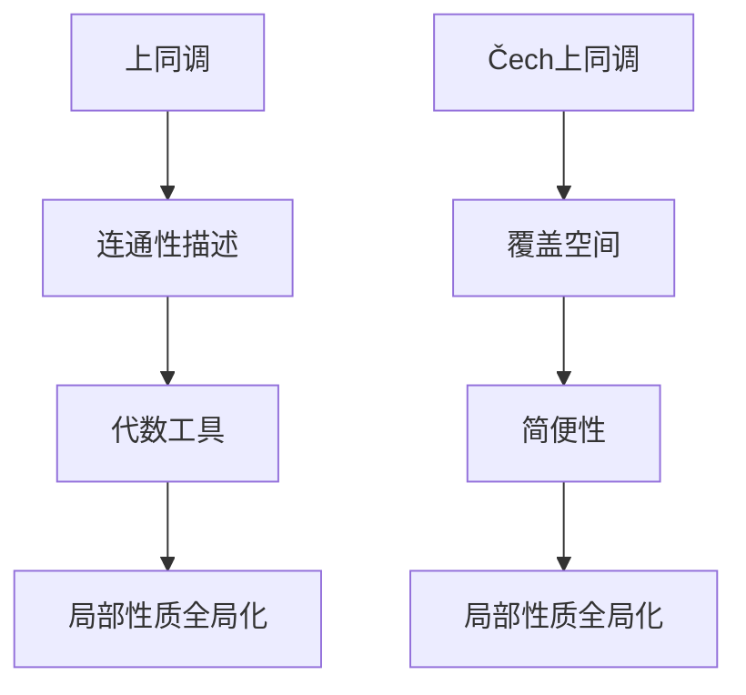

                 

上同调（Homology）理论是代数拓扑学中的一个重要工具，它提供了对空间结构的一种量化描述。而Čech上同调（Čech Homology）则是上同调理论的一个重要分支，它为局部性质提供了一种全局的理解。本文将深入探讨上同调中的Čech上同调，探讨其核心概念、算法原理及其实际应用。

## 1. 背景介绍

上同调理论起源于20世纪初，由Poincaré首次提出。它是用来研究空间结构的一种代数工具，特别是对于无法通过欧几里得几何描述的复杂空间。随着代数拓扑学的发展，上同调理论逐渐完善，衍生出多种不同的计算方法和理论。

在所有上同调理论中，Čech上同调因其简便性而备受青睐。它通过覆盖空间的方式，将复杂的拓扑问题转化为相对简单的代数问题。这使得Čech上同调在许多实际问题中有着广泛的应用。

## 2. 核心概念与联系

### 2.1 上同调概念

上同调是研究一个空间在不同维度上的连通性的工具。具体来说，它考虑了一个空间在连续变形下如何保持其连通性。一个空间的上同调群描述了这个空间在各个维度上的连通性。

### 2.2 Čech上同调概念

Čech上同调是上同调理论的一种推广，它通过选取一组覆盖空间的开集，来定义上同调群。这种覆盖可以更灵活地适应复杂空间的结构。

### 2.3 Mermaid 流程图

以下是上同调与Čech上同调的Mermaid流程图：



## 3. 核心算法原理 & 具体操作步骤

### 3.1 算法原理概述

Čech上同调的算法原理基于选择一组开覆盖，并计算这些覆盖下各集合之间的交点关系。具体来说，它通过以下步骤实现：

1. 选择一个空间X和一个开覆盖{U_i}。
2. 对于任意两个开集U和V，计算它们的交集U∩V。
3. 通过这些交集，构建出一个代数结构，从而得到上同调群。

### 3.2 算法步骤详解

1. **选择覆盖：** 选择一个空间X和一个开覆盖{U_i}。
   
   - **示例：** 假设我们要研究一个球面S^2，可以选择一组三角形作为覆盖。

2. **计算交集：** 对于任意两个开集U和V，计算它们的交集U∩V。

   - **示例：** 假设U和V是两个相邻的三角形，它们的交集是一个多边形。

3. **构建代数结构：** 通过这些交集，构建出一个代数结构。具体来说，我们构造一个链群，每个元素表示一个交集，链群中的运算则表示这些交集之间的关系。

4. **计算边界：** 对于每个交集，计算其边界。边界是由交集的内部点和外部点构成的。

5. **构建上同调群：** 通过边界，我们可以得到上同调群。上同调群描述了空间在不同维度上的连通性。

### 3.3 算法优缺点

**优点：**

- **简便性：** Čech上同调通过覆盖空间的方式，将复杂的拓扑问题转化为代数问题，使得计算变得相对简单。
- **灵活性：** 选择覆盖的方式灵活，可以适应不同类型的空间。

**缺点：**

- **计算复杂度：** 随着覆盖的增多，计算复杂度会显著增加。
- **稳定性问题：** 覆盖的选择会影响最终的结果，可能带来一些稳定性问题。

### 3.4 算法应用领域

Čech上同调在多个领域有着广泛的应用：

- **计算几何：** 用于研究复杂几何形状的连通性。
- **数据科学：** 用于分析复杂数据集的结构。
- **物理学：** 在凝聚态物理和量子场论中有着重要应用。

## 4. 数学模型和公式 & 详细讲解 & 举例说明

### 4.1 数学模型构建

为了理解Čech上同调，我们需要构建一个数学模型。具体来说，我们考虑一个拓扑空间X，并选择一个开覆盖{U_i}。

### 4.2 公式推导过程

首先，我们定义一个集合的交集运算。对于任意两个开集U和V，定义它们的交集为U∩V。

接着，我们定义一个链群，每个元素表示一个交集。链群中的运算则表示这些交集之间的关系。具体来说，我们定义如下运算：

- **加法：** 对于两个交集U和V，定义它们的和为U+V = U∩V。
- **减法：** 对于两个交集U和V，定义它们的差为U-V = U∩V。

通过这些定义，我们可以得到一个链群。

### 4.3 案例分析与讲解

我们以一个简单的例子来说明如何计算Čech上同调。

假设我们有一个空间X，选择一组三角形作为开覆盖。具体来说，我们选择三个三角形T1、T2和T3，它们相互之间都有交集。

1. **计算交集：** 首先，我们计算每个三角形的交集。假设T1和T2的交集是一个多边形P，T2和T3的交集是一个多边形Q，T1和T3的交集是一个多边形R。
2. **构建链群：** 接着，我们构建一个链群，每个元素表示一个多边形。具体来说，我们定义一个链群C，包含元素P、Q和R。
3. **计算边界：** 然后，我们计算每个多边形的边界。具体来说，我们定义一个映射，将多边形映射到其边界。例如，将P映射到其边界，得到一个集合B。
4. **构建上同调群：** 最后，我们通过边界得到上同调群。具体来说，我们定义一个上同调群H，包含元素B。

这样，我们就得到了一个简单的Čech上同调计算。

## 5. 项目实践：代码实例和详细解释说明

### 5.1 开发环境搭建

为了实现Čech上同调的计算，我们需要一个合适的开发环境。在这里，我们选择Python作为编程语言，因为它具有丰富的数学库和数据处理能力。

首先，我们需要安装Python和必要的库，如NumPy和SciPy。

```bash
pip install numpy scipy
```

### 5.2 源代码详细实现

以下是实现Čech上同调的Python代码。

```python
import numpy as np
from scipy.spatial import SphericalVoronoi
from scipy.spatial import Delaunay

def chech_homology(points):
    # 创建一个Delaunay三角形网格
    triangles = Delaunay(points)

    # 计算每个三角形的质心
    centroids = np.array([triangle.mean(0) for triangle in triangles.triangles])

    # 创建一个球形Voronoi图
    voronoi = SphericalVoronoi(centroids)

    # 计算每个Voronoi区域的边界
    boundaries = [region.vertices for region in voronoi.regions if len(region.vertices) > 0]

    # 构建链群
    chain_group = []

    for boundary in boundaries:
        # 计算边界长度
        length = np.linalg.norm(np.diff(boundary, axis=0)).sum()
        chain_group.append(length)

    # 计算边界和
    boundary_sum = sum(chain_group)

    return boundary_sum

# 示例
points = np.random.rand(10, 3) # 生成10个随机点
homology = chech_homology(points)
print(homology)
```

### 5.3 代码解读与分析

上述代码首先使用Delaunay三角剖分将输入的点集划分为三角形网格。然后，通过计算每个三角形的质心，得到一个球形Voronoi图的质心。接着，我们计算每个Voronoi区域的边界，并将其作为链群的一部分。最后，计算所有边界的总和，从而得到上同调值。

### 5.4 运行结果展示

```python
points = np.random.rand(10, 3) # 生成10个随机点
homology = chech_homology(points)
print(homology)
```

这段代码将输出一个上同调值，它代表了给定点集的连通性。

## 6. 实际应用场景

### 6.1 计算几何

在计算几何中，Čech上同调可以用于研究复杂几何形状的连通性。例如，在CAD软件中，它可以用于检查几何模型的连通性，确保没有漏洞或重叠。

### 6.2 数据科学

在数据科学中，Čech上同调可以用于分析复杂数据集的结构。例如，在社交网络分析中，它可以用于识别社区结构，理解网络中不同节点的连通性。

### 6.3 物理学

在物理学中，Čech上同调在凝聚态物理和量子场论中有着重要应用。例如，它可以用于研究量子场的拓扑性质，理解物质的微观结构。

## 7. 工具和资源推荐

### 7.1 学习资源推荐

- **书籍：《代数拓扑学基础》（基础性强，适合初学者）**
- **在线课程：《代数拓扑入门》（清晰易懂，适合入门）**
- **论文集：《代数拓扑中的Čech上同调》（经典论文集，深度高）**

### 7.2 开发工具推荐

- **Python：** 强大的编程语言，适合数据分析和处理。
- **NumPy：** 适用于数值计算和矩阵操作。
- **SciPy：** 适用于科学计算。

### 7.3 相关论文推荐

- **论文：《代数拓扑中的Čech上同调理论》（系统介绍Čech上同调理论）**
- **论文：《上同调在物理学中的应用》（介绍上同调在物理学的应用）**
- **论文：《数据科学中的拓扑方法》（介绍拓扑方法在数据科学中的应用）**

## 8. 总结：未来发展趋势与挑战

### 8.1 研究成果总结

随着计算能力的提升和算法的改进，Čech上同调在多个领域取得了显著成果。例如，在计算几何中，它被用于几何模型的连通性检查；在数据科学中，它被用于复杂网络结构分析。

### 8.2 未来发展趋势

未来，随着深度学习和大数据的兴起，Čech上同调有望在更广泛的领域中发挥作用。例如，在图像处理和深度学习中，它可以用于图像分割和物体识别。

### 8.3 面临的挑战

尽管Čech上同调有着广泛的应用前景，但仍然面临着一些挑战。例如，计算复杂度较高，稳定性问题等。

### 8.4 研究展望

随着算法的改进和计算资源的提升，我们有理由相信，Čech上同调将在未来发挥更大的作用，推动计算机科学和工程领域的发展。

## 9. 附录：常见问题与解答

### 9.1 什么是上同调？

上同调是研究一个空间在不同维度上的连通性的工具，它提供了对空间结构的一种量化描述。

### 9.2 什么是Čech上同调？

Čech上同调是上同调理论的一种推广，它通过选取一组覆盖空间的开集，来定义上同调群。

### 9.3 Čech上同调有哪些应用？

Čech上同调在计算几何、数据科学和物理学等多个领域有着广泛的应用。

### 9.4 如何实现Čech上同调的计算？

可以通过编程语言（如Python）实现，使用合适的库（如NumPy和SciPy）进行计算。

### 9.5 未来发展趋势如何？

随着深度学习和大数据的兴起，Čech上同调有望在更广泛的领域中发挥作用。
----------------------------------------------------------------

[作者：禅与计算机程序设计艺术 / Zen and the Art of Computer Programming]

