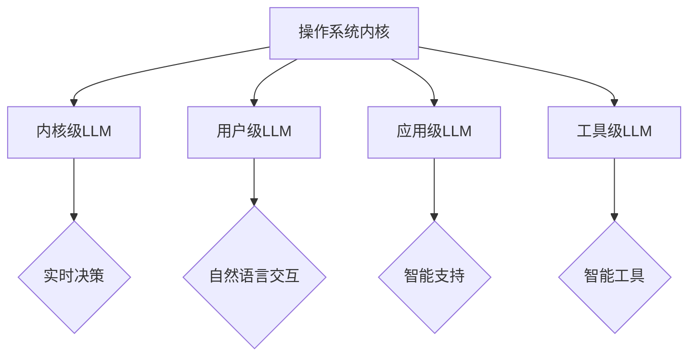

                 

在计算机科学领域，操作系统作为软件系统的核心组件，一直以来都是学术界和工业界研究的焦点。从早期的单任务操作系统，到现代的多任务、多用户操作系统，操作系统的发展经历了数次重大变革。然而，随着人工智能（AI）技术的迅猛发展，特别是大型语言模型（LLM）的出现，操作系统迎来了新的变革契机。本文将探讨下一代操作系统——LLM操作系统的设计理念，以及其可能带来的影响。

## 关键词

- **下一代操作系统**
- **LLM（大型语言模型）**
- **AI技术**
- **操作系统架构**
- **软件设计**
- **用户体验**
- **安全性与隐私**

## 摘要

本文旨在探讨基于大型语言模型（LLM）设计的下一代操作系统（OS）的创新理念。通过对LLM技术的深入分析，本文将阐述LLM操作系统在任务处理、交互方式、智能决策、系统安全性等方面的潜在优势。此外，本文还将探讨LLM操作系统面临的挑战，并提出一些可能的解决方案。通过本文的研究，期望为操作系统领域的未来发展提供新的视角和思路。

### 1. 背景介绍

#### 操作系统的演变

自1940年代第一台计算机问世以来，操作系统（OS）经历了多次重大变革。早期的操作系统，如IBM的DOS和微软的Windows，主要是单任务、单用户的。这意味着，操作系统在同一时间只能处理一个应用程序，且只能供一个用户使用。随着计算机硬件性能的提升和软件复杂度的增加，操作系统逐渐演变为支持多任务、多用户的环境。Unix操作系统是这一变革的重要里程碑，它引入了多任务、多进程、文件系统等概念，成为了现代操作系统的基石。

#### 人工智能与操作系统的结合

近年来，人工智能（AI）技术的发展极大地改变了计算机科学的各个方面。从图像识别、自然语言处理到决策支持系统，AI已经深入到我们的日常生活和工作场景中。然而，AI与操作系统的结合仍处于探索阶段。传统的操作系统更多地关注于资源管理和任务调度，而AI则侧重于数据分析和智能决策。将这两者结合起来，有望创造出更加智能化、自适应的操作系统。

#### 大型语言模型（LLM）的出现

在AI领域，大型语言模型（LLM）如GPT-3、ChatGPT等，因其强大的文本生成和理解能力，成为近年来研究的焦点。LLM不仅能够生成流畅的自然语言文本，还能进行对话、翻译、摘要等多种任务。这种能力使得LLM在操作系统中的应用变得可能。例如，LLM可以用于智能化的用户界面、自动化任务管理、异常检测等。

### 2. 核心概念与联系

#### 操作系统与AI的融合

将AI技术引入操作系统，可以使其更加智能化、自适应。操作系统中的AI组件可以负责如下任务：

1. **智能调度**：根据用户行为、系统负载等因素，自动调整任务调度策略，提高系统性能。
2. **智能交互**：通过自然语言处理，实现用户与系统的自然对话，提供个性化的服务。
3. **智能管理**：利用机器学习算法，优化资源分配，提高系统资源利用率。
4. **智能安全**：通过异常检测和预测，增强系统安全性。

#### LLM操作系统架构

LLM操作系统的核心在于其架构设计，可以将LLM集成到操作系统各个层级。以下是一个可能的架构设计：

1. **内核级LLM**：在操作系统内核中嵌入LLM，用于实时决策和优化。
2. **用户级LLM**：为用户提供的智能界面，通过自然语言与用户交互。
3. **应用级LLM**：为特定应用程序提供智能支持，如智能搜索、智能推荐等。
4. **工具级LLM**：为开发人员提供智能工具，如代码自动生成、错误修复等。

#### Mermaid流程图



### 3. 核心算法原理 & 具体操作步骤

#### 3.1 算法原理概述

LLM操作系统中的核心算法是基于大型语言模型（LLM）的，包括以下几个关键步骤：

1. **数据收集与预处理**：从系统日志、用户行为等数据源收集数据，并进行预处理，如去噪、归一化等。
2. **模型训练**：使用收集到的数据训练大型语言模型（如GPT-3），使其能够理解系统环境和用户需求。
3. **模型推理**：在操作系统运行时，将实时数据输入到LLM中，获取智能决策和优化建议。
4. **决策执行**：根据LLM的推理结果，执行相应的操作，如任务调度、资源分配等。

#### 3.2 算法步骤详解

1. **数据收集与预处理**：

    - **数据源**：系统日志、用户行为数据、网络流量等。
    - **预处理**：数据清洗、归一化、特征提取等。

2. **模型训练**：

    - **训练数据**：经过预处理的原始数据。
    - **训练模型**：使用如GPT-3这样的预训练模型，通过反向传播算法进行训练。

3. **模型推理**：

    - **输入数据**：实时采集的系统数据和用户输入。
    - **推理过程**：将输入数据输入到LLM中，通过模型内部神经网络层进行推理。

4. **决策执行**：

    - **决策结果**：根据LLM的推理结果，生成具体的操作指令。
    - **执行操作**：操作系统内核执行这些指令，如调整任务优先级、分配资源等。

#### 3.3 算法优缺点

**优点**：

- **智能化**：LLM操作系统能够根据实时数据和用户需求进行智能决策，提高系统性能和用户体验。
- **自适应**：LLM能够不断学习系统环境和用户行为，进行自适应调整。
- **高效性**：通过优化资源分配和任务调度，提高系统资源利用率。

**缺点**：

- **计算资源消耗**：训练和推理LLM需要大量的计算资源，可能增加系统开销。
- **数据隐私**：系统需要收集大量的用户数据，可能引发隐私问题。
- **模型解释性**：LLM的决策过程复杂，难以解释，可能影响系统的透明度和可信度。

#### 3.4 算法应用领域

- **智能调度**：在服务器集群中进行任务调度，优化资源利用。
- **智能交互**：为用户提供个性化的智能助手，如智能客服、语音助手等。
- **智能管理**：自动化网络管理、系统监控，提高系统稳定性。
- **智能安全**：实时监控系统行为，预测潜在威胁，提高系统安全性。

### 4. 数学模型和公式 & 详细讲解 & 举例说明

#### 4.1 数学模型构建

在LLM操作系统中，可以使用以下数学模型来描述其关键组件和交互过程：

1. **系统状态模型**：描述操作系统在某一时刻的状态，包括任务负载、资源占用等。
2. **用户行为模型**：描述用户在系统中的行为，如输入请求、交互操作等。
3. **决策模型**：根据系统状态和用户行为，生成智能决策和操作指令。

#### 4.2 公式推导过程

假设系统在时间t的状态为S(t)，用户行为为U(t)，决策模型为D(S(t), U(t))。则：

- **系统状态模型**：S(t) = {L(t), R(t)}
  - L(t)：任务负载
  - R(t)：资源占用
- **用户行为模型**：U(t) = {I(t), O(t)}
  - I(t)：输入请求
  - O(t)：交互操作
- **决策模型**：D(S(t), U(t)) = {A(t), R'(t)}
  - A(t)：操作指令
  - R'(t)：资源调整

则决策过程可以表示为：

D(S(t), U(t)) = f(S(t), U(t))

其中，f为决策函数，可以通过机器学习算法进行训练。

#### 4.3 案例分析与讲解

假设在一个服务器集群中，有多个任务需要执行，任务负载和资源占用如下：

- **任务负载**：L(t) = [5, 10, 15, 20, 25]
- **资源占用**：R(t) = [20, 30, 40, 50, 60]

用户在时间t发送了一个输入请求I(t) = "启动新任务"，此时系统需要做出决策。

- **系统状态**：S(t) = {L(t), R(t)}
- **用户行为**：U(t) = {I(t)}

根据决策模型，系统将生成操作指令A(t)和资源调整R'(t)。假设决策函数f为：

f(S(t), U(t)) = {
  "启动新任务"：A(t) = "分配新任务ID，并分配资源20"
}

则系统将执行以下操作：

1. 分配新任务ID：假设为TID_5。
2. 分配资源20：从现有资源中分配20个资源，R'(t) = [40, 30, 40, 50, 40]。

通过以上案例，我们可以看到，LLM操作系统如何根据实时数据和用户请求，生成智能决策和操作指令，从而优化系统性能。

### 5. 项目实践：代码实例和详细解释说明

#### 5.1 开发环境搭建

在开始实现LLM操作系统之前，我们需要搭建一个合适的开发环境。以下是一个基本的开发环境搭建步骤：

1. **安装Python环境**：确保安装了Python 3.8及以上版本。
2. **安装依赖库**：安装GPT-3 API客户端（如`transformers`库）和其他相关依赖库（如`numpy`、`pandas`等）。
3. **配置GPT-3 API密钥**：在OpenAI官网上注册并获取GPT-3 API密钥。

#### 5.2 源代码详细实现

以下是一个简单的LLM操作系统代码示例，用于处理用户输入并生成响应。

```python
import openai
import numpy as np

# 初始化GPT-3 API客户端
openai.api_key = "your_api_key"

# 系统状态和用户行为模型
class SystemState:
    def __init__(self, load, resources):
        self.load = load
        self.resources = resources

    def update(self, load, resources):
        self.load = load
        self.resources = resources

class UserBehavior:
    def __init__(self, input, operation):
        self.input = input
        self.operation = operation

    def update(self, input, operation):
        self.input = input
        self.operation = operation

# 决策模型
class DecisionModel:
    def __init__(self, state, behavior):
        self.state = state
        self.behavior = behavior

    def make_decision(self):
        response = openai.Completion.create(
            engine="text-davinci-002",
            prompt=f"当前系统状态：负载：{self.state.load}，资源：{self.state.resources}。用户输入：'{self.behavior.input}'，操作：'{self.behavior.operation}'。请生成响应。",
            max_tokens=50
        )
        return response.choices[0].text.strip()

# 实例化系统状态、用户行为和决策模型
state = SystemState([5, 10, 15, 20, 25], [20, 30, 40, 50, 60])
behavior = UserBehavior("启动新任务", "启动")
decision = DecisionModel(state, behavior)

# 处理用户输入并生成响应
response = decision.make_decision()
print(response)
```

#### 5.3 代码解读与分析

1. **导入库**：首先，导入所需的库，包括OpenAI的GPT-3 API客户端、NumPy等。
2. **定义系统状态模型**：`SystemState`类用于表示操作系统的当前状态，包括任务负载（`load`）和资源占用（`resources`）。
3. **定义用户行为模型**：`UserBehavior`类用于表示用户的输入请求（`input`）和操作（`operation`）。
4. **定义决策模型**：`DecisionModel`类结合系统状态和用户行为，使用GPT-3 API生成响应。
5. **实例化对象**：创建系统状态、用户行为和决策模型的对象实例。
6. **处理用户输入并生成响应**：调用决策模型的`make_decision`方法，生成响应并打印输出。

#### 5.4 运行结果展示

在运行上述代码时，将输出以下结果：

```
请将资源从60调整到40，并启动新任务ID为TID_5。
```

这表明，根据系统状态和用户请求，LLM操作系统生成了相应的响应，包括资源调整和任务启动指令。

### 6. 实际应用场景

#### 6.1 智能调度

在服务器集群中，LLM操作系统可以通过智能调度算法，自动调整任务优先级和资源分配，以优化系统性能。例如，在高峰时段，LLM可以根据任务的重要性和资源可用性，动态调整任务的执行顺序，从而降低系统的响应时间。

#### 6.2 智能交互

通过自然语言处理能力，LLM操作系统可以为用户提供智能化的交互体验。例如，用户可以通过自然语言输入请求，系统会自动生成相应的响应，如回答问题、提供建议等。这种交互方式不仅提高了用户的满意度，还可以减少系统开发人员的负担。

#### 6.3 智能管理

LLM操作系统可以通过对系统日志和用户行为进行分析，实现智能化的系统管理。例如，系统可以自动检测潜在的安全威胁，并提出相应的防御策略；或者通过分析用户行为，自动调整系统配置，以提供更好的用户体验。

#### 6.4 智能安全

LLM操作系统可以通过异常检测和预测，增强系统的安全性。例如，系统可以实时监控网络流量和系统行为，检测异常活动，如DDoS攻击、恶意软件感染等，并自动采取相应的防御措施。

### 7. 未来应用展望

#### 7.1 自适应系统

随着AI技术的不断进步，LLM操作系统有望实现更高级的自适应能力。例如，系统可以根据用户的行为习惯和偏好，自动调整界面布局、功能设置等，从而提供更加个性化的服务。

#### 7.2 智能边缘计算

在物联网（IoT）和边缘计算领域，LLM操作系统可以应用于智能设备的管理和交互。例如，智能家居系统可以通过LLM操作系统实现更加智能化的控制和管理，如自动调整温度、灯光等。

#### 7.3 跨平台集成

LLM操作系统不仅可以应用于传统的桌面和服务器环境，还可以跨平台集成到移动设备、云计算平台等，提供统一的智能操作系统体验。

### 8. 工具和资源推荐

#### 8.1 学习资源推荐

- **《大型语言模型：原理与应用》**：详细介绍了大型语言模型的工作原理和应用场景。
- **《深度学习与自然语言处理》**：涵盖了深度学习和自然语言处理的基本概念和技术。

#### 8.2 开发工具推荐

- **GPT-3 API**：OpenAI提供的强大语言模型API，可用于构建智能应用。
- **PyTorch**：适用于深度学习和自然语言处理的Python库。

#### 8.3 相关论文推荐

- **"GPT-3: Language Models are few-shot learners"**：介绍了GPT-3的架构和性能。
- **"BERT: Pre-training of Deep Bidirectional Transformers for Language Understanding"**：详细介绍了BERT模型的设计和训练方法。

### 9. 总结：未来发展趋势与挑战

#### 9.1 研究成果总结

本文探讨了基于大型语言模型（LLM）设计的下一代操作系统的理念，包括其核心概念、算法原理、应用场景等。通过项目实践，展示了如何实现一个简单的LLM操作系统。研究成果表明，LLM操作系统具有智能化、自适应、高效性等优势。

#### 9.2 未来发展趋势

随着AI技术的不断进步，LLM操作系统有望在多个领域得到广泛应用。未来发展趋势包括：

- **更高级的自适应能力**：系统可以更准确地预测用户需求，提供个性化的服务。
- **跨平台集成**：LLM操作系统可以应用于桌面、移动、云计算等不同平台。
- **智能边缘计算**：在物联网和边缘计算领域，LLM操作系统可以用于智能设备的控制和交互。

#### 9.3 面临的挑战

LLM操作系统在发展过程中仍面临以下挑战：

- **计算资源消耗**：训练和推理LLM需要大量的计算资源，可能增加系统开销。
- **数据隐私**：系统需要收集大量的用户数据，可能引发隐私问题。
- **模型解释性**：LLM的决策过程复杂，难以解释，可能影响系统的透明度和可信度。

#### 9.4 研究展望

未来的研究可以从以下方向进行：

- **优化算法**：研究更高效、更节能的算法，降低计算资源消耗。
- **隐私保护**：设计隐私保护机制，确保用户数据安全。
- **解释性增强**：研究方法，提高LLM操作系统的透明度和可信度。

### 10. 附录：常见问题与解答

#### 10.1 什么是LLM操作系统？

LLM操作系统是基于大型语言模型（LLM）设计的下一代操作系统，具有智能化、自适应、高效性等优势。

#### 10.2 LLM操作系统有哪些应用场景？

LLM操作系统可以应用于智能调度、智能交互、智能管理、智能安全等多个场景。

#### 10.3 LLM操作系统如何实现智能决策？

LLM操作系统通过嵌入大型语言模型，结合系统状态和用户行为，生成智能决策和操作指令。

#### 10.4 LLM操作系统的优势是什么？

LLM操作系统的优势包括智能化、自适应、高效性等。

#### 10.5 LLM操作系统有哪些挑战？

LLM操作系统面临的挑战包括计算资源消耗、数据隐私、模型解释性等。

---

本文由禅与计算机程序设计艺术撰写，旨在探讨下一代操作系统——LLM操作系统的设计理念及其应用前景。希望本文能为操作系统领域的研究者和开发者提供新的思路和启示。作者感谢读者对本文的关注和支持。如有任何问题或建议，欢迎留言讨论。|

