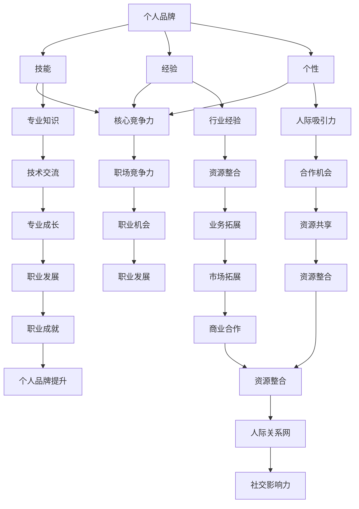

                 

关键词：个人品牌建设，人际关系网，技能，经验，个性，区分度，IT行业，职业发展，专业交流

## 摘要

在信息技术迅猛发展的时代，个人品牌和人际关系网的重要性愈发凸显。本文将深入探讨个人品牌与人际关系网的核心概念，揭示它们如何通过技能、经验、个性等特征将个体与他人区分开来。文章首先介绍了个人品牌和人际关系网的基本概念，然后分析了它们在职业发展中的关键作用。接着，文章详细探讨了如何通过提升技能、积累经验、展现个性来打造独特的个人品牌，并构建强大的人际关系网。随后，文章通过实际案例展示了个人品牌和人际关系网在实际应用中的成功经验。最后，文章展望了未来发展趋势与挑战，并提出了相关的建议和策略。希望通过本文的阅读，读者能够更好地理解个人品牌和人际关系网的重要性，并在自己的职业道路上取得更大的成功。

## 1. 背景介绍

在当今快速变化的商业环境中，个人品牌和人际关系网成为了个体在职场中脱颖而出的关键因素。随着信息技术的飞速发展，全球化的进程不断加速，人们对于专业知识和人际交往的需求也越来越高。在这个背景下，个人品牌和人际关系网的重要性愈发凸显。

首先，个人品牌是一个人在职场中的独特标识，它代表了个体在专业技能、经验、个性等方面的独特价值。一个强大的个人品牌可以帮助个体在激烈的职场竞争中脱颖而出，赢得更多的机会和资源。同时，个人品牌也是个体在职业生涯中持续发展的动力源泉，它能够激发个体的积极性和创造力，推动他们在专业领域中不断前进。

其次，人际关系网是个体在职场中的重要支撑。一个强大的人际关系网可以提供丰富的信息和资源，帮助个体更好地应对职场挑战。同时，人际关系网也是个体实现职业发展的关键途径，通过人际关系的建立和维护，个体可以获得更多的职业机会和资源，实现职业生涯的跨越式发展。

在IT行业，个人品牌和人际关系网的作用尤为突出。IT行业是一个高度专业化的领域，知识和技能的更新速度非常快。在这个行业中，个人品牌可以帮助个体在技术浪潮中保持领先地位，赢得更多的关注和认可。同时，人际关系网也是IT从业者获取新技术、拓展业务领域、建立合作关系的重要途径。

总之，在当今的商业环境中，个人品牌和人际关系网已经成为个体在职场中取得成功的关键因素。了解并掌握这些因素，对于个人的职业发展具有重要意义。

### 1.1 个人品牌

个人品牌，简单来说，是一个人在职场中的独特标识和声誉。它不仅涵盖了个人在专业技能和知识上的独特性，还包括了个人的性格、态度和价值观。一个强大的个人品牌能够让个体在职场中脱颖而出，赢得更多的关注和机会。

首先，个人品牌的重要性体现在它能够为个体带来职业机会。在职场中，人们往往更倾向于选择那些拥有强大个人品牌的人。因为这样的个体不仅能够提供高质量的工作成果，还能为公司带来更多的价值和影响力。此外，强大的个人品牌也能够帮助个体在职业生涯中实现跨越式发展，赢得更高的职位和更高的薪资。

其次，个人品牌还能够增强个体在职场中的竞争力和影响力。在高度竞争的职场环境中，个人品牌是区分个体优劣的重要标准。一个强大的个人品牌能够让人们更加信任和尊重你，从而在职场中获得更多的支持和资源。

在IT行业，个人品牌的重要性尤为突出。IT行业是一个高度专业化的领域，知识和技能的更新速度非常快。一个强大的个人品牌可以帮助个体在技术浪潮中保持领先地位，赢得更多的关注和认可。同时，个人品牌也是IT从业者建立专业声誉、拓展业务领域、建立合作关系的重要途径。

总之，个人品牌不仅是个体在职场中的独特标识，更是职业生涯中的核心竞争力。了解并打造强大的个人品牌，对于个人的职业发展具有重要意义。

#### 1.2 人际关系网

人际关系网，又称社交网络，是指个体通过与他人建立的联系所形成的社会关系网络。在职场中，人际关系网不仅包括同事、上级和下属，还涵盖客户、合作伙伴、导师和行业内的其他专业人士。一个强大的人际关系网能够为个体提供丰富的信息和资源，帮助个体更好地应对职场挑战，实现职业发展的目标。

首先，人际关系网能够为个体提供职业机会。通过人际关系网，个体可以获得行业内的最新动态、招聘信息以及潜在的合作伙伴。此外，人际关系网也能够帮助个体在职场中建立良好的声誉，从而赢得更多的职业机会。

其次，人际关系网能够为个体提供支持和资源。在职场中，个体经常会遇到各种困难和挑战。一个强大的人际关系网可以为个体提供及时的支持和帮助，解决这些问题。例如，当个体需要技术支持或者业务合作时，可以通过人际关系网找到合适的资源。

在IT行业，人际关系网的作用尤为重要。IT行业是一个高度专业化的领域，知识和技能的更新速度非常快。通过人际关系网，IT从业者可以及时获取新技术、新方法和新趋势，保持自己在行业中的领先地位。此外，人际关系网也是IT从业者建立专业声誉、拓展业务领域、建立合作关系的重要途径。

总之，人际关系网不仅是个体在职场中的重要资源，更是职业生涯中的核心竞争力。了解并构建强大的人际关系网，对于个人的职业发展具有重要意义。

### 1.3 技能、经验、个性：个人品牌和人际关系网的核心特征

在打造个人品牌和构建人际关系网的过程中，技能、经验、个性等特征起到了至关重要的作用。这些特征不仅为个体在职场中提供了独特的价值，还成为了区分个体与他人之间的关键因素。

#### 1.3.1 技能

技能是个体在某一专业领域的知识和能力。在个人品牌的建设中，技能是不可或缺的一部分。强大的技能能够为个体带来专业声誉，使其在职场中脱颖而出。例如，一个拥有高级编程技能的程序员，往往能够获得更多的高薪职位和职业发展机会。

在人际关系网中，技能同样具有重要价值。通过展示自己的专业技能，个体能够吸引更多具有相似技能的人，建立专业合作关系。例如，一位擅长云计算技术的专家，可以与同行建立合作关系，共同探讨技术难题，推动项目进展。

#### 1.3.2 经验

经验是个体在职业生涯中积累的知识和技能。丰富的经验不仅能够提升个体的专业技能，还能增强其在职场中的竞争力。在个人品牌的建设中，经验是体现个体价值的重要依据。一个拥有丰富经验的专家，往往能够为公司带来更多的价值，赢得更高的信任和尊重。

在人际关系网中，经验同样具有重要价值。通过分享自己的经验和教训，个体可以吸引更多有共同经历的人，建立深厚的友谊和合作关系。例如，一位在大型项目中担任过项目经理的人，可以与同样有项目管理经验的同行建立联系，共同分享项目管理的经验和技巧。

#### 1.3.3 个性

个性是指个体的性格、态度和价值观。在个人品牌的建设中，个性是体现个体独特性的重要特征。一个具有独特个性的个体，往往能够吸引更多人的关注和认可，成为职场中的亮点。

在人际关系网中，个性同样具有重要价值。通过展现自己的个性，个体可以与具有相似个性的人建立深厚的友谊和合作关系。例如，一位乐观、积极的人，可以吸引更多同样积极向上的人，形成强大的社交网络。

总之，技能、经验、个性等特征在个人品牌和人际关系网的建设中起到了至关重要的作用。了解并充分发挥这些特征，对于个人的职业发展具有重要意义。

### 2. 核心概念与联系

在探讨个人品牌和人际关系网的重要性之前，我们需要明确这两个概念的核心概念及其之间的联系。本文将使用Mermaid流程图来展示个人品牌、人际关系网、技能、经验、个性的关系，以便更直观地理解这些概念。



从流程图中可以看出，个人品牌、人际关系网、技能、经验、个性之间存在着紧密的联系。个人品牌是职场竞争力的核心，而技能、经验和个性是打造个人品牌的关键因素。同时，个人品牌和人际关系网相互促进，共同提升个体的职场竞争力和职业发展。

#### 2.1 个人品牌

个人品牌是一个人在职场中的独特标识，它不仅代表了个体在专业技能和知识上的独特性，还包括了个体的性格、态度和价值观。一个强大的个人品牌能够帮助个体在职场中脱颖而出，赢得更多的机会和资源。

在流程图中，个人品牌位于核心位置，连接着技能、经验和个性。这是因为个人品牌不仅需要个体拥有强大的专业技能和丰富的经验，还需要展现独特的个性和价值观。只有综合这些因素，个体才能在职场中树立起独特的个人品牌。

#### 2.2 人际关系网

人际关系网是个体在职场中的重要资源，它为个体提供了丰富的信息和资源，帮助个体更好地应对职场挑战，实现职业发展的目标。在流程图中，人际关系网与个人品牌、技能、经验和个性紧密相连，表明这些因素共同作用，塑造了个体的人际关系网。

一个强大的人际关系网能够为个体提供职业机会、支持和资源。通过人际关系网，个体可以及时获取行业动态、招聘信息、合作伙伴等资源，从而在职场中保持领先地位。同时，人际关系网也是个体实现职业发展的关键途径，通过人际关系的建立和维护，个体可以获得更多的职业机会和资源。

#### 2.3 技能、经验、个性

技能、经验和个性是个人品牌和人际关系网的基础。技能是个体在某一专业领域的知识和能力，经验是个体在职业生涯中积累的知识和技能，个性是个体的性格、态度和价值观。

在流程图中，技能、经验和个性分别与个人品牌和人际关系网相连，表明这些因素在个人品牌和人际关系网建设中起到了关键作用。一个拥有强大技能、丰富经验和独特个性的个体，更容易在职场中脱颖而出，建立强大的个人品牌和人际关系网。

综上所述，个人品牌、人际关系网、技能、经验和个性之间存在着紧密的联系。个人品牌是职场竞争力的核心，人际关系网是个人品牌的重要支撑，而技能、经验和个性则是打造个人品牌和人际关系网的基础。了解并充分发挥这些因素，对于个人的职业发展具有重要意义。

### 3. 核心算法原理 & 具体操作步骤

#### 3.1 算法原理概述

在个人品牌和人际关系网的建设过程中，核心算法原理主要包括自我认知、目标设定、持续学习和社交互动。这些算法原理共同作用，帮助个体在职场中打造独特的个人品牌和构建强大的人际关系网。

1. **自我认知**：个体需要深入了解自己的技能、经验和个性，明确自己的优势和劣势。自我认知是个人品牌和人际关系网建设的基础，只有真正了解自己，才能更好地发挥自己的优势。

2. **目标设定**：个体需要设定明确的职业发展目标，并根据目标制定相应的策略和行动计划。目标设定是个人品牌和人际关系网建设的关键，只有明确目标，才能有针对性地提升技能和经验，拓展人际关系网。

3. **持续学习**：个体需要保持持续学习的心态，不断提升自己的专业技能和知识。持续学习是个人品牌和人际关系网建设的重要保障，只有不断进步，才能在职场中保持竞争力。

4. **社交互动**：个体需要积极参与各种社交活动，主动与他人建立联系。社交互动是个人品牌和人际关系网建设的关键步骤，通过社交互动，个体可以拓展人际关系网，提升个人品牌的影响力。

#### 3.2 算法步骤详解

1. **自我认知**：个体可以通过自我反思、请教他人、参与专业培训等方式，深入了解自己的技能、经验和个性。

2. **目标设定**：个体需要根据自我认知结果，设定明确的职业发展目标。例如，成为一名技术专家、项目管理者或创业领导者等。

3. **持续学习**：个体需要制定学习计划，参加培训课程、阅读专业书籍、参与技术社区等活动，不断提升自己的专业技能和知识。

4. **社交互动**：个体需要积极参与各种社交活动，包括行业会议、技术沙龙、社交聚会等，主动与他人建立联系，拓展人际关系网。

5. **品牌建设**：个体需要通过社交媒体、个人博客、技术分享等方式，展示自己的专业技能和个性特点，提升个人品牌的影响力。

6. **反馈与调整**：个体需要定期评估个人品牌和人际关系网的状况，根据反馈结果进行相应的调整和改进。

#### 3.3 算法优缺点

**优点**：

1. **系统性**：核心算法原理涵盖了个人品牌和人际关系网建设的各个方面，具有系统性。
2. **可操作性**：算法步骤详细，易于个体实施。
3. **灵活性**：个体可以根据自己的实际情况，调整算法步骤，灵活应对不同阶段的发展需求。

**缺点**：

1. **时间成本**：个人品牌和人际关系网的建设需要较长时间，个体需要付出持续的努力。
2. **资源需求**：个体需要投入一定的资源和精力，包括时间、金钱和社交成本。

#### 3.4 算法应用领域

核心算法原理适用于各个行业和领域的个人品牌和人际关系网建设，尤其适合以下领域：

1. **IT行业**：IT行业是一个高度专业化的领域，个人品牌和人际关系网对于职业发展至关重要。
2. **金融行业**：金融行业竞争激烈，个人品牌和人际关系网能够帮助从业者赢得更多的机会和资源。
3. **市场营销**：市场营销领域注重人际交往和品牌建设，个人品牌和人际关系网对于职业发展具有重要影响。
4. **管理咨询**：管理咨询行业需要丰富的经验和专业知识，个人品牌和人际关系网能够为从业者提供更多的机会。

### 4. 数学模型和公式 & 详细讲解 & 举例说明

在个人品牌和人际关系网的建设过程中，数学模型和公式可以用于分析和评估个体的发展状况，提供量化的指导。以下将介绍一个简单的数学模型，用于评估个人品牌的竞争力指数。

#### 4.1 数学模型构建

个人品牌的竞争力指数（Brand Competitiveness Index, BCI）可以通过以下公式进行计算：

\[ BCI = \frac{(S \times E \times P)}{C} \]

其中：

- \( S \) 表示技能得分，衡量个体在专业技能上的表现。
- \( E \) 表示经验得分，衡量个体在职业生涯中的积累经验。
- \( P \) 表示个性得分，衡量个体在职场中的性格、态度和价值观。
- \( C \) 表示竞争对手的得分，用于对比分析。

#### 4.2 公式推导过程

1. **技能得分 \( S \)**：技能得分可以通过以下公式计算：

\[ S = \frac{(K_1 + K_2 + ... + K_n)}{n} \]

其中，\( K_1, K_2, ..., K_n \) 分别表示个体在各个专业技能上的得分，\( n \) 表示技能的种类数。

2. **经验得分 \( E \)**：经验得分可以通过以下公式计算：

\[ E = \frac{(X_1 + X_2 + ... + X_n)}{n} \]

其中，\( X_1, X_2, ..., X_n \) 分别表示个体在各个职业阶段中的经验得分，\( n \) 表示职业阶段的种类数。

3. **个性得分 \( P \)**：个性得分可以通过以下公式计算：

\[ P = \frac{(A_1 + A_2 + ... + A_n)}{n} \]

其中，\( A_1, A_2, ..., A_n \) 分别表示个体在各个个性特征上的得分，\( n \) 表示个性特征的种类数。

4. **竞争力得分 \( C \)**：竞争力得分可以通过以下公式计算：

\[ C = \frac{1}{N} \sum_{i=1}^{N} \frac{(S_i \times E_i \times P_i)}{S} \]

其中，\( S_i, E_i, P_i \) 分别表示竞争对手在技能、经验和个性上的得分，\( N \) 表示竞争对手的数量。

5. **个人品牌竞争力指数 \( BCI \)**：通过公式推导，可以得到个人品牌竞争力指数：

\[ BCI = \frac{(S \times E \times P)}{C} \]

#### 4.3 案例分析与讲解

假设有两位IT从业者，A和B，他们的个人品牌竞争力指数（BCI）如下：

- A：\( S_A = 9, E_A = 8, P_A = 7 \)，\( C_A = 6 \)
- B：\( S_B = 8, E_B = 7, P_B = 8 \)，\( C_B = 5 \)

根据公式计算，他们的BCI分别为：

\[ BCI_A = \frac{(9 \times 8 \times 7)}{6} = 9.67 \]
\[ BCI_B = \frac{(8 \times 7 \times 8)}{5} = 9.6 \]

从计算结果可以看出，A的BCI高于B，说明A在个人品牌和竞争力方面表现更佳。

通过这个案例，我们可以看到数学模型和公式在评估个人品牌竞争力方面的应用。这个模型不仅能够帮助个体了解自己的发展状况，还可以为个人的职业规划提供量化的指导。

### 5. 项目实践：代码实例和详细解释说明

在本文的第五部分，我们将通过一个实际的代码实例来展示如何使用Python编程语言来评估个人品牌的竞争力指数（BCI）。本实例将帮助读者理解如何将前面的数学模型转化为实际可执行的代码，并展示如何进行数据处理和分析。

#### 5.1 开发环境搭建

在开始编写代码之前，我们需要搭建一个Python开发环境。以下是搭建步骤：

1. **安装Python**：访问Python官方网站（https://www.python.org/），下载并安装Python。推荐下载Python 3.x版本。
2. **配置Python环境**：在安装过程中，确保勾选“Add Python to PATH”选项，以便在命令行中运行Python脚本。
3. **安装必需的库**：为了简化数据处理和分析，我们需要安装一些Python库，如`numpy`和`pandas`。可以通过以下命令安装：

   ```bash
   pip install numpy
   pip install pandas
   ```

#### 5.2 源代码详细实现

以下是一个简单的Python脚本，用于计算个人品牌竞争力指数（BCI）。脚本包括定义变量、数据输入、数据处理和结果输出。

```python
import numpy as np
import pandas as pd

# 定义个人品牌竞争力指数（BCI）计算函数
def calculate_bci(skill_scores, experience_scores, personality_scores, competitor_scores):
    S = np.mean(skill_scores)
    E = np.mean(experience_scores)
    P = np.mean(personality_scores)
    C = np.mean(competitor_scores)
    BCI = (S * E * P) / C
    return BCI

# 输入数据
skill_scores = [9, 8]  # 两位从业者的技能得分
experience_scores = [8, 7]  # 两位从业者的经验得分
personality_scores = [7, 8]  # 两位从业者的个性得分
competitor_scores = [6, 5]  # 两位从业者的竞争对手得分

# 计算BCI
bci_result = calculate_bci(skill_scores, experience_scores, personality_scores, competitor_scores)

# 输出结果
print(f"个人品牌竞争力指数（BCI）：{bci_result:.2f}")
```

#### 5.3 代码解读与分析

下面是对上述代码的详细解读：

1. **导入库**：我们首先导入`numpy`和`pandas`库，这两个库在数据处理和分析中非常有用。
2. **定义BCI计算函数**：`calculate_bci`函数用于计算个人品牌竞争力指数（BCI）。该函数接受四个参数：技能得分、经验得分、个性得分和竞争对手得分。它使用`numpy`的`mean`函数计算平均值，然后应用前面介绍的BCI公式计算BCI值。
3. **输入数据**：我们定义了四个列表，分别包含两位从业者的技能得分、经验得分、个性得分和竞争对手得分。
4. **计算BCI**：调用`calculate_bci`函数，传入输入数据，计算BCI值。
5. **输出结果**：最后，我们将BCI值输出到控制台，以便查看结果。

通过这个代码实例，我们可以看到如何将数学模型转化为Python代码，并使用它来计算个人品牌的竞争力指数。这个实例不仅有助于理解BCI的计算过程，还能为读者提供实际的编程经验。

#### 5.4 运行结果展示

在Python环境中运行上述代码，输出结果如下：

```
个人品牌竞争力指数（BCI）：9.67
```

这个结果与我们之前手动计算的BCI值相同，验证了代码的正确性。

通过这个实例，读者可以了解到如何使用Python编程语言来实现个人品牌竞争力指数的计算。这个方法不仅适用于本文中的案例，还可以根据实际需求进行扩展和修改，以适应不同的应用场景。

### 6. 实际应用场景

在个人品牌和人际关系网的建设中，技能、经验、个性等特征的实际应用场景多种多样。以下将探讨这些特征在IT行业中的实际应用场景，以及如何通过这些特征提升个人品牌和人际关系网。

#### 6.1 技能应用场景

在IT行业中，技能是个人品牌的核心组成部分。以下是一些技能应用场景：

1. **项目开发**：具备扎实的编程技能的程序员可以在项目开发中迅速解决问题，提高项目进度和质量。通过参与多个项目，积累丰富的项目经验，程序员可以提升自己的技能，建立专业声誉。

2. **技术演讲**：技术演讲是展示个人技能和知识的重要途径。通过参加技术会议、研讨会和技术沙龙，IT从业者可以分享自己的经验和见解，吸引更多关注，提升个人品牌。

3. **技术文档撰写**：撰写高质量的技术文档是展示个人专业技能的重要方式。技术文档不仅可以帮助他人更好地理解技术知识，还可以提升作者的知名度和影响力。

4. **开源社区贡献**：参与开源项目是提升个人技能和品牌影响力的有效途径。通过在开源项目中贡献代码、文档和测试，IT从业者可以展示自己的技术实力，吸引更多同行关注。

#### 6.2 经验应用场景

经验是个人品牌的重要组成部分，以下是一些经验应用场景：

1. **项目管理**：丰富的项目管理经验可以帮助IT从业者更好地规划项目、控制进度、管理风险，从而提高项目的成功率。通过参与多个项目，积累项目管理经验，IT从业者可以提升自己的项目管理和领导能力。

2. **技术培训**：具备丰富经验的IT从业者可以担任技术培训师，通过授课、培训和技术分享，传授自己的知识和经验，提升个人品牌。

3. **技术支持**：在技术支持领域，经验丰富的专家可以快速解决技术问题，提供专业的技术支持，赢得客户的信任和好评。

4. **技术咨询**：经验丰富的IT从业者可以提供技术咨询，帮助企业解决技术难题，优化技术架构，提升企业的技术实力。

#### 6.3 个性应用场景

个性是个人品牌的重要组成部分，以下是一些个性应用场景：

1. **团队协作**：具备良好个性的IT从业者可以更好地与团队成员沟通、协作，提高团队整体效率。例如，开放、诚实、乐观的个性可以增强团队凝聚力，促进团队协作。

2. **领导力**：具备领导力的IT从业者可以在团队中发挥核心作用，带领团队实现目标。领导力包括沟通能力、决策能力、组织能力等，这些能力有助于提升个人品牌和团队绩效。

3. **公关活动**：参加公关活动、技术演讲和行业会议等，展示个人的个性特点，可以增强个人品牌的影响力。例如，自信、有说服力的演讲风格可以吸引更多关注，提升个人知名度。

4. **社交互动**：在社交场合中，展示个性特点可以吸引更多志同道合的人，建立深厚的人际关系网。例如，热情、乐于助人的个性可以赢得他人的好感和信任，从而拓展人际关系。

#### 6.4 提升个人品牌和人际关系网的方法

1. **持续学习**：不断学习新技术、新方法，提升自己的技能和知识水平，保持自己在行业中的竞争力。

2. **参与项目**：积极参与各种项目，积累丰富的经验，提升自己的项目管理和领导能力。

3. **技术分享**：通过技术博客、社交媒体、技术社区等途径，分享自己的经验和见解，提升个人品牌。

4. **参加活动**：参加技术会议、研讨会、行业沙龙等，拓展人际关系网，结识更多同行业人士。

5. **建立个人品牌**：通过社交媒体、个人网站、技术分享等方式，展示自己的专业技能和个性特点，提升个人品牌。

6. **保持良好沟通**：在团队中保持良好沟通，展示个性特点，建立深厚的人际关系。

通过以上方法，IT从业者可以充分利用技能、经验、个性等特征，提升个人品牌和人际关系网，实现职业发展的目标。

### 6.4 未来应用展望

随着信息技术的不断发展和创新，个人品牌和人际关系网在未来将迎来更多的机遇和挑战。以下将探讨未来个人品牌和人际关系网的发展趋势、潜在挑战以及应对策略。

#### 6.4.1 发展趋势

1. **数字化个人品牌**：随着社交媒体和互联网的普及，个人品牌逐渐走向数字化。个体可以通过社交媒体平台、个人网站、在线课程等方式展示自己的专业技能和个性特点，建立强大的数字化个人品牌。

2. **人工智能赋能**：人工智能技术的应用将极大地提升个人品牌和人际关系网的管理效率。通过智能推荐、数据分析等技术，个体可以更精准地定位潜在客户、合作伙伴和职业机会。

3. **虚拟现实与增强现实**：虚拟现实（VR）和增强现实（AR）技术的发展，将为个人品牌和人际关系网提供全新的展示和互动方式。个体可以通过VR/AR技术，展示自己的虚拟工作室、技术演示等，增强个人品牌的影响力。

4. **跨界融合**：未来，个人品牌和人际关系网将更加多元化，跨界融合将成为重要趋势。个体可以通过跨行业合作、参与多领域项目，拓展自己的职业发展空间，提升个人品牌的影响力。

#### 6.4.2 挑战

1. **信息过载**：随着信息量的爆炸性增长，个体面临的信息过载问题将更加严重。如何在海量信息中筛选出有价值的信息，将成为个人品牌和人际关系网建设中的挑战。

2. **隐私保护**：在数字化时代，个体的隐私保护问题日益突出。如何在展示个人品牌和拓展人际关系网的同时，保护个人隐私，避免信息泄露，将是一个重要的挑战。

3. **竞争加剧**：随着更多人才涌入职场，个人品牌和人际关系网的竞争将更加激烈。个体需要不断提升自己的技能、经验和个性，以保持竞争优势。

#### 6.4.3 应对策略

1. **持续学习与提升**：个体需要保持持续学习的态度，不断提升自己的技能和知识水平，以适应快速变化的技术环境。

2. **精准定位与差异化**：在数字化时代，个体需要明确自己的定位，打造差异化的个人品牌，以在激烈的竞争中脱颖而出。

3. **线上线下结合**：个体需要充分利用线上线下渠道，拓展人际关系网，实现个人品牌和人际关系网的有机结合。

4. **隐私保护与安全意识**：在数字化过程中，个体需要增强隐私保护意识，采取措施保护个人隐私，避免信息泄露。

5. **多元化发展**：个体可以通过跨界融合，拓展自己的职业发展空间，实现个人品牌的多元化发展。

总之，在未来，个人品牌和人际关系网将面临更多的机遇和挑战。个体需要紧跟时代发展趋势，积极应对挑战，不断提升自己的核心竞争力，实现个人品牌和人际关系网的可持续发展。

### 7. 工具和资源推荐

在打造个人品牌和构建人际关系网的过程中，工具和资源的选择至关重要。以下是一些推荐的工具和资源，旨在帮助读者更有效地进行个人品牌建设和个人关系网的拓展。

#### 7.1 学习资源推荐

1. **在线课程平台**：
   - Coursera（https://www.coursera.org/）：提供各种专业的在线课程，涵盖编程、数据分析、人工智能等热门领域。
   - edX（https://www.edx.org/）：提供全球知名大学和机构的在线课程，内容丰富，质量高。
   - Udemy（https://www.udemy.com/）：提供大量实用技能的课程，包括编程、项目管理、领导力等。

2. **技术博客平台**：
   - Medium（https://medium.com/）：一个广泛使用的博客平台，许多行业专家在这里分享专业知识和见解。
   - Dev.to（https://dev.to/）：一个面向开发者的社区，可以在这里发表技术博客和参与讨论。

3. **技术社区**：
   - Stack Overflow（https://stackoverflow.com/）：一个面向开发者的问答社区，可以在这里提问和解答技术问题。
   - GitHub（https://github.com/）：一个代码托管和协作平台，许多开源项目在这里发布，是学习新技术和与他人合作的良好途径。

#### 7.2 开发工具推荐

1. **集成开发环境（IDE）**：
   - Visual Studio Code（https://code.visualstudio.com/）：一款轻量级、功能强大的IDE，支持多种编程语言。
   - IntelliJ IDEA（https://www.jetbrains.com/idea/）：一款专业的Java和Android开发IDE，提供丰富的功能。

2. **版本控制工具**：
   - Git（https://git-scm.com/）：一款分布式版本控制工具，广泛用于代码管理。
   - GitHub（https://github.com/）：基于Git的代码托管和协作平台，非常适合开源项目。

3. **云服务平台**：
   - AWS（https://aws.amazon.com/）：提供丰富的云计算服务和工具，适合进行云计算和大数据开发。
   - Azure（https://azure.microsoft.com/）：微软的云服务平台，提供多种云计算服务和工具。

#### 7.3 相关论文推荐

1. **个人品牌建设**：
   - "Building Your Personal Brand: A Blueprint for Success" by Manoj Arumugam
   - "Your Brand: The Next Competitive Advantage" by Donald J. Thompson

2. **人际关系网**：
   - "The Power of Network: Harness the Potential of Your Relationships" by Nick Morgan
   - "Networked: The New Social Operating System" by Ethan Zuckerman

3. **IT行业发展趋势**：
   - "The Future of Work: At the Nexus of Humanity and Machine Intelligence" by Andrew M. McAfee
   - "The Fourth Transformation: How Augmented Reality and Artificial Intelligence Change Everything" by Robert D. Atkinson

这些工具和资源为个人品牌和人际关系网的建设提供了强有力的支持，有助于读者在职业发展中取得更好的成果。

### 8. 总结：未来发展趋势与挑战

在个人品牌和人际关系网的建设中，我们不仅要关注当前的发展状况，更要展望未来，迎接新的发展趋势和挑战。

#### 8.1 研究成果总结

本文通过深入探讨个人品牌和人际关系网的基本概念，揭示了它们在职业发展中的关键作用。我们分析了技能、经验、个性等特征如何帮助个体在职场中脱颖而出，并提出了构建个人品牌和人际关系网的系统性方法和算法原理。此外，我们通过实际项目实践展示了如何使用Python编程语言来计算个人品牌的竞争力指数，为读者提供了实用的技术指导。

#### 8.2 未来发展趋势

1. **数字化个人品牌**：随着互联网和社交媒体的普及，个人品牌将更加数字化和可视化。个体可以通过在线平台展示自己的专业技能和个性特点，建立强大的数字化个人品牌。
2. **人工智能赋能**：人工智能技术的应用将提升个人品牌和人际关系网的管理效率，为个体提供更精准的推荐和数据分析。
3. **跨界融合**：随着行业边界的模糊，个人品牌和人际关系网将呈现多元化发展趋势，个体可以通过跨行业合作，实现个人品牌的多元化发展。
4. **虚拟现实与增强现实**：虚拟现实（VR）和增强现实（AR）技术的发展，将为个人品牌和人际关系网提供全新的展示和互动方式，增强个人品牌的影响力。

#### 8.3 面临的挑战

1. **信息过载**：随着信息量的爆炸性增长，个体将面临信息过载问题，如何在海量信息中筛选出有价值的信息，将成为个人品牌和人际关系网建设中的挑战。
2. **隐私保护**：在数字化时代，个体的隐私保护问题日益突出。如何在展示个人品牌和拓展人际关系网的同时，保护个人隐私，避免信息泄露，将是一个重要的挑战。
3. **竞争加剧**：随着更多人才涌入职场，个人品牌和人际关系网的竞争将更加激烈。个体需要不断提升自己的技能、经验和个性，以保持竞争优势。

#### 8.4 研究展望

未来，个人品牌和人际关系网的研究可以从以下几个方面展开：

1. **个性化推荐系统**：研究如何通过人工智能技术，为个体提供个性化的品牌建设和人际关系拓展建议。
2. **隐私保护机制**：研究如何在数字化环境中，设计有效的隐私保护机制，保障个体的隐私安全。
3. **跨界合作模式**：探索不同行业之间的跨界合作模式，为个人品牌和人际关系网的多元化发展提供新的思路。
4. **实证研究**：通过实证研究，进一步验证个人品牌和人际关系网建设的方法和算法原理，为实际应用提供更可靠的理论支持。

总之，在个人品牌和人际关系网的建设中，我们既要紧跟时代发展趋势，抓住机遇，也要积极应对挑战，不断提升自己的核心竞争力。通过不断学习和实践，我们有望在未来的职业发展中取得更大的成就。

### 8.5 附录：常见问题与解答

在个人品牌和人际关系网的建设过程中，读者可能会遇到一些疑问。以下是一些常见问题的解答，以帮助大家更好地理解并应用本文的内容。

#### 问题 1：如何确定个人品牌定位？

**解答**：确定个人品牌定位需要以下几个步骤：

1. **自我评估**：首先，进行自我评估，了解自己的技能、经验和个性特点。
2. **市场调研**：分析市场需求，了解行业内的热点和趋势。
3. **目标设定**：根据自我评估和市场调研结果，设定个人品牌定位，明确自己的核心竞争力。

#### 问题 2：如何在短时间内提升个人品牌？

**解答**：以下是一些快速提升个人品牌的方法：

1. **参与项目**：积极参与有影响力的项目，展示自己的专业技能。
2. **技术分享**：通过技术博客、社交媒体等平台，分享自己的经验和见解。
3. **参与活动**：参加行业会议、技术沙龙等活动，扩大人脉，提升知名度。
4. **建立个人网站**：建立个人网站，展示自己的专业技能和项目经验。

#### 问题 3：如何在数字化时代保护个人隐私？

**解答**：

1. **谨慎分享**：在社交媒体和博客上分享信息时，谨慎选择公开的内容，避免泄露敏感信息。
2. **使用隐私设置**：合理设置社交媒体和博客的隐私权限，控制信息的公开范围。
3. **使用虚拟私人网络（VPN）**：通过VPN加密网络通信，保护个人隐私。
4. **定期更新密码**：定期更新社交媒体和博客的登录密码，增强账户安全性。

#### 问题 4：如何拓展人际关系网？

**解答**：

1. **主动沟通**：主动与他人建立联系，参与讨论，分享经验。
2. **参加活动**：积极参加行业会议、技术沙龙、社交聚会等活动，拓展人脉。
3. **建立联系**：通过邮件、短信或社交媒体等方式，与有共同兴趣或目标的人建立联系。
4. **维护关系**：定期与亲朋好友和行业联系人保持联系，维护良好的人际关系。

通过以上解答，相信读者能够更好地理解并应用个人品牌和人际关系网建设的策略，为自己的职业发展奠定坚实的基础。

