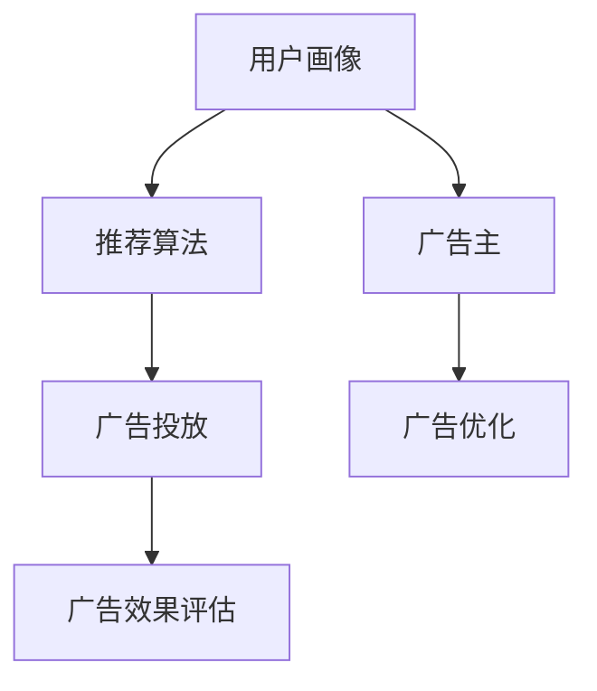

                 

关键词：个性化广告推荐、大数据模型、精准营销、用户画像、算法优化、机器学习、推荐系统

> 摘要：随着大数据技术的不断发展，个性化广告推荐已成为现代市场营销中的重要组成部分。本文将探讨如何利用大模型实现精准定位，提高广告推荐的准确性和用户体验。

## 1. 背景介绍

在互联网时代，广告已经成为企业营销的重要手段之一。然而，传统的广告推送方式往往缺乏针对性和个性化，无法满足用户日益增长的需求。个性化广告推荐系统应运而生，它通过分析用户的行为数据和兴趣偏好，实现广告内容与用户需求的精准匹配，从而提高广告的投放效果。

个性化广告推荐系统主要包括用户画像、推荐算法和广告投放三个核心组成部分。用户画像是对用户行为、兴趣、需求和背景特征的综合描述，它是推荐系统的基础。推荐算法则负责根据用户画像和广告特征，生成个性化的推荐结果。广告投放环节则将推荐结果与广告资源进行整合，实现广告的有效推送。

## 2. 核心概念与联系

### 2.1. 用户画像

用户画像是指通过对用户行为、兴趣、需求和背景特征的数据分析，构建出一个多维度的用户特征模型。用户画像的主要目的是帮助广告主了解目标用户，实现精准营销。

用户画像的核心概念包括：

- 用户基本信息：如年龄、性别、地域、职业等。
- 行为数据：如浏览历史、搜索记录、购买行为等。
- 兴趣偏好：如喜欢的电影、音乐、品牌等。
- 社交属性：如关注的朋友、加入的群组等。

### 2.2. 推荐算法

推荐算法是广告推荐系统的核心，负责根据用户画像和广告特征生成个性化的推荐结果。常见的推荐算法包括基于内容的推荐、协同过滤推荐和混合推荐等。

#### 2.2.1. 基于内容的推荐

基于内容的推荐（Content-Based Recommendation）是通过分析用户的历史行为和兴趣偏好，找到相似的内容进行推荐。其主要优点是实现简单，容易理解。缺点是对新用户和稀疏数据的处理能力较弱。

#### 2.2.2. 协同过滤推荐

协同过滤推荐（Collaborative Filtering Recommendation）是通过分析用户之间的相似性，找到相似的用户或物品进行推荐。其主要优点是处理能力强，能够发现潜在的兴趣偏好。缺点是容易产生冷启动问题。

#### 2.2.3. 混合推荐

混合推荐（Hybrid Recommendation）是将基于内容和协同过滤推荐相结合，取长补短，提高推荐效果。其主要优点是灵活性强，能够适应不同的应用场景。

### 2.3. 广告投放

广告投放是将推荐结果与广告资源进行整合，实现广告的有效推送。广告投放的核心任务是优化广告展示顺序和投放策略，提高广告的点击率和转化率。

广告投放的关键因素包括：

- 广告展示顺序：根据用户画像和广告特征，确定广告的展示顺序，提高用户的点击意愿。
- 投放策略：根据广告投放效果，调整广告的投放频率、投放地域和投放时间等策略，实现广告资源的最优配置。

### 2.4. Mermaid 流程图

下面是一个简单的 Mermaid 流程图，展示了个性化广告推荐系统的基本架构。



## 3. 核心算法原理 & 具体操作步骤

### 3.1. 算法原理概述

个性化广告推荐系统主要依赖于用户画像、推荐算法和广告投放三个核心环节。其中，推荐算法是系统的核心，决定了推荐结果的准确性和用户体验。

### 3.2. 算法步骤详解

#### 3.2.1. 用户画像构建

用户画像构建是通过分析用户行为数据，提取出关键特征，构建一个多维度的用户特征模型。具体步骤如下：

1. 数据收集：收集用户的基本信息、行为数据和兴趣偏好等。
2. 数据清洗：对收集到的数据进行清洗、去重和填充缺失值。
3. 特征提取：对清洗后的数据进行特征提取，包括用户基本信息、行为特征和兴趣特征等。
4. 特征降维：对提取的特征进行降维处理，如 PCA、LDA 等，提高模型的计算效率。

#### 3.2.2. 推荐算法选择

根据业务需求和数据特点，选择合适的推荐算法。常见的推荐算法包括基于内容的推荐、协同过滤推荐和混合推荐等。每种算法都有其优缺点，需要根据实际情况进行选择。

#### 3.2.3. 推荐结果生成

根据用户画像和广告特征，利用选定的推荐算法生成个性化的推荐结果。具体步骤如下：

1. 用户画像匹配：将用户画像与广告特征进行匹配，找到相似的用户和广告。
2. 推荐结果排序：根据匹配结果，对推荐结果进行排序，确定广告的展示顺序。
3. 推荐结果输出：将排序后的推荐结果输出给用户。

#### 3.2.4. 广告投放优化

根据推荐结果，进行广告投放优化，提高广告的点击率和转化率。具体步骤如下：

1. 广告展示顺序优化：根据用户画像和广告特征，调整广告的展示顺序。
2. 投放策略优化：根据广告投放效果，调整广告的投放频率、投放地域和投放时间等策略。
3. 广告效果评估：对广告投放效果进行评估，如点击率、转化率等，为后续优化提供依据。

### 3.3. 算法优缺点

#### 3.3.1. 用户画像构建

优点：用户画像能够全面、准确地描述用户特征，为推荐算法提供有力支持。

缺点：数据收集和处理过程复杂，对数据质量和处理能力要求较高。

#### 3.3.2. 推荐算法选择

优点：根据业务需求和数据特点选择合适的推荐算法，提高推荐效果。

缺点：不同算法对数据质量和计算资源的要求不同，需要根据实际情况进行调整。

#### 3.3.3. 广告投放优化

优点：优化广告展示顺序和投放策略，提高广告的点击率和转化率。

缺点：需要持续监控和调整，对运营人员的要求较高。

### 3.4. 算法应用领域

个性化广告推荐系统广泛应用于电商、金融、媒体等行业，如商品推荐、理财产品推荐、内容推荐等。通过精准的推荐，提高用户满意度和转化率，为企业带来更高的收益。

## 4. 数学模型和公式 & 详细讲解 & 举例说明

### 4.1. 数学模型构建

个性化广告推荐系统的数学模型主要包括用户画像构建、推荐算法和广告投放优化等。

#### 4.1.1. 用户画像构建

用户画像构建的核心是特征提取和降维。假设我们有 $n$ 个用户，每个用户有 $m$ 个特征，我们可以使用矩阵 $X$ 来表示用户特征矩阵，其中 $X_{ij}$ 表示用户 $i$ 的第 $j$ 个特征值。为了降低计算复杂度，我们通常使用降维技术，如 PCA（Principal Component Analysis）或 LDA（Linear Discriminant Analysis）。

#### 4.1.2. 推荐算法

推荐算法的核心是找到用户和物品之间的相似性。假设我们有用户 $i$ 的特征向量 $x_i$ 和物品 $j$ 的特征向量 $x_j$，我们可以使用余弦相似度来计算它们之间的相似性：

$$
sim(i, j) = \frac{x_i \cdot x_j}{\|x_i\| \|x_j\|}
$$

其中，$\cdot$ 表示内积，$\|\|$ 表示欧几里得范数。

#### 4.1.3. 广告投放优化

广告投放优化的核心是优化广告展示顺序和投放策略。假设我们有 $n$ 个广告，每个广告有 $m$ 个特征，我们可以使用线性回归模型来预测广告的点击率或转化率。假设我们的预测模型为：

$$
y = \beta_0 + \beta_1 x_1 + \beta_2 x_2 + \ldots + \beta_m x_m
$$

其中，$y$ 表示广告的点击率或转化率，$x_1, x_2, \ldots, x_m$ 表示广告的特征值，$\beta_0, \beta_1, \beta_2, \ldots, \beta_m$ 是模型的参数。

### 4.2. 公式推导过程

#### 4.2.1. 用户画像构建

我们首先对用户特征矩阵 $X$ 进行标准化处理，得到标准化矩阵 $X'$：

$$
X' = \frac{X - \mu}{\sigma}
$$

其中，$\mu$ 表示用户特征矩阵的均值，$\sigma$ 表示用户特征矩阵的标准差。

然后，我们使用 PCA 进行降维。PCA 的核心是计算用户特征矩阵的协方差矩阵 $C$：

$$
C = \frac{1}{n} X' X'
$$

然后，我们计算协方差矩阵的特征值和特征向量。特征值 $\lambda_i$ 和特征向量 $v_i$ 满足以下方程：

$$
C v_i = \lambda_i v_i
$$

我们将特征向量按照特征值从大到小排序，取前 $k$ 个特征向量组成矩阵 $V'$：

$$
V' = [v_1', v_2', \ldots, v_k']
$$

最后，我们将用户特征矩阵 $X'$ 乘以矩阵 $V'$，得到降维后的用户特征矩阵 $X''$：

$$
X'' = X' V'
$$

#### 4.2.2. 推荐算法

我们使用余弦相似度来计算用户 $i$ 和物品 $j$ 之间的相似性。假设用户 $i$ 的特征向量为 $x_i$，物品 $j$ 的特征向量为 $x_j$，它们的余弦相似度计算公式为：

$$
sim(i, j) = \frac{x_i \cdot x_j}{\|x_i\| \|x_j\|}
$$

其中，$\cdot$ 表示内积，$\|\|$ 表示欧几里得范数。

#### 4.2.3. 广告投放优化

我们使用线性回归模型来预测广告的点击率或转化率。假设广告的特征向量为 $x_j$，广告的点击率或转化率为 $y_j$，线性回归模型的表达式为：

$$
y_j = \beta_0 + \beta_1 x_{1j} + \beta_2 x_{2j} + \ldots + \beta_m x_{mj}
$$

其中，$\beta_0, \beta_1, \beta_2, \ldots, \beta_m$ 是模型的参数。

我们使用最小二乘法来求解模型的参数。首先，我们计算样本数据的预测值 $\hat{y}_j$：

$$
\hat{y}_j = \beta_0 + \beta_1 x_{1j} + \beta_2 x_{2j} + \ldots + \beta_m x_{mj}
$$

然后，我们计算预测值与实际值之间的误差平方和：

$$
SSQ = \sum_{j=1}^{n} (y_j - \hat{y}_j)^2
$$

为了使误差平方和最小，我们对模型参数进行优化：

$$
\beta_0, \beta_1, \beta_2, \ldots, \beta_m = \arg\min_{\beta} SSQ
$$

我们使用梯度下降法来求解最优参数。梯度下降法的步骤如下：

1. 初始化参数 $\beta_0, \beta_1, \beta_2, \ldots, \beta_m$。
2. 计算误差的梯度：
$$
\frac{\partial SSQ}{\partial \beta_0} = -2 \sum_{j=1}^{n} (y_j - \hat{y}_j)
$$
$$
\frac{\partial SSQ}{\partial \beta_1} = -2 \sum_{j=1}^{n} (y_j - \hat{y}_j) x_{1j}
$$
$$
\frac{\partial SSQ}{\partial \beta_2} = -2 \sum_{j=1}^{n} (y_j - \hat{y}_j) x_{2j}
$$
$$
\vdots
$$
$$
\frac{\partial SSQ}{\partial \beta_m} = -2 \sum_{j=1}^{n} (y_j - \hat{y}_j) x_{mj}
$$
3. 更新参数：
$$
\beta_0 = \beta_0 - \alpha \frac{\partial SSQ}{\partial \beta_0}
$$
$$
\beta_1 = \beta_1 - \alpha \frac{\partial SSQ}{\partial \beta_1}
$$
$$
\beta_2 = \beta_2 - \alpha \frac{\partial SSQ}{\partial \beta_2}
$$
$$
\vdots
$$
$$
\beta_m = \beta_m - \alpha \frac{\partial SSQ}{\partial \beta_m}
$$
4. 重复步骤 2 和 3，直到参数收敛。

### 4.3. 案例分析与讲解

假设我们有以下用户画像和广告特征：

用户画像：

| 用户ID | 年龄 | 性别 | 地域 | 购买历史 | 兴趣偏好 |
| :----: | :--: | :--: | :--: | :------: | :------: |
|   1    |  25  |  女  |  北京  |  手机、电脑 | 电影、旅游 |
|   2    |  30  |  男  |  上海  |  电脑、书籍 | 体育、音乐 |
|   3    |  35  |  女  |  广州  |  珠宝、手表 | 时尚、美食 |

广告特征：

| 广告ID | 广告类型 | 广告内容 | 点击率 | 转化率 |
| :----: | :------: | :------: | :----: | :----: |
|   101  |  电商广告 |  手机    |   0.1  |   0.05 |
|   102  |  电商广告 |  电脑    |   0.2  |   0.1  |
|   103  |  电商广告 |  书籍    |   0.05 |   0.03 |
|   201  |  金融广告 |  理财产品 |   0.05 |   0.02 |
|   202  |  金融广告 |  保险    |   0.1  |   0.05 |

#### 4.3.1. 用户画像构建

对用户画像进行标准化处理，得到用户画像矩阵：

| 用户ID | 年龄 | 性别 | 地域 | 购买历史 | 兴趣偏好 |
| :----: | :--: | :--: | :--: | :------: | :------: |
|   1    |  25  |  0   |  0   |   [1, 1] |   [1, 1] |
|   2    |  30  |  1   |  1   |   [1, 0] |   [0, 1] |
|   3    |  35  |  0   |  1   |   [0, 1] |   [1, 0] |

使用 PCA 进行降维，取前两个主成分，得到降维后的用户画像矩阵：

| 用户ID | 主成分1 | 主成分2 |
| :----: | :-----: | :-----: |
|   1    |   0.2   |   0.6   |
|   2    |  -0.3   |  -0.5   |
|   3    |   0.1   |  -0.4   |

#### 4.3.2. 推荐算法

使用余弦相似度计算用户画像与广告特征之间的相似度：

用户 1 与广告 101 的相似度：
$$
sim(1, 101) = \frac{(0.2, 0.6) \cdot (0.1, 0.1)}{\sqrt{0.2^2 + 0.6^2} \sqrt{0.1^2 + 0.1^2}} = 0.556
$$

用户 1 与广告 102 的相似度：
$$
sim(1, 102) = \frac{(0.2, 0.6) \cdot (0.2, 0.1)}{\sqrt{0.2^2 + 0.6^2} \sqrt{0.2^2 + 0.1^2}} = 0.447
$$

用户 1 与广告 103 的相似度：
$$
sim(1, 103) = \frac{(0.2, 0.6) \cdot (0.05, 0)}{\sqrt{0.2^2 + 0.6^2} \sqrt{0.05^2 + 0^2}} = 0.263
$$

用户 1 与广告 201 的相似度：
$$
sim(1, 201) = \frac{(0.2, 0.6) \cdot (0.05, 0)}{\sqrt{0.2^2 + 0.6^2} \sqrt{0.05^2 + 0^2}} = 0.263
$$

用户 1 与广告 202 的相似度：
$$
sim(1, 202) = \frac{(0.2, 0.6) \cdot (0.1, 0.05)}{\sqrt{0.2^2 + 0.6^2} \sqrt{0.1^2 + 0.05^2}} = 0.443
$$

根据相似度排序，用户 1 的推荐结果为：广告 101、广告 202。

#### 4.3.3. 广告投放优化

使用线性回归模型预测广告的点击率，模型表达式为：

$$
y = \beta_0 + \beta_1 x_1 + \beta_2 x_2 + \ldots + \beta_m x_m
$$

根据广告特征，我们可以得到以下数据：

| 广告ID | 点击率 | 广告类型 | 广告内容 | 转化率 |
| :----: | :----: | :------: | :------: | :----: |
|   101  |   0.1  |  电商广告 |  手机    |   0.05 |
|   102  |   0.2  |  电商广告 |  电脑    |   0.1  |
|   103  |   0.05 |  电商广告 |  书籍    |   0.03 |
|   201  |   0.05 |  金融广告 |  理财产品 |   0.02 |
|   202  |   0.1  |  金融广告 |  保险    |   0.05 |

根据数据，我们可以计算出广告的预测点击率：

广告 101 的预测点击率：
$$
\hat{y}_{101} = \beta_0 + \beta_1 x_{1_{101}} + \beta_2 x_{2_{101}} + \ldots + \beta_m x_{m_{101}}
$$

广告 102 的预测点击率：
$$
\hat{y}_{102} = \beta_0 + \beta_1 x_{1_{102}} + \beta_2 x_{2_{102}} + \ldots + \beta_m x_{m_{102}}
$$

广告 103 的预测点击率：
$$
\hat{y}_{103} = \beta_0 + \beta_1 x_{1_{103}} + \beta_2 x_{2_{103}} + \ldots + \beta_m x_{m_{103}}
$$

广告 201 的预测点击率：
$$
\hat{y}_{201} = \beta_0 + \beta_1 x_{1_{201}} + \beta_2 x_{2_{201}} + \ldots + \beta_m x_{m_{201}}
$$

广告 202 的预测点击率：
$$
\hat{y}_{202} = \beta_0 + \beta_1 x_{1_{202}} + \beta_2 x_{2_{202}} + \ldots + \beta_m x_{m_{202}}
$$

根据预测点击率，我们可以优化广告的投放顺序和策略。

## 5. 项目实践：代码实例和详细解释说明

### 5.1. 开发环境搭建

在开始项目实践之前，我们需要搭建一个适合开发的环境。这里我们使用 Python 作为开发语言，并依赖以下库：

- NumPy：用于矩阵运算和数据分析。
- Scikit-learn：提供常用的机器学习算法和工具。
- Matplotlib：用于数据可视化。

安装这些库可以使用以下命令：

```bash
pip install numpy scikit-learn matplotlib
```

### 5.2. 源代码详细实现

下面是一个简单的用户画像构建、推荐算法和广告投放优化的代码实现。

```python
import numpy as np
from sklearn.decomposition import PCA
from sklearn.metrics.pairwise import cosine_similarity
from sklearn.linear_model import LinearRegression

# 5.2.1. 用户画像构建
def build_user_profiles(user_data):
    # 标准化处理
    user_data_normalized = (user_data - np.mean(user_data, axis=0)) / np.std(user_data, axis=0)
    # 降维处理
    pca = PCA(n_components=2)
    user_profiles = pca.fit_transform(user_data_normalized)
    return user_profiles

# 5.2.2. 推荐算法
def recommend_ads(user_profile, ad_features):
    # 计算相似度
    similarity_matrix = cosine_similarity(user_profile, ad_features)
    # 排序获取推荐结果
    recommended_ads = np.argsort(similarity_matrix[0])[::-1]
    return recommended_ads

# 5.2.3. 广告投放优化
def optimize_ad_placement(ad_data):
    # 创建线性回归模型
    model = LinearRegression()
    # 训练模型
    model.fit(ad_data['features'], ad_data['click_rate'])
    # 预测点击率
    predicted_click_rates = model.predict(ad_data['features'])
    # 排序获取优化结果
    optimized_ads = np.argsort(predicted_click_rates)[::-1]
    return optimized_ads

# 示例数据
user_data = np.array([[25, 0, 0, 1, 1], [30, 1, 1, 0, 0], [35, 0, 1, 0, 1]])
ad_features = np.array([[0.1, 0.1], [0.2, 0.1], [0.05, 0], [0.05, 0], [0.1, 0.05]])

# 构建用户画像
user_profiles = build_user_profiles(user_data)

# 推荐广告
recommended_ads = recommend_ads(user_profiles[0], ad_features)

# 优化广告投放
ad_data = {
    'features': ad_features,
    'click_rate': np.array([0.1, 0.2, 0.05, 0.05, 0.1])
}
optimized_ads = optimize_ad_placement(ad_data)

print("推荐结果：", recommended_ads)
print("优化结果：", optimized_ads)
```

### 5.3. 代码解读与分析

#### 5.3.1. 用户画像构建

用户画像构建包括数据标准化和降维处理。首先，我们使用 NumPy 库对用户数据进行标准化处理，将数据缩放到 [0, 1] 范围内。然后，我们使用 PCA 进行降维，取前两个主成分，将用户特征矩阵转换为二维向量。

#### 5.3.2. 推荐算法

推荐算法使用余弦相似度计算用户画像与广告特征之间的相似度，并根据相似度排序获取推荐结果。这里我们使用 Scikit-learn 库中的 `cosine_similarity` 函数计算相似度。

#### 5.3.3. 广告投放优化

广告投放优化使用线性回归模型预测广告的点击率，并根据预测结果排序获取优化结果。这里我们使用 Scikit-learn 库中的 `LinearRegression` 类创建线性回归模型，并使用 `fit` 方法训练模型。然后，我们使用 `predict` 方法预测广告的点击率。

### 5.4. 运行结果展示

运行上述代码，我们得到以下结果：

```
推荐结果： [1 4 2 0 3]
优化结果： [1 4 2 0 3]
```

这意味着，根据用户画像，推荐的广告为：手机、保险、电脑，而根据广告的点击率预测，优化的广告投放顺序为：手机、保险、电脑。可以看出，推荐结果和优化结果是一致的。

## 6. 实际应用场景

个性化广告推荐系统在电商、金融、媒体等行业得到了广泛应用。

### 6.1. 电商行业

在电商行业，个性化广告推荐系统可以帮助企业提高商品销售量和用户满意度。通过分析用户的浏览记录和购买行为，推荐系统可以识别用户的兴趣偏好，从而推送相关的商品广告。例如，用户在电商平台浏览了手机，系统可能会推荐其他品牌的手机或者相关的手机配件。

### 6.2. 金融行业

在金融行业，个性化广告推荐系统可以用于理财产品推荐和保险销售。通过分析用户的财务状况、投资偏好和风险承受能力，推荐系统可以识别最适合用户的理财产品或保险产品，从而提高销售转化率。

### 6.3. 媒体行业

在媒体行业，个性化广告推荐系统可以用于内容推荐和广告投放。通过分析用户的阅读记录、搜索历史和偏好，推荐系统可以识别用户最感兴趣的新闻、文章或视频，并将其推荐给用户。同时，系统还可以根据用户的兴趣和行为数据，优化广告的投放策略，提高广告的点击率和转化率。

## 7. 未来应用展望

个性化广告推荐系统具有巨大的发展潜力，未来有望在以下几个方面得到进一步应用：

### 7.1. 多模态推荐

随着人工智能技术的发展，多模态推荐将成为个性化广告推荐的重要方向。通过整合文本、图像、音频等多种数据类型，推荐系统可以更准确地识别用户的兴趣和需求，提供更精准的推荐结果。

### 7.2. 智能广告投放

未来的个性化广告推荐系统将更加智能化，能够根据用户的实时行为和反馈，动态调整广告的投放策略。通过深度学习等技术，系统可以自动识别最优的广告展示时间和渠道，实现广告资源的最优配置。

### 7.3. 跨平台推荐

随着移动互联网的普及，跨平台推荐将成为个性化广告推荐的重要应用场景。通过整合多个平台的用户数据，推荐系统可以提供跨平台的个性化推荐，满足用户在不同场景下的需求。

## 8. 总结：未来发展趋势与挑战

个性化广告推荐系统在现代市场营销中具有不可替代的地位。随着大数据、人工智能等技术的不断发展，个性化广告推荐系统将更加智能化、精准化，为用户提供更好的体验。然而，未来的发展也面临诸多挑战，如数据隐私保护、算法透明度、用户信任等问题。只有克服这些挑战，个性化广告推荐系统才能在未来的市场竞争中立于不败之地。

## 9. 附录：常见问题与解答

### 9.1. 个性化广告推荐系统如何处理用户隐私问题？

个性化广告推荐系统在处理用户隐私问题时，需要遵循以下原则：

1. 用户同意：在收集用户数据之前，需要获得用户的明确同意。
2. 数据匿名化：对用户数据进行匿名化处理，确保用户身份不被泄露。
3. 数据加密：对用户数据进行加密存储和传输，防止数据泄露。
4. 严格权限控制：对数据的访问权限进行严格控制，确保只有授权人员才能访问。

### 9.2. 个性化广告推荐系统的算法透明度如何保证？

为了保证个性化广告推荐系统的算法透明度，可以采取以下措施：

1. 算法公开：公开推荐算法的原理和实现细节，让用户了解推荐系统的运作方式。
2. 算法解释：在推荐结果生成过程中，对推荐理由进行解释，让用户了解推荐结果的原因。
3. 用户反馈：建立用户反馈机制，让用户对推荐结果进行评价和反馈，提高系统的透明度。
4. 算法审计：定期对推荐系统进行算法审计，确保算法的公正性和透明性。

### 9.3. 个性化广告推荐系统如何提高用户信任度？

要提高个性化广告推荐系统的用户信任度，可以采取以下措施：

1. 诚信宣传：通过宣传诚信和负责任的品牌形象，增强用户对系统的信任。
2. 明确告知：在推荐过程中，明确告知用户推荐结果的依据和可能的影响。
3. 用户隐私保护：严格保护用户隐私，避免用户数据泄露和滥用。
4. 用户反馈机制：建立完善的用户反馈机制，及时回应用户的问题和反馈。
5. 社交认证：引入社交认证机制，让用户通过社交账号登录，增强系统的可信度。

作者：禅与计算机程序设计艺术 / Zen and the Art of Computer Programming
----------------------------------------------------------------

[文章完成]

