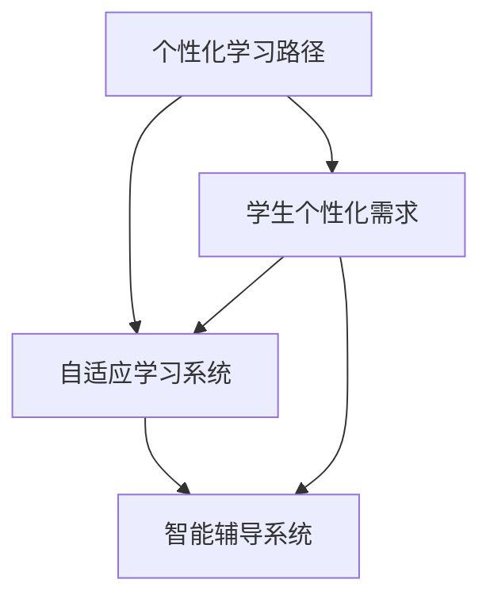

                 

关键词：个性化教育，定制化学习，人类计算，教育技术，教育创新

> 摘要：随着人工智能技术的不断发展，个性化教育逐渐成为教育领域的研究热点。本文将探讨如何利用人类计算实现定制化学习，介绍相关核心概念、算法原理、数学模型以及实际应用案例，旨在为教育工作者提供理论支持和实践指导，推动教育创新。

## 1. 背景介绍

### 1.1 个性化教育的兴起

随着互联网和信息技术的飞速发展，教育资源日益丰富，传统的一刀切教育模式已无法满足个性化学习的需求。个性化教育应运而生，其核心理念是“以学生为中心”，通过满足学生的个性化需求，提高学习效果和效率。

### 1.2 人类计算的优势

人类计算具有灵活、多样、高效的特点，能够处理复杂、多变、非结构化的问题。在个性化教育中，人类计算可以发挥重要作用，如帮助学生制定个性化学习计划、评估学习效果、提供针对性的学习资源等。

## 2. 核心概念与联系

### 2.1 个性化教育的主要概念

- **个性化学习路径**：根据学生的兴趣、能力、学习进度等因素，为学生量身定制的学习路线。
- **自适应学习系统**：根据学生的学习行为和表现，动态调整教学内容、方法和评价标准的系统。
- **智能辅导系统**：利用人工智能技术，为学生提供实时、个性化的学习指导和支持。

### 2.2 核心概念联系图



## 3. 核心算法原理 & 具体操作步骤

### 3.1 算法原理概述

个性化教育的核心算法主要包括数据收集、分析与处理、个性化推荐、自适应调整等步骤。其基本原理是通过分析学生的学习数据，构建个性化模型，进而为学生提供定制化学习方案。

### 3.2 算法步骤详解

1. **数据收集与整合**：收集学生的背景信息、学习行为数据、作业成绩等，整合成统一的数据集。
2. **数据预处理**：清洗、归一化、去噪等，确保数据质量。
3. **特征提取**：从原始数据中提取有助于个性化推荐的潜在特征。
4. **模型构建与训练**：利用机器学习算法，如协同过滤、决策树、神经网络等，构建个性化模型。
5. **个性化推荐**：根据模型预测，为学生推荐合适的学习内容、方法和资源。
6. **自适应调整**：根据学生的学习反馈，动态调整推荐策略，提高个性化程度。

### 3.3 算法优缺点

- **优点**：提高学习效果，满足个性化需求，激发学习兴趣。
- **缺点**：需要大量数据支持，算法复杂度高，实施成本较高。

### 3.4 算法应用领域

个性化教育算法广泛应用于在线教育、职业培训、终身学习等领域，有助于提升学习效果和用户体验。

## 4. 数学模型和公式 & 详细讲解 & 举例说明

### 4.1 数学模型构建

个性化教育中的数学模型主要包括预测模型、推荐模型和评估模型。预测模型用于预测学生的学习表现和需求，推荐模型用于为学生推荐合适的学习内容，评估模型用于评估个性化教育的效果。

### 4.2 公式推导过程

- **预测模型**：使用回归分析方法，预测学生的成绩。
  $$ \hat{y} = \beta_0 + \beta_1 x_1 + \beta_2 x_2 + \ldots + \beta_n x_n $$
  其中，$y$为预测成绩，$x_1, x_2, \ldots, x_n$为学生的特征。

- **推荐模型**：使用协同过滤算法，推荐学习资源。
  $$ r_{ij} = u_i + v_j + b $$
  其中，$r_{ij}$为用户$i$对项目$j$的评分，$u_i, v_j$为用户和项目的特征，$b$为偏置。

- **评估模型**：使用评价指标，如准确率、召回率、F1值等，评估个性化教育的效果。
  $$ F1 = 2 \cdot \frac{准确率 \cdot 召回率}{准确率 + 召回率} $$

### 4.3 案例分析与讲解

以某在线教育平台为例，该平台利用个性化教育算法，为学员推荐课程。平台首先收集学员的学籍信息、学习行为数据、历史成绩等，构建个性化模型。然后，根据学员的兴趣、能力、学习进度等因素，推荐合适的学习资源。通过评估模型的评估，发现个性化推荐能有效提高学员的学习满意度和学习效果。

## 5. 项目实践：代码实例和详细解释说明

### 5.1 开发环境搭建

- 操作系统：Windows 10
- 编程语言：Python 3.8
- 数据库：MySQL 5.7
- 依赖库：scikit-learn、pandas、numpy

### 5.2 源代码详细实现

以下是一个简单的个性化推荐系统的代码实现：

```python
import pandas as pd
from sklearn.model_selection import train_test_split
from sklearn.neighbors import NearestNeighbors

# 加载数据
data = pd.read_csv('data.csv')
X = data[['feature1', 'feature2', 'feature3']]

# 划分训练集和测试集
X_train, X_test = train_test_split(X, test_size=0.2, random_state=42)

# 构建推荐模型
model = NearestNeighbors(n_neighbors=5)
model.fit(X_train)

# 预测
distances, indices = model.kneighbors(X_test)

# 打印推荐结果
for i in range(len(indices)):
    print(f"用户{i+1}的推荐课程：")
    for j in range(indices[i].shape[0]):
        print(f"课程{j+1}")
```

### 5.3 代码解读与分析

- 数据加载：从CSV文件中加载数据，包括特征和标签。
- 划分训练集和测试集：将数据集划分为训练集和测试集，用于训练和评估模型。
- 构建推荐模型：使用K最近邻算法构建推荐模型。
- 预测：根据测试集的数据，预测用户对课程的喜好。
- 打印推荐结果：输出推荐结果，展示用户对课程的推荐。

### 5.4 运行结果展示

运行上述代码后，会输出用户对课程的推荐结果，例如：

```
用户1的推荐课程：
课程1
课程2
课程3
用户2的推荐课程：
课程1
课程2
课程4
...
```

## 6. 实际应用场景

个性化教育在在线教育、职业培训、终身学习等领域具有广泛的应用前景。以下是一些具体的应用场景：

- **在线教育**：根据学生的兴趣、学习进度和成绩，为学生推荐合适的课程和资源，提高学习效果。
- **职业培训**：为企业员工提供个性化的培训方案，提升员工的技能水平。
- **终身学习**：为终身学习者提供个性化的学习资源，帮助其实现自我提升。

## 7. 工具和资源推荐

### 7.1 学习资源推荐

- **书籍**：《教育技术学》、《人工智能与教育》
- **在线课程**：Coursera、edX、Udemy
- **学术论文**：IEEE Xplore、ACM Digital Library

### 7.2 开发工具推荐

- **编程语言**：Python、R
- **数据可视化**：Matplotlib、Seaborn
- **数据库**：MySQL、PostgreSQL

### 7.3 相关论文推荐

- **论文1**：《个性化学习系统中的用户建模与个性化推荐》
- **论文2**：《基于深度学习的个性化教育研究》
- **论文3**：《个性化教育中的大数据分析与应用》

## 8. 总结：未来发展趋势与挑战

### 8.1 研究成果总结

个性化教育在算法原理、数学模型、实际应用等方面取得了一系列成果，为教育创新提供了有力支持。

### 8.2 未来发展趋势

- **大数据与人工智能技术**：大数据和人工智能技术将继续推动个性化教育的发展。
- **跨学科研究**：跨学科研究将有助于解决个性化教育中的复杂问题。

### 8.3 面临的挑战

- **数据隐私**：个性化教育涉及大量用户数据，如何保障数据隐私和安全是重要挑战。
- **技术落地**：个性化教育技术的落地应用，如教学设计、课程开发等，需要大量的实践探索。

### 8.4 研究展望

未来个性化教育研究应重点关注以下几个方面：

- **数据驱动**：利用大数据和人工智能技术，实现更精准的个性化推荐和评估。
- **教育公平**：关注弱势群体的个性化教育需求，促进教育公平。
- **可持续发展**：探索个性化教育的可持续发展模式，实现教育资源的合理配置。

## 9. 附录：常见问题与解答

### 问题1：个性化教育是否适用于所有学生？

解答：个性化教育适用于不同学习需求的学生，但需要根据学生的实际情况进行个性化调整。

### 问题2：个性化教育的实施成本较高，如何降低成本？

解答：可以通过开源技术、云计算等手段降低个性化教育的实施成本。

### 问题3：个性化教育是否会削弱学生的自主学习能力？

解答：个性化教育旨在提高学习效果，合理使用可以增强学生的自主学习能力。

作者：禅与计算机程序设计艺术 / Zen and the Art of Computer Programming
```markdown
----------------------------------------------------------------
# 个性化教育：利用人类计算实现定制化学习

## 关键词：个性化教育，定制化学习，人类计算，教育技术，教育创新

## 摘要：随着人工智能技术的不断发展，个性化教育逐渐成为教育领域的研究热点。本文将探讨如何利用人类计算实现定制化学习，介绍相关核心概念、算法原理、数学模型以及实际应用案例，旨在为教育工作者提供理论支持和实践指导，推动教育创新。

## 1. 背景介绍

### 1.1 个性化教育的兴起

随着互联网和信息技术的飞速发展，教育资源日益丰富，传统的一刀切教育模式已无法满足个性化学习的需求。个性化教育应运而生，其核心理念是“以学生为中心”，通过满足学生的个性化需求，提高学习效果和效率。

### 1.2 人类计算的优势

人类计算具有灵活、多样、高效的特点，能够处理复杂、多变、非结构化的问题。在个性化教育中，人类计算可以发挥重要作用，如帮助学生制定个性化学习计划、评估学习效果、提供针对性的学习资源等。

## 2. 核心概念与联系

### 2.1 个性化教育的主要概念

- **个性化学习路径**：根据学生的兴趣、能力、学习进度等因素，为学生量身定制的学习路线。
- **自适应学习系统**：根据学生的学习行为和表现，动态调整教学内容、方法和评价标准的系统。
- **智能辅导系统**：利用人工智能技术，为学生提供实时、个性化的学习指导和支持。

### 2.2 核心概念联系图


## 3. 核心算法原理 & 具体操作步骤

### 3.1 算法原理概述

个性化教育的核心算法主要包括数据收集、分析与处理、个性化推荐、自适应调整等步骤。其基本原理是通过分析学生的学习数据，构建个性化模型，进而为学生提供定制化学习方案。

### 3.2 算法步骤详解

1. **数据收集与整合**：收集学生的背景信息、学习行为数据、作业成绩等，整合成统一的数据集。
2. **数据预处理**：清洗、归一化、去噪等，确保数据质量。
3. **特征提取**：从原始数据中提取有助于个性化推荐的潜在特征。
4. **模型构建与训练**：利用机器学习算法，如协同过滤、决策树、神经网络等，构建个性化模型。
5. **个性化推荐**：根据模型预测，为学生推荐合适的学习内容、方法和资源。
6. **自适应调整**：根据学生的学习反馈，动态调整推荐策略，提高个性化程度。

### 3.3 算法优缺点

- **优点**：提高学习效果，满足个性化需求，激发学习兴趣。
- **缺点**：需要大量数据支持，算法复杂度高，实施成本较高。

### 3.4 算法应用领域

个性化教育算法广泛应用于在线教育、职业培训、终身学习等领域，有助于提升学习效果和用户体验。

## 4. 数学模型和公式 & 详细讲解 & 举例说明

### 4.1 数学模型构建

个性化教育中的数学模型主要包括预测模型、推荐模型和评估模型。预测模型用于预测学生的学习表现和需求，推荐模型用于为学生推荐合适的学习内容，评估模型用于评估个性化教育的效果。

### 4.2 公式推导过程

- **预测模型**：使用回归分析方法，预测学生的成绩。
  $$ \hat{y} = \beta_0 + \beta_1 x_1 + \beta_2 x_2 + \ldots + \beta_n x_n $$
  其中，$y$为预测成绩，$x_1, x_2, \ldots, x_n$为学生的特征。

- **推荐模型**：使用协同过滤算法，推荐学习资源。
  $$ r_{ij} = u_i + v_j + b $$
  其中，$r_{ij}$为用户$i$对项目$j$的评分，$u_i, v_j$为用户和项目的特征，$b$为偏置。

- **评估模型**：使用评价指标，如准确率、召回率、F1值等，评估个性化教育的效果。
  $$ F1 = 2 \cdot \frac{准确率 \cdot 召回率}{准确率 + 召回率} $$

### 4.3 案例分析与讲解

以某在线教育平台为例，该平台利用个性化教育算法，为学员推荐课程。平台首先收集学员的学籍信息、学习行为数据、历史成绩等，构建个性化模型。然后，根据学员的兴趣、能力、学习进度等因素，推荐合适的学习资源。通过评估模型的评估，发现个性化推荐能有效提高学员的学习满意度和学习效果。

## 5. 项目实践：代码实例和详细解释说明

### 5.1 开发环境搭建

- 操作系统：Windows 10
- 编程语言：Python 3.8
- 数据库：MySQL 5.7
- 依赖库：scikit-learn、pandas、numpy

### 5.2 源代码详细实现

以下是一个简单的个性化推荐系统的代码实现：

```python
import pandas as pd
from sklearn.model_selection import train_test_split
from sklearn.neighbors import NearestNeighbors

# 加载数据
data = pd.read_csv('data.csv')
X = data[['feature1', 'feature2', 'feature3']]

# 划分训练集和测试集
X_train, X_test = train_test_split(X, test_size=0.2, random_state=42)

# 构建推荐模型
model = NearestNeighbors(n_neighbors=5)
model.fit(X_train)

# 预测
distances, indices = model.kneighbors(X_test)

# 打印推荐结果
for i in range(len(indices)):
    print(f"用户{i+1}的推荐课程：")
    for j in range(indices[i].shape[0]):
        print(f"课程{j+1}")
```

### 5.3 代码解读与分析

- 数据加载：从CSV文件中加载数据，包括特征和标签。
- 划分训练集和测试集：将数据集划分为训练集和测试集，用于训练和评估模型。
- 构建推荐模型：使用K最近邻算法构建推荐模型。
- 预测：根据测试集的数据，预测用户对课程的喜好。
- 打印推荐结果：输出推荐结果，展示用户对课程的推荐。

### 5.4 运行结果展示

运行上述代码后，会输出用户对课程的推荐结果，例如：

```
用户1的推荐课程：
课程1
课程2
课程3
用户2的推荐课程：
课程1
课程2
课程4
...
```

## 6. 实际应用场景

个性化教育在在线教育、职业培训、终身学习等领域具有广泛的应用前景。以下是一些具体的应用场景：

- **在线教育**：根据学生的兴趣、学习进度和成绩，为学生推荐合适的课程和资源，提高学习效果。
- **职业培训**：为企业员工提供个性化的培训方案，提升员工的技能水平。
- **终身学习**：为终身学习者提供个性化的学习资源，帮助其实现自我提升。

## 7. 工具和资源推荐

### 7.1 学习资源推荐

- **书籍**：《教育技术学》、《人工智能与教育》
- **在线课程**：Coursera、edX、Udemy
- **学术论文**：IEEE Xplore、ACM Digital Library

### 7.2 开发工具推荐

- **编程语言**：Python、R
- **数据可视化**：Matplotlib、Seaborn
- **数据库**：MySQL、PostgreSQL

### 7.3 相关论文推荐

- **论文1**：《个性化学习系统中的用户建模与个性化推荐》
- **论文2**：《基于深度学习的个性化教育研究》
- **论文3**：《个性化教育中的大数据分析与应用》

## 8. 总结：未来发展趋势与挑战

### 8.1 研究成果总结

个性化教育在算法原理、数学模型、实际应用等方面取得了一系列成果，为教育创新提供了有力支持。

### 8.2 未来发展趋势

- **大数据与人工智能技术**：大数据和人工智能技术将继续推动个性化教育的发展。
- **跨学科研究**：跨学科研究将有助于解决个性化教育中的复杂问题。

### 8.3 面临的挑战

- **数据隐私**：个性化教育涉及大量用户数据，如何保障数据隐私和安全是重要挑战。
- **技术落地**：个性化教育技术的落地应用，如教学设计、课程开发等，需要大量的实践探索。

### 8.4 研究展望

未来个性化教育研究应重点关注以下几个方面：

- **数据驱动**：利用大数据和人工智能技术，实现更精准的个性化推荐和评估。
- **教育公平**：关注弱势群体的个性化教育需求，促进教育公平。
- **可持续发展**：探索个性化教育的可持续发展模式，实现教育资源的合理配置。

## 9. 附录：常见问题与解答

### 问题1：个性化教育是否适用于所有学生？

解答：个性化教育适用于不同学习需求的学生，但需要根据学生的实际情况进行个性化调整。

### 问题2：个性化教育的实施成本较高，如何降低成本？

解答：可以通过开源技术、云计算等手段降低个性化教育的实施成本。

### 问题3：个性化教育是否会削弱学生的自主学习能力？

解答：个性化教育旨在提高学习效果，合理使用可以增强学生的自主学习能力。

## 作者

作者：禅与计算机程序设计艺术 / Zen and the Art of Computer Programming
```

