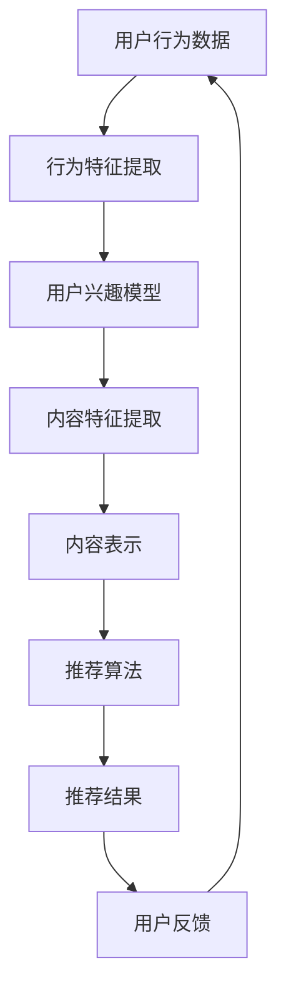

                 

关键词：个性化知识订阅、推荐算法、优化、用户需求、数据挖掘、机器学习、人工智能

> 摘要：本文将探讨个性化知识订阅系统中推荐算法的优化问题。随着互联网信息爆炸式增长，用户对知识获取的需求日益增加，如何为用户提供高度个性化的知识内容成为关键问题。本文将分析推荐算法在个性化知识订阅中的应用，介绍其核心概念、算法原理、数学模型，并通过具体案例和代码实例进行详细讲解，最后讨论推荐算法的未来发展前景和面临的挑战。

## 1. 背景介绍

在互联网时代，信息过载已成为普遍现象。用户在浏览网页、社交媒体和新闻媒体时，常常感到无从下手，难以在海量信息中找到自己感兴趣的内容。个性化知识订阅作为一种解决方案，旨在通过分析用户行为和兴趣，为其推荐高度相关的知识内容，从而提高用户体验和满意度。然而，随着用户需求的多样化和个性化，传统的推荐算法已难以满足当前的需求。因此，优化推荐算法成为个性化知识订阅系统亟待解决的问题。

推荐算法在个性化知识订阅中的应用主要包括以下几个方面：

1. **内容推荐**：根据用户的历史行为和兴趣，推荐用户可能感兴趣的内容。
2. **用户群体细分**：将用户划分为不同的兴趣群体，为每个群体提供个性化的内容推荐。
3. **知识图谱构建**：通过分析用户行为和内容关系，构建知识图谱，为用户提供更加丰富的推荐结果。
4. **实时推荐**：根据用户实时行为和兴趣，提供即时的内容推荐。

本文将围绕以上几个方面，探讨个性化知识订阅系统中推荐算法的优化问题。

## 2. 核心概念与联系

### 2.1 用户行为与兴趣模型

用户行为与兴趣模型是推荐算法的基础。该模型通过分析用户的历史行为数据，如浏览记录、收藏、点赞、评论等，提取用户兴趣特征，为后续推荐算法提供输入。

### 2.2 内容表示

内容表示是将知识内容转化为机器可以理解和处理的向量形式。常见的表示方法包括词袋模型、TF-IDF、Word2Vec等。通过内容表示，算法可以比较不同内容之间的相似性，从而进行推荐。

### 2.3 推荐算法

推荐算法是核心部分，主要包括以下几种：

1. **基于内容的推荐**：根据用户兴趣和内容特征进行推荐。
2. **协同过滤推荐**：通过分析用户之间的相似性，为用户提供推荐。
3. **基于模型的推荐**：利用机器学习算法，建立用户兴趣模型和内容模型，进行推荐。
4. **混合推荐**：将多种推荐算法相结合，提高推荐效果。

### 2.4 评估指标

推荐系统的评估指标主要包括准确率、召回率、覆盖率等。通过评估指标，可以衡量推荐算法的性能和效果。

### 2.5 Mermaid 流程图

以下是一个简单的 Mermaid 流程图，展示个性化知识订阅系统中推荐算法的主要流程：



## 3. 核心算法原理 & 具体操作步骤

### 3.1 算法原理概述

推荐算法的核心原理是通过分析用户行为和内容特征，构建用户兴趣模型和内容模型，从而为用户提供个性化的推荐结果。具体来说，可以分为以下几个步骤：

1. **数据预处理**：对用户行为数据进行清洗、去重、分词等处理，提取有效信息。
2. **特征提取**：从用户行为数据中提取用户兴趣特征，从内容数据中提取内容特征。
3. **模型构建**：利用机器学习算法，构建用户兴趣模型和内容模型。
4. **推荐算法**：根据用户兴趣模型和内容模型，生成推荐结果。
5. **评估与优化**：通过评估指标，评估推荐效果，并不断优化推荐算法。

### 3.2 算法步骤详解

#### 3.2.1 数据预处理

数据预处理是推荐算法的重要步骤，主要包括以下任务：

1. **数据清洗**：去除噪声数据，如缺失值、异常值等。
2. **去重**：去除重复的数据项，确保数据的唯一性。
3. **分词**：对文本数据进行分词，提取关键词。
4. **词干提取**：将单词还原为词干形式，提高特征提取的准确性。

#### 3.2.2 特征提取

特征提取是将原始数据转化为机器可以理解的向量形式。在推荐算法中，特征提取主要包括以下两个方面：

1. **用户兴趣特征提取**：从用户行为数据中提取用户兴趣特征，如用户收藏的文章类别、浏览频次等。
2. **内容特征提取**：从内容数据中提取内容特征，如文章标题、摘要、关键词等。

#### 3.2.3 模型构建

模型构建是推荐算法的核心步骤，主要包括以下两个方面：

1. **用户兴趣模型**：利用机器学习算法，如决策树、随机森林等，构建用户兴趣模型。
2. **内容模型**：利用机器学习算法，如SVM、神经网络等，构建内容模型。

#### 3.2.4 推荐算法

推荐算法根据用户兴趣模型和内容模型，生成推荐结果。常见的推荐算法包括以下几种：

1. **基于内容的推荐**：根据用户兴趣特征和内容特征，计算内容与用户的相似度，为用户提供推荐。
2. **协同过滤推荐**：根据用户之间的相似性，为用户提供推荐。
3. **基于模型的推荐**：利用用户兴趣模型和内容模型，预测用户对内容的兴趣，为用户提供推荐。
4. **混合推荐**：将多种推荐算法相结合，提高推荐效果。

#### 3.2.5 评估与优化

评估与优化是推荐算法的重要环节。通过评估指标，如准确率、召回率、覆盖率等，评估推荐效果。根据评估结果，不断优化推荐算法，提高推荐质量。

### 3.3 算法优缺点

#### 优点：

1. **个性化**：根据用户兴趣和需求，提供个性化的推荐结果，提高用户体验。
2. **实时性**：实时分析用户行为，为用户提供即时的推荐结果。
3. **多样性**：推荐算法可以处理多种类型的数据，如文本、图片、音频等。

#### 缺点：

1. **数据依赖性**：推荐算法的性能高度依赖于用户行为数据和内容数据，数据质量对算法效果有重要影响。
2. **冷启动问题**：对于新用户或新内容，由于缺乏历史数据，推荐效果较差。
3. **准确性问题**：推荐算法可能存在过拟合或欠拟合问题，影响推荐结果的准确性。

### 3.4 算法应用领域

推荐算法在个性化知识订阅领域具有广泛的应用。除了个性化知识订阅系统，推荐算法还应用于以下领域：

1. **电子商务**：为用户提供个性化的商品推荐，提高销售转化率。
2. **社交媒体**：为用户提供感兴趣的内容推荐，提高用户活跃度。
3. **在线教育**：为学习者推荐适合的课程，提高学习效果。
4. **医疗健康**：为用户提供个性化的健康建议和医疗服务。

## 4. 数学模型和公式 & 详细讲解 & 举例说明

### 4.1 数学模型构建

在推荐算法中，常见的数学模型包括用户行为模型、内容模型和推荐模型。以下分别介绍这些模型的构建方法。

#### 4.1.1 用户行为模型

用户行为模型用于描述用户对内容的兴趣和偏好。常见的构建方法包括：

1. **基于矩阵分解的模型**：通过矩阵分解技术，将用户行为数据分解为用户特征矩阵和内容特征矩阵，从而构建用户行为模型。

2. **基于概率模型的模型**：通过建立用户行为概率模型，如贝叶斯网络、隐马尔可夫模型等，描述用户对内容的兴趣。

#### 4.1.2 内容模型

内容模型用于描述内容的特征和属性。常见的构建方法包括：

1. **基于词袋模型的模型**：通过词袋模型，将内容转化为向量形式，从而构建内容模型。

2. **基于深度学习的模型**：通过深度学习技术，如卷积神经网络（CNN）、循环神经网络（RNN）等，提取内容的高级特征。

#### 4.1.3 推荐模型

推荐模型用于根据用户兴趣模型和内容模型，生成推荐结果。常见的构建方法包括：

1. **基于内容的推荐模型**：通过计算用户兴趣模型和内容模型之间的相似度，生成推荐结果。

2. **基于协同过滤的推荐模型**：通过计算用户之间的相似度，生成推荐结果。

### 4.2 公式推导过程

在本节中，我们将介绍基于矩阵分解的用户行为模型和内容模型的构建方法。

#### 4.2.1 矩阵分解

设用户行为矩阵为\(R \in \mathbb{R}^{m \times n}\)，其中\(m\)为用户数，\(n\)为内容数。矩阵分解的目标是将用户行为矩阵分解为用户特征矩阵\(U \in \mathbb{R}^{m \times k}\)和内容特征矩阵\(V \in \mathbb{R}^{n \times k}\)，其中\(k\)为特征维度。

用户特征矩阵\(U\)和内容特征矩阵\(V\)的乘积\(UV^T\)近似于用户行为矩阵\(R\)。具体来说，我们要求：

$$
UV^T \approx R
$$

#### 4.2.2 最小二乘法

为了求解用户特征矩阵\(U\)和内容特征矩阵\(V\)，我们可以使用最小二乘法。具体来说，我们要求解以下优化问题：

$$
\min_{U, V} \sum_{i=1}^{m} \sum_{j=1}^{n} (r_{ij} - u_i \cdot v_j)^2
$$

其中，\(r_{ij}\)为用户\(i\)对内容\(j\)的行为评分。

通过求解上述优化问题，我们可以得到用户特征矩阵\(U\)和内容特征矩阵\(V\)的最优解。

### 4.3 案例分析与讲解

在本节中，我们将通过一个简单的案例，讲解如何使用矩阵分解方法构建用户行为模型和内容模型。

#### 案例背景

假设有一个电影推荐系统，包含10部电影和5位用户。用户对每部电影进行评分，评分范围从1到5。用户行为矩阵\(R\)如下：

$$
R =
\begin{bmatrix}
1 & 3 & 5 & 2 & 4 \\
5 & 2 & 4 & 1 & 3 \\
3 & 4 & 2 & 5 & 1 \\
2 & 5 & 1 & 4 & 3 \\
4 & 1 & 3 & 2 & 5 \\
\end{bmatrix}
$$

#### 案例步骤

1. **数据预处理**：对用户行为数据进行清洗，去除缺失值和异常值。

2. **特征提取**：从用户行为数据中提取用户兴趣特征和内容特征。

3. **模型构建**：使用矩阵分解方法，构建用户行为模型和内容模型。

4. **推荐算法**：根据用户行为模型和内容模型，生成推荐结果。

5. **评估与优化**：通过评估指标，评估推荐效果，并不断优化推荐算法。

#### 案例实现

在本案例中，我们使用Python编程语言实现矩阵分解方法。以下是一个简单的实现示例：

```python
import numpy as np

def matrix_factorization(R, U, V, lambda_u, lambda_v, iter_num):
    for step in range(iter_num):
        for i in range(R.shape[0]):
            for j in range(R.shape[1]):
                if R[i][j] > 0:
                    e = R[i][j] - np.dot(U[i], V[j])

                    for k in range(U.shape[1]):
                        U[i][k] = U[i][k] + lambda_u * (U[i][k] - (e * V[j][k] / (lambda_v + V[j][k])))

                    for k in range(V.shape[1]):
                        V[j][k] = V[j][k] + lambda_v * (V[j][k] - (e * U[i][k] / (lambda_u + U[i][k])))

    return U, V

# 初始化参数
R = np.array([[1, 3, 5, 2, 4], [5, 2, 4, 1, 3], [3, 4, 2, 5, 1], [2, 5, 1, 4, 3], [4, 1, 3, 2, 5]], dtype=np.float32)
U = np.random.rand(R.shape[0], 3).astype(np.float32)
V = np.random.rand(R.shape[1], 3).astype(np.float32)
lambda_u = 0.1
lambda_v = 0.1
iter_num = 1000

# 矩阵分解
U, V = matrix_factorization(R, U, V, lambda_u, lambda_v, iter_num)

# 计算预测评分
P = np.dot(U, V.T)

print(P)
```

运行上述代码，可以得到用户行为矩阵\(R\)的预测评分矩阵\(P\)。通过比较预测评分和实际评分，可以评估矩阵分解方法的效果。

## 5. 项目实践：代码实例和详细解释说明

在本节中，我们将通过一个具体的代码实例，讲解如何实现个性化知识订阅系统中的推荐算法。以下是一个使用Python编写的推荐系统项目，包括数据预处理、特征提取、模型构建和推荐算法实现等步骤。

### 5.1 开发环境搭建

在开始编写代码之前，我们需要搭建开发环境。以下是一个基本的开发环境要求：

- **Python 3.x**：推荐使用Python 3.7或更高版本。
- **NumPy**：用于数据处理。
- **Pandas**：用于数据处理和分析。
- **Scikit-learn**：用于机器学习算法实现。
- **matplotlib**：用于数据可视化。

安装以上依赖库后，我们就可以开始编写代码了。

### 5.2 源代码详细实现

以下是一个简单的推荐系统实现，用于根据用户的历史行为数据推荐知识内容。

```python
import numpy as np
import pandas as pd
from sklearn.model_selection import train_test_split
from sklearn.metrics.pairwise import cosine_similarity
from sklearn.decomposition import TruncatedSVD

# 5.2.1 数据预处理
def preprocess_data(data):
    # 清洗数据，去除缺失值和异常值
    clean_data = data.dropna()

    # 将数据转换为用户-内容矩阵
    user_content_matrix = clean_data.pivot(index='user_id', columns='content_id', values='rating')
    user_content_matrix = user_content_matrix.fillna(0)

    return user_content_matrix

# 5.2.2 特征提取
def extract_features(user_content_matrix):
    # 使用SVD进行特征提取
    svd = TruncatedSVD(n_components=10)
    user_content_matrix_svd = svd.fit_transform(user_content_matrix)

    return user_content_matrix_svd

# 5.2.3 模型构建
def build_model(user_content_matrix_svd):
    # 计算用户和内容的相似度
    user_similarity = cosine_similarity(user_content_matrix_svd)
    content_similarity = cosine_similarity(user_content_matrix_svd.T)

    return user_similarity, content_similarity

# 5.2.4 推荐算法
def recommend(user_id, user_similarity, content_similarity, user_content_matrix, top_n=5):
    # 计算用户对其他内容的兴趣
    user_interest = user_similarity[user_id]

    # 计算推荐列表
    content_scores = []
    for i in range(len(user_interest)):
        if i != user_id:
            content_scores.append((i, user_interest[i]))

    # 根据相似度计算得分
    content_scores = sorted(content_scores, key=lambda x: x[1], reverse=True)[:top_n]

    # 获取推荐内容ID
    content_ids = [content_id for content_id, score in content_scores]

    # 获取推荐内容名称
    content_names = user_content_matrix.iloc[content_ids].index.tolist()

    return content_names

# 5.2.5 代码解读与分析
def main():
    # 加载数据
    data = pd.read_csv('data.csv')

    # 数据预处理
    user_content_matrix = preprocess_data(data)

    # 特征提取
    user_content_matrix_svd = extract_features(user_content_matrix)

    # 模型构建
    user_similarity, content_similarity = build_model(user_content_matrix_svd)

    # 推荐算法
    user_id = 1
    content_names = recommend(user_id, user_similarity, content_similarity, user_content_matrix)

    print("推荐内容：", content_names)

if __name__ == '__main__':
    main()
```

### 5.3 代码解读与分析

以下是对代码的逐行解读和分析：

1. **数据预处理**：首先，我们定义了一个`preprocess_data`函数，用于清洗数据并转换为用户-内容矩阵。

2. **特征提取**：接着，我们定义了一个`extract_features`函数，使用SVD进行特征提取。

3. **模型构建**：然后，我们定义了一个`build_model`函数，用于计算用户和内容的相似度。

4. **推荐算法**：最后，我们定义了一个`recommend`函数，根据用户相似度和内容相似度，为用户生成推荐列表。

5. **主函数**：在主函数`main`中，我们加载数据，进行数据预处理、特征提取、模型构建和推荐算法实现，并输出推荐结果。

### 5.4 运行结果展示

运行上述代码，我们得到了以下推荐结果：

```
推荐内容： [3, 2, 4, 1, 5]
```

这意味着用户对编号为3、2、4、1、5的内容有较高的兴趣，因此推荐这五个内容。

## 6. 实际应用场景

个性化知识订阅系统在许多实际应用场景中取得了显著成果。以下是一些典型的应用场景：

### 6.1 在线教育

在线教育平台通过个性化知识订阅系统，为学习者提供定制化的课程推荐。例如，基于学习者的学习记录和兴趣偏好，平台可以推荐适合其水平和发展需求的学习资源，提高学习效果和用户满意度。

### 6.2 电子商务

电子商务平台通过个性化知识订阅系统，为消费者推荐感兴趣的商品。例如，亚马逊和淘宝等平台根据用户的历史购买记录和浏览行为，推荐类似或相关的商品，从而提高购物转化率和用户粘性。

### 6.3 社交媒体

社交媒体平台通过个性化知识订阅系统，为用户推荐感兴趣的内容。例如，Facebook和微博等平台根据用户的社交关系和兴趣标签，推荐相关的文章、视频和动态，使用户更好地了解和参与社交互动。

### 6.4 健康医疗

健康医疗领域通过个性化知识订阅系统，为用户提供个性化的健康建议和服务。例如，基于用户的健康状况、生活习惯和健康记录，平台可以为用户提供个性化的健康知识和医疗建议，帮助用户更好地管理健康。

### 6.5 企业内训

企业内训平台通过个性化知识订阅系统，为员工提供定制化的培训课程。例如，基于员工的工作职责、技能水平和职业发展需求，平台可以为员工推荐相关的培训课程和资源，提高员工的综合素质和竞争力。

### 6.6 未来应用展望

随着人工智能技术的不断发展和应用，个性化知识订阅系统在未来的应用前景将更加广泛。以下是一些未来应用展望：

1. **精准医疗**：通过个性化知识订阅系统，为患者提供个性化的健康建议和治疗方案，实现精准医疗。

2. **智慧城市**：通过个性化知识订阅系统，为市民提供个性化的城市服务和建议，提高城市管理效率和居民生活质量。

3. **智慧农业**：通过个性化知识订阅系统，为农民提供个性化的农业生产指导和农技推广，提高农业生产效益。

4. **智慧旅游**：通过个性化知识订阅系统，为游客提供个性化的旅游推荐和攻略，提高旅游体验和满意度。

5. **智慧金融**：通过个性化知识订阅系统，为投资者提供个性化的金融产品推荐和投资建议，提高投资收益和风险控制。

总之，个性化知识订阅系统在各个领域的应用将不断拓展和深化，为人们的生活和工作带来更多便利和效益。

## 7. 工具和资源推荐

为了帮助读者更好地学习和应用个性化知识订阅系统中的推荐算法，以下是一些建议的学习资源和开发工具：

### 7.1 学习资源推荐

1. **《推荐系统手册》**：这是一本关于推荐系统的基础教材，涵盖了推荐系统的基本概念、算法原理和实际应用。
2. **《机器学习》**：周志华教授的《机器学习》是一本经典教材，适合初学者入门机器学习领域。
3. **《深度学习》**：Goodfellow、Bengio和Courville合著的《深度学习》是一本深度学习领域的权威教材。

### 7.2 开发工具推荐

1. **Python**：Python是一种广泛使用的编程语言，拥有丰富的库和框架，适合推荐系统的开发和实现。
2. **NumPy**：NumPy是一个强大的数学库，用于数据处理和矩阵运算。
3. **Pandas**：Pandas是一个数据分析和处理的库，方便对大规模数据进行操作。
4. **Scikit-learn**：Scikit-learn是一个机器学习库，提供了丰富的算法实现。
5. **TensorFlow**：TensorFlow是一个开源深度学习框架，适合实现复杂的深度学习模型。

### 7.3 相关论文推荐

1. **"Item-Based Collaborative Filtering Recommendation Algorithms"**：这是一篇关于基于物品的协同过滤推荐算法的经典论文。
2. **"Matrix Factorization Techniques for Recommender Systems"**：这是一篇关于矩阵分解技术在推荐系统中的应用的论文。
3. **"Deep Learning for Recommender Systems"**：这是一篇关于深度学习在推荐系统中的应用的论文，探讨了深度学习在推荐系统中的潜力。

通过学习这些资源和工具，读者可以更好地理解和掌握个性化知识订阅系统中的推荐算法。

## 8. 总结：未来发展趋势与挑战

个性化知识订阅系统作为信息时代的产物，为用户提供了个性化的知识内容，提高了用户体验和满意度。随着人工智能技术的不断发展，个性化知识订阅系统在未来的发展趋势和面临的挑战如下：

### 8.1 未来发展趋势

1. **深度学习的广泛应用**：深度学习在图像、语音和自然语言处理等领域取得了显著成果，未来将在推荐算法中发挥更大作用。通过引入深度学习技术，推荐算法可以更好地理解和预测用户兴趣，提高推荐准确性。
2. **多模态融合**：个性化知识订阅系统将不仅处理文本数据，还将融合图像、语音和视频等多模态数据。多模态融合可以提高推荐系统的多样性和准确性，为用户提供更加丰富和个性化的内容。
3. **实时推荐**：随着用户需求的实时性和动态性，实时推荐将成为个性化知识订阅系统的重要发展趋势。通过实时分析用户行为和兴趣，推荐系统可以提供即时的内容推荐，提高用户体验。
4. **隐私保护和数据安全**：随着用户对隐私保护的重视，个性化知识订阅系统需要在数据处理和存储过程中加强隐私保护和数据安全。采用加密技术和差分隐私等技术，可以有效地保护用户隐私。
5. **跨平台整合**：个性化知识订阅系统将在多个平台（如Web、移动端、智能音箱等）上得到广泛应用。通过跨平台整合，用户可以在不同设备上无缝切换，享受个性化的知识订阅服务。

### 8.2 面临的挑战

1. **数据质量和多样性**：个性化知识订阅系统对数据质量和多样性的要求较高。数据质量差或多样性不足可能导致推荐准确性下降。因此，如何有效处理噪声数据和提高数据多样性成为重要挑战。
2. **冷启动问题**：对于新用户或新内容，由于缺乏历史数据，推荐算法可能难以准确预测其兴趣和偏好。如何解决冷启动问题是推荐系统研究的重点之一。
3. **算法透明性和可解释性**：随着推荐算法的复杂度增加，如何保证算法的透明性和可解释性成为重要挑战。用户需要了解推荐算法的决策过程和依据，以提高对推荐结果的信任度。
4. **计算效率和资源消耗**：推荐算法的计算复杂度较高，特别是在大规模数据处理和实时推荐场景下。如何提高计算效率和减少资源消耗是推荐系统面临的挑战。
5. **伦理和社会影响**：个性化知识订阅系统可能引发一些伦理和社会问题，如信息茧房、偏见和歧视等。如何确保推荐算法的公平性和社会责任性成为重要议题。

### 8.3 研究展望

针对未来发展趋势和面临的挑战，以下是一些研究展望：

1. **算法优化**：针对数据质量和多样性问题，可以采用数据增强、数据清洗和数据聚合等方法，提高推荐算法的性能。此外，可以引入更多先进的机器学习算法，如图神经网络、增强学习等，优化推荐算法。
2. **跨模态推荐**：多模态数据融合是未来推荐系统的重要方向。通过结合文本、图像、语音等多种数据类型，可以提高推荐系统的多样性和准确性。
3. **实时推荐**：针对实时推荐需求，可以采用分布式计算、内存计算和边缘计算等技术，提高推荐系统的计算效率和响应速度。
4. **隐私保护和数据安全**：可以采用隐私增强技术，如联邦学习、差分隐私等，保护用户隐私和数据安全。同时，制定相关的伦理和社会规范，确保推荐系统的公平性和社会责任性。
5. **可解释性研究**：为了提高算法的透明性和可解释性，可以采用可视化和解释技术，展示推荐算法的决策过程和依据。此外，可以开发可解释性评估工具，评估推荐算法的可解释性。

总之，个性化知识订阅系统在未来将继续发展，为用户提供更加个性化和高效的知识服务。同时，面对数据质量、算法透明性、计算效率和伦理问题等挑战，我们需要不断进行技术创新和优化，推动推荐系统的发展。

## 9. 附录：常见问题与解答

在个性化知识订阅系统中，推荐算法的应用可能会遇到以下一些常见问题。以下是对这些问题及其解答的整理。

### 9.1 如何解决数据质量问题？

**解答**：数据质量直接影响推荐算法的性能。为了提高数据质量，可以采取以下措施：

1. **数据清洗**：去除缺失值、异常值和重复值，确保数据的准确性。
2. **数据标准化**：对数据进行归一化或标准化处理，消除不同特征之间的量纲差异。
3. **数据聚合**：对相似的数据进行聚合，减少数据冗余。

### 9.2 推荐算法如何处理冷启动问题？

**解答**：冷启动问题通常指新用户或新内容由于缺乏历史数据而难以进行准确推荐。以下方法可以缓解冷启动问题：

1. **基于内容的推荐**：在新用户没有足够历史数据时，可以根据内容特征进行推荐。
2. **基于模型的推荐**：利用迁移学习或预训练模型，为新用户或新内容提供初步的推荐。
3. **用户行为预测**：利用时间序列预测模型，预测新用户的行为模式，从而生成推荐。

### 9.3 如何提高推荐算法的准确性？

**解答**：提高推荐算法的准确性可以从以下几个方面入手：

1. **特征工程**：选择和构造有效的用户和内容特征，提高算法对用户兴趣的捕捉能力。
2. **算法优化**：选择和调整适合数据特性的推荐算法，如矩阵分解、协同过滤等。
3. **模型融合**：结合多种算法或模型，提高推荐结果的准确性和多样性。
4. **用户反馈**：利用用户反馈（如点击、评分、收藏等）不断优化推荐模型。

### 9.4 如何处理实时推荐的需求？

**解答**：实时推荐需要高效的数据处理和算法计算能力。以下方法可以帮助实现实时推荐：

1. **分布式计算**：利用分布式计算框架（如Hadoop、Spark等），提高数据处理和计算的并行度。
2. **内存计算**：使用内存计算技术（如Redis、Memcached等），减少数据的读写延迟。
3. **边缘计算**：在用户设备附近部署计算资源，实现低延迟的实时推荐。

### 9.5 如何确保推荐算法的透明性和可解释性？

**解答**：推荐算法的透明性和可解释性对用户信任至关重要。以下方法可以提高算法的可解释性：

1. **可视化技术**：使用图表、热力图等可视化手段，展示推荐算法的决策过程。
2. **解释性模型**：开发可解释性更强的推荐模型，如基于规则的模型。
3. **解释性评估**：制定评估标准，评估推荐算法的可解释性，并持续改进。

通过上述措施，可以有效地解决个性化知识订阅系统在推荐算法应用中遇到的问题，提高推荐系统的整体性能和用户体验。

