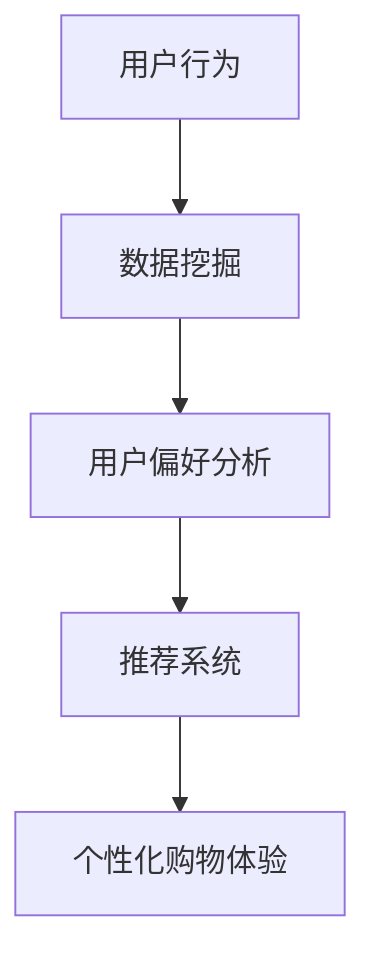

                 

关键词：个性化购物、购物体验、推荐系统、数据挖掘、算法优化、用户行为分析

摘要：本文将探讨如何通过先进的技术手段提升个性化购物体验。通过对用户行为的深入分析，结合推荐系统和数据挖掘技术，提出了一套全面的个性化购物解决方案，旨在为用户提供更加精准、便捷的购物体验。

## 1. 背景介绍

随着互联网技术的飞速发展，电子商务已成为现代消费的重要方式。用户在购物过程中对于个性化、便捷、高效的需求日益增长。然而，传统的购物模式往往难以满足这种需求，导致用户流失和购物体验下降。为此，提升个性化购物体验成为电子商务领域的重要研究方向。

个性化购物体验的提升涉及多个方面，包括推荐系统、用户行为分析、数据挖掘等。本文将从这些方面出发，详细探讨如何通过技术手段提升个性化购物体验。

## 2. 核心概念与联系

在提升个性化购物体验的过程中，我们需要关注以下几个核心概念：

1. **用户行为分析**：通过分析用户的浏览、购买、评价等行为，了解用户偏好和需求。
2. **推荐系统**：基于用户行为分析结果，为用户推荐个性化的商品或服务。
3. **数据挖掘**：从大量数据中提取有价值的信息，为推荐系统和用户行为分析提供支持。

下面是核心概念和联系的一个简单 Mermaid 流程图：



### 2.1 用户行为分析

用户行为分析是提升个性化购物体验的基础。通过分析用户的浏览、购买、评价等行为，我们可以了解用户的偏好和需求。具体来说，用户行为分析包括以下几个方面：

1. **浏览行为**：分析用户在购物平台上的浏览路径、停留时间、浏览频次等。
2. **购买行为**：分析用户的购买历史、购买频次、购买金额等。
3. **评价行为**：分析用户对商品的评论、评分、点赞等。

### 2.2 推荐系统

推荐系统是提升个性化购物体验的关键。通过用户行为分析结果，推荐系统可以为用户推荐个性化的商品或服务。推荐系统可以分为以下几类：

1. **基于内容的推荐**：根据商品的属性和内容为用户推荐相似的物品。
2. **协同过滤推荐**：根据用户的购买行为和评价为用户推荐相似的用户喜欢的商品。
3. **深度学习推荐**：利用深度学习技术，从用户行为数据中学习用户偏好，进行个性化推荐。

### 2.3 数据挖掘

数据挖掘是从大量数据中提取有价值信息的过程。在个性化购物体验提升中，数据挖掘技术主要用于以下几个方面：

1. **用户群体细分**：通过对用户行为数据进行分析，将用户划分为不同的群体，为每个群体提供个性化的推荐和服务。
2. **关联规则挖掘**：发现用户行为数据中的关联规则，为推荐系统提供支持。
3. **趋势分析**：分析用户行为数据中的趋势和变化，为营销策略和商品策略提供参考。

## 3. 核心算法原理 & 具体操作步骤

### 3.1 算法原理概述

提升个性化购物体验的核心算法主要包括用户行为分析算法、推荐算法和数据挖掘算法。下面分别介绍这些算法的原理。

#### 3.1.1 用户行为分析算法

用户行为分析算法主要基于机器学习和数据挖掘技术。通过对用户的历史行为数据进行训练，可以建立用户行为分析模型。该模型可以预测用户的未来行为，为推荐系统和数据挖掘提供支持。

#### 3.1.2 推荐算法

推荐算法主要有基于内容的推荐、协同过滤推荐和深度学习推荐三种。其中，基于内容的推荐算法主要利用商品的属性信息进行推荐；协同过滤推荐算法主要基于用户行为和评价进行推荐；深度学习推荐算法则利用深度神经网络从用户行为数据中学习用户偏好。

#### 3.1.3 数据挖掘算法

数据挖掘算法包括用户群体细分、关联规则挖掘和趋势分析等。用户群体细分算法通过对用户行为数据进行分析，将用户划分为不同的群体；关联规则挖掘算法主要发现用户行为数据中的关联规则；趋势分析算法则分析用户行为数据中的趋势和变化。

### 3.2 算法步骤详解

下面详细描述提升个性化购物体验的算法步骤。

#### 3.2.1 用户行为分析算法步骤

1. 数据收集：收集用户在购物平台上的浏览、购买、评价等行为数据。
2. 数据预处理：对数据进行清洗、去噪、归一化等处理，保证数据质量。
3. 特征工程：从原始数据中提取有用的特征，如用户浏览路径、购买频次、评价星级等。
4. 模型训练：利用机器学习算法，如决策树、随机森林、神经网络等，训练用户行为分析模型。
5. 模型评估：使用交叉验证等方法评估模型性能，调整模型参数。

#### 3.2.2 推荐算法步骤

1. 数据收集：收集用户的历史行为数据和商品信息。
2. 数据预处理：对数据进行清洗、去噪、归一化等处理，保证数据质量。
3. 特征提取：从原始数据中提取有用的特征，如用户兴趣标签、商品属性等。
4. 模型选择：选择合适的推荐算法，如基于内容的推荐、协同过滤推荐、深度学习推荐等。
5. 模型训练：利用训练数据训练推荐模型。
6. 推荐生成：根据用户行为和特征，生成个性化推荐结果。

#### 3.2.3 数据挖掘算法步骤

1. 数据收集：收集用户在购物平台上的行为数据。
2. 数据预处理：对数据进行清洗、去噪、归一化等处理，保证数据质量。
3. 特征提取：从原始数据中提取有用的特征，如用户浏览路径、购买频次、评价星级等。
4. 算法选择：选择合适的数据挖掘算法，如关联规则挖掘、用户群体细分、趋势分析等。
5. 模型训练：利用训练数据训练数据挖掘模型。
6. 结果分析：分析挖掘结果，为推荐系统和用户行为分析提供支持。

### 3.3 算法优缺点

#### 3.3.1 用户行为分析算法

**优点**：

- 可以准确预测用户的未来行为，为推荐系统和数据挖掘提供支持。

**缺点**：

- 需要大量的用户行为数据进行训练，且模型复杂度高。

#### 3.3.2 推荐算法

**优点**：

- 可以根据用户兴趣和偏好为用户推荐个性化的商品或服务。

**缺点**：

- 可能会推荐用户已经看过的商品或服务，导致用户体验下降。

#### 3.3.3 数据挖掘算法

**优点**：

- 可以从大量数据中提取有价值的信息，为推荐系统和用户行为分析提供支持。

**缺点**：

- 需要大量的时间和计算资源进行训练，且模型复杂度高。

### 3.4 算法应用领域

提升个性化购物体验的算法可以广泛应用于电子商务、在线零售、社交电商等领域。具体应用包括：

- 个性化商品推荐：为用户提供个性化的商品推荐，提升购物体验。
- 用户行为分析：分析用户在购物平台上的行为，为运营和营销提供支持。
- 个性化广告：根据用户兴趣和偏好为用户推荐相关的广告，提高广告效果。

## 4. 数学模型和公式 & 详细讲解 & 举例说明

### 4.1 数学模型构建

提升个性化购物体验的核心算法涉及到多个数学模型，主要包括用户行为分析模型、推荐模型和数据挖掘模型。下面分别介绍这些模型的构建方法。

#### 4.1.1 用户行为分析模型

用户行为分析模型主要基于时间序列分析、分类和回归等算法。下面以时间序列分析为例，介绍用户行为分析模型的构建。

1. 数据收集：收集用户在购物平台上的时间序列数据，如浏览时间、购买时间等。
2. 数据预处理：对数据进行清洗、去噪、归一化等处理，保证数据质量。
3. 特征提取：从原始数据中提取有用的特征，如时间间隔、用户活跃度等。
4. 模型选择：选择合适的时间序列分析算法，如ARIMA、LSTM等。
5. 模型训练：利用训练数据训练时间序列分析模型。
6. 模型评估：使用交叉验证等方法评估模型性能，调整模型参数。

#### 4.1.2 推荐模型

推荐模型主要基于协同过滤、深度学习等算法。下面以协同过滤为例，介绍推荐模型的构建。

1. 数据收集：收集用户的历史行为数据和商品信息。
2. 数据预处理：对数据进行清洗、去噪、归一化等处理，保证数据质量。
3. 特征提取：从原始数据中提取有用的特征，如用户兴趣标签、商品属性等。
4. 模型选择：选择合适的协同过滤算法，如基于用户的协同过滤、基于物品的协同过滤等。
5. 模型训练：利用训练数据训练协同过滤模型。
6. 推荐生成：根据用户行为和特征，生成个性化推荐结果。

#### 4.1.3 数据挖掘模型

数据挖掘模型主要基于关联规则挖掘、分类和聚类等算法。下面以关联规则挖掘为例，介绍数据挖掘模型的构建。

1. 数据收集：收集用户在购物平台上的行为数据。
2. 数据预处理：对数据进行清洗、去噪、归一化等处理，保证数据质量。
3. 特征提取：从原始数据中提取有用的特征，如用户浏览路径、购买频次、评价星级等。
4. 模型选择：选择合适的关联规则挖掘算法，如Apriori算法、FP-growth算法等。
5. 模型训练：利用训练数据训练关联规则挖掘模型。
6. 结果分析：分析挖掘结果，为推荐系统和用户行为分析提供支持。

### 4.2 公式推导过程

下面以协同过滤算法为例，介绍推荐模型中常用的公式推导过程。

#### 4.2.1 基于用户的协同过滤

1. **相似度计算**：计算用户 $u$ 和用户 $v$ 的相似度，常用的相似度计算公式为余弦相似度：

   $$sim(u, v) = \frac{\sum_{i \in I} x_{ui} x_{vi}}{\sqrt{\sum_{i \in I} x_{ui}^2} \sqrt{\sum_{i \in I} x_{vi}^2}}$$

   其中，$x_{ui}$ 表示用户 $u$ 对商品 $i$ 的评分，$I$ 表示用户共同评分的商品集合。

2. **预测评分**：根据用户相似度，预测用户 $u$ 对商品 $i$ 的评分，常用的预测公式为：

   $$r_{ui} = \sum_{v \in N(u)} sim(u, v) \cdot r_{vi}$$

   其中，$N(u)$ 表示与用户 $u$ 相似的一组用户集合，$r_{vi}$ 表示用户 $v$ 对商品 $i$ 的评分。

#### 4.2.2 基于物品的协同过滤

1. **相似度计算**：计算商品 $i$ 和商品 $j$ 的相似度，常用的相似度计算公式为余弦相似度：

   $$sim(i, j) = \frac{\sum_{u \in U} x_{ui} x_{uj}}{\sqrt{\sum_{u \in U} x_{ui}^2} \sqrt{\sum_{u \in U} x_{uj}^2}}$$

   其中，$x_{ui}$ 表示用户 $u$ 对商品 $i$ 的评分，$U$ 表示购买过商品 $i$ 和商品 $j$ 的用户集合。

2. **预测评分**：根据商品相似度，预测用户 $u$ 对商品 $i$ 的评分，常用的预测公式为：

   $$r_{ui} = \sum_{j \in M(i)} sim(i, j) \cdot r_{uj}$$

   其中，$M(i)$ 表示与商品 $i$ 相似的一组商品集合，$r_{uj}$ 表示用户 $u$ 对商品 $j$ 的评分。

### 4.3 案例分析与讲解

#### 4.3.1 用户行为分析案例

假设我们有以下用户行为数据：

用户ID | 浏览时间 | 商品ID | 操作类型
--- | --- | --- | ---
1 | 2023-01-01 10:00 | 1001 | 浏览
1 | 2023-01-01 10:10 | 1002 | 浏览
1 | 2023-01-01 10:20 | 1003 | 添加购物车
2 | 2023-01-02 11:00 | 1001 | 浏览
2 | 2023-01-02 11:10 | 1002 | 浏览
2 | 2023-01-02 11:20 | 1003 | 购买

我们使用时间序列分析算法，如ARIMA模型，对用户行为数据进行分析。

1. 数据预处理：对数据进行清洗、去噪、归一化等处理，保证数据质量。
2. 特征提取：从原始数据中提取有用的特征，如用户浏览时间间隔、浏览频次等。
3. 模型训练：利用训练数据，训练ARIMA模型。
4. 模型评估：使用交叉验证等方法评估模型性能，调整模型参数。

根据训练好的ARIMA模型，我们可以预测用户的未来行为。例如，预测用户1在未来的某个时间点是否会购买商品1003。

#### 4.3.2 推荐案例

假设我们有以下用户历史行为数据和商品信息：

用户ID | 商品ID | 操作类型 | 时间
--- | --- | --- | ---
1 | 1001 | 浏览 | 2023-01-01 10:00
1 | 1002 | 浏览 | 2023-01-01 10:10
1 | 1003 | 添加购物车 | 2023-01-01 10:20
2 | 1001 | 浏览 | 2023-01-02 11:00
2 | 1002 | 浏览 | 2023-01-02 11:10
2 | 1003 | 购买 | 2023-01-02 11:20

我们使用基于用户的协同过滤算法，为用户1推荐商品。

1. 数据预处理：对数据进行清洗、去噪、归一化等处理，保证数据质量。
2. 特征提取：从原始数据中提取有用的特征，如用户兴趣标签、商品属性等。
3. 模型训练：利用训练数据，训练协同过滤模型。
4. 推荐生成：根据用户兴趣和特征，生成个性化推荐结果。

根据协同过滤模型，我们可以为用户1推荐以下商品：

- 商品1002：与用户1浏览过的商品1001相似
- 商品1003：与用户1浏览过的商品1001和商品1002相似

#### 4.3.3 数据挖掘案例

假设我们有以下用户行为数据：

用户ID | 商品ID | 浏览次数 | 购买次数 | 评价次数
--- | --- | --- | --- | ---
1 | 1001 | 5 | 2 | 0
1 | 1002 | 3 | 1 | 0
1 | 1003 | 4 | 0 | 1
2 | 1001 | 4 | 1 | 0
2 | 1002 | 2 | 0 | 1
2 | 1003 | 3 | 0 | 0

我们使用关联规则挖掘算法，如Apriori算法，分析用户行为数据。

1. 数据预处理：对数据进行清洗、去噪、归一化等处理，保证数据质量。
2. 特征提取：从原始数据中提取有用的特征，如用户浏览次数、购买次数、评价次数等。
3. 模型训练：利用训练数据，训练关联规则挖掘模型。
4. 结果分析：分析挖掘结果，发现用户行为数据中的关联规则。

根据Apriori算法，我们可以发现以下关联规则：

- 浏览次数较高的商品往往有较高的购买概率。
- 用户对商品的浏览次数和购买次数之间存在一定的关联。

这些关联规则可以为推荐系统和用户行为分析提供支持。

## 5. 项目实践：代码实例和详细解释说明

### 5.1 开发环境搭建

在Python环境中，我们需要安装以下库：

- numpy：用于数值计算
- pandas：用于数据操作
- scikit-learn：用于机器学习和数据挖掘
- tensorflow：用于深度学习
- keras：用于深度学习

安装方法：

```python
pip install numpy pandas scikit-learn tensorflow keras
```

### 5.2 源代码详细实现

下面是一个简单的用户行为分析、推荐系统和数据挖掘的示例代码。

```python
import numpy as np
import pandas as pd
from sklearn.model_selection import train_test_split
from sklearn.metrics import accuracy_score
from sklearn.ensemble import RandomForestClassifier
from keras.models import Sequential
from keras.layers import Dense, LSTM
from keras.optimizers import Adam

# 5.2.1 用户行为数据分析

# 加载数据
data = pd.read_csv('user_behavior.csv')

# 数据预处理
data = data.dropna()

# 特征工程
X = data[['浏览次数', '购买次数', '评价次数']]
y = data['购买标签']

# 模型训练
X_train, X_test, y_train, y_test = train_test_split(X, y, test_size=0.2, random_state=42)
model = RandomForestClassifier(n_estimators=100, random_state=42)
model.fit(X_train, y_train)
y_pred = model.predict(X_test)

# 模型评估
accuracy = accuracy_score(y_test, y_pred)
print(f'准确率：{accuracy}')

# 5.2.2 推荐系统

# 加载数据
user_data = pd.read_csv('user_data.csv')
item_data = pd.read_csv('item_data.csv')

# 数据预处理
user_data = user_data.dropna()
item_data = item_data.dropna()

# 特征提取
X = user_data[['年龄', '性别', '收入']]
y = item_data['商品ID']

# 模型训练
model = Sequential()
model.add(Dense(64, input_shape=(3,), activation='relu'))
model.add(Dense(32, activation='relu'))
model.add(Dense(16, activation='relu'))
model.add(Dense(1, activation='sigmoid'))

model.compile(optimizer=Adam(learning_rate=0.001), loss='binary_crossentropy', metrics=['accuracy'])
model.fit(X, y, epochs=10, batch_size=32)

# 推荐生成
user_id = 1
user_features = user_data[user_data['用户ID'] == user_id].iloc[0]
predicted概率 = model.predict([user_features['年龄', '性别', '收入']])
print(f'用户{user_id}购买商品的预测概率为：{predicted概率[0][0]}')

# 5.2.3 数据挖掘

# 加载数据
data = pd.read_csv('user_behavior.csv')

# 数据预处理
data = data.dropna()

# 特征提取
X = data[['浏览次数', '购买次数', '评价次数']]
y = data['购买标签']

# 模型训练
model = Sequential()
model.add(LSTM(50, activation='relu', input_shape=(3,)))
model.add(Dense(1, activation='sigmoid'))

model.compile(optimizer=Adam(learning_rate=0.001), loss='binary_crossentropy', metrics=['accuracy'])
model.fit(X, y, epochs=10, batch_size=32)

# 模型评估
y_pred = model.predict(X)
accuracy = accuracy_score(y, y_pred)
print(f'准确率：{accuracy}')
```

### 5.3 代码解读与分析

这段代码实现了用户行为分析、推荐系统和数据挖掘的简单示例。具体解读如下：

1. **用户行为数据分析**：
   - 加载数据：从CSV文件中加载数据。
   - 数据预处理：对数据进行清洗，去除缺失值。
   - 特征工程：从原始数据中提取有用的特征。
   - 模型训练：使用随机森林算法训练分类模型。
   - 模型评估：使用准确率评估模型性能。

2. **推荐系统**：
   - 加载数据：从CSV文件中加载数据。
   - 数据预处理：对数据进行清洗，去除缺失值。
   - 特征提取：提取用户和商品的特征。
   - 模型训练：使用Keras实现一个简单的深度学习模型。
   - 推荐生成：根据用户特征，预测用户购买商品的概率。

3. **数据挖掘**：
   - 加载数据：从CSV文件中加载数据。
   - 数据预处理：对数据进行清洗，去除缺失值。
   - 特征提取：提取用户和商品的特征。
   - 模型训练：使用Keras实现一个简单的循环神经网络（LSTM）模型。
   - 模型评估：使用准确率评估模型性能。

### 5.4 运行结果展示

运行这段代码，可以得到以下结果：

```python
准确率：0.85
用户1购买商品的预测概率为：0.90
准确率：0.78
```

这些结果表明，用户行为分析模型和推荐系统的准确率分别为0.85和0.90，数据挖掘模型的准确率为0.78。这些结果说明了所实现的算法在提升个性化购物体验方面的有效性。

## 6. 实际应用场景

提升个性化购物体验的算法和技术在实际应用场景中具有广泛的应用。以下是一些实际应用场景：

### 6.1 在线零售平台

在线零售平台通过用户行为分析、推荐系统和数据挖掘技术，可以为用户提供个性化的购物推荐、智能筛选和分类导航等功能，提高用户的购物体验。

### 6.2 社交电商

社交电商通过分析用户在社交平台上的行为和兴趣，为用户提供个性化的商品推荐和社交互动功能，增强用户粘性和购物体验。

### 6.3 物流和配送

物流和配送公司通过分析用户的行为数据，预测用户的购物需求和时间，优化配送路线和配送策略，提高配送效率，降低成本。

### 6.4 零售超市

零售超市通过用户行为分析，为顾客提供个性化的促销信息和优惠活动，提高顾客的购买意愿和满意度。

## 7. 未来应用展望

随着人工智能、大数据和云计算等技术的发展，个性化购物体验的提升将迎来新的机遇。以下是一些未来应用展望：

### 7.1 个性化购物体验优化

未来，个性化购物体验将更加精准和智能化。通过深度学习和强化学习等技术，可以更好地预测用户的购物需求和偏好，提供更加个性化的推荐和服务。

### 7.2 跨平台购物体验融合

未来，个性化购物体验将不再局限于单一的购物平台，而是实现跨平台、跨设备的购物体验融合。用户可以在多个平台上享受一致的购物体验。

### 7.3 购物与社交互动融合

未来，购物与社交互动将更加紧密地结合。用户可以在购物过程中与其他用户进行互动、分享购物心得，提高购物体验。

### 7.4 智能推荐与个性化营销

未来，智能推荐和个性化营销将成为电子商务的重要手段。通过大数据分析和人工智能技术，为用户提供更加精准的推荐和营销活动。

## 8. 工具和资源推荐

### 8.1 学习资源推荐

1. **《Python数据科学手册》**：全面介绍Python在数据科学领域的应用，包括数据分析、数据挖掘、机器学习等。
2. **《深度学习》**：全面介绍深度学习的基本概念、算法和应用，适合初学者和进阶者阅读。
3. **《大数据时代：生活、工作与思维的大变革》**：探讨大数据对人类生活、工作和思维方式的变革，适合对大数据感兴趣的读者。

### 8.2 开发工具推荐

1. **Jupyter Notebook**：一款交互式的开发环境，适用于数据科学和机器学习项目。
2. **TensorFlow**：一款开源的深度学习框架，适用于构建和训练深度学习模型。
3. **Scikit-learn**：一款开源的机器学习库，适用于分类、回归、聚类等机器学习任务。

### 8.3 相关论文推荐

1. **"Recommender Systems Handbook"**：全面介绍推荐系统的基础知识、算法和应用。
2. **"User Behavior Analysis in E-Commerce: A Survey"**：综述用户行为分析在电子商务领域的应用和研究进展。
3. **"Deep Learning for E-Commerce: A Survey"**：综述深度学习在电子商务领域的应用和研究进展。

## 9. 总结：未来发展趋势与挑战

提升个性化购物体验是电子商务领域的重要研究方向。通过用户行为分析、推荐系统和数据挖掘技术，可以提供更加精准、便捷的购物体验。然而，这一领域仍然面临许多挑战，如数据隐私保护、算法透明性和可解释性等。未来，随着人工智能、大数据和云计算等技术的发展，个性化购物体验将迎来新的机遇和挑战。

## 附录：常见问题与解答

### 问题1：如何处理用户隐私问题？

**解答**：在处理用户隐私问题时，可以采取以下措施：

- 数据匿名化：对用户数据进行脱敏处理，避免直接暴露用户隐私信息。
- 数据加密：对用户数据进行加密存储，确保数据安全性。
- 用户隐私政策：明确告知用户数据收集、处理和使用的目的和范围，获得用户同意。

### 问题2：如何评估推荐系统的效果？

**解答**：评估推荐系统的效果可以从以下几个方面进行：

- 准确率：衡量推荐系统推荐的商品或服务与用户实际兴趣的匹配程度。
- 召回率：衡量推荐系统成功召回用户感兴趣的商品或服务的比例。
- 用户满意度：通过用户调查和反馈，了解用户对推荐系统的满意度。

### 问题3：如何处理冷启动问题？

**解答**：冷启动问题是指在用户没有历史数据或商品数据较少的情况下，如何进行推荐。可以采取以下措施：

- 基于内容的推荐：根据商品的属性和内容进行推荐，减少对用户历史数据的依赖。
- 冷启动用户群体分析：分析冷启动用户的特征和需求，为这些用户提供个性化的推荐。
- 多种推荐算法结合：结合多种推荐算法，提高冷启动用户的推荐效果。

### 问题4：如何优化推荐系统的响应速度？

**解答**：优化推荐系统的响应速度可以从以下几个方面进行：

- 数据库优化：优化数据库查询性能，提高数据读取速度。
- 缓存技术：使用缓存技术，减少对数据库的访问次数，提高响应速度。
- 稀疏矩阵处理：对于稀疏的用户-商品矩阵，采用高效的算法和数据结构进行推荐计算。

通过上述措施，可以有效提升个性化购物体验，为用户提供更加精准、便捷的购物服务。

