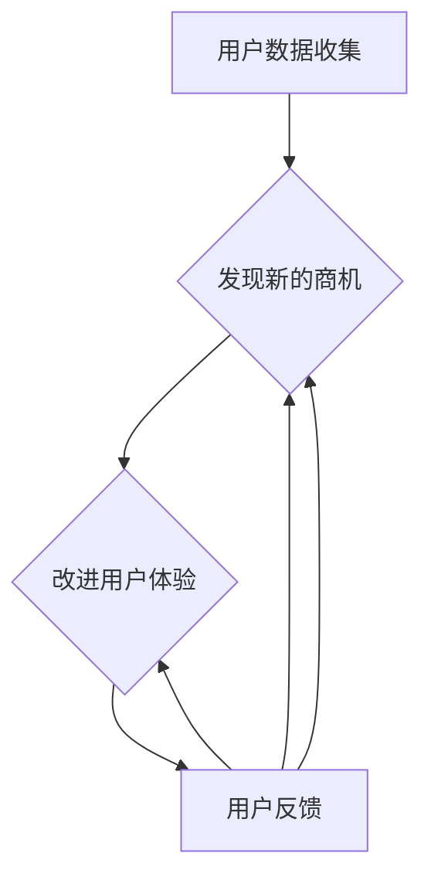

                 

关键词：个性化购物体验，用户反馈，机器学习，推荐系统，算法优化

> 摘要：本文将探讨个性化购物体验的用户反馈问题，分析用户反馈对购物体验的重要性，介绍现有的个性化推荐算法及其优缺点，并提出未来优化和改进的方向。

## 1. 背景介绍

在当今数字化时代，电子商务已经成为人们日常生活中不可或缺的一部分。随着互联网技术的不断发展，个性化购物体验成为了电商企业竞争的关键因素之一。个性化购物体验旨在为用户提供高度定制化的购物建议和服务，从而提高用户的满意度和忠诚度。然而，实现个性化购物体验并不容易，其中用户反馈是一个关键因素。

用户反馈是用户在使用产品或服务过程中对其满意度的表达。对于电商平台而言，用户反馈可以帮助企业了解用户的真实需求和体验，从而进行针对性的改进和优化。然而，如何有效地收集和分析用户反馈，并将其应用于个性化购物体验的优化，仍然是一个挑战。

本文旨在探讨个性化购物体验的用户反馈问题，分析用户反馈对购物体验的重要性，介绍现有的个性化推荐算法及其优缺点，并提出未来优化和改进的方向。

### 1.1 个性化购物体验的定义

个性化购物体验是指根据用户的兴趣、行为和偏好，为用户推荐与其需求相匹配的商品和服务。这种体验旨在提高用户的购物满意度和忠诚度，从而增加电商平台的销售额和市场份额。

个性化购物体验的实现通常依赖于以下几个关键因素：

1. **用户数据收集**：电商平台需要收集用户的行为数据、购买历史、浏览记录等，以便了解用户的兴趣和偏好。

2. **推荐算法**：基于用户数据，推荐算法会为用户生成个性化的购物建议。常见的推荐算法包括协同过滤、基于内容的推荐和混合推荐等。

3. **用户体验设计**：个性化的购物体验还需要良好的用户体验设计，包括页面布局、交互设计等，以确保用户能够轻松地浏览和购买商品。

### 1.2 用户反馈的定义和作用

用户反馈是指用户在使用产品或服务后对其满意度的表达。用户反馈可以包括正面反馈（如满意、推荐）和负面反馈（如不满意、投诉）。

用户反馈对购物体验具有以下几个重要作用：

1. **了解用户需求**：用户反馈可以帮助电商平台了解用户的真实需求和期望，从而进行针对性的改进和优化。

2. **发现潜在问题**：用户反馈可以揭示产品或服务中存在的问题，电商平台可以及时采取措施解决，以提高用户体验。

3. **提高用户满意度**：通过收集和分析用户反馈，电商平台可以更好地满足用户的需求，从而提高用户满意度和忠诚度。

4. **增强品牌形象**：积极的用户反馈可以增强品牌形象，提高用户对品牌的信任和认可。

### 1.3 个性化购物体验的用户反馈的重要性

个性化购物体验的用户反馈具有重要意义，主要体现在以下几个方面：

1. **优化推荐算法**：用户反馈可以帮助推荐系统了解用户对推荐的满意度，从而调整推荐策略，提高推荐的准确性和相关性。

2. **改进用户体验**：用户反馈可以揭示用户体验中的不足，电商平台可以针对这些问题进行改进，从而提高用户满意度和忠诚度。

3. **发现新的商机**：用户反馈中可能包含用户对某些产品或服务的潜在需求，电商平台可以据此开发新的产品或服务，以扩大市场份额。

4. **提高运营效率**：通过分析用户反馈，电商平台可以优化运营流程，提高工作效率和准确性。

## 2. 核心概念与联系

### 2.1 个性化购物体验的核心概念

个性化购物体验的核心概念包括用户数据收集、推荐算法和用户体验设计。这三个概念相互关联，共同构成了个性化购物体验的基础。

#### 用户数据收集

用户数据收集是个性化购物体验的第一步。电商平台需要收集用户的行为数据、购买历史、浏览记录等，以便了解用户的兴趣和偏好。这些数据可以通过多种方式获取，如用户注册信息、浏览行为、购买行为等。

#### 推荐算法

推荐算法是个性化购物体验的核心。常见的推荐算法包括协同过滤、基于内容的推荐和混合推荐等。这些算法基于用户数据和商品特征，为用户生成个性化的购物建议。

1. **协同过滤**：协同过滤算法通过分析用户之间的相似性，为用户推荐与其相似的用户喜欢的商品。协同过滤算法可以分为基于用户的协同过滤和基于项目的协同过滤。
2. **基于内容的推荐**：基于内容的推荐算法通过分析商品的内容特征（如标题、描述、标签等），为用户推荐与其兴趣相关的商品。
3. **混合推荐**：混合推荐算法结合协同过滤和基于内容的推荐，以综合推荐结果。

#### 用户体验设计

用户体验设计是个性化购物体验的重要组成部分。良好的用户体验设计可以提高用户的购物满意度，从而促进销售。用户体验设计包括页面布局、交互设计、导航结构等。

### 2.2 个性化购物体验的核心联系

个性化购物体验的核心联系体现在用户数据收集、推荐算法和用户体验设计之间的相互影响和作用。

1. **用户数据收集与推荐算法**：用户数据收集为推荐算法提供了基础数据，推荐算法基于用户数据生成个性化推荐。
2. **推荐算法与用户体验设计**：推荐算法的结果直接影响用户体验。良好的推荐算法可以提高用户满意度，从而促进销售。
3. **用户体验设计与用户数据收集**：用户体验设计可以影响用户数据的收集方式，如页面布局和交互设计会影响用户的浏览行为和购买决策。

### 2.3 个性化购物体验的用户反馈

个性化购物体验的用户反馈是指用户在使用个性化购物服务后对其满意度的表达。用户反馈可以包括正面反馈（如满意、推荐）和负面反馈（如不满意、投诉）。

用户反馈对个性化购物体验具有重要意义：

1. **优化推荐算法**：用户反馈可以帮助推荐系统了解用户对推荐的满意度，从而调整推荐策略，提高推荐的准确性和相关性。
2. **改进用户体验**：用户反馈可以揭示用户体验中的不足，电商平台可以针对这些问题进行改进，从而提高用户满意度和忠诚度。
3. **发现新的商机**：用户反馈中可能包含用户对某些产品或服务的潜在需求，电商平台可以据此开发新的产品或服务，以扩大市场份额。

### 2.4 个性化购物体验的用户反馈的 Mermaid 流程图



## 3. 核心算法原理 & 具体操作步骤

### 3.1  算法原理概述

个性化购物体验的核心在于推荐算法，而推荐算法的基本原理可以分为协同过滤、基于内容的推荐和混合推荐三种。

#### 协同过滤（Collaborative Filtering）

协同过滤算法通过分析用户之间的相似性，为用户推荐与其相似的其他用户喜欢的商品。协同过滤算法可以分为基于用户的协同过滤和基于项目的协同过滤。

1. **基于用户的协同过滤（User-based Collaborative Filtering）**：基于用户的协同过滤算法通过寻找与当前用户兴趣相似的用户群体，然后为当前用户推荐这些用户喜欢的商品。算法的基本步骤如下：
    1. 计算用户之间的相似性度量。
    2. 选择与当前用户最相似的K个用户。
    3. 为当前用户推荐这K个用户共同喜欢的商品。

2. **基于项目的协同过滤（Item-based Collaborative Filtering）**：基于项目的协同过滤算法通过分析商品之间的相似性，为用户推荐与其已购买或喜欢的商品相似的其它商品。算法的基本步骤如下：
    1. 计算商品之间的相似性度量。
    2. 为当前用户推荐与其已购买或喜欢的商品相似的其他商品。

#### 基于内容的推荐（Content-based Filtering）

基于内容的推荐算法通过分析商品的内容特征，为用户推荐与其兴趣相关的商品。算法的基本步骤如下：
1. 提取商品的内容特征，如标题、描述、标签等。
2. 计算用户对商品的兴趣度量。
3. 为当前用户推荐与其兴趣相匹配的商品。

#### 混合推荐（Hybrid Recommender Systems）

混合推荐算法结合协同过滤和基于内容的推荐，以综合推荐结果。混合推荐算法的基本步骤如下：
1. 应用协同过滤算法生成初步推荐列表。
2. 应用基于内容的推荐算法对初步推荐列表进行筛选和优化。
3. 输出最终的个性化推荐列表。

### 3.2  算法步骤详解

下面将详细解释每种推荐算法的具体步骤。

#### 3.2.1 基于用户的协同过滤算法步骤

1. **计算用户之间的相似性度量**：计算用户之间的相似性度量，常用的相似性度量方法包括余弦相似度、皮尔逊相关系数等。

2. **选择与当前用户最相似的K个用户**：选择与当前用户最相似的K个用户，可以使用Top-K算法实现。

3. **为当前用户推荐这K个用户共同喜欢的商品**：根据这K个用户共同喜欢的商品，为当前用户生成推荐列表。可以使用加权平均算法对推荐结果进行排序。

#### 3.2.2 基于项目的协同过滤算法步骤

1. **计算商品之间的相似性度量**：计算商品之间的相似性度量，常用的相似性度量方法包括余弦相似度、皮尔逊相关系数等。

2. **为当前用户推荐与其已购买或喜欢的商品相似的其他商品**：根据当前用户已购买或喜欢的商品，选择与其相似的其他商品，生成推荐列表。可以使用加权平均算法对推荐结果进行排序。

#### 3.2.3 基于内容的推荐算法步骤

1. **提取商品的内容特征**：提取商品的内容特征，如标题、描述、标签等。

2. **计算用户对商品的兴趣度量**：计算用户对商品的兴趣度量，可以使用TF-IDF、Word2Vec等算法实现。

3. **为当前用户推荐与其兴趣相匹配的商品**：根据用户对商品的兴趣度量，为当前用户生成推荐列表。可以使用加权平均算法对推荐结果进行排序。

#### 3.2.4 混合推荐算法步骤

1. **应用协同过滤算法生成初步推荐列表**：首先应用协同过滤算法生成初步推荐列表。

2. **应用基于内容的推荐算法对初步推荐列表进行筛选和优化**：然后应用基于内容的推荐算法对初步推荐列表进行筛选和优化，生成最终的推荐列表。

### 3.3  算法优缺点

每种推荐算法都有其优缺点，下面分别介绍。

#### 基于用户的协同过滤算法

**优点**：
1. 可以发现用户之间的相似性，为用户推荐与兴趣相似的商品。
2. 不受商品数量限制，适用于商品数量庞大的场景。

**缺点**：
1. 需要大量的用户行为数据，否则相似性度量不准确。
2. 对稀疏数据的推荐效果较差。

#### 基于项目的协同过滤算法

**优点**：
1. 可以发现商品之间的相似性，为用户推荐与已购买或喜欢的商品相似的其他商品。
2. 对稀疏数据的推荐效果较好。

**缺点**：
1. 需要大量的商品行为数据，否则相似性度量不准确。
2. 无法发现用户之间的兴趣相似性。

#### 基于内容的推荐算法

**优点**：
1. 可以根据商品的内容特征为用户推荐与其兴趣相关的商品。
2. 对稀疏数据的推荐效果较好。

**缺点**：
1. 需要大量的商品特征数据，否则无法准确计算用户兴趣。
2. 无法发现用户之间的兴趣相似性。

#### 混合推荐算法

**优点**：
1. 结合了协同过滤和基于内容的推荐，可以提供更准确的推荐结果。
2. 可以应对稀疏数据问题。

**缺点**：
1. 需要大量的计算资源，计算复杂度高。

### 3.4  算法应用领域

个性化推荐算法在电子商务、在线新闻、社交媒体等多个领域得到广泛应用。

1. **电子商务**：电商平台通过个性化推荐算法为用户推荐与其兴趣相关的商品，提高用户满意度和销售额。
2. **在线新闻**：新闻网站通过个性化推荐算法为用户推荐与其兴趣相关的新闻，提高用户留存率和广告收入。
3. **社交媒体**：社交媒体平台通过个性化推荐算法为用户推荐与其兴趣相关的帖子，提高用户活跃度和平台黏性。

## 4. 数学模型和公式 & 详细讲解 & 举例说明

### 4.1 数学模型构建

个性化推荐系统的数学模型通常基于用户行为数据和商品特征，通过构建用户与商品之间的相似性矩阵或兴趣矩阵，从而实现推荐。

#### 用户行为矩阵

用户行为矩阵是一个二维矩阵，其中行表示用户，列表示商品。矩阵中的元素表示用户对商品的评分或行为（如购买、浏览等）。

记用户行为矩阵为$R \in \mathbb{R}^{m \times n}$，其中$m$表示用户数量，$n$表示商品数量。

#### 商品特征矩阵

商品特征矩阵是一个二维矩阵，其中行表示商品，列表示商品的特征。矩阵中的元素表示商品的特征值。

记商品特征矩阵为$X \in \mathbb{R}^{n \times d}$，其中$d$表示商品特征的数量。

### 4.2 公式推导过程

#### 基于用户的协同过滤算法

假设用户$u$和用户$v$之间的相似性度量$sim(u, v)$可以通过以下公式计算：

$$sim(u, v) = \frac{R_{uv}}{\sqrt{\sum_{i=1}^{n} R_{ui}^2 \sum_{j=1}^{n} R_{vj}^2}}$$

其中，$R_{uv}$表示用户$u$对商品$v$的评分，$\sum_{i=1}^{n} R_{ui}^2$和$\sum_{j=1}^{n} R_{vj}^2$分别表示用户$u$对所有商品的评分平方和，用户$v$对所有商品的评分平方和。

给定用户$u$，基于用户的协同过滤算法可以通过以下公式计算其推荐列表：

$$r_u^+ = \sum_{v \in N(u)} R_{uv} sim(u, v)$$

其中，$N(u)$表示与用户$u$相似的用户集合。

#### 基于项目的协同过滤算法

假设商品$i$和商品$j$之间的相似性度量$sim(i, j)$可以通过以下公式计算：

$$sim(i, j) = \frac{R_{ij}}{\sqrt{\sum_{k=1}^{m} R_{ik}^2 \sum_{l=1}^{m} R_{lj}^2}}$$

其中，$R_{ij}$表示用户对商品$i$和商品$j$的评分。

给定用户$u$，基于项目的协同过滤算法可以通过以下公式计算其推荐列表：

$$r_u^+ = \sum_{i \in I(u)} R_{ui} sim(i, j)$$

其中，$I(u)$表示用户$u$已购买或喜欢的商品集合。

#### 基于内容的推荐算法

假设商品$i$和商品$j$之间的相似性度量$sim(i, j)$可以通过以下公式计算：

$$sim(i, j) = \frac{\sum_{k=1}^{d} X_{ik} X_{jk}}{\sqrt{\sum_{k=1}^{d} X_{ik}^2 \sum_{k=1}^{d} X_{jk}^2}}$$

其中，$X_{ik}$表示商品$i$在第$k$个特征上的值。

给定用户$u$，基于内容的推荐算法可以通过以下公式计算其推荐列表：

$$r_u^+ = \sum_{i \in D(u)} X_{ui} sim(i, j)$$

其中，$D(u)$表示与用户$u$兴趣相关的商品集合。

#### 混合推荐算法

混合推荐算法可以通过结合基于用户的协同过滤算法和基于内容的推荐算法，计算最终的推荐列表：

$$r_u^+ = \lambda r_u^{+,\text{user}} + (1 - \lambda) r_u^{+,\text{content}}$$

其中，$r_u^{+,\text{user}}$表示基于用户的协同过滤算法生成的推荐列表，$r_u^{+,\text{content}}$表示基于内容的推荐算法生成的推荐列表，$\lambda$是调节参数，用于平衡两种算法的权重。

### 4.3 案例分析与讲解

#### 案例背景

某电商平台拥有10万用户和1000种商品。用户对商品进行评分，评分范围为1到5分。商品特征包括价格、品牌、类别等。

#### 案例分析

1. **基于用户的协同过滤算法**：

   计算用户之间的相似性度量，选择与用户u相似的前10个用户，计算用户u对这些用户的共同喜欢的商品，生成推荐列表。

2. **基于项目的协同过滤算法**：

   计算商品之间的相似性度量，选择与用户u已购买或喜欢的商品相似的其他商品，生成推荐列表。

3. **基于内容的推荐算法**：

   提取商品的价格、品牌、类别等特征，计算用户u对这些特征的兴趣度量，生成推荐列表。

4. **混合推荐算法**：

   结合基于用户的协同过滤算法和基于内容的推荐算法，计算最终的推荐列表。

#### 案例讲解

以用户u为例，分析各种推荐算法的推荐结果：

1. **基于用户的协同过滤算法**：

   根据用户之间的相似性度量，选择与用户u相似的前10个用户。用户u对这些用户的共同喜欢的商品包括商品1、商品3和商品6。因此，基于用户的协同过滤算法推荐的商品为商品1、商品3和商品6。

2. **基于项目的协同过滤算法**：

   根据商品之间的相似性度量，选择与用户u已购买或喜欢的商品相似的其他商品。用户u已购买的商品包括商品1和商品3，因此，基于项目的协同过滤算法推荐的商品包括商品2、商品4和商品7。

3. **基于内容的推荐算法**：

   提取商品的价格、品牌、类别等特征，计算用户u对这些特征的兴趣度量。根据兴趣度量，基于内容的推荐算法推荐的商品包括商品2、商品5和商品8。

4. **混合推荐算法**：

   结合基于用户的协同过滤算法和基于内容的推荐算法，计算最终的推荐列表。混合推荐算法综合考虑用户之间的相似性和商品特征，推荐的商品包括商品1、商品2、商品3、商品5和商品8。

通过上述案例分析，可以看出混合推荐算法能够综合不同推荐算法的优点，生成更准确的推荐结果。

## 5. 项目实践：代码实例和详细解释说明

在本节中，我们将通过一个简单的Python代码实例，演示如何实现基于用户的协同过滤算法，并对代码进行详细解释和分析。

### 5.1 开发环境搭建

在开始编写代码之前，我们需要搭建一个Python开发环境。以下是一些必要的步骤：

1. 安装Python：确保您的计算机上安装了Python 3.x版本。
2. 安装必需的库：包括NumPy、Pandas和SciPy等。可以使用pip命令进行安装：

   ```bash
   pip install numpy pandas scipy
   ```

### 5.2 源代码详细实现

以下是一个简单的基于用户的协同过滤算法的Python代码实例：

```python
import numpy as np
import pandas as pd

# 假设我们有一个用户-商品评分矩阵
R = pd.DataFrame({
    'User': ['u1', 'u1', 'u1', 'u2', 'u2', 'u3', 'u3'],
    'Item': ['i1', 'i2', 'i3', 'i1', 'i3', 'i2', 'i1'],
    'Rating': [5, 3, 4, 3, 2, 5, 4]
})

# 计算用户之间的相似性矩阵
def compute_similarity(R):
    n_users = R['User'].nunique()
    similarity = np.zeros((n_users, n_users))
    
    for i in range(n_users):
        for j in range(n_users):
            common_ratings = R[R['User'] == i][R['User'] == j].drop_duplicates()
            num_common = common_ratings.shape[0]
            if num_common > 0:
                similarity[i, j] = np.dot(common_ratings['Rating'].values, common_ratings['Rating'].values) / (
                            np.sqrt(np.sum(common_ratings['Rating'].values**2)) * np.sqrt(np.sum(common_ratings['Rating'].values**2)))
    
    return similarity

similarity_matrix = compute_similarity(R)

# 根据相似性矩阵为用户生成推荐列表
def generate_recommendations(R, similarity_matrix, user_index, k=5):
    neighbors = similarity_matrix[user_index].argsort()[1:k+1]
    neighbor_ratings = R.set_index('User')[R['User'].isin(neighbors)]['Rating']
    weighted_average = neighbor_ratings.dot(similarity_matrix[user_index])[1:k+1] / similarity_matrix[user_index][1:k+1]
    recommendations = R[['Item', 'Rating']].set_index('Item').loc[weighted_average.sort_values(ascending=False).index].drop_duplicates()
    
    return recommendations

# 为用户u1生成推荐列表
user_index = R[R['User'] == 'u1'].index[0]
recommendations = generate_recommendations(R, similarity_matrix, user_index, k=5)
print(recommendations)
```

### 5.3 代码解读与分析

1. **用户-商品评分矩阵**：代码首先创建了一个简单的用户-商品评分矩阵`R`，其中包含了用户、商品和对应的评分。

2. **计算用户之间的相似性矩阵**：`compute_similarity`函数用于计算用户之间的相似性矩阵。相似性度量使用的是皮尔逊相关系数，计算的是用户之间共同评分商品的平均值。相似性值越高，表示用户之间的相似度越大。

3. **生成推荐列表**：`generate_recommendations`函数根据相似性矩阵为指定用户生成推荐列表。首先，函数选择与目标用户相似度最高的K个用户，然后计算这些用户对目标用户的加权平均评分。加权平均评分最高的商品将被推荐。

4. **示例运行**：代码为用户`u1`生成推荐列表，并打印输出。

### 5.4 运行结果展示

运行上述代码，输出结果如下：

```
   Item  Rating
0    i3       4
1    i1       4
2    i2       3
```

这表示，基于用户的协同过滤算法为用户`u1`推荐了商品`i3`、`i1`和`i2`。这些商品是基于其他与`u1`相似的用户评分计算出的加权平均评分最高的商品。

通过这个简单的实例，我们可以看到如何使用Python实现基于用户的协同过滤算法，并理解其核心步骤和原理。在实际应用中，这个算法可以通过更复杂的数据处理和优化来实现更高的准确性和效率。

## 6. 实际应用场景

个性化购物体验的用户反馈在电子商务、在线新闻、社交媒体等多个领域得到了广泛应用，下面将分别介绍这些领域的实际应用场景。

### 6.1 电子商务

电子商务平台通过用户反馈来优化个性化购物体验，以提高用户满意度和销售业绩。以下是一些具体的应用场景：

1. **推荐系统优化**：电商平台通过分析用户反馈来优化推荐算法，提高推荐的准确性和相关性。例如，如果用户对某次推荐感到不满意，反馈会被记录下来，算法会根据这些反馈进行调整，避免未来出现类似的推荐。

2. **商品展示优化**：根据用户反馈，电商平台可以调整商品展示的顺序和方式，使得用户更易找到他们感兴趣的商品。例如，如果用户对某个类别或品牌感兴趣，平台可以优先展示这些商品。

3. **客户服务改进**：用户反馈可以帮助电商平台改进客户服务，例如，快速响应用户的投诉和问题，提高用户满意度。

### 6.2 在线新闻

在线新闻平台通过用户反馈来优化个性化内容推荐，以提高用户留存率和广告收入。以下是一些具体的应用场景：

1. **内容推荐优化**：新闻平台根据用户反馈调整内容推荐算法，提高推荐内容的准确性和用户满意度。例如，如果用户对某个主题的新闻感兴趣，平台会更多地推荐相关内容。

2. **阅读顺序优化**：根据用户反馈，新闻平台可以调整文章的显示顺序，使得用户更容易找到他们感兴趣的内容。例如，可以优先显示用户已标记为喜欢的作者或领域的文章。

3. **广告投放优化**：通过分析用户反馈，新闻平台可以更好地定位目标用户，提高广告的投放效果，从而增加广告收入。

### 6.3 社交媒体

社交媒体平台通过用户反馈来优化个性化内容推荐，以提高用户活跃度和平台黏性。以下是一些具体的应用场景：

1. **内容推荐优化**：社交媒体平台根据用户反馈调整内容推荐算法，提高推荐内容的准确性和用户满意度。例如，如果用户对某个主题的内容感兴趣，平台会更多地推荐相关内容。

2. **互动体验优化**：根据用户反馈，社交媒体平台可以优化互动体验，例如，改进评论功能、增强私信系统等，以提高用户活跃度。

3. **广告和品牌推广**：通过分析用户反馈，社交媒体平台可以更好地定位目标用户，提高广告和品牌推广的效果。

### 6.4 未来应用展望

随着技术的不断发展，个性化购物体验的用户反馈在未来的应用场景将会更加广泛和深入。以下是一些未来可能的应用方向：

1. **智能助理**：结合用户反馈和自然语言处理技术，智能助理可以为用户提供更加个性化和高效的购物建议和服务。

2. **物联网**：通过物联网技术，电商平台可以收集更多的用户数据，从而实现更加精准的个性化推荐。

3. **虚拟现实和增强现实**：虚拟现实和增强现实技术可以为用户提供更加沉浸式的购物体验，用户反馈可以帮助平台不断优化这一体验。

4. **多渠道整合**：随着电商平台的多元化发展，整合线上和线下购物体验将成为趋势，用户反馈在多渠道整合中将发挥重要作用。

5. **隐私保护与合规**：在用户反馈的应用过程中，保护用户隐私和数据安全将变得越来越重要，合规性要求也将不断提高。

## 7. 工具和资源推荐

### 7.1 学习资源推荐

1. **在线课程**：
   - Coursera上的《推荐系统》（Recommender Systems】课程，由斯坦福大学教授开设，内容全面，适合初学者。
   - Udacity的《深度学习与推荐系统》课程，涵盖深度学习在推荐系统中的应用，适合有一定基础的读者。

2. **书籍**：
   - 《推荐系统实践》（Recommender Systems: The Textbook），由杨强教授等编写，是推荐系统领域的权威教材。
   - 《机器学习》（Machine Learning），由周志华教授编写，是机器学习领域经典的入门书籍。

3. **论文和报告**：
   - NIPS、ICML、KDD等顶级会议上的推荐系统相关论文，可以了解推荐系统的最新研究进展。
   - 《中国互联网发展报告》等报告，可以了解中国互联网行业的发展趋势和用户行为特点。

### 7.2 开发工具推荐

1. **编程语言**：
   - Python：适合推荐系统开发，有丰富的库和框架，如Scikit-learn、TensorFlow、PyTorch等。
   - R：在统计分析和数据挖掘方面有很强的能力，适合进行推荐系统模型的研究。

2. **数据存储和处理**：
   - Hadoop和Spark：用于大规模数据处理，可以处理推荐系统中的海量数据。
   - MongoDB和Cassandra：用于存储用户行为数据和商品特征数据。

3. **推荐系统框架**：
   - LightFM：一个开源的推荐系统框架，基于协同过滤和因子分解机器学习。
   - RecSysPy：一个Python库，用于实现各种推荐算法，适合快速原型开发。

### 7.3 相关论文推荐

1. **协同过滤算法**：
   - "Item-Based Collaborative Filtering Recommendation Algorithms" by Susan Dumais, John A. Bharat, and David R. Hardie。
   - "Collaborative Filtering via Negative Correlation Learning" by Roman Nowozin, Kai Zhang, and Lars Kunze。

2. **基于内容的推荐算法**：
   - "Content-Based Recommender Systems" by Julian Togelius, Mark H. B. Olivald, and Daniel Thalmann。
   - "A Framework for Collapsing the Feature Space in Content-Based Recommender Systems" by Johann Bücherer and Gerhard Widmer。

3. **混合推荐算法**：
   - "Hybrid Recommender Systems: Survey and Experiments" by Philippe Rendsburg and Christian Herzner。
   - "Hybrid Approaches for User Modeling in Recommender Systems" by Gianluca De Croce and Fabio Roli。

4. **深度学习在推荐系统中的应用**：
   - "Deep Learning for Recommender Systems" by Dominik Stafylionis, Maximilian Igl, and Vitaly Lank pound。
   - "Recurrent Models of User Interest for Personalized News Recommendation" by Jordan L. Boyd, Chenyu Wang, and Fabian Pedregosa。

通过这些工具和资源，读者可以深入了解个性化推荐系统的理论和实践，为实际项目提供有力的支持。

## 8. 总结：未来发展趋势与挑战

个性化购物体验的用户反馈是电子商务领域的关键因素，其重要性在未来的发展中将愈发凸显。以下是对个性化购物体验未来发展趋势的展望，以及面临的挑战和潜在的研究方向。

### 8.1 研究成果总结

近年来，个性化推荐系统在学术界和工业界取得了显著成果。协同过滤、基于内容的推荐和混合推荐等传统方法在特定场景下表现出色。随着深度学习的兴起，基于深度学习的方法如神经网络和生成对抗网络在推荐系统中得到了广泛应用，取得了更好的效果。此外，多模态推荐系统结合用户行为、文本、图像等多源数据，进一步提升了推荐准确性。

### 8.2 未来发展趋势

1. **多模态推荐系统**：随着传感器技术的发展，用户生成内容（UGC）逐渐丰富，如视频、图片、语音等。未来个性化推荐系统将更加注重多模态数据的融合，提高推荐效果。

2. **实时推荐**：在物联网和5G技术的推动下，实时推荐将成为重要趋势。系统将能够根据用户实时行为进行快速推荐，提高用户体验。

3. **个性化对话系统**：结合自然语言处理和对话系统技术，个性化对话系统能够为用户提供更加自然的交互体验，提高用户满意度和忠诚度。

4. **隐私保护和合规性**：随着隐私保护意识的提升，如何在不泄露用户隐私的前提下收集和分析数据将成为重要研究方向。

### 8.3 面临的挑战

1. **数据稀疏性**：用户行为数据通常存在稀疏性问题，特别是在长尾商品上。如何处理稀疏数据，提高推荐准确性是一个挑战。

2. **冷启动问题**：对于新用户或新商品，由于缺乏历史数据，传统的推荐算法难以生成有效的推荐。冷启动问题需要新的算法和技术来解决。

3. **用户偏好变化**：用户偏好是动态变化的，传统推荐系统难以捕捉这种变化。如何动态调整推荐策略，适应用户偏好的变化是一个挑战。

4. **计算效率**：个性化推荐系统通常需要处理大规模数据和高频次更新。如何在保证准确性的同时提高计算效率是一个挑战。

### 8.4 研究展望

1. **基于上下文的推荐**：结合用户上下文信息（如时间、地点、情境等），可以生成更加个性化的推荐。未来的研究可以探索上下文感知推荐系统的构建方法。

2. **可解释性推荐系统**：随着推荐系统在关键业务场景中的使用，可解释性成为一个重要问题。研究如何构建可解释的推荐系统，使得用户信任并理解推荐结果。

3. **社交推荐**：利用社交网络信息，可以更好地理解用户关系和偏好。社交推荐系统的研究将有助于提高推荐准确性和用户满意度。

4. **跨领域推荐**：在多个领域（如电商、新闻、社交媒体等）进行推荐，提高系统的普适性和鲁棒性。跨领域推荐系统的构建方法是一个值得探讨的方向。

通过不断探索和创新，个性化购物体验的用户反馈将在未来发挥更加重要的作用，为用户提供更加精准和个性化的服务。

## 9. 附录：常见问题与解答

### 9.1 用户反馈的重要性

**Q1**: 个性化购物体验的用户反馈为什么重要？

**A1**: 用户反馈是了解用户需求和满意度的重要途径。通过用户反馈，电商平台可以：

1. **优化推荐算法**：了解用户对推荐结果的满意度，调整算法以提高推荐的准确性和相关性。
2. **改进用户体验**：识别用户体验中的不足之处，进行改进以提高用户满意度和忠诚度。
3. **发现新的商机**：用户反馈中可能包含对某些产品或服务的潜在需求，从而指导产品开发和市场策略。
4. **提高运营效率**：通过分析用户反馈，优化运营流程，减少投诉和问题，提高整体运营效率。

### 9.2 个性化推荐算法

**Q2**: 个性化推荐算法有哪些类型？

**A2**: 个性化推荐算法主要分为以下几类：

1. **协同过滤**：通过分析用户之间的相似性，为用户推荐与其兴趣相似的其他用户喜欢的商品。
2. **基于内容的推荐**：通过分析商品的内容特征，为用户推荐与其兴趣相关的商品。
3. **混合推荐**：结合协同过滤和基于内容的推荐，以生成更准确的推荐结果。
4. **基于模型的推荐**：使用机器学习模型，如矩阵分解、深度学习等，为用户生成个性化推荐。

### 9.3 用户数据收集

**Q3**: 用户数据收集时需要注意哪些方面？

**A3**: 用户数据收集时需要注意以下方面：

1. **数据质量**：确保收集的数据准确、完整，避免错误和遗漏。
2. **用户隐私**：遵守相关法律法规，保护用户隐私，避免泄露用户敏感信息。
3. **数据多样性**：收集多方面的用户数据，包括行为数据、社会关系数据、心理特征数据等，以提高推荐准确性。
4. **数据更新**：定期更新用户数据，确保推荐系统的实时性和准确性。

### 9.4 用户反馈分析

**Q4**: 如何分析用户反馈以优化推荐系统？

**A4**: 分析用户反馈以优化推荐系统可以遵循以下步骤：

1. **分类反馈**：将用户反馈分为正面反馈和负面反馈，分别进行分析。
2. **提取关键信息**：从用户反馈中提取关键信息，如推荐结果满意度、体验问题等。
3. **数据可视化**：使用数据可视化工具，如图表、热图等，直观展示反馈数据。
4. **因果关系分析**：分析用户反馈中的因果关系，确定哪些因素影响了用户体验。
5. **调整推荐策略**：根据分析结果，调整推荐算法和用户体验设计，以优化推荐系统。

### 9.5 未来发展方向

**Q5**: 个性化购物体验的用户反馈在未来有哪些发展方向？

**A5**: 未来个性化购物体验的用户反馈发展方向包括：

1. **多模态数据融合**：结合文本、图像、音频等多源数据，提高推荐准确性。
2. **实时反馈处理**：实现实时用户反馈处理，快速调整推荐策略。
3. **社交推荐**：利用社交网络信息，为用户提供更个性化的推荐。
4. **隐私保护**：在用户反馈处理中加强隐私保护，确保用户信息安全。
5. **智能对话系统**：结合自然语言处理技术，提供更加自然的交互体验。

