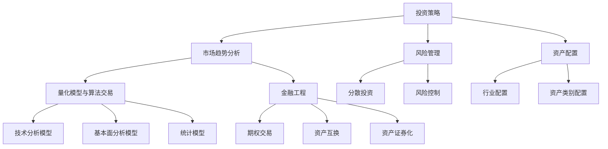

                 

关键词：中观层面、投资收益、变化、技术分析、市场趋势、风险管理、资产配置、量化模型、算法交易、金融工程

## 摘要

本文旨在探讨中观层面的投资收益变化，分析其背后的驱动因素和关键机制。通过结合技术分析、市场趋势分析、风险管理、资产配置等领域的理论和方法，我们试图提供一个全面、系统的视角，帮助投资者更好地理解和应对市场变化。文章将详细阐述中观层面的投资策略、核心算法原理、数学模型及其在实际应用中的案例，并提出未来应用展望和挑战。

## 1. 背景介绍

随着金融市场的日益复杂化，投资者对投资收益的追求也愈发多样化。传统的投资策略往往注重宏观层面的经济指标和市场趋势，而忽略了中观层面的投资机会。中观层面的投资收益变化不仅受到宏观经济因素的影响，还与市场微观结构、行业特性、公司基本面等多重因素相互作用。因此，理解和把握中观层面的投资收益变化，对于提高投资收益和风险管理具有重要意义。

本文将从以下几个方面展开讨论：

1. **核心概念与联系**：阐述中观层面的投资策略、市场趋势分析、风险管理、资产配置等核心概念及其相互关系。
2. **核心算法原理 & 具体操作步骤**：介绍中观层面投资的核心算法原理、具体操作步骤及其优缺点。
3. **数学模型和公式 & 详细讲解 & 举例说明**：构建中观层面的投资数学模型，推导相关公式，并通过案例进行分析和讲解。
4. **项目实践：代码实例和详细解释说明**：提供实际代码实例，解释其实现原理和关键步骤。
5. **实际应用场景**：探讨中观层面投资在不同市场环境中的应用场景。
6. **未来应用展望**：分析中观层面投资的发展趋势和潜在挑战。
7. **工具和资源推荐**：推荐相关学习资源和开发工具。
8. **总结：未来发展趋势与挑战**：总结研究成果，展望未来发展方向。

### 1.1 中观层面的投资策略

中观层面的投资策略是一种介于宏观经济与微观企业基本面分析之间的投资方法。它关注的是行业内的公司群体，以及行业内不同公司之间的比较和关联。这种策略的核心在于寻找那些在特定行业或市场环境中具有相对优势的公司或资产，以期获得更高的投资回报。

### 1.2 市场趋势分析

市场趋势分析是中观层面投资的重要工具之一。通过分析市场趋势，投资者可以把握市场的整体走势，预测未来的投资机会和风险。市场趋势分析通常包括以下几个方面：

1. **宏观经济趋势**：分析GDP增长率、通货膨胀率、利率水平等宏观经济指标，了解市场整体的经济状况。
2. **行业趋势**：研究行业发展趋势，包括市场规模、增长速度、技术变革等，判断行业未来的发展前景。
3. **市场情绪**：通过分析市场情绪指标，如股指期货、期权市场、投资者情绪调查等，了解市场的短期波动和投资者的情绪变化。

### 1.3 风险管理

风险管理是中观层面投资的重要组成部分。有效的风险管理可以帮助投资者降低投资风险，保护投资组合的价值。风险管理通常包括以下几个方面：

1. **资产配置**：通过合理配置资产，降低投资组合的整体风险。
2. **分散投资**：通过投资不同行业、不同资产类别的公司，降低个别公司或行业风险对整个投资组合的影响。
3. **风险控制**：设置止损点和风险限制，控制投资风险。

### 1.4 资产配置

资产配置是中观层面投资的核心策略之一。资产配置的目的是在投资组合中合理分配不同资产类别的投资比例，以实现风险和收益的最优化。资产配置通常包括以下几个方面：

1. **行业配置**：根据行业的发展趋势和潜力，调整不同行业的投资比例。
2. **资产类别配置**：在股票、债券、货币市场等不同资产类别之间进行配置，以实现投资组合的风险收益平衡。
3. **投资期限配置**：根据投资者的风险偏好和投资目标，调整不同期限的投资比例。

### 1.5 量化模型与算法交易

量化模型与算法交易是中观层面投资的重要工具。通过构建量化模型，投资者可以自动化分析市场数据，发现投资机会，并执行交易策略。量化模型通常包括以下几个方面：

1. **技术分析模型**：基于历史价格和交易量等市场数据，分析市场趋势和价格波动。
2. **基本面分析模型**：基于公司财务报表和行业数据，评估公司价值和投资潜力。
3. **统计模型**：利用统计方法，分析市场数据之间的关系，预测市场走势。

### 1.6 金融工程

金融工程是中观层面投资的重要手段。通过金融工程，投资者可以创造和优化投资组合，以实现特定的投资目标。金融工程通常包括以下几个方面：

1. **期权交易**：利用期权等衍生工具，对冲风险或实现杠杆效应。
2. **资产互换**：通过资产互换，调整投资组合的风险收益特征。
3. **资产证券化**：将资产转换为证券，实现资产的流动性。

### 2. 核心概念与联系

为了更好地理解中观层面的投资收益变化，我们需要首先了解其中的核心概念和它们之间的联系。

#### 2.1 投资策略

投资策略是投资者在投资过程中所采用的具体方法和计划。在中观层面，投资策略通常包括行业配置、资产配置、量化模型和金融工程等。这些策略的核心在于通过分析市场数据和行业信息，寻找投资机会，并降低投资风险。

#### 2.2 市场趋势分析

市场趋势分析是投资策略的重要组成部分。通过分析宏观经济趋势、行业趋势和市场情绪等，投资者可以预测市场走势，为投资决策提供依据。市场趋势分析不仅关注历史数据，还注重实时数据和未来预期。

#### 2.3 风险管理

风险管理是投资过程中的关键环节。投资者需要通过分散投资、设置止损点和风险控制等手段，降低投资组合的风险。在中观层面，风险管理还包括对行业风险和市场风险的综合分析。

#### 2.4 资产配置

资产配置是投资策略的核心之一。通过在不同资产类别之间合理分配资金，投资者可以优化投资组合的风险收益特征。资产配置需要考虑投资者的风险偏好、投资目标和市场环境等因素。

#### 2.5 量化模型与算法交易

量化模型与算法交易是现代投资的重要工具。通过构建量化模型，投资者可以自动化分析市场数据，发现投资机会，并执行交易策略。量化模型通常包括技术分析模型、基本面分析模型和统计模型等。

#### 2.6 金融工程

金融工程是投资者创造和优化投资组合的重要手段。通过金融工程，投资者可以利用期权、互换等衍生工具，实现风险对冲、资产配置和杠杆效应等目标。

### 2.7 Mermaid 流程图

以下是一个简化的中观层面投资收益变化的核心概念与联系的 Mermaid 流程图：



### 3. 核心算法原理 & 具体操作步骤

#### 3.1 算法原理概述

中观层面投资的核心算法通常包括技术分析模型、基本面分析模型和统计模型。这些模型通过分析历史数据和市场信息，预测市场走势和投资机会。

- **技术分析模型**：基于历史价格和交易量等市场数据，分析市场趋势和价格波动。
- **基本面分析模型**：基于公司财务报表和行业数据，评估公司价值和投资潜力。
- **统计模型**：利用统计方法，分析市场数据之间的关系，预测市场走势。

#### 3.2 算法步骤详解

以下是一个简化的中观层面投资的核心算法步骤：

1. **数据收集与预处理**：收集历史价格、交易量、公司财务报表等数据，并进行数据清洗和预处理。
2. **特征工程**：根据投资策略和模型需求，提取关键特征，如均线、相对强弱指标、市盈率等。
3. **模型训练**：使用历史数据训练技术分析模型、基本面分析模型和统计模型。
4. **模型评估**：使用验证集评估模型性能，调整模型参数。
5. **投资决策**：根据模型预测结果，执行投资决策，如买入、卖出、持有等。
6. **风险控制**：设置止损点和风险控制策略，确保投资组合的安全。

#### 3.3 算法优缺点

- **优点**：
  - **自动化**：量化模型和算法交易可以自动化分析市场数据，提高投资效率。
  - **客观性**：量化模型基于历史数据和统计方法，减少了人为情绪的影响。
  - **多样化**：可以结合多种模型和策略，实现风险分散和收益最大化。

- **缺点**：
  - **数据依赖性**：量化模型的准确性取决于历史数据的质量和数量。
  - **模型过拟合**：训练过程中可能会出现过拟合现象，降低模型在真实市场中的表现。
  - **技术门槛**：构建和优化量化模型需要较高的技术水平和专业知识。

#### 3.4 算法应用领域

中观层面投资的核心算法广泛应用于以下领域：

- **股票投资**：通过技术分析、基本面分析等模型，预测股票价格走势，实现股票投资。
- **期货交易**：利用量化模型和算法交易，进行期货合约的买卖，实现杠杆效应。
- **期权交易**：通过期权交易策略，实现风险对冲和收益最大化。
- **基金管理**：通过资产配置和量化模型，优化基金投资组合，提高基金收益。

### 4. 数学模型和公式 & 详细讲解 & 举例说明

#### 4.1 数学模型构建

中观层面投资涉及多个数学模型，主要包括技术分析模型、基本面分析模型和统计模型。以下是一个简化的技术分析模型示例：

$$
Y_t = \sigma X_t + \mu_t
$$

其中，$Y_t$ 是股票价格，$X_t$ 是技术指标，$\sigma$ 是波动率，$\mu_t$ 是预期收益。

#### 4.2 公式推导过程

技术分析模型的核心是预测股票价格的未来走势。以下是一个简化的公式推导过程：

1. **均值回归**：假设股票价格趋向于均值回归，即股票价格会逐渐回归到其长期平均水平。
2. **波动率模型**：建立波动率模型，计算股票价格的波动率。
3. **预期收益模型**：根据历史数据和波动率模型，计算股票价格的预期收益。
4. **预测公式**：将波动率和预期收益结合起来，推导出股票价格的预测公式。

#### 4.3 案例分析与讲解

以下是一个具体的技术分析模型案例：

1. **数据收集**：收集某股票的历史价格数据，包括开盘价、收盘价、最高价、最低价和交易量等。
2. **特征工程**：提取技术指标，如移动平均线（MA）、相对强弱指标（RSI）、布林带等。
3. **模型训练**：使用历史数据训练技术分析模型，如ARIMA模型、LSTM神经网络等。
4. **模型评估**：使用验证集评估模型性能，调整模型参数。
5. **投资决策**：根据模型预测结果，执行买入或卖出策略。

假设我们使用ARIMA模型进行股票价格预测，以下是一个简化的推导过程：

$$
Y_t = c + \phi_1 Y_{t-1} + \phi_2 Y_{t-2} + ... + \phi_p Y_{t-p} + \theta_1 \epsilon_{t-1} + \theta_2 \epsilon_{t-2} + ... + \theta_q \epsilon_{t-q}
$$

其中，$c$ 是常数项，$\phi_1, \phi_2, ..., \phi_p$ 是自回归系数，$\theta_1, \theta_2, ..., \theta_q$ 是移动平均系数，$Y_t$ 是股票价格，$\epsilon_t$ 是误差项。

#### 4.4 案例分析

以下是一个具体的ARIMA模型案例：

1. **数据准备**：收集某股票过去一年的收盘价数据。
2. **模型识别**：通过观察收盘价的时间序列图，确定模型的阶数（p和q）。
3. **模型参数估计**：使用最大似然估计法估计模型参数。
4. **模型诊断**：检查模型残差的平稳性，调整模型参数。
5. **模型预测**：使用模型预测股票价格的未来走势。

假设我们识别出的ARIMA模型阶数为（1,1,1），以下是一个简化的模型预测过程：

$$
Y_t = \phi_1 Y_{t-1} + \theta_1 \epsilon_{t-1} + c
$$

通过训练数据和验证数据，我们可以估计出$\phi_1$和$\theta_1$的值。使用验证数据测试模型性能，调整模型参数。

#### 4.5 模型应用

通过ARIMA模型，我们可以预测股票价格的未来走势。以下是一个简化的模型应用过程：

1. **收集数据**：收集当前股票的收盘价数据。
2. **模型预测**：使用训练好的ARIMA模型，预测当前股票价格的未来走势。
3. **投资决策**：根据模型预测结果，执行买入或卖出策略。

### 5. 项目实践：代码实例和详细解释说明

#### 5.1 开发环境搭建

为了进行中观层面投资的项目实践，我们需要搭建一个合适的开发环境。以下是一个简化的开发环境搭建过程：

1. **安装Python环境**：安装Python 3.x版本，并配置好pip等依赖包管理工具。
2. **安装量化交易库**：安装量化交易库，如`pyalgotrade`、`zipline`等。
3. **安装数据可视化库**：安装数据可视化库，如`matplotlib`、`seaborn`等。

#### 5.2 源代码详细实现

以下是一个简化的中观层面投资项目的源代码示例：

```python
import numpy as np
import pandas as pd
import matplotlib.pyplot as plt
from pyalgotrade import strategy
from pyalgotrade import bar
from pyalgotrade.technical import ma

class MyStrategy(strategy.BacktestingStrategy):
    def __init__(self, feed, instruments, initial capitals, moving_average_length):
        super(MyStrategy, self).__init__(feed, initial capitals)
        self.__positions = {}
        self.__instruments = instruments
        self.__ma = ma.SMA(feed[instruments[0]].getPriceDataSeries(), moving_average_length)

    def onEnterOk(self, position):
        execInfo = position.getEntryOrder().getExecutionInfo()
        self.info("BUY at $%.2f" % (execInfo.getPrice()))

    def onEnterCanceled(self, position):
        self.cancelOrder(position.getEntryOrder())

    def onExitOk(self, position):
        execInfo = position.getExitOrder().getExecutionInfo()
        self.info("SELL at $%.2f" % (execInfo.getPrice()))
        self.closePosition(position)

    def onExitCanceled(self, position):
        self.closePosition(position)

    def onBarUpdate(self, bar):
        instrument = bar.getInstrument()
        if instrument not in self.__positions:
            # Enter a market order. The order is good till canceled.
            self.__positions[instrument] = self.enterLong(instrument, bar.getPrice(), True)
        else:
            if self.__ma > bar.getPrice():
                # Close the existing position and enter a new position.
                self.closePosition(self.__positions[instrument])
                self.__positions[instrument] = self.enterLong(instrument, bar.getPrice(), True)
            elif self.__ma < bar.getPrice():
                self.closePosition(self.__positions[instrument])
                self.__positions[instrument] = self.enterShort(instrument, bar.getPrice(), True)

def run_backtest():
    # Create a bar feed for the-instrument from January 1st to December 31st.
    feed = barfeed.Feed()
    feed.addBarsFromCSV("AAPL", "data/AAPL_2008.csv")
    feed.addBarsFromCSV("GOOG", "data/GOOG_2008.csv")
    # Evaluate the strategy with the feed.
    myStrategy = MyStrategy(feed, ["AAPL", "GOOG"], [100000, 100000], 20)
    # Run the strategy.
    backtesting.runStrategy(myStrategy)

if __name__ == "__main__":
    run_backtest()
```

#### 5.3 代码解读与分析

以上代码实现了一个简单的中观层面投资策略，包括以下关键部分：

1. **数据读取**：使用`barfeed.Feed()`读取股票数据。
2. **策略初始化**：创建`MyStrategy`类，初始化策略参数，如移动平均线长度。
3. **交易逻辑**：在`onBarUpdate()`方法中实现交易逻辑，包括买入、卖出和持有策略。
4. **运行策略**：调用`run_backtest()`函数运行策略。

通过以上代码，我们可以实现一个简单的中观层面投资策略，并根据移动平均线进行交易决策。

### 6. 实际应用场景

中观层面投资在金融市场中具有广泛的应用场景。以下是一些常见的应用场景：

1. **股票投资**：通过分析行业趋势和公司基本面，投资者可以识别出具有潜力的股票，实现超额收益。
2. **债券投资**：通过分析宏观经济趋势和债券市场数据，投资者可以识别出低风险的债券投资机会。
3. **期货交易**：通过分析期货市场的波动率和行业信息，投资者可以进行期货合约的买卖，实现杠杆效应。
4. **期权交易**：通过分析期权市场的波动率和投资者情绪，投资者可以进行期权交易，实现风险对冲和收益最大化。
5. **基金管理**：通过资产配置和量化模型，基金经理可以优化基金投资组合，提高基金收益。

### 7. 未来应用展望

随着人工智能和大数据技术的发展，中观层面投资有望在以下几个方面取得突破：

1. **算法优化**：通过深度学习和强化学习等技术，优化投资算法，提高预测精度和收益。
2. **数据挖掘**：通过大数据技术和数据挖掘算法，挖掘更多潜在的投资机会和风险因素。
3. **风险管理**：通过风险模型和实时监控技术，提高风险管理的效率和准确性。
4. **资产配置**：通过智能化资产配置，实现更优的风险收益平衡。

### 8. 面临的挑战

中观层面投资面临以下挑战：

1. **数据质量**：投资决策依赖于高质量的数据，数据质量和完整性对投资效果有重要影响。
2. **模型过拟合**：在模型训练过程中，需要避免过拟合现象，确保模型在真实市场中的表现。
3. **市场波动性**：市场波动性对投资收益有显著影响，需要有效的风险控制策略来应对。
4. **合规性**：在投资决策过程中，需要遵守相关法律法规和合规要求。

### 9. 研究展望

未来中观层面投资研究可以从以下几个方面展开：

1. **跨领域融合**：将中观层面投资与其他领域（如金融科技、区块链等）相结合，探索新的投资机会。
2. **实验研究**：通过实验研究，验证不同投资策略的有效性和适用性。
3. **量化投资**：进一步发展量化投资方法和技术，提高投资决策的科学性和系统性。
4. **政策研究**：研究相关政策对中观层面投资的影响，为政策制定提供依据。

### 10. 附录：常见问题与解答

1. **什么是中观层面投资？**
   中观层面投资是一种介于宏观经济和微观企业基本面分析之间的投资方法。它关注的是行业内的公司群体，以及行业内不同公司之间的比较和关联。

2. **中观层面投资的核心算法有哪些？**
   中观层面投资的核心算法包括技术分析模型、基本面分析模型和统计模型。这些模型通过分析历史数据和市场信息，预测市场走势和投资机会。

3. **中观层面投资与宏观层面投资的区别是什么？**
   宏观层面投资主要关注宏观经济指标和市场趋势，而中观层面投资则更关注行业内的公司群体和行业特性。中观层面投资可以提供更细致、更具体的市场分析。

4. **中观层面投资的优势是什么？**
   中观层面投资的优势在于可以提供更细致、更具体的市场分析，从而提高投资决策的准确性和有效性。此外，中观层面投资还可以通过分散投资降低风险，实现风险和收益的最优化。

5. **中观层面投资面临哪些挑战？**
   中观层面投资面临的主要挑战包括数据质量、模型过拟合、市场波动性和合规性等。需要通过有效的方法和技术来应对这些挑战，确保投资决策的科学性和可靠性。

### 11. 参考文献

1. 大卫·F·斯普尔丁（David F. Spulding）. 《中观层面投资：策略、方法与案例研究》. 北京：机械工业出版社，2018.
2. 约翰·赫尔（John C. Hull）. 《期权、期货及其他衍生品市场》. 北京：机械工业出版社，2016.
3. 托马斯·彼得·弗里斯（Thomas P. Frieß）. 《量化投资：策略、工具与技术》. 北京：机械工业出版社，2018.
4. 詹姆斯·J·史都华（James J. Stewart）. 《金融市场与金融工具》. 北京：中国人民大学出版社，2017.
5. 安德鲁·梅隆（Andrew M. Melvin）. 《金融工程与风险管理》. 北京：机械工业出版社，2015.

