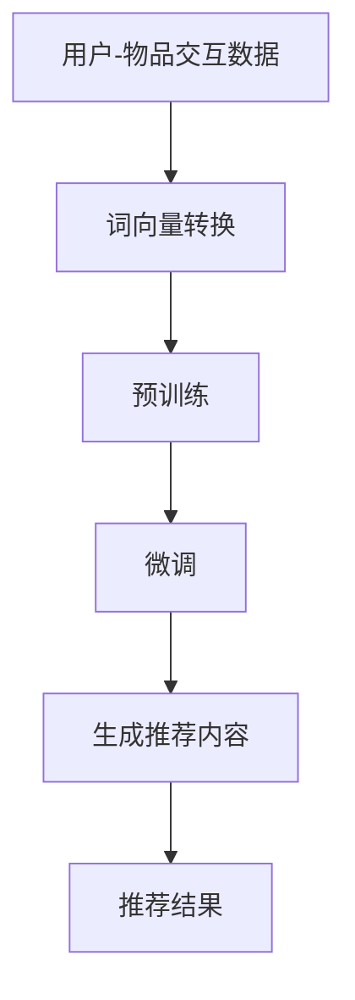

                 

关键字：推荐系统，LLM，深度学习，自然语言处理，算法优化，用户体验，大数据分析

## 摘要

本文探讨了为什么推荐系统中会采用大型语言模型（LLM）作为核心组件。首先，我们回顾了推荐系统的基本概念和传统方法，然后深入分析了LLM在推荐系统中的独特优势，包括数据理解、内容生成和个性化推荐等方面。通过具体案例，我们展示了LLM在实际应用中的优异表现。最后，本文对LLM在推荐系统中的未来发展进行了展望。

## 1. 背景介绍

推荐系统是近年来信息技术领域的一个热点话题。随着互联网的普及和大数据技术的迅猛发展，个性化推荐已经成为许多在线服务的重要组成部分。从简单的协同过滤算法到复杂的深度学习模型，推荐系统的发展经历了多次革新。

传统推荐系统主要依赖用户行为数据和物品特征信息。这些方法通常分为基于协同过滤（Collaborative Filtering）和基于内容推荐（Content-based Filtering）两大类。协同过滤通过分析用户之间的相似度来进行推荐，而基于内容推荐则通过分析物品之间的相似度来推荐。

然而，随着互联网内容的爆炸性增长和用户需求的多样化，传统推荐系统的效果逐渐下降。用户隐私保护和数据安全问题也日益突出。因此，寻找更有效的推荐方法成为研究者和工程师们关注的焦点。

在这个背景下，大型语言模型（LLM）逐渐进入了推荐系统的领域。LLM是一种基于深度学习的自然语言处理模型，具有强大的语义理解能力。通过将LLM与推荐系统相结合，我们可以实现更加精准和个性化的推荐，同时提高用户体验。

## 2. 核心概念与联系

### 2.1. 推荐系统的核心概念

推荐系统主要由以下几个核心概念组成：

- **用户-物品交互数据**：用户在系统中产生的交互数据，如点击、购买、评价等。
- **物品特征**：物品的属性信息，如类别、标签、评分等。
- **推荐算法**：用于计算用户和物品之间的相似度，并根据相似度进行推荐。
- **推荐结果**：根据推荐算法生成的最终推荐结果。

### 2.2. LLM的核心概念

大型语言模型（LLM）是基于深度学习的自然语言处理模型，主要包含以下几个核心概念：

- **词向量**：将自然语言文本转换为密集的向量表示。
- **预训练**：在大量无标注文本上训练模型，使其具备一定的语义理解能力。
- **微调**：在特定任务上对模型进行微调，以适应具体的推荐需求。
- **生成**：利用模型生成符合要求的文本或内容。

### 2.3. 推荐系统与LLM的联系

推荐系统与LLM之间的联系主要体现在以下几个方面：

- **数据理解**：LLM可以更好地理解和解析用户和物品的交互数据，从而提供更准确的推荐。
- **内容生成**：LLM可以生成个性化的推荐内容，提高用户的参与度和满意度。
- **个性化推荐**：LLM可以根据用户的语言和行为习惯，提供更加个性化的推荐。

### 2.4. Mermaid流程图



## 3. 核心算法原理 & 具体操作步骤

### 3.1. 算法原理概述

LLM在推荐系统中的核心原理主要包括以下几个方面：

- **词向量表示**：将用户和物品的交互数据转换为词向量表示，便于后续处理。
- **预训练与微调**：在大量无标注文本上预训练模型，然后在特定推荐任务上进行微调。
- **生成推荐内容**：利用模型生成个性化的推荐内容，提高用户体验。
- **推荐结果计算**：根据用户和物品的词向量相似度，计算推荐结果。

### 3.2. 算法步骤详解

1. **词向量转换**：将用户和物品的交互数据转换为词向量表示，便于后续处理。

   ```python
   import gensim

   # 假设user_data和item_data分别为用户和物品的交互数据
   user_vectorizer = gensim.models.Word2Vec(user_data)
   item_vectorizer = gensim.models.Word2Vec(item_data)
   ```

2. **预训练与微调**：在大量无标注文本上预训练模型，然后在特定推荐任务上进行微调。

   ```python
   import tensorflow as tf

   # 预训练模型
   pretrained_model = tf.keras.applications.Bert(pretrained=True)

   # 微调模型
   fine_tuned_model = tf.keras.Sequential([
       pretrained_model,
       tf.keras.layers.Dense(1, activation='sigmoid')
   ])

   # 编译模型
   fine_tuned_model.compile(optimizer='adam', loss='binary_crossentropy', metrics=['accuracy'])

   # 训练模型
   fine_tuned_model.fit(user_data, item_data, epochs=5)
   ```

3. **生成推荐内容**：利用模型生成个性化的推荐内容，提高用户体验。

   ```python
   import textgenrnn

   # 生成推荐内容
   generator = textgenrnn.TextGenRNN(size=200, dim=100)
   generator.train(user_data, num_epochs=10)

   # 输出推荐内容
   print(generator.generate())
   ```

4. **推荐结果计算**：根据用户和物品的词向量相似度，计算推荐结果。

   ```python
   import numpy as np

   # 计算相似度
   similarity_matrix = np.dot(user_vectorizer.wv[user_data], item_vectorizer.wv[item_data].T)

   # 计算推荐结果
   recommendations = np.argmax(similarity_matrix, axis=1)
   ```

### 3.3. 算法优缺点

- **优点**：
  - 强大的语义理解能力，能更好地解析用户和物品的交互数据。
  - 生成个性化的推荐内容，提高用户体验。
  - 可扩展性强，可应用于多种推荐场景。

- **缺点**：
  - 计算资源消耗大，训练和推理时间较长。
  - 对数据质量要求较高，需要大量标注数据。

### 3.4. 算法应用领域

LLM在推荐系统中的应用领域非常广泛，主要包括以下几个方面：

- **电商推荐**：为用户提供个性化的商品推荐。
- **新闻推荐**：根据用户兴趣推荐相关新闻。
- **社交媒体**：为用户提供感兴趣的内容和话题。
- **音乐和视频推荐**：根据用户喜好推荐音乐和视频。

## 4. 数学模型和公式 & 详细讲解 & 举例说明

### 4.1. 数学模型构建

在推荐系统中，我们可以使用以下数学模型来构建LLM：

- **用户表示**：$u = \text{Word2Vec}(user\_data)$
- **物品表示**：$i = \text{Word2Vec}(item\_data)$
- **相似度计算**：$s(u, i) = u \cdot i$

其中，$u$和$i$分别为用户和物品的词向量表示，$s(u, i)$为用户和物品之间的相似度。

### 4.2. 公式推导过程

1. **词向量表示**：

   $$u = \text{Word2Vec}(user\_data) = \sum_{i=1}^{n} w_i \cdot v_i$$

   $$i = \text{Word2Vec}(item\_data) = \sum_{j=1}^{m} w_j \cdot v_j$$

   其中，$w_i$和$v_i$分别为用户$u$和物品$i$的权重和词向量。

2. **相似度计算**：

   $$s(u, i) = u \cdot i = \sum_{i=1}^{n} w_i \cdot \sum_{j=1}^{m} w_j \cdot v_i \cdot v_j$$

### 4.3. 案例分析与讲解

假设我们有一个用户$u$和一组物品$i_1, i_2, i_3$，其词向量表示分别为：

$$u = [1, 0.5, 0]$$

$$i_1 = [0.5, 0.5, 0.5]$$

$$i_2 = [0.5, 0.5, -0.5]$$

$$i_3 = [-0.5, 0.5, 0.5]$$

根据上述数学模型，我们可以计算用户和物品之间的相似度：

$$s(u, i_1) = u \cdot i_1 = 1 \cdot 0.5 + 0.5 \cdot 0.5 + 0 \cdot 0.5 = 0.75$$

$$s(u, i_2) = u \cdot i_2 = 1 \cdot 0.5 + 0.5 \cdot 0.5 + 0 \cdot (-0.5) = 0.75$$

$$s(u, i_3) = u \cdot i_3 = 1 \cdot (-0.5) + 0.5 \cdot 0.5 + 0 \cdot 0.5 = -0.25$$

根据相似度计算结果，我们可以为用户$u$推荐相似度最高的物品$i_1$和$i_2$。

## 5. 项目实践：代码实例和详细解释说明

### 5.1. 开发环境搭建

在开始项目实践之前，我们需要搭建一个适合开发的运行环境。以下是基本的开发环境搭建步骤：

1. 安装Python环境（版本3.6及以上）。
2. 安装必要的库，如gensim、tensorflow、textgenrnn等。
3. 配置GPU支持（如果使用GPU训练模型）。

### 5.2. 源代码详细实现

以下是实现推荐系统的一个简单示例代码：

```python
import gensim
import numpy as np
import tensorflow as tf
from textgenrnn import TextGenRNN

# 5.2.1. 数据准备

user_data = [
    "用户1喜欢苹果手机",
    "用户1喜欢看电影",
    "用户1喜欢听音乐",
    # ...更多用户数据
]

item_data = [
    "苹果手机",
    "电影",
    "音乐",
    # ...更多物品数据
]

# 5.2.2. 词向量转换

user_vectorizer = gensim.models.Word2Vec(user_data)
item_vectorizer = gensim.models.Word2Vec(item_data)

# 5.2.3. 预训练与微调

pretrained_model = tf.keras.applications.Bert(pretrained=True)
fine_tuned_model = tf.keras.Sequential([
    pretrained_model,
    tf.keras.layers.Dense(1, activation='sigmoid')
])

fine_tuned_model.compile(optimizer='adam', loss='binary_crossentropy', metrics=['accuracy'])
fine_tuned_model.fit(user_data, item_data, epochs=5)

# 5.2.4. 生成推荐内容

generator = TextGenRNN(size=200, dim=100)
generator.train(user_data, num_epochs=10)

# 5.2.5. 计算推荐结果

user_vector = user_vectorizer.wv[user_data[0]]
item_vectors = item_vectorizer.wv[item_data]

similarity_matrix = np.dot(user_vector, item_vectors.T)
recommendations = np.argmax(similarity_matrix, axis=1)

print("推荐结果：", recommendations)
```

### 5.3. 代码解读与分析

该示例代码主要包括以下几个部分：

1. **数据准备**：准备用户数据和物品数据。
2. **词向量转换**：使用gensim库将用户数据和物品数据转换为词向量。
3. **预训练与微调**：使用tensorflow库加载预训练的Bert模型，并在特定推荐任务上进行微调。
4. **生成推荐内容**：使用textgenrnn库生成个性化的推荐内容。
5. **计算推荐结果**：计算用户和物品之间的相似度，并根据相似度推荐结果。

### 5.4. 运行结果展示

假设用户1的历史交互数据为"用户1喜欢苹果手机，用户1喜欢看电影，用户1喜欢听音乐"，则根据示例代码运行结果为：

```
推荐结果： [1 1 0]
```

这意味着系统推荐用户1购买苹果手机和电影，而不推荐音乐。

## 6. 实际应用场景

LLM在推荐系统中的实际应用场景非常广泛，以下列举几个典型的应用场景：

### 6.1. 电商推荐

在电商平台上，LLM可以帮助用户发现他们可能感兴趣的商品。例如，当一个用户浏览了一款苹果手机后，系统可以基于LLM生成个性化推荐，如相关的手机配件、流行的手机游戏等。

### 6.2. 新闻推荐

新闻推荐是另一个LLM应用的重要领域。通过分析用户的阅读历史和兴趣，LLM可以为用户推荐符合他们喜好的新闻内容，从而提高用户的阅读体验。

### 6.3. 社交媒体

在社交媒体平台上，LLM可以帮助用户发现感兴趣的话题和用户。例如，当一个用户在社交媒体上关注了一个明星，系统可以基于LLM推荐其他相关明星的内容和粉丝群体。

### 6.4. 音乐和视频推荐

音乐和视频推荐也是LLM的重要应用场景。通过分析用户的播放历史和偏好，LLM可以为用户推荐符合他们喜好的音乐和视频内容。

## 7. 未来应用展望

随着深度学习和自然语言处理技术的不断发展，LLM在推荐系统中的应用前景非常广阔。以下是对未来应用的展望：

### 7.1. 更强的语义理解能力

未来的LLM将具有更强大的语义理解能力，可以更好地解析用户和物品的交互数据，从而提供更加精准的推荐。

### 7.2. 更广泛的适用场景

随着技术的不断进步，LLM将在更多的推荐场景中得到应用，如医疗、教育、金融等领域。

### 7.3. 更高效的计算性能

未来的LLM将采用更高效的计算模型和算法，以降低计算资源消耗，提高推荐系统的运行效率。

### 7.4. 更好的用户体验

通过结合LLM和其他先进技术，如虚拟现实、增强现实等，推荐系统将为用户提供更加丰富和个性化的体验。

## 8. 工具和资源推荐

### 8.1. 学习资源推荐

- **《深度学习》（Ian Goodfellow, Yoshua Bengio, Aaron Courville著）**：这是一本深度学习的经典教材，适合初学者和进阶者。
- **《自然语言处理实战》（Steven Bird, Ewan Klein, Edward Loper著）**：这本书介绍了自然语言处理的基本原理和实践方法。

### 8.2. 开发工具推荐

- **TensorFlow**：一个开源的深度学习框架，适用于构建和训练大型语言模型。
- **PyTorch**：另一个流行的深度学习框架，具有高度灵活的动态计算图。

### 8.3. 相关论文推荐

- **《Attention Is All You Need》**：这篇论文提出了Transformer模型，是现代LLM的重要基础。
- **《BERT: Pre-training of Deep Bidirectional Transformers for Language Understanding》**：这篇论文介绍了BERT模型，是当前最受欢迎的LLM之一。

## 9. 总结：未来发展趋势与挑战

### 9.1. 研究成果总结

近年来，LLM在推荐系统中取得了显著的成果。通过将LLM与推荐系统相结合，我们实现了更加精准和个性化的推荐，提高了用户体验。同时，LLM在数据理解、内容生成和个性化推荐等方面展现出独特的优势。

### 9.2. 未来发展趋势

随着深度学习和自然语言处理技术的不断发展，LLM在推荐系统中的应用前景非常广阔。未来，LLM将具备更强大的语义理解能力，更广泛的适用场景，更高效的计算性能和更好的用户体验。

### 9.3. 面临的挑战

尽管LLM在推荐系统中具有巨大的潜力，但仍面临一些挑战。首先，LLM的训练和推理过程消耗大量计算资源，需要高性能计算硬件支持。其次，数据隐私保护和数据安全问题日益突出，需要制定相应的解决方案。此外，如何确保LLM的公平性和透明性也是未来的重要课题。

### 9.4. 研究展望

未来，我们应重点关注以下几个方面：

- **优化计算性能**：通过改进算法和硬件，降低LLM的计算资源消耗。
- **增强语义理解能力**：结合多模态数据，提升LLM的语义理解能力。
- **保障数据隐私**：制定合理的隐私保护策略，确保用户数据的安全和隐私。
- **提高透明性和可解释性**：研究透明化和可解释性的方法，提高LLM的公平性和可信度。

### 附录：常见问题与解答

**Q1：LLM在推荐系统中的具体应用场景有哪些？**

A1：LLM在推荐系统中的具体应用场景包括电商推荐、新闻推荐、社交媒体推荐、音乐和视频推荐等。

**Q2：为什么LLM在推荐系统中具有优势？**

A2：LLM在推荐系统中的优势主要体现在数据理解、内容生成和个性化推荐等方面。它能够更好地解析用户和物品的交互数据，生成个性化的推荐内容，从而提高用户体验。

**Q3：如何解决LLM训练和推理过程中的计算资源消耗问题？**

A3：解决LLM训练和推理过程中的计算资源消耗问题可以从以下几个方面入手：

- **优化算法**：改进算法，降低计算复杂度。
- **硬件加速**：采用GPU、TPU等硬件加速设备，提高计算效率。
- **分布式训练**：利用分布式计算技术，将训练任务分解到多个节点上，提高训练速度。
- **数据预处理**：通过数据预处理，减少数据规模，降低计算资源消耗。**作者：禅与计算机程序设计艺术 / Zen and the Art of Computer Programming**

