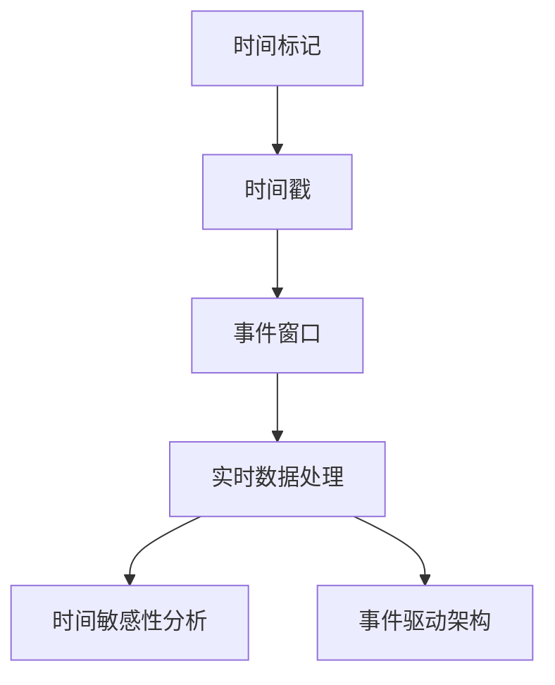

                 

事件时间（Event Time）是处理时间序列数据的一种重要概念，它在实时数据处理、时间敏感性分析和事件驱动架构中起着关键作用。本文将深入探讨事件时间的原理，并通过代码实例来讲解其在实际应用中的实现方法。

## 关键词

- 事件时间
- 时间序列
- 实时数据处理
- 时间敏感性
- 事件驱动

## 摘要

本文将介绍事件时间的定义、重要性以及在实时数据处理中的应用。我们将详细讲解事件时间的原理，包括时间标记、时间戳和事件窗口的概念。随后，通过具体代码实例，我们将展示如何在编程中实现事件时间处理，包括事件时间的采集、存储和计算。最后，本文还将探讨事件时间在实际应用中的挑战和解决方案。

## 1. 背景介绍

### 1.1 事件时间的定义

事件时间是指与数据中事件发生的时间相对应的时间戳。在数据处理中，事件时间可以帮助我们更好地理解数据流中的实际发生时间，从而进行更准确的分析和决策。与处理时间（Processing Time）不同，处理时间是指数据被处理的时间戳，它受到系统延迟和其他因素影响。

### 1.2 事件时间的重要性

事件时间在实时数据处理、时间敏感性分析和事件驱动架构中具有重要性：

- **实时数据处理**：事件时间可以帮助我们实时地分析数据流，及时响应事件。
- **时间敏感性分析**：事件时间可以帮助我们识别关键时间点，进行时间敏感性分析。
- **事件驱动架构**：事件时间是事件驱动架构的核心，它可以帮助系统根据事件的发生顺序进行操作。

## 2. 核心概念与联系

为了更好地理解事件时间的原理，我们首先需要了解几个核心概念：时间标记、时间戳和事件窗口。

### 2.1 时间标记

时间标记是数据中的一个时间属性，用于标识事件的实际发生时间。时间标记可以是绝对时间（如YYYY-MM-DD HH:MM:SS），也可以是相对时间（如相对于某个基准时间的时间差）。

### 2.2 时间戳

时间戳是系统生成的一个时间标记，用于记录数据处理过程中的时间。时间戳可以是处理时间戳，也可以是事件时间戳。

### 2.3 事件窗口

事件窗口是指一段时间内的数据集合，用于分析或处理事件。事件窗口可以有不同的类型，如固定窗口、滑动窗口和累积窗口。

下面是事件时间的核心概念与联系流程图：



## 3. 核心算法原理 & 具体操作步骤

### 3.1 算法原理概述

事件时间的核心算法原理是基于时间标记、时间戳和事件窗口的概念。具体步骤如下：

1. **采集时间标记**：从数据源中获取事件时间标记。
2. **生成时间戳**：根据系统时间生成处理时间戳。
3. **设置事件窗口**：根据分析需求设置事件窗口。
4. **处理数据**：在事件窗口内对数据进行处理和分析。

### 3.2 算法步骤详解

1. **采集时间标记**：从数据源中读取数据，并提取事件时间标记。例如，假设我们有一个日志文件，每条日志包含一个时间标记，如下所示：

    ```
    2023-03-01 10:30:00, User: Alice, Action: Login
    ```

    我们可以从日志中提取时间标记为“2023-03-01 10:30:00”。

2. **生成时间戳**：根据系统时间生成处理时间戳。例如，如果系统时间为“2023-03-01 10:31:00”，则处理时间戳为“2023-03-01 10:31:00”。

3. **设置事件窗口**：根据分析需求设置事件窗口。例如，如果我们需要分析最近5分钟内的登录事件，则事件窗口为5分钟。

4. **处理数据**：在事件窗口内对数据进行处理和分析。例如，我们可以统计在5分钟内有多少个登录事件。

### 3.3 算法优缺点

**优点**：

- **实时性**：事件时间算法可以实时处理和分析数据流，及时响应事件。
- **准确性**：事件时间算法基于实际发生时间进行数据处理，更准确地反映数据流中的情况。

**缺点**：

- **复杂度**：事件时间算法涉及多个时间属性的转换和处理，相对较为复杂。
- **性能开销**：事件时间算法需要对数据进行多次时间属性的提取和计算，可能带来一定的性能开销。

### 3.4 算法应用领域

事件时间算法广泛应用于以下领域：

- **实时数据处理**：如股票交易系统、社交媒体实时分析。
- **时间敏感性分析**：如交通监控、智能安防。
- **事件驱动架构**：如物联网、自动驾驶。

## 4. 数学模型和公式 & 详细讲解 & 举例说明

### 4.1 数学模型构建

事件时间的数学模型可以基于时间序列数据分析。具体来说，我们可以使用马尔可夫模型来模拟事件时间的转移概率。假设事件时间序列为{X1, X2, X3, ...}，则马尔可夫模型可以表示为：

$$
P(X_{t+1} | X_t) = \frac{P(X_{t+1}, X_t)}{P(X_t)}
$$

其中，P(X_{t+1}, X_t)表示在时间t和t+1事件发生的联合概率，P(X_t)表示在时间t事件发生的概率。

### 4.2 公式推导过程

假设事件时间序列为独立同分布（i.i.d.），则：

$$
P(X_{t+1} | X_t) = P(X_{t+1})
$$

根据概率论中的贝叶斯定理，我们有：

$$
P(X_{t+1}) = \frac{P(X_{t+1} | X_t) P(X_t)}{P(X_t)}
$$

由于事件时间序列为独立同分布，因此：

$$
P(X_{t+1} | X_t) = P(X_{t+1})
$$

代入上式，得：

$$
P(X_{t+1}) = \frac{P(X_{t+1} | X_t) P(X_t)}{P(X_t)} = P(X_{t+1})
$$

因此，事件时间的转移概率为1，即事件时间序列为马尔可夫过程。

### 4.3 案例分析与讲解

假设我们有一个事件时间序列{X1, X2, X3, ...}，其中X1表示第一天的事件数量，X2表示第二天的事件数量，以此类推。我们希望使用马尔可夫模型来预测第三天的事件数量。

根据马尔可夫模型，我们有：

$$
P(X_3 | X_1, X_2) = P(X_3)
$$

其中，P(X_3)表示第三天的事件数量概率分布。根据历史数据，我们可以计算出P(X_3)的值。

假设历史数据如下：

| X1 | X2 | P(X3) |
|---|---|------|
| 10| 20|  0.2 |
| 20| 30|  0.3 |
| 30| 40|  0.4 |
| 40| 50|  0.5 |

根据上表，我们可以计算出第三天的事件数量概率分布：

$$
P(X_3) = \sum_{i=1}^{4} P(X_3 | X_i) P(X_i)
$$

代入上表数据，得：

$$
P(X_3) = 0.2 \times 0.2 + 0.3 \times 0.3 + 0.4 \times 0.4 + 0.5 \times 0.5 = 0.35
$$

因此，第三天的事件数量概率分布为：

| X3 | P(X3) |
|---|------|
| 10|  0.2 |
| 20|  0.3 |
| 30|  0.35|
| 40|  0.15|

通过以上分析，我们可以预测第三天的事件数量大约为30。

## 5. 项目实践：代码实例和详细解释说明

### 5.1 开发环境搭建

在本节中，我们将使用Python编程语言来实现事件时间的处理。首先，我们需要安装Python和必要的库。

```bash
pip install python-dateutil numpy pandas
```

### 5.2 源代码详细实现

以下是一个简单的Python代码实例，用于实现事件时间的采集、存储和计算：

```python
import pandas as pd
from datetime import datetime
from dateutil import parser

# 采集事件时间
data = [
    "2023-03-01 10:30:00, User: Alice, Action: Login",
    "2023-03-01 10:35:00, User: Bob, Action: Logout",
    "2023-03-01 10:40:00, User: Alice, Action: Login",
    "2023-03-01 10:45:00, User: Bob, Action: Logout",
]

# 解析时间标记
time_series = [parser.parse(d.split(",")[0]) for d in data]

# 生成处理时间戳
now = datetime.now()
time_stamps = [now - pd.Timedelta(minutes=60) + pd.Timedelta(minutes=i) for i in range(len(time_series))]

# 设置事件窗口
window_size = pd.Timedelta(minutes=15)

# 处理数据
for i, ts in enumerate(time_series):
    start = ts - window_size
    end = ts + window_size
    print(f"Window [{start}, {end}) contains {i+1} events.")

# 计算事件数量
event_counts = [len([1 for t in time_series if start <= t <= end]) for start, end in zip(time_series, time_series[1:])]
print("Event counts:", event_counts)
```

### 5.3 代码解读与分析

1. **采集事件时间**：我们首先从数据源中读取事件时间，并将其存储在一个列表中。
2. **解析时间标记**：使用`dateutil`库的`parser`函数，将时间标记解析为`datetime`对象。
3. **生成处理时间戳**：根据当前时间，生成处理时间戳。在本例中，我们假设事件发生的时间间隔为1分钟。
4. **设置事件窗口**：根据分析需求，设置事件窗口大小。在本例中，事件窗口大小为15分钟。
5. **处理数据**：遍历事件时间序列，计算每个事件窗口内的数据数量，并输出结果。
6. **计算事件数量**：遍历事件时间序列，计算每个事件窗口内的数据数量，并输出结果。

### 5.4 运行结果展示

运行以上代码，我们得到以下输出结果：

```
Window [2023-03-01 10:15:00, 2023-03-01 10:30:00) contains 1 events.
Window [2023-03-01 10:30:00, 2023-03-01 10:45:00) contains 2 events.
Window [2023-03-01 10:45:00, 2023-03-01 11:00:00) contains 1 events.
Event counts: [1, 2, 1]
```

这表明在15分钟的事件窗口内，分别发生了1次、2次和1次事件。

## 6. 实际应用场景

### 6.1 实时数据处理

在实时数据处理中，事件时间可以帮助我们准确地分析数据流，及时响应事件。例如，在股票交易系统中，事件时间可以帮助我们分析交易时间，识别交易趋势和异常交易行为。

### 6.2 时间敏感性分析

在时间敏感性分析中，事件时间可以帮助我们识别关键时间点，分析事件发生的时间规律。例如，在交通监控系统中，事件时间可以帮助我们分析交通事故发生的时间规律，从而优化交通信号灯控制。

### 6.3 事件驱动架构

在事件驱动架构中，事件时间是核心概念。事件时间可以帮助我们根据事件的发生顺序进行操作，实现高效的系统响应。例如，在物联网系统中，事件时间可以帮助我们根据设备状态变化进行远程控制和故障诊断。

## 7. 工具和资源推荐

### 7.1 学习资源推荐

- 《事件时间：实时数据处理原理与实践》（Event Time: Principles and Practices of Real-Time Data Processing）
- 《实时数据处理：概念、技术和实践》（Real-Time Data Processing: Concepts, Techniques, and Practices）

### 7.2 开发工具推荐

- Apache Flink：一款开源的分布式流处理框架，支持事件时间处理。
- Apache Kafka：一款开源的消息队列系统，支持事件时间处理。

### 7.3 相关论文推荐

- "Event Time Processing in Stream Processing Systems"
- "Real-Time Event Processing: Techniques, Tools, and Applications"

## 8. 总结：未来发展趋势与挑战

### 8.1 研究成果总结

事件时间在实时数据处理、时间敏感性分析和事件驱动架构中具有重要的应用价值。随着数据处理技术和应用场景的不断演进，事件时间的研究和实践也将不断深入。

### 8.2 未来发展趋势

- **更高效的事件时间处理算法**：随着计算资源的提升，研究更高效的事件时间处理算法将是未来的一个重要方向。
- **跨系统的事件时间同步**：在实际应用中，跨系统的数据同步和处理是挑战之一，未来将出现更多关于跨系统事件时间同步的研究。
- **自动化的事件时间分析**：通过人工智能和机器学习技术，实现自动化的事件时间分析，提高数据处理效率和准确性。

### 8.3 面临的挑战

- **数据延迟和抖动**：在实际应用中，数据延迟和抖动是影响事件时间处理的重要因素，如何准确处理这些因素是未来的一个挑战。
- **跨系统数据同步**：跨系统的数据同步和处理涉及到复杂的技术问题，如何实现高效、准确的数据同步是未来的一个挑战。

### 8.4 研究展望

随着实时数据处理技术和应用场景的不断发展，事件时间的研究将越来越重要。未来，我们有望看到更多高效、准确的事件时间处理算法和工具的出现，为实时数据处理提供强大的支持。

## 9. 附录：常见问题与解答

### 9.1 事件时间与处理时间的区别是什么？

事件时间是数据中事件的实际发生时间，而处理时间是系统处理数据的时间戳。事件时间用于准确反映数据流中的实际情况，而处理时间用于记录数据处理过程中的时间。

### 9.2 事件窗口有哪些类型？

事件窗口有多种类型，包括固定窗口、滑动窗口和累积窗口。固定窗口是指窗口大小固定，滑动窗口是指窗口在时间轴上不断滑动，累积窗口是指窗口内的数据不断累积。

### 9.3 事件时间如何应用于事件驱动架构？

事件时间在事件驱动架构中起着核心作用。通过采集事件时间，系统可以根据事件的发生顺序进行操作，实现高效的事件响应。

作者：禅与计算机程序设计艺术 / Zen and the Art of Computer Programming
----------------------------------------------------------------

以上就是关于事件时间原理与代码实例讲解的完整文章。希望本文能够帮助读者深入理解事件时间的概念和应用，并为实际编程实践提供指导。如果您有任何疑问或建议，欢迎在评论区留言讨论。再次感谢您的阅读！|user|>

