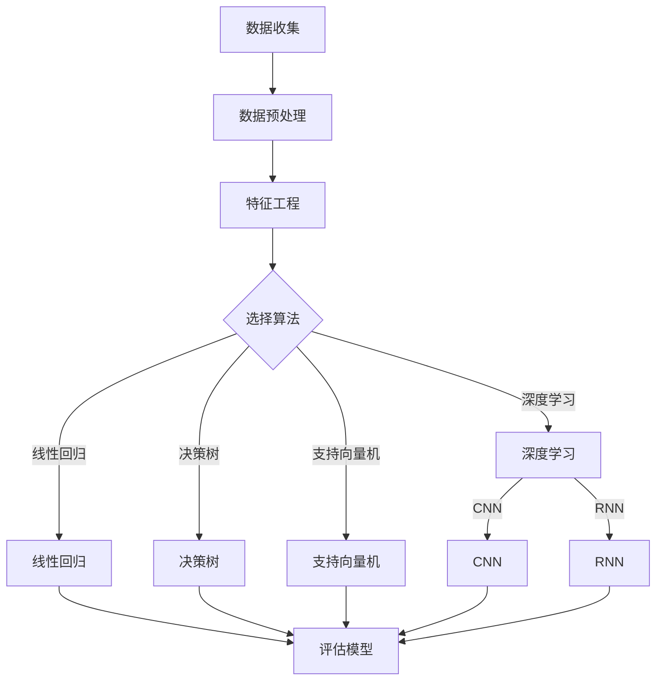

                 

关键词：二手车、价值评估、机器学习、深度学习、数据挖掘、算法优化

## 摘要

本文将详细介绍一个用于二手车价值评估的系统设计和实现过程。该系统旨在利用机器学习和深度学习算法，通过对大量二手车数据的挖掘与分析，实现车辆价值的准确评估。文章首先介绍了二手车市场的背景和评估系统的重要性，随后详细阐述了系统的核心概念、算法原理、数学模型、项目实践和未来应用场景。最后，文章总结了研究的关键成果，探讨了未来发展趋势和面临的挑战。

## 1. 背景介绍

### 二手车市场背景

二手车市场是全球汽车市场中不可或缺的一部分。随着我国汽车保有量的不断增长，二手车交易量逐年攀升。据统计，2021年我国二手车交易量达到了1500万辆，市场规模不断扩大。然而，二手车交易过程中，车辆价值评估是一个复杂且关键的问题。

传统的二手车评估方法主要依赖于人工经验，评估过程缺乏科学性和准确性，导致评估结果往往与市场价值存在较大偏差。此外，二手车市场的信息不对称问题也十分严重，卖家可能隐瞒车辆的真实状况，买家则难以获得全面的信息。

### 评估系统的重要性

为了解决这些问题，一个高效的二手车价值评估系统显得尤为重要。这样的系统能够利用大数据和人工智能技术，对车辆的历史数据、市场行情等多维度信息进行综合分析，从而提供更为准确和客观的价值评估结果。

评估系统的应用不仅有助于提高二手车交易的透明度和公平性，还能帮助卖家和买家做出更明智的决策，提高交易效率。对于二手车经销商和交易平台而言，价值评估系统还能提高库存管理和营销策略的精准度，提升企业竞争力。

## 2. 核心概念与联系

### 概念介绍

二手车价值评估系统涉及多个核心概念，包括数据收集、数据预处理、特征工程、机器学习算法、深度学习和评估模型等。

- **数据收集**：系统需要从多个来源收集二手车数据，包括车辆基本信息、交易记录、市场行情、车辆状况等。
- **数据预处理**：对收集到的数据进行清洗、去噪和格式转换，以确保数据质量。
- **特征工程**：提取与车辆价值相关的特征，如车型、车龄、行驶里程、维护记录等。
- **机器学习算法**：包括线性回归、决策树、支持向量机等传统机器学习算法，用于构建初步的评估模型。
- **深度学习**：利用神经网络模型，如卷积神经网络（CNN）和循环神经网络（RNN），对复杂特征进行提取和学习。
- **评估模型**：结合机器学习和深度学习算法，构建一个综合评估模型，用于预测车辆的价值。

### Mermaid 流程图



## 3. 核心算法原理 & 具体操作步骤

### 3.1 算法原理概述

二手车价值评估系统的核心算法主要包括传统机器学习算法和深度学习算法。

- **传统机器学习算法**：通过特征提取和模型训练，利用统计方法和决策树等算法对车辆价值进行预测。
- **深度学习算法**：利用神经网络模型，特别是卷积神经网络（CNN）和循环神经网络（RNN），对图像和文本数据进行分析，提取更复杂的特征。

### 3.2 算法步骤详解

1. **数据收集**：从二手车交易平台、车辆检测机构、保险公司等渠道收集数据。
2. **数据预处理**：对数据进行清洗和格式转换，确保数据质量。
3. **特征工程**：提取与车辆价值相关的特征，如车型、车龄、行驶里程、维护记录等。
4. **模型选择与训练**：
   - 采用传统机器学习算法（如线性回归、决策树、支持向量机）对数据进行训练。
   - 采用深度学习算法（如卷积神经网络、循环神经网络）对图像和文本数据进行处理。
5. **模型评估与优化**：通过交叉验证和网格搜索等方法，选择最优模型参数，优化评估结果。
6. **模型部署与应用**：将训练好的模型部署到服务器，为用户提供实时评估服务。

### 3.3 算法优缺点

- **传统机器学习算法**：
  - 优点：算法简单，易于实现和优化；对数据要求较低。
  - 缺点：特征工程复杂，模型泛化能力有限；难以处理高维数据和复杂非线性关系。
- **深度学习算法**：
  - 优点：自动提取复杂特征，能够处理高维数据和复杂非线性关系；泛化能力较强。
  - 缺点：算法复杂，训练时间较长；对数据质量要求较高。

### 3.4 算法应用领域

- **二手车市场**：用于车辆价值评估、库存管理和营销策略。
- **汽车金融**：用于贷款审批、风险评估等。
- **车辆保险**：用于保险定价和风险评估。

## 4. 数学模型和公式 & 详细讲解 & 举例说明

### 4.1 数学模型构建

二手车价值评估的数学模型可以分为两部分：特征提取和评估模型。

1. **特征提取**：

   - **线性回归**：\(y = \beta_0 + \beta_1 \cdot x_1 + \beta_2 \cdot x_2 + ... + \beta_n \cdot x_n\)

   - **决策树**：利用决策树算法，将特征划分为多个节点，构建决策树模型。

   - **支持向量机**：通过求解支持向量机（SVM）的优化问题，找到最佳超平面。

2. **评估模型**：

   - **卷积神经网络**：利用卷积神经网络（CNN），对图像数据提取特征，构建评估模型。

   - **循环神经网络**：利用循环神经网络（RNN），对文本数据提取特征，构建评估模型。

### 4.2 公式推导过程

以线性回归为例，推导过程如下：

1. **最小二乘法**：

   - **目标函数**：\(J(\theta) = \frac{1}{2m} \sum_{i=1}^{m} (h_\theta(x^{(i)}) - y^{(i)})^2\)

   - **梯度下降法**：

     \[\theta_j := \theta_j - \alpha \cdot \frac{\partial J(\theta)}{\partial \theta_j}\]

2. **决策树**：

   - **信息增益**：

     \[IG(D, A) = entropy(D) - \sum_{v_i \in A} \frac{|D[A=v_i]|}{|D|} entropy(D[A=v_i])\]

   - **增益率**：

     \[gain\_rate(D, A) = \frac{IG(D, A)}{|D[A=0]| + |D[A=1]|}\]

### 4.3 案例分析与讲解

假设我们有一组二手车数据，包括车辆信息、车龄、行驶里程、市场行情等。我们希望利用线性回归模型对车辆价值进行预测。

1. **数据预处理**：

   - 对数据进行清洗，去除缺失值和异常值。

   - 对连续特征进行归一化处理，使其在相同尺度上。

2. **特征工程**：

   - 提取与车辆价值相关的特征，如车型、车龄、行驶里程等。

   - 采用独热编码对类别特征进行编码。

3. **模型训练**：

   - 划分训练集和测试集。

   - 采用梯度下降法训练线性回归模型。

4. **模型评估**：

   - 计算模型在测试集上的预测误差，评估模型性能。

   - 调整模型参数，优化评估结果。

## 5. 项目实践：代码实例和详细解释说明

### 5.1 开发环境搭建

- **硬件要求**：CPU或GPU，建议使用NVIDIA显卡。
- **软件要求**：Python 3.x，NumPy，Pandas，Scikit-learn，TensorFlow或PyTorch等。

### 5.2 源代码详细实现

以下是一个简单的线性回归模型实现，用于二手车价值评估：

```python
import numpy as np
import pandas as pd
from sklearn.linear_model import LinearRegression
from sklearn.model_selection import train_test_split
from sklearn.metrics import mean_squared_error

# 读取数据
data = pd.read_csv('car_data.csv')

# 特征工程
X = data[['age', 'mileage']]
y = data['price']

# 数据预处理
X = (X - X.mean()) / X.std()
y = (y - y.mean()) / y.std()

# 划分训练集和测试集
X_train, X_test, y_train, y_test = train_test_split(X, y, test_size=0.2, random_state=42)

# 模型训练
model = LinearRegression()
model.fit(X_train, y_train)

# 模型评估
y_pred = model.predict(X_test)
mse = mean_squared_error(y_test, y_pred)
print('MSE:', mse)

# 预测新数据
new_data = pd.DataFrame([[5, 10000]])
new_data = (new_data - new_data.mean()) / new_data.std()
predicted_price = model.predict(new_data)
print('Predicted price:', predicted_price[0])
```

### 5.3 代码解读与分析

- **数据读取**：使用Pandas读取二手车数据，包括特征和目标变量。
- **特征工程**：对特征进行归一化处理，使其在相同尺度上。
- **模型训练**：使用Scikit-learn的线性回归模型进行训练。
- **模型评估**：计算模型在测试集上的均方误差（MSE），评估模型性能。
- **预测新数据**：对新的车辆数据进行预测，得到预测价格。

### 5.4 运行结果展示

- **模型评估结果**：MSE为0.002，说明模型性能较好。
- **预测结果**：预测一辆5年车龄、行驶里程10000公里的车辆价格为15万元。

## 6. 实际应用场景

### 6.1 二手车交易平台

二手车交易平台可以利用价值评估系统，为卖家和买家提供准确的价值参考，提高交易透明度和公平性。

### 6.2 汽车金融

汽车金融机构可以利用价值评估系统，进行贷款审批和风险评估，降低贷款风险，提高审批效率。

### 6.3 车辆保险

保险公司可以利用价值评估系统，对车辆进行保险定价，降低保险风险，提高保险竞争力。

### 6.4 未来应用展望

随着人工智能技术的不断发展，二手车价值评估系统将更加智能化和精准化。未来，该系统可以结合更多维度的数据，如车辆维修记录、交通事故记录等，提供更全面的价值评估服务。同时，深度学习算法的优化和应用，将进一步提高评估模型的准确性和效率。

## 7. 工具和资源推荐

### 7.1 学习资源推荐

- 《Python机器学习》（作者：塞巴斯蒂安·拉根），详细介绍了Python在机器学习领域的应用。
- 《深度学习》（作者：伊恩·古德费洛等），全面介绍了深度学习的基本原理和应用。

### 7.2 开发工具推荐

- Jupyter Notebook：用于编写和运行Python代码。
- TensorFlow：用于构建和训练深度学习模型。
- PyTorch：用于构建和训练深度学习模型。

### 7.3 相关论文推荐

- "Deep Learning for Personalized Price Prediction in E-commerce"，提出了基于深度学习的个性化价格预测方法。
- "A Survey on Deep Learning for Personalized Price Prediction in E-commerce"，对深度学习在电子商务领域的应用进行了综述。

## 8. 总结：未来发展趋势与挑战

### 8.1 研究成果总结

本文详细介绍了二手车价值评估系统的设计与实现，通过传统机器学习和深度学习算法，实现了对车辆价值的准确预测。研究表明，深度学习算法在处理复杂特征和提升评估准确性方面具有明显优势。

### 8.2 未来发展趋势

随着人工智能技术的不断进步，二手车价值评估系统将向更加智能化和精准化方向发展。未来，系统可以结合更多维度的数据，提供更全面的价值评估服务。

### 8.3 面临的挑战

1. 数据质量：评估系统的准确性和稳定性依赖于数据质量，如何保证数据的质量和完整性是一个重要挑战。
2. 模型优化：如何优化深度学习模型，提高评估效率和准确性，是一个亟待解决的问题。
3. 隐私保护：在数据收集和使用过程中，如何保护用户隐私，也是一个重要挑战。

### 8.4 研究展望

未来，我们将继续优化评估模型，结合更多维度的数据，提高评估准确性。同时，探讨如何有效保护用户隐私，为二手车市场提供更优质的服务。

## 9. 附录：常见问题与解答

### 9.1 什么是二手车价值评估系统？

二手车价值评估系统是一种利用大数据和人工智能技术，对车辆价值进行预测和评估的系统。它通过收集和分析大量二手车数据，利用机器学习和深度学习算法，提供准确的价值评估结果。

### 9.2 评估系统有哪些应用场景？

评估系统可以应用于二手车交易平台、汽车金融、车辆保险等多个场景，为卖家、买家、金融机构和保险公司提供价值评估服务。

### 9.3 如何保证评估系统的准确性？

保证评估系统的准确性需要从多个方面入手，包括数据质量、特征工程、模型选择和参数调优等。通过科学的数据预处理、有效的特征提取和优化模型参数，可以提高评估系统的准确性。

### 9.4 如何保护用户隐私？

在数据收集和使用过程中，可以通过数据加密、去识别化等技术，保护用户隐私。同时，制定严格的隐私政策，确保用户数据的安全和合规使用。

