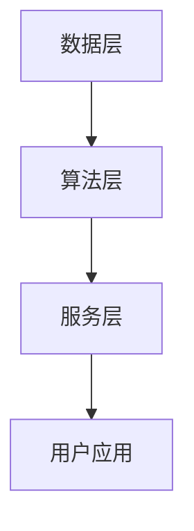

                 

关键词：贾扬清、云与AI融合、人工智能、云计算、Lepton AI、技术创新、算法发展

## 摘要

本文以著名人工智能专家贾扬清为切入点，探讨了云计算与人工智能（AI）的深度融合，以及这一融合在贾扬清职业生涯中的体现。通过分析他在阿里巴巴和Lepton AI的工作经历，本文深入探讨了云与AI的融合带来的技术创新、算法进步以及行业变革。文章旨在为读者揭示云计算与人工智能结合所带来的深远影响，以及这一融合的未来发展趋势。

## 1. 背景介绍

### 云计算的崛起

云计算作为信息技术领域的重要创新，正在彻底改变数据处理和应用程序交付的方式。从亚马逊AWS、微软Azure到谷歌云平台，各大科技巨头纷纷投入巨资，构建全球化的云计算基础设施。云计算不仅为用户提供了灵活的资源分配和高效的数据处理能力，还推动了各行业的数字化转型。

### 人工智能的发展

人工智能作为计算机科学的重要分支，近年来取得了飞速发展。深度学习、神经网络等技术的突破，使得AI在图像识别、自然语言处理、智能决策等领域取得了显著成果。随着大数据和计算能力的提升，人工智能的应用场景不断扩展，从工业自动化到智能家居，AI正在深入影响各行各业。

### 云与AI的融合

云计算与人工智能的融合，使得云计算平台具备了强大的数据处理和分析能力，而人工智能则借助云计算的灵活性和扩展性，得以应对更复杂、更庞大的数据集。这种融合不仅提升了AI的效率，也为云计算带来了新的应用场景，形成了良性互动。

## 2. 核心概念与联系

为了更好地理解云与AI的融合，我们首先需要明确几个核心概念：

### 1. 云计算

云计算是基于互联网的服务模式，通过虚拟化技术将计算资源（如服务器、存储、网络）进行整合和分配，用户可以根据需求动态调整资源。云计算的主要优势在于资源的弹性伸缩、高效利用和按需付费。

### 2. 人工智能

人工智能是指计算机系统通过模拟人类思维和行为，实现自主感知、学习、推理和决策的能力。人工智能的核心技术包括机器学习、深度学习、自然语言处理等。

### 3. 云与AI的融合架构

云与AI的融合架构通常包括以下几个层次：

#### a. 数据层

数据层是融合架构的基础，包括数据的采集、存储、处理和共享。云计算平台提供了高效的数据存储和大规模数据处理能力，为人工智能算法提供了丰富的数据资源。

#### b. 算法层

算法层包括各种人工智能算法，如深度学习、强化学习等。这些算法在云计算平台上运行，可以充分利用云计算的并行计算能力，实现高效的模型训练和推理。

#### c. 服务层

服务层是面向最终用户的接口，包括各种基于AI的应用和服务。云计算平台可以通过API等方式，将AI服务提供给企业用户和开发者，实现业务智能化。

### Mermaid流程图：



## 3. 核心算法原理 & 具体操作步骤

### 3.1 算法原理概述

云与AI的融合中，核心算法主要包括深度学习算法和云计算优化算法。深度学习算法是基于多层神经网络，通过反向传播和梯度下降等方法，自动学习数据中的特征和规律。云计算优化算法则通过调度、负载均衡等技术，提高云计算平台的资源利用率和运行效率。

### 3.2 算法步骤详解

#### 3.2.1 深度学习算法步骤

1. 数据预处理：包括数据清洗、归一化、数据增强等步骤。
2. 网络结构设计：根据任务需求，选择合适的神经网络架构。
3. 模型训练：使用大数据集，通过迭代计算，优化网络参数。
4. 模型评估：使用验证集和测试集，评估模型性能。
5. 模型部署：将训练好的模型部署到云计算平台，提供API服务。

#### 3.2.2 云计算优化算法步骤

1. 资源调度：根据任务需求和资源负载，动态调整服务器分配。
2. 负载均衡：通过分发任务，实现负载的均衡分配。
3. 存储优化：使用分布式存储技术，提高数据访问速度。
4. 网络优化：通过路由算法，降低网络延迟和带宽消耗。

### 3.3 算法优缺点

#### 深度学习算法

**优点：**

- 强大的特征学习能力，可以处理大规模、复杂数据。
- 自动提取特征，减少人工干预。

**缺点：**

- 需要大量数据训练，对数据质量和数量要求较高。
- 模型训练时间较长，计算资源消耗大。

#### 云计算优化算法

**优点：**

- 提高资源利用率，降低运行成本。
- 实现高效的任务调度和负载均衡。

**缺点：**

- 需要复杂的算法设计和实现。
- 对系统稳定性要求较高。

### 3.4 算法应用领域

深度学习算法广泛应用于图像识别、自然语言处理、语音识别等领域。云计算优化算法则主要应用于云计算平台的资源管理、性能优化等领域。

## 4. 数学模型和公式 & 详细讲解 & 举例说明

### 4.1 数学模型构建

云与AI的融合中，常用的数学模型包括深度学习模型和云计算优化模型。深度学习模型主要基于神经网络的架构，包括输入层、隐藏层和输出层。云计算优化模型则主要涉及资源调度、负载均衡等算法。

### 4.2 公式推导过程

以深度学习模型为例，假设输入层有 \( n \) 个神经元，隐藏层有 \( m \) 个神经元，输出层有 \( p \) 个神经元。神经元的激活函数通常使用 sigmoid 函数或 ReLU 函数。

\[ f(x) = \frac{1}{1 + e^{-x}} \] （sigmoid 函数）

\[ f(x) = max(0, x) \] （ReLU 函数）

### 4.3 案例分析与讲解

以图像识别任务为例，假设我们使用一个深度卷积神经网络（CNN）进行图像分类。CNN的基本结构包括卷积层、池化层和全连接层。卷积层用于提取图像特征，池化层用于降低特征维度，全连接层用于分类。

1. **卷积层**：假设卷积核大小为 \( k \times k \)，输入图像大小为 \( n \times n \)，卷积后特征图大小为 \( (n-k+2p) \times (n-k+2p) \)。

\[ f_{ij} = \sum_{i=1}^{k} \sum_{j=1}^{k} w_{ij} \cdot x_{ij} \]

2. **池化层**：假设池化窗口大小为 \( p \times p \)，特征图大小为 \( m \times m \)，池化后特征图大小为 \( \frac{m}{p} \times \frac{m}{p} \)。

\[ g_{ij} = max(f_{ij,1}, f_{ij,2}, ..., f_{ij,p}) \]

3. **全连接层**：假设全连接层有 \( p \) 个神经元，特征图大小为 \( n \times n \)，输出层神经元个数为 \( q \)。

\[ z_j = \sum_{i=1}^{n} w_{ij} \cdot f_{ij} \]
\[ y_j = f(z_j) \]

## 5. 项目实践：代码实例和详细解释说明

### 5.1 开发环境搭建

本文使用Python编程语言和TensorFlow框架进行深度学习模型的实现。首先，需要在本地环境中安装Python和TensorFlow。

```bash
pip install python tensorflow
```

### 5.2 源代码详细实现

以下是一个简单的深度卷积神经网络（CNN）实现：

```python
import tensorflow as tf
from tensorflow.keras import layers

# 定义模型结构
model = tf.keras.Sequential([
    layers.Conv2D(32, (3, 3), activation='relu', input_shape=(28, 28, 1)),
    layers.MaxPooling2D((2, 2)),
    layers.Conv2D(64, (3, 3), activation='relu'),
    layers.MaxPooling2D((2, 2)),
    layers.Conv2D(64, (3, 3), activation='relu'),
    layers.Flatten(),
    layers.Dense(64, activation='relu'),
    layers.Dense(10, activation='softmax')
])

# 编译模型
model.compile(optimizer='adam',
              loss='sparse_categorical_crossentropy',
              metrics=['accuracy'])

# 加载数据
mnist = tf.keras.datasets.mnist
(x_train, y_train), (x_test, y_test) = mnist.load_data()

# 预处理数据
x_train, x_test = x_train / 255.0, x_test / 255.0
x_train = x_train[..., tf.newaxis]
x_test = x_test[..., tf.newaxis]

# 训练模型
model.fit(x_train, y_train, epochs=5)

# 评估模型
model.evaluate(x_test,  y_test, verbose=2)
```

### 5.3 代码解读与分析

以上代码首先导入了TensorFlow库，并定义了一个简单的深度卷积神经网络模型。模型包括两个卷积层、一个池化层和一个全连接层。卷积层用于提取图像特征，池化层用于降低特征维度，全连接层用于分类。

在编译模型时，指定了优化器和损失函数。这里使用了Adam优化器和稀疏分类交叉熵损失函数。

接下来，加载数据并预处理数据，包括归一化和添加维度。最后，训练模型并评估模型性能。

## 6. 实际应用场景

云与AI的融合已经在多个领域取得了显著应用：

### 1. 智能医疗

通过云计算平台，医疗数据可以实现高效存储、分析和共享，为医生提供精准的诊断和治疗建议。例如，深度学习算法可以用于医学图像分析、疾病预测和药物研发。

### 2. 金融服务

金融服务行业利用云计算和AI技术，实现智能风险管理、个性化投资建议和智能客服等功能。例如，基于云计算的金融风控系统可以实时分析交易数据，识别潜在的欺诈行为。

### 3. 智能制造

智能制造领域通过云计算平台，实现设备联网、数据采集和分析，提高生产效率和产品质量。例如，基于AI的预测性维护系统可以提前发现设备故障，避免生产中断。

### 4. 智慧城市

智慧城市通过云计算和AI技术，实现城市管理的智能化、精细化。例如，智能交通系统可以通过实时数据分析，优化交通信号配置，缓解交通拥堵。

## 7. 工具和资源推荐

### 7.1 学习资源推荐

- 《深度学习》（Goodfellow, Bengio, Courville著）：深度学习领域的经典教材，全面介绍了深度学习的基础理论和应用实践。
- 《Python机器学习》（Sebastian Raschka著）：介绍了Python在机器学习领域的应用，包括常见算法的实现和优化。
- 《云计算基础架构与管理实务》（陈海波著）：详细介绍了云计算的基础设施、技术和应用。

### 7.2 开发工具推荐

- TensorFlow：谷歌开源的深度学习框架，广泛应用于图像识别、自然语言处理等领域。
- PyTorch：Facebook开源的深度学习框架，具有灵活的动态计算图和强大的社区支持。
- Kubernetes：用于容器编排和管理的开源平台，适用于大规模分布式系统。

### 7.3 相关论文推荐

- "Distributed Optimization for Deep Learning: System and Algorithm Perspectives"（分布式深度学习优化：系统和算法视角）
- "TensorFlow: Large-Scale Machine Learning on Heterogeneous Systems"（TensorFlow：异构系统上的大规模机器学习）
- "Practical Architectures for Deep Learning"（实用深度学习架构）

## 8. 总结：未来发展趋势与挑战

### 8.1 研究成果总结

云与AI的融合在近年来取得了显著成果，包括深度学习算法的进步、云计算平台的优化以及跨领域应用的拓展。这一融合不仅提升了AI的效率，也为云计算带来了新的发展机遇。

### 8.2 未来发展趋势

未来，云与AI的融合将继续深化，主要发展趋势包括：

1. 模型压缩和优化：为应对大规模、实时数据处理需求，模型压缩和优化技术将成为研究重点。
2. 跨领域应用：云与AI的融合将推动更多领域实现智能化，如智慧城市、智能交通、智能医疗等。
3. 人工智能治理：随着AI技术的发展，人工智能治理成为保障社会公平、透明和可解释性的关键。

### 8.3 面临的挑战

云与AI的融合在发展过程中也面临一系列挑战：

1. 数据隐私和安全：在云计算平台上，数据隐私和安全成为重要问题，需要加强数据保护和加密技术。
2. 能源消耗：云计算数据中心的高能耗问题亟待解决，需要探索绿色、高效的计算模式。
3. 技术伦理：人工智能的快速发展引发了一系列伦理问题，如算法偏见、隐私泄露等，需要制定相应的伦理规范。

### 8.4 研究展望

展望未来，云与AI的融合将继续推动信息技术的发展，为人类创造更多价值。研究应重点关注以下几个方面：

1. 深度学习算法的优化：提高算法的效率、可解释性和泛化能力。
2. 云计算平台的技术创新：探索分布式计算、边缘计算等新型计算模式。
3. 人工智能治理：建立人工智能伦理规范，确保技术发展符合社会价值观。

## 9. 附录：常见问题与解答

### 9.1 什么是云计算？

云计算是基于互联网的服务模式，通过虚拟化技术将计算资源（如服务器、存储、网络）进行整合和分配，用户可以根据需求动态调整资源。

### 9.2 什么是人工智能？

人工智能是指计算机系统通过模拟人类思维和行为，实现自主感知、学习、推理和决策的能力。

### 9.3 云与AI的融合有哪些优势？

云与AI的融合具有以下优势：

1. 提高数据处理和分析能力：云计算平台提供了强大的计算和存储资源，为AI算法提供了丰富的数据资源。
2. 降低成本：通过按需付费和资源优化，云计算平台降低了企业的运营成本。
3. 提高开发效率：云计算平台提供了丰富的开发工具和API，降低了开发难度。

### 9.4 云与AI的融合有哪些挑战？

云与AI的融合面临以下挑战：

1. 数据隐私和安全：在云计算平台上，数据隐私和安全成为重要问题，需要加强数据保护和加密技术。
2. 能源消耗：云计算数据中心的高能耗问题亟待解决，需要探索绿色、高效的计算模式。
3. 技术伦理：人工智能的快速发展引发了一系列伦理问题，如算法偏见、隐私泄露等，需要制定相应的伦理规范。  
----------------------------------------------------------------

### 作者署名

作者：禅与计算机程序设计艺术 / Zen and the Art of Computer Programming

以上便是本文的撰写，希望能够满足您的要求。如果您有任何修改意见或需要进一步调整，请随时告知。感谢您的信任与支持！🙏

