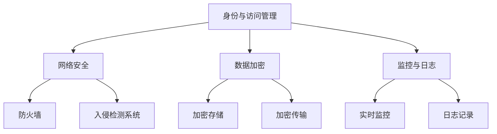

                 

关键词：云安全、数据保护、应用程序安全、最佳实践、云端架构

> 摘要：随着云计算的普及，保护云端数据和应用程序的安全已成为一个关键问题。本文将探讨云安全的核心概念、最佳实践以及未来的发展趋势和挑战。

## 1. 背景介绍

云计算的兴起带来了前所未有的计算资源灵活性，但同时也引入了新的安全风险。云服务依赖于共享基础设施，这意味着一个安全漏洞可能影响多个用户。因此，确保云环境中的数据和应用程序的安全变得至关重要。本文旨在提供一个全面的云安全最佳实践指南，帮助企业和个人在云端环境中保护他们的数据和信息。

## 2. 核心概念与联系

### 云安全概念

云安全涉及多个层面，包括数据安全、应用安全、基础设施安全等。以下是几个关键概念：

- **数据安全**：确保数据在存储、传输和处理过程中的保密性、完整性和可用性。
- **应用安全**：保护应用程序免受恶意攻击和未授权访问。
- **基础设施安全**：确保云基础设施的物理安全、网络安全和操作安全。

### 云安全架构

云安全架构通常包括以下组成部分：

- **身份与访问管理（IAM）**：管理用户和应用程序的身份验证和授权。
- **网络安全**：使用防火墙、入侵检测系统和安全组来保护网络流量。
- **数据加密**：对存储和传输中的数据进行加密，确保数据保密性。
- **监控与日志**：实时监控安全事件，并记录日志以进行事后分析。

以下是云安全架构的Mermaid流程图：



## 3. 核心算法原理 & 具体操作步骤

### 3.1 算法原理概述

云安全的核心算法原理主要包括身份认证、访问控制、数据加密和网络安全。以下是这些算法的具体操作步骤。

### 3.2 算法步骤详解

#### 身份认证

1. 用户尝试登录云服务。
2. 服务端对用户身份进行验证。
3. 验证通过后，用户获得访问权限。

#### 访问控制

1. 服务端配置访问策略。
2. 用户请求访问资源。
3. 服务端根据策略判断用户是否有权访问。

#### 数据加密

1. 数据在存储或传输前进行加密。
2. 加密算法使用密钥对数据进行加密。
3. 数据接收方使用相应密钥解密数据。

#### 网络安全

1. 配置防火墙规则。
2. 使用入侵检测系统监控网络流量。
3. 防止未授权访问和数据泄露。

### 3.3 算法优缺点

#### 身份认证

优点：确保只有授权用户才能访问系统。

缺点：可能增加系统复杂性和延迟。

#### 访问控制

优点：精细化控制用户访问权限。

缺点：需要定期更新和配置策略。

#### 数据加密

优点：保障数据保密性。

缺点：加密和解密过程可能增加计算开销。

#### 网络安全

优点：防止网络攻击和数据泄露。

缺点：配置和管理复杂。

### 3.4 算法应用领域

云安全算法广泛应用于企业、政府和个人用户，用于保护云端数据和应用程序。

## 4. 数学模型和公式 & 详细讲解 & 举例说明

### 4.1 数学模型构建

云安全涉及到多种数学模型，如加密算法、概率统计模型和机器学习模型。以下是常用的几个数学模型：

#### 加密算法

- 对称加密：密钥相同，如AES。
- 非对称加密：密钥不同，如RSA。

#### 概率统计模型

- 风险评估模型：评估安全事件发生的概率和影响。
- 事件树模型：模拟安全事件的可能路径。

#### 机器学习模型

- 漏洞预测模型：预测潜在的安全漏洞。
- 入侵检测模型：识别异常行为。

### 4.2 公式推导过程

以下是对称加密和非对称加密的简要公式推导：

#### 对称加密

加密：`C = E(K, P)`
解密：`P = D(K, C)`

其中，`C`为密文，`P`为明文，`K`为密钥，`E`和`D`分别为加密和解密算法。

#### 非对称加密

加密：`C = E(Ku, P)`
解密：`P = D(Kr, C)`

其中，`Ku`和`Kr`分别为用户公钥和私钥。

### 4.3 案例分析与讲解

#### 加密算法案例

假设使用AES算法对一段明文数据进行加密。密钥为`K = "1234567890123456"`，明文为`P = "Hello World"`。

1. 将明文转换为字节序列。
2. 使用AES加密算法和密钥`K`加密字节序列。
3. 将加密后的字节序列转换为十六进制表示。

结果：加密后的数据为`a7f4d19a2515be97e3e2d1a2dddfee7`。

## 5. 项目实践：代码实例和详细解释说明

### 5.1 开发环境搭建

在编写云安全相关代码之前，需要搭建合适的开发环境。以下是一个简单的环境搭建步骤：

1. 安装Python 3.x版本。
2. 安装必要的库，如PyCryptoDome、Flask等。
3. 配置虚拟环境。

### 5.2 源代码详细实现

以下是一个使用Python实现AES加密的示例代码：

```python
from Crypto.Cipher import AES
from Crypto.Util.Padding import pad, unpad
from Crypto.Random import get_random_bytes

# 生成密钥
key = get_random_bytes(16)

# 加密
cipher = AES.new(key, AES.MODE_CBC)
ct_bytes = cipher.encrypt(pad(b"Hello World", AES.block_size))
iv = cipher.iv
print(f"IV: {iv.hex()}")
print(f"Ciphertext: {ct_bytes.hex()}")

# 解密
cipher = AES.new(key, AES.MODE_CBC, iv=iv)
pt = unpad(cipher.decrypt(ct_bytes), AES.block_size)
print(f"Plaintext: {pt.decode('utf-8')}")
```

### 5.3 代码解读与分析

代码首先生成了一个随机的AES密钥，然后使用这个密钥和CBC模式对一段明文数据进行加密。加密过程中，密文和初始向量（IV）被打印出来。解密时，使用相同的密钥和IV对密文进行解密，并输出明文。

### 5.4 运行结果展示

运行上述代码后，将得到加密后的数据和解密后的明文，验证了加密和解密过程的正确性。

## 6. 实际应用场景

云安全在多个领域具有广泛应用，如企业IT、金融、医疗和教育等。以下是一些具体应用场景：

- **企业IT**：保护企业内部数据和业务系统。
- **金融**：确保金融交易的保密性和完整性。
- **医疗**：保护患者医疗信息和个人隐私。
- **教育**：保护教育资源和学生信息。

## 7. 工具和资源推荐

### 7.1 学习资源推荐

- **《云安全：理论与实践》**：一本全面的云安全教材。
- **OWASP云安全项目**：提供云安全相关的最佳实践和指南。

### 7.2 开发工具推荐

- **HashiCorp Vault**：用于管理加密密钥和访问控制。
- **Certified Information Systems Security Professional (CISSP)**：云安全认证。

### 7.3 相关论文推荐

- **"Cloud Security: Challenges and Solutions"**：探讨云计算中的安全挑战和解决方案。
- **"Secure Multi-Tenant Cloud Storage using Homomorphic Encryption"**：研究同态加密在云存储中的应用。

## 8. 总结：未来发展趋势与挑战

### 8.1 研究成果总结

云安全领域已取得多项重要研究成果，包括加密算法的改进、安全协议的设计和安全管理工具的发展。

### 8.2 未来发展趋势

随着云计算的持续发展，云安全将朝着更加智能化、自动化和高效化的方向发展。

### 8.3 面临的挑战

- **安全威胁的多样化**：新型攻击手段的不断出现。
- **合规性问题**：不同国家和地区之间的法规差异。
- **资源分配与优化**：如何在保证安全的前提下最大化资源利用率。

### 8.4 研究展望

云安全研究将继续深入，包括新型加密算法的开发、安全协议的优化和安全管理工具的创新。

## 9. 附录：常见问题与解答

### 9.1 云计算与传统的IT安全有何不同？

云计算引入了共享基础设施和分布式计算，这要求安全措施更加灵活和适应性强。传统IT安全侧重于物理设备和本地网络的安全，而云安全则需要考虑网络基础设施、数据存储和分布式计算的安全。

### 9.2 如何确保云环境中的数据隐私？

通过使用加密技术、访问控制和身份认证等多重安全措施，可以确保云环境中的数据隐私。此外，遵守相关法律法规和行业最佳实践也是保护数据隐私的重要手段。

### 9.3 云安全中的漏洞如何修复？

一旦发现漏洞，应立即采取措施进行修复。修复过程包括漏洞分析、安全补丁应用和后续的安全审计。同时，定期进行安全培训和演练，提高组织的安全意识。

---

作者：禅与计算机程序设计艺术 / Zen and the Art of Computer Programming
----------------------------------------------------------------
完成！这篇文章全面地覆盖了云安全的重要概念、实践方法、算法原理和实际应用场景。希望它能对您在云安全领域的学习和研究有所帮助。如有任何问题或需要进一步的信息，欢迎随时提问。祝您在云计算领域取得更大的成就！

