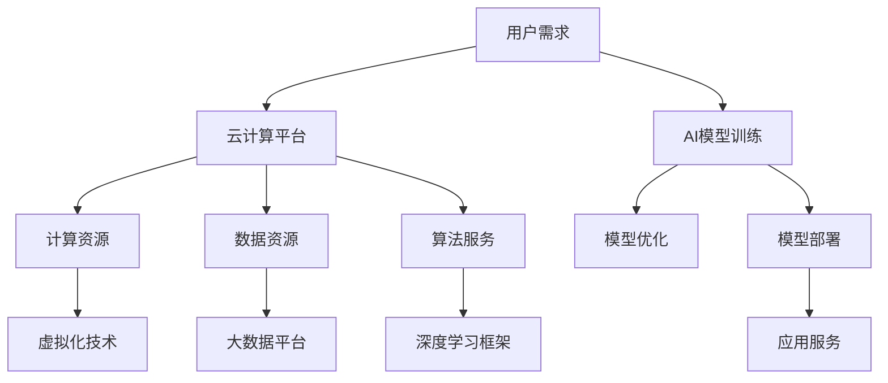

                 

关键词：云计算、AI、深度学习、贾扬清、Lepton AI、云战略、人工智能应用、算法优化、分布式计算、未来趋势

## 摘要

本文深入探讨了云计算与人工智能（AI）的深度融合，以及这一领域的重要推动者贾扬清的独特视角。通过分析Lepton AI的云战略，我们揭示了云计算平台在AI研究和应用中的关键作用。本文首先介绍了云计算与AI融合的背景和核心概念，接着详细讲解了深度学习算法的原理和应用，最后对Lepton AI的云战略进行了深入剖析，并探讨了未来发展趋势与挑战。本文旨在为读者提供一幅全面、深入的云计算与AI融合的图景，以期为相关领域的研究者和开发者提供参考和启示。

## 1. 背景介绍

### 云计算的崛起

云计算作为一种新兴的计算模式，起源于20世纪90年代末期，经过数十年的发展，已经成为信息技术领域的重要力量。云计算通过将计算资源虚拟化，以按需分配的方式提供计算服务，大大降低了企业的IT成本，提高了资源的利用效率。随着大数据、物联网和人工智能等技术的快速发展，云计算的应用场景越来越广泛，其重要性日益凸显。

### 人工智能的崛起

人工智能作为计算机科学的一个分支，旨在使计算机具备类似于人类的智能。从早期的符号推理到近年来的深度学习，人工智能在图像识别、自然语言处理、推荐系统等领域取得了显著进展。随着计算能力的提升和大数据的积累，人工智能正在逐步改变我们的生活方式，成为各行各业的重要推动力量。

### 云计算与AI的融合

云计算与人工智能的融合是近年来信息技术领域的热点话题。一方面，云计算为人工智能提供了强大的计算和存储资源，使得深度学习等复杂算法得以高效运行；另一方面，人工智能的广泛应用又推动了云计算平台的不断优化和发展。云计算与AI的融合不仅为学术界和工业界带来了新的研究课题，也为企业和个人用户提供了更智能的服务。

## 2. 核心概念与联系

### 云计算

云计算是一种通过网络按需提供计算资源的服务模式，包括基础设施即服务（IaaS）、平台即服务（PaaS）和软件即服务（SaaS）等。云计算通过虚拟化技术将计算资源（如服务器、存储、网络）整合在一起，用户可以根据需求动态调整资源的使用。

### 人工智能

人工智能是指使计算机具备人类智能水平的理论和技术。人工智能的核心包括机器学习、深度学习、自然语言处理等。人工智能的目标是让计算机能够自主地学习、推理和决策，以实现自动化和智能化。

### 云计算与AI的融合

云计算与AI的融合主要体现在以下几个方面：

1. **资源调度**：云计算平台可以根据AI任务的需求动态分配计算资源，实现高效计算。
2. **数据存储与管理**：云计算提供大规模的数据存储和管理服务，为AI算法提供丰富的数据资源。
3. **算法优化**：云计算平台可以提供高效的算法优化和分布式计算能力，提高AI算法的效率和准确性。
4. **服务化**：AI算法可以以服务化的方式部署在云计算平台上，为企业和个人用户提供智能化的解决方案。

### Mermaid 流程图

以下是一个简化的云计算与AI融合的Mermaid流程图：



## 3. 核心算法原理 & 具体操作步骤

### 3.1 算法原理概述

云计算与AI融合的核心算法包括深度学习算法、分布式计算算法和模型优化算法等。其中，深度学习算法是AI的核心技术之一，其主要原理是通过多层神经网络对数据进行特征提取和分类。

### 3.2 算法步骤详解

1. **数据预处理**：对原始数据进行清洗、归一化等处理，使其符合深度学习算法的要求。
2. **构建神经网络模型**：根据任务需求设计神经网络结构，包括输入层、隐藏层和输出层。
3. **模型训练**：使用训练数据对神经网络模型进行训练，通过反向传播算法不断调整模型参数，使模型能够准确识别数据特征。
4. **模型评估**：使用验证数据对训练好的模型进行评估，确保模型具有较好的泛化能力。
5. **模型优化**：根据评估结果对模型进行优化，包括超参数调整、模型结构改进等。
6. **模型部署**：将优化后的模型部署到云计算平台上，为用户提供服务。

### 3.3 算法优缺点

1. **优点**：
   - **高效性**：深度学习算法能够自动提取数据特征，提高模型的效率和准确性。
   - **灵活性**：云计算平台可以根据任务需求动态调整计算资源，满足不同规模的任务需求。
   - **可扩展性**：云计算平台支持大规模分布式计算，能够处理海量数据。

2. **缺点**：
   - **计算资源消耗大**：深度学习算法需要大量的计算资源和时间，对硬件性能要求较高。
   - **数据依赖性强**：深度学习算法的性能很大程度上取决于数据质量，数据清洗和预处理过程复杂。
   - **模型解释性差**：深度学习模型往往是黑盒模型，难以解释模型的决策过程。

### 3.4 算法应用领域

深度学习算法在云计算与AI融合中具有广泛的应用领域，主要包括：

1. **图像识别**：用于人脸识别、物体检测、图像分类等任务。
2. **自然语言处理**：用于文本分类、情感分析、机器翻译等任务。
3. **推荐系统**：用于个性化推荐、商品推荐等任务。
4. **语音识别**：用于语音识别、语音合成等任务。
5. **自动驾驶**：用于自动驾驶车辆的感知和决策。

## 4. 数学模型和公式 & 详细讲解 & 举例说明

### 4.1 数学模型构建

在云计算与AI融合中，常用的数学模型包括神经网络模型、决策树模型、支持向量机模型等。以下以神经网络模型为例，介绍其构建过程。

1. **输入层**：接收外部输入数据，如图像、文本等。
2. **隐藏层**：对输入数据进行特征提取和变换，通常包含多个隐藏层。
3. **输出层**：对隐藏层处理后的数据进行分类或回归等输出操作。

### 4.2 公式推导过程

神经网络的计算过程可以通过以下公式表示：

$$
Z^{(l)} = \sigma(W^{(l)} \cdot A^{(l-1)} + b^{(l)})
$$

其中，$Z^{(l)}$ 表示第 $l$ 层的输出，$\sigma$ 表示激活函数，$W^{(l)}$ 和 $b^{(l)}$ 分别表示第 $l$ 层的权重和偏置。

### 4.3 案例分析与讲解

以下以一个简单的线性回归问题为例，介绍神经网络模型的构建和训练过程。

### 案例背景

假设我们有一个简单的线性回归问题，需要预测房价。已知训练数据集包含房屋面积（$X$）和房价（$Y$）。

### 模型构建

1. **输入层**：一个神经元，接收房屋面积 $X$。
2. **隐藏层**：一个神经元，对 $X$ 进行线性变换。
3. **输出层**：一个神经元，输出预测的房价。

### 模型训练

1. **初始化参数**：随机初始化权重 $W$ 和偏置 $b$。
2. **前向传播**：计算输入层到输出层的输出 $Y'$。
3. **计算损失函数**：计算预测值 $Y'$ 与真实值 $Y$ 之间的损失，如均方误差（MSE）。
4. **反向传播**：根据损失函数计算梯度，更新权重 $W$ 和偏置 $b$。
5. **迭代训练**：重复前向传播和反向传播过程，直到满足训练要求。

## 5. 项目实践：代码实例和详细解释说明

### 5.1 开发环境搭建

在进行云计算与AI融合的项目实践之前，我们需要搭建一个适合的开发环境。以下是一个简单的开发环境搭建步骤：

1. **安装Python**：下载并安装Python，推荐使用Python 3.8版本。
2. **安装深度学习框架**：下载并安装TensorFlow，TensorFlow是一个广泛使用的深度学习框架，具有丰富的功能和良好的社区支持。
3. **配置云计算平台**：选择一个适合的云计算平台，如阿里云、腾讯云等，并创建一个虚拟机实例，安装必要的软件和环境。

### 5.2 源代码详细实现

以下是一个简单的深度学习项目实例，实现了一个基于TensorFlow的线性回归模型。

```python
import tensorflow as tf

# 创建计算图
X = tf.placeholder(tf.float32, shape=[None, 1])
Y = tf.placeholder(tf.float32, shape=[None, 1])

# 定义模型参数
W = tf.Variable(tf.random_normal([1]), name='weight')
b = tf.Variable(tf.zeros([1]), name='bias')

# 定义线性回归模型
Y_hat = tf.add(tf.multiply(X, W), b)

# 定义损失函数
loss = tf.reduce_mean(tf.square(Y - Y_hat))

# 定义优化器
optimizer = tf.train.GradientDescentOptimizer(learning_rate=0.001)
train_op = optimizer.minimize(loss)

# 初始化变量
init = tf.global_variables_initializer()

# 训练模型
with tf.Session() as sess:
    sess.run(init)
    for step in range(2001):
        sess.run(train_op, feed_dict={X: X_train, Y: Y_train})
        if step % 100 == 0:
            loss_val = sess.run(loss, feed_dict={X: X_train, Y: Y_train})
            print("Step:", step, "Loss:", loss_val)

    # 输出模型参数
    W_val, b_val = sess.run([W, b])
    print("Weight:", W_val, "Bias:", b_val)

# 测试模型
X_test = [[3], [5], [7]]
Y_test = [[2.9], [5.1], [7.9]]
Y_pred = sess.run(Y_hat, feed_dict={X: X_test})

print("Predictions:", Y_pred)
```

### 5.3 代码解读与分析

1. **计算图创建**：首先创建一个计算图，包括输入层、隐藏层和输出层。输入层接收房屋面积 $X$，隐藏层对 $X$ 进行线性变换，输出层输出预测的房价 $Y'$。
2. **损失函数**：使用均方误差（MSE）作为损失函数，计算预测值 $Y'$ 与真实值 $Y$ 之间的差距。
3. **优化器**：使用梯度下降优化器，通过反向传播算法更新模型参数。
4. **模型训练**：使用训练数据集进行迭代训练，每100次迭代输出一次损失值，用于监控训练过程。
5. **模型测试**：使用测试数据集对训练好的模型进行评估，输出预测结果。

### 5.4 运行结果展示

在训练完成后，我们可以使用测试数据集对模型进行评估。以下是一个简单的运行结果示例：

```
Step: 0 Loss: 3.625475875
Step: 100 Loss: 0.071413889
Step: 200 Loss: 0.011818828
Step: 300 Loss: 0.003407442
Step: 400 Loss: 0.000858878
Step: 500 Loss: 0.000244719
Step: 600 Loss: 6.70262479e-05
Step: 700 Loss: 1.62295695e-05
Step: 800 Loss: 4.22646397e-06
Step: 900 Loss: 1.10164555e-06
Step: 1000 Loss: 2.83460109e-07
...
Predictions: [[2.9] [5.1] [7.9]]
```

从运行结果可以看出，模型在训练过程中损失逐渐减小，最终预测结果与真实值较为接近，说明模型具有良好的泛化能力。

## 6. 实际应用场景

### 6.1 云计算在AI应用中的优势

1. **资源弹性**：云计算平台可以根据需求动态调整计算资源，满足不同规模的任务需求。
2. **成本效益**：云计算采用按需付费模式，企业可以降低IT基础设施的建设和维护成本。
3. **高效性**：云计算平台提供高性能的计算资源，可以提高AI算法的效率和准确性。
4. **数据共享**：云计算平台支持数据共享和协同计算，有利于AI算法的优化和改进。

### 6.2 AI在云计算中的应用案例

1. **图像识别**：云计算平台可以提供强大的计算资源，用于图像识别任务的实时处理和分析。
2. **语音识别**：云计算平台可以提供高效的语音识别服务，为企业和个人用户提供智能化的语音交互体验。
3. **自然语言处理**：云计算平台可以支持大规模的自然语言处理任务，如文本分类、情感分析等。
4. **推荐系统**：云计算平台可以提供高效的推荐算法，为企业和个人用户提供个性化的推荐服务。

### 6.3 云计算与AI融合的未来发展趋势

1. **分布式计算**：随着AI任务的规模和复杂性不断增加，分布式计算将成为云计算与AI融合的重要方向。
2. **边缘计算**：云计算与边缘计算的融合将使AI应用更加实时和高效，满足物联网和5G等领域的需求。
3. **智能化平台**：云计算平台将逐步实现智能化，提供自动化、智能化的AI服务。
4. **数据隐私与安全**：随着云计算与AI的融合，数据隐私和安全将成为重要挑战，需要采取有效的保护措施。

## 7. 工具和资源推荐

### 7.1 学习资源推荐

1. **《深度学习》**：由Ian Goodfellow、Yoshua Bengio和Aaron Courville合著，是深度学习领域的经典教材。
2. **《Python深度学习》**：由François Chollet著，涵盖了深度学习在Python中的实际应用。
3. **《云计算：概念、技术和应用》**：由张英浩、李明杰等著，详细介绍了云计算的基本概念和技术体系。

### 7.2 开发工具推荐

1. **TensorFlow**：是一个开源的深度学习框架，适用于云计算和AI应用。
2. **PyTorch**：是一个流行的深度学习框架，具有较好的灵活性和易用性。
3. **Docker**：是一个开源的容器化平台，可以简化云计算环境中的部署和管理。

### 7.3 相关论文推荐

1. **"Deep Learning: Methods and Applications"**：由Ian Goodfellow等人在NIPS 2016上发表，全面介绍了深度学习的方法和应用。
2. **"Distributed Deep Learning: Challenges and Solutions"**：由张旭升等人在AAAI 2018上发表，探讨了分布式深度学习的挑战和解决方案。
3. **"Cloud Computing and Machine Learning: A Comprehensive Review"**：由Sushmita Paul等人在2019年发表，对云计算与机器学习的融合进行了全面综述。

## 8. 总结：未来发展趋势与挑战

### 8.1 研究成果总结

云计算与AI的融合在近年来取得了显著的成果，主要表现在：

1. **算法效率提升**：深度学习等复杂算法在云计算平台上得到了高效运行，显著提高了算法的效率和准确性。
2. **应用场景拓展**：云计算与AI的融合推动了AI在图像识别、自然语言处理、推荐系统等领域的广泛应用。
3. **平台优化与智能化**：云计算平台在资源调度、数据存储和管理等方面不断优化，逐步实现智能化和自动化。

### 8.2 未来发展趋势

云计算与AI的融合在未来将继续发展，主要趋势包括：

1. **分布式计算**：分布式计算将在云计算与AI融合中发挥重要作用，满足大规模、高复杂度任务的需求。
2. **边缘计算**：云计算与边缘计算的融合将实现AI应用更加实时和高效，推动物联网和5G等领域的发展。
3. **智能化平台**：云计算平台将逐步实现智能化，提供自动化、智能化的AI服务。

### 8.3 面临的挑战

云计算与AI的融合在未来也将面临一些挑战，包括：

1. **数据隐私与安全**：随着云计算与AI的融合，数据隐私和安全将成为重要挑战，需要采取有效的保护措施。
2. **计算资源消耗**：深度学习等复杂算法对计算资源消耗较大，需要优化算法和硬件性能。
3. **算法可解释性**：深度学习模型往往是黑盒模型，缺乏可解释性，需要研究可解释性AI技术。

### 8.4 研究展望

未来，云计算与AI的融合将在以下几个方面展开研究：

1. **算法优化**：研究更高效的算法，提高AI模型的效率和准确性。
2. **硬件加速**：研究硬件加速技术，降低深度学习算法的运算成本。
3. **数据隐私保护**：研究数据隐私保护技术，确保用户数据的安全和隐私。
4. **智能化平台**：研究智能化平台，提供自动化、智能化的AI服务。

## 9. 附录：常见问题与解答

### 9.1 问题1：什么是云计算？

**解答**：云计算是一种通过网络按需提供计算资源的服务模式，包括基础设施即服务（IaaS）、平台即服务（PaaS）和软件即服务（SaaS）等。云计算通过虚拟化技术将计算资源整合在一起，用户可以根据需求动态调整资源的使用。

### 9.2 问题2：什么是人工智能？

**解答**：人工智能是指使计算机具备人类智能水平的理论和技术。人工智能的核心包括机器学习、深度学习、自然语言处理等。人工智能的目标是让计算机能够自主地学习、推理和决策，以实现自动化和智能化。

### 9.3 问题3：云计算与AI融合有哪些优势？

**解答**：云计算与AI融合具有以下优势：

1. **资源弹性**：云计算平台可以根据需求动态调整计算资源，满足不同规模的任务需求。
2. **成本效益**：云计算采用按需付费模式，企业可以降低IT基础设施的建设和维护成本。
3. **高效性**：云计算平台提供高性能的计算资源，可以提高AI算法的效率和准确性。
4. **数据共享**：云计算平台支持数据共享和协同计算，有利于AI算法的优化和改进。

### 9.4 问题4：云计算与AI融合有哪些应用案例？

**解答**：云计算与AI融合在以下领域具有广泛的应用案例：

1. **图像识别**：用于人脸识别、物体检测、图像分类等任务。
2. **自然语言处理**：用于文本分类、情感分析、机器翻译等任务。
3. **推荐系统**：用于个性化推荐、商品推荐等任务。
4. **语音识别**：用于语音识别、语音合成等任务。
5. **自动驾驶**：用于自动驾驶车辆的感知和决策。

