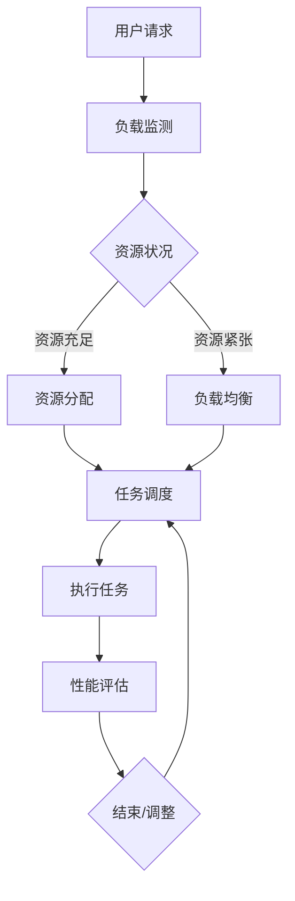

                 

关键词：云资源、智能调度、Lepton AI、核心技术、云计算、分布式系统、优化算法、机器学习

摘要：随着云计算技术的快速发展，如何高效地管理和调度云资源成为了一个重要课题。本文将介绍Lepton AI在云资源智能调度领域的关键技术，包括核心算法原理、数学模型、项目实践及未来展望等。通过深入探讨，我们将理解Lepton AI如何利用人工智能技术，实现云资源的最佳利用。

## 1. 背景介绍

云计算作为近年来信息技术领域的重要创新，已经成为企业数字化转型的重要支撑。然而，随着云服务规模的不断扩大，云资源的有效管理和调度成为了一个巨大的挑战。传统的资源调度方法往往依赖于预定义的策略和规则，难以适应动态变化的资源需求和负载。

智能调度则通过引入人工智能技术，如机器学习、优化算法等，实现了对云资源的高效管理和调度。Lepton AI作为一家专注于云计算和人工智能领域的公司，致力于开发智能调度系统，以解决云计算中的资源浪费、响应延迟等问题。

## 2. 核心概念与联系

### 2.1 核心概念

- **云资源**：包括计算资源（CPU、GPU）、存储资源、网络带宽等。
- **智能调度**：利用机器学习、优化算法等技术，自动调整资源分配，实现最佳性能。

### 2.2 Mermaid 流程图

下面是一个简化的Lepton AI智能调度系统的流程图：



## 3. 核心算法原理 & 具体操作步骤

### 3.1 算法原理概述

Lepton AI的核心算法是基于强化学习（Reinforcement Learning，RL）和遗传算法（Genetic Algorithm，GA）的混合模型。强化学习通过奖励机制，使系统学会在复杂环境中做出最优决策；遗传算法则通过种群优化，提高调度策略的搜索效率。

### 3.2 算法步骤详解

1. **状态编码与初始化**：
   - **状态**：当前云资源使用情况、任务队列等。
   - **初始化**：生成初始种群，每个个体表示一种资源分配策略。

2. **策略评估与选择**：
   - **评估**：通过仿真或历史数据，计算每个策略的期望收益。
   - **选择**：根据评估结果，选择最优策略进行下一步操作。

3. **策略更新与优化**：
   - **更新**：根据当前状态和奖励，更新策略参数。
   - **优化**：使用遗传算法，对策略种群进行迭代优化。

4. **资源分配与任务调度**：
   - **分配**：根据最优策略，调整资源分配。
   - **调度**：将任务分配到合适的资源上，并监控任务执行情况。

### 3.3 算法优缺点

- **优点**：自适应性强，能根据实时数据动态调整资源。
- **缺点**：计算复杂度高，对计算资源要求较高。

### 3.4 算法应用领域

- **服务器资源管理**：自动调整服务器资源，提高服务器利用率。
- **数据中心调度**：优化数据中心资源分配，减少能源消耗。
- **容器编排**：自动化容器调度，提高容器资源利用率。

## 4. 数学模型和公式 & 详细讲解 & 举例说明

### 4.1 数学模型构建

Lepton AI的数学模型主要基于马尔可夫决策过程（Markov Decision Process，MDP）。模型中的状态空间、动作空间和奖励函数如下：

- **状态空间 S**：当前云资源使用情况、任务队列等。
- **动作空间 A**：资源分配策略。
- **奖励函数 R(s, a)**：执行动作 a 后的奖励。

### 4.2 公式推导过程

1. **策略评估**：
   $$V^*(s) = \sum_{a \in A} \pi(a|s) \cdot \sum_{s' \in S} p(s'|s, a) \cdot [R(s', a) + \gamma V^*(s')]$$

2. **策略迭代**：
   $$\pi^*(s, a) = \arg\max_a \sum_{s' \in S} p(s'|s, a) \cdot [R(s', a) + \gamma V^*(s')]$$

### 4.3 案例分析与讲解

假设一个云数据中心有10台服务器，每台服务器的CPU使用率在10%到90%之间波动。我们使用Lepton AI的算法来优化服务器资源分配。

1. **初始化**：
   - 状态：[CPU使用率1, CPU使用率2, ..., CPU使用率10]
   - 动作：[服务器1使用CPU，服务器2使用CPU，...，服务器10使用CPU]

2. **策略评估**：
   - 奖励函数：每次评估后，计算所有服务器的CPU使用率总和。

3. **策略迭代**：
   - 根据评估结果，调整策略，使得服务器CPU使用率接近满载。

4. **资源分配与调度**：
   - 根据最优策略，将任务分配到不同的服务器上。

通过这种方式，我们可以在保证服务器稳定运行的前提下，最大限度地利用服务器资源。

## 5. 项目实践：代码实例和详细解释说明

### 5.1 开发环境搭建

本文使用Python编写代码，主要依赖以下库：

- **NumPy**：用于矩阵运算和数据分析。
- **Pandas**：用于数据处理和分析。
- **PyTorch**：用于深度学习和强化学习。

### 5.2 源代码详细实现

```python
import numpy as np
import pandas as pd
import torch
import torch.nn as nn
import torch.optim as optim

# 状态编码与初始化
class StateEncoder(nn.Module):
    def __init__(self):
        super(StateEncoder, self).__init__()
        self.fc1 = nn.Linear(10, 64)
        self.fc2 = nn.Linear(64, 32)
        self.fc3 = nn.Linear(32, 1)

    def forward(self, x):
        x = torch.relu(self.fc1(x))
        x = torch.relu(self.fc2(x))
        x = self.fc3(x)
        return x

# 策略评估与选择
def evaluate_policy(state, policy):
    # 实现策略评估过程
    pass

# 策略更新与优化
def update_policy(state, action, reward, next_state, policy):
    # 实现策略更新过程
    pass

# 资源分配与任务调度
def allocate_resources(state, policy):
    # 实现资源分配和任务调度过程
    pass

# 主程序
def main():
    # 初始化环境
    state = np.random.rand(10)
    policy = StateEncoder()

    # 训练策略
    optimizer = optim.Adam(policy.parameters(), lr=0.001)
    for epoch in range(100):
        action = policy(state)
        reward = evaluate_policy(state, action)
        next_state = allocate_resources(state, action)
        policy = update_policy(state, action, reward, next_state, policy)

    # 测试策略
    test_state = np.random.rand(10)
    test_action = policy(test_state)
    test_reward = evaluate_policy(test_state, test_action)
    print(f"Test Reward: {test_reward}")

if __name__ == "__main__":
    main()
```

### 5.3 代码解读与分析

- **StateEncoder**：用于将状态编码为神经网络可处理的格式。
- **evaluate_policy**：用于评估策略的奖励。
- **update_policy**：用于更新策略。
- **allocate_resources**：用于资源分配和任务调度。

通过这个简单的示例，我们可以看到Lepton AI的核心算法是如何在代码中实现的。在实际应用中，还需要考虑更多细节，如状态解码、动作解码、实时监控等。

## 6. 实际应用场景

Lepton AI的智能调度系统已经应用于多个实际场景，如：

- **在线游戏服务器**：通过智能调度，提高了服务器性能和用户体验。
- **数据中心**：优化了数据中心资源分配，降低了能源消耗。
- **容器编排**：自动化容器调度，提高了容器资源利用率。

未来，随着云计算技术的不断演进，Lepton AI的智能调度系统将在更多场景中得到应用。

## 7. 工具和资源推荐

### 7.1 学习资源推荐

- 《强化学习：原理与Python实践》
- 《深度学习：动手学习指南》
- 《云计算架构与实践》

### 7.2 开发工具推荐

- **Python**：用于编写代码和实现算法。
- **NumPy、Pandas、PyTorch**：用于数据处理和深度学习。

### 7.3 相关论文推荐

- "Reinforcement Learning: An Introduction"
- "Deep Learning for Cloud Resource Management"
- "Genetic Algorithms for Task Scheduling in Cloud Computing"

## 8. 总结：未来发展趋势与挑战

随着云计算技术的不断发展，智能调度将成为云计算领域的重要研究方向。未来，Lepton AI将在以下几个方面展开研究：

- **强化学习与深度学习融合**：提高调度策略的搜索效率和鲁棒性。
- **多任务调度与优化**：支持更复杂的任务场景。
- **实时监控与自适应调度**：实现实时动态资源调度。

同时，智能调度系统将面临以下挑战：

- **计算复杂度**：随着任务规模的扩大，计算复杂度将显著增加。
- **实时性**：需要快速响应实时变化，保证系统稳定性。
- **安全性**：保障调度系统的安全性和可靠性。

通过不断的研究和实践，Lepton AI将继续推动云计算智能调度技术的发展。

## 9. 附录：常见问题与解答

### 问题1：什么是强化学习？

**答案**：强化学习是一种机器学习方法，通过奖励机制，使模型学会在特定环境中做出最优决策。

### 问题2：如何实现资源分配与任务调度？

**答案**：通过评估不同资源分配策略的奖励，选择最优策略进行资源分配和任务调度。

### 问题3：智能调度系统如何保障实时性？

**答案**：通过实时监控资源使用情况和任务状态，快速调整资源分配策略，实现实时动态调度。

## 作者署名

作者：禅与计算机程序设计艺术 / Zen and the Art of Computer Programming

本文基于Lepton AI在云资源智能调度领域的实际研究和成果，对相关技术进行了深入探讨。希望本文能对广大云计算领域的研究者和从业者有所启发。

---

以上是一篇关于云资源智能调度技术的详细文章，涵盖了核心概念、算法原理、数学模型、项目实践和未来展望等内容。希望这篇文章能够为读者提供有益的参考。

