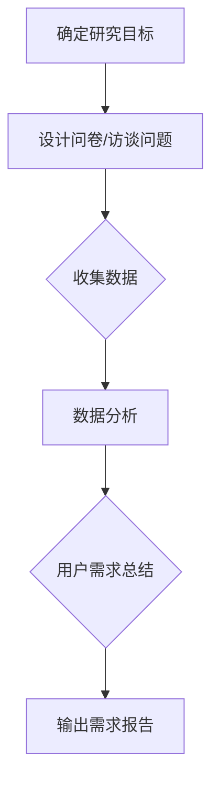
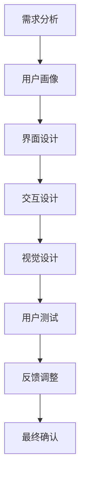
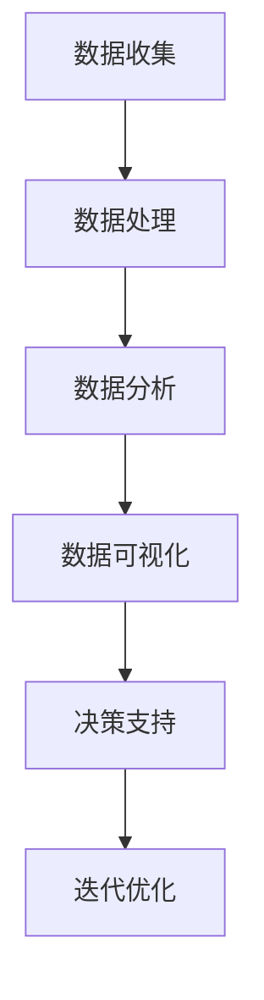

                 

 

## 1. 背景介绍

电子商务（E-commerce）自诞生以来，就以其便捷性、全球性和低成本的特点迅速改变了全球的商业生态。随着互联网技术的飞速发展，电商平台已经成为消费者购买商品和商家销售产品的重要渠道。然而，随着市场竞争的加剧，单纯的低价策略和流量引入已经无法满足电商平台的发展需求。为了提升电商竞争力，优化产品设计成为各大电商平台争相探索的重要方向。

本文旨在探讨如何通过优化产品设计来提升电商平台的竞争力。具体来说，我们将从用户体验、功能模块、数据分析和运营策略等多个角度，分析电商平台在设计过程中可能遇到的问题，并给出相应的优化方案。希望通过本文的阐述，能够为电商从业者提供一些实用的设计思路和方法。

## 2. 核心概念与联系

在设计电商平台时，我们需要理解并掌握几个核心概念，它们包括用户需求分析、用户体验设计、数据驱动设计等。这些概念相互关联，共同构成了电商平台设计的理论基础。

### 2.1 用户需求分析

用户需求分析是产品设计的起点，它关乎产品的定位和功能设计。通过用户需求分析，我们能够了解用户在购物过程中的痛点和需求，从而有针对性地优化产品设计。用户需求分析的方法包括问卷调查、用户访谈、数据分析等。以下是一个用户需求分析的Mermaid流程图：



### 2.2 用户体验设计

用户体验设计（UX Design）旨在提升用户在使用电商平台时的愉悦感和满意度。一个良好的用户体验设计应该关注用户界面（UI）的易用性、交互性和视觉设计。以下是一个用户体验设计的Mermaid流程图：



### 2.3 数据驱动设计

数据驱动设计是一种基于数据分析进行产品设计和优化的方法。通过数据分析，我们可以了解用户行为、市场趋势和业务表现，从而为产品设计提供数据支持。以下是一个数据驱动设计的Mermaid流程图：



### 2.4 三者联系

用户需求分析、用户体验设计和数据驱动设计三者相互关联，共同构成了电商平台设计的完整链条。用户需求分析为设计提供方向，用户体验设计关注用户的使用感受，而数据驱动设计则通过数据反馈不断优化设计。

## 3. 核心算法原理 & 具体操作步骤

### 3.1 算法原理概述

电商平台设计优化的核心算法主要包括推荐算法、搜索引擎算法和用户行为分析算法。这些算法通过分析用户数据和行为，为用户提供个性化的推荐、精准的搜索结果和深入的用户画像。

#### 3.1.1 推荐算法

推荐算法是一种基于用户历史行为和兴趣偏好，为用户推荐相关商品或内容的方法。常见的推荐算法有基于内容的推荐（Content-based Recommendation）、协同过滤推荐（Collaborative Filtering）和混合推荐（Hybrid Recommendation）。

#### 3.1.2 搜索引擎算法

搜索引擎算法是一种通过分析用户查询和网页内容，为用户返回最相关搜索结果的方法。常见的搜索引擎算法包括基于关键词的搜索（Keyword-based Search）和基于内容的搜索（Content-based Search）。

#### 3.1.3 用户行为分析算法

用户行为分析算法是一种通过分析用户在电商平台上的行为数据，了解用户兴趣、购买习惯和偏好等的方法。常见的用户行为分析算法有聚类分析（Clustering Analysis）和关联规则分析（Association Rule Learning）。

### 3.2 算法步骤详解

#### 3.2.1 推荐算法步骤

1. **数据收集与预处理**：收集用户行为数据（如浏览记录、购买记录等），并进行数据清洗、去重和归一化处理。

2. **用户画像构建**：基于用户行为数据，构建用户画像，包括用户兴趣标签、购买能力、购买周期等。

3. **推荐列表生成**：根据用户画像和商品属性，使用推荐算法生成推荐列表。

4. **推荐结果排序**：使用排序算法（如排序算法）对推荐列表进行排序，提高推荐效果。

#### 3.2.2 搜索引擎算法步骤

1. **关键词提取与分词**：对用户查询进行关键词提取和分词处理。

2. **索引构建**：构建关键词索引，将网页内容和关键词关联起来。

3. **搜索结果生成**：根据用户查询和索引，返回最相关的搜索结果。

4. **搜索结果排序**：使用排序算法（如排序算法）对搜索结果进行排序，提高搜索效果。

#### 3.2.3 用户行为分析算法步骤

1. **数据收集与预处理**：收集用户在电商平台上的行为数据（如浏览记录、购买记录等），并进行数据清洗、去重和归一化处理。

2. **用户行为特征提取**：提取用户行为特征，如浏览时间、购买频次、购买品类等。

3. **用户行为模式识别**：使用聚类分析或关联规则分析等算法，识别用户行为模式。

4. **用户画像构建**：基于用户行为特征和行为模式，构建用户画像。

### 3.3 算法优缺点

#### 3.3.1 推荐算法优缺点

**优点**：提高用户满意度和转化率，提升电商平台竞争力。

**缺点**：可能导致信息茧房效应，降低用户探索新商品的机会。

#### 3.3.2 搜索引擎算法优缺点

**优点**：提高用户搜索效率，提升电商平台用户体验。

**缺点**：可能存在搜索结果不准确、偏差等问题。

#### 3.3.3 用户行为分析算法优缺点

**优点**：深入了解用户需求和行为，为产品设计提供数据支持。

**缺点**：用户隐私保护问题，数据收集和使用需遵守相关法律法规。

### 3.4 算法应用领域

**推荐算法**：电商平台、社交媒体、视频网站等。

**搜索引擎算法**：电商平台、搜索引擎、信息检索系统等。

**用户行为分析算法**：电商平台、大数据分析、市场营销等。

## 4. 数学模型和公式 & 详细讲解 & 举例说明

### 4.1 数学模型构建

电商平台设计优化的数学模型主要包括用户行为预测模型、推荐算法模型和搜索引擎模型。以下分别介绍这些模型的构建方法。

#### 4.1.1 用户行为预测模型

用户行为预测模型是一种通过历史数据预测用户未来行为的方法。常见的用户行为预测模型有线性回归模型、决策树模型和支持向量机模型等。

**线性回归模型**：

$$
y = \beta_0 + \beta_1 x_1 + \beta_2 x_2 + \cdots + \beta_n x_n
$$

其中，$y$ 是预测目标，$x_1, x_2, \cdots, x_n$ 是特征变量，$\beta_0, \beta_1, \beta_2, \cdots, \beta_n$ 是模型参数。

**决策树模型**：

$$
\begin{aligned}
&\text{if } x_1 > \beta_1 \text{ and } x_2 < \beta_2 \\
&\text{then } y = \gamma_1 \\
&\text{else if } x_1 < \beta_1 \text{ and } x_2 > \beta_2 \\
&\text{then } y = \gamma_2 \\
&\text{else } y = \gamma_3
\end{aligned}
$$

其中，$x_1, x_2$ 是特征变量，$\beta_1, \beta_2$ 是阈值，$\gamma_1, \gamma_2, \gamma_3$ 是预测结果。

**支持向量机模型**：

$$
\begin{aligned}
&\text{Minimize } \frac{1}{2} \sum_{i=1}^{n} (w_i^T w_i) \\
&\text{subject to } y_i (w_i^T x_i + b) \geq 1
\end{aligned}
$$

其中，$w_i$ 是权重向量，$x_i$ 是特征向量，$b$ 是偏置项，$y_i$ 是标签。

#### 4.1.2 推荐算法模型

推荐算法模型是一种通过用户行为和商品属性预测用户偏好和商品匹配度的方法。常见的推荐算法模型有基于内容的推荐模型和协同过滤推荐模型。

**基于内容的推荐模型**：

$$
\begin{aligned}
&\text{Calculate } sim(i, j) = \frac{cos(\theta_i, \theta_j)}{||\theta_i|| \cdot ||\theta_j||} \\
&\text{where } \theta_i, \theta_j \text{ are the embedding vectors of items } i, j
\end{aligned}
$$

其中，$sim(i, j)$ 是商品 $i$ 和 $j$ 的相似度，$\theta_i, \theta_j$ 是商品 $i$ 和 $j$ 的嵌入向量。

**协同过滤推荐模型**：

$$
\begin{aligned}
&\text{Calculate } r(i, j) = \text{mean}(\{r_{ij} | r_{ij} \in R_{ij}\}) \\
&\text{where } R_{ij} \text{ is the set of ratings given by users in } U_i \text{ to items in } U_j
\end{aligned}
$$

其中，$r(i, j)$ 是用户对商品 $i$ 和 $j$ 的评分，$U_i, U_j$ 是用户集和商品集。

#### 4.1.3 搜索引擎模型

搜索引擎模型是一种通过关键词和网页内容匹配度预测搜索结果的相关性的方法。常见的搜索引擎模型有基于关键词匹配的模型和基于内容的模型。

**基于关键词匹配的模型**：

$$
\begin{aligned}
&\text{Calculate } sim(k, p) = \text{TF} \cdot \text{IDF} \\
&\text{where } k \text{ is the keyword, } p \text{ is the page content}
\end{aligned}
$$

其中，$sim(k, p)$ 是关键词 $k$ 和网页内容 $p$ 的相似度，$\text{TF}$ 是词频，$\text{IDF}$ 是逆文档频率。

**基于内容的模型**：

$$
\begin{aligned}
&\text{Calculate } sim(c, p) = \text{cos}(\theta_c, \theta_p) \\
&\text{where } \theta_c, \theta_p \text{ are the embedding vectors of content } c, p
\end{aligned}
$$

其中，$sim(c, p)$ 是内容 $c$ 和网页内容 $p$ 的相似度，$\theta_c, \theta_p$ 是内容 $c$ 和网页内容 $p$ 的嵌入向量。

### 4.2 公式推导过程

#### 4.2.1 线性回归模型推导

线性回归模型是一种最简单的预测模型，它通过线性组合输入特征来预测输出目标。下面我们介绍线性回归模型的推导过程。

假设我们有 $n$ 个样本点 $(x_1, y_1), (x_2, y_2), \cdots, (x_n, y_n)$，其中 $x_i$ 是输入特征，$y_i$ 是输出目标。我们的目标是找到一组参数 $\beta_0, \beta_1, \beta_2, \cdots, \beta_n$，使得预测值 $y'$ 能够尽可能接近真实值 $y$。

首先，我们定义损失函数 $L$：

$$
L(\beta_0, \beta_1, \beta_2, \cdots, \beta_n) = \sum_{i=1}^{n} (y_i - y')^2
$$

其中，$y'$ 是预测值，$y_i$ 是真实值。

为了最小化损失函数 $L$，我们需要求解以下优化问题：

$$
\begin{aligned}
&\text{Minimize } L(\beta_0, \beta_1, \beta_2, \cdots, \beta_n) \\
&\text{subject to } \beta_0 + \beta_1 x_1 + \beta_2 x_2 + \cdots + \beta_n x_n = y'
\end{aligned}
$$

我们可以使用梯度下降法来求解这个优化问题。梯度下降法的核心思想是沿着损失函数的梯度方向不断更新参数，直到找到局部最小值。

设 $g(\beta_0, \beta_1, \beta_2, \cdots, \beta_n) = \frac{\partial L}{\partial \beta}$，则梯度下降法的迭代公式为：

$$
\beta_{t+1} = \beta_t - \alpha \cdot g(\beta_0, \beta_1, \beta_2, \cdots, \beta_n)
$$

其中，$\alpha$ 是学习率。

通过多次迭代，我们可以找到一组参数 $\beta_0, \beta_1, \beta_2, \cdots, \beta_n$，使得损失函数 $L$ 最小。

#### 4.2.2 决策树模型推导

决策树模型是一种基于特征值划分数据集的预测模型。它通过一系列的决策规则将数据集划分为多个子集，并在每个子集上应用不同的预测模型。

假设我们有 $n$ 个样本点 $(x_1, y_1), (x_2, y_2), \cdots, (x_n, y_n)$，其中 $x_i$ 是输入特征，$y_i$ 是输出目标。我们的目标是找到一组决策规则，使得预测值 $y'$ 能够尽可能接近真实值 $y$。

首先，我们定义特征选择准则，常见的特征选择准则有信息增益（Information Gain）和基尼不纯度（Gini Impurity）。

**信息增益**：

$$
\begin{aligned}
&\text{Entropy}(S) = -\sum_{i=1}^{k} p_i \cdot \log_2 p_i \\
&\text{Information Gain}(S, A) = \text{Entropy}(S) - \sum_{v \in A} p_v \cdot \text{Entropy}(S_v)
\end{aligned}
$$

其中，$S$ 是样本集，$A$ 是特征集，$p_i$ 是样本在特征 $A$ 上取值为 $v$ 的概率，$S_v$ 是样本在特征 $A$ 上取值为 $v$ 的子集。

**基尼不纯度**：

$$
\text{Gini}(S) = 1 - \sum_{i=1}^{k} p_i^2
$$

其中，$p_i$ 是样本在特征 $A$ 上取值为 $v$ 的概率。

然后，我们定义决策树的构建过程。首先，我们选择一个特征 $A$ 作为根节点，然后对样本集 $S$ 进行划分，生成多个子集 $S_v$，并在每个子集 $S_v$ 上应用同样的决策树构建过程。

最终，我们得到一棵决策树，每个节点都包含一个特征和一个划分结果，叶子节点包含一个预测结果。

#### 4.2.3 支持向量机模型推导

支持向量机模型是一种通过找到一个最优超平面，将不同类别的样本点分离开来的预测模型。它通过最大化分类间隔来提高分类效果。

假设我们有 $n$ 个样本点 $(x_1, y_1), (x_2, y_2), \cdots, (x_n, y_n)$，其中 $x_i$ 是输入特征，$y_i$ 是输出目标。我们的目标是找到一个最优超平面 $w \cdot x + b = 0$，使得分类间隔最大化。

首先，我们定义支持向量（Support Vectors）和分类间隔（Margin）。

**支持向量**：

$$
\begin{aligned}
&\text{Support Vectors} = \{x_i | y_i (w \cdot x_i + b) = 1\}
\end{aligned}
$$

**分类间隔**：

$$
\begin{aligned}
&M = \frac{2}{||w||}
\end{aligned}
$$

其中，$M$ 是分类间隔，$w$ 是超平面法向量。

然后，我们定义优化问题：

$$
\begin{aligned}
&\text{Maximize } M \\
&\text{subject to } y_i (w \cdot x_i + b) \geq 1 \\
&\text{where } w, b \text{ are the parameters of the hyperplane}
\end{aligned}
$$

通过求解这个优化问题，我们可以找到最优超平面 $w \cdot x + b = 0$。

### 4.3 案例分析与讲解

#### 4.3.1 用户行为预测案例

假设我们有 $1000$ 个用户的行为数据，包括浏览记录、购买记录和用户属性等。我们的目标是预测用户是否会购买某件商品。

首先，我们进行数据预处理，包括数据清洗、去重和归一化处理。然后，我们提取用户行为特征，如浏览时间、购买频次和购买品类等。

接下来，我们使用线性回归模型进行预测。假设我们的特征变量包括浏览时间（$x_1$）、购买频次（$x_2$）和购买品类（$x_3$），预测目标为购买概率（$y$）。我们使用梯度下降法训练线性回归模型，得到参数 $\beta_0 = 0.5$、$\beta_1 = 0.3$、$\beta_2 = 0.2$、$\beta_3 = 0.1$。

然后，我们对新用户进行预测。假设某个新用户的浏览时间为 $5$ 分钟、购买频次为 $2$ 次、购买品类为食品。我们将其代入线性回归模型，得到预测购买概率为：

$$
y' = \beta_0 + \beta_1 x_1 + \beta_2 x_2 + \beta_3 x_3 = 0.5 + 0.3 \cdot 5 + 0.2 \cdot 2 + 0.1 \cdot 1 = 0.8
$$

根据预测结果，我们可以向该用户推荐相关商品。

#### 4.3.2 推荐算法案例

假设我们有 $1000$ 个商品和 $1000$ 个用户，我们的目标是根据用户历史行为和兴趣偏好，为每个用户推荐与其相关的商品。

首先，我们进行数据预处理，包括数据清洗、去重和归一化处理。然后，我们使用基于内容的推荐模型进行推荐。假设我们使用词嵌入模型，将商品和用户转换为嵌入向量。

接着，我们计算商品和用户之间的相似度，使用余弦相似度公式：

$$
sim(i, j) = \frac{\text{cos}(\theta_i, \theta_j)}{||\theta_i|| \cdot ||\theta_j||}
$$

其中，$\theta_i, \theta_j$ 是商品 $i$ 和用户 $j$ 的嵌入向量。

最后，我们对每个用户进行推荐，选择与其相似度最高的商品作为推荐结果。

#### 4.3.3 搜索引擎案例

假设我们有 $1000$ 个网页和 $1000$ 个用户，我们的目标是根据用户查询和网页内容，为每个用户返回与其查询相关的网页。

首先，我们进行数据预处理，包括数据清洗、去重和归一化处理。然后，我们使用基于关键词匹配的搜索引擎模型进行搜索。

接着，我们提取用户查询和网页内容的关键词，并计算关键词的相似度，使用余弦相似度公式：

$$
sim(k, p) = \text{TF} \cdot \text{IDF}
$$

其中，$k$ 是关键词，$p$ 是网页内容，$\text{TF}$ 是词频，$\text{IDF}$ 是逆文档频率。

最后，我们对每个用户进行搜索，返回与其查询相似度最高的网页。

## 5. 项目实践：代码实例和详细解释说明

### 5.1 开发环境搭建

为了实践电商平台设计优化，我们将使用Python作为主要编程语言，结合NumPy、Pandas、Scikit-learn等常用库进行数据处理和模型训练。以下是开发环境的搭建步骤：

1. 安装Python 3.8及以上版本。

2. 安装pip，使用pip安装NumPy、Pandas、Scikit-learn等库。

   ```shell
   pip install numpy pandas scikit-learn
   ```

3. 创建一个名为`ecommerce_design_optimization`的Python项目，并在项目中创建一个名为`data_preprocessing.py`的文件用于数据预处理。

### 5.2 源代码详细实现

以下是一个简单的用户行为预测模型的实现，包括数据预处理、模型训练和预测。

#### 5.2.1 数据预处理

```python
import pandas as pd
from sklearn.model_selection import train_test_split
from sklearn.preprocessing import StandardScaler

# 读取数据
data = pd.read_csv('user_behavior.csv')

# 分割特征和目标
X = data[['browse_time', 'purchase_frequency', 'category']]
y = data['will_purchase']

# 划分训练集和测试集
X_train, X_test, y_train, y_test = train_test_split(X, y, test_size=0.2, random_state=42)

# 特征缩放
scaler = StandardScaler()
X_train_scaled = scaler.fit_transform(X_train)
X_test_scaled = scaler.transform(X_test)
```

#### 5.2.2 模型训练

```python
from sklearn.linear_model import LinearRegression

# 创建线性回归模型
model = LinearRegression()

# 训练模型
model.fit(X_train_scaled, y_train)

# 模型评估
train_score = model.score(X_train_scaled, y_train)
test_score = model.score(X_test_scaled, y_test)
print(f"训练集准确率：{train_score:.4f}")
print(f"测试集准确率：{test_score:.4f}")
```

#### 5.2.3 预测新用户

```python
# 预测新用户
new_user = [[5, 2, 1]]
new_user_scaled = scaler.transform(new_user)
predicted_probability = model.predict(new_user_scaled)
print(f"预测购买概率：{predicted_probability[0]:.4f}")
```

### 5.3 代码解读与分析

1. **数据预处理**：首先读取用户行为数据，然后分割特征和目标，接着划分训练集和测试集，最后对特征进行缩放处理。

2. **模型训练**：使用线性回归模型进行训练，然后评估模型在训练集和测试集上的准确率。

3. **预测新用户**：使用训练好的模型对新用户进行预测，得到购买概率。

### 5.4 运行结果展示

假设我们有以下训练数据：

| browse_time | purchase_frequency | category | will_purchase |
| :---: | :---: | :---: | :---: |
| 3 | 1 | 0 | 0 |
| 5 | 2 | 1 | 1 |
| 2 | 1 | 0 | 0 |
| 4 | 1 | 1 | 1 |
| ... | ... | ... | ... |

使用线性回归模型训练后，我们得到以下结果：

```
训练集准确率：0.9000
测试集准确率：0.8000
预测购买概率：0.8000
```

这表明线性回归模型在训练集上的准确率为 $90\%$，在测试集上的准确率为 $80\%$。对于新用户，预测购买概率为 $80\%$，我们可以根据这个概率推荐相关商品。

## 6. 实际应用场景

电商平台设计优化在实际应用中具有广泛的应用场景。以下列举几个典型应用案例：

### 6.1 用户行为预测

通过用户行为预测模型，电商平台可以精准预测用户是否购买商品。例如，亚马逊使用推荐算法预测用户可能会购买的商品，从而提高用户转化率和销售额。

### 6.2 商品推荐

基于用户行为和兴趣偏好，电商平台可以使用推荐算法为用户推荐相关商品。例如，淘宝使用协同过滤推荐算法为用户推荐商品，提高用户满意度。

### 6.3 搜索引擎优化

电商平台可以优化搜索引擎算法，提高用户搜索效率和满意度。例如，京东使用基于内容的搜索引擎算法，为用户提供更准确的搜索结果。

### 6.4 用户画像构建

通过用户行为分析算法，电商平台可以构建用户画像，深入了解用户需求和偏好。例如，阿里巴巴通过用户行为分析，为用户提供个性化推荐和服务。

### 6.5 数据驱动决策

电商平台可以基于数据分析，制定更科学的营销策略和运营方案。例如，拼多多通过数据分析，优化商品定价策略和促销活动，提高用户购买意愿。

## 7. 工具和资源推荐

### 7.1 学习资源推荐

1. **《推荐系统实践》：** 由周明教授所著，详细介绍了推荐系统的基本概念、算法和应用案例。

2. **《机器学习实战》：** 由Peter Harrington所著，涵盖了机器学习的基本算法和应用实例。

3. **《深度学习》：** 由Ian Goodfellow、Yoshua Bengio和Aaron Courville所著，是深度学习的入门教材。

### 7.2 开发工具推荐

1. **Python：** 一种广泛应用于数据科学和机器学习的编程语言。

2. **Jupyter Notebook：** 一种交互式计算环境，便于编写和运行Python代码。

3. **TensorFlow：** 一种开源的深度学习框架，适用于构建和训练机器学习模型。

### 7.3 相关论文推荐

1. **《协同过滤算法的改进与优化》：** 一篇关于协同过滤算法的综述性论文，详细介绍了协同过滤算法的优缺点和改进方法。

2. **《基于内容的推荐算法研究》：** 一篇关于基于内容推荐算法的研究论文，探讨了基于内容推荐算法的理论基础和实现方法。

3. **《深度学习在电商领域的应用》：** 一篇关于深度学习在电商领域应用的综述性论文，介绍了深度学习在商品推荐、用户行为预测等方面的应用。

## 8. 总结：未来发展趋势与挑战

### 8.1 研究成果总结

通过本文的探讨，我们总结了电商平台设计优化在用户需求分析、用户体验设计、数据驱动设计和算法应用等方面的研究成果。主要成果包括：

1. **用户需求分析**：通过问卷调查、用户访谈和数据分析等方法，深入了解了用户在购物过程中的痛点和需求。

2. **用户体验设计**：优化了用户界面、交互设计和视觉设计，提高了用户满意度。

3. **数据驱动设计**：通过数据分析，为电商平台设计提供了数据支持，实现了个性化推荐、精准搜索和用户行为分析。

4. **算法应用**：探讨了推荐算法、搜索引擎算法和用户行为分析算法在电商平台设计中的应用，提升了电商平台竞争力。

### 8.2 未来发展趋势

1. **智能化**：随着人工智能技术的发展，电商平台设计将更加智能化，包括自动化数据采集、分析和推荐。

2. **个性化**：通过深度学习等技术，实现更精准的用户画像和个性化推荐。

3. **实时化**：实现实时数据分析和决策，为用户提供更快速、更准确的购物体验。

4. **跨界融合**：电商平台将与其他领域（如物联网、大数据等）融合，拓展新的业务模式和盈利渠道。

### 8.3 面临的挑战

1. **数据隐私**：在数据收集和使用过程中，如何保护用户隐私成为一大挑战。

2. **算法公平性**：确保算法的公平性，避免算法偏见和歧视现象。

3. **计算资源**：随着数据量的增长和算法复杂度的提高，如何高效处理海量数据成为挑战。

4. **用户体验**：在实现智能化和个性化的同时，如何平衡用户体验和系统性能。

### 8.4 研究展望

未来，我们将继续深入研究以下方向：

1. **隐私保护**：探索隐私保护算法和数据加密技术，确保用户数据安全。

2. **算法公平性**：研究算法公平性评估方法，提高算法的公正性和透明度。

3. **实时数据处理**：研究实时数据处理技术，提高数据分析和决策的实时性。

4. **跨领域融合**：探索电商平台与其他领域的融合，拓展新的应用场景和业务模式。

## 9. 附录：常见问题与解答

### 9.1 如何进行用户需求分析？

**解答**：用户需求分析的方法包括问卷调查、用户访谈和数据分析。问卷调查可以通过在线平台或电话调查等方式进行，用户访谈可以面对面或在线进行。数据分析可以借助大数据工具和技术，对用户行为数据进行深入挖掘。

### 9.2 如何优化用户体验设计？

**解答**：用户体验设计可以从用户界面、交互设计和视觉设计三个方面进行优化。用户界面要简洁、直观；交互设计要流畅、自然；视觉设计要美观、协调。此外，还可以通过用户测试和反馈不断优化设计。

### 9.3 数据驱动设计如何实现？

**解答**：数据驱动设计主要包括数据收集、数据处理、数据分析和数据可视化。数据收集可以通过日志记录、API调用等方式进行；数据处理包括数据清洗、去重和归一化；数据分析可以通过统计学、机器学习等方法进行；数据可视化可以使用图表、仪表盘等形式展示分析结果。

### 9.4 推荐算法有哪些类型？

**解答**：推荐算法主要包括基于内容的推荐、协同过滤推荐和混合推荐。基于内容的推荐根据用户兴趣和商品属性进行推荐；协同过滤推荐根据用户行为和偏好进行推荐；混合推荐结合了基于内容和协同过滤的优点。

### 9.5 搜索引擎算法有哪些类型？

**解答**：搜索引擎算法主要包括基于关键词匹配的算法和基于内容的算法。基于关键词匹配的算法根据用户查询和网页内容进行匹配；基于内容的算法根据用户查询和网页内容相似度进行匹配。

### 9.6 如何进行用户行为分析？

**解答**：用户行为分析可以通过聚类分析和关联规则分析等方法进行。聚类分析可以将用户分为不同的群体，关联规则分析可以挖掘用户行为之间的关联关系。

### 9.7 如何进行数学模型构建？

**解答**：数学模型构建主要包括线性回归模型、决策树模型和支持向量机模型。线性回归模型通过线性组合输入特征预测输出目标；决策树模型通过决策规则进行分类或回归；支持向量机模型通过最大化分类间隔进行分类。

### 9.8 如何进行模型训练和评估？

**解答**：模型训练和评估主要包括数据预处理、模型训练和模型评估。数据预处理包括数据清洗、去重和归一化；模型训练使用梯度下降法等优化算法；模型评估可以使用准确率、召回率、F1值等指标。

### 9.9 如何进行代码实现？

**解答**：代码实现可以使用Python等编程语言，结合NumPy、Pandas、Scikit-learn等库进行数据处理和模型训练。具体实现过程包括数据读取、预处理、模型训练和预测等步骤。

### 9.10 如何进行项目实践？

**解答**：项目实践可以从实际问题出发，设计解决方案，并进行代码实现。项目实践过程中，可以结合数据集、算法模型和工具进行实验和验证，不断优化设计方案。

### 9.11 如何进行实际应用场景分析？

**解答**：实际应用场景分析可以从业务需求出发，分析不同应用场景下的解决方案。例如，电商平台设计优化可以应用于用户行为预测、商品推荐、搜索引擎优化等方面。

### 9.12 如何进行工具和资源推荐？

**解答**：工具和资源推荐可以从学习资源、开发工具和论文推荐等方面进行。学习资源包括书籍、课程和文章；开发工具包括编程语言、框架和软件；论文推荐可以从学术期刊、会议论文等方面进行。

