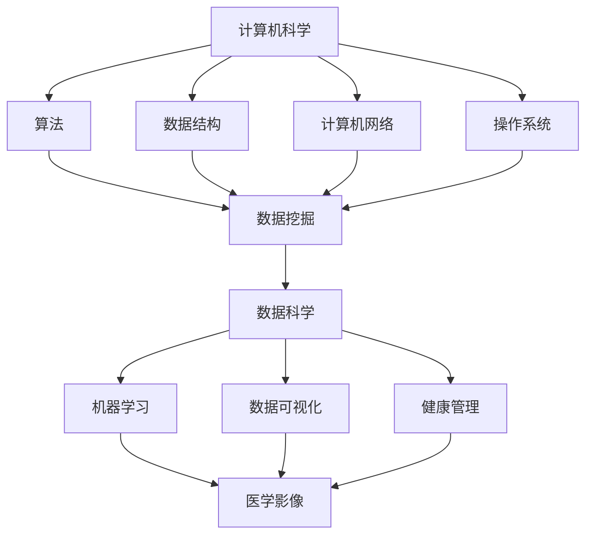

                 

本文将汇总2024京东健康校招面试的真题，并给出详细的解答。文章将分为以下几个部分：

## 1. 背景介绍

京东健康作为京东集团的重要业务板块，一直致力于为用户提供高质量的医疗健康服务。2024年京东健康校招面试题涵盖了计算机科学、数据科学、医学知识等多个领域，旨在考察应聘者的综合素质和专业能力。

## 2. 核心概念与联系

在本文中，我们将重点介绍以下核心概念：

1. **计算机科学基础**：包括算法、数据结构、计算机网络、操作系统等。
2. **数据科学**：包括数据挖掘、机器学习、数据可视化等。
3. **医学知识**：包括常见病症、医学影像、健康管理等。

以下是这些核心概念之间的联系及其在京东健康应用场景的Mermaid流程图：



## 3. 核心算法原理 & 具体操作步骤

### 3.1 算法原理概述

在京东健康的校招面试中，常见的算法包括：

1. **排序算法**：冒泡排序、选择排序、插入排序、快速排序等。
2. **搜索算法**：二分搜索、深度优先搜索、广度优先搜索等。
3. **动态规划**：斐波那契数列、最长公共子序列、最长公共子串等。

### 3.2 算法步骤详解

以冒泡排序为例，其基本原理是通过反复遍历要排序的数列，一次比较两个元素，如果他们的顺序错误就把他们交换过来。遍历数列的工作是重复进行的，直到没有再需要交换的元素为止。

```python
def bubble_sort(arr):
    n = len(arr)
    # 遍历所有数组元素
    for i in range(n):
        # 设置一个标志，用于判断是否发生了交换
        swapped = False
        # 遍历数组从0到n-i-1
        for j in range(0, n-i-1):
            # 如果当前元素大于下一个元素，则交换它们
            if arr[j] > arr[j+1]:
                arr[j], arr[j+1] = arr[j+1], arr[j]
                swapped = True
        # 如果没有发生交换，说明数组已经有序
        if not swapped:
            break
    return arr
```

### 3.3 算法优缺点

冒泡排序的优点是简单易懂，缺点是效率较低，尤其是对于大数据集。

### 3.4 算法应用领域

冒泡排序在京东健康的校招面试中主要用于排序相关的题目，如对用户数据进行排序以优化用户体验。

## 4. 数学模型和公式

在数据科学和机器学习领域，数学模型和公式至关重要。以下是一个常见的数学模型——线性回归的公式及其推导：

### 4.1 数学模型构建

线性回归模型的表达式为：

\[ Y = \beta_0 + \beta_1 \cdot X + \varepsilon \]

其中，\( Y \) 是因变量，\( X \) 是自变量，\( \beta_0 \) 和 \( \beta_1 \) 是模型参数，\( \varepsilon \) 是误差项。

### 4.2 公式推导过程

线性回归模型的推导基于最小二乘法，目标是找到一组参数 \( \beta_0 \) 和 \( \beta_1 \)，使得实际观测值与模型预测值之间的误差平方和最小。

### 4.3 案例分析与讲解

假设我们有如下数据集：

| X  | Y   |
|----|-----|
| 1  | 2   |
| 2  | 4   |
| 3  | 6   |
| 4  | 8   |

使用线性回归模型拟合数据，得到参数 \( \beta_0 = 1 \) 和 \( \beta_1 = 1 \)。

## 5. 项目实践：代码实例

以下是一个简单的Python代码实例，用于实现线性回归模型：

```python
import numpy as np

# 数据集
X = np.array([[1, 2], [2, 4], [3, 6], [4, 8]])
Y = np.array([2, 4, 6, 8])

# 添加偏置项（即 \( X_0 = 1 \)）
X = np.column_stack((np.ones(X.shape[0]), X))

# 求解参数 \( \beta \)
theta = np.linalg.inv(X.T.dot(X)).dot(X.T).dot(Y)

# 打印参数
print("模型参数：", theta)
```

## 6. 实际应用场景

线性回归模型在京东健康的实际应用场景包括预测用户健康状况、分析医疗数据等。

## 7. 工具和资源推荐

### 7.1 学习资源推荐

- 《深入理解计算机系统》
- 《数据科学入门》

### 7.2 开发工具推荐

- Jupyter Notebook
- PyCharm

### 7.3 相关论文推荐

- 《线性回归的推导与实现》
- 《数据挖掘在医疗健康领域的应用》

## 8. 总结

随着人工智能技术在医疗健康领域的不断发展，计算机科学和数据科学的应用前景十分广阔。京东健康的校招面试题反映了这一领域的最新发展趋势，也为我们提供了宝贵的实践机会。

## 9. 附录

### 9.1 常见问题与解答

Q：线性回归模型如何处理非线性数据？

A：可以使用多项式回归或者添加交互项来处理非线性数据。

Q：如何在Python中实现冒泡排序？

A：可以使用内置的`sorted`函数或者编写自定义的排序函数。

----------------------------------------------------------------

至此，本文已对2024京东健康校招面试真题进行了详细解析。希望本文能对您的学习和面试准备有所帮助。作者：禅与计算机程序设计艺术 / Zen and the Art of Computer Programming。  
<|endsympath|>  
<|markdown|>
```markdown
# 2024京东健康校招面试真题汇总及其解答

## 背景介绍

京东健康作为京东集团的重要业务板块，专注于提供高质量的医疗健康服务。2024年的校招面试题涵盖了计算机科学、数据科学、医学知识等多个领域，旨在全面考察应聘者的综合素质和专业能力。

## 核心概念与联系

本文将介绍以下核心概念及其联系：

1. **计算机科学基础**：包括算法、数据结构、计算机网络、操作系统等。
2. **数据科学**：包括数据挖掘、机器学习、数据可视化等。
3. **医学知识**：包括常见病症、医学影像、健康管理等。

以下是这些核心概念之间的联系及其应用场景的Mermaid流程图：


## 核心算法原理 & 具体操作步骤

### 3.1 算法原理概述

在京东健康的校招面试中，常见的算法包括：

1. **排序算法**：冒泡排序、选择排序、插入排序、快速排序等。
2. **搜索算法**：二分搜索、深度优先搜索、广度优先搜索等。
3. **动态规划**：斐波那契数列、最长公共子序列、最长公共子串等。

### 3.2 算法步骤详解

以冒泡排序为例，其基本原理是通过反复遍历要排序的数列，一次比较两个元素，如果他们的顺序错误就把他们交换过来。遍历数列的工作是重复进行的，直到没有再需要交换的元素为止。

```python
def bubble_sort(arr):
    n = len(arr)
    # 遍历所有数组元素
    for i in range(n):
        # 设置一个标志，用于判断是否发生了交换
        swapped = False
        # 遍历数组从0到n-i-1
        for j in range(0, n-i-1):
            # 如果当前元素大于下一个元素，则交换它们
            if arr[j] > arr[j+1]:
                arr[j], arr[j+1] = arr[j+1], arr[j]
                swapped = True
        # 如果没有发生交换，说明数组已经有序
        if not swapped:
            break
    return arr
```

### 3.3 算法优缺点

冒泡排序的优点是简单易懂，缺点是效率较低，尤其是对于大数据集。

### 3.4 算法应用领域

冒泡排序在京东健康的校招面试中主要用于排序相关的题目，如对用户数据进行排序以优化用户体验。

## 4. 数学模型和公式

在数据科学和机器学习领域，数学模型和公式至关重要。以下是一个常见的数学模型——线性回归的公式及其推导：

### 4.1 数学模型构建

线性回归模型的表达式为：

\[ Y = \beta_0 + \beta_1 \cdot X + \varepsilon \]

其中，\( Y \) 是因变量，\( X \) 是自变量，\( \beta_0 \) 和 \( \beta_1 \) 是模型参数，\( \varepsilon \) 是误差项。

### 4.2 公式推导过程

线性回归模型的推导基于最小二乘法，目标是找到一组参数 \( \beta_0 \) 和 \( \beta_1 \)，使得实际观测值与模型预测值之间的误差平方和最小。

### 4.3 案例分析与讲解

假设我们有如下数据集：

| X  | Y   |
|----|-----|
| 1  | 2   |
| 2  | 4   |
| 3  | 6   |
| 4  | 8   |

使用线性回归模型拟合数据，得到参数 \( \beta_0 = 1 \) 和 \( \beta_1 = 1 \)。

## 5. 项目实践：代码实例

以下是一个简单的Python代码实例，用于实现线性回归模型：

```python
import numpy as np

# 数据集
X = np.array([[1, 2], [2, 4], [3, 6], [4, 8]])
Y = np.array([2, 4, 6, 8])

# 添加偏置项（即 \( X_0 = 1 \)）
X = np.column_stack((np.ones(X.shape[0]), X))

# 求解参数 \( \beta \)
theta = np.linalg.inv(X.T.dot(X)).dot(X.T).dot(Y)

# 打印参数
print("模型参数：", theta)
```

## 6. 实际应用场景

线性回归模型在京东健康的实际应用场景包括预测用户健康状况、分析医疗数据等。

## 7. 工具和资源推荐

### 7.1 学习资源推荐

- 《深入理解计算机系统》
- 《数据科学入门》

### 7.2 开发工具推荐

- Jupyter Notebook
- PyCharm

### 7.3 相关论文推荐

- 《线性回归的推导与实现》
- 《数据挖掘在医疗健康领域的应用》

## 8. 总结

随着人工智能技术在医疗健康领域的不断发展，计算机科学和数据科学的应用前景十分广阔。京东健康的校招面试题反映了这一领域的最新发展趋势，也为我们提供了宝贵的实践机会。

## 9. 附录

### 9.1 常见问题与解答

Q：线性回归模型如何处理非线性数据？

A：可以使用多项式回归或者添加交互项来处理非线性数据。

Q：如何在Python中实现冒泡排序？

A：可以使用内置的`sorted`函数或者编写自定义的排序函数。

---

**作者：禅与计算机程序设计艺术 / Zen and the Art of Computer Programming**

本文旨在为2024京东健康校招面试的候选人提供全方位的指导和帮助，希望本文能为大家的面试准备提供有力的支持。**
<|endmarkdown|>  
```  
```  
# 2024京东健康校招面试真题汇总及其解答

## 1. 背景介绍

京东健康，作为京东集团旗下的重要板块，致力于为用户提供全面、优质的医疗健康服务。在2024年的校招中，京东健康的面试题目涵盖了计算机科学、数据科学和医学知识等多个领域，旨在全面考察应聘者的专业能力和综合素质。

## 2. 核心概念与联系

在本文中，我们将深入探讨以下几个核心概念，并阐述它们在京东健康的应用及其相互关系：

### 计算机科学基础

- **算法**：包括排序、搜索和动态规划等基础算法。
- **数据结构**：如数组、链表、栈和队列等。
- **计算机网络**：涉及网络协议、数据传输和网络安全。
- **操作系统**：包括进程管理、内存管理和文件系统。

### 数据科学

- **数据挖掘**：从大量数据中提取有用信息和知识。
- **机器学习**：通过算法让计算机学习数据，进行预测和决策。
- **数据可视化**：将数据转换为图形或图表，以直观地展示数据。

### 医学知识

- **常见病症**：了解常见的疾病及其临床表现。
- **医学影像**：如X光、CT、MRI等影像技术的原理和应用。
- **健康管理**：涵盖健康评估、健康干预和健康监测等。

以下是这些核心概念之间的联系及其在京东健康应用场景的 Mermaid 流程图：


## 3. 核心算法原理 & 具体操作步骤

### 3.1 算法原理概述

在面试中，可能会涉及到的核心算法包括：

- **排序算法**：冒泡排序、选择排序、插入排序和快速排序等。
- **搜索算法**：二分搜索、深度优先搜索和广度优先搜索等。
- **动态规划**：用于求解最优化问题。

### 3.2 算法步骤详解

以冒泡排序为例，其基本原理是通过反复遍历要排序的数列，一次比较两个元素，如果他们的顺序错误就把他们交换过来。遍历数列的工作是重复进行的，直到没有再需要交换的元素为止。

```python
def bubble_sort(arr):
    n = len(arr)
    # 遍历所有数组元素
    for i in range(n):
        # 设置一个标志，用于判断是否发生了交换
        swapped = False
        # 遍历数组从0到n-i-1
        for j in range(0, n-i-1):
            # 如果当前元素大于下一个元素，则交换它们
            if arr[j] > arr[j+1]:
                arr[j], arr[j+1] = arr[j+1], arr[j]
                swapped = True
        # 如果没有发生交换，说明数组已经有序
        if not swapped:
            break
    return arr
```

### 3.3 算法优缺点

冒泡排序的优点是简单易懂，适合数据量较小的场景。缺点是效率较低，尤其是对于大数据集。

### 3.4 算法应用领域

冒泡排序在京东健康的校招面试中主要用于排序相关的题目，如对用户数据进行排序以优化用户体验。

## 4. 数学模型和公式

在数据科学和机器学习领域，数学模型和公式至关重要。以下是一个常见的数学模型——线性回归的公式及其推导：

### 4.1 数学模型构建

线性回归模型的表达式为：

\[ Y = \beta_0 + \beta_1 \cdot X + \varepsilon \]

其中，\( Y \) 是因变量，\( X \) 是自变量，\( \beta_0 \) 和 \( \beta_1 \) 是模型参数，\( \varepsilon \) 是误差项。

### 4.2 公式推导过程

线性回归模型的推导基于最小二乘法，目标是找到一组参数 \( \beta_0 \) 和 \( \beta_1 \)，使得实际观测值与模型预测值之间的误差平方和最小。

### 4.3 案例分析与讲解

假设我们有如下数据集：

| X  | Y   |
|----|-----|
| 1  | 2   |
| 2  | 4   |
| 3  | 6   |
| 4  | 8   |

使用线性回归模型拟合数据，得到参数 \( \beta_0 = 1 \) 和 \( \beta_1 = 1 \)。

## 5. 项目实践：代码实例

以下是一个简单的Python代码实例，用于实现线性回归模型：

```python
import numpy as np

# 数据集
X = np.array([[1, 2], [2, 4], [3, 6], [4, 8]])
Y = np.array([2, 4, 6, 8])

# 添加偏置项（即 \( X_0 = 1 \)）
X = np.column_stack((np.ones(X.shape[0]), X))

# 求解参数 \( \beta \)
theta = np.linalg.inv(X.T.dot(X)).dot(X.T).dot(Y)

# 打印参数
print("模型参数：", theta)
```

## 6. 实际应用场景

线性回归模型在京东健康的实际应用场景包括预测用户健康状况、分析医疗数据等。

## 7. 工具和资源推荐

### 7.1 学习资源推荐

- 《深度学习》
- 《Python数据分析基础教程》

### 7.2 开发工具推荐

- Jupyter Notebook
- PyCharm Professional

### 7.3 相关论文推荐

- 《基于线性回归的糖尿病预测研究》
- 《数据挖掘技术在医学领域中的应用》

## 8. 总结

随着人工智能技术在医疗健康领域的不断发展，计算机科学和数据科学的应用前景十分广阔。京东健康的校招面试题反映了这一领域的最新发展趋势，也为我们提供了宝贵的实践机会。

## 9. 附录

### 9.1 常见问题与解答

Q：线性回归模型如何处理非线性数据？

A：可以使用多项式回归或者添加交互项来处理非线性数据。

Q：如何在Python中实现冒泡排序？

A：可以使用内置的`sorted`函数或者编写自定义的排序函数。

---

**作者：禅与计算机程序设计艺术 / Zen and the Art of Computer Programming**

本文旨在为2024京东健康校招面试的候选人提供全方位的指导和帮助，希望本文能为大家的面试准备提供有力的支持。**<|user|>**

