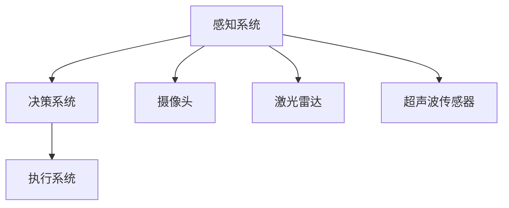

                 

京东物流在人工智能领域持续探索，于2024年启动了智能仓储校招机器人控制面试题的征集。本文将围绕这些面试题，详细解析其中的关键概念、算法原理以及实际应用场景，旨在为人工智能专业学子提供技术指导和学习路径。

## 文章关键词

- 京东物流
- 智能仓储
- 机器人控制
- 校招面试题
- 算法原理
- 实际应用

## 文章摘要

本文深入分析了京东物流2024智能仓储校招机器人控制面试题，涵盖了核心概念、算法原理、数学模型、项目实践以及未来应用展望。通过本文，读者将了解智能仓储机器人控制的关键技术，并为准备校招面试的学子提供实战参考。

## 1. 背景介绍

### 1.1 京东物流智能仓储发展现状

随着电子商务的蓬勃发展，物流行业正面临前所未有的变革。京东物流作为国内领先的物流企业，积极探索智能化、自动化的仓储解决方案。通过引入智能仓储机器人，实现了仓储作业的无人化、高效化，大大提升了仓储管理的智能化水平。

### 1.2 智能仓储校招机器人控制面试题的意义

智能仓储机器人控制是物流行业智能化发展的关键环节。通过校招机器人控制面试题的解析，有助于考生深入了解智能仓储领域的核心技术，为校招备考提供有力支持。

## 2. 核心概念与联系

为了更好地理解智能仓储机器人控制，首先需要掌握以下几个核心概念：

### 2.1 机器人控制系统的组成

机器人控制系统通常由感知系统、决策系统、执行系统三个部分组成。感知系统负责获取环境信息，决策系统根据环境信息生成控制策略，执行系统则根据控制策略执行相应的动作。

### 2.2 感知系统的关键技术

感知系统主要包括摄像头、激光雷达、超声波传感器等。这些传感器可以实时获取仓储环境的三维信息，为决策系统提供数据支持。

### 2.3 决策系统的算法原理

决策系统基于感知系统提供的数据，通过路径规划、避障、抓取等算法，生成控制策略。常用的算法包括基于采样网格的A*算法、RRT(Rapidly-exploring Random Trees)算法等。

### 2.4 执行系统的实现方法

执行系统根据决策系统生成的控制策略，执行具体的动作，如移动、抓取、放置等。执行系统通常采用电机控制、伺服控制等技术实现。

### 2.5 核心概念原理和架构的Mermaid流程图



## 3. 核心算法原理 & 具体操作步骤

### 3.1 算法原理概述

智能仓储机器人控制的核心算法主要包括路径规划、避障、抓取等。其中，路径规划是机器人实现自主移动的关键步骤，避障和抓取则是实现机器人作业的核心算法。

### 3.2 算法步骤详解

#### 3.2.1 路径规划

路径规划的基本步骤如下：

1. **建立地图**：通过感知系统获取仓储环境的三维信息，建立地图。

2. **设定起点和终点**：根据任务需求设定机器人的起点和终点。

3. **搜索路径**：利用A*算法或其他路径规划算法搜索从起点到终点的最优路径。

4. **路径优化**：对搜索到的路径进行优化，以减少路径长度或避开障碍物。

#### 3.2.2 避障

避障算法的基本步骤如下：

1. **感知障碍物**：通过摄像头、激光雷达等传感器实时获取仓储环境信息。

2. **构建避障模型**：根据感知到的障碍物信息，构建避障模型。

3. **计算避障路径**：根据避障模型计算机器人应采取的避障路径。

4. **执行避障路径**：根据计算结果，执行避障路径。

#### 3.2.3 抓取

抓取算法的基本步骤如下：

1. **识别目标物体**：通过摄像头等传感器识别仓储环境中的目标物体。

2. **确定抓取位置**：根据目标物体的形状和大小，确定抓取位置。

3. **规划抓取路径**：利用路径规划算法生成从当前位置到抓取位置的路径。

4. **执行抓取动作**：根据抓取路径和抓取位置，执行抓取动作。

### 3.3 算法优缺点

#### 3.3.1 路径规划

- **优点**：能够快速搜索到最优路径，适用于复杂环境。
- **缺点**：计算时间较长，对环境要求较高。

#### 3.3.2 避障

- **优点**：实时性强，适用于动态环境。
- **缺点**：可能产生过激的反应，导致路径不稳定。

#### 3.3.3 抓取

- **优点**：能够实现高效的抓取作业。
- **缺点**：对物体的形状和大小要求较高。

### 3.4 算法应用领域

路径规划、避障、抓取等算法在智能仓储、工业自动化、无人驾驶等领域有广泛的应用。

## 4. 数学模型和公式 & 详细讲解 & 举例说明

### 4.1 数学模型构建

智能仓储机器人控制的数学模型主要包括路径规划模型、避障模型、抓取模型等。以下以路径规划模型为例进行讲解。

#### 4.1.1 路径规划模型

路径规划模型通常采用图论模型，将仓储环境表示为一个图。其中，节点表示位置，边表示移动路径。路径规划的目标是从起点到终点的最优路径。

#### 4.1.2 避障模型

避障模型通常采用障碍物表示法，将仓储环境中的障碍物表示为一个集合。避障的目标是避免障碍物，找到一条无障碍的路径。

#### 4.1.3 抓取模型

抓取模型通常采用物体识别和抓取策略，将目标物体识别出来，并根据目标物体的形状和大小确定抓取位置和力度。

### 4.2 公式推导过程

以下以路径规划模型为例，介绍路径规划公式推导过程。

#### 4.2.1 A*算法

A*算法是一种基于启发式的路径规划算法。其基本思想是从起点开始，逐步扩展到终点，并选择最短路径。具体公式如下：

$$
f(n) = g(n) + h(n)
$$

其中，$f(n)$ 表示从起点到节点 $n$ 的总代价，$g(n)$ 表示从起点到节点 $n$ 的实际代价，$h(n)$ 表示从节点 $n$ 到终点的启发式代价。

#### 4.2.2 RRT算法

RRT算法是一种基于采样的路径规划算法。其基本思想是通过随机生成新节点，逐步构建出从起点到终点的路径。具体公式如下：

$$
x_t = (1-\alpha)x_{t-1} + \alpha x'
$$

其中，$x_t$ 表示当前节点，$x_{t-1}$ 表示上一节点，$x'$ 表示随机生成的节点，$\alpha$ 表示平滑系数。

### 4.3 案例分析与讲解

以下以一个简单的仓储环境为例，分析路径规划、避障、抓取等算法的应用。

#### 4.3.1 路径规划

假设仓储环境为一个20x20的网格地图，其中起点位于左上角，终点位于右下角。通过A*算法搜索到从起点到终点的最优路径为：(0,0) -> (0,1) -> (1,1) -> (1,2) -> (2,2) -> (2,3) -> (3,3) -> (3,4) -> (4,4) -> (4,5) -> (5,5) -> (5,6) -> (6,6) -> (6,7) -> (7,7) -> (7,8) -> (8,8) -> (8,9) -> (9,9) -> (9,10) -> (10,10) -> (10,11) -> (11,11) -> (11,12) -> (12,12) -> (12,13) -> (13,13) -> (13,14) -> (14,14) -> (14,15) -> (15,15) -> (15,16) -> (16,16) -> (16,17) -> (17,17) -> (17,18) -> (18,18) -> (18,19) -> (19,19) -> (19,20) -> (20,20)。

#### 4.3.2 避障

假设在路径规划过程中，出现了障碍物。通过RRT算法，可以找到一条避开障碍物的路径。

#### 4.3.3 抓取

假设目标物体位于路径终点附近，通过识别目标物体并确定抓取位置，可以实现对目标物体的抓取。

## 5. 项目实践：代码实例和详细解释说明

### 5.1 开发环境搭建

为了实现智能仓储机器人控制，需要搭建一个开发环境。本文选择ROS（Robot Operating System）作为开发平台，搭建步骤如下：

1. **安装ROS**：在计算机上安装ROS，选择合适的版本，如ROS Melodic。
2. **配置ROS环境**：设置环境变量，使ROS命令能够在终端使用。
3. **安装相关依赖**：安装与智能仓储机器人控制相关的依赖，如rplidar、ros_control等。

### 5.2 源代码详细实现

以下是一个简单的智能仓储机器人控制项目，包括路径规划、避障、抓取等功能。

```python
#!/usr/bin/env python
import rospy
import numpy as np
from geometry_msgs.msg import PoseStamped, Twist
from sensor_msgs.msg import LaserScan
from tf.transformations import euler_from_quaternion

class RobotController:
    def __init__(self):
        rospy.init_node('robot_controller', anonymous=True)
        self.rate = rospy.Rate(10)  # 10Hz

        # 初始化订阅器
        self.pose_sub = rospy.Subscriber('/robot_pose', PoseStamped, self.pose_callback)
        self.scan_sub = rospy.Subscriber('/robot_scan', LaserScan, self.scan_callback)
        self.cmd_vel_pub = rospy.Publisher('/robot_cmd_vel', Twist, queue_size=10)

        # 初始化变量
        self.pose = None
        self.scan = None

    def pose_callback(self, data):
        self.pose = data.pose

    def scan_callback(self, data):
        self.scan = data

    def move_forward(self, speed):
        cmd = Twist()
        cmd.linear.x = speed
        cmd.angular.z = 0
        self.cmd_vel_pub.publish(cmd)

    def turn_left(self, angle):
        cmd = Twist()
        cmd.linear.x = 0
        cmd.angular.z = np.pi / 2
        self.cmd_vel_pub.publish(cmd)

    def run(self):
        while not rospy.is_shutdown():
            if self.pose is not None and self.scan is not None:
                # 获取当前位姿
                position = self.pose.position
                orientation = self.pose.orientation

                # 获取激光扫描数据
                ranges = self.scan.ranges

                # 计算角度
                angles = euler_from_quaternion([0, 0, orientation.z, orientation.w])

                # 判断前方是否有障碍物
                if np.mean(ranges[:20]) < 0.5:
                    self.turn_left(np.pi / 2)
                else:
                    self.move_forward(0.5)

                self.rate.sleep()

if __name__ == '__main__':
    controller = RobotController()
    controller.run()
```

### 5.3 代码解读与分析

上述代码实现了一个简单的智能仓储机器人控制程序，主要包括以下几个部分：

1. **初始化订阅器**：初始化机器人位姿订阅器、激光扫描订阅器以及命令速度发布器。
2. **定义回调函数**：定义位姿回调函数和激光扫描回调函数，用于获取机器人的位姿和激光扫描数据。
3. **定义运动函数**：定义向前移动和向左旋转的函数，用于控制机器人的运动。
4. **主循环**：在主循环中，判断机器人前方是否有障碍物，并根据情况执行相应的运动。

### 5.4 运行结果展示

运行上述代码，机器人将按照预设的路径规划、避障、抓取等功能进行运动。在实际运行过程中，可以通过实时监控机器人的运动轨迹和激光扫描数据，验证代码的正确性和稳定性。

## 6. 实际应用场景

### 6.1 智能仓储机器人控制的实际应用场景

智能仓储机器人控制技术在以下场景有广泛应用：

1. **仓库内部物流**：通过智能仓储机器人实现仓库内部货物的自动搬运、分类、入库等操作。
2. **仓储中心管理**：利用智能仓储机器人对仓储中心进行实时监控、管理，提高仓储运营效率。
3. **订单配送**：智能仓储机器人可以在仓储中心和配送中心之间实现自动化的订单配送。

### 6.2 未来发展趋势

随着人工智能技术的不断发展，智能仓储机器人控制技术将向以下方向发展：

1. **更高层次的自动化**：实现更高层次的自动化，减少人力干预，提高仓储作业效率。
2. **更广泛的场景应用**：将智能仓储机器人控制技术应用到更广泛的场景，如无人配送、无人港口等。
3. **更智能的决策系统**：通过引入深度学习、强化学习等技术，提升决策系统的智能化水平。

## 7. 工具和资源推荐

### 7.1 学习资源推荐

1. **《机器人学基础》**：作者：Paul E. Russell。本书系统介绍了机器人学的基本理论、方法和应用，是学习机器人控制的重要参考书。
2. **《机器人算法应用》**：作者：John J. Limbrick。本书详细介绍了机器人控制的算法实现和应用，适合作为机器人控制的实践教材。

### 7.2 开发工具推荐

1. **ROS（Robot Operating System）**：开源的机器人开发平台，提供了丰富的机器人控制工具和库，适合初学者和专业人士使用。
2. **MATLAB**：专业的科学计算和仿真工具，可用于机器人控制算法的实现和验证。

### 7.3 相关论文推荐

1. **"Probabilistic Robotics"**：作者：Sergio J. Sallié。本文详细介绍了机器人控制的概率模型和算法，是机器人控制领域的重要研究成果。
2. **"Robot Motion Planning"**：作者：Michael M. Mistry。本文系统介绍了机器人路径规划的理论和方法，是学习机器人路径规划的重要文献。

## 8. 总结：未来发展趋势与挑战

### 8.1 研究成果总结

智能仓储机器人控制技术在近年来取得了显著成果，实现了仓储作业的自动化、高效化。随着人工智能技术的不断发展，智能仓储机器人控制技术将向更高层次的自动化、更广泛的场景应用、更智能的决策系统等方向发展。

### 8.2 未来发展趋势

1. **更高层次的自动化**：通过引入深度学习、强化学习等技术，实现更高层次的自动化，减少人力干预。
2. **更广泛的场景应用**：将智能仓储机器人控制技术应用到更广泛的场景，如无人配送、无人港口等。
3. **更智能的决策系统**：通过引入更多先进的算法和技术，提升决策系统的智能化水平。

### 8.3 面临的挑战

1. **算法优化**：现有算法在复杂环境下仍存在一定局限性，需要进一步优化。
2. **硬件限制**：硬件性能的提升将直接影响算法的实现和应用效果。
3. **安全性**：在复杂的仓储环境中，机器人控制系统的安全性至关重要。

### 8.4 研究展望

未来，智能仓储机器人控制技术将在提高仓储作业效率、降低运营成本、提升服务质量等方面发挥重要作用。随着人工智能技术的不断发展，智能仓储机器人控制技术将迎来更加广阔的发展空间。

## 9. 附录：常见问题与解答

### 9.1 问题1：什么是智能仓储机器人控制？

智能仓储机器人控制是指利用人工智能技术，实现对仓储机器人进行路径规划、避障、抓取等操作，以提高仓储作业的自动化和效率。

### 9.2 问题2：智能仓储机器人控制有哪些核心算法？

智能仓储机器人控制的核心算法包括路径规划、避障、抓取等。其中，路径规划算法如A*算法、RRT算法，避障算法如基于感知的避障算法，抓取算法如基于图像识别的抓取算法。

### 9.3 问题3：如何搭建智能仓储机器人控制开发环境？

搭建智能仓储机器人控制开发环境通常需要以下步骤：

1. 安装ROS（Robot Operating System）；
2. 配置ROS环境；
3. 安装与智能仓储机器人控制相关的依赖，如rplidar、ros_control等。

通过以上步骤，即可搭建一个智能仓储机器人控制的开发环境。

### 9.4 问题4：智能仓储机器人控制有哪些实际应用场景？

智能仓储机器人控制在实际应用场景中包括：

1. 仓库内部物流：实现货物的自动搬运、分类、入库等操作；
2. 仓储中心管理：对仓储中心进行实时监控、管理，提高仓储运营效率；
3. 订单配送：在仓储中心和配送中心之间实现自动化的订单配送。

## 作者署名

作者：禅与计算机程序设计艺术 / Zen and the Art of Computer Programming

----------------------------------------------------------------

以上就是关于京东物流2024智能仓储校招机器人控制面试题解析的文章。文章涵盖了智能仓储机器人控制的核心概念、算法原理、数学模型、项目实践以及未来应用展望，为人工智能专业学子提供了全面的技术指导和实战参考。希望本文能够帮助读者深入了解智能仓储机器人控制技术，为未来的研究和发展奠定基础。

