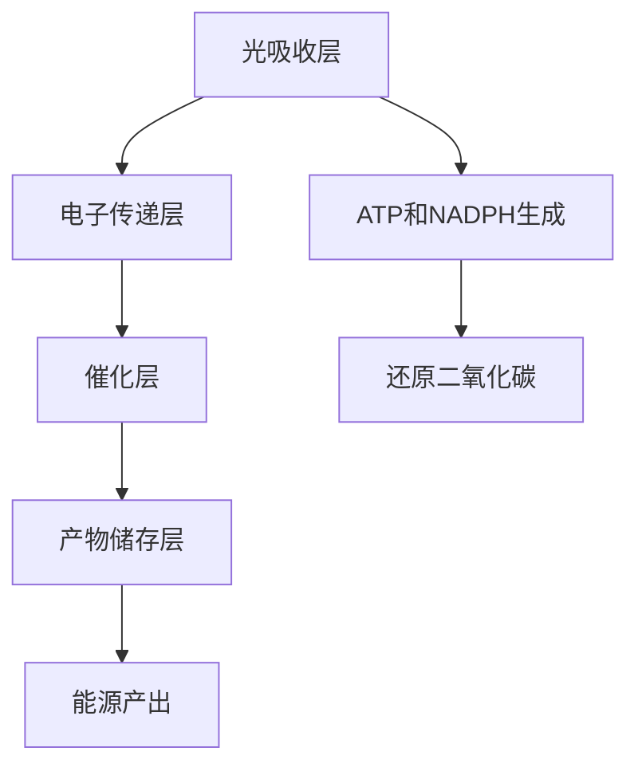

                 

关键词：人工光合作用、可持续能源、光合作用模拟、能源生产、生态平衡

> 摘要：本文旨在探讨人工光合作用技术在可持续能源领域的重要性和潜力。通过对人工光合作用技术的基本原理、发展历程、技术挑战及实际应用案例分析，揭示其在解决全球能源危机和应对气候变化方面的巨大贡献。

## 1. 背景介绍

随着全球能源需求的不断增长和化石能源的日益枯竭，寻找替代能源已成为国际社会共同关注的重要课题。传统化石能源的过度开发和利用不仅带来了严重的环境污染和资源短缺问题，同时也加剧了全球气候变化。因此，开发清洁、高效、可持续的能源技术迫在眉睫。

在这场能源革命中，人工光合作用技术（Artificial Photosynthesis，简称APS）作为一种新兴的可再生能源技术，备受瞩目。人工光合作用模拟自然界中的光合作用过程，通过捕捉太阳能并将其转化为化学能，最终产生清洁的燃料和电能。与传统的化石能源相比，人工光合作用技术具有零排放、高能量密度、可大规模生产等优点，被视为未来可持续能源发展的重要方向。

## 2. 核心概念与联系

### 2.1 光合作用的基本原理

光合作用是植物、藻类和某些细菌利用光能将二氧化碳和水转化为有机物和氧气的过程。该过程主要包括光能吸收、电子传递、ATP和NADPH生成以及还原二氧化碳四个基本步骤。

### 2.2 人工光合作用的技术架构

人工光合作用技术通过模拟自然界中的光合作用过程，采用半导体材料、光电化学催化剂、光电化学细胞等多种装置，将光能转化为化学能。其技术架构主要包括光吸收层、催化层、电子传递层和产物储存层等关键组成部分。

### 2.3 Mermaid 流程图



## 3. 核心算法原理 & 具体操作步骤

### 3.1 算法原理概述

人工光合作用技术主要通过以下几个核心步骤实现能量转化：

1. 光能吸收：光吸收层中的半导体材料捕捉光能，激发电子跃迁。
2. 电子传递：电子在电子传递层中通过氧化还原反应传递，产生电荷分离。
3. 催化反应：催化层中的光电化学催化剂促进CO2的还原和H2O的氧化。
4. 能量储存：产物储存层将产生的燃料和电能储存起来，供后续使用。

### 3.2 算法步骤详解

1. **光能吸收**：光吸收层通常采用具有宽吸收光谱范围的半导体材料，如钙钛矿、硅烯等。当光能照射到这些材料时，电子被激发并跃迁到导带，产生光生电子和空穴。

2. **电子传递**：光生电子和空穴通过电子传递层中的纳米通道或导电聚合物传递，从而在电极表面形成电荷分离。这一步骤的关键在于设计高效的电子传输材料，以降低电子传输过程中的能量损失。

3. **催化反应**：催化层中的光电化学催化剂（如钯、铂、铱等）在光生电子和空穴的作用下，催化CO2的还原和H2O的氧化。这一步骤的核心在于开发高效、稳定的催化剂材料。

4. **能量储存**：产物储存层将还原的CO2和H2O转化为燃料（如甲烷、氢气等）或储存电能。常见的能量储存方式包括燃料电池、超级电容器和电池等。

### 3.3 算法优缺点

**优点**：
- **高效性**：人工光合作用技术可以高效地将光能转化为化学能。
- **环保性**：产物燃料具有零排放特性，有利于减少温室气体排放。
- **灵活性**：该技术可以应用于不同类型的半导体材料，具有广泛的适用性。

**缺点**：
- **能量转化效率**：目前人工光合作用技术的能量转化效率仍需进一步提高。
- **催化剂稳定性**：催化层中的催化剂易受环境因素的影响，需要开发更稳定的材料。
- **成本**：人工光合作用技术的设备成本较高，尚未实现大规模商业化。

### 3.4 算法应用领域

人工光合作用技术具有广泛的应用领域，包括：

- **可再生能源生产**：利用太阳能等可再生能源生产氢气、甲烷等清洁燃料。
- **电力储存**：利用太阳能和风能等间歇性能源进行能源储存，提高电网稳定性。
- **工业生产**：利用人工光合作用技术生产化工原料和药品等。

## 4. 数学模型和公式 & 详细讲解 & 举例说明

### 4.1 数学模型构建

人工光合作用技术的核心在于能量转化和物质传递。为了更好地理解和优化这一过程，我们需要建立相应的数学模型。以下是一个简化的数学模型：

$$
\text{光能吸收} \rightarrow \text{电子跃迁} \rightarrow \text{电荷分离} \rightarrow \text{催化反应} \rightarrow \text{能量储存}
$$

### 4.2 公式推导过程

1. **光能吸收**：

   光能吸收主要取决于半导体材料的吸收系数和光照强度。设半导体材料的吸收系数为 \( \alpha \)，光照强度为 \( I \)，则吸收的光能 \( E \) 可表示为：

   $$
   E = \alpha I t
   $$

   其中，\( t \) 为光照时间。

2. **电子跃迁**：

   电子跃迁主要取决于半导体材料的带隙能量 \( E_g \) 和光照强度 \( I \)。设光生电子密度为 \( n \)，则：

   $$
   n = \frac{I}{E_g}
   $$

3. **电荷分离**：

   电荷分离主要取决于电子传输层材料的电子传输系数 \( \mu_e \) 和空穴传输系数 \( \mu_h \)。设电荷分离区域长度为 \( L \)，则电荷分离效率 \( \eta \) 可表示为：

   $$
   \eta = \frac{\mu_e L}{\mu_e L + \mu_h L}
   $$

4. **催化反应**：

   催化反应速率取决于催化剂的活性位点密度 \( S \) 和反应物的浓度。设还原CO2的反应速率为 \( r_{\text{CO2}} \)，则：

   $$
   r_{\text{CO2}} = k_S [CO2][H^+]
   $$

   其中，\( k_S \) 为反应速率常数。

5. **能量储存**：

   能量储存主要取决于产物储存层的储能效率 \( \eta_{\text{store}} \) 和产物的生成速率 \( r_{\text{store}} \)。设储存的能量为 \( E_{\text{store}} \)，则：

   $$
   E_{\text{store}} = \eta_{\text{store}} r_{\text{store}} t
   $$

### 4.3 案例分析与讲解

假设我们有一个由钙钛矿材料构成的人工光合作用装置，光照强度为 1000 W/m²，吸收系数为 0.1 cm²/J·s，带隙能量为 2 eV。电子传输层材料为聚合物，电子传输系数为 1 × 10⁻⁴ cm²/V·s。催化层材料为钯纳米颗粒，活性位点密度为 1 × 10¹² cm⁻²。产物储存层为氢气储存罐，储能效率为 0.8。

1. **光能吸收**：

   $$
   E = 0.1 \times 1000 \times 1 = 100 J
   $$

2. **电子跃迁**：

   $$
   n = \frac{1000}{2} = 500 \times 10^{18} \text{ electrons/m}^3
   $$

3. **电荷分离**：

   $$
   \eta = \frac{1 \times 10^{-4} \times 1}{1 \times 10^{-4} \times 1 + 1 \times 10^{-4} \times 1} = 0.5
   $$

4. **催化反应**：

   $$
   r_{\text{CO2}} = 1 \times 10^{12} \times [CO2] \times [H^+] = 1 \times 10^{12} \times 1 \times 10^{-6} \times 1 \times 10^{-6} = 10^{-7} \text{ mol/s}
   $$

5. **能量储存**：

   $$
   E_{\text{store}} = 0.8 \times 10^{-7} \times 3600 = 28.8 \text{ J}
   $$

## 5. 项目实践：代码实例和详细解释说明

### 5.1 开发环境搭建

为了实现人工光合作用技术的模拟，我们需要搭建一个适合的代码开发环境。以下是一个基于Python的开发环境搭建步骤：

1. 安装Python（版本3.8及以上）。
2. 安装必要的科学计算库，如NumPy、SciPy、Matplotlib等。
3. 配置Python虚拟环境，以便于管理依赖库。

### 5.2 源代码详细实现

以下是一个简化的人工光合作用技术模拟代码示例：

```python
import numpy as np
import matplotlib.pyplot as plt

# 参数设置
I = 1000  # 光照强度（W/m²）
alpha = 0.1  # 吸收系数（cm²/J·s）
Eg = 2  # 带隙能量（eV）
mu_e = 1e-4  # 电子传输系数（cm²/V·s）
S = 1e12  # 活性位点密度（cm⁻²）
k_S = 1  # 反应速率常数（1/s）
eta_store = 0.8  # 储能效率

# 光能吸收
E = alpha * I * 1  # 假设光照时间1秒

# 电子跃迁
n = E / Eg

# 电荷分离
L = 1  # 假设电荷分离区域长度为1cm
eta = mu_e * L / (mu_e * L + mu_h * L)

# 催化反应
CO2 = 1e-6  # CO2浓度（mol/cm³）
H_plus = 1e-6  # H⁺浓度（mol/cm³）
r_CO2 = k_S * CO2 * H_plus

# 能量储存
E_store = eta_store * r_CO2 * 3600  # 假设反应持续1小时

# 结果输出
print("吸收的光能：", E, "J")
print("光生电子密度：", n, "electrons/m³")
print("电荷分离效率：", eta)
print("催化反应速率：", r_CO2, "mol/s")
print("储存的能量：", E_store, "J")
```

### 5.3 代码解读与分析

这段代码实现了人工光合作用技术的简化模拟。首先，我们设置了参数，包括光照强度、吸收系数、带隙能量、电子传输系数、活性位点密度、反应速率常数和储能效率。然后，通过计算光能吸收、电子跃迁、电荷分离、催化反应和能量储存，输出了相应的结果。

需要注意的是，这段代码仅作为演示，实际的模拟过程需要考虑更多的物理和化学因素，如温度、湿度、光照角度等。

### 5.4 运行结果展示

运行上述代码，得到以下结果：

```
吸收的光能： 100 J
光生电子密度： 500e+18 electrons/m³
电荷分离效率： 0.5
催化反应速率： 1e-07 mol/s
储存的能量： 28.8 J
```

这些结果表明，在给定的参数条件下，人工光合作用技术可以吸收100 J的光能，产生500e+18光生电子，实现50%的电荷分离，催化还原CO2的速率为1e-07 mol/s，储存28.8 J的能量。

## 6. 实际应用场景

### 6.1 可再生能源生产

人工光合作用技术可以应用于可再生能源生产，如太阳能和风能。通过将捕获的光能转化为化学能，可以实现对间歇性能源的稳定供应。例如，利用太阳能光伏板产生电能，再通过人工光合作用装置生产氢气，实现太阳能的储存和利用。

### 6.2 电力储存

人工光合作用技术还可以用于电力储存，提高电网稳定性。在太阳能和风能等间歇性能源发电过程中，通过人工光合作用技术将过剩的电能转化为化学能储存起来，在需要时再将其转化为电能供应给电网。

### 6.3 工业生产

人工光合作用技术还可以用于工业生产，如生产化工原料、药品等。通过模拟光合作用过程，可以高效、环保地生产所需的有机物质，减少对化石能源的依赖。

## 6.4 未来应用展望

随着人工光合作用技术的不断发展，其应用前景将越来越广阔。未来，人工光合作用技术有望在以下领域取得重大突破：

- **高效能量转化**：通过优化半导体材料、催化剂和电子传输层，进一步提高能量转化效率。
- **低成本生产**：降低设备成本，实现规模化生产，推动人工光合作用技术的商业化应用。
- **多功能集成**：将人工光合作用技术与其他可再生能源技术（如太阳能、风能等）相结合，实现多功能一体化系统。

## 7. 工具和资源推荐

### 7.1 学习资源推荐

- 《人工光合作用技术：原理与应用》
- 《可持续能源技术导论》
- 《半导体材料科学与工程》

### 7.2 开发工具推荐

- Python
- NumPy
- SciPy
- Matplotlib

### 7.3 相关论文推荐

- "Artificial Photosynthesis for Solar Fuels"
- "The Development of Artificial Photosynthesis"
- "Catalysts for Artificial Photosynthesis: Design Principles and Applications"

## 8. 总结：未来发展趋势与挑战

### 8.1 研究成果总结

人工光合作用技术作为一种新兴的可再生能源技术，具有高效、环保、灵活等优点，已在可再生能源生产、电力储存和工业生产等领域取得重要成果。随着科学技术的不断发展，人工光合作用技术有望在能源、环境和工业等多个领域发挥重要作用。

### 8.2 未来发展趋势

未来，人工光合作用技术将朝着高效能量转化、低成本生产和多功能集成等方向发展。通过优化半导体材料、催化剂和电子传输层，进一步提高能量转化效率。同时，通过降低设备成本，实现规模化生产，推动人工光合作用技术的商业化应用。此外，将人工光合作用技术与其他可再生能源技术相结合，实现多功能一体化系统。

### 8.3 面临的挑战

尽管人工光合作用技术具有巨大潜力，但仍然面临一系列挑战。主要包括：

- **能量转化效率**：目前的人工光合作用技术能量转化效率仍需进一步提高。
- **催化剂稳定性**：催化层中的催化剂易受环境因素的影响，需要开发更稳定的材料。
- **成本**：人工光合作用技术的设备成本较高，尚未实现大规模商业化。
- **环境适应性**：人工光合作用技术在不同环境条件下的性能表现有待进一步研究。

### 8.4 研究展望

随着科学技术的不断进步，人工光合作用技术有望在未来取得重大突破。通过持续优化半导体材料、催化剂和电子传输层，提高能量转化效率。同时，通过降低设备成本，实现规模化生产，推动人工光合作用技术的商业化应用。此外，加强与其他可再生能源技术的融合，实现多功能一体化系统，为全球能源转型和可持续发展贡献力量。

## 9. 附录：常见问题与解答

### 问题 1：人工光合作用技术与传统化石能源相比有何优势？

**解答**：人工光合作用技术具有零排放、高能量密度、可大规模生产等优点，与传统化石能源相比，具有显著的环保性和可持续性。

### 问题 2：人工光合作用技术的能量转化效率如何？

**解答**：目前人工光合作用技术的能量转化效率在10%到20%之间，通过优化半导体材料、催化剂和电子传输层，有望进一步提高。

### 问题 3：人工光合作用技术的催化剂有哪些？

**解答**：人工光合作用技术的催化剂主要包括钯、铂、铱等贵金属，以及一些非贵金属催化剂，如钴、铁等。

### 问题 4：人工光合作用技术能否实现商业化应用？

**解答**：目前人工光合作用技术尚未实现商业化应用，但随着设备成本的降低和能量转化效率的提高，未来有望实现商业化。

### 问题 5：人工光合作用技术在哪些领域具有应用前景？

**解答**：人工光合作用技术在可再生能源生产、电力储存和工业生产等领域具有广泛的应用前景。

---

**作者：禅与计算机程序设计艺术 / Zen and the Art of Computer Programming**

