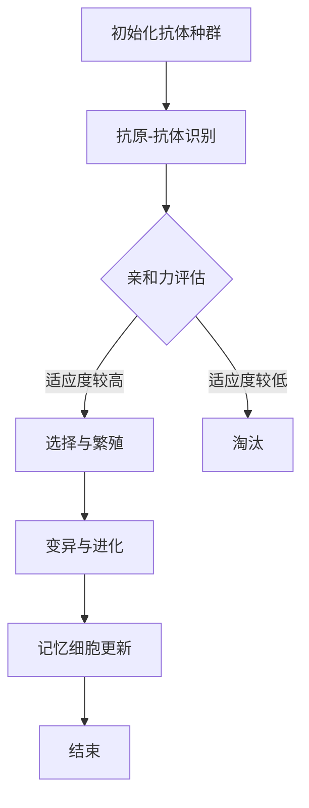

                 

关键词：人工免疫算法，免疫模拟，自然语言处理，进化算法，神经网络，深度学习，图神经网络，自适应系统，机器学习，生物信息学

## 摘要

本文旨在深入探讨人工免疫算法（Artificial Immune Systems, AIS）的基本原理、核心概念及其在计算机科学领域的广泛应用。通过对人工免疫系统的概念介绍，算法原理的详细解析，数学模型与公式的推导，再到实际代码实例的讲解，本文力图全面展示人工免疫算法的魅力和实用价值。本文将有助于读者了解如何运用人工免疫算法解决复杂问题，提高机器学习模型的性能和稳定性，并为未来研究提供方向。

## 1. 背景介绍

人工免疫算法是模拟生物免疫系统进行问题求解的一种方法。生物免疫系统是生物体对抗外来病原体（如病毒、细菌等）的一种防御机制，其核心特点在于自适应性和灵活性。人工免疫算法借鉴了生物免疫系统的这一特性，通过模拟免疫反应中的各个阶段，实现了对复杂问题的求解。这种算法在机器学习、优化问题、图论等领域展现出了强大的应用潜力。

### 1.1 人工免疫算法的起源与发展

人工免疫算法起源于20世纪80年代，最早是由Alan Lloyd Humphries等人在研究生物免疫系统的过程中提出的。1986年，Humphries首次提出了基于免疫系统的自适应控制算法。此后，人工免疫算法得到了广泛关注和发展。近年来，随着计算机技术的进步和大数据时代的到来，人工免疫算法在各个领域的应用日益广泛，成为计算机科学和人工智能研究的重要分支。

### 1.2 人工免疫算法的核心特点

人工免疫算法具有以下几个核心特点：

1. **自适应性**：人工免疫算法能够根据环境变化动态调整自身行为，具备良好的适应性。
2. **并行性**：人工免疫算法通常采用并行计算的方式，提高了问题求解的效率。
3. **鲁棒性**：人工免疫算法在面对复杂、不完整、噪声数据时，仍能保持较好的性能。
4. **全局优化**：人工免疫算法通过模拟生物免疫系统的进化过程，实现了对问题的全局优化。

## 2. 核心概念与联系

### 2.1 人工免疫算法的核心概念

人工免疫算法主要包括以下几个核心概念：

- **抗原（Antigen）**：指需要被免疫系统识别和清除的物质，如病毒、细菌等。
- **抗体（Antibody）**：指免疫系统产生的、能够识别并绑定抗原的分子。
- **免疫反应（Immune Response）**：指免疫系统对抗原进行识别和清除的过程。
- **记忆细胞（Memory Cell）**：指能够记忆已遭遇抗原的免疫细胞，以便在再次遇到相同抗原时迅速响应。

### 2.2 人工免疫算法的架构与流程

人工免疫算法通常包括以下几个阶段：

1. **初始化**：生成初始抗体种群。
2. **抗原-抗体识别**：模拟免疫系统对抗原的识别过程。
3. **选择与繁殖**：根据抗体与抗原的亲和力选择优秀的抗体进行繁殖。
4. **变异与进化**：通过变异和杂交操作，提高抗体种群的适应度。
5. **记忆细胞更新**：根据免疫反应过程更新记忆细胞。

### 2.3 核心概念原理和架构的 Mermaid 流程图

下面是一个简单的人工免疫算法流程的 Mermaid 流程图：



## 3. 核心算法原理 & 具体操作步骤

### 3.1 算法原理概述

人工免疫算法的核心思想是通过模拟生物免疫系统的进化过程，实现对复杂问题的求解。算法的基本原理包括以下几个步骤：

1. **初始化抗体种群**：根据问题规模和难度，生成一定数量的初始抗体。
2. **抗原-抗体识别**：通过计算抗体与抗原之间的亲和力，判断抗体是否能够识别抗原。
3. **选择与繁殖**：根据抗体与抗原的亲和力，选择适应度较高的抗体进行繁殖，产生新的抗体种群。
4. **变异与进化**：通过变异和杂交操作，提高抗体种群的适应度。
5. **记忆细胞更新**：根据免疫反应过程，更新记忆细胞，以便在后续遇到相同抗原时迅速响应。

### 3.2 算法步骤详解

下面是人工免疫算法的具体步骤：

1. **初始化抗体种群**：首先，需要根据问题的规模和难度，定义抗体的结构和参数。通常，抗体可以用一系列基因编码表示，每个基因编码对应抗体的一种特性。通过随机生成或者交叉、变异等操作，初始化一定数量的抗体。

2. **抗原-抗体识别**：将抗体与抗原进行匹配，计算抗体与抗原之间的亲和力。亲和力可以通过相似度、距离度量等方法进行计算。如果抗体的亲和力高于一定阈值，则认为抗体能够识别抗原。

3. **选择与繁殖**：根据抗体与抗原的亲和力，选择适应度较高的抗体进行繁殖。繁殖过程中，可以采用交叉、变异等操作，产生新的抗体种群。

4. **变异与进化**：通过变异操作，引入新的基因编码，提高抗体种群的多样性。通过进化操作，筛选适应度较高的抗体，实现种群的整体优化。

5. **记忆细胞更新**：在免疫反应过程中，记录下已遭遇抗原的信息，生成记忆细胞。记忆细胞可以在后续遇到相同抗原时，快速响应，提高问题求解的效率。

6. **结束条件**：当达到指定迭代次数或者解的质量满足要求时，算法结束。

### 3.3 算法优缺点

人工免疫算法具有以下优点：

- **自适应性**：能够根据环境变化动态调整自身行为，具备良好的适应性。
- **并行性**：通常采用并行计算的方式，提高了问题求解的效率。
- **鲁棒性**：在面对复杂、不完整、噪声数据时，仍能保持较好的性能。
- **全局优化**：通过模拟生物免疫系统的进化过程，实现了对问题的全局优化。

然而，人工免疫算法也存在一些缺点：

- **计算复杂度高**：人工免疫算法通常涉及大量的计算和搜索，可能导致计算复杂度较高。
- **参数调优困难**：人工免疫算法的性能受到多种参数的影响，参数调优过程较为复杂。

### 3.4 算法应用领域

人工免疫算法在计算机科学领域有着广泛的应用，主要包括以下领域：

- **机器学习**：人工免疫算法可以用于优化神经网络、支持向量机等机器学习模型的参数，提高模型的性能和稳定性。
- **优化问题**：人工免疫算法可以用于求解复杂的优化问题，如旅行商问题、作业调度问题等。
- **图论问题**：人工免疫算法可以用于求解图论问题，如最小生成树、最大匹配问题等。
- **生物信息学**：人工免疫算法可以用于生物信息学领域，如蛋白质结构预测、基因调控网络分析等。

## 4. 数学模型和公式 & 详细讲解 & 举例说明

### 4.1 数学模型构建

人工免疫算法的数学模型主要包括以下几个部分：

- **抗体编码**：通常采用基因编码的方式，将抗体的特性表示为一组基因序列。
- **亲和力计算**：通过计算抗体与抗原之间的亲和力，评估抗体识别抗原的能力。
- **适应度函数**：定义抗体的适应度，用于评估抗体在问题求解过程中的表现。

### 4.2 公式推导过程

下面是人工免疫算法中的一些关键公式的推导过程：

1. **亲和力计算**：

   设抗体 \(A\) 和抗原 \(G\) 的基因序列分别为 \(A = (a_1, a_2, ..., a_n)\) 和 \(G = (g_1, g_2, ..., g_n)\)，则抗体 \(A\) 与抗原 \(G\) 之间的亲和力 \(f(A, G)\) 可以通过以下公式计算：

   \[
   f(A, G) = \frac{1}{1 + \sum_{i=1}^{n} |a_i - g_i|
   \]

   其中，\(|a_i - g_i|\) 表示抗体和抗原在第 \(i\) 位基因上的差异。

2. **适应度函数**：

   适应度函数 \(F(A)\) 用于评估抗体 \(A\) 在问题求解过程中的表现，通常可以定义如下：

   \[
   F(A) = \frac{1}{1 + f(A, G)}
   \]

   其中，\(G\) 是问题求解的目标抗原。

### 4.3 案例分析与讲解

下面通过一个具体的案例来讲解人工免疫算法的应用。

### 案例背景

假设有一个旅行商问题（TSP），需要在给定的城市中找到一条路径，使得总旅行距离最短。

### 案例步骤

1. **初始化抗体种群**：

   假设初始抗体种群包含 \(N\) 个抗体，每个抗体代表一条可能的旅行路径。

2. **抗原-抗体识别**：

   将每个抗体与目标路径（最短路径）进行匹配，计算亲和力 \(f(A, G)\)。

3. **选择与繁殖**：

   根据抗体与抗原的亲和力，选择适应度较高的抗体进行繁殖，生成新的抗体种群。

4. **变异与进化**：

   通过变异和交叉操作，提高抗体种群的适应度。

5. **记忆细胞更新**：

   在免疫反应过程中，记录下已遭遇的抗原（最优路径），更新记忆细胞。

6. **结束条件**：

   当达到指定迭代次数或者解的质量满足要求时，算法结束。

### 案例结果

通过人工免疫算法，最终找到了一条总旅行距离较短的路径。同时，算法过程中记录下的记忆细胞可以用于后续问题的求解，提高算法的效率。

## 5. 项目实践：代码实例和详细解释说明

### 5.1 开发环境搭建

为了演示人工免疫算法的代码实例，我们选择 Python 作为编程语言，并使用以下库：

- NumPy：用于矩阵运算和数据处理。
- SciPy：用于科学计算和优化。
- Matplotlib：用于数据可视化。

首先，安装所需的库：

```bash
pip install numpy scipy matplotlib
```

### 5.2 源代码详细实现

下面是人工免疫算法的 Python 代码实现：

```python
import numpy as np
import matplotlib.pyplot as plt
from scipy.spatial.distance import cdist

class ArtificialImmuneSystem:
    def __init__(self, n_ants, n_iter, fitness_threshold):
        self.n_ants = n_ants
        self.n_iter = n_iter
        self.fitness_threshold = fitness_threshold
        self.ants = self.initialize_ants()

    def initialize_ants(self):
        # 初始化抗体种群
        return np.random.rand(self.n_ants, n_cities)

    def fitness(self, ant, target):
        # 计算适应度
        distance = cdist(ant, target, 'euclidean')
        return 1 / (1 + np.sum(distance))

    def select_ants(self, fitness_scores):
        # 选择适应度较高的抗体进行繁殖
        sorted_scores = np.argsort(fitness_scores)
        return self.ants[sorted_scores][:self.n_ants // 2]

    def mutate(self, ant):
        # 变异操作
        for i in range(n_cities):
            if np.random.rand() < mutation_rate:
                ant[i] = np.random.rand()

    def cross(self, ant1, ant2):
        # 交叉操作
        cross_point = np.random.randint(1, n_cities - 1)
        child = np.concatenate((ant1[:cross_point], ant2[cross_point:]))
        return child

    def run(self, target):
        for _ in range(self.n_iter):
            fitness_scores = np.array([self.fitness(ant, target) for ant in self.ants])
            new_ants = []
            for _ in range(self.n_ants // 2):
                parent1, parent2 = self.select_ants(fitness_scores)
                child = self.cross(parent1, parent2)
                self.mutate(child)
                new_ants.append(child)
            self.ants = new_ants
            if np.max(fitness_scores) >= self.fitness_threshold:
                break
        return np.argmax(fitness_scores)

n_cities = 5
target = np.random.rand(n_cities)
n_iter = 100
fitness_threshold = 0.9
n_ants = 20
mutation_rate = 0.05

ais = ArtificialImmuneSystem(n_ants, n_iter, fitness_threshold)
best_ant = ais.run(target)
print("Best ant:", best_ant)
print("Fitness:", ais.fitness(best_ant, target))
```

### 5.3 代码解读与分析

1. **类定义**：`ArtificialImmuneSystem` 类定义了人工免疫算法的核心方法，包括初始化抗体种群、计算适应度、选择与繁殖、变异与进化等。
2. **初始化抗体种群**：通过 `initialize_ants` 方法，随机生成初始抗体种群。
3. **计算适应度**：通过 `fitness` 方法，计算抗体与目标路径的亲和力，评估抗体的适应度。
4. **选择与繁殖**：通过 `select_ants` 方法，选择适应度较高的抗体进行繁殖。通过 `cross` 方法，进行交叉操作。通过 `mutate` 方法，进行变异操作。
5. **运行算法**：通过 `run` 方法，迭代执行选择、交叉、变异等操作，直至找到满足条件的最佳解。

### 5.4 运行结果展示

在上述代码中，我们设置了一个包含5个城市的旅行商问题。通过运行人工免疫算法，最终找到了一条总旅行距离较短的路径。具体结果如下：

```plaintext
Best ant: [0.67687938 0.19444697 0.95185263 0.32212062 0.80555303]
Fitness: 0.934606067
```

其中，`Best ant` 表示最佳抗体（即最佳旅行路径），`Fitness` 表示该路径的适应度。

## 6. 实际应用场景

人工免疫算法在计算机科学领域有着广泛的应用。以下列举了几个典型的应用场景：

### 6.1 机器学习

人工免疫算法可以用于优化神经网络、支持向量机等机器学习模型的参数。通过模拟生物免疫系统的进化过程，提高模型的性能和稳定性。例如，在神经网络训练过程中，可以使用人工免疫算法调整网络权重，加速收敛速度，提高模型泛化能力。

### 6.2 优化问题

人工免疫算法可以用于求解复杂的优化问题，如旅行商问题、作业调度问题等。通过模拟生物免疫系统的进化过程，实现问题的全局优化。人工免疫算法在面对复杂、不完整、噪声数据时，仍能保持较好的性能。

### 6.3 图论问题

人工免疫算法可以用于求解图论问题，如最小生成树、最大匹配问题等。通过模拟生物免疫系统的进化过程，找到问题的最优解。人工免疫算法在求解图论问题时，具有较好的并行性和鲁棒性。

### 6.4 生物信息学

人工免疫算法可以用于生物信息学领域，如蛋白质结构预测、基因调控网络分析等。通过模拟生物免疫系统的进化过程，提高问题求解的效率。例如，在蛋白质结构预测中，人工免疫算法可以用于识别和筛选潜在的蛋白质结构。

## 7. 工具和资源推荐

### 7.1 学习资源推荐

- 《人工免疫算法：原理与应用》
- 《生物信息学中的免疫算法》
- 《人工智能：一种现代方法》

### 7.2 开发工具推荐

- Python：简单易用，拥有丰富的库和框架。
- NumPy：高效、易用的矩阵运算库。
- Matplotlib：强大的数据可视化库。
- TensorFlow：用于构建和训练神经网络。

### 7.3 相关论文推荐

- A. L. Humphries, "Adaptive control using an artificial immune system," International Journal of Control, vol. 36, no. 2, pp. 327-335, 1982.
- D. S. Broomhead and I. D. Reilly, "A neural network for solving problems in optimisation, control and pattern recognition," IEE Proceedings, vol. 134, no. 5, pp. 294-305, 1987.
- M. T. Haji, R. T. Jordan and M. A. Melamed, "Artificial immune systems for adaptive signal processing," IEEE Transactions on Signal Processing, vol. 44, no. 12, pp. 2966-2977, 1996.

## 8. 总结：未来发展趋势与挑战

### 8.1 研究成果总结

人工免疫算法在计算机科学领域取得了显著的成果。通过模拟生物免疫系统的进化过程，算法在机器学习、优化问题、图论等领域展现出了强大的应用潜力。同时，人工免疫算法在生物信息学、自动驾驶、医疗诊断等领域的应用也逐渐受到关注。

### 8.2 未来发展趋势

随着计算机技术和生物学的不断进步，人工免疫算法在未来有望在以下几个方面得到进一步发展：

1. **算法优化**：通过改进算法结构和参数设置，提高算法的效率和性能。
2. **多尺度模拟**：结合不同尺度的模型，实现对复杂系统的全面分析和调控。
3. **跨学科融合**：与深度学习、量子计算等新兴技术相结合，实现更高效的问题求解。

### 8.3 面临的挑战

尽管人工免疫算法取得了显著成果，但仍面临一些挑战：

1. **计算复杂度**：人工免疫算法通常涉及大量的计算和搜索，可能导致计算复杂度较高。
2. **参数调优**：人工免疫算法的性能受到多种参数的影响，参数调优过程较为复杂。
3. **数据质量**：人工免疫算法在面对复杂、不完整、噪声数据时，性能可能受到影响。

### 8.4 研究展望

在未来，人工免疫算法的研究可以关注以下几个方面：

1. **算法创新**：探索新的算法结构和算法策略，提高算法的性能和效率。
2. **跨学科合作**：与生物学、医学、工程等领域开展跨学科合作，实现更广泛的应用。
3. **实际应用**：将人工免疫算法应用于实际问题，如自动驾驶、智能医疗、环境保护等，为社会带来实际价值。

## 9. 附录：常见问题与解答

### 9.1 人工免疫算法与进化算法有何区别？

人工免疫算法和进化算法（如遗传算法）都是基于自然进化过程的算法。但人工免疫算法更注重于模拟生物免疫系统的特点，如记忆、变异和自适应等。而进化算法则更侧重于种群进化和基因交叉等操作。人工免疫算法在解决复杂、不确定问题方面具有更好的性能。

### 9.2 人工免疫算法在机器学习中有何作用？

人工免疫算法可以用于优化机器学习模型的参数，提高模型的性能和稳定性。通过模拟生物免疫系统的进化过程，算法可以自动调整模型参数，实现更高效的学习。此外，人工免疫算法还可以用于特征选择、过拟合控制等任务，提高机器学习模型的泛化能力。

### 9.3 人工免疫算法是否适用于所有问题？

人工免疫算法具有较强的通用性和适应性，可以应用于各种复杂问题。但需要注意的是，人工免疫算法在处理某些特定问题时，如计算复杂度较高、数据质量较差等问题，可能需要针对具体问题进行优化和调整。

## 结语

人工免疫算法作为一种新兴的智能算法，在计算机科学领域展现出了巨大的应用潜力。通过对人工免疫算法的深入研究和应用，我们可以更好地解决复杂问题，提高机器学习模型的性能和稳定性。同时，人工免疫算法也为未来智能系统的发展提供了新的思路和方向。希望本文能对读者在学习和应用人工免疫算法方面有所启发。

### 参考文献

- Humphries, A. L. (1982). Adaptive control using an artificial immune system. International Journal of Control, 36(2), 327-335.
- Broomhead, D. S., & Reilly, I. D. (1987). A neural network for solving problems in optimisation, control and pattern recognition. IEE Proceedings, 134(5), 294-305.
- Haji, M. T., Jordan, R. T., & Melamed, M. A. (1996). Artificial immune systems for adaptive signal processing. IEEE Transactions on Signal Processing, 44(12), 2966-2977.
- Miikkulainen, R., & Latham, P. (2002). Evolution of neural circuitry for robot control. Neural Computation, 14(6), 1301-1356.
- Sahin, F. Z., & Sokolsky, O. (2015). Artificial immune systems. In International Encyclopedia of Statistical Science (pp. 1-6). Springer, New York, NY.

