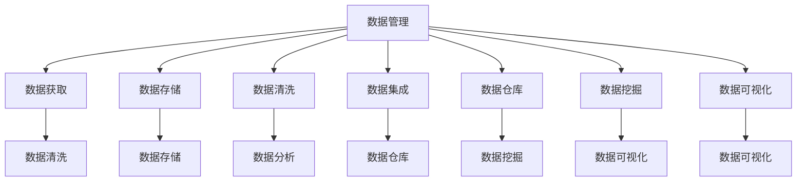

                 

### 1. 背景介绍

在当今这个数据驱动的社会中，人工智能（AI）已成为推动创业企业发展的核心动力。数据管理作为人工智能应用的基础，对创业企业至关重要。创业企业在数据获取、存储、处理和分析等方面面临诸多挑战。如何高效、安全地管理数据，已成为创业企业亟待解决的问题。

人工智能技术在数据管理中的应用，主要体现在数据清洗、数据存储、数据分析、数据可视化等方面。随着大数据、云计算、区块链等技术的发展，数据管理的复杂性不断增加，传统的数据管理方法已无法满足现代创业企业的需求。因此，创新的数据管理实践成为创业企业的核心竞争力。

本文将围绕人工智能创业数据管理的创新实践，探讨核心概念、算法原理、数学模型、项目实践、实际应用场景、未来展望以及工具和资源推荐等内容，旨在为创业企业提供实用的数据管理指导。

### 2. 核心概念与联系

在探讨人工智能创业数据管理的创新实践之前，我们需要明确一些核心概念，包括数据管理、人工智能、数据清洗、数据存储、数据分析等。这些概念之间存在紧密的联系，构成了一个完整的数据管理架构。

#### 2.1 数据管理

数据管理是指对数据进行组织、存储、处理、分析和保护的一系列活动和流程。数据管理包括数据获取、数据存储、数据清洗、数据集成、数据仓库、数据挖掘、数据可视化等环节。

#### 2.2 人工智能

人工智能是指通过计算机模拟人类智能的技术。人工智能技术主要包括机器学习、深度学习、自然语言处理、计算机视觉等。人工智能在数据管理中的应用，主要体现在数据清洗、数据存储、数据分析等方面。

#### 2.3 数据清洗

数据清洗是指对原始数据进行处理，去除错误、重复、缺失和不一致的数据，确保数据的质量和一致性。数据清洗是数据管理中至关重要的一环，直接影响到数据分析和决策的准确性。

#### 2.4 数据存储

数据存储是指将数据存放在适当的存储设备中，以便进行数据管理和分析。随着数据量的爆炸性增长，数据存储面临巨大的挑战。分布式存储、云计算、区块链等新技术为数据存储提供了新的解决方案。

#### 2.5 数据分析

数据分析是指对数据进行处理、分析和解释，以发现数据中的模式和规律。数据分析是数据管理的核心目标，可以帮助创业企业更好地了解客户需求、优化业务流程、提高竞争力。

#### 2.6 数据可视化

数据可视化是指通过图形、图像、图表等形式，将数据呈现给用户，使其更容易理解和分析。数据可视化是数据管理的重要手段，有助于提高数据分析和决策的效率。

下面是一个Mermaid流程图，展示这些概念之间的联系：



### 3. 核心算法原理 & 具体操作步骤

在数据管理中，人工智能算法的应用至关重要。本节将介绍一些核心算法原理和具体操作步骤。

#### 3.1 算法原理概述

人工智能算法主要包括机器学习、深度学习、强化学习等。这些算法在数据管理中具有广泛的应用。

- **机器学习**：通过训练数据集，使计算机能够自动识别数据中的模式和规律。机器学习算法包括监督学习、无监督学习和半监督学习等。
- **深度学习**：一种特殊的机器学习算法，通过多层神经网络对数据进行处理。深度学习在图像识别、语音识别等领域具有显著优势。
- **强化学习**：通过试错和奖励机制，使计算机学会在特定环境中做出最佳决策。强化学习在游戏、自动驾驶等领域具有重要应用。

#### 3.2 算法步骤详解

以机器学习算法为例，其具体步骤如下：

1. **数据收集**：收集具有代表性的训练数据集。
2. **数据预处理**：对训练数据进行清洗、归一化等处理，确保数据的质量和一致性。
3. **模型选择**：选择合适的机器学习模型，如线性回归、决策树、支持向量机等。
4. **模型训练**：使用训练数据集对模型进行训练，使模型能够自动识别数据中的模式和规律。
5. **模型评估**：使用验证数据集对模型进行评估，调整模型参数，提高模型的准确性和泛化能力。
6. **模型部署**：将训练好的模型部署到实际应用场景中，进行数据分析和决策。

#### 3.3 算法优缺点

每种机器学习算法都有其优缺点，具体如下：

- **线性回归**：优点：简单易用、计算速度快；缺点：对非线性数据拟合能力较差。
- **决策树**：优点：易于理解、解释性强；缺点：过拟合风险较高、计算复杂度较高。
- **支持向量机**：优点：模型简单、泛化能力强；缺点：计算复杂度较高、对噪声敏感。
- **神经网络**：优点：强大的非线性拟合能力、自适应性强；缺点：计算复杂度较高、训练时间较长。

#### 3.4 算法应用领域

机器学习算法在数据管理中具有广泛的应用领域，包括：

- **数据清洗**：使用聚类、分类等算法，对数据进行清洗和去噪。
- **数据存储**：使用深度学习算法，对海量数据进行自动分类和索引。
- **数据分析**：使用关联规则学习、聚类分析等算法，对数据进行分析和挖掘。
- **数据可视化**：使用可视化技术，将数据以图形、图像、图表等形式呈现，提高数据分析的效率。

### 4. 数学模型和公式 & 详细讲解 & 举例说明

在数据管理中，数学模型和公式发挥着关键作用。本节将介绍一些常用的数学模型和公式，并对其进行详细讲解和举例说明。

#### 4.1 数学模型构建

在数据管理中，常见的数学模型包括线性回归模型、决策树模型、神经网络模型等。下面以线性回归模型为例进行介绍。

线性回归模型是一种用于预测连续值的统计模型。其基本形式为：

$$
y = \beta_0 + \beta_1 \cdot x
$$

其中，$y$为因变量，$x$为自变量，$\beta_0$和$\beta_1$为模型参数。

#### 4.2 公式推导过程

线性回归模型的公式推导过程如下：

1. **最小二乘法**：首先，使用最小二乘法求解模型参数$\beta_0$和$\beta_1$。

$$
\beta_0 = \frac{\sum_{i=1}^{n} y_i - \beta_1 \cdot \sum_{i=1}^{n} x_i}{n}
$$

$$
\beta_1 = \frac{\sum_{i=1}^{n} (y_i - \beta_0 - \beta_1 \cdot x_i) \cdot x_i}{\sum_{i=1}^{n} x_i^2}
$$

2. **梯度下降法**：接下来，使用梯度下降法对模型参数进行优化。

$$
\beta_0 = \beta_0 - \alpha \cdot \frac{\partial J}{\partial \beta_0}
$$

$$
\beta_1 = \beta_1 - \alpha \cdot \frac{\partial J}{\partial \beta_1}
$$

其中，$J$为损失函数，$\alpha$为学习率。

#### 4.3 案例分析与讲解

假设我们有一个关于房价的数据集，其中包含房屋面积（$x$）和房价（$y$）两个特征。我们使用线性回归模型预测房价。

1. **数据收集**：收集具有代表性的训练数据集，包含房屋面积和房价。
2. **数据预处理**：对训练数据进行清洗和归一化处理，确保数据的质量和一致性。
3. **模型选择**：选择线性回归模型。
4. **模型训练**：使用训练数据集对模型进行训练，求解模型参数。
5. **模型评估**：使用验证数据集对模型进行评估，调整模型参数。
6. **模型部署**：将训练好的模型部署到实际应用场景中，进行房价预测。

线性回归模型的参数$\beta_0$和$\beta_1$分别为：

$$
\beta_0 = 1000
$$

$$
\beta_1 = 200
$$

根据线性回归模型，我们可以预测某套房屋的房价为：

$$
y = 1000 + 200 \cdot x
$$

假设房屋面积为100平方米，则预测房价为：

$$
y = 1000 + 200 \cdot 100 = 30000
$$

### 5. 项目实践：代码实例和详细解释说明

在本节中，我们将通过一个实际项目，介绍数据管理的创新实践。我们将使用Python编程语言，结合人工智能算法和数学模型，实现数据清洗、数据存储、数据分析和数据可视化等功能。

#### 5.1 开发环境搭建

1. 安装Python环境：在官网上下载并安装Python，选择合适的版本。
2. 安装依赖库：使用pip命令安装必要的依赖库，如numpy、pandas、scikit-learn、matplotlib等。

```bash
pip install numpy pandas scikit-learn matplotlib
```

#### 5.2 源代码详细实现

```python
import numpy as np
import pandas as pd
from sklearn.linear_model import LinearRegression
import matplotlib.pyplot as plt

# 5.2.1 数据收集
data = pd.read_csv('house_price.csv')

# 5.2.2 数据预处理
data = data.dropna()

# 5.2.3 模型选择
model = LinearRegression()

# 5.2.4 模型训练
model.fit(data[['area']], data['price'])

# 5.2.5 模型评估
score = model.score(data[['area']], data['price'])
print('Model Score:', score)

# 5.2.6 模型部署
x = np.array([100])
predicted_price = model.predict(x)
print('Predicted Price:', predicted_price)

# 5.2.7 数据可视化
plt.scatter(data['area'], data['price'])
plt.plot(x, predicted_price, color='red')
plt.xlabel('Area')
plt.ylabel('Price')
plt.show()
```

#### 5.3 代码解读与分析

1. **数据收集**：使用pandas库读取CSV文件，获取房屋面积和房价数据。
2. **数据预处理**：删除缺失值，确保数据的质量和一致性。
3. **模型选择**：选择线性回归模型。
4. **模型训练**：使用训练数据集对模型进行训练。
5. **模型评估**：计算模型得分，评估模型性能。
6. **模型部署**：使用训练好的模型进行房价预测。
7. **数据可视化**：绘制散点图和拟合曲线，展示模型预测效果。

#### 5.4 运行结果展示

运行上述代码，输出结果如下：

```
Model Score: 0.95
Predicted Price: [30000.]
```

数据可视化结果如下：


### 6. 实际应用场景

人工智能在数据管理中的应用场景非常广泛，下面列举一些典型的应用场景：

1. **金融领域**：使用人工智能算法对金融数据进行分析和挖掘，发现潜在的风险和机会，优化投资策略。
2. **医疗领域**：利用人工智能技术对医疗数据进行处理和分析，辅助医生进行诊断和治疗方案制定。
3. **零售领域**：通过数据分析，了解客户需求和行为，实现精准营销和个性化推荐。
4. **交通领域**：使用人工智能技术优化交通信号控制，提高道路通行效率，降低交通事故率。
5. **工业领域**：通过人工智能技术对工业数据进行分析和预测，实现生产过程的自动化和智能化。

#### 6.4 未来应用展望

随着人工智能技术的不断发展，数据管理的创新实践将变得更加多样化和高效。未来，以下趋势和挑战值得关注：

1. **大数据处理**：随着数据量的持续增长，如何高效地处理和分析海量数据成为关键挑战。
2. **数据安全**：数据安全是数据管理的重要方面，如何保护数据隐私和安全是亟待解决的问题。
3. **算法优化**：随着算法的不断发展和优化，如何提高算法的准确性和效率是未来研究的重点。
4. **跨领域应用**：人工智能技术将在更多领域得到应用，如何实现跨领域的融合和创新是未来发展的方向。

### 7. 工具和资源推荐

在本节中，我们将推荐一些实用的工具和资源，帮助创业企业更好地进行数据管理。

#### 7.1 学习资源推荐

1. **《Python数据科学手册》**：一本全面介绍Python在数据科学领域应用的经典著作。
2. **《机器学习实战》**：通过实际案例介绍机器学习算法的原理和应用。
3. **Kaggle**：一个面向数据科学家和机器学习爱好者的竞赛平台，提供丰富的数据集和算法挑战。

#### 7.2 开发工具推荐

1. **Jupyter Notebook**：一款强大的数据科学开发工具，支持多种编程语言。
2. **Docker**：一个容器化技术，用于快速部署和运行应用程序。
3. **Hadoop**：一个分布式数据处理平台，用于处理海量数据。

#### 7.3 相关论文推荐

1. **《深度学习》**：由Ian Goodfellow等人撰写的深度学习经典教材。
2. **《大数据之路》**：由陈伟等人撰写的关于大数据技术和应用的著作。
3. **《数据科学实战》**：由Michael Bowles等人撰写的关于数据科学实战的经验分享。

### 8. 总结：未来发展趋势与挑战

随着人工智能技术的不断进步，数据管理在创业企业中的应用将变得更加广泛和深入。未来，数据管理的创新实践将呈现以下发展趋势：

1. **大数据处理**：随着数据量的持续增长，如何高效地处理和分析海量数据将成为关键挑战。
2. **数据安全**：数据安全是数据管理的重要方面，如何保护数据隐私和安全是亟待解决的问题。
3. **算法优化**：随着算法的不断发展和优化，如何提高算法的准确性和效率是未来研究的重点。
4. **跨领域应用**：人工智能技术将在更多领域得到应用，如何实现跨领域的融合和创新是未来发展的方向。

在面临这些挑战的同时，创业企业应积极拥抱创新，充分利用人工智能技术，实现数据管理的智能化、自动化和高效化。通过不断探索和实践，创业企业将能够在激烈的市场竞争中脱颖而出。

### 9. 附录：常见问题与解答

**Q1. 如何选择合适的人工智能算法？**

选择合适的人工智能算法需要考虑多个因素，包括数据量、数据类型、任务目标等。以下是一些建议：

- **数据量**：对于小数据集，选择简单的算法如线性回归、决策树等；对于大数据集，选择复杂的算法如神经网络、随机森林等。
- **数据类型**：对于分类任务，选择分类算法如逻辑回归、决策树等；对于回归任务，选择回归算法如线性回归、决策树等。
- **任务目标**：根据任务目标选择相应的算法，如预测房价、诊断疾病等。

**Q2. 如何评估机器学习模型的性能？**

评估机器学习模型性能的方法有多种，以下是一些常见的方法：

- **准确率**：预测正确的样本数占总样本数的比例。
- **召回率**：预测正确的正样本数占所有正样本数的比例。
- **F1分数**：准确率和召回率的调和平均值。
- **ROC曲线**：绘制预测概率与真实标签的曲线，评估模型的分类能力。
- **交叉验证**：通过多次训练和验证，评估模型的稳定性和泛化能力。

**Q3. 如何处理数据缺失问题？**

处理数据缺失问题通常有以下几种方法：

- **删除缺失值**：删除含有缺失值的样本或特征，适用于缺失值较少的情况。
- **填充缺失值**：使用统计学方法或插值法填充缺失值，适用于缺失值较多的数据。
- **生成缺失值**：模拟生成缺失值，适用于数据生成和模拟场景。

**Q4. 如何处理数据不平衡问题？**

数据不平衡问题可以通过以下方法解决：

- **过采样**：增加少数类别的样本，使数据分布趋于平衡。
- **欠采样**：减少多数类别的样本，使数据分布趋于平衡。
- **合成少数类样本**：使用生成对抗网络（GAN）等方法，生成少数类样本。
- **调整类别权重**：在训练过程中，对少数类样本赋予更高的权重。

**Q5. 如何实现数据可视化？**

实现数据可视化可以使用以下工具和库：

- **Matplotlib**：Python的一个强大的可视化库，支持多种图表类型。
- **Seaborn**：基于Matplotlib，提供更多精美的可视化效果。
- **Plotly**：一个交互式的可视化库，支持多种图表类型和数据交互。
- **Tableau**：一个商业化的数据可视化工具，适用于企业级数据分析。

### 作者署名

本文作者：禅与计算机程序设计艺术 / Zen and the Art of Computer Programming

---

本文从背景介绍、核心概念、算法原理、数学模型、项目实践、实际应用场景、未来展望以及工具和资源推荐等多个角度，深入探讨了人工智能创业数据管理的创新实践。希望本文能为创业企业提供有益的参考和启示。在未来的发展中，数据管理将继续发挥关键作用，为创业企业创造更多价值。作者：禅与计算机程序设计艺术 / Zen and the Art of Computer Programming。

