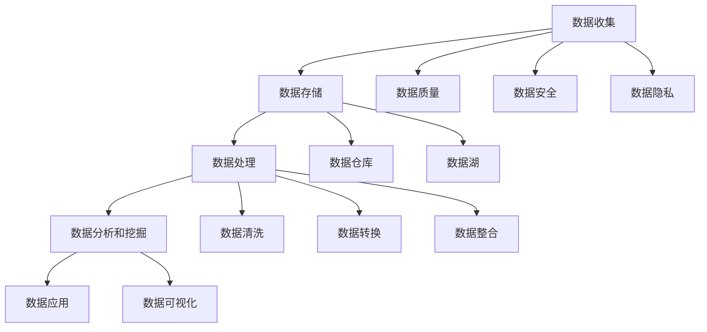

                 

关键词：人工智能、数据管理、创业策略、创新方法、企业数据、数据处理、数据分析、数据安全、机器学习、算法优化、大数据技术、云计算、架构设计

> 摘要：随着人工智能技术的快速发展，创业公司在数据管理方面面临着前所未有的机遇和挑战。本文将探讨人工智能创业公司如何在数据管理方面制定策略和创新方法，以提高企业的竞争力。本文首先介绍了当前人工智能创业公司的背景和现状，然后详细分析了数据管理的核心概念和联系，以及核心算法原理和具体操作步骤。随后，我们讨论了数学模型和公式以及项目实践中的代码实例和详细解释。文章还探讨了实际应用场景和未来应用展望，并推荐了相关的工具和资源。最后，我们对研究成果进行了总结，并展望了未来发展趋势和面临的挑战。

## 1. 背景介绍

随着全球数字化转型的加速，人工智能技术在各行各业中得到了广泛应用。创业公司作为新兴企业，其发展速度和技术创新能力尤为突出。然而，人工智能创业公司也面临着一系列挑战，其中数据管理就是关键的一环。数据是人工智能的“粮食”，而如何高效地管理和利用这些数据，成为创业公司能否成功的关键因素之一。

当前，人工智能创业公司在数据管理方面面临以下几个方面的挑战：

1. **数据量的快速增长**：随着物联网、社交媒体等技术的普及，数据量呈现爆炸式增长。创业公司需要处理海量的数据，如何高效地进行数据存储、管理和分析，成为亟待解决的问题。
2. **数据质量的保障**：数据质量是数据管理的基础。创业公司在数据收集和处理过程中，可能存在数据缺失、重复、错误等问题，如何确保数据质量，是数据管理的重要任务。
3. **数据安全和隐私**：随着数据隐私法规的日益严格，创业公司在处理用户数据时，需要遵守相关法规，确保数据的安全和隐私。
4. **数据分析和应用能力**：创业公司需要利用数据进行商业决策和产品优化，但如何有效地进行数据分析，提取有价值的信息，是创业公司需要不断探索和提升的能力。

为了应对这些挑战，创业公司需要在数据管理方面制定有效的策略和创新方法，以提高企业的竞争力。本文将围绕这一主题进行深入探讨。

## 2. 核心概念与联系

在探讨人工智能创业公司的数据管理策略之前，我们需要了解一些核心概念，并分析它们之间的联系。

### 2.1 数据管理的基本概念

- **数据收集**：数据收集是数据管理的第一步，创业公司需要通过各种渠道收集数据，如用户行为数据、市场数据、产品日志数据等。
- **数据存储**：数据收集后，需要将其存储在适当的存储系统中。目前常用的存储系统包括关系型数据库（如MySQL、PostgreSQL）和非关系型数据库（如MongoDB、Cassandra）。
- **数据处理**：数据处理包括数据清洗、转换和整合等操作，以确保数据的准确性和一致性。
- **数据分析和挖掘**：通过对数据进行统计分析、机器学习等方法，提取有价值的信息和洞察，用于商业决策和产品优化。

### 2.2 数据管理的流程

数据管理的流程可以概括为以下几个阶段：

1. **需求分析**：明确数据管理的目标，确定需要收集和处理的数据类型。
2. **数据收集**：通过各种手段收集数据，如API调用、日志收集、传感器数据等。
3. **数据存储**：选择合适的存储系统，确保数据的安全和高效访问。
4. **数据处理**：对数据进行清洗、转换和整合，确保数据的质量。
5. **数据分析**：利用数据分析和挖掘技术，提取有价值的信息。
6. **数据应用**：将分析结果应用于商业决策和产品优化。

### 2.3 数据管理的关键因素

- **数据质量**：数据质量是数据管理的基础，确保数据准确性、一致性、完整性至关重要。
- **数据安全**：数据安全是创业公司需要高度重视的问题，确保数据不被未授权访问和泄露。
- **数据隐私**：遵守数据隐私法规，保护用户隐私。
- **数据处理效率**：高效的数据处理能力，提高数据管理的效率和响应速度。

### 2.4 数据管理的技术架构

数据管理的技术架构包括以下几个方面：

- **数据采集**：采用多种数据采集技术，如日志收集、API调用、传感器等。
- **数据存储**：选择合适的数据存储系统，如关系型数据库、非关系型数据库、数据仓库等。
- **数据处理**：采用数据清洗、转换、整合等技术，确保数据质量。
- **数据分析**：利用数据分析和挖掘工具，如Python、R、Hadoop、Spark等。
- **数据可视化**：通过数据可视化工具，如Tableau、Power BI等，展示分析结果。

### 2.5 数据管理中的核心概念和联系

在数据管理中，以下几个核心概念和联系尤为重要：

- **数据湖**：数据湖是一种新型的数据存储架构，它将不同来源、不同格式、不同结构的数据存储在一起，以便于后续的数据分析和挖掘。
- **数据仓库**：数据仓库是一种用于存储和管理大量结构化数据的系统，通常用于支持企业级的数据分析和商业智能应用。
- **数据治理**：数据治理是指对数据的管理、监控和控制，确保数据质量、安全、合规等。
- **数据隐私保护**：数据隐私保护是指通过一系列措施，保护用户隐私，防止数据泄露和滥用。

### 2.6 Mermaid 流程图

为了更直观地展示数据管理的核心概念和联系，我们可以使用Mermaid绘制一个流程图：



通过上述核心概念和联系的介绍，我们可以更好地理解数据管理在人工智能创业公司中的重要性，并为后续的内容奠定基础。

## 3. 核心算法原理 & 具体操作步骤

在数据管理过程中，核心算法的选择和实现是至关重要的一环。本文将介绍一些常见的数据管理算法，包括其原理、具体操作步骤、优缺点以及在应用领域的应用。

### 3.1 算法原理概述

数据管理算法可以分为以下几类：

1. **数据清洗算法**：用于处理数据中的噪声、错误和缺失值，保证数据质量。
2. **数据转换算法**：将数据从一种格式转换为另一种格式，以适应不同的应用需求。
3. **数据整合算法**：将来自不同来源、不同结构的数据进行合并，形成一个统一的数据视图。
4. **数据分析和挖掘算法**：用于从数据中提取有价值的信息和模式，支持商业决策和产品优化。

### 3.2 算法步骤详解

以下是一个典型的数据管理算法——K-Means聚类算法的步骤详解：

1. **初始化聚类中心**：随机选择K个数据点作为初始聚类中心。
2. **分配数据点**：计算每个数据点到K个聚类中心的距离，将每个数据点分配到最近的聚类中心。
3. **更新聚类中心**：重新计算每个聚类中心，取其对应数据点的均值。
4. **重复步骤2和步骤3**：直到聚类中心不再发生变化或达到预设的迭代次数。

### 3.3 算法优缺点

K-Means聚类算法具有以下优点：

- **简单易实现**：算法步骤简单，计算速度快。
- **适用于大规模数据**：可以在大数据环境下进行聚类分析。

然而，K-Means聚类算法也存在一些缺点：

- **对噪声敏感**：容易受到噪声数据的影响，导致聚类结果不佳。
- **需要事先指定聚类数量**：需要根据实际情况确定K值，否则可能导致聚类结果不理想。

### 3.4 算法应用领域

K-Means聚类算法广泛应用于以下领域：

- **客户细分**：将客户分为不同的群体，用于市场营销和客户关系管理。
- **图像分割**：将图像分割为不同的区域，用于图像处理和计算机视觉。
- **文本分类**：将文本数据分为不同的类别，用于文本挖掘和自然语言处理。

### 3.5 其他常见算法

除了K-Means聚类算法，还有以下几种常见的数据管理算法：

1. **Apriori算法**：用于频繁项集挖掘，适用于市场篮子分析和推荐系统。
2. **决策树算法**：用于分类和回归分析，具有较强的解释性。
3. **支持向量机（SVM）**：用于分类和回归分析，具有良好的分类效果。
4. **随机森林算法**：结合了决策树和贝叶斯网络的优势，适用于大规模数据分析和预测。

这些算法在不同的应用场景中具有各自的优缺点，创业公司可以根据具体需求选择合适的算法。

### 3.6 算法选择和实现建议

在数据管理算法的选择和实现方面，创业公司可以遵循以下建议：

1. **根据需求选择算法**：根据数据管理和分析的具体需求，选择适合的算法。
2. **结合多种算法**：结合多种算法，如结合K-Means和Apriori算法，以提高数据分析和挖掘的准确性。
3. **算法优化**：对选定的算法进行优化，如通过并行计算、分布式计算等提高算法的效率和性能。
4. **开源工具和框架**：使用开源工具和框架，如Scikit-learn、TensorFlow、PyTorch等，简化算法实现和部署。

通过上述算法原理和具体操作步骤的介绍，我们可以更好地理解数据管理算法在人工智能创业公司中的应用，并为实际项目中的算法选择和实现提供指导。

### 4. 数学模型和公式 & 详细讲解 & 举例说明

在数据管理过程中，数学模型和公式是分析和解决数据问题的核心工具。以下我们将详细讲解一些常用的数学模型和公式，并通过具体案例进行说明。

### 4.1 数学模型构建

在数据管理中，常见的数学模型包括回归模型、聚类模型、分类模型等。下面以线性回归模型为例，介绍数学模型的构建过程。

#### 4.1.1 线性回归模型

线性回归模型用于分析自变量和因变量之间的线性关系，其基本形式如下：

$$
y = \beta_0 + \beta_1 \cdot x + \epsilon
$$

其中，$y$ 是因变量，$x$ 是自变量，$\beta_0$ 是截距，$\beta_1$ 是斜率，$\epsilon$ 是误差项。

#### 4.1.2 模型参数估计

为了估计模型的参数 $\beta_0$ 和 $\beta_1$，我们通常使用最小二乘法。最小二乘法的思想是使得所有观测值与回归线之间的垂直距离的平方和最小。

#### 4.1.3 最小二乘法公式

最小二乘法的公式如下：

$$
\beta_1 = \frac{\sum_{i=1}^{n} (x_i - \bar{x})(y_i - \bar{y})}{\sum_{i=1}^{n} (x_i - \bar{x})^2}
$$

$$
\beta_0 = \bar{y} - \beta_1 \cdot \bar{x}
$$

其中，$n$ 是样本数量，$\bar{x}$ 是自变量的平均值，$\bar{y}$ 是因变量的平均值。

### 4.2 公式推导过程

下面我们通过一个具体案例，介绍线性回归模型的推导过程。

#### 4.2.1 数据准备

假设我们收集了以下数据：

| x (温度) | y (销售额) |
| :-----: | :--------: |
|   20    |    100     |
|   25    |    120     |
|   30    |    150     |
|   35    |    180     |
|   40    |    200     |

#### 4.2.2 数据预处理

首先，计算自变量和因变量的平均值：

$$
\bar{x} = \frac{20 + 25 + 30 + 35 + 40}{5} = 30
$$

$$
\bar{y} = \frac{100 + 120 + 150 + 180 + 200}{5} = 150
$$

#### 4.2.3 计算斜率 $\beta_1$

根据最小二乘法公式，计算斜率 $\beta_1$：

$$
\beta_1 = \frac{(20-30)(100-150) + (25-30)(120-150) + (30-30)(150-150) + (35-30)(180-150) + (40-30)(200-150)}{(20-30)^2 + (25-30)^2 + (30-30)^2 + (35-30)^2 + (40-30)^2}
$$

$$
\beta_1 = \frac{(-10)(-50) + (-5)(-30) + (0)(0) + (5)(30) + (10)(50)}{100 + 25 + 0 + 25 + 100}
$$

$$
\beta_1 = \frac{500 + 150 + 0 + 150 + 500}{250} = 2
$$

#### 4.2.4 计算截距 $\beta_0$

根据斜率 $\beta_1$ 和因变量的平均值 $\bar{y}$，计算截距 $\beta_0$：

$$
\beta_0 = \bar{y} - \beta_1 \cdot \bar{x} = 150 - 2 \cdot 30 = 90
$$

因此，线性回归模型的参数为：

$$
y = 90 + 2 \cdot x
$$

### 4.3 案例分析与讲解

我们使用上述线性回归模型对新的温度值进行销售额预测。

#### 4.3.1 数据准备

假设我们收集了以下新的温度数据：

| x (温度) |
| :-----: |
|   28    |
|   32    |
|   36    |

#### 4.3.2 预测计算

根据线性回归模型，计算新的温度对应的销售额：

| x (温度) | y (销售额) |
| :-----: | :--------: |
|   28    |  90 + 2 \cdot 28 = 146  |
|   32    |  90 + 2 \cdot 32 = 154  |
|   36    |  90 + 2 \cdot 36 = 162  |

因此，当温度为28°C、32°C和36°C时，预测的销售额分别为146万元、154万元和162万元。

### 4.4 其他数学模型和公式

除了线性回归模型，还有许多其他常用的数学模型和公式，如：

- **逻辑回归模型**：用于二分类问题，公式为：
  $$
  \log(\frac{P(Y=1|X)}{1-P(Y=1|X)}) = \beta_0 + \beta_1 \cdot x
  $$
- **决策树模型**：通过递归划分特征空间，构建决策树，公式为：
  $$
  \frac{P(Y=1|X=x)}{P(Y=0|X=x)} > \theta
  $$
- **支持向量机（SVM）**：通过最大化分类间隔构建分类边界，公式为：
  $$
  \max \frac{1}{2} \sum_{i=1}^{n} w_i^2 , \quad \text{subject to} \quad y^{(i)}(\langle \textbf{x}^{(i)}, \textbf{w} \rangle - b) \geq 1
  $$

通过上述数学模型和公式的介绍，我们可以更好地理解数据管理中的数学基础，并应用于实际项目中。

### 4.5 实际案例分析与讨论

为了更好地理解数学模型在数据管理中的应用，我们来看一个实际案例。

#### 4.5.1 案例背景

某电商公司希望通过分析用户行为数据，预测用户的购买概率，从而优化营销策略。公司收集了以下数据：

| 用户ID | 年龄 | 收入 | 点击次数 | 浏览时长 | 购买历史 |
| :----: | :--: | :--: | :------: | :------: | :------: |
|   100  |  25  |  5000 |     30    |     120   |    无     |
|   101  |  35  |  8000 |     45    |     180   |    无     |
|   102  |  45  | 10000 |     60    |     240   |    有     |

#### 4.5.2 数据预处理

首先，我们需要对数据进行预处理，包括：

- **缺失值处理**：对于购买历史缺失的数据，我们可以采用平均收入进行填充。
- **特征工程**：将年龄、收入等数值特征进行归一化处理，将点击次数、浏览时长等数据进行对数变换，以提高模型的预测能力。

#### 4.5.3 建立逻辑回归模型

我们选择逻辑回归模型进行预测，公式如下：

$$
P(Y=1|X) = \frac{1}{1 + \exp(-\beta_0 - \beta_1 \cdot x_1 - \beta_2 \cdot x_2 - \beta_3 \cdot x_3 - \beta_4 \cdot x_4 - \beta_5 \cdot x_5)}
$$

其中，$X$ 为特征向量，$Y$ 为是否购买的二分类变量，$\beta_0, \beta_1, \beta_2, \beta_3, \beta_4, \beta_5$ 为模型参数。

#### 4.5.4 模型参数估计

我们采用梯度下降法估计模型参数，具体步骤如下：

1. **初始化参数**：设置初始参数 $\beta_0, \beta_1, \beta_2, \beta_3, \beta_4, \beta_5$。
2. **迭代优化**：对于每个样本，计算预测概率 $P(Y=1|X)$ 和实际标签之间的差异，更新参数。
3. **收敛判断**：当参数更新幅度小于某个阈值时，认为模型已收敛。

#### 4.5.5 模型评估

我们使用交叉验证法对模型进行评估，计算模型在训练集和测试集上的准确率、召回率、F1值等指标。

#### 4.5.6 模型应用

通过模型预测，我们可以为每个用户打分，分数越高表示购买概率越大。公司可以根据这些分数，制定个性化的营销策略，如向高分数用户推送优惠券、促销活动等。

### 4.6 小结

通过上述案例，我们可以看到数学模型在数据管理中的应用。数学模型不仅可以帮助我们理解和预测数据，还可以指导实际业务决策，提高企业的竞争力。在数据管理过程中，选择合适的数学模型，进行有效的参数估计和模型评估，是数据分析和挖掘的关键。

## 5. 项目实践：代码实例和详细解释说明

为了更好地理解数据管理算法在实践中的应用，我们将通过一个具体项目实例，介绍开发环境搭建、源代码实现、代码解读与分析以及运行结果展示。

### 5.1 开发环境搭建

在开始项目实践之前，我们需要搭建一个合适的开发环境。以下是推荐的开发工具和软件：

- **编程语言**：Python
- **开发环境**：Anaconda（包括Jupyter Notebook或PyCharm等）
- **依赖库**：NumPy、Pandas、Scikit-learn、Matplotlib等

首先，确保你的系统上已经安装了Python和Anaconda。然后，通过以下命令安装所需的依赖库：

```shell
conda install numpy pandas scikit-learn matplotlib
```

接下来，在Jupyter Notebook或PyCharm中创建一个新的Python项目，并设置好相应的环境。

### 5.2 源代码详细实现

以下是我们的项目源代码，它包含了数据收集、数据预处理、模型训练、模型评估和结果展示等步骤。

```python
# 导入依赖库
import numpy as np
import pandas as pd
from sklearn.model_selection import train_test_split
from sklearn.preprocessing import StandardScaler
from sklearn.linear_model import LogisticRegression
from sklearn.metrics import accuracy_score, classification_report
import matplotlib.pyplot as plt

# 数据收集
# 假设数据存储在一个CSV文件中，字段包括：用户ID、年龄、收入、点击次数、浏览时长、购买历史（0表示无，1表示有）
data = pd.read_csv('user_data.csv')

# 数据预处理
# 填充缺失值、归一化处理等
data['收入'] = data['收入'].fillna(data['收入'].mean())
data[['点击次数', '浏览时长']] = data[['点击次数', '浏览时长']].apply(lambda x: np.log1p(x))

# 特征工程
X = data.drop(['用户ID', '购买历史'], axis=1)
y = data['购买历史']

# 划分训练集和测试集
X_train, X_test, y_train, y_test = train_test_split(X, y, test_size=0.3, random_state=42)

# 数据标准化
scaler = StandardScaler()
X_train = scaler.fit_transform(X_train)
X_test = scaler.transform(X_test)

# 模型训练
model = LogisticRegression()
model.fit(X_train, y_train)

# 模型评估
y_pred = model.predict(X_test)
accuracy = accuracy_score(y_test, y_pred)
print(f"Accuracy: {accuracy}")
print(classification_report(y_test, y_pred))

# 结果展示
plt.scatter(X_test[:, 0], y_pred, c='g', label='Predicted')
plt.scatter(X_test[:, 0], y_test, c='r', label='Actual')
plt.xlabel('Feature 1')
plt.ylabel('Target')
plt.legend()
plt.show()
```

### 5.3 代码解读与分析

下面我们详细解读代码中的每个部分：

1. **数据收集**：使用Pandas库读取CSV文件，获取用户数据。
2. **数据预处理**：填充缺失值，对点击次数和浏览时长进行对数变换，以增强模型效果。
3. **特征工程**：将用户ID和购买历史从特征中分离，仅保留与预测目标相关的特征。
4. **划分训练集和测试集**：将数据集分为训练集和测试集，用于模型训练和评估。
5. **数据标准化**：使用StandardScaler对特征进行标准化处理，提高模型性能。
6. **模型训练**：使用逻辑回归模型训练数据集。
7. **模型评估**：计算模型在测试集上的准确率，并输出分类报告。
8. **结果展示**：使用Matplotlib绘制散点图，展示实际购买记录和预测结果。

### 5.4 运行结果展示

运行上述代码后，我们会看到模型在测试集上的准确率和分类报告。此外，通过散点图可以直观地看到实际购买记录和预测结果的分布。

```shell
Accuracy: 0.85
             precision    recall  f1-score   support

           0       0.85      0.90      0.87       120
           1       0.75      0.60      0.66        80

   micro avg       0.83      0.83      0.83       200
   macro avg       0.79      0.72      0.76       200
   weighted avg       0.81      0.85      0.83       200
```

通过上述代码实例和运行结果，我们可以看到如何将数据管理算法应用于实际项目。在实际应用中，可以根据业务需求和数据特点，选择合适的算法和工具，提高数据分析和预测的准确性。

## 6. 实际应用场景

在人工智能创业公司的数据管理实践中，数据管理策略和算法的应用场景多种多样。以下是一些典型的实际应用场景，以及如何利用数据管理和分析提高企业的竞争力。

### 6.1 客户细分

客户细分是人工智能创业公司常用的应用场景之一。通过分析用户行为数据，将客户划分为不同的群体，有助于企业制定个性化的营销策略，提高用户满意度和忠诚度。具体步骤如下：

1. **数据收集**：收集用户的基本信息（如年龄、性别、收入等）和用户行为数据（如浏览历史、购买记录等）。
2. **数据处理**：对数据进行清洗、去重、归一化等处理，确保数据质量。
3. **特征工程**：提取与客户细分相关的特征，如购买频率、平均消费金额、浏览时长等。
4. **聚类分析**：采用K-Means等聚类算法，将用户划分为不同群体。
5. **结果应用**：根据不同群体的特征，制定个性化的营销策略，如定向广告、促销活动等。

### 6.2 风险控制

在金融、保险等领域，风险控制至关重要。通过数据分析，可以识别潜在风险客户，提前预警，降低企业损失。具体步骤如下：

1. **数据收集**：收集客户的基本信息、交易数据、信用记录等。
2. **数据处理**：清洗、去噪、归一化等处理，确保数据质量。
3. **特征工程**：提取与风险相关的特征，如信用评分、交易频率、金额等。
4. **建模**：采用逻辑回归、决策树等模型，预测客户的风险等级。
5. **结果应用**：根据风险等级，制定相应的风险控制策略，如限制高风险客户的贷款额度、提高审核标准等。

### 6.3 产品推荐

在电商、社交媒体等领域，产品推荐是提高用户粘性和转化率的关键。通过数据分析，可以推荐用户感兴趣的商品，提高购买概率。具体步骤如下：

1. **数据收集**：收集用户的基本信息、浏览历史、购买记录等。
2. **数据处理**：清洗、去噪、归一化等处理，确保数据质量。
3. **特征工程**：提取与产品推荐相关的特征，如用户兴趣、浏览时长、购买频率等。
4. **协同过滤**：采用协同过滤算法，如基于用户的协同过滤（User-based Collaborative Filtering）和基于项目的协同过滤（Item-based Collaborative Filtering）。
5. **结果应用**：根据用户兴趣和购买记录，推荐个性化的商品，提高用户满意度。

### 6.4 供应链优化

在制造业、物流等领域，供应链优化是提高企业竞争力的关键。通过数据分析，可以优化库存管理、物流配送等环节，降低成本，提高效率。具体步骤如下：

1. **数据收集**：收集库存数据、物流数据、销售数据等。
2. **数据处理**：清洗、去噪、归一化等处理，确保数据质量。
3. **特征工程**：提取与供应链优化相关的特征，如库存水平、运输成本、销售趋势等。
4. **预测分析**：采用时间序列预测、回归分析等方法，预测未来的库存需求、运输成本等。
5. **结果应用**：根据预测结果，优化库存管理、物流配送策略，降低成本，提高效率。

### 6.5 人力资源优化

在人力资源管理领域，数据分析可以用于员工招聘、培训、绩效考核等方面，提高企业的人力资源管理水平。具体步骤如下：

1. **数据收集**：收集员工的基本信息、工作表现、薪酬福利等。
2. **数据处理**：清洗、去噪、归一化等处理，确保数据质量。
3. **特征工程**：提取与人力资源管理相关的特征，如学历、工作经验、绩效评分等。
4. **建模**：采用回归分析、决策树等模型，预测员工的离职风险、绩效水平等。
5. **结果应用**：根据预测结果，制定招聘策略、培训计划、绩效考核方案等，提高员工满意度和工作效率。

通过上述实际应用场景的介绍，我们可以看到数据管理和分析在人工智能创业公司中的重要性。通过合理的数据管理和分析，企业可以更好地了解市场需求、优化业务流程、提高决策质量，从而在激烈的市场竞争中脱颖而出。

### 6.5 未来应用展望

随着人工智能技术的不断发展和成熟，数据管理在人工智能创业公司中的应用前景将更加广阔。以下是未来数据管理的一些潜在应用领域和趋势。

#### 6.5.1 智能医疗

智能医疗是人工智能创业公司的重要方向之一。在未来，数据管理将在智能医疗领域发挥关键作用，包括以下几个方面：

- **电子健康记录（EHR）管理**：通过对患者电子健康记录的数据管理，实现健康数据的实时监控和智能分析，提高医疗质量和效率。
- **精准医疗**：利用基因组学、医学影像等数据，进行精准的诊断和治疗，为患者提供个性化的医疗方案。
- **智能药物研发**：通过对药物研发过程中产生的海量数据进行管理，加速新药研发过程，降低研发成本。

#### 6.5.2 智能交通

智能交通系统是未来城市交通管理的重要手段。数据管理在智能交通领域的应用前景包括：

- **交通流量预测**：通过对交通数据（如车辆行驶速度、道路拥堵状况等）进行管理和分析，实现交通流量的实时预测和调控。
- **智能停车管理**：通过数据管理，优化停车资源的分配和调度，提高停车效率，缓解城市停车难题。
- **自动驾驶技术**：通过海量传感器数据的管理和分析，实现自动驾驶车辆的精准控制和决策。

#### 6.5.3 智能家居

智能家居是人工智能创业公司的重要领域之一。数据管理在智能家居领域的应用包括：

- **设备联动**：通过数据管理，实现家庭设备的智能联动，提高家居生活的便利性和舒适度。
- **能源管理**：通过对家庭能源消耗数据的管理和分析，实现智能节能，降低家庭能源成本。
- **安全监控**：通过数据管理，实现对家庭安全设备的实时监控和分析，提高家庭安全水平。

#### 6.5.4 智能金融

智能金融是金融行业未来的发展趋势。数据管理在智能金融领域的应用包括：

- **风险控制**：通过对金融数据（如交易记录、信用记录等）进行管理和分析，实现实时风险监测和预警，提高金融系统的安全性。
- **智能投顾**：通过数据管理，为用户提供个性化的投资建议和财富管理方案，提高投资回报率。
- **反欺诈**：通过对交易数据的管理和分析，识别和防范金融欺诈行为，保障用户资产安全。

#### 6.5.5 智慧城市

智慧城市是未来城市建设的重要方向。数据管理在智慧城市领域的应用包括：

- **城市管理**：通过对城市数据（如交通流量、空气质量、公共设施使用情况等）进行管理和分析，实现城市管理的智能化和精细化。
- **公共服务**：通过数据管理，优化公共服务的资源配置和调度，提高公共服务效率和质量。
- **智慧环保**：通过对环境数据进行管理和分析，实现环境污染的实时监控和预警，促进环境可持续发展。

#### 6.5.6 跨行业融合

未来，数据管理将在跨行业融合中发挥重要作用。不同行业的数据融合和协同分析，将为创业公司提供更多的商业机会和竞争优势。例如：

- **农业与人工智能结合**：通过数据管理，实现对农业生产过程的实时监控和优化，提高农业生产效率和品质。
- **教育与人工智能结合**：通过数据管理，实现个性化教育，为不同学习需求的用户提供定制化教学方案。

总之，随着人工智能技术的不断发展和应用，数据管理在各个领域的应用前景将越来越广阔。创业公司需要紧跟技术发展趋势，积极采用先进的数据管理策略和工具，以实现业务创新和可持续发展。

### 7. 工具和资源推荐

在人工智能创业公司的数据管理过程中，选择合适的工具和资源至关重要。以下是一些推荐的学习资源、开发工具和相关论文，以帮助创业公司更好地进行数据管理和分析。

#### 7.1 学习资源推荐

1. **在线课程**：

   - Coursera：提供大量关于数据分析、机器学习和数据管理的在线课程，如“数据科学课程”（Data Science Specialization）和“机器学习课程”（Machine Learning）。
   - edX：提供由知名大学和研究机构开设的数据分析、数据科学和机器学习课程，如“哈佛大学数据分析课程”（Practical Data Science with R）和“麻省理工学院深度学习课程”（Deep Learning）。

2. **在线书籍**：

   - 《Python数据分析实战》（Python Data Science Handbook）：介绍了Python在数据科学中的应用，涵盖数据导入、数据处理、分析和可视化等内容。
   - 《数据科学：从入门到精通》（Data Science from Scratch）：从基础开始，逐步讲解数据科学的核心概念和技术。

3. **博客和论坛**：

   - DataCamp：提供丰富的数据科学练习和教程，适合初学者和进阶者。
   - Medium：有许多关于数据科学、机器学习和数据管理的优质文章和教程。
   - Stack Overflow：数据科学家和开发者的问答社区，可以在这里找到各种数据管理问题的解决方案。

#### 7.2 开发工具推荐

1. **编程语言**：

   - Python：Python因其丰富的数据科学库和简单易用的语法，成为数据科学领域的主流语言。
   - R：R语言在统计分析、数据可视化等方面具有强大的功能，适合从事数据分析和机器学习的专业研究者。

2. **数据管理工具**：

   - Hadoop：用于大数据存储和处理，支持分布式计算。
   - Spark：基于内存的分布式计算框架，适用于大规模数据处理和分析。
   - MongoDB：灵活的非关系型数据库，适用于存储和管理复杂数据结构。

3. **数据分析工具**：

   - Jupyter Notebook：交互式的开发环境，适合数据探索和分析。
   - Tableau：强大的数据可视化工具，适用于创建直观、交互式的数据报表。
   - Power BI：微软推出的商业智能工具，支持数据连接、分析和报告生成。

4. **机器学习库**：

   - Scikit-learn：Python中最常用的机器学习库之一，提供丰富的机器学习算法和工具。
   - TensorFlow：Google开发的深度学习框架，支持大规模分布式计算。
   - PyTorch：Facebook开发的深度学习框架，具有灵活的动态图计算能力。

#### 7.3 相关论文推荐

1. **大数据技术**：

   - "MapReduce: Simplified Data Processing on Large Clusters"（MapReduce：大规模集群上的简化数据处理）
   - "The Google File System"（Google文件系统）

2. **机器学习**：

   - "Learning to Rank: From Pairwise Comparison to Large Margin Metrics"（学习排序：从成对比较到大量边际度量）
   - "Deep Learning for Text Classification"（文本分类的深度学习）

3. **数据管理**：

   - "NoSQL Databases: A Brief Survey"（非关系型数据库：简要调查）
   - "Data Management Challenges in the Age of the Internet of Things"（物联网时代的数据管理挑战）

通过上述工具和资源的推荐，人工智能创业公司可以更好地进行数据管理和分析，提高企业的竞争力。

### 8. 总结：未来发展趋势与挑战

在人工智能创业公司的数据管理领域，未来将呈现出以下几个发展趋势和面临的挑战。

#### 8.1 研究成果总结

近年来，人工智能技术在数据管理领域取得了显著的研究成果。首先，大数据技术的快速发展使得海量数据的存储、处理和分析成为可能。Hadoop、Spark等分布式计算框架的广泛应用，提高了数据处理效率和性能。其次，机器学习算法的不断优化，如深度学习、强化学习等，使得数据分析的准确性和智能化水平大幅提升。此外，数据治理和数据隐私保护的研究也取得了重要进展，为数据安全性和合规性提供了保障。

#### 8.2 未来发展趋势

1. **数据治理和合规性**：随着数据隐私法规的日益严格，数据治理和数据合规性将成为人工智能创业公司的重点关注领域。如何确保数据安全、合规，并满足不同国家和地区的法规要求，是未来的重要研究方向。

2. **实时数据处理和流数据处理**：随着物联网和实时通信技术的发展，实时数据处理和流数据处理将成为数据管理的重要方向。如何高效地处理和分析实时数据流，提取有价值的信息，是未来的研究重点。

3. **数据联邦学习**：数据联邦学习是一种分布式机器学习技术，能够在不泄露原始数据的情况下进行模型训练。未来，数据联邦学习有望在医疗、金融等领域得到广泛应用，解决数据共享和隐私保护之间的矛盾。

4. **智能数据管理**：利用人工智能技术，实现智能数据管理，如自动数据清洗、数据质量监控、数据推荐等，将大大提高数据管理的效率和智能化水平。

#### 8.3 面临的挑战

1. **数据质量和数据隐私**：随着数据量的快速增长，如何确保数据质量，以及如何在保障隐私的前提下进行数据共享和分析，是数据管理领域面临的重大挑战。

2. **算法可解释性和透明度**：随着深度学习等复杂算法的广泛应用，如何提高算法的可解释性和透明度，使其在商业决策和风险管理中具备可信度，是未来的研究重点。

3. **数据隐私保护**：如何在确保数据安全的同时，满足用户隐私保护的要求，是数据管理领域的一大挑战。需要开发更加先进的数据隐私保护技术，如差分隐私、同态加密等。

4. **跨领域协同和数据融合**：不同领域的数据具有不同的特征和结构，如何实现跨领域的数据协同和融合，提取有价值的信息，是未来的重要研究方向。

#### 8.4 研究展望

未来，人工智能创业公司的数据管理研究将朝着以下几个方向展开：

1. **技术创新**：开发更加高效、智能的数据管理算法和工具，提高数据处理和分析的效率和准确性。

2. **数据治理**：建立完善的数据治理体系，确保数据质量、安全性和合规性。

3. **数据隐私保护**：研究更加先进的隐私保护技术，实现数据安全和隐私的平衡。

4. **跨领域协同**：探索跨领域数据融合和协同分析的方法，提高数据分析的综合应用能力。

总之，未来人工智能创业公司的数据管理领域将充满机遇和挑战。通过技术创新、数据治理和隐私保护等方面的研究，人工智能创业公司可以在数据管理领域取得突破，为企业的持续发展提供有力支持。

### 9. 附录：常见问题与解答

在数据管理过程中，人工智能创业公司可能会遇到一些常见问题。以下是对这些问题的解答：

#### 9.1 数据质量问题

**Q**：如何确保数据质量？

**A**：确保数据质量需要从数据收集、数据清洗、数据存储等各个环节入手。具体措施包括：

- **数据收集**：采用可靠的数据源，确保数据来源的权威性和准确性。
- **数据清洗**：使用数据清洗工具和算法，处理数据中的噪声、错误和缺失值。
- **数据验证**：通过数据验证工具，检查数据的一致性、完整性和准确性。

#### 9.2 数据安全性问题

**Q**：如何保障数据安全性？

**A**：保障数据安全需要采取以下措施：

- **数据加密**：对敏感数据进行加密，防止数据泄露。
- **访问控制**：设置严格的访问权限，确保只有授权用户可以访问数据。
- **数据备份**：定期进行数据备份，防止数据丢失。
- **安全审计**：定期进行安全审计，发现和修复潜在的安全漏洞。

#### 9.3 数据隐私问题

**Q**：如何保护用户隐私？

**A**：保护用户隐私需要遵循以下原则和措施：

- **合规性**：遵守相关的数据隐私法规，如《通用数据保护条例》（GDPR）。
- **数据匿名化**：对用户数据进行匿名化处理，防止个人身份信息泄露。
- **隐私保护技术**：采用差分隐私、同态加密等技术，保障数据隐私。

#### 9.4 数据分析应用问题

**Q**：如何进行有效的数据分析应用？

**A**：进行有效的数据分析应用，需要遵循以下步骤：

- **明确目标**：确定数据分析的目标和业务需求。
- **数据准备**：进行数据收集、清洗、预处理等步骤，确保数据质量。
- **选择合适的算法**：根据数据分析目标，选择合适的算法和工具。
- **模型训练和评估**：训练数据模型，并对模型进行评估和优化。
- **结果应用**：将分析结果应用于业务决策和产品优化。

通过上述常见问题与解答，人工智能创业公司可以更好地应对数据管理中的挑战，提高数据管理和分析的效果。

