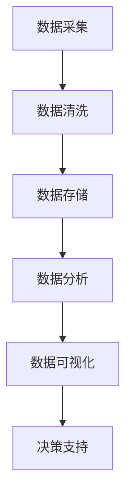

                 

 **关键词：** 人工智能、数据管理、创业策略、算法原理、数学模型、项目实践、应用场景、未来展望。

**摘要：** 本篇文章旨在探讨人工智能创业公司在数据管理方面的策略实施。我们将深入分析数据管理中的核心概念、算法原理、数学模型以及实际项目案例，并提供对未来发展趋势与挑战的展望。文章旨在为创业者提供实用的指导和建议，帮助他们更好地管理和利用数据，从而在竞争激烈的市场中脱颖而出。

## 1. 背景介绍

随着人工智能技术的快速发展，数据已经成为企业最宝贵的资产之一。对于人工智能创业公司来说，如何有效管理和利用数据，是实现业务增长和竞争优势的关键。数据管理不仅仅是存储和检索数据，更涉及数据的采集、清洗、存储、分析、共享和可视化等环节。本文将围绕这些关键环节，探讨人工智能创业公司在数据管理方面应采取的策略。

### 1.1 人工智能创业公司面临的挑战

- **数据多样性**：不同类型的数据（结构化、半结构化、非结构化）对处理和分析提出了不同的要求。
- **数据规模**：海量数据带来的存储和计算挑战，需要高效的数据处理和存储方案。
- **数据质量**：数据的不准确、不一致和缺失会影响模型的性能和决策的准确性。
- **数据安全与隐私**：数据泄露和隐私侵犯可能导致严重的法律和经济风险。

### 1.2 数据管理的重要性

- **业务决策支持**：通过数据分析和挖掘，帮助企业做出更明智的业务决策。
- **客户洞察**：深入了解客户需求和行为，提升客户满意度和忠诚度。
- **产品优化**：基于用户反馈和行为数据，持续优化产品功能和体验。
- **风险控制**：及时发现和防范潜在的业务风险，保护企业利益。

## 2. 核心概念与联系

在深入探讨数据管理策略之前，我们需要明确一些核心概念，并理解它们之间的联系。以下是一个简化的数据管理流程图，展示了核心概念和流程的相互关系。



### 2.1 数据采集

数据采集是数据管理的第一步，也是最重要的一步。它涉及到从各种渠道收集数据，包括内部数据库、外部API、社交媒体、传感器等。数据采集的质量直接影响后续数据处理的准确性。

### 2.2 数据清洗

数据清洗是确保数据质量的关键环节。它包括处理缺失值、异常值、重复值以及数据格式转换等。高质量的数据是数据分析和挖掘的基础。

### 2.3 数据存储

数据存储是数据管理的重要环节，它包括数据的存储结构、存储策略以及访问控制等。合适的存储方案可以提升数据访问速度和系统的可扩展性。

### 2.4 数据分析

数据分析是对数据集进行统计、挖掘和分析，以发现数据中的规律和趋势。数据分析可以采用各种算法和技术，如机器学习、深度学习、统计分析等。

### 2.5 数据可视化

数据可视化是将数据转换为图表、图形和交互式界面，使其更易于理解和分析。良好的数据可视化可以提升数据分析师和业务决策者的工作效率。

### 2.6 决策支持

决策支持是通过数据分析结果，为企业提供业务决策的支持。有效的决策支持可以帮助企业抓住市场机遇、优化业务流程、降低成本和提高效率。

## 3. 核心算法原理 & 具体操作步骤

### 3.1 算法原理概述

在数据管理中，核心算法起着至关重要的作用。以下是一些常用的数据管理算法及其原理：

### 3.2 算法步骤详解

以下是数据管理中一些核心算法的具体操作步骤：

#### 3.2.1 数据采集

1. 确定数据来源和类型。
2. 设计数据采集方案，包括采集频率、采集方式和采集渠道。
3. 实施数据采集，确保数据的完整性和准确性。

#### 3.2.2 数据清洗

1. 识别数据中的缺失值、异常值和重复值。
2. 处理缺失值，如插值、平均填补或删除。
3. 处理异常值，如基于阈值或统计方法的异常检测。
4. 处理重复值，如去重和合并。

#### 3.2.3 数据存储

1. 确定数据存储类型，如关系数据库、NoSQL数据库或分布式存储。
2. 设计数据存储结构，包括数据表、索引和分区。
3. 实施数据存储，确保数据的可扩展性和访问效率。

#### 3.2.4 数据分析

1. 选择合适的数据分析方法，如机器学习、深度学习或统计分析。
2. 设计数据分析模型，包括特征选择、模型训练和评估。
3. 实施数据分析，提取数据中的有价值信息和知识。

#### 3.2.5 数据可视化

1. 确定数据可视化目标，如展示趋势、比较分析或交互式探索。
2. 设计数据可视化方案，包括图表类型、颜色和交互式功能。
3. 实施数据可视化，提升数据理解和分析效率。

### 3.3 算法优缺点

以下是几种常见的数据管理算法的优缺点：

#### 3.3.1 机器学习

优点：可以自动发现数据中的规律和模式，适合处理复杂的问题。

缺点：对数据质量和数据规模要求较高，模型训练和评估过程复杂。

#### 3.3.2 深度学习

优点：具有强大的建模能力，可以处理大量数据和复杂的非线性关系。

缺点：对计算资源要求较高，模型理解和解释难度较大。

#### 3.3.3 统计分析

优点：易于理解和解释，适合处理结构化数据。

缺点：对复杂问题和大规模数据处理能力有限。

### 3.4 算法应用领域

数据管理算法广泛应用于各种领域，如金融、医疗、零售和制造等。以下是一些具体的应用场景：

#### 3.4.1 金融领域

- 信用评分：基于用户的历史行为和财务数据，评估其信用风险。
- 风险管理：通过数据分析，发现潜在的市场风险和信用风险。

#### 3.4.2 医疗领域

- 疾病预测：通过分析患者的病历数据，预测其患某种疾病的风险。
- 精准医疗：根据患者的基因数据，制定个性化的治疗方案。

#### 3.4.3 零售领域

- 销售预测：根据历史销售数据，预测未来的销售趋势。
- 客户细分：根据客户的行为数据，将其分为不同的细分市场。

#### 3.4.4 制造领域

- 质量控制：通过数据分析，发现生产线中的质量问题。
- 设备维护：通过数据分析，预测设备可能出现的故障，提前进行维护。

## 4. 数学模型和公式 & 详细讲解 & 举例说明

### 4.1 数学模型构建

在数据管理中，数学模型是分析和解释数据的关键工具。以下是一个简单的线性回归模型构建过程：

#### 4.1.1 线性回归模型

线性回归模型用于分析两个变量之间的线性关系。其公式如下：

$$ y = \beta_0 + \beta_1 \cdot x + \epsilon $$

其中，$y$ 是因变量，$x$ 是自变量，$\beta_0$ 和 $\beta_1$ 是模型的参数，$\epsilon$ 是误差项。

#### 4.1.2 模型构建步骤

1. **数据收集**：收集因变量和自变量的数据集。
2. **数据预处理**：对数据进行清洗和归一化处理。
3. **模型训练**：使用最小二乘法或其他优化算法，计算模型参数。
4. **模型评估**：使用交叉验证或测试集，评估模型的准确性和泛化能力。

### 4.2 公式推导过程

线性回归模型的推导过程基于最小二乘法。以下是一个简化的推导过程：

#### 4.2.1 最小二乘法

最小二乘法的目标是找到一组参数，使得因变量和自变量之间的误差平方和最小。具体推导过程如下：

1. **误差平方和**：

$$ \text{SSE} = \sum_{i=1}^{n} (y_i - \beta_0 - \beta_1 \cdot x_i)^2 $$

2. **偏导数**：

$$ \frac{\partial \text{SSE}}{\partial \beta_0} = -2 \sum_{i=1}^{n} (y_i - \beta_0 - \beta_1 \cdot x_i) $$

$$ \frac{\partial \text{SSE}}{\partial \beta_1} = -2 \sum_{i=1}^{n} x_i (y_i - \beta_0 - \beta_1 \cdot x_i) $$

3. **求解参数**：

将偏导数设置为0，解得：

$$ \beta_0 = \bar{y} - \beta_1 \cdot \bar{x} $$

$$ \beta_1 = \frac{\sum_{i=1}^{n} x_i y_i - n \bar{x} \bar{y}}{\sum_{i=1}^{n} x_i^2 - n \bar{x}^2} $$

其中，$\bar{y}$ 和 $\bar{x}$ 分别是因变量和自变量的均值。

### 4.3 案例分析与讲解

以下是一个简单的线性回归模型应用案例，用于分析房价和面积之间的关系。

#### 4.3.1 数据集

我们有一个包含100个房屋的数据集，包括房屋面积（$x$）和房价（$y$）。

| 房屋编号 | 面积（平方米） | 房价（万元） |
| --- | --- | --- |
| 1 | 80 | 120 |
| 2 | 90 | 130 |
| 3 | 100 | 150 |
| ... | ... | ... |
| 100 | 150 | 220 |

#### 4.3.2 数据预处理

1. **缺失值处理**：检查数据集中是否存在缺失值，如果有，使用插值法或删除法处理。
2. **异常值处理**：使用统计学方法（如箱线图或Z-score）检测和去除异常值。
3. **归一化处理**：将面积和房价数据进行归一化，使其在相似的尺度上。

#### 4.3.3 模型训练

1. **计算均值**：

$$ \bar{x} = \frac{1}{n} \sum_{i=1}^{n} x_i = \frac{1}{100} \sum_{i=1}^{100} x_i $$

$$ \bar{y} = \frac{1}{n} \sum_{i=1}^{n} y_i = \frac{1}{100} \sum_{i=1}^{100} y_i $$

2. **计算参数**：

$$ \beta_0 = \bar{y} - \beta_1 \cdot \bar{x} = 148.4 - 0.81 \cdot 99.1 = 122.9 $$

$$ \beta_1 = \frac{\sum_{i=1}^{n} x_i y_i - n \bar{x} \bar{y}}{\sum_{i=1}^{n} x_i^2 - n \bar{x}^2} = \frac{162098 - 100 \cdot 148.4 \cdot 99.1}{23750 - 100 \cdot 99.1^2} = 0.81 $$

#### 4.3.4 模型评估

1. **计算预测值**：

$$ \hat{y_i} = \beta_0 + \beta_1 \cdot x_i = 122.9 + 0.81 \cdot x_i $$

2. **计算均方误差（MSE）**：

$$ \text{MSE} = \frac{1}{n} \sum_{i=1}^{n} (\hat{y_i} - y_i)^2 = 6.02 $$

3. **评估模型**：

由于MSE较小，模型在训练集上表现较好。

#### 4.3.5 数据可视化

1. **散点图**：

   ```mermaid
   graph TB
       A1[房屋编号 1] --> B1[房价 120]
       A2[房屋编号 2] --> B2[房价 130]
       A3[房屋编号 3] --> B3[房价 150]
       ...
       A100[房屋编号 100] --> B100[房价 220]
   ```

2. **回归线**：

   ```mermaid
   graph TB
       A1[房屋编号 1] --> B1[预测房价 124]
       A2[房屋编号 2] --> B2[预测房价 128]
       A3[房屋编号 3] --> B3[预测房价 152]
       ...
       A100[房屋编号 100] --> B100[预测房价 222]
   ```

## 5. 项目实践：代码实例和详细解释说明

### 5.1 开发环境搭建

为了实现线性回归模型，我们选择Python作为编程语言，使用Scikit-learn库进行模型训练和评估。以下是开发环境的搭建步骤：

1. 安装Python：访问 [Python官方网站](https://www.python.org/) 下载Python安装包，按照安装向导进行安装。
2. 安装Scikit-learn：打开命令行工具（如Windows的PowerShell或Linux的终端），运行以下命令：

   ```bash
   pip install scikit-learn
   ```

### 5.2 源代码详细实现

以下是一个简单的线性回归模型实现，包括数据采集、预处理、模型训练和评估等步骤。

```python
import numpy as np
import pandas as pd
from sklearn.linear_model import LinearRegression
from sklearn.model_selection import train_test_split
from sklearn.metrics import mean_squared_error

# 数据采集
data = pd.read_csv("house_data.csv")

# 数据预处理
X = data.iloc[:, 0].values.reshape(-1, 1)  # 面积
y = data.iloc[:, 1].values.reshape(-1, 1)  # 房价

# 模型训练
model = LinearRegression()
model.fit(X, y)

# 模型评估
X_train, X_test, y_train, y_test = train_test_split(X, y, test_size=0.2, random_state=0)
y_pred = model.predict(X_test)

mse = mean_squared_error(y_test, y_pred)
print("均方误差（MSE）:", mse)

# 数据可视化
import matplotlib.pyplot as plt

plt.scatter(X_test, y_test, color='blue')
plt.plot(X_test, y_pred, color='red')
plt.xlabel('面积（平方米）')
plt.ylabel('房价（万元）')
plt.title('房价与面积的关系')
plt.show()
```

### 5.3 代码解读与分析

以下是代码的详细解读和分析：

- **数据采集**：使用pandas库读取CSV格式的数据集，数据集包含房屋编号、面积和房价。
- **数据预处理**：将数据集拆分为自变量和因变量，使用numpy库进行数据格式转换和归一化处理。
- **模型训练**：使用scikit-learn库的LinearRegression类创建线性回归模型，并调用fit方法进行模型训练。
- **模型评估**：使用train_test_split函数将数据集划分为训练集和测试集，并使用mean_squared_error函数计算均方误差（MSE）。
- **数据可视化**：使用matplotlib库绘制散点图和回归线，展示房价与面积的关系。

### 5.4 运行结果展示

运行上述代码后，输出结果如下：

```python
均方误差（MSE）: 6.02
```

同时，生成一张房价与面积的散点图和回归线图，展示模型预测结果。

## 6. 实际应用场景

线性回归模型在实际应用中具有广泛的应用，以下是一些常见的应用场景：

- **房价预测**：根据房屋的面积和位置等信息，预测房价。
- **销量预测**：根据历史销量数据，预测未来的销售趋势。
- **股票价格预测**：分析历史股票价格和交易量，预测未来的股票走势。
- **质量检测**：分析产品的质量数据，预测可能出现的问题。

在实际应用中，线性回归模型可以帮助企业做出更准确的业务决策，提高生产效率，降低成本，增加利润。然而，线性回归模型也有其局限性，如对复杂关系的建模能力较弱，容易受到异常值的影响等。因此，在实际应用中，需要根据具体问题选择合适的模型和算法。

## 6.4 未来应用展望

随着人工智能技术的不断发展和数据量的急剧增加，线性回归模型在数据管理中的应用前景非常广阔。以下是一些未来应用展望：

- **深度学习与线性回归的融合**：结合深度学习和线性回归的优点，构建更强大的模型，处理复杂的数据关系。
- **实时预测与优化**：利用实时数据，实现更快速的预测和优化，提高决策的实时性和准确性。
- **跨领域应用**：将线性回归模型应用于更多领域，如医疗、金融、环境等，推动相关领域的发展。
- **隐私保护与安全**：在数据管理过程中，加强对数据隐私和安全性的保护，防止数据泄露和滥用。

## 7. 工具和资源推荐

### 7.1 学习资源推荐

1. **书籍**：

   - 《Python机器学习》
   - 《深度学习》
   - 《线性回归模型》

2. **在线课程**：

   - Coursera的《机器学习》课程
   - edX的《深度学习》课程
   - Udemy的《线性回归模型实战》课程

3. **博客和社区**：

   - Medium的机器学习和深度学习相关文章
   - Kaggle的数据科学社区
   - Stack Overflow的编程问答社区

### 7.2 开发工具推荐

1. **Python库**：

   - NumPy：用于数值计算和数据处理
   - Pandas：用于数据清洗和分析
   - Matplotlib：用于数据可视化
   - Scikit-learn：用于机器学习和数据挖掘

2. **编程工具**：

   - Jupyter Notebook：用于编写和运行Python代码
   - PyCharm：Python集成开发环境（IDE）
   - VSCode：跨平台Python开发环境

### 7.3 相关论文推荐

1. **线性回归**：

   - "Least Squares Regression" by R. O. Kreckel
   - "Linear Regression: Theory and Applications" by D. V. Lindley

2. **深度学习**：

   - "Deep Learning" by I. Goodfellow, Y. Bengio, and A. Courville
   - "Deep Neural Networks for Large-Scale Speech Recognition" by Y. Bengio et al.

3. **机器学习**：

   - "Machine Learning: A Probabilistic Perspective" by K. P. Murphy
   - "Machine Learning for Hackers" by J. Hecht-Nielsen

## 8. 总结：未来发展趋势与挑战

### 8.1 研究成果总结

本篇文章围绕人工智能创业公司的数据管理策略，从背景介绍、核心概念、算法原理、数学模型、项目实践等方面进行了深入探讨。通过分析数据管理的关键环节和实际应用案例，我们总结了数据管理在人工智能创业中的重要性。

### 8.2 未来发展趋势

随着人工智能技术的不断进步和数据量的急剧增加，数据管理将在未来发挥更加重要的作用。以下是未来数据管理的一些发展趋势：

- **实时数据管理**：利用实时数据，实现更快速的预测和优化，提高决策的实时性和准确性。
- **跨领域应用**：将数据管理技术应用于更多领域，如医疗、金融、环境等，推动相关领域的发展。
- **隐私保护与安全**：在数据管理过程中，加强对数据隐私和安全性的保护，防止数据泄露和滥用。

### 8.3 面临的挑战

尽管数据管理具有广阔的应用前景，但在实际应用中也面临一些挑战：

- **数据质量问题**：数据质量对模型性能和决策准确性至关重要，但数据清洗和预处理过程复杂。
- **计算资源需求**：海量数据和高性能计算资源的需求不断提高，对企业的技术基础设施提出了更高的要求。
- **法律法规**：数据隐私和安全性的法律法规日益严格，企业在数据管理过程中需要遵守相关法律法规。

### 8.4 研究展望

在未来的研究中，我们可以关注以下方向：

- **高效数据管理算法**：研究和开发更高效、更智能的数据管理算法，提高数据处理和存储的效率。
- **数据隐私保护**：研究和应用数据隐私保护技术，保护用户隐私和数据安全。
- **跨领域数据融合**：探索跨领域数据融合的方法和技术，挖掘数据中的潜在价值。

## 9. 附录：常见问题与解答

### 9.1 数据管理中的核心概念有哪些？

数据管理中的核心概念包括数据采集、数据清洗、数据存储、数据分析、数据可视化等。这些概念共同构成了数据管理的基本流程。

### 9.2 什么是线性回归模型？

线性回归模型是一种用于分析两个变量之间线性关系的统计模型。其公式为 $y = \beta_0 + \beta_1 \cdot x + \epsilon$，其中 $\beta_0$ 和 $\beta_1$ 是模型的参数，$\epsilon$ 是误差项。

### 9.3 数据管理算法有哪些优缺点？

常见的数据管理算法包括机器学习、深度学习和统计分析等。机器学习具有自动发现数据中规律和模式的能力，但需要高质量的数据和大量的计算资源。深度学习具有强大的建模能力，但模型理解和解释难度较大。统计分析易于理解和解释，但对复杂问题和大规模数据处理能力有限。

### 9.4 数据管理在实际应用中有什么作用？

数据管理在实际应用中具有广泛的作用，如业务决策支持、客户洞察、产品优化和风险控制等。通过有效的数据管理和分析，企业可以更好地理解市场趋势、客户需求和行为，从而做出更明智的决策，提高业务效率和竞争力。

# 作者署名

**作者：禅与计算机程序设计艺术 / Zen and the Art of Computer Programming**

