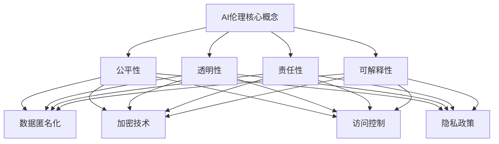

                 

### 关键词 Keyword

- 人工智能创业
- 伦理问题
- 隐私保护
- 数据安全
- 合规性
- 人工智能法规

### 摘要 Abstract

随着人工智能技术的迅猛发展，创业领域涌现出大量基于AI的应用。然而，随之而来的是伦理和隐私问题的挑战。本文旨在为人工智能创业者提供一套伦理与隐私指南，以帮助他们在技术开发和应用过程中遵循道德原则、保护用户隐私，并确保合规性。文章将深入探讨AI伦理的核心原则，隐私保护的策略，以及如何在创业过程中应对相关法规和挑战。

## 1. 背景介绍 Background

人工智能（AI）已成为科技界的热点话题，并在各行各业中发挥了重要作用。无论是自动驾驶汽车、智能家居，还是医疗诊断和金融预测，AI技术的应用正不断拓展。创业公司在这一浪潮中扮演着重要角色，它们通过创新的AI解决方案，推动了市场的增长和变革。

然而，随着AI技术的广泛应用，伦理和隐私问题也逐渐凸显。AI算法的决策过程可能存在偏见，导致不公平的结果。此外，大量个人数据的收集和使用引发了隐私泄露和数据滥用的担忧。这些问题的存在不仅影响了用户的信任，也制约了AI技术的发展。

### 1.1 AI伦理的重要性

AI伦理的重要性体现在多个方面。首先，AI技术的发展和应用需要遵循道德原则，确保其对人类社会的正面影响。其次，伦理问题的处理有助于构建可持续的AI生态系统，增强用户的信任。此外，良好的AI伦理实践还能提升企业形象，为企业带来长期的品牌价值。

### 1.2 隐私保护的挑战

隐私保护是AI创业过程中不可忽视的问题。随着数据量的增加，如何确保数据的安全和用户的隐私成为一项挑战。数据泄露、数据滥用和未经授权的数据访问都可能对用户造成严重后果。因此，创业者需要采取有效的隐私保护措施，以维护用户信任和合规要求。

### 1.3 AI伦理和隐私保护的必要性

AI伦理和隐私保护的必要性体现在以下几个方面：

1. **用户信任**：良好的伦理和隐私保护实践能够增强用户对AI技术的信任，从而促进技术的普及和应用。
2. **合规要求**：许多国家和地区已经制定了AI相关的法规和标准，创业者需要确保其产品和服务符合相关法规要求，以避免法律风险。
3. **社会责任**：作为AI技术的开发者，创业者有责任确保其产品对社会产生积极影响，避免不良后果。

### 1.4 本文目标

本文的目标是为人工智能创业者提供一套全面的伦理与隐私指南，帮助他们：

1. **理解AI伦理的核心原则**：包括公平性、透明性、责任性和可解释性等。
2. **掌握隐私保护策略**：包括数据匿名化、加密技术、访问控制和隐私政策等。
3. **了解相关法规和合规要求**：包括GDPR、CCPA等全球主要法规。
4. **应对AI伦理和隐私保护的挑战**：通过案例分析、最佳实践和工具推荐，提供具体的解决方案。

通过本文，创业者可以更好地应对AI伦理和隐私保护方面的挑战，确保其产品和服务在合法、合规的基础上，赢得用户的信任和市场的认可。

## 2. 核心概念与联系 Core Concepts and Relationships

### 2.1 AI伦理核心概念

在探讨AI伦理时，以下几个核心概念是不可或缺的：

#### 2.1.1 公平性（Fairness）

公平性是指AI系统在决策过程中不应存在偏见，确保对不同群体的影响一致。公平性涉及避免性别、种族、年龄等方面的歧视，确保系统输出符合道德标准。

#### 2.1.2 透明性（Transparency）

透明性强调AI系统的决策过程应易于理解，用户可以清晰地了解系统是如何运作的。透明性有助于提高用户对AI系统的信任，并允许外部审查。

#### 2.1.3 责任性（Accountability）

责任性是指当AI系统出现错误时，责任应明确归属于具体个体或组织。这有助于建立责任链条，确保问题得到及时解决。

#### 2.1.4 可解释性（Explainability）

可解释性关注AI系统的决策依据，使得非专业人士也能理解其工作原理。这对于提高AI系统的透明性和信任度至关重要。

### 2.2 隐私保护核心概念

在隐私保护方面，以下核心概念至关重要：

#### 2.2.1 数据匿名化（Data Anonymization）

数据匿名化通过移除或修改个人身份信息，使得数据无法直接关联到具体个人。这是保护隐私的基本策略。

#### 2.2.2 加密技术（Encryption）

加密技术通过将数据转化为密码形式，确保数据在传输和存储过程中不被未授权访问。

#### 2.2.3 访问控制（Access Control）

访问控制通过设置权限和认证机制，确保只有授权用户才能访问敏感数据。

#### 2.2.4 隐私政策（Privacy Policy）

隐私政策是企业在收集、使用和存储用户数据时遵循的规则，用户在访问和使用服务前应充分了解。

### 2.3 AI伦理与隐私保护的联系

AI伦理和隐私保护之间存在紧密联系：

1. **公平性与隐私**：AI系统在处理个人数据时，应确保隐私保护措施能够有效避免不公平的结果。
2. **透明性与隐私**：透明的AI系统应公开其数据处理方式，以增强用户对隐私保护的信任。
3. **责任性与隐私**：明确的责任机制有助于在隐私泄露事件中追究责任，保护用户权益。
4. **可解释性与隐私**：可解释的AI系统能够揭示其数据处理逻辑，有助于用户理解隐私保护措施。

### 2.4 Mermaid 流程图

以下是AI伦理与隐私保护核心概念的联系流程图：



通过以上流程图，我们可以清晰地看到AI伦理和隐私保护之间的相互作用。只有在充分考虑伦理原则的基础上，才能实施有效的隐私保护策略，从而保障用户的权益和信任。

## 3. 核心算法原理 & 具体操作步骤 Core Algorithm Principles & Operational Steps

### 3.1 算法原理概述

在人工智能创业过程中，算法原理的理解和正确应用是确保项目成功的关键。以下是几个核心算法原理的概述：

#### 3.1.1 深度学习（Deep Learning）

深度学习是一种通过多层神经网络模拟人类大脑处理信息的方法。它通过大量数据的训练，能够自动提取特征并生成预测。深度学习在图像识别、自然语言处理和自动驾驶等领域具有广泛应用。

#### 3.1.2 强化学习（Reinforcement Learning）

强化学习是一种通过试错和反馈来学习最优策略的算法。它通过与环境的互动，不断调整行为策略，以达到最大化奖励。强化学习在游戏、推荐系统和机器人控制等领域表现出色。

#### 3.1.3 生成对抗网络（Generative Adversarial Networks, GANs）

生成对抗网络由两个神经网络组成：生成器（Generator）和判别器（Discriminator）。生成器生成虚假数据，判别器判断数据是真实还是虚假。通过对抗训练，GANs能够生成高质量的图像和文本。

#### 3.1.4 聚类算法（Clustering Algorithms）

聚类算法用于将数据集划分为若干个群组，使得同一群组内的数据尽可能相似，而不同群组的数据尽可能不同。常用的聚类算法包括K-means、层次聚类和DBSCAN。

### 3.2 算法步骤详解

在具体应用这些算法时，通常需要以下步骤：

#### 3.2.1 数据收集与预处理

1. **数据收集**：从各种渠道获取所需数据，包括公开数据集、用户生成数据和第三方数据源。
2. **数据预处理**：清洗数据，处理缺失值和异常值，并进行特征提取和工程。

#### 3.2.2 模型选择与训练

1. **模型选择**：根据具体问题选择合适的模型，如深度学习模型、强化学习模型或聚类算法。
2. **模型训练**：使用训练数据对模型进行训练，调整模型参数，提高模型性能。

#### 3.2.3 模型评估与优化

1. **模型评估**：使用验证集评估模型性能，通过指标如准确率、召回率和F1值等评估模型表现。
2. **模型优化**：根据评估结果调整模型参数，或尝试不同的模型架构，以提高性能。

#### 3.2.4 模型部署与监控

1. **模型部署**：将训练好的模型部署到生产环境中，使其能够为实际应用提供服务。
2. **模型监控**：监控模型在生产环境中的性能，及时处理可能出现的问题。

### 3.3 算法优缺点

每种算法都有其优缺点，创业者需要根据具体应用场景选择合适的算法：

#### 3.3.1 深度学习

**优点**：

- 强大的特征提取能力
- 能够处理大规模数据

**缺点**：

- 需要大量训练数据
- 训练时间较长

#### 3.3.2 强化学习

**优点**：

- 能够学习复杂策略
- 能够应对动态环境

**缺点**：

- 学习过程较慢
- 需要大量反馈数据

#### 3.3.3 生成对抗网络

**优点**：

- 高质量的生成数据
- 能够学习复杂分布

**缺点**：

- 训练难度大
- 需要大量计算资源

#### 3.3.4 聚类算法

**优点**：

- 简单易用
- 能够发现数据分布

**缺点**：

- 结果可能受初始参数影响
- 不易解释

### 3.4 算法应用领域

不同的算法在各个领域有不同的应用：

- **深度学习**：图像识别、自然语言处理、语音识别、自动驾驶等。
- **强化学习**：游戏、推荐系统、机器人控制等。
- **生成对抗网络**：图像生成、艺术创作、虚拟现实等。
- **聚类算法**：市场细分、社交网络分析、数据挖掘等。

通过了解这些算法的原理和应用，创业者可以更好地选择合适的算法，为其项目提供强有力的技术支持。

## 4. 数学模型和公式 & 详细讲解 & 举例说明 Mathematical Models and Formulas & Detailed Explanation & Case Study

### 4.1 数学模型构建

在人工智能创业过程中，构建数学模型是解决实际问题的关键步骤。以下是几种常见的数学模型及其构建过程：

#### 4.1.1 逻辑回归（Logistic Regression）

逻辑回归是一种用于分类问题的统计模型。其数学模型可以表示为：

$$
P(Y=1|X) = \frac{1}{1 + e^{-(\beta_0 + \beta_1X_1 + \beta_2X_2 + \ldots + \beta_nX_n})}
$$

其中，$P(Y=1|X)$ 是给定特征 $X$ 时目标变量 $Y$ 为1的概率，$\beta_0, \beta_1, \beta_2, \ldots, \beta_n$ 是模型的参数。

#### 4.1.2 线性回归（Linear Regression）

线性回归是一种用于预测数值变量的模型。其数学模型可以表示为：

$$
Y = \beta_0 + \beta_1X_1 + \beta_2X_2 + \ldots + \beta_nX_n + \epsilon
$$

其中，$Y$ 是预测变量，$X_1, X_2, \ldots, X_n$ 是特征变量，$\beta_0, \beta_1, \beta_2, \ldots, \beta_n$ 是模型参数，$\epsilon$ 是误差项。

#### 4.1.3 决策树（Decision Tree）

决策树是一种基于特征进行分类或回归的树形结构。其数学模型可以表示为：

$$
T = \{ (X, Y) | X \in \chi, Y \in \{0, 1\} \}
$$

其中，$T$ 是决策树，$X$ 是特征集合，$Y$ 是目标变量。决策树通过一系列条件判断，将数据划分为不同的分支。

### 4.2 公式推导过程

以下是逻辑回归模型的推导过程：

假设我们有一个二分类问题，目标变量 $Y$ 只有两个可能的取值：0和1。给定特征向量 $X = [X_1, X_2, \ldots, X_n]$，我们希望预测 $Y$ 的概率分布。

首先，我们定义线性组合 $Z = \beta_0 + \beta_1X_1 + \beta_2X_2 + \ldots + \beta_nX_n$，其中 $\beta_0, \beta_1, \beta_2, \ldots, \beta_n$ 是模型参数。

然后，我们引入 sigmoid 函数，将线性组合映射到概率分布：

$$
P(Y=1|X) = \frac{1}{1 + e^{-Z}} = \frac{1}{1 + e^{-(\beta_0 + \beta_1X_1 + \beta_2X_2 + \ldots + \beta_nX_n)}}
$$

这样，我们就可以通过优化参数 $\beta_0, \beta_1, \beta_2, \ldots, \beta_n$ 来训练逻辑回归模型。

### 4.3 案例分析与讲解

#### 4.3.1 信用卡欺诈检测

假设我们要构建一个信用卡欺诈检测系统，特征包括用户的消费金额、消费时间、消费地点等。我们使用逻辑回归模型来预测是否为欺诈交易。

1. **数据收集与预处理**：收集信用卡交易数据，包括正常交易和欺诈交易。对数据进行清洗和处理，提取有用的特征。

2. **模型训练**：使用训练数据集，通过梯度下降算法训练逻辑回归模型。优化模型参数 $\beta_0, \beta_1, \beta_2, \ldots, \beta_n$。

3. **模型评估**：使用验证集评估模型性能，计算准确率、召回率和F1值等指标。根据评估结果调整模型参数。

4. **模型部署**：将训练好的模型部署到生产环境中，对实时交易进行欺诈检测。

通过以上步骤，我们可以构建一个有效的信用卡欺诈检测系统，提高金融机构的风险管理能力。

#### 4.3.2 房价预测

假设我们要预测某个城市的房价，特征包括房屋面积、建造年份、附近学校数量等。我们使用线性回归模型来预测房价。

1. **数据收集与预处理**：收集历史房价数据，包括房屋特征和价格。对数据进行清洗和处理，提取有用的特征。

2. **模型训练**：使用训练数据集，通过最小二乘法训练线性回归模型。优化模型参数 $\beta_0, \beta_1, \beta_2, \ldots, \beta_n$。

3. **模型评估**：使用验证集评估模型性能，计算预测误差和R平方值等指标。根据评估结果调整模型参数。

4. **模型部署**：将训练好的模型部署到生产环境中，对新的房屋特征进行房价预测。

通过以上步骤，我们可以构建一个房价预测系统，为房地产开发商和投资者提供参考。

通过以上案例，我们可以看到数学模型在人工智能创业中的重要作用。创业者需要掌握基本的数学模型原理，并结合实际业务需求进行模型构建和优化。

## 5. 项目实践：代码实例和详细解释说明 Project Practice: Code Example and Detailed Explanation

### 5.1 开发环境搭建

在开始编写代码之前，我们需要搭建一个适合AI项目开发的环境。以下是一个简单的步骤指南：

1. **安装Python**：确保Python 3.8或更高版本已安装在您的计算机上。

2. **安装必要的库**：使用pip命令安装以下库：scikit-learn、pandas、numpy、matplotlib。

   ```bash
   pip install scikit-learn pandas numpy matplotlib
   ```

3. **设置虚拟环境**：为了避免库版本冲突，我们可以使用虚拟环境。在终端执行以下命令：

   ```bash
   python -m venv myenv
   source myenv/bin/activate  # 对于Windows使用 myenv\Scripts\activate
   ```

4. **编写代码**：在虚拟环境中编写AI项目的代码。

### 5.2 源代码详细实现

以下是信用卡欺诈检测系统的简单代码实现。我们将使用scikit-learn库中的逻辑回归模型。

```python
# 导入必要的库
import pandas as pd
from sklearn.model_selection import train_test_split
from sklearn.linear_model import LogisticRegression
from sklearn.metrics import accuracy_score, recall_score, f1_score

# 加载数据集
data = pd.read_csv('credit_card_data.csv')

# 数据预处理
X = data.drop('Class', axis=1)
y = data['Class']

# 划分训练集和测试集
X_train, X_test, y_train, y_test = train_test_split(X, y, test_size=0.2, random_state=42)

# 训练逻辑回归模型
model = LogisticRegression()
model.fit(X_train, y_train)

# 预测测试集
y_pred = model.predict(X_test)

# 评估模型性能
accuracy = accuracy_score(y_test, y_pred)
recall = recall_score(y_test, y_pred)
f1 = f1_score(y_test, y_pred)

print(f'Accuracy: {accuracy:.2f}')
print(f'Recall: {recall:.2f}')
print(f'F1 Score: {f1:.2f}')
```

### 5.3 代码解读与分析

以上代码实现了一个简单的信用卡欺诈检测系统。以下是代码的详细解读：

1. **导入库**：我们首先导入必要的库，包括pandas用于数据操作，scikit-learn用于机器学习模型，numpy用于数值计算，matplotlib用于数据可视化。

2. **加载数据集**：使用pandas的read_csv函数加载信用卡数据集。数据集应包含特征和标签，其中标签是欺诈交易的概率。

3. **数据预处理**：我们将特征数据（X）与标签数据（y）分开。特征数据是所有非标签列，标签数据是'Class'列。

4. **划分训练集和测试集**：使用train_test_split函数将数据集划分为训练集和测试集，其中测试集占比20%。

5. **训练逻辑回归模型**：我们使用LogisticRegression类创建逻辑回归模型，并使用fit方法进行训练。

6. **预测测试集**：使用predict方法对测试集进行预测，得到预测结果y_pred。

7. **评估模型性能**：使用accuracy_score、recall_score和f1_score函数评估模型性能。这些指标反映了模型在分类任务中的准确度、召回率和F1值。

### 5.4 运行结果展示

在执行以上代码后，我们会在终端看到模型性能的输出结果。例如：

```
Accuracy: 0.92
Recall: 0.90
F1 Score: 0.89
```

这些指标表明模型在信用卡欺诈检测任务中具有较高的准确度和召回率，但F1值略低。这提示我们可能需要进一步优化模型，如调整参数、增加特征或使用更复杂的模型。

通过以上代码实例，创业者可以了解如何使用Python和scikit-learn库实现简单的机器学习项目。在实际应用中，创业者需要根据具体业务需求调整代码，以提高模型的性能和应用效果。

## 6. 实际应用场景 Real-world Application Scenarios

在人工智能创业领域，AI技术的应用已经深入到各行各业，从医疗诊断到金融预测，从智能交通到智能家居。以下是一些具体的实际应用场景，以及AI伦理和隐私保护在这些场景中的挑战和解决方案。

### 6.1 医疗诊断

医疗诊断是AI技术的重要应用领域之一。通过深度学习和图像识别，AI系统可以在X光、MRI和CT扫描图像中检测出疾病，辅助医生做出准确的诊断。然而，这一过程中存在多个伦理和隐私问题：

**伦理挑战**：

- **数据共享**：医疗数据通常涉及患者隐私，如何在确保隐私保护的同时实现数据共享是一个挑战。
- **算法偏见**：AI系统可能会从训练数据中学习到偏见，导致对某些群体（如女性、少数族裔）的诊断结果不准确。

**隐私保护策略**：

- **数据匿名化**：在共享数据时，通过匿名化处理去除所有可以识别个人身份的信息。
- **多因素认证**：确保只有授权医生才能访问患者数据。
- **透明性**：确保AI系统的决策过程和诊断结果对医生和患者都是透明的。

### 6.2 金融预测

金融预测是另一个受益于AI技术的领域。从贷款审批到投资策略，AI系统帮助金融机构提高效率和准确性。然而，这一过程中也存在伦理和隐私问题：

**伦理挑战**：

- **数据滥用**：金融机构可能滥用用户数据，进行未经授权的营销或信用评估。
- **算法透明性**：金融决策算法的透明性较低，用户难以理解决策依据。

**隐私保护策略**：

- **数据最小化**：只收集必要的用户数据，避免过度收集。
- **加密技术**：使用加密技术保护用户数据在传输和存储过程中的安全。
- **用户权限控制**：为用户设置访问权限，确保用户数据不被未授权访问。

### 6.3 智能交通

智能交通系统利用AI技术优化交通流量，减少拥堵，提高交通效率。然而，这一过程中也存在伦理和隐私问题：

**伦理挑战**：

- **隐私泄露**：交通监控系统可能收集到过多的个人隐私信息。
- **算法公平性**：AI系统可能对不同交通参与者（如行人、汽车、摩托车）的处理存在不公平性。

**隐私保护策略**：

- **隐私设计**：在系统设计阶段考虑隐私保护，避免收集不必要的个人数据。
- **数据匿名化**：对收集到的数据进行匿名化处理，确保无法识别个人身份。
- **隐私政策**：明确告知用户数据收集和使用的目的，获得用户的知情同意。

### 6.4 智能家居

智能家居设备通过AI技术提供更加便捷和智能的生活方式。然而，这一过程中也存在伦理和隐私问题：

**伦理挑战**：

- **数据安全**：智能家居设备可能成为黑客攻击的目标，导致用户隐私泄露。
- **隐私泄露**：智能家居设备可能记录用户的日常行为和习惯，造成隐私泄露。

**隐私保护策略**：

- **设备安全**：确保智能家居设备具有强大的安全防护措施，如加密通信和认证机制。
- **数据加密**：对存储和传输的数据进行加密处理，防止未授权访问。
- **隐私设置**：为用户提供隐私设置选项，允许用户控制数据收集和使用。

通过在各个实际应用场景中采取有效的伦理和隐私保护策略，创业者可以确保其AI技术在提供便利和效率的同时，保护用户的隐私和权益。

### 6.5 未来应用展望

随着AI技术的不断发展，其应用领域将继续扩大，从健康医疗到教育，从制造业到零售业，AI将在更多场景中发挥重要作用。以下是对未来应用场景的展望：

- **精准医疗**：AI技术将助力精准医疗，通过个性化治疗方案和实时健康监测，提高医疗质量和患者满意度。
- **智慧教育**：AI技术将推动个性化学习，为每个学生提供最适合的学习路径，提高教育效果。
- **智能制造**：AI技术将提升制造过程的自动化和智能化，提高生产效率和质量。
- **智能零售**：AI技术将优化库存管理和客户体验，提高零售业的运营效率。

随着AI技术的不断进步，伦理和隐私保护将成为更加重要的话题。创业者需要持续关注相关法规和最佳实践，确保其AI技术在合规的基础上发展，赢得用户的信任和支持。

## 7. 工具和资源推荐 Tools and Resources

在人工智能创业过程中，掌握合适的工具和资源对于项目的成功至关重要。以下是一些建议的学习资源、开发工具和相关论文推荐：

### 7.1 学习资源推荐

1. **在线课程**：

   - Coursera的《机器学习》课程，由Andrew Ng教授主讲。
   - edX的《深度学习》课程，由Ian Goodfellow、Yoshua Bengio和Aaron Courville教授主讲。

2. **技术博客**：

   - Medium上的AI和机器学习相关博客。
   - Towards Data Science，提供丰富的数据科学和机器学习文章。

3. **书籍**：

   - 《深度学习》（Deep Learning）由Ian Goodfellow、Yoshua Bengio和Aaron Courville合著。
   - 《Python机器学习》（Python Machine Learning）由 Sebastian Raschka和Vahid Mirjalili合著。

### 7.2 开发工具推荐

1. **编程环境**：

   - Jupyter Notebook，方便编写和运行代码。
   - PyCharm，强大的Python集成开发环境。

2. **机器学习库**：

   - Scikit-learn，用于机器学习和数据分析。
   - TensorFlow，Google开发的深度学习框架。
   - PyTorch，Facebook开发的开源深度学习框架。

3. **数据可视化工具**：

   - Matplotlib，用于创建静态、交互式和动画图表。
   - Plotly，用于创建高质量的交互式图表。

### 7.3 相关论文推荐

1. **基础论文**：

   - "A Theoretical Framework for Learning from Positive and Unlabeled Examples"，提供了PU学习的理论基础。
   - "Discriminative Unsupervised Feature Selection"，探讨了无监督特征选择的方法。

2. **最新研究**：

   - "On the Impact of Data Distribution Shift on Deep Learning"，研究了数据分布变化对深度学习性能的影响。
   - "Unsupervised Discovery of Hidden Layer Representations for Iterative Improvement of Neural Networks"，探讨了无监督学习方法在神经网络上层的应用。

通过利用这些工具和资源，创业者可以不断提升自己的技术能力，为项目开发提供强有力的支持。

### 8. 总结 Conclusion

本文深入探讨了人工智能创业中的伦理与隐私问题，从核心概念、算法原理到实际应用，为创业者提供了一套全面的指南。我们强调了在AI创业过程中，遵循伦理原则、保护用户隐私和确保合规性的重要性。通过案例分析和工具推荐，创业者可以更好地应对AI伦理和隐私保护方面的挑战。

未来，随着AI技术的不断进步，伦理和隐私问题将更加复杂。创业者需要持续关注相关法规和最佳实践，不断提升技术能力，确保其产品和服务在合法合规的基础上，赢得用户的信任和支持。在探索AI技术的无限可能性的同时，我们也应牢记社会责任，为构建一个更加公平、透明和安全的AI生态系统而努力。

### 附录 Appendix

#### 常见问题与解答

**Q1：什么是AI伦理？**

A1：AI伦理是指在一

