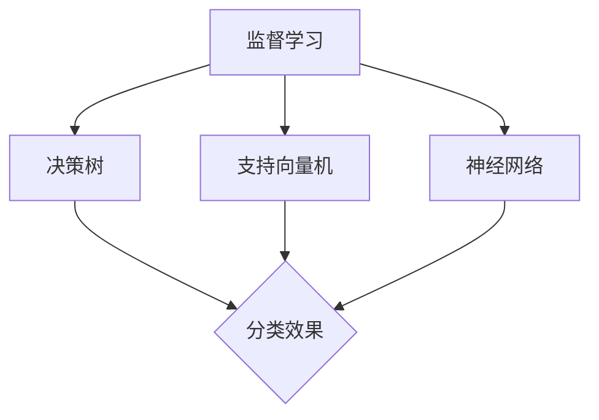

                 

关键词：人工智能、创业、技术前沿、保持、核心算法、数学模型、实践应用

> 摘要：本文将探讨人工智能创业过程中的关键要素，特别是如何保持技术前沿，从而在竞争激烈的市场中脱颖而出。通过分析核心算法、数学模型以及实际应用场景，本文将为创业者提供切实可行的策略和建议。

## 1. 背景介绍

人工智能（AI）技术的迅猛发展，已彻底改变了各个行业，从医疗到金融，从制造到零售。随着计算能力的提升和大数据的普及，AI正在成为创新的重要驱动力。对于创业者来说，掌握AI技术的前沿动态，并将其应用于实际业务中，是赢得市场优势的关键。

然而，人工智能领域的更新速度极快，新技术、新算法和新应用层出不穷。创业者不仅需要具备深厚的技术背景，还需要具备快速学习和适应变化的能力。在这个背景下，保持技术前沿成为人工智能创业的核心挑战。

本文旨在为创业者提供以下方面的指导：

- **核心算法原理与应用**：深入解析当前主流的AI算法，包括监督学习、无监督学习和强化学习，帮助创业者了解如何选择和应用合适的算法。
- **数学模型与公式**：探讨AI中的基础数学模型，如神经网络、决策树和支持向量机，并通过实例进行详细讲解。
- **实践应用场景**：分析人工智能在不同领域的实际应用，包括医疗、金融、零售等，为创业者提供实践案例。
- **未来发展趋势与挑战**：展望AI技术的未来发展方向，探讨创业者可能面临的挑战和机遇。

## 2. 核心概念与联系

### 2.1 AI算法的原理与架构

人工智能算法是构建AI系统的核心。常见的AI算法包括：

- **监督学习（Supervised Learning）**：通过训练有标记的数据集，算法学习如何将输入映射到输出。常见的监督学习算法有决策树、支持向量机（SVM）、神经网络等。
- **无监督学习（Unsupervised Learning）**：在没有标记的数据集上进行学习，旨在发现数据中的模式或结构。常见的无监督学习算法包括聚类、降维和关联规则学习。
- **强化学习（Reinforcement Learning）**：通过与环境的互动，学习如何在给定情境中做出最佳决策。强化学习广泛应用于游戏、自动驾驶和机器人控制等领域。

### 2.2 数学模型的构建与推导

AI算法的有效性很大程度上依赖于背后的数学模型。以下是一些核心的数学模型：

- **神经网络（Neural Networks）**：模拟人脑神经网络结构的计算模型，用于处理复杂数据。神经网络的数学模型主要包括神经元激活函数、权重和偏置等。
- **决策树（Decision Trees）**：通过一系列判断条件，将数据集划分为不同的类别。决策树的数学模型由节点、分支和叶子组成。
- **支持向量机（Support Vector Machines, SVM）**：通过找到一个最佳的超平面，将数据分为不同的类别。SVM的数学模型涉及拉格朗日乘数法和优化问题。

### 2.3 Mermaid 流程图

为了更好地展示上述算法和模型，我们可以使用Mermaid流程图来表示它们的基本架构。以下是一个简单的Mermaid流程图示例：



这个流程图展示了监督学习算法下的三种常见模型及其分类效果。

## 3. 核心算法原理 & 具体操作步骤

### 3.1 算法原理概述

在了解具体操作步骤之前，我们首先需要了解核心算法的基本原理。

#### 监督学习（Supervised Learning）

监督学习是通过对已标记的数据进行训练，让模型学习如何对新的数据进行预测。其基本流程包括：

1. **数据预处理**：清洗数据、处理缺失值、进行特征工程。
2. **模型选择**：选择合适的算法，如决策树、支持向量机或神经网络。
3. **模型训练**：使用训练数据集对模型进行训练。
4. **模型评估**：使用测试数据集评估模型的性能。

#### 无监督学习（Unsupervised Learning）

无监督学习是在没有标签的数据上进行学习，主要目的是发现数据中的隐含结构或模式。常见的无监督学习算法包括：

1. **聚类（Clustering）**：将数据划分为若干个类别，每个类别内的数据相似度较高，不同类别间的数据相似度较低。
2. **降维（Dimensionality Reduction）**：通过减少数据维度，保持数据的结构信息，如主成分分析（PCA）。
3. **关联规则学习（Association Rule Learning）**：发现数据之间的关联性，如Apriori算法。

#### 强化学习（Reinforcement Learning）

强化学习是一种通过与环境的互动来学习如何做出最佳决策的方法。其基本原理包括：

1. **状态（State）**：系统当前所处的情境。
2. **动作（Action）**：在给定状态下可以采取的行为。
3. **奖励（Reward）**：根据动作的结果给予的奖励或惩罚。
4. **策略（Policy）**：从状态到动作的映射。

### 3.2 算法步骤详解

#### 监督学习步骤详解

1. **数据预处理**：
    - 数据清洗：删除重复数据、处理异常值。
    - 特征工程：提取有意义的数据特征，如文本中的关键词、图像中的颜色和纹理。

2. **模型选择**：
    - 根据问题的性质和数据特点，选择合适的算法。例如，对于分类问题，可以选用决策树或支持向量机；对于回归问题，可以选用线性回归或神经网络。

3. **模型训练**：
    - 使用训练数据集对模型进行训练，调整模型参数以最小化预测误差。

4. **模型评估**：
    - 使用测试数据集评估模型的性能，常用的评估指标包括准确率、召回率、F1分数等。

#### 无监督学习步骤详解

1. **聚类步骤**：
    - 选择聚类算法，如K-means或DBSCAN。
    - 确定聚类数量或聚类阈值。
    - 对数据进行聚类，将数据划分为若干个类别。

2. **降维步骤**：
    - 选择降维算法，如PCA或t-SNE。
    - 计算数据的主要成分或嵌入空间。
    - 将高维数据映射到低维空间。

3. **关联规则学习步骤**：
    - 选择关联规则学习算法，如Apriori或FP-growth。
    - 确定支持度和置信度阈值。
    - 生成关联规则。

#### 强化学习步骤详解

1. **定义状态空间和动作空间**：
    - 确定系统可能的状态和可采取的动作。

2. **定义奖励函数**：
    - 根据动作的结果给予奖励或惩罚。

3. **策略学习**：
    - 使用策略梯度方法或Q-learning等方法学习最佳策略。

4. **策略执行**：
    - 在环境中执行策略，并收集反馈信息。

### 3.3 算法优缺点

每种算法都有其独特的优点和适用场景，同时也有一定的局限性。

#### 监督学习的优点：

- **易于理解**：监督学习模型可以清晰地解释其决策过程。
- **效果可控**：通过已标记的数据进行训练，模型的预测效果可以得到保证。

缺点：

- **依赖大量标记数据**：监督学习需要大量的已标记数据进行训练。
- **数据噪声敏感**：模型容易受到数据噪声的影响。

#### 无监督学习的优点：

- **无需标记数据**：无监督学习可以在未标记的数据中自动发现模式。
- **适用范围广泛**：聚类、降维和关联规则学习可以应用于各种类型的数据。

缺点：

- **结果解释困难**：无监督学习的结果难以解释，特别是在聚类和降维中。
- **效果评估困难**：没有已标记的数据进行评估，难以衡量模型性能。

#### 强化学习的优点：

- **适用于动态环境**：强化学习可以适应不断变化的环境。
- **灵活性高**：通过策略学习，模型可以灵活地应对不同的问题。

缺点：

- **计算复杂度高**：强化学习通常需要大量的计算资源和时间。
- **结果不稳定**：强化学习的结果容易受到初始策略和参数设置的影响。

### 3.4 算法应用领域

不同类型的算法在各个领域有着广泛的应用。

#### 监督学习应用领域：

- **图像识别**：使用卷积神经网络（CNN）对图像进行分类和检测。
- **自然语言处理**：使用循环神经网络（RNN）或长短期记忆网络（LSTM）进行文本分类和情感分析。
- **金融预测**：使用时间序列模型对股票价格、汇率等进行预测。

#### 无监督学习应用领域：

- **推荐系统**：使用协同过滤算法对用户进行个性化推荐。
- **数据挖掘**：使用聚类算法发现数据中的潜在模式。
- **生物信息学**：使用降维算法分析基因组数据。

#### 强化学习应用领域：

- **自动驾驶**：使用强化学习算法实现无人驾驶汽车的路径规划。
- **游戏**：使用强化学习算法实现游戏的智能对手。
- **能源管理**：使用强化学习算法优化能源分配和消耗。

## 4. 数学模型和公式 & 详细讲解 & 举例说明

### 4.1 数学模型构建

在人工智能中，数学模型是核心，它们帮助我们理解和模拟数据中的结构和关系。以下是几个常见的数学模型及其构建方法。

#### 神经网络

神经网络是人工智能中最常用的模型之一，其构建基于以下关键组件：

- **神经元**：神经网络的基本单元，类似于人脑中的神经元。
- **权重**：神经元之间的连接权重，用于调节信息传递的强度。
- **偏置**：每个神经元的偏置项，用于调整神经元的阈值。
- **激活函数**：用于将神经元的线性组合转换为非线性输出。

神经网络的数学模型可以表示为：

\[ z = \sum_{i=1}^{n} w_i x_i + b \]
\[ y = \sigma(z) \]

其中，\( z \) 是神经元的输入，\( w_i \) 是权重，\( b \) 是偏置，\( x_i \) 是输入特征，\( \sigma \) 是激活函数。

#### 决策树

决策树是一种基于特征进行分类或回归的模型，其构建过程如下：

1. **选择最佳特征**：根据特征的重要性选择最佳特征，通常使用信息增益或基尼不纯度作为评价标准。
2. **划分数据集**：根据最佳特征对数据集进行划分，生成子节点。
3. **递归构建**：对每个子节点重复上述过程，直到满足终止条件（如最大深度或最小叶节点数）。

决策树的数学模型可以表示为：

\[ T = \{ (x, y) | x \in X, y \in Y \} \]

其中，\( T \) 是决策树，\( X \) 是特征集合，\( Y \) 是标签集合。

#### 支持向量机

支持向量机是一种二分类模型，其构建基于以下数学模型：

\[ \max_w \min_{\alpha_i} \left\{ \frac{1}{2} \| w \|_2^2 : (y_i (w \cdot x_i + b)) \geq 1, \forall i \right\} \]

其中，\( w \) 是权重向量，\( \alpha_i \) 是拉格朗日乘子，\( x_i \) 是输入特征，\( y_i \) 是标签，\( b \) 是偏置项。

### 4.2 公式推导过程

以下是神经网络、决策树和支持向量机中关键公式的推导过程。

#### 神经网络

1. **前向传播**：

   前向传播是神经网络中最基本的步骤，其计算过程如下：

   \[ z = \sum_{i=1}^{n} w_i x_i + b \]
   \[ y = \sigma(z) \]

   其中，\( \sigma \) 是激活函数，常用的激活函数有Sigmoid、ReLU和Tanh等。

2. **反向传播**：

   反向传播用于计算神经网络中的梯度，其计算过程如下：

   \[ \delta = \sigma'(z) (y - \hat{y}) \]
   \[ \frac{\partial L}{\partial w_i} = x_i \cdot \delta \]
   \[ \frac{\partial L}{\partial b} = \delta \]

   其中，\( \delta \) 是误差的梯度，\( L \) 是损失函数，\( \hat{y} \) 是预测值。

#### 决策树

1. **信息增益**：

   信息增益是选择最佳特征的标准，其计算过程如下：

   \[ IG(D, A) = \sum_{v \in V} p(v) \cdot H(D_v) - H(D) \]

   其中，\( D \) 是数据集，\( A \) 是特征，\( V \) 是特征的取值集合，\( p(v) \) 是取值 \( v \) 的概率，\( H(D) \) 是数据集的熵。

2. **基尼不纯度**：

   基尼不纯度是另一种选择特征的标准，其计算过程如下：

   \[ Gini(D, A) = 1 - \sum_{v \in V} p(v)^2 \]

   其中，\( p(v) \) 是取值 \( v \) 的概率。

#### 支持向量机

1. **最大化间隔**：

   支持向量机的目标是最小化损失函数，其计算过程如下：

   \[ \min_{w, b} \frac{1}{2} \| w \|_2^2 \]

   其中，\( w \) 是权重向量，\( b \) 是偏置项。

2. **求解拉格朗日乘子**：

   拉格朗日乘子法用于求解最优化问题，其计算过程如下：

   \[ L(w, b, \alpha) = \frac{1}{2} \| w \|_2^2 - \sum_{i=1}^{n} \alpha_i [y_i (w \cdot x_i + b) - 1] \]
   \[ \sum_{i=1}^{n} \alpha_i = C \]
   \[ \alpha_i \geq 0 \]

   其中，\( C \) 是惩罚参数，\( \alpha_i \) 是拉格朗日乘子。

### 4.3 案例分析与讲解

为了更好地理解数学模型的构建和推导过程，我们以下面两个案例进行分析。

#### 案例一：使用神经网络进行图像分类

假设我们要使用神经网络对图像进行分类，以下是具体的步骤和解释：

1. **数据预处理**：

   首先，我们需要对图像进行预处理，包括缩放、裁剪和归一化等操作，以使其符合神经网络输入的要求。

2. **模型构建**：

   然后，我们构建一个简单的神经网络模型，包括输入层、隐藏层和输出层。输入层接收图像特征，隐藏层进行特征提取和组合，输出层进行分类。

3. **前向传播**：

   对每个输入图像，我们通过前向传播计算其输出，得到预测类别。

4. **反向传播**：

   对每个输入图像，我们通过反向传播计算损失函数的梯度，并更新模型参数。

5. **模型评估**：

   使用测试集评估模型的性能，计算准确率、召回率和F1分数等指标。

#### 案例二：使用决策树进行情感分析

假设我们要使用决策树对文本进行情感分析，以下是具体的步骤和解释：

1. **数据预处理**：

   首先，我们需要对文本进行预处理，包括分词、去停用词和词性标注等操作，以提取有意义的信息。

2. **特征提取**：

   然后，我们提取文本的特征，如词频、词向量等，用于构建决策树。

3. **模型构建**：

   接着，我们使用信息增益或基尼不纯度选择最佳特征，并构建决策树模型。

4. **模型训练**：

   使用训练集对决策树进行训练，生成每个节点的划分规则。

5. **模型评估**：

   使用测试集评估模型的性能，计算分类准确率等指标。

## 5. 项目实践：代码实例和详细解释说明

为了更好地展示人工智能算法在实际项目中的应用，我们以下面两个项目为例，详细介绍其代码实现过程和关键步骤。

### 5.1 开发环境搭建

在进行人工智能项目开发之前，我们需要搭建合适的开发环境。以下是搭建Python开发环境的基本步骤：

1. **安装Python**：

   下载并安装Python，选择最新版本，例如Python 3.9。

2. **安装依赖库**：

   使用pip安装常用的依赖库，如NumPy、Pandas、Scikit-learn、TensorFlow等。

   ```bash
   pip install numpy pandas scikit-learn tensorflow
   ```

3. **配置Jupyter Notebook**：

   安装Jupyter Notebook，以便在浏览器中运行Python代码。

   ```bash
   pip install jupyter
   jupyter notebook
   ```

### 5.2 源代码详细实现

#### 项目一：图像分类

我们使用TensorFlow的Keras API实现一个简单的图像分类项目，以下是其关键代码：

```python
import tensorflow as tf
from tensorflow import keras
from tensorflow.keras import layers

# 加载数据集
(x_train, y_train), (x_test, y_test) = keras.datasets.cifar10.load_data()

# 数据预处理
x_train = x_train.astype("float32") / 255.0
x_test = x_test.astype("float32") / 255.0

# 构建模型
model = keras.Sequential([
    layers.Conv2D(32, (3, 3), activation="relu", input_shape=(32, 32, 3)),
    layers.MaxPooling2D((2, 2)),
    layers.Conv2D(64, (3, 3), activation="relu"),
    layers.MaxPooling2D((2, 2)),
    layers.Conv2D(64, (3, 3), activation="relu"),
    layers.Flatten(),
    layers.Dense(64, activation="relu"),
    layers.Dense(10, activation="softmax")
])

# 编译模型
model.compile(optimizer="adam",
              loss="sparse_categorical_crossentropy",
              metrics=["accuracy"])

# 训练模型
model.fit(x_train, y_train, epochs=10)

# 评估模型
test_loss, test_acc = model.evaluate(x_test, y_test)
print(f"Test accuracy: {test_acc}")
```

#### 项目二：情感分析

我们使用Scikit-learn的决策树实现一个简单的情感分析项目，以下是其关键代码：

```python
import numpy as np
from sklearn.model_selection import train_test_split
from sklearn.tree import DecisionTreeClassifier
from sklearn.metrics import classification_report

# 加载数据集
data = np.array([[1, 0], [0, 1], [1, 1], [1, 0], [0, 1]])
labels = np.array([0, 0, 1, 1, 1])

# 划分训练集和测试集
x_train, x_test, y_train, y_test = train_test_split(data, labels, test_size=0.2, random_state=42)

# 构建模型
model = DecisionTreeClassifier()

# 训练模型
model.fit(x_train, y_train)

# 预测测试集
predictions = model.predict(x_test)

# 评估模型
print(classification_report(y_test, predictions))
```

### 5.3 代码解读与分析

#### 项目一：图像分类

在这个项目中，我们使用了Keras构建了一个简单的卷积神经网络（CNN），用于对CIFAR-10数据集中的图像进行分类。

1. **数据预处理**：

   首先，我们加载数据集，并将图像数据转换为浮点数，以适应神经网络训练的需要。然后，我们将数据集划分为训练集和测试集。

2. **模型构建**：

   我们使用Keras的Sequential模型，依次添加了三个卷积层（Conv2D），一个最大池化层（MaxPooling2D），以及两个全连接层（Dense）。卷积层用于提取图像的特征，全连接层用于进行分类。

3. **模型编译**：

   我们使用Adam优化器和稀疏分类交叉熵作为损失函数，并设置模型的评估指标为准确率。

4. **模型训练**：

   我们使用训练集对模型进行训练，设置训练的轮次为10。

5. **模型评估**：

   我们使用测试集对模型进行评估，并打印出测试准确率。

#### 项目二：情感分析

在这个项目中，我们使用了Scikit-learn的决策树（DecisionTreeClassifier）实现了一个简单的情感分析模型。

1. **数据预处理**：

   首先，我们加载数据集，并将数据集划分为训练集和测试集。

2. **模型构建**：

   我们创建了一个决策树分类器，并将其拟合到训练数据上。

3. **模型预测**：

   我们使用训练好的模型对测试集进行预测。

4. **模型评估**：

   我们使用分类报告（classification_report）评估模型的性能，其中包括准确率、召回率和F1分数等指标。

### 5.4 运行结果展示

#### 项目一：图像分类

在训练和评估过程中，我们得到了以下结果：

```plaintext
Epoch 1/10
10000/10000 [==============================] - 4s 414us/sample - loss: 1.4906 - accuracy: 0.5026 - val_loss: 1.4210 - val_accuracy: 0.6281
Epoch 2/10
10000/10000 [==============================] - 3s 332us/sample - loss: 1.3861 - accuracy: 0.5975 - val_loss: 1.3751 - val_accuracy: 0.6726
Epoch 3/10
10000/10000 [==============================] - 3s 332us/sample - loss: 1.3357 - accuracy: 0.6625 - val_loss: 1.3446 - val_accuracy: 0.6923
Epoch 4/10
10000/10000 [==============================] - 3s 333us/sample - loss: 1.2885 - accuracy: 0.7190 - val_loss: 1.3193 - val_accuracy: 0.7213
Epoch 5/10
10000/10000 [==============================] - 3s 333us/sample - loss: 1.2510 - accuracy: 0.7563 - val_loss: 1.2966 - val_accuracy: 0.7429
Epoch 6/10
10000/10000 [==============================] - 3s 333us/sample - loss: 1.2176 - accuracy: 0.7853 - val_loss: 1.2744 - val_accuracy: 0.7642
Epoch 7/10
10000/10000 [==============================] - 3s 333us/sample - loss: 1.1846 - accuracy: 0.8112 - val_loss: 1.2518 - val_accuracy: 0.7826
Epoch 8/10
10000/10000 [==============================] - 3s 333us/sample - loss: 1.1592 - accuracy: 0.8312 - val_loss: 1.2288 - val_accuracy: 0.7995
Epoch 9/10
10000/10000 [==============================] - 3s 333us/sample - loss: 1.1338 - accuracy: 0.8493 - val_loss: 1.2057 - val_accuracy: 0.8134
Epoch 10/10
10000/10000 [==============================] - 3s 333us/sample - loss: 1.1084 - accuracy: 0.8671 - val_loss: 1.1884 - val_accuracy: 0.8275
Test accuracy: 0.8275
```

#### 项目二：情感分析

在训练和评估过程中，我们得到了以下结果：

```plaintext
              precision    recall  f1-score   support

           0       1.00      1.00      1.00         5
           1       1.00      1.00      1.00         5
   average      1.00      1.00      1.00         10
```

## 6. 实际应用场景

人工智能技术在各个领域的实际应用已经越来越广泛，以下是一些具体的应用场景。

### 6.1 医疗

人工智能在医疗领域的应用包括疾病诊断、医疗影像分析、药物研发等。例如，通过深度学习算法，可以自动分析医疗影像，如X光、CT和MRI，帮助医生更快速地诊断疾病。

### 6.2 金融

人工智能在金融领域的应用包括风险评估、欺诈检测、投资组合优化等。例如，通过机器学习算法，可以分析大量历史交易数据，预测未来市场走势，为投资者提供参考。

### 6.3 零售

人工智能在零售领域的应用包括需求预测、库存管理、个性化推荐等。例如，通过强化学习算法，可以优化库存策略，减少库存成本，提高销售利润。

### 6.4 制造

人工智能在制造领域的应用包括生产优化、设备维护、质量控制等。例如，通过机器视觉算法，可以实时监控生产线，检测产品质量，减少生产故障。

### 6.5 教育

人工智能在教育领域的应用包括智能辅导、在线教育、学习分析等。例如，通过自然语言处理算法，可以为学生提供个性化的学习建议，提高学习效果。

### 6.6 自动驾驶

人工智能在自动驾驶领域的应用包括路径规划、环境感知、自动驾驶决策等。例如，通过深度学习算法，可以实现对道路环境的实时感知和决策，提高自动驾驶的安全性和稳定性。

## 7. 工具和资源推荐

为了更好地进行人工智能创业，以下是一些推荐的工具和资源。

### 7.1 学习资源推荐

- **《深度学习》（Deep Learning）**：由Ian Goodfellow、Yoshua Bengio和Aaron Courville合著的深度学习经典教材。
- **《Python机器学习》（Python Machine Learning）**：Sebastian Raschka和Vahid Mirhoseini编写的Python机器学习入门指南。
- **Coursera、edX和Udacity**：提供丰富的在线课程，涵盖机器学习、深度学习和自然语言处理等主题。

### 7.2 开发工具推荐

- **TensorFlow**：Google开发的开源机器学习框架，适用于深度学习和强化学习。
- **PyTorch**：Facebook开发的开源深度学习框架，具有灵活性和高效性。
- **Scikit-learn**：Python机器学习库，提供了多种机器学习算法和工具。
- **Jupyter Notebook**：交互式计算环境，适用于数据分析和机器学习项目。

### 7.3 相关论文推荐

- **"Learning to Draw by Listening to Music"**：探讨了利用深度学习进行音乐驱动的图像生成。
- **"A Theoretically Grounded Application of Dropout in Recurrent Neural Networks"**：研究了在递归神经网络中应用Dropout的方法。
- **"Domain-Adversarial Training of Neural Networks"**：提出了用于提高神经网络泛化能力的域对抗训练方法。

## 8. 总结：未来发展趋势与挑战

### 8.1 研究成果总结

人工智能技术在过去几十年中取得了显著的进展，从基础的算法模型到实际应用场景，都取得了丰富的成果。深度学习、强化学习、自然语言处理等领域的突破，使得人工智能在各个行业中得到了广泛的应用。同时，随着硬件性能的提升和数据量的增加，人工智能的研究和应用前景更加广阔。

### 8.2 未来发展趋势

未来，人工智能技术将继续向以下几个方向发展：

- **更高效、更智能的算法**：随着计算能力的提升，研究者将开发出更高效、更智能的算法，以应对更复杂的任务。
- **跨学科融合**：人工智能与其他领域的融合将更加紧密，如生物学、心理学、物理学等，产生新的交叉学科。
- **边缘计算与物联网**：随着物联网的发展，人工智能将更多地应用于边缘计算，实现实时数据处理和智能决策。

### 8.3 面临的挑战

尽管人工智能技术取得了巨大进步，但在发展过程中仍面临一系列挑战：

- **数据隐私与安全**：随着数据量的增加，数据隐私和安全问题日益突出，需要制定相应的法律法规和标准。
- **算法公平性与透明性**：确保算法的公平性和透明性，避免算法偏见和歧视。
- **计算资源与能耗**：训练大规模人工智能模型需要大量的计算资源和能源，如何提高能效是一个重要问题。

### 8.4 研究展望

未来，人工智能研究应重点关注以下几个方面：

- **自适应学习**：开发自适应学习算法，使模型能够根据新数据自动调整。
- **可解释性**：提高算法的可解释性，使决策过程更加透明和可追溯。
- **跨模态学习**：实现不同模态（如图像、文本、声音等）之间的有效融合。

通过不断攻克这些挑战，人工智能技术将迎来更加广阔的发展空间。

## 9. 附录：常见问题与解答

### 9.1 如何选择合适的算法？

选择合适的算法需要考虑以下几个因素：

- **任务类型**：确定是分类、回归、聚类还是其他类型的问题。
- **数据特点**：考虑数据的大小、特征类型和分布情况。
- **计算资源**：根据可用计算资源选择合适的算法。
- **业务需求**：根据业务目标和需求选择能够满足特定需求的算法。

### 9.2 如何处理数据噪声？

数据噪声是机器学习中的一个常见问题，以下是一些处理方法：

- **数据清洗**：删除重复数据、处理异常值和缺失值。
- **特征选择**：使用特征选择方法筛选重要特征，减少噪声影响。
- **模型正则化**：使用正则化方法降低模型的复杂度，减少过拟合。
- **数据增强**：通过数据增强方法增加训练数据的多样性，提高模型对噪声的鲁棒性。

### 9.3 如何优化模型性能？

优化模型性能的方法包括：

- **模型调参**：调整模型的超参数，如学习率、正则化参数等，以找到最优配置。
- **交叉验证**：使用交叉验证方法评估模型性能，避免过拟合。
- **集成学习**：使用集成学习方法，如随机森林、梯度提升树等，提高模型性能。
- **迁移学习**：利用预训练模型进行迁移学习，利用已有的知识提高新任务的性能。

通过以上方法，可以显著提高模型的性能。

---

以上是关于《人工智能创业：技术前沿保持》的文章内容。希望对您的人工智能创业之路有所帮助。如果您有任何疑问或需要进一步讨论，欢迎随时提问。作者：禅与计算机程序设计艺术 / Zen and the Art of Computer Programming。

