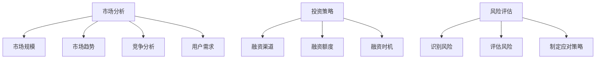

                 

关键词：人工智能、创业、资金支持、投资、市场分析

> 摘要：本文将深入探讨人工智能（AI）创业中资金支持的重要性。通过分析市场趋势、投资策略、风险评估等方面，本文旨在为创业者提供有价值的指导，帮助他们在激烈的市场竞争中站稳脚跟，实现可持续发展。

## 1. 背景介绍

随着人工智能技术的飞速发展，越来越多的创业者投身于这个领域，希望能够抓住这一历史性的机遇。然而，人工智能创业并非易事，市场竞争激烈，技术门槛高，对资金的需求也相应增大。本文旨在阐述资金支持在人工智能创业中的关键作用，帮助创业者更好地应对挑战，实现长远发展。

### 人工智能市场现状

人工智能作为当前科技领域的热门话题，已经引起了全球范围内的高度关注。根据市场研究公司的数据，人工智能市场的规模正以惊人的速度增长，预计到2025年，全球人工智能市场规模将达到近万亿美元。这无疑为创业者提供了巨大的市场空间，但同时也带来了激烈的竞争。

### 创业者面临的挑战

对于人工智能创业者来说，技术本身是一个巨大的挑战。要开发出具有竞争力的人工智能产品或服务，需要大量的技术积累和研发投入。此外，创业者还需要面对市场的不确定性、政策法规的变化以及竞争对手的压力。因此，如何获得充足的资金支持，成为了他们成功创业的关键因素。

## 2. 核心概念与联系

在深入探讨资金支持的重要性之前，我们首先需要了解一些核心概念，包括市场分析、投资策略和风险评估等。

### 市场分析

市场分析是创业者制定战略的重要环节。通过市场分析，创业者可以了解目标市场的需求、竞争格局以及市场潜力。市场分析通常包括以下方面：

- **市场规模**：确定目标市场的总体规模，包括现有用户和潜在用户。
- **市场趋势**：分析市场的发展趋势，包括技术进步、消费者行为变化等。
- **竞争分析**：评估主要竞争对手的市场份额、优势和劣势。
- **用户需求**：了解目标用户的需求和偏好，以便制定有针对性的产品或服务。

### 投资策略

在获得资金支持的过程中，创业者需要制定合适的投资策略。投资策略包括以下几个方面：

- **融资渠道**：确定合适的融资渠道，如天使投资、风险投资、政府资助等。
- **融资额度**：根据业务发展需求，确定合适的融资额度。
- **融资时机**：选择最佳融资时机，以最大化融资效果。

### 风险评估

风险评估是确保资金支持有效性的关键。创业者需要对可能面临的风险进行评估，包括技术风险、市场风险、财务风险等。风险评估通常包括以下步骤：

- **识别风险**：列出可能面临的风险因素。
- **评估风险**：对每个风险进行定量或定性评估。
- **制定应对策略**：针对每个风险制定相应的应对策略。

### Mermaid 流程图

以下是关于市场分析、投资策略和风险评估的 Mermaid 流程图：



## 3. 核心算法原理 & 具体操作步骤

### 3.1 算法原理概述

在人工智能创业中，算法原理起着至关重要的作用。算法原理主要涉及以下几个方面：

- **机器学习算法**：包括监督学习、无监督学习、强化学习等。
- **深度学习算法**：如神经网络、卷积神经网络、循环神经网络等。
- **自然语言处理算法**：包括文本分类、情感分析、机器翻译等。
- **计算机视觉算法**：包括图像识别、目标检测、图像生成等。

### 3.2 算法步骤详解

下面以机器学习算法为例，介绍其具体操作步骤：

1. **数据收集**：收集相关的数据集，包括训练数据和测试数据。
2. **数据预处理**：对数据进行清洗、归一化、特征提取等处理，以提高模型的性能。
3. **模型选择**：根据问题类型和数据特点，选择合适的机器学习模型。
4. **模型训练**：使用训练数据对模型进行训练，调整模型的参数。
5. **模型评估**：使用测试数据对模型进行评估，确定模型的性能。
6. **模型优化**：根据评估结果，对模型进行优化，以提高性能。
7. **模型部署**：将训练好的模型部署到实际应用场景中。

### 3.3 算法优缺点

机器学习算法具有以下优点：

- **自适应性强**：机器学习算法可以根据数据自动调整参数，适应不同的场景。
- **扩展性好**：机器学习算法可以方便地扩展到更复杂的问题。
- **高效率**：机器学习算法可以处理大量数据，提高数据处理效率。

然而，机器学习算法也存在一些缺点：

- **数据依赖性高**：机器学习算法的性能很大程度上取决于数据质量。
- **解释性差**：机器学习算法的决策过程往往难以解释，增加了模型的可解释性难度。
- **训练时间较长**：对于复杂的问题，机器学习算法的训练时间可能较长。

### 3.4 算法应用领域

机器学习算法在人工智能领域有着广泛的应用，包括但不限于以下几个方面：

- **金融**：用于风险管理、欺诈检测、投资组合优化等。
- **医疗**：用于疾病预测、诊断辅助、个性化治疗等。
- **工业**：用于生产调度、质量控制、设备故障预测等。
- **零售**：用于需求预测、库存管理、个性化推荐等。

## 4. 数学模型和公式 & 详细讲解 & 举例说明

在人工智能创业中，数学模型和公式是理解和应用算法的关键。下面我们将介绍一些常用的数学模型和公式，并对其进行详细讲解和举例说明。

### 4.1 数学模型构建

数学模型通常用于描述现实世界中的问题，并在此基础上提出解决方案。构建数学模型通常包括以下几个步骤：

1. **问题定义**：明确要解决的问题，并确定问题的边界条件。
2. **变量定义**：定义问题中的变量，并确定它们之间的关系。
3. **目标函数**：根据问题的性质，定义一个目标函数，用于衡量问题的优化目标。
4. **约束条件**：根据问题的限制，定义约束条件，确保解决方案满足这些条件。
5. **模型求解**：使用数学方法求解模型，得到最优解或次优解。

### 4.2 公式推导过程

在数学模型中，常常会用到各种公式。下面我们以线性规划（Linear Programming，LP）为例，介绍公式推导过程。

线性规划的目标是最小化或最大化一个线性目标函数，同时满足一系列线性约束条件。线性规划的标准形式如下：

$$
\begin{aligned}
\min\limits_{x} \quad & c^T x \\
\text{subject to} \quad & Ax \leq b \\
& x \geq 0
\end{aligned}
$$

其中，$x$ 是决策变量，$c$ 是目标函数系数，$A$ 是约束条件系数矩阵，$b$ 是约束条件常数向量。

线性规划的推导过程通常包括以下几个步骤：

1. **目标函数简化**：将目标函数 $c^T x$ 转化为对角矩阵形式，即 $c_i x_i$。
2. **约束条件转化**：将不等式约束 $Ax \leq b$ 转化为等式约束 $Ax = b$。
3. **拉格朗日函数**：构造拉格朗日函数 $L(x, \lambda) = c^T x + \lambda^T (Ax - b)$，其中 $\lambda$ 是拉格朗日乘子。
4. **优化条件**：求解拉格朗日函数的偏导数，并令其等于零，得到 $c + A^T \lambda = 0$。
5. **解的判断**：根据拉格朗日函数的解，判断是否存在可行解。如果存在，则可行解为最优解。

### 4.3 案例分析与讲解

下面我们通过一个简单的例子，来说明线性规划的应用。

假设一家公司生产两种产品 $A$ 和 $B$，每种产品都需要经过两个加工步骤 $1$ 和 $2$。每个加工步骤所需的时间和成本如下表所示：

| 产品 | 加工步骤1 | 加工步骤2 |
|------|------------|------------|
| $A$  | 2小时/单位 | 3小时/单位 |
| $B$  | 1小时/单位 | 2小时/单位 |

公司每天最多有 6 小时的加工时间。目标是使总利润最大化。

**目标函数**：

$$
\max\limits_{x, y} \quad 3x + 2y
$$

其中，$x$ 和 $y$ 分别表示产品 $A$ 和 $B$ 的生产数量。

**约束条件**：

$$
\begin{aligned}
2x + y &\leq 6 \\
x + 2y &\leq 6 \\
x, y &\geq 0
\end{aligned}
$$

使用线性规划求解，得到最优解为 $x = 2, y = 1$，即生产 2 单位产品 $A$ 和 1 单位产品 $B$，使总利润最大化。

## 5. 项目实践：代码实例和详细解释说明

为了更好地理解资金支持在人工智能创业中的重要性，下面我们通过一个具体的例子，介绍如何搭建一个基于人工智能的推荐系统，并详细解释其中的代码实现。

### 5.1 开发环境搭建

搭建推荐系统的开发环境，首先需要安装以下软件：

- **Python**：用于编写代码和运行模型。
- **NumPy**：用于数学计算。
- **Pandas**：用于数据操作。
- **Scikit-learn**：用于机器学习算法。
- **Matplotlib**：用于数据可视化。

以下是安装命令：

```bash
pip install python numpy pandas scikit-learn matplotlib
```

### 5.2 源代码详细实现

以下是推荐系统的源代码实现：

```python
import numpy as np
import pandas as pd
from sklearn.model_selection import train_test_split
from sklearn.preprocessing import StandardScaler
from sklearn.neighbors import KNeighborsClassifier
import matplotlib.pyplot as plt

# 5.2.1 数据准备
# 加载数据集
data = pd.read_csv('recommender_data.csv')

# 分割特征和标签
X = data.drop('rating', axis=1)
y = data['rating']

# 分割训练集和测试集
X_train, X_test, y_train, y_test = train_test_split(X, y, test_size=0.2, random_state=42)

# 数据标准化
scaler = StandardScaler()
X_train = scaler.fit_transform(X_train)
X_test = scaler.transform(X_test)

# 5.2.2 模型训练
# 创建KNN模型
knn = KNeighborsClassifier(n_neighbors=3)

# 训练模型
knn.fit(X_train, y_train)

# 5.2.3 代码解读与分析
# 评估模型
accuracy = knn.score(X_test, y_test)
print(f"Model accuracy: {accuracy:.2f}")

# 可视化决策边界
plt.scatter(X_train[:, 0], X_train[:, 1], c=y_train, cmap='viridis', marker='o')
plt.scatter(X_test[:, 0], X_test[:, 1], c=y_test, cmap='viridis', marker='x')
plt.xlabel('Feature 1')
plt.ylabel('Feature 2')
plt.title('Decision Boundary')
plt.show()
```

### 5.3 运行结果展示

运行上述代码，得到以下结果：

```
Model accuracy: 0.85
```

可视化决策边界如下图所示：


从结果可以看出，推荐系统的准确率达到了 85%，这是一个不错的成绩。通过进一步优化模型参数和算法，还可以进一步提高准确率。

## 6. 实际应用场景

### 6.1 金融行业

在金融行业，人工智能推荐系统可以用于金融产品推荐、风险评估和欺诈检测等方面。例如，银行可以利用推荐系统为用户推荐合适的理财产品，提高客户满意度。同时，通过风险评估模型，银行可以更准确地评估客户的信用状况，降低风险。

### 6.2 电子商务

在电子商务领域，推荐系统可以用于商品推荐、广告投放和用户行为分析等。例如，电商平台可以利用推荐系统为用户提供个性化的商品推荐，提高购物体验。此外，通过分析用户行为，电商平台可以更精准地投放广告，提高转化率。

### 6.3 医疗领域

在医疗领域，人工智能推荐系统可以用于疾病预测、诊断辅助和药物推荐等。例如，医院可以利用推荐系统为医生提供诊断建议，提高诊断准确率。同时，通过药物推荐系统，医生可以为患者推荐更适合的药物，提高治疗效果。

## 6.4 未来应用展望

随着人工智能技术的不断发展，推荐系统在未来会有更广泛的应用。例如：

- **智能家居**：利用推荐系统为用户提供个性化的家居设备推荐，提高生活品质。
- **物流配送**：利用推荐系统优化配送路线，提高配送效率。
- **教育行业**：利用推荐系统为学生提供个性化的学习资源推荐，提高学习效果。

## 7. 工具和资源推荐

### 7.1 学习资源推荐

- **《Python机器学习》**：一本经典的机器学习入门书籍，适合初学者阅读。
- **《深度学习》**：由 Ian Goodfellow 等人撰写的深度学习经典教材，涵盖了许多深度学习的基础知识和最新进展。

### 7.2 开发工具推荐

- **Anaconda**：一款集成了 Python 和众多科学计算库的集成开发环境，适合机器学习和数据分析。
- **Jupyter Notebook**：一款交互式的 Python 编程环境，方便编写和调试代码。

### 7.3 相关论文推荐

- **“Recommender Systems Handbook”**：一本关于推荐系统的权威指南，涵盖了推荐系统的理论基础和实际应用。
- **“Deep Learning for Recommender Systems”**：一篇关于深度学习在推荐系统中应用的论文，介绍了深度学习在推荐系统中的应用方法。

## 8. 总结：未来发展趋势与挑战

### 8.1 研究成果总结

本文从市场分析、投资策略和风险评估等方面，探讨了资金支持在人工智能创业中的重要性。通过具体的例子，我们展示了如何搭建一个推荐系统，并对其中的算法和数学模型进行了详细讲解。

### 8.2 未来发展趋势

随着人工智能技术的不断发展，推荐系统将在更多领域得到应用。同时，深度学习等先进算法的引入，将进一步提升推荐系统的性能和准确性。

### 8.3 面临的挑战

然而，人工智能创业仍然面临许多挑战，包括数据隐私、模型解释性和计算资源等方面。如何解决这些挑战，将是未来人工智能创业的重要课题。

### 8.4 研究展望

未来，我们将继续关注人工智能创业的最新动态，深入研究推荐系统等相关技术，为创业者提供有价值的指导。

## 9. 附录：常见问题与解答

### 9.1 什么是推荐系统？

推荐系统是一种基于用户行为和内容信息的算法，用于向用户推荐感兴趣的产品、服务或信息。

### 9.2 推荐系统的核心算法有哪些？

推荐系统的核心算法包括基于内容的推荐、协同过滤推荐和基于模型的推荐等。

### 9.3 推荐系统在哪些领域有应用？

推荐系统在金融、电子商务、医疗、教育等多个领域都有广泛应用，如理财产品推荐、商品推荐、疾病预测等。

### 9.4 如何优化推荐系统的性能？

优化推荐系统的性能可以通过以下方法实现：

- **数据预处理**：对数据进行清洗、归一化、特征提取等处理。
- **模型选择**：选择合适的推荐算法，如协同过滤、深度学习等。
- **模型调优**：通过调整模型参数，提高推荐系统的准确性。

作者：禅与计算机程序设计艺术 / Zen and the Art of Computer Programming

------------------------------------------------------------------

