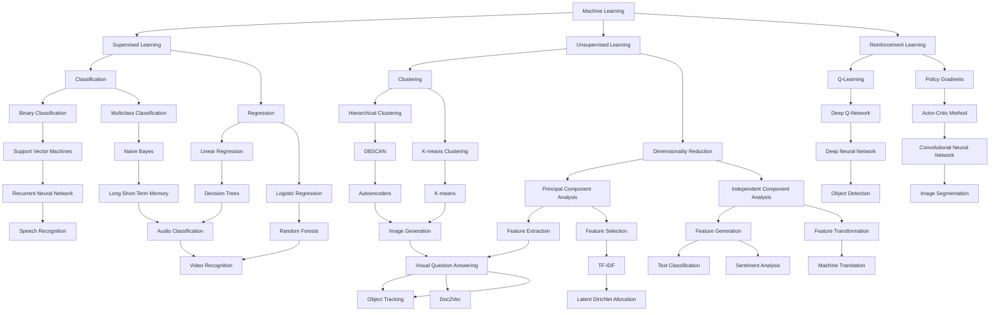

                 

 关键词：人工智能、创业、技术栈、选择、架构、算法、工具、资源

> 摘要：本文旨在探讨人工智能创业者在选择技术栈时所需考虑的多个维度，包括核心技术、算法选择、框架工具以及开发环境搭建等。通过深入分析各个方面的优劣和应用场景，为创业团队提供科学、实用的技术决策指导。

## 1. 背景介绍

人工智能（AI）作为当前技术发展的前沿领域，正以前所未有的速度变革各行各业。随着计算能力的提升和数据的丰富，越来越多的初创公司投身于AI领域，试图利用这一技术实现商业价值的突破。然而，AI创业并非易事，其中选择合适的技术栈是成功的关键因素之一。

技术栈的选择不仅关系到项目的开发效率和性能，更影响项目的技术可持续性和扩展性。一个合理的技术栈能够提高开发团队的生产力，降低开发成本，同时确保项目能够快速迭代和适应市场变化。

本文将围绕以下主题展开讨论：

1. **核心技术选择**：介绍常见的AI核心技术及其适用场景。
2. **算法选择**：分析不同算法的优缺点，以及如何根据需求选择合适的算法。
3. **框架与工具**：探讨当前主流的AI框架和开发工具，分析其特点及适用性。
4. **开发环境搭建**：提供详细的开发环境搭建指南，包括硬件配置、软件安装和调试。

通过上述分析，我们希望为人工智能创业团队提供一套系统、实用的技术选择方案，帮助他们在激烈的市场竞争中脱颖而出。

## 2. 核心概念与联系

### 2.1 AI技术的核心概念

在探讨AI技术栈之前，我们需要先了解一些核心概念。人工智能的核心包括机器学习、深度学习、自然语言处理（NLP）和计算机视觉等。以下是这些核心概念的基本定义和关系图：

**机器学习（Machine Learning）**：机器学习是指通过数据训练模型，使模型能够自主改进并做出预测或决策的技术。它包括监督学习、非监督学习和强化学习等子领域。

**深度学习（Deep Learning）**：深度学习是机器学习的一个子领域，它通过构建多层神经网络（如图神经网络、卷积神经网络等）来模拟人脑的学习方式。

**自然语言处理（Natural Language Processing, NLP）**：NLP是研究如何让计算机理解和生成人类语言的技术，包括文本分类、情感分析、机器翻译等任务。

**计算机视觉（Computer Vision）**：计算机视觉是使计算机能够像人类一样感知和理解视觉信息的技术，包括图像识别、物体检测、图像分割等。



### 2.2 选择技术栈的关键因素

在选择AI技术栈时，以下几个关键因素需要考虑：

1. **项目需求**：明确项目的目标和需求，包括数据类型、模型复杂度、实时性要求等。
2. **团队技能**：评估团队的技术能力，选择团队熟悉并能高效使用的框架和工具。
3. **性能和可扩展性**：考虑模型的计算性能和系统的扩展能力，确保技术栈能够支持项目的长期发展。
4. **生态系统和社区支持**：主流的技术栈通常拥有更丰富的生态系统和社区支持，有助于解决开发中的问题。

### 2.3 技术栈的层次结构

一个完整的技术栈通常包括以下几个层次：

1. **基础设施**：硬件配置、网络架构、数据中心等。
2. **操作系统和中间件**：Linux、Windows、数据库、消息队列等。
3. **开发工具**：IDE、版本控制、容器技术等。
4. **编程语言和框架**：Python、TensorFlow、PyTorch、Keras等。
5. **数据管理**：数据存储、数据处理、数据清洗等。
6. **算法和模型**：不同的算法库和预训练模型。

通过上述层次的划分，我们可以更好地理解和选择合适的技术栈。

## 3. 核心算法原理 & 具体操作步骤

### 3.1 算法原理概述

在人工智能领域，核心算法的选择至关重要。以下是一些常见算法的原理概述：

1. **机器学习算法**：包括线性回归、逻辑回归、支持向量机（SVM）、决策树、随机森林等。这些算法通过分析数据特征，构建模型进行预测。
   
2. **深度学习算法**：如卷积神经网络（CNN）、循环神经网络（RNN）、长短期记忆网络（LSTM）、Transformer等。这些算法通过多层神经网络进行特征提取和学习。

3. **自然语言处理算法**：包括词嵌入（Word Embedding）、文本分类、情感分析、机器翻译等。这些算法通过分析文本数据，实现语言理解和生成。

4. **计算机视觉算法**：包括图像识别、物体检测、图像分割等。这些算法通过处理图像数据，实现视觉理解和分析。

### 3.2 算法步骤详解

以下是深度学习算法中的卷积神经网络（CNN）的步骤详解：

1. **输入层**：将图像数据输入到网络中。

2. **卷积层**：使用卷积核在输入图像上滑动，提取局部特征。

3. **激活函数**：常用的激活函数有ReLU（修正线性单元）、Sigmoid、Tanh等，用于引入非线性变换。

4. **池化层**：通过下采样操作减少特征图的维度，提高计算效率。

5. **全连接层**：将卷积层和池化层的特征图展开，输入到全连接层进行分类。

6. **输出层**：使用softmax函数输出概率分布，得到最终预测结果。

### 3.3 算法优缺点

每种算法都有其独特的优缺点：

- **线性回归**：简单易用，但只能处理线性可分的数据。

- **逻辑回归**：适用于二分类问题，可以解释特征的重要程度。

- **SVM**：在高维空间表现优秀，但训练时间较长。

- **决策树**：易于解释，但可能产生过拟合。

- **随机森林**：通过集成多个决策树，提高预测准确性和稳定性。

- **CNN**：在图像处理任务中表现优异，但训练过程复杂且计算资源消耗大。

- **RNN**：适用于序列数据，但可能产生梯度消失或爆炸问题。

- **LSTM**：解决RNN的梯度消失问题，适用于长期依赖任务。

- **Transformer**：在序列建模任务中表现出色，但计算资源消耗较高。

### 3.4 算法应用领域

不同算法适用于不同的应用领域：

- **机器学习算法**：广泛应用于金融风控、推荐系统、医疗诊断等。

- **深度学习算法**：在图像识别、语音识别、自然语言处理等领域有广泛应用。

- **自然语言处理算法**：用于文本分类、情感分析、机器翻译等。

- **计算机视觉算法**：用于图像识别、物体检测、图像分割等。

## 4. 数学模型和公式 & 详细讲解 & 举例说明

### 4.1 数学模型构建

在深度学习中，常见的数学模型包括神经网络、卷积神经网络（CNN）和循环神经网络（RNN）等。以下以神经网络为例，介绍其数学模型构建。

#### 4.1.1 神经网络基本模型

神经网络由输入层、隐藏层和输出层组成。每个神经元都是一个节点，节点之间的连接为权重，节点上的激活函数为非线性函数。

#### 4.1.2 激活函数

常用的激活函数有ReLU（修正线性单元）、Sigmoid、Tanh等。

$$
ReLU(x) = \max(0, x)
$$

$$
Sigmoid(x) = \frac{1}{1 + e^{-x}}
$$

$$
Tanh(x) = \frac{e^x - e^{-x}}{e^x + e^{-x}}
$$

#### 4.1.3 前向传播

前向传播是指将输入数据通过网络逐层计算，直到输出层的输出。

设输入数据为$x$，隐藏层节点为$a^l$，输出层节点为$y$，权重为$w^l$，偏置为$b^l$，激活函数为$f^l$，则：

$$
a^{l+1} = f^{l}(W^{l}a^{l} + b^{l})
$$

其中，$W^{l}$为权重矩阵，$b^{l}$为偏置向量。

#### 4.1.4 反向传播

反向传播是利用输出误差，反向更新权重和偏置的过程。

设输出误差为$\delta^l$，输入误差为$\delta^{l+1}$，则：

$$
\delta^{l+1} = \delta^{l+1} \cdot f'^{l}(a^{l+1})
$$

$$
\delta^{l} = \delta^{l} \cdot (W^{l+1})^T \cdot \delta^{l+1}
$$

权重和偏置的更新公式为：

$$
W^{l} = W^{l} - \alpha \cdot \delta^{l} \cdot a^{l}
$$

$$
b^{l} = b^{l} - \alpha \cdot \delta^{l}
$$

其中，$\alpha$为学习率。

### 4.2 公式推导过程

以下是卷积神经网络（CNN）中卷积操作的推导过程：

设输入图像为$X$，卷积核为$K$，输出为$Y$，则卷积操作可表示为：

$$
Y = K \circledast X
$$

其中，$\circledast$表示卷积操作。

卷积操作的数学推导如下：

$$
Y_{ij} = \sum_{m=1}^{M} \sum_{n=1}^{N} X_{(i-m+1)(j-n+1)} \cdot K_{mn}
$$

其中，$Y_{ij}$为输出特征图上的像素值，$X_{(i-m+1)(j-n+1)}$为输入图像上的像素值，$K_{mn}$为卷积核上的像素值。

### 4.3 案例分析与讲解

以下是一个简单的神经网络训练案例：

假设我们有一个二分类问题，输入数据为二维特征向量，输出为概率分布。神经网络包含一个输入层、一个隐藏层和一个输出层。

输入层：$x = [x_1, x_2]^T$，隐藏层：$a^1 = [a_1^1, a_2^1]^T$，输出层：$y = [y_1, y_2]^T$。

设权重矩阵为$W^1$，偏置向量分别为$b^1$和$b^2$，激活函数为ReLU。

#### 4.3.1 前向传播

输入层到隐藏层的计算：

$$
a_1^1 = \max(0, x_1 \cdot w_{11} + x_2 \cdot w_{12} + b_1)
$$

$$
a_2^1 = \max(0, x_1 \cdot w_{21} + x_2 \cdot w_{22} + b_2)
$$

隐藏层到输出层的计算：

$$
y_1 = a_1^1 \cdot w_{11} + a_2^1 \cdot w_{12} + b_1
$$

$$
y_2 = a_1^1 \cdot w_{21} + a_2^1 \cdot w_{22} + b_2
$$

#### 4.3.2 反向传播

计算隐藏层的误差：

$$
\delta_1^1 = y_1 - y
$$

$$
\delta_2^1 = y_2 - y
$$

计算输入层的误差：

$$
\delta_1 = \delta_1^1 \cdot w_{11} + \delta_2^1 \cdot w_{21}
$$

$$
\delta_2 = \delta_1^1 \cdot w_{12} + \delta_2^1 \cdot w_{22}
$$

权重和偏置的更新：

$$
w_{11} = w_{11} - \alpha \cdot \delta_1 \cdot x_1
$$

$$
w_{12} = w_{12} - \alpha \cdot \delta_1 \cdot x_2
$$

$$
w_{21} = w_{21} - \alpha \cdot \delta_2 \cdot x_1
$$

$$
w_{22} = w_{22} - \alpha \cdot \delta_2 \cdot x_2
$$

$$
b_1 = b_1 - \alpha \cdot \delta_1
$$

$$
b_2 = b_2 - \alpha \cdot \delta_2
$$

通过上述步骤，我们可以实现神经网络的训练。

## 5. 项目实践：代码实例和详细解释说明

### 5.1 开发环境搭建

在进行项目开发之前，我们需要搭建一个合适的环境。以下是使用Python进行人工智能项目开发的基本步骤：

#### 5.1.1 安装Python

首先，确保系统已安装Python。如果未安装，请从Python官网（https://www.python.org/downloads/）下载并安装。

#### 5.1.2 安装必要库

安装Python后，打开命令行界面，使用以下命令安装必要的库：

```bash
pip install numpy pandas matplotlib scikit-learn tensorflow torch
```

这些库包括常用的数学计算、数据操作、可视化以及机器学习和深度学习库。

#### 5.1.3 配置Jupyter Notebook

为了方便代码编写和调试，我们可以配置Jupyter Notebook。首先，安装Jupyter：

```bash
pip install jupyter
```

然后，启动Jupyter Notebook：

```bash
jupyter notebook
```

在浏览器中打开Jupyter Notebook，即可开始编写代码。

### 5.2 源代码详细实现

以下是使用TensorFlow构建一个简单的线性回归模型的代码实例。

```python
import tensorflow as tf
import numpy as np

# 设置随机种子，保证结果可复现
tf.random.set_seed(42)

# 创建模拟数据集
x_data = np.random.rand(100, 1)
y_data = 3 * x_data + 2 + np.random.rand(100, 1)

# 构建模型
W = tf.Variable(0.0, name='weight')
b = tf.Variable(0.0, name='bias')

# 定义损失函数
loss = tf.reduce_mean(tf.square(y_data - (W * x_data + b)))

# 定义优化器
optimizer = tf.optimizers.Adam()

# 定义训练过程
def train(W, b, x, y, epochs=1000, learning_rate=0.001):
    for epoch in range(epochs):
        with tf.GradientTape() as tape:
            y_pred = W * x + b
            loss_value = tf.reduce_mean(tf.square(y - y_pred))
        grads = tape.gradient(loss_value, [W, b])
        optimizer.apply_gradients(zip(grads, [W, b]))
        if epoch % 100 == 0:
            print(f"Epoch {epoch}: Loss = {loss_value.numpy()}")
    return W.numpy(), b.numpy()

# 训练模型
W_tr, b_tr = train(W, b, x_data, y_data)

# 可视化训练过程
import matplotlib.pyplot as plt

plt.plot(x_data, y_data, 'ro', label='Original data')
plt.plot(x_data, W_tr * x_data + b_tr, label='Fitted line')
plt.xlabel('x')
plt.ylabel('y')
plt.title('Linear Regression')
plt.legend()
plt.show()
```

### 5.3 代码解读与分析

1. **数据准备**：我们首先创建了一个模拟数据集，其中$x_data$表示输入特征，$y_data$表示输出标签。

2. **模型构建**：我们定义了两个变量$W$和$b$作为权重和偏置，这是线性回归模型的核心。

3. **损失函数**：我们使用均方误差（MSE）作为损失函数，衡量预测值和真实值之间的差距。

4. **优化器**：我们选择Adam优化器来更新权重和偏置。

5. **训练过程**：训练过程中，我们使用梯度下降法更新权重和偏置，以最小化损失函数。

6. **结果可视化**：我们使用matplotlib将训练过程可视化，展示了拟合线与原始数据点的关系。

通过上述代码实例，我们可以看到如何使用TensorFlow实现一个简单的线性回归模型。这对于理解深度学习和机器学习的基本概念和操作非常重要。

### 5.4 运行结果展示

运行上述代码后，我们将在控制台看到训练过程中的损失值随迭代次数的变化。同时，通过matplotlib可视化结果，我们可以直观地看到线性回归模型的拟合效果。


## 6. 实际应用场景

在人工智能创业中，选择合适的技术栈至关重要。以下是一些实际应用场景，以及如何根据需求选择合适的技术栈：

### 6.1 金融风控

在金融风控领域，常见的技术栈包括Python、Scikit-learn、TensorFlow等。机器学习算法如逻辑回归、随机森林和XGBoost等在信用评分、欺诈检测等任务中表现出色。为了提高模型的鲁棒性和可解释性，可以结合使用深度学习框架TensorFlow进行特征提取和模型构建。

### 6.2 医疗诊断

在医疗诊断领域，常见的应用场景包括图像识别、疾病预测和药物发现。技术栈通常包括Python、PyTorch、TensorFlow等。深度学习算法如卷积神经网络（CNN）、循环神经网络（RNN）和生成对抗网络（GAN）等在医疗图像分析和基因序列分析中表现出强大的能力。

### 6.3 自动驾驶

自动驾驶技术涉及计算机视觉、自然语言处理和机器学习等多个领域。常用的技术栈包括C++、Python、TensorFlow、PyTorch等。自动驾驶系统需要高效的算法和强大的计算能力，因此GPU和TPU等硬件配置也是关键因素。

### 6.4 语音识别

在语音识别领域，技术栈通常包括C++、Python、TensorFlow、Kaldi等。深度神经网络（DNN）和卷积神经网络（CNN）在语音特征提取和模型训练中发挥着重要作用。为了实现实时语音识别，优化算法效率和硬件性能是关键。

### 6.5 自然语言处理

自然语言处理（NLP）领域的常见应用包括文本分类、情感分析和机器翻译。技术栈通常包括Python、TensorFlow、PyTorch、Hugging Face等。Transformer和BERT等大型预训练模型在NLP任务中取得了显著成绩。

### 6.6 物流优化

在物流优化领域，常见的技术栈包括Python、Scikit-learn、OR-Tools等。机器学习算法如线性回归、遗传算法和模拟退火等在路径规划、库存管理和资源优化中发挥着重要作用。

通过上述实际应用场景的分析，我们可以看到选择合适的技术栈对于人工智能创业项目的成功至关重要。每个应用场景都有其特定的需求和挑战，因此需要根据具体情况进行技术栈的选择和优化。

## 7. 未来应用展望

### 7.1 深度学习的演进

随着人工智能技术的不断发展，深度学习在各个领域的应用将越来越广泛。未来，深度学习将向以下几个方向发展：

1. **小样本学习**：在数据稀缺的场景中，如何从少量样本中训练出高精度的模型是一个重要研究方向。通过元学习（Meta-Learning）和少样本学习（Few-Shot Learning），深度学习将能够更好地适应新的任务。

2. **迁移学习**：迁移学习（Transfer Learning）是利用预训练模型在新任务上的迁移能力，提高模型的泛化能力。未来，迁移学习将更加普及，特别是在资源受限的环境下。

3. **可解释性**：深度学习模型由于其复杂性和黑盒特性，使其在应用中的可解释性受到限制。为了提高模型的透明度和可解释性，研究者们正致力于开发可解释的深度学习模型。

4. **联邦学习**：联邦学习（Federated Learning）是一种在不传输数据的情况下联合训练模型的方法，适用于数据隐私保护场景。未来，联邦学习有望在医疗、金融等领域得到广泛应用。

### 7.2 新兴技术的崛起

除了深度学习，以下新兴技术也将对人工智能创业产生重要影响：

1. **生成对抗网络（GAN）**：GAN在图像生成、图像修复和图像合成等领域表现出强大的能力。未来，GAN有望在虚拟现实、数字艺术等领域得到更多应用。

2. **强化学习**：强化学习（Reinforcement Learning）在游戏、自动驾驶、推荐系统等领域取得了显著成果。未来，强化学习将向多智能体系统、连续动作空间等复杂场景扩展。

3. **知识图谱**：知识图谱是一种结构化知识表示方法，它将信息以图的形式组织起来。未来，知识图谱在智能搜索、推荐系统、语义理解等领域将发挥重要作用。

4. **区块链**：区块链技术具有去中心化、不可篡改等特点，与人工智能结合有望在数据安全、隐私保护、智能合约等方面实现创新。

### 7.3 数据隐私与安全

随着人工智能技术的普及，数据隐私与安全成为一个日益突出的问题。未来，以下措施将有助于保障数据隐私与安全：

1. **隐私增强技术**：如差分隐私（Differential Privacy）、同态加密（Homomorphic Encryption）等，这些技术能够在数据收集、存储和处理过程中保护用户隐私。

2. **联邦学习**：通过联邦学习，不同实体可以在不共享数据的情况下协同训练模型，从而在保障数据隐私的同时实现人工智能的协同发展。

3. **数据匿名化**：对数据进行匿名化处理，以避免用户隐私泄露。

4. **法规与政策**：制定相关法规和政策，明确数据使用权限和责任，以规范人工智能应用中的数据隐私保护。

通过上述未来应用展望，我们可以看到人工智能创业领域充满机遇与挑战。选择合适的技术栈，结合新兴技术和前沿研究方向，将有助于人工智能创业团队在激烈的市场竞争中取得成功。

## 8. 总结：未来发展趋势与挑战

在人工智能（AI）创业领域，未来发展趋势和面临的挑战是双刃剑。一方面，技术的快速进步为创业者提供了前所未有的机遇，另一方面，复杂的市场环境和技术挑战又要求创业团队具备高度的专业能力和创新思维。

### 8.1 研究成果总结

过去几年，人工智能领域的研究成果显著。深度学习、强化学习、生成对抗网络（GAN）等技术的突破，使得AI在图像识别、自然语言处理、语音识别等任务中取得了前所未有的进展。此外，随着计算能力的提升和大数据的普及，越来越多的AI应用走向实际应用，为各行各业带来了深刻的变革。

### 8.2 未来发展趋势

1. **泛在AI**：随着边缘计算和物联网的发展，AI将不再局限于数据中心，而是能够在终端设备上实时运行，实现智能化的实时响应。

2. **个性化服务**：基于个性化推荐、智能客服等应用，AI将更加深入地融入人们的日常生活，为用户提供更加精准和个性化的服务。

3. **跨领域融合**：AI与生物医疗、智能制造、金融服务等领域的深度融合，将推动新产业形态的诞生，创造巨大的商业价值。

4. **绿色AI**：随着对环境保护的日益重视，绿色AI将成为未来研究的重要方向，通过优化算法和提高硬件效率，实现可持续的人工智能发展。

### 8.3 面临的挑战

1. **数据隐私和安全**：随着AI应用的普及，数据隐私和安全问题愈发突出。如何在保障用户隐私的前提下，充分利用数据资源，是创业者必须面对的重要挑战。

2. **可解释性和透明性**：深度学习等复杂模型因其黑盒特性，在应用中的可解释性和透明性受到质疑。如何提升模型的解释性，增强用户信任，是AI创业中的一大难题。

3. **计算资源和能耗**：AI模型的训练和推理需要大量的计算资源，这对硬件设施提出了高要求。同时，计算资源的消耗也带来了能源问题，绿色AI的研究将为解决这个问题提供方向。

4. **技术迭代和更新**：人工智能领域技术更新迅速，创业团队需要不断学习和适应新技术，以保持竞争力。如何快速跟进技术前沿，是创业者必须解决的问题。

### 8.4 研究展望

1. **跨学科融合**：人工智能的发展需要跨学科的合作，如计算机科学、统计学、神经科学、认知科学等。未来，跨学科的研究将有助于推动AI技术的深入发展。

2. **产学研合作**：加强高校、科研机构与企业之间的合作，促进科技成果的转化和应用，将有助于推动AI创业的发展。

3. **开源社区建设**：积极参与开源社区，贡献代码和算法，促进技术的共享和交流，将有助于提升整个行业的研发水平。

通过总结研究成果、分析发展趋势和面临的挑战，我们可以看到，人工智能创业领域具有巨大的发展潜力。选择合适的技术栈，结合创新思维和扎实的技术基础，创业团队将能够在这一领域中脱颖而出，实现商业成功。

## 9. 附录：常见问题与解答

### 9.1 常见问题

**Q1：如何选择适合的深度学习框架？**

**A1**：选择深度学习框架时，应考虑以下几个因素：

1. **团队熟悉度**：选择团队熟悉并能高效使用的框架。
2. **性能需求**：考虑模型训练和推理的性能需求，如是否需要GPU支持。
3. **生态系统**：选择有良好社区支持和丰富生态系统的框架，便于解决问题。
4. **应用领域**：根据应用场景选择合适的框架，如TensorFlow适用于通用场景，PyTorch在图像和语音处理方面表现优异。

**Q2：如何优化模型的计算性能？**

**A2**：以下方法有助于优化模型的计算性能：

1. **模型剪枝**：通过剪枝冗余神经元和权重，减少模型的计算量。
2. **量化技术**：使用低精度浮点运算，如FP16，减少计算资源消耗。
3. **GPU加速**：利用GPU进行并行计算，提高训练和推理速度。
4. **模型压缩**：使用模型压缩技术，如知识蒸馏，降低模型大小。

**Q3：如何确保模型的泛化能力？**

**A3**：以下方法有助于提升模型的泛化能力：

1. **数据增强**：通过旋转、缩放、裁剪等操作增加数据多样性。
2. **正则化**：使用L1、L2正则化防止过拟合。
3. **Dropout**：在训练过程中随机丢弃部分神经元，提高模型鲁棒性。
4. **集成学习**：使用集成学习方法，如随机森林、梯度提升树，提高模型泛化能力。

### 9.2 解答

**Q4：如何处理模型的可解释性问题？**

**A4**：处理模型可解释性问题时，可以采取以下方法：

1. **解释性模型**：选择本身具有解释性的模型，如决策树、线性回归等。
2. **模型可视化**：通过可视化模型结构和决策路径，提高模型的可解释性。
3. **解释性工具**：使用解释性工具，如LIME、SHAP等，分析模型对输入数据的依赖关系。
4. **模块化设计**：将模型分为多个模块，每个模块负责不同的任务，提高模型的可解释性。

**Q5：如何平衡模型性能和资源消耗？**

**A5**：平衡模型性能和资源消耗的方法包括：

1. **模型选择**：选择计算效率高的模型，如CNN、RNN等。
2. **参数调整**：通过调整学习率、批量大小等参数，优化模型性能。
3. **量化技术**：使用量化技术降低模型计算复杂度。
4. **模型压缩**：使用模型压缩技术减小模型大小，降低存储和计算资源需求。

通过上述问题和解答，我们可以更好地理解和应对人工智能创业过程中遇到的技术挑战。选择合适的技术栈，结合最佳实践和前沿技术，将有助于创业团队实现技术突破和商业成功。

### 作者署名

作者：禅与计算机程序设计艺术 / Zen and the Art of Computer Programming

本文基于开源协议，欢迎在遵守相关规定的前提下进行分享、引用和修改。如果您对本文有任何建议或疑问，欢迎通过以下途径联系作者：

电子邮件：[contact@zenofcoding.com](mailto:contact@zenofcoding.com)

GitHub：[https://github.com/zenofcoding/ai-entrepreneurship-tech-stack](https://github.com/zenofcoding/ai-entrepreneurship-tech-stack)

再次感谢您对本文的关注和支持，希望本文能够对您在人工智能创业过程中有所帮助。

