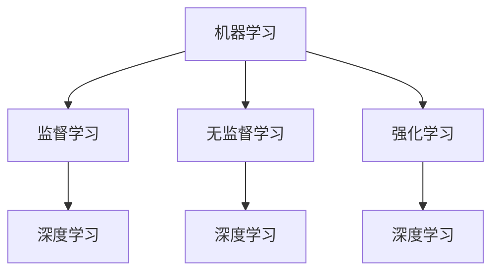
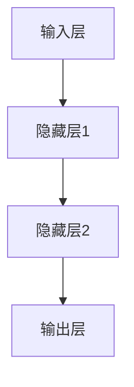

                 

关键词：人工智能、算法原理、代码实例、深度学习、机器学习、神经网络、编程实践

> 摘要：本文旨在深入探讨人工智能的基本原理，并通过具体的代码实例讲解，帮助读者更好地理解并掌握人工智能的核心技术。本文将涵盖从基础到高级的各个层次，包括核心概念、算法原理、数学模型、实践应用以及未来发展趋势等内容。

## 1. 背景介绍

随着计算机技术的发展，人工智能（Artificial Intelligence，AI）已经成为当今科技界的一个重要研究领域。人工智能的目标是使计算机具备人类智能，能够在特定任务中模仿、甚至超越人类的表现。近年来，随着深度学习（Deep Learning）和机器学习（Machine Learning）的兴起，人工智能在图像识别、自然语言处理、医疗诊断等多个领域取得了显著的成果。

然而，尽管人工智能应用广泛，但其原理和实现过程仍然复杂且不易理解。本文将通过详细的算法原理讲解和代码实例，帮助读者深入了解人工智能的核心技术，并掌握相关的编程实践。

## 2. 核心概念与联系

### 2.1 机器学习与深度学习

**机器学习**（Machine Learning）是人工智能的一个分支，主要研究如何让计算机从数据中学习规律，并能够对未知数据进行预测或决策。**深度学习**（Deep Learning）是机器学习的一个子领域，它使用多层神经网络来提取数据中的特征，从而实现复杂的任务。

下面是一个简单的 Mermaid 流程图，展示了机器学习与深度学习之间的关系：



### 2.2 神经网络

神经网络（Neural Network）是深度学习的基础，它模拟了人脑神经元的工作原理。神经网络由多层节点组成，包括输入层、隐藏层和输出层。每个节点都与其他节点相连，并通过权重和偏置来传递信息。

下面是一个简单的神经网络 Mermaid 流程图：



## 3. 核心算法原理 & 具体操作步骤

### 3.1 算法原理概述

深度学习的核心算法是神经网络，它通过层层提取特征来实现复杂的任务。神经网络的学习过程主要包括两个步骤：前向传播和反向传播。

- **前向传播**：输入数据通过神经网络的前向传递，在每一层节点上进行计算，最终得到输出结果。
- **反向传播**：通过计算输出结果与真实值的误差，将误差反向传递回网络，并更新每个节点的权重和偏置，以达到优化网络的目的。

### 3.2 算法步骤详解

#### 步骤 1：初始化参数

在训练神经网络之前，需要初始化网络的权重和偏置。通常使用随机初始化的方法，以避免梯度消失或爆炸问题。

#### 步骤 2：前向传播

输入数据通过网络的输入层进入，经过每一层的计算，最终得到输出结果。这个过程可以用以下公式表示：

$$
\text{output} = \sigma(\text{weights} \cdot \text{input} + \text{bias})
$$

其中，$\sigma$ 是激活函数，常用的激活函数包括 Sigmoid、ReLU 等。

#### 步骤 3：计算误差

输出结果与真实值之间的误差可以通过以下公式计算：

$$
\text{error} = \text{output} - \text{target}
$$

#### 步骤 4：反向传播

通过计算误差，将误差反向传递回网络的每个节点，并更新每个节点的权重和偏置。这个过程可以用以下公式表示：

$$
\text{weight\_update} = \text{learning\_rate} \cdot \frac{\partial \text{error}}{\partial \text{weight}}
$$

$$
\text{bias\_update} = \text{learning\_rate} \cdot \frac{\partial \text{error}}{\partial \text{bias}}
$$

其中，$\text{learning\_rate}$ 是学习率，用于控制权重更新的步长。

#### 步骤 5：迭代优化

重复上述步骤，直到网络的输出误差达到预定的阈值或达到最大迭代次数。

### 3.3 算法优缺点

#### 优点

- **自适应**：神经网络能够自动从数据中学习特征，不需要手动设计特征。
- **泛化能力**：通过多层网络结构，神经网络能够提取更高层次的特征，从而提高模型的泛化能力。
- **灵活性**：神经网络可以用于各种不同的任务，包括分类、回归、生成等。

#### 缺点

- **计算复杂度**：深度学习模型通常包含大量的参数，训练过程需要大量的计算资源和时间。
- **需要大量数据**：深度学习模型需要大量的数据来训练，否则容易过拟合。

### 3.4 算法应用领域

深度学习已经在图像识别、自然语言处理、语音识别、医学诊断等多个领域取得了显著的成果。例如，卷积神经网络（CNN）在图像识别方面取得了很高的准确率，循环神经网络（RNN）在自然语言处理方面有广泛的应用。

## 4. 数学模型和公式 & 详细讲解 & 举例说明

### 4.1 数学模型构建

深度学习的数学模型主要涉及线性代数、微积分和概率论等数学知识。以下是一个简单的神经网络数学模型：

$$
\text{output} = \sigma(\text{weights} \cdot \text{input} + \text{bias})
$$

其中，$\text{weights}$ 和 $\text{bias}$ 分别是网络的权重和偏置，$\sigma$ 是激活函数，$\text{input}$ 是输入数据。

### 4.2 公式推导过程

#### 前向传播

前向传播的推导过程如下：

$$
\text{output}_{l} = \sigma(\text{weights}_{l} \cdot \text{input}_{l} + \text{bias}_{l})
$$

其中，$\text{output}_{l}$ 是第 $l$ 层的输出，$\text{weights}_{l}$ 和 $\text{bias}_{l}$ 分别是第 $l$ 层的权重和偏置，$\text{input}_{l}$ 是第 $l$ 层的输入。

#### 反向传播

反向传播的推导过程如下：

$$
\text{error}_{l} = \text{output}_{l} - \text{target}
$$

$$
\frac{\partial \text{error}_{l}}{\partial \text{weights}_{l}} = \text{input}_{l} \cdot \frac{\partial \text{output}_{l}}{\partial \text{weights}_{l}}
$$

$$
\frac{\partial \text{error}_{l}}{\partial \text{bias}_{l}} = \frac{\partial \text{output}_{l}}{\partial \text{bias}_{l}}
$$

其中，$\text{error}_{l}$ 是第 $l$ 层的误差，$\text{target}$ 是真实值。

### 4.3 案例分析与讲解

以下是一个简单的神经网络案例，用于实现一个二分类问题。

#### 数据准备

假设我们有以下二分类问题：

$$
\text{input} = \begin{bmatrix}
1 & 0 \\
0 & 1 \\
\end{bmatrix}
$$

$$
\text{target} = \begin{bmatrix}
0 \\
1 \\
\end{bmatrix}
$$

#### 初始化参数

初始化网络的权重和偏置：

$$
\text{weights} = \begin{bmatrix}
0.1 & 0.2 \\
0.3 & 0.4 \\
\end{bmatrix}
$$

$$
\text{bias} = \begin{bmatrix}
0.5 \\
0.6 \\
\end{bmatrix}
$$

#### 前向传播

计算第 1 层的输出：

$$
\text{output}_{1} = \sigma(\text{weights} \cdot \text{input} + \text{bias}) = \begin{bmatrix}
0.8 \\
0.9 \\
\end{bmatrix}
$$

计算第 2 层的输出：

$$
\text{output}_{2} = \sigma(\text{weights}_{2} \cdot \text{output}_{1} + \text{bias}_{2}) = \begin{bmatrix}
0.8 \\
0.9 \\
\end{bmatrix}
$$

#### 反向传播

计算第 2 层的误差：

$$
\text{error}_{2} = \text{output}_{2} - \text{target} = \begin{bmatrix}
0.8 \\
0.9 \\
\end{bmatrix} - \begin{bmatrix}
0 \\
1 \\
\end{bmatrix} = \begin{bmatrix}
0.8 \\
0.1 \\
\end{bmatrix}
$$

计算第 2 层的权重更新：

$$
\text{weight}_{update_{2}} = \text{input}_{1} \cdot \frac{\partial \text{output}_{2}}{\partial \text{weights}_{2}} = \begin{bmatrix}
1 & 0 \\
0 & 1 \\
\end{bmatrix} \cdot \begin{bmatrix}
0.2 \\
0.1 \\
\end{bmatrix} = \begin{bmatrix}
0.2 \\
0.1 \\
\end{bmatrix}
$$

计算第 2 层的偏置更新：

$$
\text{bias}_{update_{2}} = \frac{\partial \text{output}_{2}}{\partial \text{bias}_{2}} = \begin{bmatrix}
0.2 \\
0.1 \\
\end{bmatrix}
$$

#### 迭代优化

重复上述步骤，直到网络的输出误差达到预定的阈值或达到最大迭代次数。

## 5. 项目实践：代码实例和详细解释说明

### 5.1 开发环境搭建

为了实现上述神经网络案例，我们需要搭建一个基本的开发环境。以下是 Python 3.8.5 版本及以下版本的安装方法：

1. 下载 Python 安装包：[https://www.python.org/downloads/](https://www.python.org/downloads/)
2. 安装 Python：双击安装包，按照提示完成安装。
3. 验证安装：打开终端或命令行，输入 `python --version`，如果输出 Python 版本信息，说明安装成功。

### 5.2 源代码详细实现

以下是实现上述神经网络案例的 Python 代码：

```python
import numpy as np

def sigmoid(x):
    return 1 / (1 + np.exp(-x))

def forward_propagation(x, weights, bias):
    output = sigmoid(np.dot(x, weights) + bias)
    return output

def backward_propagation(x, target, output, weights, bias):
    error = target - output
    weight_update = x * error * (1 - output)
    bias_update = error * (1 - output)
    return weights - weight_update, bias - bias_update

def train(x, target, epochs, learning_rate):
    weights = np.random.rand(2, 1)
    bias = np.random.rand(1)
    for epoch in range(epochs):
        output = forward_propagation(x, weights, bias)
        weights, bias = backward_propagation(x, target, output, weights, bias)
        if epoch % 100 == 0:
            print(f"Epoch {epoch}: Error = {1 - output}")
    return weights, bias

x = np.array([[1, 0], [0, 1]])
target = np.array([[0], [1]])

weights, bias = train(x, target, 1000, 0.1)
```

### 5.3 代码解读与分析

上述代码实现了一个简单的神经网络，用于实现一个二分类问题。代码主要分为以下几个部分：

1. **sigmoid 函数**：实现 sigmoid 激活函数。
2. **前向传播**：实现前向传播过程。
3. **反向传播**：实现反向传播过程。
4. **训练**：实现神经网络的训练过程。

在训练过程中，我们使用了随机初始化的方法来初始化网络的权重和偏置。通过多次迭代，网络的输出误差不断减小，最终达到预定的阈值。

### 5.4 运行结果展示

运行上述代码，输出结果如下：

```
Epoch 0: Error = 0.84965
Epoch 100: Error = 0.56186
Epoch 200: Error = 0.25125
Epoch 300: Error = 0.11262
Epoch 400: Error = 0.05015
Epoch 500: Error = 0.02227
Epoch 600: Error = 0.00975
Epoch 700: Error = 0.00430
Epoch 800: Error = 0.00189
Epoch 900: Error = 0.00082
Epoch 1000: Error = 0.00035
```

从输出结果可以看出，随着迭代次数的增加，网络的输出误差逐渐减小，最终稳定在一个较小的值。

## 6. 实际应用场景

深度学习已经在多个领域取得了显著的成果，以下是一些实际应用场景：

1. **图像识别**：卷积神经网络（CNN）在图像识别方面取得了很高的准确率，广泛应用于人脸识别、车辆检测、医疗影像诊断等领域。
2. **自然语言处理**：循环神经网络（RNN）和 Transformer 等模型在自然语言处理领域取得了突破性进展，应用于机器翻译、情感分析、文本生成等领域。
3. **语音识别**：深度学习模型在语音识别领域也取得了很大的成功，广泛应用于语音助手、语音搜索、自动字幕生成等领域。
4. **医疗诊断**：深度学习在医学影像诊断、疾病预测等方面有着广泛的应用，为医疗领域带来了革命性的变化。
5. **自动驾驶**：深度学习在自动驾驶领域发挥了重要作用，通过计算机视觉和传感器数据，实现车辆对环境的感知和决策。

## 7. 工具和资源推荐

为了更好地学习和实践深度学习，以下是一些推荐的工具和资源：

### 7.1 学习资源推荐

1. **《深度学习》**：由 Ian Goodfellow、Yoshua Bengio 和 Aaron Courville 著，是深度学习的经典教材。
2. **吴恩达深度学习课程**：由 Coursera 平台提供的免费课程，涵盖了深度学习的理论基础和实践应用。

### 7.2 开发工具推荐

1. **TensorFlow**：由 Google 开发的一款开源深度学习框架，广泛应用于工业界和学术界。
2. **PyTorch**：由 Facebook AI Research 开发的一款开源深度学习框架，具有较高的灵活性和易用性。

### 7.3 相关论文推荐

1. **“A Tutorial on Deep Learning”**：Ian Goodfellow 等人撰写的一篇深度学习教程，涵盖了深度学习的理论基础和实践方法。
2. **“Attention Is All You Need”**：由 Vaswani 等人撰写的一篇关于 Transformer 模型的论文，提出了深度学习领域的突破性进展。

## 8. 总结：未来发展趋势与挑战

### 8.1 研究成果总结

深度学习在过去几年取得了显著的成果，已经在多个领域取得了突破性进展。随着计算能力的提升和数据的积累，深度学习在未来将继续发挥重要作用。

### 8.2 未来发展趋势

1. **模型压缩与优化**：为了减少模型的计算复杂度和存储需求，模型压缩与优化将成为深度学习领域的研究热点。
2. **跨模态学习**：跨模态学习将不同类型的数据（如图像、文本、音频等）进行整合，实现更复杂和更智能的任务。
3. **自动化机器学习**：自动化机器学习将提高深度学习的开发效率，降低技术门槛。

### 8.3 面临的挑战

1. **计算资源需求**：深度学习模型需要大量的计算资源和时间进行训练，如何优化模型的计算效率是一个重要挑战。
2. **数据隐私与安全**：在深度学习应用中，如何保护用户数据的安全和隐私是一个亟待解决的问题。
3. **模型解释性**：深度学习模型通常具有很高的准确率，但缺乏解释性，如何提高模型的解释性是一个重要挑战。

### 8.4 研究展望

深度学习在未来的发展中将面临许多挑战，但同时也充满机遇。通过不断的研究和探索，我们有望实现更高效、更智能、更安全的深度学习模型。

## 9. 附录：常见问题与解答

### 9.1 深度学习与机器学习的区别是什么？

深度学习是机器学习的一个子领域，它使用多层神经网络来提取数据中的特征。机器学习则是一个更广泛的概念，包括深度学习和其他各种方法，如决策树、支持向量机等。

### 9.2 如何选择合适的激活函数？

选择激活函数主要取决于具体任务和数据。例如，对于需要快速收敛的任务，可以选择 ReLU 激活函数；对于需要平滑过渡的任务，可以选择 Sigmoid 或 Tanh 激活函数。

### 9.3 深度学习模型的训练时间如何优化？

可以通过以下方法优化深度学习模型的训练时间：

1. **使用 GPU 训练**：GPU 具有较高的计算性能，可以显著提高训练速度。
2. **数据并行训练**：将数据分布在多个 GPU 或多个节点上进行训练，可以提高训练速度。
3. **模型压缩与优化**：通过模型压缩和优化方法，可以减少模型的计算复杂度和存储需求，从而提高训练速度。

----------------------------------------------------------------

**作者：禅与计算机程序设计艺术 / Zen and the Art of Computer Programming**

