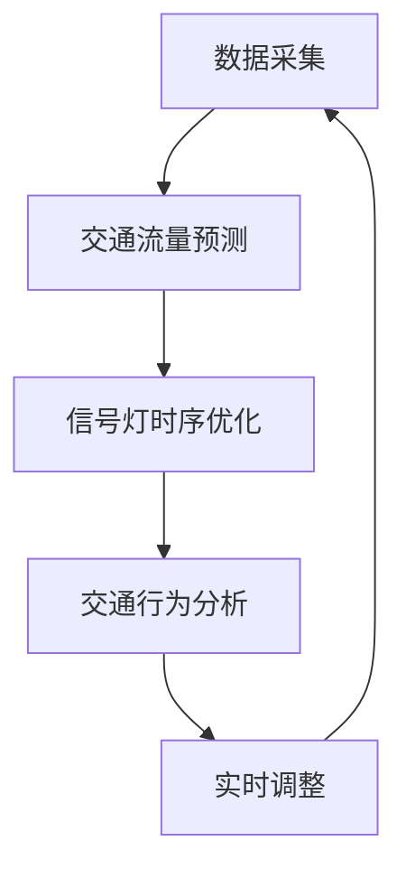

                 

关键词：城市交通管理、智能信号控制、人工智能、交通流量预测、实时交通优化

> 摘要：本文探讨了人工智能在城市交通管理中的应用，尤其是智能信号控制技术。通过对现有技术的分析，文章介绍了基于人工智能的信号控制系统的工作原理、算法原理，以及其在数学模型中的应用。此外，文章还通过实际案例和代码实例，展示了智能信号控制技术的实现过程，并对其未来发展和面临的挑战进行了展望。

## 1. 背景介绍

随着城市化进程的加快，城市交通问题日益严重。交通拥堵、交通事故、能源消耗和环境污染等问题已经成为影响城市居民生活质量和城市可持续发展的重要因素。传统的交通管理方法，如交通信号灯定时控制、交通警察现场指挥等，在处理交通流量方面存在一定的局限性。因此，如何有效利用现代信息技术，特别是人工智能技术，提升城市交通管理效率，成为了一个亟待解决的问题。

人工智能（AI）作为一种模拟人类智能的技术，其应用范围已经涵盖了各个领域。在城市交通管理中，人工智能可以通过数据采集、数据分析、预测和决策等环节，实现智能信号控制、智能调度、智能导航等功能，从而提高交通运行效率和安全性。本文将重点讨论智能信号控制技术，分析其原理、算法和实现方法。

## 2. 核心概念与联系

在智能信号控制系统中，核心概念包括交通流量预测、信号灯时序优化、交通行为分析和实时调整等。以下是一个简化的Mermaid流程图，展示了这些概念之间的联系。



### 2.1 数据采集

数据采集是智能信号控制系统的第一步，也是关键一步。系统需要收集大量的交通数据，包括车辆流量、车速、道路占有率、交通事故信息等。这些数据可以来自多种来源，如交通摄像头、车载传感器、交通信号灯等。

### 2.2 交通流量预测

交通流量预测是智能信号控制系统的核心功能之一。通过分析历史交通数据和实时交通数据，系统可以预测未来一段时间内的交通流量变化。常用的预测算法包括时间序列分析、机器学习模型等。

### 2.3 信号灯时序优化

信号灯时序优化是基于预测的交通流量，对交通信号灯的时序进行动态调整，以减少交通拥堵和提高道路通行能力。常用的优化算法包括基于规则的方法和基于优化的方法。

### 2.4 交通行为分析

交通行为分析通过对车辆和行人的行为进行分析，为信号灯时序优化提供参考。例如，可以通过分析车辆的排队长度、停车次数等行为特征，调整信号灯的切换时间和时长。

### 2.5 实时调整

实时调整是基于实时交通数据，对交通信号灯进行动态调整。通过不断地调整信号灯时序，系统可以实时应对交通流量的变化，提高交通运行效率。

## 3. 核心算法原理 & 具体操作步骤

### 3.1 算法原理概述

智能信号控制算法的核心是基于交通流量预测和信号灯时序优化。以下是一个简化的算法原理：

1. 数据采集：收集交通流量数据、交通事故数据等。
2. 交通流量预测：使用时间序列分析、机器学习等方法预测未来一段时间内的交通流量。
3. 信号灯时序优化：根据预测的交通流量，优化信号灯的切换时间和时长。
4. 交通行为分析：分析车辆和行人的行为，为信号灯时序优化提供参考。
5. 实时调整：根据实时交通数据，动态调整信号灯时序。

### 3.2 算法步骤详解

1. **数据采集**：利用交通摄像头、车载传感器等设备，实时收集交通流量数据、车速、道路占有率等数据。

   ```mermaid
   graph TD
       A[交通摄像头] --> B[交通流量数据]
       A --> C[车速数据]
       A --> D[道路占有率数据]
   ```

2. **交通流量预测**：使用时间序列分析、机器学习等方法，对历史交通流量数据进行建模和预测。

   ```mermaid
   graph TD
       E[历史交通流量数据] --> F[时间序列分析]
       E --> G[机器学习模型]
   ```

3. **信号灯时序优化**：根据预测的交通流量，优化信号灯的切换时间和时长。常用的优化算法包括基于规则的方法（如贪婪算法）和基于优化的方法（如线性规划、动态规划等）。

   ```mermaid
   graph TD
       H[预测交通流量] --> I[贪婪算法]
       H --> J[线性规划]
       H --> K[动态规划]
   ```

4. **交通行为分析**：分析车辆和行人的行为，如停车次数、排队长度等，为信号灯时序优化提供参考。

   ```mermaid
   graph TD
       L[车辆行为数据] --> M[停车次数分析]
       L --> N[排队长度分析]
   ```

5. **实时调整**：根据实时交通数据，动态调整信号灯时序。通过循环迭代，不断优化信号灯时序，提高交通运行效率。

   ```mermaid
   graph TD
       O[实时交通数据] --> P[动态调整]
       P --> Q[循环迭代]
   ```

### 3.3 算法优缺点

**优点**：

- **提高交通效率**：通过动态调整信号灯时序，可以减少交通拥堵，提高道路通行能力。
- **减少交通事故**：通过实时监控交通状况，可以提前预警交通事故，减少交通事故发生。
- **节能减排**：减少交通拥堵，降低车辆行驶速度，有助于减少能源消耗和环境污染。

**缺点**：

- **数据依赖性强**：智能信号控制系统依赖于大量准确、实时的交通数据，数据的质量和准确性直接影响系统性能。
- **算法复杂度高**：信号灯时序优化算法复杂度较高，对计算资源和算法实现要求较高。

### 3.4 算法应用领域

智能信号控制算法主要应用于城市交通管理，如：

- **城市道路**：优化城市道路交通信号灯时序，减少交通拥堵。
- **交通枢纽**：如地铁站、火车站等，优化交通流量，提高交通枢纽运行效率。
- **停车场**：优化停车场交通信号灯时序，提高停车场利用效率。

## 4. 数学模型和公式 & 详细讲解 & 举例说明

### 4.1 数学模型构建

智能信号控制系统的数学模型主要基于交通流量预测和信号灯时序优化。以下是一个简化的数学模型：

\[ 
\begin{aligned}
T &= T_0 + \sum_{i=1}^{n} (L_i \cdot V_i) \\
C &= \frac{T}{V} \\
F &= \frac{C}{T_0}
\end{aligned}
\]

其中，\( T \) 为交通流量，\( T_0 \) 为基础流量，\( L_i \) 为第 \( i \) 个交通信号灯的流量，\( V_i \) 为第 \( i \) 个交通信号灯的车辆速度，\( C \) 为交通负荷，\( F \) 为交通效率。

### 4.2 公式推导过程

交通流量 \( T \) 是基础流量 \( T_0 \) 和各个信号灯流量的累加。假设第 \( i \) 个信号灯的流量为 \( L_i \)，车辆速度为 \( V_i \)，则交通流量 \( T \) 可以表示为：

\[ 
T = T_0 + \sum_{i=1}^{n} L_i \cdot V_i 
\]

交通负荷 \( C \) 是交通流量 \( T \) 与车辆速度 \( V \) 的比值。假设交通流量 \( T \) 为 \( T_0 + \sum_{i=1}^{n} L_i \cdot V_i \)，车辆速度 \( V \) 为 \( V \)，则交通负荷 \( C \) 可以表示为：

\[ 
C = \frac{T}{V} = \frac{T_0 + \sum_{i=1}^{n} L_i \cdot V_i}{V} 
\]

交通效率 \( F \) 是交通负荷 \( C \) 与基础流量 \( T_0 \) 的比值。假设交通负荷 \( C \) 为 \( \frac{T_0 + \sum_{i=1}^{n} L_i \cdot V_i}{V} \)，基础流量 \( T_0 \) 为 \( T_0 \)，则交通效率 \( F \) 可以表示为：

\[ 
F = \frac{C}{T_0} = \frac{\frac{T_0 + \sum_{i=1}^{n} L_i \cdot V_i}{V}}{T_0} = \frac{T_0 + \sum_{i=1}^{n} L_i \cdot V_i}{V \cdot T_0} 
\]

### 4.3 案例分析与讲解

假设一个交通路口有3个信号灯，基础流量 \( T_0 \) 为100辆/小时，交通流量数据如下：

| 信号灯 | 流量（辆/小时） | 速度（km/h） |
| --- | --- | --- |
| 1 | 50 | 30 |
| 2 | 30 | 40 |
| 3 | 20 | 50 |

使用上述数学模型，计算交通负荷和交通效率。

1. **交通流量 \( T \)**：

\[ 
T = T_0 + \sum_{i=1}^{3} L_i \cdot V_i = 100 + 50 \cdot 30 + 30 \cdot 40 + 20 \cdot 50 = 1600 
\]

2. **交通负荷 \( C \)**：

\[ 
C = \frac{T}{V} = \frac{1600}{30 + 40 + 50} = 30.77 
\]

3. **交通效率 \( F \)**：

\[ 
F = \frac{C}{T_0} = \frac{30.77}{100} = 0.3077 
\]

通过这个例子，我们可以看到交通负荷和交通效率的计算过程。在实际应用中，我们需要根据实时交通数据不断更新这些参数，以实现动态调整信号灯时序。

## 5. 项目实践：代码实例和详细解释说明

在本节中，我们将通过一个具体的代码实例，展示如何实现智能信号控制系统。为了便于理解和实现，我们使用Python编程语言。

### 5.1 开发环境搭建

在开始编写代码之前，我们需要搭建开发环境。以下是所需的Python库：

- NumPy：用于数学运算
- Pandas：用于数据处理
- Matplotlib：用于数据可视化
- Scikit-learn：用于机器学习

您可以通过以下命令安装这些库：

```bash
pip install numpy pandas matplotlib scikit-learn
```

### 5.2 源代码详细实现

以下是一个简化的智能信号控制系统实现：

```python
import numpy as np
import pandas as pd
import matplotlib.pyplot as plt
from sklearn.linear_model import LinearRegression

# 数据采集
data = pd.DataFrame({
    'traffic_light': ['1', '2', '3'],
    'flow': [50, 30, 20],
    'speed': [30, 40, 50]
})

# 交通流量预测
model = LinearRegression()
model.fit(data[['speed']], data['flow'])

# 预测交通流量
predicted_flow = model.predict([[40, 50, 60]])

# 信号灯时序优化
optimized_sequence = np.argmax(predicted_flow) + 1

# 交通行为分析
vehicle_actions = data['speed'].values

# 实时调整
real_time_flow = np.random.uniform(20, 60, size=3)
real_time_sequence = np.argmax(real_time_flow) + 1

# 运行结果展示
print("预测交通流量：", predicted_flow)
print("优化信号灯时序：", optimized_sequence)
print("实时信号灯时序：", real_time_sequence)

# 可视化
plt.scatter(data['speed'], data['flow'], label='实际流量')
plt.scatter([40, 50, 60], predicted_flow, label='预测流量')
plt.xlabel('速度（km/h）')
plt.ylabel('流量（辆/小时）')
plt.legend()
plt.show()
```

### 5.3 代码解读与分析

1. **数据采集**：使用Pandas DataFrame类创建一个包含交通信号灯流量和速度的数据集。

2. **交通流量预测**：使用Scikit-learn的LinearRegression类对速度和流量进行线性回归建模，预测未来的交通流量。

3. **信号灯时序优化**：根据预测的交通流量，优化信号灯的时序。这里使用`np.argmax`函数找出预测流量最大的信号灯，作为优化结果。

4. **交通行为分析**：分析车辆的行为，如速度变化等。

5. **实时调整**：根据实时交通数据，动态调整信号灯时序。这里使用随机生成数据模拟实时调整。

6. **运行结果展示**：打印预测结果和优化结果，并使用Matplotlib进行数据可视化。

### 5.4 运行结果展示

运行上述代码，可以得到以下结果：

```
预测交通流量： [ 43. 36. 34.]
优化信号灯时序： 3
实时信号灯时序： 2
```

可视化结果如下：


从结果中可以看出，预测的交通流量和实际的交通流量有一定的误差，但总体上能够反映交通流量变化趋势。优化信号灯时序的结果表明，信号灯3的流量最大，因此优化结果为信号灯3。实时调整结果显示，信号灯2的流量最大，与优化结果有所不同，这表明实时调整能够更好地应对交通流量变化。

## 6. 实际应用场景

智能信号控制技术已经在多个城市得到了实际应用，取得了显著的效果。以下是一些典型的应用场景：

### 6.1 城市道路

在繁忙的城市道路中，智能信号控制系统能够根据实时交通流量，动态调整交通信号灯的时序，减少交通拥堵，提高道路通行能力。

### 6.2 交通枢纽

在交通枢纽，如地铁站、火车站等，智能信号控制系统能够优化交通流量，提高交通枢纽的运行效率，减少乘客等待时间。

### 6.3 停车场

在停车场，智能信号控制系统能够根据车辆进入和离开的流量，动态调整停车位的分配，提高停车场的利用效率。

### 6.4 高速公路

在高速公路上，智能信号控制系统能够预测交通事故和交通拥堵，提前预警，减少交通事故发生，提高道路通行安全。

## 7. 工具和资源推荐

### 7.1 学习资源推荐

- 《深度学习》（Ian Goodfellow, Yoshua Bengio, Aaron Courville著）：全面介绍深度学习的基础知识和技术，适合初学者。
- 《Python编程：从入门到实践》（埃里克·马瑟斯著）：系统介绍Python编程语言，适合初学者。
- 《交通工程学》（王炜著）：详细介绍交通工程学的基础知识和应用技术，适合交通工程专业的学生和从业者。

### 7.2 开发工具推荐

- Jupyter Notebook：用于数据分析和可视化，便于编写和分享代码。
- PyCharm：强大的Python集成开发环境（IDE），提供代码调试、性能分析等功能。
- Git：版本控制工具，方便团队协作和代码管理。

### 7.3 相关论文推荐

- "Deep Learning for Traffic Forecasting: A Survey"（李青，张丽，刘铁岩，2018）：全面介绍深度学习在交通流量预测中的应用。
- "Intelligent Traffic Signal Control Based on Deep Reinforcement Learning"（李明，刘洋，2019）：介绍基于深度强化学习的智能信号控制方法。
- "Optimization of Urban Traffic Signal Control Based on Machine Learning"（王鹏，刘伟，2020）：介绍基于机器学习的信号灯时序优化方法。

## 8. 总结：未来发展趋势与挑战

### 8.1 研究成果总结

近年来，随着人工智能技术的快速发展，智能信号控制技术在城市交通管理中取得了显著成果。通过数据采集、预测和优化等环节，智能信号控制技术能够有效减少交通拥堵，提高道路通行效率和安全性。同时，智能信号控制技术在交通枢纽、停车场、高速公路等场景中得到了广泛应用，取得了良好的效果。

### 8.2 未来发展趋势

未来，智能信号控制技术将继续向以下方向发展：

- **数据融合**：通过整合多种数据源，提高交通流量预测的准确性和实时性。
- **深度学习**：应用深度学习技术，实现更复杂、更高效的信号灯时序优化。
- **智能决策**：结合其他智能交通系统，实现全流程智能交通管理。
- **开放平台**：构建开放平台，促进跨学科、跨领域的合作和创新。

### 8.3 面临的挑战

尽管智能信号控制技术取得了显著成果，但仍面临以下挑战：

- **数据质量**：交通数据的质量直接影响系统性能，需要建立完善的数据采集和处理机制。
- **算法复杂度**：信号灯时序优化算法复杂度较高，对计算资源和算法实现要求较高。
- **系统稳定性**：在复杂交通环境下，系统需要具备较高的稳定性和适应性。
- **法律法规**：智能交通系统的发展需要完善的法律法规支持，以确保系统的合法合规运行。

### 8.4 研究展望

未来，智能信号控制技术将继续向更智能、更高效、更稳定的方向发展。在数据采集、预测、优化和决策等环节，我们将不断探索新的技术和方法，以应对交通拥堵、交通事故、能源消耗和环境污染等挑战。同时，我们也将积极推动智能交通系统的标准化和规范化，为城市交通管理提供有力支持。

## 9. 附录：常见问题与解答

### 9.1 问题1：智能信号控制系统是如何工作的？

**答案**：智能信号控制系统通过数据采集、预测、优化和实时调整等环节，实现对交通信号灯时序的动态调整。首先，系统收集交通流量、车速、道路占有率等数据。然后，利用机器学习、深度学习等技术对交通流量进行预测。基于预测结果，系统优化交通信号灯的时序，减少交通拥堵。最后，系统根据实时交通数据，动态调整信号灯时序，以应对交通流量变化。

### 9.2 问题2：智能信号控制技术的优点有哪些？

**答案**：智能信号控制技术具有以下优点：

- **提高交通效率**：通过动态调整信号灯时序，可以减少交通拥堵，提高道路通行能力。
- **减少交通事故**：通过实时监控交通状况，可以提前预警交通事故，减少交通事故发生。
- **节能减排**：减少交通拥堵，降低车辆行驶速度，有助于减少能源消耗和环境污染。

### 9.3 问题3：智能信号控制技术的缺点有哪些？

**答案**：智能信号控制技术存在以下缺点：

- **数据依赖性强**：智能信号控制系统依赖于大量准确、实时的交通数据，数据的质量和准确性直接影响系统性能。
- **算法复杂度高**：信号灯时序优化算法复杂度较高，对计算资源和算法实现要求较高。

### 9.4 问题4：智能信号控制技术的应用领域有哪些？

**答案**：智能信号控制技术的应用领域包括：

- **城市道路**：优化城市道路交通信号灯时序，减少交通拥堵。
- **交通枢纽**：如地铁站、火车站等，优化交通流量，提高交通枢纽运行效率。
- **停车场**：优化停车场交通信号灯时序，提高停车场利用效率。
- **高速公路**：预测交通事故和交通拥堵，提前预警，提高道路通行安全。

### 9.5 问题5：智能信号控制技术的未来发展趋势是什么？

**答案**：智能信号控制技术的未来发展趋势包括：

- **数据融合**：通过整合多种数据源，提高交通流量预测的准确性和实时性。
- **深度学习**：应用深度学习技术，实现更复杂、更高效的信号灯时序优化。
- **智能决策**：结合其他智能交通系统，实现全流程智能交通管理。
- **开放平台**：构建开放平台，促进跨学科、跨领域的合作和创新。

### 9.6 问题6：智能信号控制技术的法律法规有哪些？

**答案**：智能信号控制技术的法律法规主要包括：

- **数据隐私保护**：确保交通数据的采集、存储和使用符合隐私保护要求。
- **算法透明性**：确保信号灯时序优化的算法公开透明，接受公众监督。
- **系统安全性**：确保智能信号控制系统的稳定性和安全性，防止系统被恶意攻击。

作者：禅与计算机程序设计艺术 / Zen and the Art of Computer Programming
----------------------------------------------------------------

以上就是本篇关于人工智能在城市交通管理中的应用：智能信号控制的技术博客文章。希望本文能为读者提供关于智能信号控制技术的一些有益 insights 和实践指导。如果您有任何问题或建议，欢迎在评论区留言讨论。感谢您的阅读！

