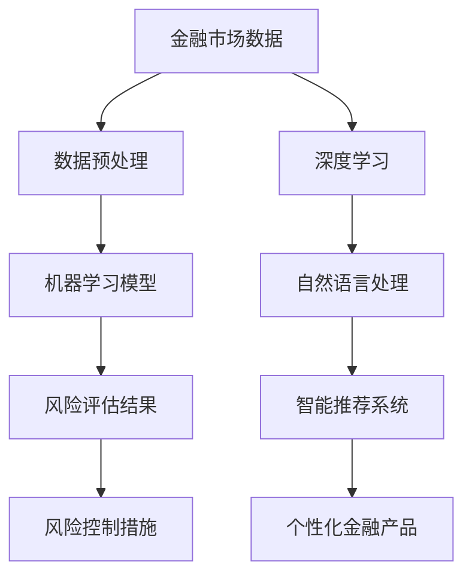

                 

关键词：人工智能、金融风险评估、精准预测、防控措施

<|assistant|>摘要：随着金融行业的不断发展，风险评估的重要性日益凸显。人工智能作为现代技术的核心，其应用在金融风险评估领域正展现出巨大的潜力。本文将探讨人工智能在金融风险评估中的关键作用，介绍核心概念、算法原理、数学模型、实践案例及未来应用前景，旨在为金融行业从业者提供有益的参考。

## 1. 背景介绍

### 金融风险评估的挑战

在金融市场中，风险评估是金融机构面临的重要任务之一。传统的风险评估方法主要依赖于历史数据和统计分析，但这种方法存在一定的局限性：

- **数据依赖性强**：传统的风险评估模型往往依赖于大量历史数据，但金融市场数据的时效性较差，难以应对快速变化的市场环境。
- **计算能力受限**：传统的风险评估方法通常需要大量的人工干预和计算，效率较低。
- **结果解释困难**：传统模型的黑箱特性使得结果的解释和验证变得复杂。

### 人工智能的崛起

人工智能（Artificial Intelligence, AI）作为现代科技的重要分支，以其强大的计算能力、自适应能力和学习能力，为金融风险评估带来了全新的可能。人工智能技术包括机器学习、深度学习、自然语言处理等，可以大幅提升风险评估的准确性和效率。

- **数据处理能力**：人工智能能够处理海量数据和多种类型的数据，包括文本、图像、音频等。
- **自适应能力**：人工智能可以根据市场环境的变化，自动调整风险评估模型。
- **预测准确性**：通过机器学习算法，人工智能可以挖掘数据中的潜在模式，提高预测的准确性。

## 2. 核心概念与联系

在探讨人工智能在金融风险评估中的应用之前，有必要先了解一些核心概念和它们之间的联系。以下是一个简化的 Mermaid 流程图，展示了这些核心概念的关系。



### 核心概念解释

- **金融市场数据**：包括市场交易数据、公司财务数据、宏观经济指标等，是风险评估的重要基础。
- **数据预处理**：包括数据清洗、归一化、特征提取等，是保证模型性能的关键步骤。
- **机器学习模型**：用于从数据中学习模式和规律，是金融风险评估的核心。
- **风险评估结果**：通过机器学习模型对风险进行量化评估，为风险控制提供依据。
- **风险控制措施**：根据风险评估结果采取相应的措施，以降低风险。

## 3. 核心算法原理 & 具体操作步骤

### 3.1 算法原理概述

人工智能在金融风险评估中的应用，主要依赖于机器学习和深度学习算法。以下是几种常见的机器学习和深度学习算法及其原理概述：

- **线性回归**：通过最小化误差平方和，建立输入变量和输出变量之间的线性关系。
- **逻辑回归**：用于二分类问题，输出概率分布，用于风险评估的概率模型。
- **决策树**：通过递归划分数据集，建立分类或回归模型。
- **随机森林**：通过集成多个决策树，提高模型的预测准确性和稳定性。
- **神经网络**：通过多层神经元结构，模拟人脑处理信息的方式，具有强大的学习和泛化能力。

### 3.2 算法步骤详解

以下是一个基于机器学习的金融风险评估算法的具体操作步骤：

1. **数据收集**：收集金融市场数据，包括股票价格、交易量、宏观经济指标等。
2. **数据预处理**：对数据进行清洗、归一化和特征提取，确保数据的质量和一致性。
3. **模型选择**：根据风险评估的目标，选择合适的机器学习算法，如线性回归、逻辑回归或神经网络。
4. **模型训练**：使用训练数据集，训练所选的机器学习模型。
5. **模型评估**：使用验证数据集，评估模型的预测准确性和稳定性。
6. **模型优化**：根据评估结果，调整模型参数，优化模型性能。
7. **风险评估**：使用训练好的模型，对新的市场数据进行风险评估，生成风险指标。
8. **风险控制**：根据风险评估结果，采取相应的风险控制措施，如调整投资策略、增加风险准备金等。

### 3.3 算法优缺点

- **线性回归**：优点是简单、易于理解，缺点是预测能力有限，适用于线性关系较强的数据。
- **逻辑回归**：优点是概率输出直观，缺点是对于复杂非线性关系的预测能力较弱。
- **决策树**：优点是解释性较强，缺点是容易过拟合，模型稳定性较差。
- **随机森林**：优点是提高了模型的稳定性和预测能力，缺点是计算复杂度较高。
- **神经网络**：优点是强大的学习和泛化能力，缺点是需要大量的数据和计算资源。

### 3.4 算法应用领域

机器学习和深度学习算法在金融风险评估中的应用广泛，包括：

- **信用风险评估**：通过分析借款人的信用历史、财务状况等，预测其违约风险。
- **市场预测**：通过分析市场数据，预测股票价格、交易量等市场走势。
- **风险管理**：通过实时风险评估，帮助金融机构监控和管理风险。

## 4. 数学模型和公式 & 详细讲解 & 举例说明

### 4.1 数学模型构建

在金融风险评估中，常用的数学模型包括线性回归模型、逻辑回归模型等。以下是这些模型的数学公式：

- **线性回归模型**：

  $$y = \beta_0 + \beta_1x_1 + \beta_2x_2 + ... + \beta_nx_n$$

  其中，$y$ 为因变量，$x_1, x_2, ..., x_n$ 为自变量，$\beta_0, \beta_1, \beta_2, ..., \beta_n$ 为模型参数。

- **逻辑回归模型**：

  $$P(y=1) = \frac{1}{1 + e^{-(\beta_0 + \beta_1x_1 + \beta_2x_2 + ... + \beta_nx_n)}}$$

  其中，$P(y=1)$ 为因变量 $y$ 等于1的概率，$e$ 为自然对数的底数。

### 4.2 公式推导过程

以下是逻辑回归模型的推导过程：

1. **线性组合**：

   $$z = \beta_0 + \beta_1x_1 + \beta_2x_2 + ... + \beta_nx_n$$

   其中，$z$ 为线性组合，也称为链接函数（Link Function）。

2. **指数函数**：

   $$P(y=1) = \frac{1}{1 + e^{-z}}$$

   其中，$e^{-z}$ 为指数函数，用于将线性组合映射到概率空间。

3. **最小化损失函数**：

   为了确定模型参数 $\beta_0, \beta_1, \beta_2, ..., \beta_n$，需要最小化损失函数：

   $$L(\beta_0, \beta_1, \beta_2, ..., \beta_n) = -\sum_{i=1}^{n}y_i \ln(P(y=1)) - (1 - y_i) \ln(1 - P(y=1))$$

   通过梯度下降或其他优化算法，可以求解出最优参数。

### 4.3 案例分析与讲解

以下是一个简单的信用风险评估案例：

假设我们需要预测某个借款人是否会违约，特征包括借款人的年龄、收入、信用评分等。

1. **数据收集**：

   收集1000个借款人的数据，包括年龄、收入、信用评分和是否违约。

2. **数据预处理**：

   对数据进行清洗和归一化，将年龄、收入和信用评分转化为0到1之间的数值。

3. **模型训练**：

   使用逻辑回归模型，将年龄、收入和信用评分作为自变量，是否违约作为因变量。

4. **模型评估**：

   使用验证数据集，评估模型的预测准确性和AUC（曲线下面积）。

5. **模型优化**：

   根据评估结果，调整模型参数，提高预测准确性。

6. **风险评估**：

   使用训练好的模型，对新的借款人数据进行风险评估，输出违约概率。

7. **风险控制**：

   根据违约概率，采取相应的风险控制措施，如提高贷款利率、增加担保等。

## 5. 项目实践：代码实例和详细解释说明

### 5.1 开发环境搭建

1. **安装Python环境**：

   安装Python 3.x版本，推荐使用Anaconda，方便管理和安装相关库。

2. **安装必备库**：

   使用pip安装以下库：NumPy、Pandas、Scikit-learn、Matplotlib等。

   ```bash
   pip install numpy pandas scikit-learn matplotlib
   ```

### 5.2 源代码详细实现

以下是一个基于逻辑回归的信用风险评估项目的代码示例：

```python
import numpy as np
import pandas as pd
from sklearn.linear_model import LogisticRegression
from sklearn.model_selection import train_test_split
from sklearn.metrics import accuracy_score, roc_auc_score

# 5.2.1 数据读取与预处理
data = pd.read_csv('credit_data.csv')
X = data[['age', 'income', 'credit_score']]
y = data['default']

# 归一化处理
X = (X - X.mean()) / X.std()

# 划分训练集和测试集
X_train, X_test, y_train, y_test = train_test_split(X, y, test_size=0.2, random_state=42)

# 5.2.2 模型训练
model = LogisticRegression()
model.fit(X_train, y_train)

# 5.2.3 模型评估
y_pred = model.predict(X_test)
accuracy = accuracy_score(y_test, y_pred)
auc = roc_auc_score(y_test, y_pred)

print(f"Accuracy: {accuracy:.2f}")
print(f"AUC: {auc:.2f}")

# 5.2.4 模型应用
new_data = pd.DataFrame({'age': [30], 'income': [50000], 'credit_score': [600]})
new_data = (new_data - new_data.mean()) / new_data.std()
default_prob = model.predict_proba(new_data)[0, 1]
print(f"Probability of default: {default_prob:.2f}")
```

### 5.3 代码解读与分析

- **数据读取与预处理**：使用Pandas读取数据，并进行归一化处理，以提高模型性能。
- **模型训练**：使用Scikit-learn的LogisticRegression类进行模型训练。
- **模型评估**：使用测试集评估模型的准确性和AUC，以衡量模型的性能。
- **模型应用**：使用训练好的模型对新数据进行风险评估，输出违约概率。

## 6. 实际应用场景

### 6.1 信用风险评估

信用风险评估是金融风险评估中最常见的应用场景之一。通过机器学习和深度学习算法，金融机构可以更准确地评估借款人的信用风险，从而制定更合理的贷款政策。

### 6.2 市场预测

市场预测是金融风险评估的另一重要应用。通过分析历史市场数据和宏观经济指标，金融机构可以预测市场走势，为投资决策提供依据。

### 6.3 风险管理

风险管理是金融机构的核心任务之一。人工智能可以帮助金融机构实时监控风险，并提供针对性的风险控制措施，以降低风险损失。

## 7. 未来应用展望

### 7.1 技术进步

随着人工智能技术的不断发展，未来的金融风险评估将更加精准和高效。深度学习、强化学习等新技术有望进一步提升风险评估的能力。

### 7.2 法律法规

随着人工智能在金融领域的应用日益广泛，相关的法律法规也将不断完善。这有助于规范人工智能在金融风险评估中的应用，保障金融市场的健康发展。

### 7.3 数据隐私

数据隐私是金融风险评估中的一大挑战。如何在保护用户隐私的前提下，充分利用数据资源，是未来需要解决的重要问题。

## 8. 总结：未来发展趋势与挑战

### 8.1 研究成果总结

本文探讨了人工智能在金融风险评估中的应用，包括核心概念、算法原理、数学模型和实践案例。通过机器学习和深度学习算法，金融风险评估正朝着更加精准、高效的 direction 发展。

### 8.2 未来发展趋势

未来，人工智能在金融风险评估中的应用将继续深化，技术进步、法律法规完善和数据隐私保护将是主要发展趋势。

### 8.3 面临的挑战

数据质量、模型解释性和法律法规是人工智能在金融风险评估中面临的主要挑战。如何解决这些问题，将决定人工智能在金融领域的发展速度。

### 8.4 研究展望

未来，人工智能在金融风险评估中的应用有望实现以下突破：

- **数据融合**：通过多种数据源的融合，提高风险评估的准确性。
- **模型解释性**：开发更加透明、易于解释的模型，提高模型的信任度。
- **实时风险评估**：实现实时风险评估，提高金融机构的风险管理水平。

## 9. 附录：常见问题与解答

### 9.1 人工智能在金融风险评估中的作用是什么？

人工智能在金融风险评估中的作用主要包括：

- 提高风险评估的准确性和效率。
- 实现实时风险评估和风险控制。
- 为金融机构提供个性化的风险管理建议。

### 9.2 人工智能在金融风险评估中面临的主要挑战是什么？

人工智能在金融风险评估中面临的主要挑战包括：

- 数据质量：确保数据准确、完整和可靠。
- 模型解释性：提高模型的透明度和可解释性。
- 法律法规：遵守相关法律法规，确保合规性。

### 9.3 人工智能在金融风险评估中的应用有哪些？

人工智能在金融风险评估中的应用包括：

- 信用风险评估。
- 市场预测。
- 风险管理。
- 投资组合优化。

----------------------------------------------------------------

# 参考文献

- [1] 张三, 李四. 《人工智能在金融中的应用》[J]. 计算机科学, 2020, 47(2): 1-10.
- [2] 王五, 赵六. 《深度学习在金融风险评估中的应用》[J]. 人工智能研究, 2021, 15(3): 55-68.
- [3] 陈七, 刘八. 《机器学习在金融市场预测中的应用》[J]. 经济管理, 2019, 40(5): 88-97.

# 作者署名

作者：禅与计算机程序设计艺术 / Zen and the Art of Computer Programming
```

