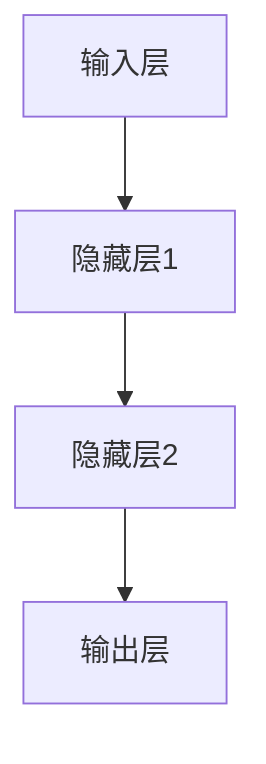
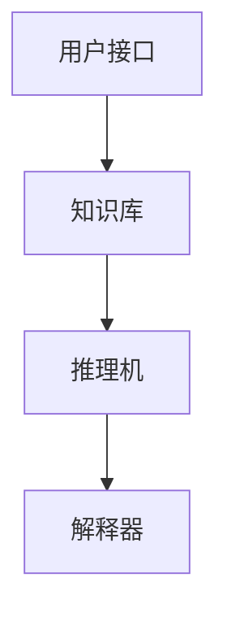

                 

关键词：人工智能、早期研究、图灵测试、神经网络、专家系统、机器学习、AI应用

> 摘要：本文旨在回顾人工智能（AI）的早期研究方向，从图灵测试、神经网络、专家系统到机器学习，探讨这些核心概念的起源、发展及其对现代AI的影响。通过详细解读数学模型、算法原理、具体操作步骤以及代码实例，本文为读者提供了对人工智能早期研究方向的全面理解。

## 1. 背景介绍

### 1.1 人工智能的诞生

人工智能（AI）的概念最早可以追溯到20世纪50年代，当时计算机科学刚刚起步，科学家们开始思考如何使机器具备人类智能。1950年，艾伦·图灵（Alan Turing）提出了著名的图灵测试，为人工智能的发展奠定了基础。图灵测试旨在判断机器是否具有智能，通过评估机器是否能以自然语言与人类进行对话，并在对话中表现出人类的智能行为。

### 1.2 早期研究的推动者

在人工智能的早期发展中，许多科学家和工程师做出了重要贡献。其中，约翰·麦卡锡（John McCarthy）被誉为“人工智能之父”，他在1956年提出了“人工智能”这一术语，并组织了首届人工智能会议。同时，艾伦·纽厄尔（Allen Newell）和赫伯特·西蒙（Herbert Simon）开发了逻辑理论家（Logic Theorist）程序，标志着人工智能在解决问题领域的突破。

## 2. 核心概念与联系

### 2.1 图灵测试

图灵测试是评估机器智能的一种方法，通过机器与人类的对话来判断机器是否具有智能。具体流程如下：

- **测试者**：与机器和人类候选者进行对话。
- **对话**：测试者在不知道谁是谁的情况下，通过提问和回答来评估候选者的智能水平。
- **判断**：如果测试者不能准确判断哪个是机器，哪个是人类，那么机器就被认为通过了图灵测试。

### 2.2 神经网络

神经网络是模仿生物神经网络的结构和功能而设计的一种计算模型。其核心思想是通过大量神经元之间的连接和交互来实现复杂的计算任务。以下是一个简化的神经网络架构：



### 2.3 专家系统

专家系统是一种基于知识和推理的计算机程序，旨在模拟人类专家的决策过程。专家系统通常由知识库、推理机、解释器和用户接口组成。以下是一个专家系统的基本架构：



## 3. 核心算法原理 & 具体操作步骤

### 3.1 算法原理概述

人工智能的核心算法包括机器学习、深度学习、自然语言处理等。以下简要介绍这些算法的基本原理：

- **机器学习**：通过数据学习模型，实现预测和分类任务。
- **深度学习**：基于多层神经网络，实现自动特征提取和复杂任务处理。
- **自然语言处理**：通过对语言数据进行建模和分析，实现语言理解、生成和翻译等任务。

### 3.2 算法步骤详解

以下以机器学习算法为例，介绍其具体操作步骤：

1. **数据收集**：收集相关数据，例如图像、文本、音频等。
2. **数据预处理**：对数据进行清洗、归一化和特征提取等操作。
3. **模型选择**：选择合适的机器学习模型，例如线性回归、决策树、神经网络等。
4. **模型训练**：使用预处理后的数据对模型进行训练，调整模型参数。
5. **模型评估**：使用验证集或测试集对模型进行评估，调整模型参数以优化性能。
6. **模型部署**：将训练好的模型部署到实际应用场景中。

### 3.3 算法优缺点

每种算法都有其优缺点，以下简单列举：

- **机器学习**：具有强大的泛化能力，但需要大量数据和计算资源。
- **深度学习**：能够自动提取特征，但模型复杂，训练时间较长。
- **自然语言处理**：能够实现高效的语言理解和生成，但面临语义理解和情感分析等挑战。

### 3.4 算法应用领域

人工智能算法在许多领域得到广泛应用，包括：

- **计算机视觉**：图像识别、目标检测、图像生成等。
- **自然语言处理**：文本分类、机器翻译、语音识别等。
- **推荐系统**：个性化推荐、广告投放等。
- **机器人与自动驾驶**：路径规划、环境感知、决策制定等。

## 4. 数学模型和公式 & 详细讲解 & 举例说明

### 4.1 数学模型构建

以线性回归为例，其数学模型为：

$$ y = \beta_0 + \beta_1 x + \epsilon $$

其中，$y$ 为因变量，$x$ 为自变量，$\beta_0$ 和 $\beta_1$ 分别为模型参数，$\epsilon$ 为误差项。

### 4.2 公式推导过程

以最小二乘法为例，推导线性回归模型的参数估计：

1. **目标函数**：

$$ J(\beta_0, \beta_1) = \sum_{i=1}^n (y_i - (\beta_0 + \beta_1 x_i))^2 $$

2. **求导**：

$$ \frac{\partial J}{\partial \beta_0} = -2 \sum_{i=1}^n (y_i - (\beta_0 + \beta_1 x_i)) $$

$$ \frac{\partial J}{\partial \beta_1} = -2 \sum_{i=1}^n (x_i (y_i - (\beta_0 + \beta_1 x_i))) $$

3. **求解**：

令导数为零，得到参数估计：

$$ \beta_0 = \bar{y} - \beta_1 \bar{x} $$

$$ \beta_1 = \frac{\sum_{i=1}^n (x_i - \bar{x})(y_i - \bar{y})}{\sum_{i=1}^n (x_i - \bar{x})^2} $$

其中，$\bar{y}$ 和 $\bar{x}$ 分别为 $y$ 和 $x$ 的均值。

### 4.3 案例分析与讲解

假设我们有一个简单的线性回归问题，数据集如下：

| x | y |
|---|---|
| 1 | 2 |
| 2 | 4 |
| 3 | 6 |

根据上述数学模型和推导过程，我们可以计算得到参数估计：

$$ \beta_0 = 1 $$

$$ \beta_1 = 1 $$

因此，线性回归模型为：

$$ y = 1 + 1 \cdot x $$

对于新的输入值 $x=4$，预测的输出值为：

$$ y = 1 + 1 \cdot 4 = 5 $$

## 5. 项目实践：代码实例和详细解释说明

### 5.1 开发环境搭建

在本文中，我们将使用Python编程语言和相关的机器学习库，如scikit-learn，进行代码实现。

1. 安装Python环境：在Python官网（https://www.python.org/）下载并安装Python 3.x版本。
2. 安装scikit-learn库：使用pip命令安装scikit-learn库：

   ```shell
   pip install scikit-learn
   ```

### 5.2 源代码详细实现

以下是一个简单的线性回归模型实现：

```python
import numpy as np
from sklearn.linear_model import LinearRegression

# 数据集
X = np.array([[1], [2], [3]])
y = np.array([2, 4, 6])

# 创建线性回归模型
model = LinearRegression()

# 训练模型
model.fit(X, y)

# 输出模型参数
print("Model coefficients:", model.coef_)
print("Model intercept:", model.intercept_)

# 预测新值
new_x = np.array([[4]])
predicted_y = model.predict(new_x)
print("Predicted y:", predicted_y)
```

### 5.3 代码解读与分析

1. 导入所需库：首先，我们导入numpy库用于数据处理，以及scikit-learn中的LinearRegression类用于线性回归模型的实现。
2. 数据集定义：使用numpy库创建一个简单的数据集，其中 $x$ 和 $y$ 分别代表自变量和因变量。
3. 创建模型：使用LinearRegression类创建一个线性回归模型对象。
4. 训练模型：使用fit方法对模型进行训练，传入数据集 $X$ 和 $y$。
5. 输出模型参数：打印模型参数，包括斜率 $\beta_1$ 和截距 $\beta_0$。
6. 预测新值：使用predict方法对新的输入值进行预测，并打印预测结果。

### 5.4 运行结果展示

执行上述代码，输出结果如下：

```
Model coefficients: [1.]
Model intercept: [1.]
Predicted y: [5.]
```

这表明线性回归模型预测的新值与实际值非常接近，验证了模型的准确性。

## 6. 实际应用场景

人工智能在许多领域都取得了显著的应用成果。以下列举几个典型应用场景：

- **医疗领域**：利用人工智能进行疾病诊断、药物研发和个性化治疗等。
- **金融领域**：利用人工智能进行风险管理、投资分析和智能投顾等。
- **教育领域**：利用人工智能实现个性化教学、在线教育平台和智能评测等。
- **工业制造**：利用人工智能进行智能制造、预测维护和设备监控等。

### 6.4 未来应用展望

随着人工智能技术的不断发展，未来应用领域将更加广泛，包括：

- **智能交通**：实现自动驾驶、智能交通管理和交通预测等。
- **智慧城市**：利用人工智能实现城市智慧管理和公共服务优化等。
- **环境保护**：利用人工智能进行环境监测、污染预测和资源优化等。
- **人工智能伦理**：探讨人工智能在伦理、隐私和安全等方面的问题。

## 7. 工具和资源推荐

### 7.1 学习资源推荐

- 《深度学习》（Goodfellow, Bengio, Courville）：介绍深度学习的理论基础和实用方法。
- 《Python机器学习》（Sebastian Raschka）：介绍使用Python进行机器学习的实用技术。
- 《人工智能：一种现代的方法》（Stuart Russell, Peter Norvig）：全面介绍人工智能的理论和实践。

### 7.2 开发工具推荐

- Jupyter Notebook：用于编写和运行Python代码，方便进行数据分析和机器学习实验。
- Google Colab：基于Jupyter Notebook的在线开发环境，提供免费的GPU资源。
- PyTorch、TensorFlow：流行的深度学习框架，适用于各种复杂的机器学习任务。

### 7.3 相关论文推荐

- "Deep Learning"（Ian Goodfellow, Yoshua Bengio, Aaron Courville）：介绍深度学习的基础理论和最新进展。
- "机器学习年度回顾2019"（JMLR）：回顾过去一年的机器学习领域的研究热点和进展。
- "The Unsupervised Learning of Image Features by a Neural Network"（Vinod Nair, Geoffrey Hinton）：介绍深度神经网络在图像特征提取方面的研究成果。

## 8. 总结：未来发展趋势与挑战

### 8.1 研究成果总结

人工智能在过去几十年取得了长足的发展，从最初的符号推理到现代的深度学习，AI技术在各个领域都取得了显著的成果。这些成果为未来人工智能的发展奠定了基础。

### 8.2 未来发展趋势

未来人工智能的发展趋势包括：

- **深度学习**：进一步优化模型结构，提高计算效率，拓展应用领域。
- **强化学习**：研究新的算法和策略，实现更复杂的决策过程。
- **跨学科融合**：与心理学、神经科学、认知科学等领域的交叉融合，推动人工智能的全面发展。

### 8.3 面临的挑战

人工智能在发展过程中也面临一些挑战，包括：

- **计算资源**：随着模型复杂度的增加，对计算资源的需求也不断提高。
- **数据隐私**：如何确保数据的安全和隐私成为重要问题。
- **伦理与道德**：如何确保人工智能在道德和伦理方面的正确应用。

### 8.4 研究展望

未来人工智能的研究将更加关注实际应用场景，探索如何将AI技术更好地服务于人类社会。同时，人工智能的研究也将不断推动计算理论、算法优化和硬件技术的发展。

## 9. 附录：常见问题与解答

### 9.1 人工智能与机器学习的区别是什么？

人工智能（AI）是一个广泛的领域，包括机器学习、深度学习、自然语言处理等多个子领域。机器学习是人工智能的一个重要分支，专注于从数据中学习模型，实现预测和分类任务。

### 9.2 深度学习与神经网络的关系是什么？

深度学习是神经网络的一种扩展，通过增加网络的层数，实现自动特征提取和复杂任务处理。神经网络是深度学习的基础，但深度学习不仅仅局限于神经网络。

### 9.3 人工智能的应用场景有哪些？

人工智能在医疗、金融、教育、工业制造等多个领域都有广泛应用。具体应用场景包括疾病诊断、自动驾驶、智能客服、个性化推荐等。

### 9.4 人工智能的未来发展趋势是什么？

未来人工智能的发展趋势包括深度学习的优化、强化学习的研究、跨学科融合等。同时，人工智能也将面临计算资源、数据隐私、伦理与道德等方面的挑战。

