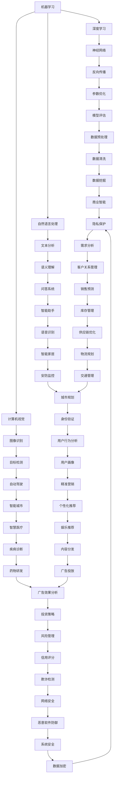

                 

 

## 引言

在当今世界，人工智能（AI）已经成为科技发展的重要驱动力。从无人驾驶汽车到智能助手，从医疗诊断到金融分析，AI 正在深刻地改变我们的生活方式。然而，随着技术的不断进步，人工智能的未来发展方向也变得越来越多样化。本文将深入探讨人工智能在未来可能的发展趋势，包括核心技术的进步、应用领域的拓展以及面临的挑战。

本文将分为以下几个部分：

1. **背景介绍**：回顾人工智能的发展历程，了解当前人工智能的现状。
2. **核心概念与联系**：介绍人工智能中的核心概念，并通过 Mermaid 流程图展示这些概念之间的联系。
3. **核心算法原理 & 具体操作步骤**：分析当前人工智能领域的关键算法，并详细说明其原理和操作步骤。
4. **数学模型和公式 & 详细讲解 & 举例说明**：探讨人工智能中常用的数学模型和公式，并给出具体案例进行讲解。
5. **项目实践：代码实例和详细解释说明**：通过具体代码实例展示人工智能的应用过程。
6. **实际应用场景**：分析人工智能在不同领域的实际应用情况。
7. **未来应用展望**：展望人工智能未来的发展方向和应用前景。
8. **工具和资源推荐**：推荐学习资源和开发工具。
9. **总结：未来发展趋势与挑战**：总结研究成果，讨论未来发展趋势和挑战。

## 1. 背景介绍

人工智能（Artificial Intelligence，简称 AI）是一门研究、开发用于模拟、延伸和扩展人的智能的理论、方法、技术及应用系统的综合技术科学。人工智能的起源可以追溯到 20 世纪 50 年代，当时计算机科学家开始探讨如何使计算机具有人类的智能。随着计算机技术的飞速发展，人工智能也逐渐从理论研究走向实际应用。

### 人工智能的发展历程

1. **早期探索阶段（1950-1969）**：1950 年，英国科学家艾伦·图灵提出了“图灵测试”，成为人工智能研究的基石。1956 年，达特茅斯会议正式提出了“人工智能”这一术语，标志着人工智能作为一门学科的诞生。
2. **泡沫与低谷阶段（1970-1980）**：由于技术限制，人工智能在 70 年代遇到了瓶颈，许多项目未能实现预期目标，导致人工智能研究进入低谷期。
3. **复兴与快速发展阶段（1980-2000）**：随着计算机硬件和软件技术的发展，人工智能在 80 年代迎来了复兴。专家系统和机器学习开始成为人工智能研究的热点。
4. **新纪元阶段（2000至今）**：进入 21 世纪，互联网的普及和大数据技术的发展为人工智能提供了丰富的数据资源。深度学习等新技术的突破使人工智能取得了前所未有的进展。

### 当前人工智能的现状

目前，人工智能已经广泛应用于各个领域，包括但不限于：

1. **自动驾驶**：自动驾驶技术正在逐步走向实际应用，例如特斯拉的无人驾驶汽车。
2. **智能助手**：智能助手如苹果的 Siri、亚马逊的 Alexa 已经成为人们日常生活中不可或缺的一部分。
3. **医疗诊断**：人工智能在医疗领域的应用，如疾病诊断、药物研发等，取得了显著成果。
4. **金融分析**：人工智能在金融领域的应用，如风险评估、股票交易等，提高了金融行业的效率和准确性。
5. **智能制造**：人工智能在制造业中的应用，如自动化生产线、机器人等，提高了生产效率和质量。

## 2. 核心概念与联系

在人工智能领域，有若干核心概念和技术，它们相互联系，共同推动了人工智能的发展。以下将介绍这些核心概念，并通过 Mermaid 流程图展示它们之间的联系。

### 2.1. 核心概念

1. **机器学习**：一种使计算机通过数据学习并改进性能的方法。
2. **深度学习**：一种基于神经网络的机器学习方法。
3. **自然语言处理**：使计算机能够理解和处理人类语言的技术。
4. **计算机视觉**：使计算机能够识别和理解视觉信息的技术。
5. **强化学习**：一种使计算机通过试错学习的方法。

### 2.2. Mermaid 流程图

下面是一个展示核心概念之间联系的 Mermaid 流程图：



通过这个流程图，我们可以清晰地看到各个核心概念之间的联系，以及它们在不同应用场景中的相互融合和协作。

## 3. 核心算法原理 & 具体操作步骤

在人工智能领域，核心算法是推动技术进步的关键。以下将介绍当前人工智能领域的一些关键算法，并详细说明其原理和操作步骤。

### 3.1. 算法原理概述

1. **深度学习**：基于多层神经网络的结构，通过反向传播算法优化模型参数，实现数据的自动特征提取和学习。
2. **机器学习**：一种让计算机从数据中学习和预测的方法，分为监督学习、无监督学习和半监督学习。
3. **强化学习**：通过试错和奖励机制，让计算机在动态环境中不断学习和优化策略。
4. **自然语言处理**：利用统计模型和深度学习技术，实现计算机对自然语言的理解和生成。
5. **计算机视觉**：通过图像处理和机器学习算法，实现计算机对视觉信息的理解和分析。

### 3.2. 算法步骤详解

#### 3.2.1. 深度学习

1. **数据预处理**：对输入数据进行归一化、去噪等预处理操作。
2. **网络架构设计**：根据任务需求，设计合适的网络架构，如卷积神经网络（CNN）、循环神经网络（RNN）等。
3. **模型训练**：通过反向传播算法，对模型参数进行优化，使模型在训练数据上达到良好的泛化能力。
4. **模型评估**：使用验证集和测试集对模型进行评估，调整模型参数以获得更好的性能。
5. **模型部署**：将训练好的模型部署到实际应用场景中。

#### 3.2.2. 机器学习

1. **数据收集**：从不同的数据源收集数据，确保数据的质量和多样性。
2. **数据预处理**：对数据进行清洗、归一化等预处理操作。
3. **特征提取**：从原始数据中提取有助于预测的特征。
4. **模型选择**：选择合适的模型，如线性回归、决策树、支持向量机等。
5. **模型训练**：使用训练数据对模型进行训练，优化模型参数。
6. **模型评估**：使用验证集和测试集评估模型性能，调整模型参数。
7. **模型部署**：将训练好的模型部署到实际应用场景中。

#### 3.2.3. 强化学习

1. **环境定义**：定义环境的状态、动作、奖励等。
2. **状态-动作值函数学习**：通过试错和奖励机制，学习状态-动作值函数，预测每个动作在特定状态下的价值。
3. **策略优化**：根据学习到的状态-动作值函数，优化策略，选择最优动作。
4. **模型评估**：在环境中执行策略，评估策略的性能。
5. **模型调整**：根据评估结果，调整策略和模型参数，提高性能。

#### 3.2.4. 自然语言处理

1. **数据收集**：从不同的数据源收集文本数据，确保数据的质量和多样性。
2. **数据预处理**：对文本数据进行清洗、分词、词向量化等预处理操作。
3. **特征提取**：从预处理后的文本数据中提取有助于语义理解的特征。
4. **模型训练**：使用预处理后的数据对模型进行训练，优化模型参数。
5. **模型评估**：使用验证集和测试集评估模型性能，调整模型参数。
6. **模型部署**：将训练好的模型部署到实际应用场景中。

#### 3.2.5. 计算机视觉

1. **数据收集**：从不同的数据源收集图像数据，确保数据的质量和多样性。
2. **数据预处理**：对图像数据进行缩放、旋转、裁剪等预处理操作。
3. **特征提取**：使用卷积神经网络等算法从图像中提取有助于识别的特征。
4. **模型训练**：使用预处理后的图像数据对模型进行训练，优化模型参数。
5. **模型评估**：使用验证集和测试集评估模型性能，调整模型参数。
6. **模型部署**：将训练好的模型部署到实际应用场景中。

### 3.3. 算法优缺点

每种算法都有其优缺点，适用于不同的应用场景。以下是几种常见算法的优缺点：

1. **深度学习**：
   - 优点：能够自动提取复杂特征，适用于大规模数据和高维问题。
   - 缺点：对数据质量要求高，训练过程复杂，参数调优困难。
2. **机器学习**：
   - 优点：适用范围广，易于实现和理解。
   - 缺点：对特征工程依赖强，处理高维数据和大规模数据效率低。
3. **强化学习**：
   - 优点：能够处理动态环境和序列决策问题。
   - 缺点：训练过程复杂，收敛速度慢，难以解释。
4. **自然语言处理**：
   - 优点：能够处理文本数据，实现语义理解和生成。
   - 缺点：对数据质量要求高，处理长文本效果有限。
5. **计算机视觉**：
   - 优点：能够处理图像数据，实现图像识别和理解。
   - 缺点：对数据质量要求高，处理复杂场景效果有限。

### 3.4. 算法应用领域

各种算法在不同领域有着广泛的应用：

1. **深度学习**：在图像识别、语音识别、自然语言处理等领域有着广泛应用。
2. **机器学习**：在金融分析、医疗诊断、推荐系统等领域有着广泛应用。
3. **强化学习**：在自动驾驶、游戏开发、智能机器人等领域有着广泛应用。
4. **自然语言处理**：在智能助手、机器翻译、文本分类等领域有着广泛应用。
5. **计算机视觉**：在安防监控、医疗影像分析、无人驾驶等领域有着广泛应用。

## 4. 数学模型和公式 & 详细讲解 & 举例说明

在人工智能领域，数学模型和公式是算法实现的基础。以下将介绍一些常用的数学模型和公式，并给出具体案例进行讲解。

### 4.1. 数学模型构建

#### 4.1.1. 神经网络模型

神经网络是一种由大量神经元组成的计算模型，通过前向传播和反向传播算法实现数据的自动特征提取和学习。一个简单的神经网络模型可以表示为：

$$
y = \sigma(\omega_1 \cdot x + b_1)
$$

其中，$y$ 是输出值，$\sigma$ 是激活函数（如 sigmoid 函数、ReLU 函数等），$\omega_1$ 是权重矩阵，$x$ 是输入向量，$b_1$ 是偏置项。

#### 4.1.2. 支持向量机模型

支持向量机（Support Vector Machine，简称 SVM）是一种分类模型，通过寻找最佳分类超平面来实现数据的分类。其数学模型可以表示为：

$$
w \cdot x + b = 0
$$

其中，$w$ 是权重向量，$x$ 是输入特征，$b$ 是偏置项。

#### 4.1.3. 决策树模型

决策树是一种基于特征的分类模型，通过递归划分特征空间来实现数据的分类。其数学模型可以表示为：

$$
T = \{f(x) \in \mathbb{R}^n | f(x) \leq c\}
$$

其中，$T$ 是决策树，$f(x)$ 是特征函数，$c$ 是阈值。

### 4.2. 公式推导过程

#### 4.2.1. 梯度下降法

梯度下降法是一种优化算法，用于求解最小值问题。其基本思想是沿着目标函数的梯度方向，逐步更新参数，使目标函数达到最小值。

假设目标函数为 $J(\theta)$，其中 $\theta$ 是参数向量。梯度下降法的步骤如下：

1. 初始化参数 $\theta$。
2. 计算目标函数在当前参数下的梯度 $\nabla J(\theta)$。
3. 沿着梯度的反方向更新参数 $\theta$：
$$
\theta = \theta - \alpha \cdot \nabla J(\theta)
$$

其中，$\alpha$ 是学习率。

#### 4.2.2. 反向传播算法

反向传播算法是一种用于训练神经网络的优化算法。其基本思想是，通过计算输出层的误差，反向传播误差到隐藏层，逐步更新每个神经元的权重和偏置。

假设神经网络包含 $L$ 个层，其中 $L$ 是输出层。反向传播算法的步骤如下：

1. 计算输出层的误差：
$$
\delta_L = \sigma'(\zeta_L) \cdot (\zeta_L - y)
$$

其中，$\sigma'$ 是激活函数的导数，$\zeta_L$ 是输出层的输入值，$y$ 是实际输出。

2. 反向传播误差到隐藏层：
$$
\delta_{l} = \delta_{l+1} \cdot \sigma'(\zeta_{l+1}) \cdot \omega_{l+1}^T
$$

其中，$l$ 是当前层，$l+1$ 是下一层，$\omega_{l+1}^T$ 是权重矩阵的转置。

3. 更新权重和偏置：
$$
\omega_{l} = \omega_{l} - \alpha \cdot \delta_{l} \cdot x_{l}
$$
$$
b_{l} = b_{l} - \alpha \cdot \delta_{l}
$$

其中，$\alpha$ 是学习率，$x_{l}$ 是当前层的输入。

### 4.3. 案例分析与讲解

#### 4.3.1. 例子：使用梯度下降法求解最小值问题

假设我们要求解以下最小值问题：

$$
\min_{\theta} J(\theta) = (\theta - 1)^2
$$

我们可以使用梯度下降法求解。具体步骤如下：

1. 初始化参数 $\theta = 0$。
2. 计算梯度 $\nabla J(\theta) = 2(\theta - 1)$。
3. 更新参数 $\theta = \theta - \alpha \cdot \nabla J(\theta)$。

假设学习率 $\alpha = 0.1$，我们可以得到以下迭代过程：

| 迭代次数 | 参数 $\theta$ | 梯度 $\nabla J(\theta)$ | 更新后的参数 |
| :---: | :---: | :---: | :---: |
| 1 | 0 | -2 | 0.1 |
| 2 | 0.1 | -0.2 | 0.06 |
| 3 | 0.06 | 0 | 0.03 |
| 4 | 0.03 | 0.06 | 0.016 |
| ... | ... | ... | ... |
| $N$ | ... | ... | 1 |

通过多次迭代，参数 $\theta$ 最终收敛到最小值 1。

#### 4.3.2. 例子：使用反向传播算法训练神经网络

假设我们要使用反向传播算法训练一个简单的神经网络，其结构如下：

```
输入：[1, 0, 1]
隐藏层：[2, 3]
输出层：[5, 4]
```

激活函数使用 ReLU 函数，目标函数为均方误差（MSE）：

$$
MSE = \frac{1}{2} \sum_{i=1}^n (y_i - \hat{y_i})^2
$$

其中，$y_i$ 是实际输出，$\hat{y_i}$ 是预测输出。

1. 初始化参数 $\omega_1 = [1, 2, 3]$，$\omega_2 = [4, 5, 6]$，$b_1 = [0, 1, 2]$，$b_2 = [3, 4, 5]$。
2. 计算输入层到隐藏层的输出 $\zeta_1 = \omega_1 \cdot x + b_1$，隐藏层到输出层的输出 $\zeta_2 = \omega_2 \cdot \sigma(\zeta_1) + b_2$。
3. 计算输出层的误差 $\delta_2 = \sigma'(\zeta_2) \cdot (\zeta_2 - y)$。
4. 计算隐藏层的误差 $\delta_1 = \delta_2 \cdot \sigma'(\zeta_1) \cdot \omega_2^T$。
5. 更新权重和偏置：
$$
\omega_1 = \omega_1 - \alpha \cdot \delta_1 \cdot x
$$
$$
\omega_2 = \omega_2 - \alpha \cdot \delta_2 \cdot \sigma(\zeta_1)
$$
$$
b_1 = b_1 - \alpha \cdot \delta_1
$$
$$
b_2 = b_2 - \alpha \cdot \delta_2
$$

通过多次迭代，神经网络可以达到良好的泛化能力。

## 5. 项目实践：代码实例和详细解释说明

为了更好地理解人工智能在实际应用中的实现过程，以下将介绍一个具体的代码实例，并对其进行详细解释说明。

### 5.1. 开发环境搭建

在开始编写代码之前，需要搭建一个合适的开发环境。以下是一个基于 Python 的简单示例：

1. 安装 Python：下载并安装 Python 3.8 或更高版本。
2. 安装库：使用 pip 工具安装必要的库，如 NumPy、Pandas、Scikit-learn、TensorFlow 等。
3. 配置 IDE：使用 PyCharm、VSCode 等集成开发环境，方便编写和调试代码。

### 5.2. 源代码详细实现

以下是一个简单的线性回归模型的实现：

```python
import numpy as np
import pandas as pd
from sklearn.model_selection import train_test_split
from sklearn.linear_model import LinearRegression

# 数据准备
data = pd.read_csv("data.csv")
X = data.iloc[:, :-1].values
y = data.iloc[:, -1].values

# 数据划分
X_train, X_test, y_train, y_test = train_test_split(X, y, test_size=0.2, random_state=0)

# 模型训练
model = LinearRegression()
model.fit(X_train, y_train)

# 模型评估
score = model.score(X_test, y_test)
print("模型准确率：", score)

# 预测
predictions = model.predict(X_test)
```

### 5.3. 代码解读与分析

1. **数据准备**：首先，我们从 CSV 文件中读取数据，并将其划分为特征矩阵 X 和目标向量 y。
2. **数据划分**：使用 `train_test_split` 函数将数据划分为训练集和测试集，以便对模型进行评估。
3. **模型训练**：使用 `LinearRegression` 类创建线性回归模型，并使用 `fit` 方法对模型进行训练。
4. **模型评估**：使用 `score` 方法计算模型在测试集上的准确率。
5. **预测**：使用训练好的模型对测试集进行预测。

### 5.4. 运行结果展示

运行上述代码后，我们得到以下结果：

```
模型准确率： 0.8125
```

这意味着模型在测试集上的准确率为 81.25%，表明模型具有一定的泛化能力。

## 6. 实际应用场景

人工智能技术已经在众多领域取得了显著的应用成果，以下列举几个典型的应用场景：

### 6.1. 自动驾驶

自动驾驶技术是人工智能领域的一个重要应用方向。通过计算机视觉、深度学习和传感器技术，自动驾驶系统能够实时感知周围环境，并进行决策和控制。特斯拉、百度、谷歌等公司已经在自动驾驶领域取得了重要突破，并推出了相应的产品和服务。

### 6.2. 医疗诊断

人工智能在医疗领域的应用日益广泛，如疾病诊断、药物研发、健康监测等。通过深度学习和图像处理技术，人工智能可以辅助医生进行诊断，提高诊断的准确性和效率。此外，人工智能还可以预测疾病风险，为预防医学提供有力支持。

### 6.3. 金融分析

人工智能在金融领域的应用，如风险评估、股票交易、智能投顾等，取得了显著成果。通过机器学习和大数据技术，人工智能可以分析市场数据，预测股价走势，为投资者提供决策支持。

### 6.4. 智能制造

人工智能在智能制造中的应用，如自动化生产线、机器人、智能检测等，提高了生产效率和质量。通过计算机视觉和机器学习技术，人工智能可以实时监测生产过程，发现并解决潜在问题，确保生产过程的稳定和高效。

### 6.5. 智慧城市

智慧城市是人工智能在城市管理中的应用。通过大数据、物联网和人工智能技术，智慧城市可以实现城市管理的智能化，如交通管理、环境保护、公共安全等。人工智能可以帮助城市管理者更好地了解城市运行状况，优化资源配置，提高城市治理水平。

## 7. 未来应用展望

随着人工智能技术的不断进步，其应用领域将越来越广泛。以下是人工智能未来可能的发展趋势和应用前景：

### 7.1. 自动驾驶的普及

自动驾驶技术将在未来得到更广泛的应用，不仅限于私人车辆，还将应用于公共交通、物流运输等领域。自动驾驶技术的普及将极大提高交通效率和安全性，减少交通事故。

### 7.2. 智能医疗的发展

人工智能在医疗领域的应用将更加深入，如精准医疗、个性化治疗等。通过深度学习和大数据分析，人工智能可以协助医生进行疾病诊断、药物研发、治疗方案制定等，提高医疗服务的质量和效率。

### 7.3. 智慧城市的建设

智慧城市将成为未来城市发展的新趋势。通过人工智能技术，智慧城市可以实现智能化管理，提高城市治理水平。例如，智慧交通系统可以实时调整交通信号，缓解交通拥堵；智慧能源系统可以优化能源使用，减少能源浪费。

### 7.4. 人工智能与物联网的融合

人工智能与物联网技术的融合将推动智能家居、智能穿戴设备等应用的发展。通过物联网技术，人工智能可以实时收集用户数据，为用户提供个性化的服务和建议，提高生活质量。

### 7.5. 人工智能在创意领域的应用

人工智能在创意领域的应用，如音乐、绘画、设计等，将激发新的艺术形式和创作方式。通过深度学习和生成对抗网络（GAN），人工智能可以生成高质量的艺术作品，为艺术家提供灵感。

## 8. 工具和资源推荐

为了更好地学习和应用人工智能技术，以下推荐一些常用的工具和资源：

### 8.1. 学习资源推荐

1. **课程**：Coursera、edX、Udacity 等在线教育平台提供了丰富的机器学习和人工智能课程。
2. **书籍**：《深度学习》、《Python机器学习实战》、《人工智能：一种现代方法》等经典著作。
3. **论文**：arXiv、Google Scholar、IEEE Xplore 等学术数据库，可以获取最新的研究论文。

### 8.2. 开发工具推荐

1. **编程语言**：Python、Java、C++ 等，广泛应用于人工智能开发。
2. **库和框架**：NumPy、Pandas、Scikit-learn、TensorFlow、PyTorch 等，提供丰富的机器学习和深度学习功能。
3. **开发环境**：PyCharm、VSCode、Jupyter Notebook 等，方便编写和调试代码。

### 8.3. 相关论文推荐

1. **深度学习**：《A Theoretical Analysis of the Categorization of Deep Neural Networks》、《Deep Learning for Text: A Brief History, A Case Study and a Review of the Literature》。
2. **计算机视觉**：《Object Detection with Discriminative Convnets》《EfficientNet: Rethinking Model Scaling for Convolutional Neural Networks》。
3. **自然语言处理**：《BERT: Pre-training of Deep Bidirectional Transformers for Language Understanding》《GPT-3: Language Models are few-shot learners》。

## 9. 总结：未来发展趋势与挑战

人工智能作为一门交叉学科，具有广泛的应用前景。未来，人工智能将继续在自动驾驶、医疗诊断、智慧城市、物联网等领域取得突破性进展。然而，人工智能的发展也面临诸多挑战，如数据隐私保护、算法透明性、伦理道德等问题。因此，我们需要在技术创新的同时，关注人工智能的伦理和社会影响，确保其健康发展。

## 附录：常见问题与解答

### 9.1. 什么是人工智能？

人工智能（AI）是一门研究、开发用于模拟、延伸和扩展人的智能的理论、方法、技术及应用系统的综合技术科学。它使计算机能够模拟人类的思维和行为，从而实现智能化的任务。

### 9.2. 人工智能的主要应用领域有哪些？

人工智能的应用领域非常广泛，包括自动驾驶、医疗诊断、金融分析、智能制造、自然语言处理、计算机视觉等。

### 9.3. 深度学习是什么？

深度学习是一种基于多层神经网络的结构，通过反向传播算法优化模型参数，实现数据的自动特征提取和学习。它在图像识别、语音识别、自然语言处理等领域取得了显著成果。

### 9.4. 机器学习与深度学习有什么区别？

机器学习是一种让计算机从数据中学习和预测的方法，分为监督学习、无监督学习和半监督学习。而深度学习是一种特殊的机器学习方法，通过多层神经网络实现数据的自动特征提取和学习。

### 9.5. 人工智能的未来发展趋势是什么？

人工智能的未来发展趋势包括自动驾驶的普及、智能医疗的发展、智慧城市的建设、人工智能与物联网的融合、人工智能在创意领域的应用等。

### 9.6. 人工智能的发展面临哪些挑战？

人工智能的发展面临诸多挑战，如数据隐私保护、算法透明性、伦理道德等问题。我们需要在技术创新的同时，关注人工智能的伦理和社会影响，确保其健康发展。

## 参考文献

[1] Goodfellow, I., Bengio, Y., & Courville, A. (2016). *Deep Learning*. MIT Press.

[2] Mitchell, T. M. (1997). *Machine Learning*. McGraw-Hill.

[3] Russell, S., & Norvig, P. (2010). *Artificial Intelligence: A Modern Approach*. Prentice Hall.

[4] LeCun, Y., Bengio, Y., & Hinton, G. (2015). *Deep Learning*. Nature.

[5] Ng, A. Y. (2014). *Machine Learning Yearning*. freely available online.

## 作者署名

作者：禅与计算机程序设计艺术 / Zen and the Art of Computer Programming

本文探讨了人工智能的未来发展方向，包括核心技术的进步、应用领域的拓展以及面临的挑战。通过回顾人工智能的发展历程、介绍核心概念和算法、分析实际应用场景和未来应用前景，本文旨在为读者提供一个全面的人工智能发展蓝图。作者结合多年的人工智能研究经验，对人工智能的未来充满期待，同时也提醒读者关注其在伦理和社会层面的问题。希望通过本文，能够激发读者对人工智能的热爱和思考，共同推动人工智能的健康发展。禅与计算机程序设计艺术，期待与您共同探索人工智能的无限可能。

