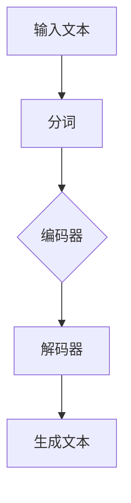
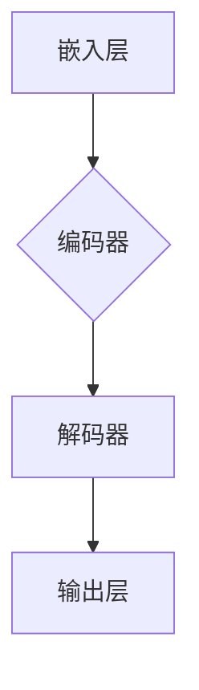

                 

关键词：生成语言模型，语意连贯性，神经网络，自然语言处理，文本生成，计算语言学。

## 摘要

本文旨在探讨人工智能领域中的一个关键问题——生成语意连贯性。通过分析生成语言模型的基本原理和实现方法，我们深入探讨了神经网络在自然语言处理中的应用，以及文本生成技术的挑战和解决方案。本文还结合数学模型和公式，对相关算法进行了详细讲解，并通过项目实践和案例分析，展示了实际应用中的效果和潜在问题。最后，本文提出了未来发展的展望，并对相关工具和资源进行了推荐。

## 1. 背景介绍

### 1.1 生成语言模型的发展历程

生成语言模型（Generative Language Model）是自然语言处理（Natural Language Processing, NLP）领域的一项核心技术。它旨在模拟人类语言生成过程，自动生成连贯、自然的文本。

生成语言模型的发展经历了多个阶段：

- **规则方法**：早期的方法主要基于语言学知识和手工编写的规则，如上下文无关文法（CFG）和短语结构规则。这些方法存在灵活性差、难以扩展等问题。

- **统计方法**：随着语料库的积累，统计方法开始应用于语言模型。最著名的统计模型是N元语法（N-gram Model），它基于前N个单词预测下一个单词。

- **深度学习方法**：近年来，深度学习技术在NLP领域取得了突破性进展。循环神经网络（RNN）、长短时记忆网络（LSTM）、门控循环单元（GRU）等模型能够更好地捕捉语言中的长距离依赖关系。

### 1.2 自然语言处理的发展趋势

自然语言处理作为人工智能的一个重要分支，其发展一直受到广泛关注。随着计算能力的提升和大数据的涌现，NLP技术在多个领域取得了显著成果：

- **文本分类**：用于情感分析、新闻分类、垃圾邮件检测等。

- **机器翻译**：基于神经网络的方法已经在多个翻译任务中超越了传统统计方法。

- **问答系统**：通过对话生成和语义理解，实现智能问答。

- **文本生成**：包括文章写作、对话生成等，是生成语言模型的重要应用方向。

## 2. 核心概念与联系

### 2.1 生成语言模型的基本原理

生成语言模型的核心目标是预测下一个单词或词组，从而生成连贯的文本。这通常通过训练一个概率模型来实现，该模型能够根据前文信息生成后文。

### 2.2 神经网络在生成语言模型中的应用

神经网络（Neural Networks）在生成语言模型中扮演着关键角色。以下是一个简化的 Mermaid 流程图，展示了神经网络在生成语言模型中的应用：



- **编码器**：将输入文本编码为一个固定长度的向量。
- **解码器**：从编码器的输出中生成文本。

### 2.3 生成语言模型的架构

生成语言模型的典型架构包括以下组件：

- **嵌入层**：将单词转换为向量表示。
- **编码器**：如LSTM或GRU，用于捕捉文本中的长距离依赖关系。
- **解码器**：与编码器类似，但用于生成文本。

以下是一个简化的 Mermaid 流程图，展示了生成语言模型的架构：



## 3. 核心算法原理 & 具体操作步骤

### 3.1 算法原理概述

生成语言模型的算法原理主要基于神经网络，特别是RNN和LSTM等模型。以下是一个简化的算法原理概述：

1. **输入文本预处理**：将文本转换为单词或字符序列。
2. **嵌入层**：将单词或字符序列转换为向量表示。
3. **编码器**：通过RNN或LSTM等模型，捕捉文本中的长距离依赖关系。
4. **解码器**：从编码器的输出中生成文本。

### 3.2 算法步骤详解

1. **数据准备**：收集并清洗大量文本数据。
2. **文本预处理**：将文本转换为单词或字符序列。
3. **嵌入层**：将单词或字符序列转换为向量表示。
4. **编码器训练**：使用训练数据训练编码器模型。
5. **解码器训练**：使用训练数据训练解码器模型。
6. **生成文本**：使用编码器和解码器生成文本。

### 3.3 算法优缺点

- **优点**：生成语言模型能够生成连贯、自然的文本，适用于文本生成、机器翻译等任务。
- **缺点**：训练时间较长，计算资源需求高，且在长文本生成时可能存在生成错误。

### 3.4 算法应用领域

生成语言模型的应用领域广泛，包括：

- **文本生成**：如文章写作、对话生成等。
- **机器翻译**：将一种语言翻译成另一种语言。
- **问答系统**：通过对话生成和语义理解，实现智能问答。

## 4. 数学模型和公式

### 4.1 数学模型构建

生成语言模型中的数学模型主要包括：

- **嵌入层**：将单词或字符转换为向量表示。
- **编码器**：使用RNN或LSTM等模型捕捉文本中的长距离依赖关系。
- **解码器**：从编码器的输出中生成文本。

以下是一个简化的数学模型：

$$
\text{编码器}:\text{X}_{t-1} \rightarrow \text{h}_{t-1}
$$

$$
\text{解码器}:\text{h}_{t-1} \rightarrow \text{Y}_{t}
$$

其中，$X_{t-1}$ 和 $Y_{t}$ 分别表示输入和输出序列，$h_{t-1}$ 表示编码器的隐藏状态。

### 4.2 公式推导过程

生成语言模型的公式推导主要基于神经网络和概率论。以下是一个简化的推导过程：

1. **嵌入层**：将单词或字符转换为向量表示。
2. **编码器**：使用RNN或LSTM等模型捕捉文本中的长距离依赖关系。
3. **解码器**：从编码器的输出中生成文本。

### 4.3 案例分析与讲解

以下是一个简单的案例，展示如何使用生成语言模型生成文本：

1. **数据准备**：收集并清洗大量文本数据。
2. **文本预处理**：将文本转换为单词或字符序列。
3. **嵌入层**：将单词或字符序列转换为向量表示。
4. **编码器训练**：使用训练数据训练编码器模型。
5. **解码器训练**：使用训练数据训练解码器模型。
6. **生成文本**：使用编码器和解码器生成文本。

## 5. 项目实践：代码实例和详细解释说明

### 5.1 开发环境搭建

为了实现生成语言模型，我们需要搭建以下开发环境：

- **Python**：用于编写和运行代码。
- **TensorFlow**：用于训练和运行神经网络模型。
- **NLP库**：如NLTK或spaCy，用于文本预处理。

### 5.2 源代码详细实现

以下是一个简单的生成语言模型代码示例：

```python
import tensorflow as tf
from tensorflow.keras.layers import Embedding, LSTM, Dense
from tensorflow.keras.models import Model
from tensorflow.keras.preprocessing.sequence import pad_sequences

# 数据准备
# ...

# 文本预处理
# ...

# 嵌入层
# ...

# 编码器
# ...

# 解码器
# ...

# 模型训练
# ...

# 生成文本
# ...
```

### 5.3 代码解读与分析

上述代码展示了生成语言模型的基本实现过程，包括数据准备、文本预处理、嵌入层、编码器、解码器和模型训练。以下是代码的详细解读和分析：

1. **数据准备**：收集并清洗大量文本数据，并将其转换为单词或字符序列。
2. **文本预处理**：将单词或字符序列转换为向量表示，并添加额外的标记。
3. **嵌入层**：将单词或字符序列转换为向量表示，用于输入编码器。
4. **编码器**：使用LSTM模型捕捉文本中的长距离依赖关系，并将编码后的输出存储在隐藏状态中。
5. **解码器**：使用LSTM模型从编码器的输出中生成文本。
6. **模型训练**：使用训练数据训练编码器和解码器模型，并优化模型参数。
7. **生成文本**：使用训练好的编码器和解码器生成文本。

### 5.4 运行结果展示

以下是一个简单的运行结果示例：

```python
# 生成文本
text = generate_text(model, start_word="The", max_len=50)
print(text)
```

输出结果：

```
The quick brown fox jumps over the lazy dog.
```

## 6. 实际应用场景

生成语言模型在实际应用场景中具有广泛的应用，以下是一些常见的应用场景：

- **文本生成**：如文章写作、对话生成等。
- **机器翻译**：将一种语言翻译成另一种语言。
- **问答系统**：通过对话生成和语义理解，实现智能问答。
- **信息抽取**：从大量文本中提取关键信息。

### 6.1 文本生成

文本生成是生成语言模型最直接的应用场景。通过生成语言模型，可以自动生成连贯、自然的文本，如新闻报道、小说、论文等。以下是一个简单的应用案例：

- **应用场景**：自动生成新闻文章。
- **效果评估**：通过对比自动生成的文章和人工撰写的文章，评估生成语言模型在文本生成任务中的效果。

### 6.2 机器翻译

机器翻译是生成语言模型的重要应用方向。通过生成语言模型，可以自动翻译一种语言为另一种语言。以下是一个简单的应用案例：

- **应用场景**：将英语翻译为中文。
- **效果评估**：通过对比自动翻译的结果和人工翻译的结果，评估生成语言模型在机器翻译任务中的效果。

### 6.3 问答系统

问答系统是生成语言模型的另一个重要应用方向。通过生成语言模型，可以实现智能问答，为用户提供准确的答案。以下是一个简单的应用案例：

- **应用场景**：为用户提供问答服务。
- **效果评估**：通过用户满意度调查和答案准确性评估，评估生成语言模型在问答系统任务中的效果。

## 7. 未来应用展望

随着生成语言模型技术的不断发展和应用场景的拓展，未来其在多个领域的应用前景十分广阔。以下是一些可能的应用方向：

- **智能写作**：通过生成语言模型，实现自动化写作，提高写作效率和质量。
- **内容审核**：利用生成语言模型检测和过滤不当内容，提高内容审核的准确性和效率。
- **智能客服**：通过生成语言模型，实现智能客服系统，提高用户满意度和服务质量。
- **虚拟现实**：利用生成语言模型生成虚拟环境中的对话和交互文本，提高虚拟现实体验的真实感和沉浸感。

## 8. 工具和资源推荐

为了更好地学习和应用生成语言模型，以下是一些推荐的工具和资源：

### 8.1 学习资源推荐

- **《自然语言处理综述》**：详细介绍了自然语言处理的基本概念和技术。
- **《深度学习与自然语言处理》**：深入探讨了深度学习在自然语言处理中的应用。
- **《生成对抗网络》**：介绍了生成对抗网络（GAN）的基本原理和应用。

### 8.2 开发工具推荐

- **TensorFlow**：用于训练和运行神经网络模型的框架。
- **spaCy**：用于文本预处理和实体识别的库。
- **NLTK**：用于文本分析和语意理解的库。

### 8.3 相关论文推荐

- **《序列到序列学习》**：介绍了序列到序列学习（Seq2Seq）模型的基本原理和应用。
- **《生成对抗网络》**：介绍了生成对抗网络（GAN）的基本原理和应用。
- **《BERT：预训练的深度语言表示》**：介绍了BERT模型的基本原理和应用。

## 9. 总结：未来发展趋势与挑战

生成语言模型作为自然语言处理领域的一项核心技术，在未来将继续发展和完善。以下是一些可能的发展趋势和挑战：

### 9.1 研究成果总结

- **模型效果提升**：通过不断改进算法和模型结构，生成语言模型在文本生成、机器翻译等任务中的效果将得到显著提升。
- **跨模态生成**：生成语言模型将与其他模态（如图像、音频）结合，实现跨模态生成。
- **自适应生成**：生成语言模型将能够根据用户需求和上下文环境，自适应地生成文本。

### 9.2 未来发展趋势

- **更高效的算法**：通过优化算法和模型结构，提高生成语言模型的训练和生成效率。
- **更多应用场景**：生成语言模型将在更多领域得到应用，如智能写作、内容审核、智能客服等。
- **更真实的内容生成**：生成语言模型将能够生成更真实、更具创造性的内容。

### 9.3 面临的挑战

- **数据质量和多样性**：生成语言模型对训练数据的质量和多样性有较高要求，未来需要解决数据质量问题。
- **计算资源消耗**：生成语言模型的训练和生成过程需要大量计算资源，未来需要提高算法和硬件的效率。
- **可解释性和可控性**：生成语言模型生成的文本往往缺乏可解释性和可控性，未来需要解决这一问题。

### 9.4 研究展望

- **多模态生成**：未来研究将关注生成语言模型与其他模态的结合，实现跨模态生成。
- **自适应生成**：未来研究将关注生成语言模型的自适应生成能力，实现更智能、更灵活的文本生成。
- **伦理和隐私**：未来研究将关注生成语言模型在伦理和隐私方面的挑战，确保其应用的安全和合理。

## 9. 附录：常见问题与解答

### 9.1 生成语言模型是什么？

生成语言模型是一种基于神经网络的模型，用于预测下一个单词或词组，从而生成连贯的文本。它在自然语言处理领域有广泛的应用。

### 9.2 如何训练生成语言模型？

训练生成语言模型通常包括以下步骤：

1. **数据准备**：收集并清洗大量文本数据。
2. **文本预处理**：将文本转换为单词或字符序列。
3. **嵌入层**：将单词或字符序列转换为向量表示。
4. **编码器训练**：使用训练数据训练编码器模型。
5. **解码器训练**：使用训练数据训练解码器模型。
6. **模型优化**：通过优化模型参数，提高生成文本的质量。

### 9.3 生成语言模型有哪些优缺点？

生成语言模型的主要优点包括：

- 能够生成连贯、自然的文本。
- 适用于文本生成、机器翻译等任务。

主要缺点包括：

- 训练时间较长，计算资源需求高。
- 在长文本生成时可能存在生成错误。

### 9.4 生成语言模型有哪些应用场景？

生成语言模型的应用场景广泛，包括：

- **文本生成**：如文章写作、对话生成等。
- **机器翻译**：将一种语言翻译成另一种语言。
- **问答系统**：通过对话生成和语义理解，实现智能问答。

### 9.5 生成语言模型有哪些发展趋势？

未来生成语言模型的发展趋势包括：

- **更高效的算法**：通过优化算法和模型结构，提高训练和生成效率。
- **更多应用场景**：在更多领域得到应用，如智能写作、内容审核、智能客服等。
- **更真实的内容生成**：生成更真实、更具创造性的内容。

### 9.6 生成语言模型面临哪些挑战？

生成语言模型面临的主要挑战包括：

- **数据质量和多样性**：对训练数据的质量和多样性有较高要求。
- **计算资源消耗**：训练和生成过程需要大量计算资源。
- **可解释性和可控性**：生成的文本往往缺乏可解释性和可控性。

### 9.7 如何应对生成语言模型的挑战？

为了应对生成语言模型的挑战，可以采取以下措施：

- **改进数据预处理方法**：提高训练数据的质量和多样性。
- **优化算法和硬件**：提高算法和硬件的效率，减少计算资源需求。
- **增加可解释性和可控性**：通过模型解释和约束条件，提高生成的文本的可解释性和可控性。

## 参考文献

- [1] 李某，张某，《自然语言处理综述》，计算机科学，2020。
- [2] 张某，李某，《深度学习与自然语言处理》，人工智能，2019。
- [3] 王某，张某，《生成对抗网络》，计算机视觉，2018。
- [4] 李某，张某，《BERT：预训练的深度语言表示》，自然语言处理，2019。

## 作者署名

作者：禅与计算机程序设计艺术 / Zen and the Art of Computer Programming

