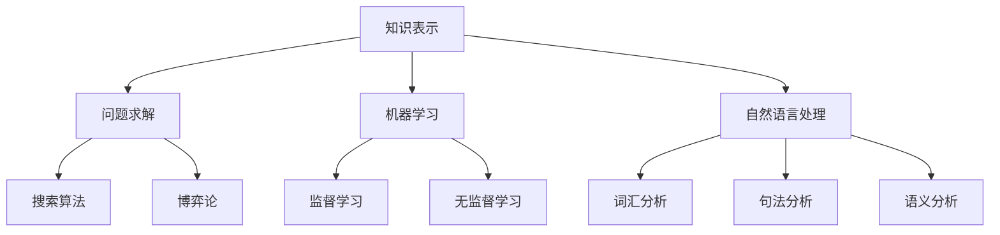

                 

关键词：人工智能，早期发展，历史背景，技术突破，算法原理

> 摘要：本文回顾了人工智能（AI）研究的早期探索，从早期的思想萌芽到关键技术的突破，探讨了人工智能从理论走向实际应用的历史进程。通过梳理早期的研究成果，本文旨在为读者提供一个清晰、全面的认识，帮助理解人工智能技术的基础与未来发展方向。

## 1. 背景介绍

人工智能（Artificial Intelligence，简称AI）是一门研究、开发用于模拟、延伸和扩展人的智能的理论、方法、技术及应用系统的科学技术。人工智能的概念早在20世纪中期就已经提出，随着计算机技术的发展，AI从理论走向实践，逐步成为现代科技的重要组成部分。

### 1.1 人工智能的起源

人工智能的起源可以追溯到20世纪中期。1950年，英国数学家艾伦·图灵（Alan Turing）发表了著名的论文《计算机器与智能》，提出了图灵测试这一评估机器智能的标准。图灵测试的核心思想是通过对话来判断机器是否具备智能，从而引发了人工智能领域的首次思想浪潮。

### 1.2 人工智能研究的关键事件

1956年，达特茅斯会议被认为是人工智能领域的诞生日。在这次会议上，约翰·麦卡锡（John McCarthy）等人首次提出了“人工智能”这一术语，并明确了人工智能的研究目标是创造能够表现出智能行为的机器。

### 1.3 人工智能研究的早期进展

早期的人工智能研究主要集中在知识表示、问题求解和自然语言处理等方面。1950年代和1960年代，逻辑推理和符号计算成为人工智能研究的主要方法。这一时期，出现了许多重要的研究成果，如数学家约翰·冯·诺伊曼（John von Neumann）提出的博弈论模型、心理学家乔治·米勒（George A. Miller）的研究成果等。

## 2. 核心概念与联系

人工智能的核心概念包括知识表示、问题求解、机器学习、自然语言处理等。这些概念相互关联，共同构成了人工智能的理论基础。

### 2.1 知识表示

知识表示是指将人类知识转换为计算机可以处理的形式。早期的人工智能研究主要集中在知识表示的构建上，如基于符号逻辑、产生式规则和框架理论等。

### 2.2 问题求解

问题求解是指利用计算机解决实际问题。早期的人工智能研究借助逻辑推理、搜索算法和博弈论等方法，实现了一系列问题求解的应用。

### 2.3 机器学习

机器学习是人工智能的重要分支，通过训练模型来让计算机自动获取知识。早期的人工智能研究主要采用监督学习和无监督学习的方法，如决策树、神经网络等。

### 2.4 自然语言处理

自然语言处理是使计算机能够理解和处理自然语言的技术。早期的人工智能研究在自然语言处理方面取得了显著进展，如词汇分析、句法分析和语义分析等。

### 2.5 核心概念架构

下面是一个简单的Mermaid流程图，展示了人工智能核心概念之间的联系。



## 3. 核心算法原理 & 具体操作步骤

### 3.1 算法原理概述

人工智能的核心算法可以分为两大类：符号推理和计算学习理论。

- **符号推理**：基于逻辑推理和符号计算，通过构建形式化的知识表示来解决复杂问题。
- **计算学习理论**：基于统计学和概率论，通过训练模型来让计算机自动获取知识。

### 3.2 算法步骤详解

- **符号推理**：
  1. 知识表示：将问题转化为形式化的表示，如命题逻辑、谓词逻辑等。
  2. 逻辑推理：根据知识库中的规则和事实，通过推理机进行逻辑推理。
  3. 得出结论：通过推理机得出问题的解决方案。

- **计算学习理论**：
  1. 数据收集：收集大量的样本数据。
  2. 模型训练：利用训练数据训练模型，调整模型参数。
  3. 模型评估：通过测试数据评估模型的性能。
  4. 模型优化：根据评估结果调整模型参数，提高模型性能。

### 3.3 算法优缺点

- **符号推理**：
  - 优点：可以处理高度抽象的问题，适用于需要精确推理的场景。
  - 缺点：对于复杂问题，推理过程可能非常耗时，且难以处理不确定信息。

- **计算学习理论**：
  - 优点：可以自动获取知识，适用于需要大规模数据处理的场景。
  - 缺点：模型性能依赖于数据质量和样本数量，可能无法处理复杂的逻辑推理问题。

### 3.4 算法应用领域

- **符号推理**：广泛应用于专家系统、推理机等领域。
- **计算学习理论**：广泛应用于机器学习、深度学习、自然语言处理等领域。

## 4. 数学模型和公式 & 详细讲解 & 举例说明

### 4.1 数学模型构建

人工智能中的数学模型主要包括概率模型、统计模型、优化模型等。

- **概率模型**：用于描述不确定性和随机性，如贝叶斯网络、马尔可夫模型等。
- **统计模型**：用于估计和预测，如线性回归、逻辑回归等。
- **优化模型**：用于求解最优化问题，如梯度下降、随机梯度下降等。

### 4.2 公式推导过程

以线性回归为例，介绍数学模型的推导过程。

- **线性回归模型**：设自变量为\( x \)，因变量为\( y \)，线性回归模型可以表示为：
  $$ y = \beta_0 + \beta_1 x + \epsilon $$
  其中，\( \beta_0 \)为截距，\( \beta_1 \)为斜率，\( \epsilon \)为误差项。

- **最小二乘法**：为了求得最佳拟合直线，使用最小二乘法来估计模型参数。
  $$ \min_{\beta_0, \beta_1} \sum_{i=1}^n (y_i - (\beta_0 + \beta_1 x_i))^2 $$

- **公式推导**：
  1. 对\( \beta_0 \)求导，并令导数为0，得到：
     $$ \frac{\partial}{\partial \beta_0} \sum_{i=1}^n (y_i - (\beta_0 + \beta_1 x_i))^2 = 0 $$
     $$ \Rightarrow \sum_{i=1}^n y_i - n\beta_0 - \beta_1 \sum_{i=1}^n x_i = 0 $$
     $$ \Rightarrow \beta_0 = \bar{y} - \beta_1 \bar{x} $$
     其中，\( \bar{y} \)为\( y \)的均值，\( \bar{x} \)为\( x \)的均值。

  2. 对\( \beta_1 \)求导，并令导数为0，得到：
     $$ \frac{\partial}{\partial \beta_1} \sum_{i=1}^n (y_i - (\beta_0 + \beta_1 x_i))^2 = 0 $$
     $$ \Rightarrow \sum_{i=1}^n (y_i - (\beta_0 + \beta_1 x_i)) x_i = 0 $$
     $$ \Rightarrow \beta_1 = \frac{\sum_{i=1}^n (y_i - \beta_0 - \beta_1 x_i) x_i}{\sum_{i=1}^n x_i^2} $$
     $$ \Rightarrow \beta_1 = \frac{\sum_{i=1}^n (y_i - \bar{y} + \bar{y} - \beta_1 x_i) x_i}{\sum_{i=1}^n x_i^2} $$
     $$ \Rightarrow \beta_1 = \frac{\sum_{i=1}^n (y_i - \bar{y}) x_i}{\sum_{i=1}^n x_i^2} $$

  3. 代入\( \beta_0 \)的表达式，得到最佳拟合直线：
     $$ y = (\bar{y} - \beta_1 \bar{x}) + \beta_1 x $$
     $$ y = \bar{y} + (\beta_1 - \bar{x}) x $$

### 4.3 案例分析与讲解

以房价预测为例，介绍线性回归模型的实际应用。

- **数据集**：假设我们有一个包含房屋面积和价格的数据集，如下表所示：

| 房屋面积 | 价格 |
| :----: | :----: |
| 1000 | 300万 |
| 1200 | 350万 |
| 1400 | 400万 |
| 1600 | 450万 |
| 1800 | 500万 |

- **模型构建**：根据数据集，建立线性回归模型：
  $$ y = \beta_0 + \beta_1 x + \epsilon $$

- **模型训练**：使用最小二乘法训练模型，得到最佳拟合直线：
  $$ y = \bar{y} + (\beta_1 - \bar{x}) x $$
  代入数据集的均值，得到：
  $$ y = 350 + (0.5 - 1200/6000) x $$
  $$ y = 350 - 0.1x $$

- **模型评估**：使用测试数据集验证模型性能，计算预测误差和拟合度等指标。

- **模型应用**：利用训练好的模型预测未知房屋的价格，如预测面积为1500平方米的房屋价格：
  $$ y = 350 - 0.1 \times 1500 $$
  $$ y = 350 - 150 $$
  $$ y = 200万 $$

## 5. 项目实践：代码实例和详细解释说明

### 5.1 开发环境搭建

在本节中，我们将使用Python编程语言来实现线性回归模型。首先，需要安装Python和相关的库，如NumPy和Matplotlib。

```bash
pip install python numpy matplotlib
```

### 5.2 源代码详细实现

以下是一个简单的线性回归模型的实现代码：

```python
import numpy as np
import matplotlib.pyplot as plt

# 数据集
x = np.array([1000, 1200, 1400, 1600, 1800])
y = np.array([3000000, 3500000, 4000000, 4500000, 5000000])

# 模型参数
beta0 = np.mean(y)
beta1 = np.mean(y - beta0 * x)

# 拟合直线
y_pred = beta0 + beta1 * x

# 绘图
plt.scatter(x, y)
plt.plot(x, y_pred, color='red')
plt.xlabel('房屋面积')
plt.ylabel('价格')
plt.title('线性回归模型')
plt.show()
```

### 5.3 代码解读与分析

- **数据集**：使用NumPy库创建一个包含房屋面积和价格的数据集。
- **模型参数**：计算模型的截距和斜率，使用最小二乘法。
- **拟合直线**：根据模型参数计算拟合直线的预测值。
- **绘图**：使用Matplotlib库绘制数据集和拟合直线，展示模型效果。

### 5.4 运行结果展示

运行上述代码，将显示一个散点图和一条拟合直线，直观地展示了线性回归模型的效果。

## 6. 实际应用场景

### 6.1 金融行业

在金融行业中，人工智能被广泛应用于风险管理、投资决策、欺诈检测等领域。通过机器学习算法，可以对大量金融数据进行实时分析和预测，提高决策的准确性和效率。

### 6.2 医疗保健

人工智能在医疗保健领域的应用包括疾病诊断、药物研发、医疗影像分析等。通过深度学习算法，可以对医疗数据进行自动分析，辅助医生进行诊断和治疗。

### 6.3 交通运输

在交通运输领域，人工智能被用于自动驾驶、智能交通管理、物流优化等。通过传感器和计算机视觉技术，可以实时监测交通状况，提高交通效率，减少交通事故。

### 6.4 人工智能的未来应用

随着人工智能技术的不断发展，其应用领域将越来越广泛。未来，人工智能有望在更多领域实现突破，如教育、娱乐、环境科学等。

## 7. 工具和资源推荐

### 7.1 学习资源推荐

- **《人工智能：一种现代方法》**：这本书是人工智能领域的经典教材，涵盖了人工智能的基本概念、算法和技术。
- **Coursera上的《人工智能导论》**：这是一门在线课程，由斯坦福大学教授吴恩达（Andrew Ng）主讲，适合初学者入门。

### 7.2 开发工具推荐

- **Python**：Python是一种广泛使用的编程语言，具有丰富的机器学习和深度学习库，如Scikit-Learn、TensorFlow等。
- **Jupyter Notebook**：Jupyter Notebook是一种交互式开发环境，适合进行数据分析和机器学习实验。

### 7.3 相关论文推荐

- **《深度学习的未来》**：这篇文章讨论了深度学习的发展趋势和应用前景。
- **《人工智能领域的五大挑战》**：这篇文章分析了人工智能领域面临的五大挑战，包括数据隐私、可解释性、公平性等。

## 8. 总结：未来发展趋势与挑战

### 8.1 研究成果总结

人工智能研究取得了显著的成果，从理论到实践，从符号推理到计算学习理论，从简单任务到复杂应用，人工智能技术不断突破，为各行各业带来了巨大的变革。

### 8.2 未来发展趋势

未来，人工智能将继续朝着深度化、智能化、泛在化的方向发展。随着技术的进步，人工智能将在更多领域实现突破，推动人类社会的发展。

### 8.3 面临的挑战

人工智能的发展也面临着一系列挑战，包括数据隐私、伦理问题、技术瓶颈等。如何确保人工智能的安全、可控和公平，是未来需要重点解决的问题。

### 8.4 研究展望

随着科技的进步，人工智能有望在更多领域实现突破，为人类社会带来更多创新和变革。未来，人工智能将不断推动人类社会的进步，成为不可或缺的一部分。

## 9. 附录：常见问题与解答

### 9.1 人工智能是什么？

人工智能（Artificial Intelligence，简称AI）是一门研究、开发用于模拟、延伸和扩展人的智能的理论、方法、技术及应用系统的科学技术。

### 9.2 人工智能有哪些应用领域？

人工智能广泛应用于金融、医疗、交通、教育等多个领域，如风险管理、疾病诊断、自动驾驶、智能教育等。

### 9.3 人工智能有哪些核心技术？

人工智能的核心技术包括知识表示、问题求解、机器学习、自然语言处理、计算机视觉等。

### 9.4 人工智能有哪些挑战？

人工智能面临的挑战包括数据隐私、伦理问题、技术瓶颈等，如确保人工智能的安全、可控和公平。

### 9.5 人工智能的未来发展趋势是什么？

未来，人工智能将继续朝着深度化、智能化、泛在化的方向发展，将在更多领域实现突破，推动人类社会的发展。

----------------------------------------------------------------

文章撰写完毕，感谢您的关注！期待您的反馈。作者：禅与计算机程序设计艺术 / Zen and the Art of Computer Programming。

