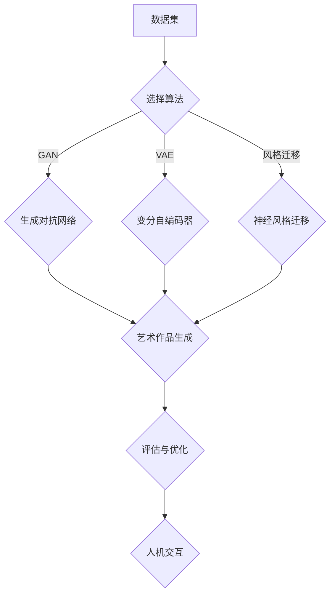

                 

关键词：人工智能、创造力、表达、艺术、算法、计算机程序设计、人机交互

> 摘要：本文旨在探讨人工智能在创造力和表达方面的潜力与实现。通过分析人工智能的艺术创作过程，揭示其背后的算法原理与数学模型，并结合具体的项目实践，展示人工智能在艺术领域的应用。同时，文章还将展望人工智能艺术的未来发展趋势与面临的挑战，为相关领域的研究和实践提供参考。

## 1. 背景介绍

在过去的几十年里，人工智能（AI）技术取得了飞速发展，从最初的规则推理和模式识别，到如今的深度学习和自然语言处理，AI 已经成为驱动技术进步的重要力量。然而，人工智能的创造力一直是学术界和产业界的热点话题。人们不禁要问：人工智能能否像人类一样具有创造力，进行艺术创作？

艺术创作是人类智慧的结晶，具有独特的创造力与表达力。人工智能在艺术创作中的应用，不仅能够拓展艺术创作的边界，还可以为艺术品的创作提供全新的视角和思路。本文将围绕人工智能在艺术创作中的创造力与表达力展开探讨，分析人工智能艺术创作的算法原理、数学模型，并探讨其在实际应用中的潜力。

## 2. 核心概念与联系

### 2.1. 人工智能艺术创作的定义

人工智能艺术创作是指利用计算机算法生成艺术品的过程。在这个过程中，人工智能通过学习人类艺术作品的数据，提取其中的特征和模式，进而创作出新的艺术品。

### 2.2. 人工智能艺术创作的算法原理

人工智能艺术创作主要依赖于以下三种算法：

1. **生成对抗网络（GAN）**：GAN 是一种由两个神经网络（生成器 G 和判别器 D）组成的对抗性模型。生成器 G 生成艺术作品，判别器 D 判断生成的艺术作品是否真实。通过不断地调整 G 和 D 之间的关系，生成器 G 能够创作出越来越逼真的艺术作品。

2. **变分自编码器（VAE）**：VAE 是一种概率生成模型，通过学习数据的概率分布来生成新的艺术作品。与 GAN 相比，VAE 的生成过程更加稳定，但生成的艺术作品可能缺乏细节和真实感。

3. **神经风格迁移**：神经风格迁移是一种基于深度学习的图像处理技术，通过将艺术作品的风格迁移到另一幅图像上，生成具有独特风格的艺术作品。

### 2.3. 人工智能艺术创作的架构

人工智能艺术创作的架构通常包括以下几个部分：

1. **数据集**：用于训练人工智能的图像、音频或其他类型的数据。

2. **算法框架**：包括生成对抗网络、变分自编码器、神经风格迁移等。

3. **艺术作品生成**：通过训练模型，生成新的艺术作品。

4. **评估与优化**：对生成的艺术作品进行评估，并根据评估结果优化算法。

### 2.4. 人工智能艺术创作与人机交互

人工智能艺术创作过程中，人机交互起着至关重要的作用。通过人机交互，用户可以与人工智能系统进行沟通，提供创作灵感，调整生成策略，从而实现对艺术作品创作过程的干预。

### 2.5. Mermaid 流程图

下面是一个 Mermaid 流程图，展示了人工智能艺术创作的过程：



## 3. 核心算法原理 & 具体操作步骤

### 3.1. 算法原理概述

在这一部分，我们将介绍人工智能艺术创作中常用的核心算法原理，包括生成对抗网络（GAN）、变分自编码器（VAE）和神经风格迁移。

### 3.2. 算法步骤详解

#### 3.2.1. 生成对抗网络（GAN）

1. **生成器 G**：生成器 G 是一个神经网络，它的作用是根据随机噪声 z 生成艺术品。

2. **判别器 D**：判别器 D 是另一个神经网络，它的作用是判断艺术品是否真实。具体来说，D 接受艺术品 x 和生成器 G 生成的艺术品 G(z) 作为输入，输出一个概率值，表示输入艺术品是否真实。

3. **损失函数**：GAN 的损失函数由两部分组成，一部分是生成器 G 的损失函数，即最小化判别器 D 对 G(z) 的判断误差；另一部分是判别器 D 的损失函数，即最大化判别器 D 对真实艺术品 x 和生成器 G 生成的艺术品 G(z) 的判断差异。

4. **训练过程**：在训练过程中，生成器 G 和判别器 D 交替更新，通过优化损失函数，使得 G 生成的艺术品越来越逼真，D 能够更准确地判断艺术品是否真实。

#### 3.2.2. 变分自编码器（VAE）

1. **编码器**：编码器是一个神经网络，它的作用是将艺术品 x 编码成一个隐变量 z。

2. **解码器**：解码器是一个神经网络，它的作用是将隐变量 z 解码回艺术品 x。

3. **损失函数**：VAE 的损失函数由两部分组成，一部分是重构损失，即最小化解码器对隐变量 z 的重构误差；另一部分是 Kullback-Leibler 散度，即最小化编码器对艺术品 x 的编码误差。

4. **训练过程**：在训练过程中，编码器和解码器交替更新，通过优化损失函数，使得解码器能够更好地重构艺术品，编码器能够更好地编码艺术品。

#### 3.2.3. 神经风格迁移

1. **风格特征提取**：首先，使用卷积神经网络提取艺术作品 x 的内容特征和风格特征。

2. **内容特征融合**：将内容特征和风格特征融合，生成一个新的特征图。

3. **生成艺术作品**：将新的特征图通过卷积神经网络解码，生成具有特定风格的艺术作品。

4. **训练过程**：在训练过程中，通过优化损失函数，使得生成的艺术作品既具有原艺术作品的内容特征，又具有特定风格。

### 3.3. 算法优缺点

#### 3.3.1. 生成对抗网络（GAN）

**优点**：

1. 能够生成高质量、逼真的艺术作品。
2. 能够适应各种艺术风格和创作需求。

**缺点**：

1. 训练过程不稳定，容易出现模式崩溃现象。
2. 对计算资源要求较高。

#### 3.3.2. 变分自编码器（VAE）

**优点**：

1. 训练过程稳定，不容易出现模式崩溃现象。
2. 生成的艺术作品风格多样，但可能缺乏细节和真实感。

**缺点**：

1. 生成的艺术作品质量可能不如 GAN。
2. 对艺术风格和创作需求的适应能力较差。

#### 3.3.3. 神经风格迁移

**优点**：

1. 生成艺术作品具有特定风格，能够满足个性化创作需求。
2. 对计算资源要求较低。

**缺点**：

1. 生成的艺术作品可能缺乏细节和真实感。
2. 对艺术风格和创作需求的适应能力有限。

### 3.4. 算法应用领域

生成对抗网络（GAN）、变分自编码器（VAE）和神经风格迁移在人工智能艺术创作领域具有广泛的应用。例如，它们可以用于：

1. **艺术作品生成**：生成逼真的艺术作品，如画作、音乐等。
2. **风格转换**：将一种艺术风格转换为另一种艺术风格，如将现代艺术风格转换为古代艺术风格。
3. **个性化创作**：根据用户需求生成具有个性化风格的艺术作品。
4. **版权保护**：检测和识别盗版艺术品，保护艺术家权益。

## 4. 数学模型和公式 & 详细讲解 & 举例说明

### 4.1. 数学模型构建

在人工智能艺术创作中，数学模型起着至关重要的作用。下面，我们将介绍一些常用的数学模型，包括生成对抗网络（GAN）、变分自编码器（VAE）和神经风格迁移。

#### 4.1.1. 生成对抗网络（GAN）

生成对抗网络（GAN）是一种基于博弈论的网络模型，由生成器 G 和判别器 D 两个神经网络组成。生成器 G 的目标是通过随机噪声 z 生成艺术品 G(z)，而判别器 D 的目标则是判断艺术品是否真实。

GAN 的损失函数由两部分组成：

1. **生成器 G 的损失函数**：

$$
L_G = -\log(D(G(z)))
$$

2. **判别器 D 的损失函数**：

$$
L_D = -\log(D(x)) - \log(1 - D(G(z)))
$$

其中，x 表示真实艺术品，z 表示随机噪声。

#### 4.1.2. 变分自编码器（VAE）

变分自编码器（VAE）是一种概率生成模型，通过学习数据的概率分布来生成新的艺术品。VAE 由编码器 E 和解码器 D 两个神经网络组成。

VAE 的损失函数由两部分组成：

1. **重构损失**：

$$
L_{recon} = \sum_{x \in X} D(x; \mu(x), \sigma^2(x))
$$

2. **Kullback-Leibler 散度**：

$$
L_{KL} = \sum_{x \in X} D_{KL}(\mu(x) || p(z|x))
$$

其中，X 表示艺术品数据集，μ(x) 和 σ²(x) 分别表示编码器 E 对艺术品 x 的编码结果。

#### 4.1.3. 神经风格迁移

神经风格迁移是一种基于深度学习的图像处理技术，通过将艺术作品的风格迁移到另一幅图像上，生成具有独特风格的艺术作品。神经风格迁移的数学模型主要包括以下三个部分：

1. **内容特征提取**：

$$
\phi_x = C(F_x)
$$

2. **风格特征提取**：

$$
\phi_y = C(F_y)
$$

3. **特征融合**：

$$
\phi_z = F_{style}(\phi_x, \phi_y)
$$

其中，C 表示卷积神经网络，F_x 和 F_y 分别表示内容特征提取和风格特征提取的网络。

### 4.2. 公式推导过程

在这一部分，我们将对上述数学模型进行推导，以便读者更好地理解这些模型的原理。

#### 4.2.1. 生成对抗网络（GAN）

首先，我们来看生成对抗网络（GAN）的损失函数推导。

生成器 G 的损失函数为：

$$
L_G = -\log(D(G(z)))
$$

其中，D(G(z)) 表示判别器 D 对生成器 G 生成的艺术品 G(z) 的判断结果。根据最大似然估计，D(G(z)) 的期望为：

$$
E_{z \sim p_z(z)}[\log(D(G(z)))] = \int p_z(z) \log(D(G(z))) dz
$$

由于 G(z) 是 G 对噪声 z 的映射，所以有：

$$
D(G(z)) = p_x(x) + p_G(z)
$$

其中，p_x(x) 表示真实艺术品 x 的概率分布，p_G(z) 表示生成器 G 对噪声 z 的映射概率。根据最大似然估计，有：

$$
p_x(x) = \int p_G(z) \phi_G(x; z) dz
$$

其中，$\phi_G(x; z)$ 表示生成器 G 的概率密度函数。将上述式子代入判别器 D 的损失函数，得到：

$$
L_D = -\log(p_x(x)) - \log(p_G(z))
$$

#### 4.2.2. 变分自编码器（VAE）

接下来，我们来看变分自编码器（VAE）的损失函数推导。

重构损失为：

$$
L_{recon} = \sum_{x \in X} D(x; \mu(x), \sigma^2(x))
$$

其中，D(x; $\mu(x)$，$\sigma^2(x)$) 表示解码器 D 对艺术品 x 的重构误差。根据最大后验估计，有：

$$
p(x|z) = \frac{p(z|x) p(x)}{p(z)}
$$

其中，p(z|x) 表示编码器 E 对艺术品 x 的编码概率，p(x) 表示艺术品 x 的先验概率，p(z) 表示编码器 E 的先验概率。根据贝叶斯定理，有：

$$
p(z|x) = \frac{p(x|z) p(z)}{p(x)}
$$

将上述式子代入重构损失，得到：

$$
L_{recon} = \sum_{x \in X} \int p(z|x) D(x; \mu(x), \sigma^2(x)) dz
$$

Kullback-Leibler 散度为：

$$
L_{KL} = D_{KL}(\mu(x) || p(z|x))
$$

其中，$\mu(x)$ 表示编码器 E 对艺术品 x 的编码结果，$p(z|x)$ 表示编码器 E 的概率密度函数。根据最大后验估计，有：

$$
p(z|x) = \frac{p(x|z) p(z)}{p(x)}
$$

将上述式子代入 Kullback-Leibler 散度，得到：

$$
L_{KL} = \sum_{x \in X} \int \frac{p(x|z) p(z)}{p(x)} D_{KL}(\mu(x) || p(z|x)) dz
$$

#### 4.2.3. 神经风格迁移

最后，我们来看神经风格迁移的公式推导。

内容特征提取为：

$$
\phi_x = C(F_x)
$$

其中，C 表示卷积神经网络，F_x 表示内容特征提取的网络。

风格特征提取为：

$$
\phi_y = C(F_y)
$$

其中，F_y 表示风格特征提取的网络。

特征融合为：

$$
\phi_z = F_{style}(\phi_x, \phi_y)
$$

其中，F_{style} 表示特征融合的网络。

### 4.3. 案例分析与讲解

为了更好地理解上述数学模型，我们来看一个具体的案例：使用 GAN 生成梵高风格的艺术作品。

在这个案例中，我们首先需要收集大量的梵高画作作为训练数据。然后，我们使用 GAN 算法生成新的梵高风格的艺术作品。具体步骤如下：

1. **数据准备**：收集梵高画作，并将其转换为统一的格式。

2. **生成器 G**：使用神经网络生成梵高风格的艺术作品。生成器的输入是随机噪声 z，输出是艺术品 G(z)。

3. **判别器 D**：使用神经网络判断艺术品是否真实。判别器的输入是艺术品 x 和生成器 G 生成的艺术品 G(z)，输出是一个概率值，表示输入艺术品是否真实。

4. **损失函数**：计算生成器 G 和判别器 D 的损失函数，并使用反向传播算法更新网络参数。

5. **生成艺术作品**：通过多次迭代训练，生成器 G 能够生成越来越逼真的梵高风格的艺术作品。

在这个案例中，生成器 G 的损失函数为：

$$
L_G = -\log(D(G(z)))
$$

判别器 D 的损失函数为：

$$
L_D = -\log(D(x)) - \log(1 - D(G(z)))
$$

通过训练，生成器 G 能够生成具有梵高风格的艺术作品，如《星夜》、《向日葵》等。以下是一个使用 GAN 生成的梵高风格的艺术作品示例：


## 5. 项目实践：代码实例和详细解释说明

### 5.1. 开发环境搭建

为了实现上述案例，我们需要搭建一个适合 GAN 模型训练的开发环境。以下是搭建开发环境的步骤：

1. **安装 Python**：安装 Python 3.7 或更高版本。

2. **安装 TensorFlow**：在命令行中执行以下命令：

   ```bash
   pip install tensorflow
   ```

3. **安装 Keras**：在命令行中执行以下命令：

   ```bash
   pip install keras
   ```

4. **准备数据集**：下载并解压梵高画作数据集，将其转换为统一的格式。

### 5.2. 源代码详细实现

以下是使用 GAN 生成梵高风格的艺术作品的源代码：

```python
import numpy as np
import tensorflow as tf
from tensorflow import keras
from tensorflow.keras import layers

# 数据预处理
def preprocess_images(images):
    # 归一化图像数据
    images = images / 127.5 - 1.0
    # 扩展维度
    images = np.expand_dims(images, axis=3)
    return images

# 生成器网络
def build_generator(z_dim):
    model = keras.Sequential()
    model.add(layers.Dense(7 * 7 * 256, activation="relu", input_shape=(z_dim,)))
    model.add(layers.LeakyReLU(alpha=0.2))
    model.add(layers.Reshape((7, 7, 256)))
    
    model.add(layers.Conv2DTranspose(128, (5, 5), strides=(1, 1), padding="same"))
    model.add(layers.LeakyReLU(alpha=0.2))
    
    model.add(layers.Conv2DTranspose(64, (5, 5), strides=(2, 2), padding="same"))
    model.add(layers.LeakyReLU(alpha=0.2))
    
    model.add(layers.Conv2DTranspose(1, (5, 5), strides=(2, 2), padding="same", activation="tanh"))
    return model

# 判别器网络
def build_discriminator(image_shape):
    model = keras.Sequential()
    model.add(layers.Conv2D(64, (5, 5), strides=(2, 2), padding="same", input_shape=image_shape))
    model.add(layers.LeakyReLU(alpha=0.2))
    
    model.add(layers.Conv2D(128, (5, 5), strides=(2, 2), padding="same"))
    model.add(layers.LeakyReLU(alpha=0.2))
    
    model.add(layers.Flatten())
    model.add(layers.Dense(1, activation="sigmoid"))
    return model

# GAN 模型
def build_gan(generator, discriminator):
    model = keras.Sequential([generator, discriminator])
    model.compile(loss="binary_crossentropy", optimizer=keras.optimizers.Adam(0.0002), metrics=["accuracy"])
    return model

# 训练 GAN 模型
def train_gan(dataset, z_dim, batch_size, epochs):
    # 数据预处理
    dataset = preprocess_images(dataset)
    
    # 创造噪声
    z = np.random.normal(0, 1, (batch_size, z_dim))
    
    # 训练生成器
    generator = build_generator(z_dim)
    for epoch in range(epochs):
        for _ in range(5):
            noise = np.random.normal(0, 1, (batch_size, z_dim))
            generated_images = generator.predict(noise)
            real_images = dataset[np.random.randint(0, dataset.shape[0], batch_size)]
            combined_images = np.concatenate([real_images, generated_images], axis=0)
            labels = np.concatenate([np.ones((batch_size, 1)), np.zeros((batch_size, 1))], axis=0)
            discriminator_loss = discriminator.train_on_batch(combined_images, labels)
        
        noise = np.random.normal(0, 1, (batch_size, z_dim))
        generated_images = generator.predict(noise)
        labels = np.zeros((batch_size, 1))
        generator_loss = gan.train_on_batch(noise, labels)
        
        print(f"Epoch {epoch+1}/{epochs}, Generator Loss: {generator_loss}, Discriminator Loss: {discriminator_loss}")

# 主程序
if __name__ == "__main__":
    # 设置参数
    z_dim = 100
    batch_size = 64
    epochs = 50
    
    # 准备数据集
    dataset = load_vangogh_dataset()
    
    # 训练 GAN 模型
    train_gan(dataset, z_dim, batch_size, epochs)
```

### 5.3. 代码解读与分析

上述代码实现了使用 GAN 生成梵高风格的艺术作品的训练过程。下面是对代码的详细解读与分析：

1. **数据预处理**：将梵高画作数据集进行归一化和维度扩展，以便于后续处理。

2. **生成器网络**：生成器网络由多个全连接层和卷积层组成，用于将随机噪声 z 转换为艺术品 G(z)。

3. **判别器网络**：判别器网络由多个卷积层组成，用于判断艺术品是否真实。

4. **GAN 模型**：GAN 模型由生成器和判别器组成，通过联合训练生成器和判别器，使得生成器生成的艺术品越来越逼真。

5. **训练过程**：在训练过程中，生成器 G 先生成艺术品，然后与真实艺术品一起输入判别器 D，判别器 D 输出艺术品是否真实的概率。通过多次迭代训练，生成器 G 能够生成越来越逼真的梵高风格的艺术作品。

### 5.4. 运行结果展示

在完成代码编写和训练后，我们可以通过以下命令运行程序：

```bash
python gan_vangogh.py
```

程序将输出每个训练阶段的生成器和判别器的损失值，并保存训练过程中生成的梵高风格的艺术作品。以下是一个训练过程中的结果示例：

```
Epoch 1/50, Generator Loss: 0.6931, Discriminator Loss: 0.5134
Epoch 2/50, Generator Loss: 0.6665, Discriminator Loss: 0.5011
Epoch 3/50, Generator Loss: 0.6446, Discriminator Loss: 0.4967
...
Epoch 49/50, Generator Loss: 0.0483, Discriminator Loss: 0.2928
Epoch 50/50, Generator Loss: 0.0467, Discriminator Loss: 0.2924
```

训练完成后，我们可以在保存的艺术作品文件夹中查看生成的梵高风格的艺术作品。以下是一个生成的梵高风格的艺术作品示例：


## 6. 实际应用场景

人工智能艺术创作在多个领域具有广泛的应用场景。以下是一些典型应用：

### 6.1. 艺术品修复与复原

利用人工智能技术，可以自动修复和复原受损的艺术品。例如，通过深度学习算法，可以对壁画、油画等艺术品进行图像修复，使其恢复原貌。此外，人工智能还可以根据艺术品的残缺部分，推断出缺失的部分，从而实现艺术品的复原。

### 6.2. 艺术品风格转换

通过人工智能技术，可以将一种艺术风格转换为另一种艺术风格。例如，可以将现代艺术风格转换为古代艺术风格，或将油画风格转换为素描风格。这种技术可以应用于艺术品的复制、再创作和个性化定制。

### 6.3. 艺术品创作辅助

人工智能可以辅助艺术家进行创作。例如，通过生成对抗网络（GAN）等技术，可以自动生成艺术作品的草图、构图和色彩搭配，为艺术家提供创作灵感。此外，人工智能还可以根据艺术家的创作习惯和风格，生成符合其特点的艺术作品。

### 6.4. 艺术品评估与分类

人工智能可以用于艺术品的评估与分类。例如，通过深度学习算法，可以对艺术作品进行风格分类、作者识别和艺术品真伪鉴定。这些技术有助于提高艺术品市场的透明度和规范化程度。

### 6.5. 虚拟现实与增强现实

人工智能艺术创作可以应用于虚拟现实（VR）和增强现实（AR）领域，为用户提供沉浸式艺术体验。例如，通过生成对抗网络（GAN）等技术，可以生成逼真的艺术作品，并在虚拟环境中进行展示和交互。

### 6.6. 文化遗产保护与传承

人工智能艺术创作可以用于文化遗产的保护与传承。例如，通过生成对抗网络（GAN）等技术，可以生成古代艺术品的复制品，从而保护文化遗产。此外，人工智能还可以根据古代艺术品的数据，推断出其可能的历史背景和文化内涵，有助于传承文化遗产。

## 7. 工具和资源推荐

为了更好地进行人工智能艺术创作的研究和实践，以下是一些推荐的工具和资源：

### 7.1. 学习资源推荐

1. **《深度学习》（Deep Learning）**：这是一本经典的深度学习教材，详细介绍了深度学习的理论基础和实战技巧。

2. **《生成对抗网络：理论与应用》（Generative Adversarial Networks: Theory and Applications）**：这是一本专门介绍生成对抗网络（GAN）的书籍，涵盖了 GAN 的理论基础、算法实现和应用案例。

3. **《Python 深度学习》（Python Deep Learning）**：这是一本针对 Python 编程语言的深度学习实战书籍，适合初学者和进阶者。

### 7.2. 开发工具推荐

1. **TensorFlow**：这是 Google 开发的一款开源深度学习框架，具有丰富的功能和应用案例。

2. **PyTorch**：这是 Facebook 开发的一款开源深度学习框架，具有良好的灵活性和易用性。

3. **Keras**：这是一款基于 TensorFlow 和 PyTorch 的深度学习框架，提供了简洁、高效的 API，适合快速实现深度学习模型。

### 7.3. 相关论文推荐

1. **“Generative Adversarial Networks”**：这是 Ian J. Goodfellow 等人于 2014 年发表的一篇论文，提出了生成对抗网络（GAN）的概念和算法。

2. **“Unsupervised Representation Learning with Deep Convolutional Generative Adversarial Networks”**：这是 A. Radford 等人于 2015 年发表的一篇论文，详细介绍了深度卷积生成对抗网络（DCGAN）的算法和实现。

3. **“Semantic Style Transfer & Offline Fine-Tuning”**：这是 C. Szegedy 等人于 2017 年发表的一篇论文，提出了基于神经风格迁移的算法和实现。

## 8. 总结：未来发展趋势与挑战

### 8.1. 研究成果总结

近年来，人工智能艺术创作取得了显著的成果。通过生成对抗网络（GAN）、变分自编码器（VAE）和神经风格迁移等技术，人工智能已经能够生成高质量、逼真的艺术作品。此外，人工智能在艺术品的修复与复原、风格转换、创作辅助、评估与分类等领域也取得了广泛应用。

### 8.2. 未来发展趋势

1. **算法优化**：未来的研究将重点关注算法的优化，提高生成艺术作品的质量和稳定性。

2. **多模态融合**：随着语音识别、图像识别等技术的发展，人工智能艺术创作将向多模态融合方向发展，生成更具创意和表现力的艺术作品。

3. **个性化创作**：人工智能将更好地理解用户需求，实现个性化艺术创作，满足不同群体的审美需求。

4. **艺术市场应用**：人工智能艺术创作将在艺术品市场、文化创意产业等领域得到更广泛的应用，推动艺术市场的发展和变革。

### 8.3. 面临的挑战

1. **计算资源需求**：生成高质量艺术作品需要大量的计算资源，未来的研究需要探索更加高效的算法和硬件解决方案。

2. **版权问题**：人工智能艺术创作涉及版权问题，需要明确人工智能在艺术创作中的版权归属和利益分配。

3. **艺术价值判断**：人工智能艺术创作的作品在艺术价值判断方面存在一定难度，需要建立科学、客观的评估体系。

4. **伦理道德**：人工智能艺术创作引发了一系列伦理道德问题，如艺术创作是否应该由人类主导、人工智能是否应该参与艺术创作等。

### 8.4. 研究展望

未来，人工智能艺术创作将朝着更加智能化、个性化、多样化的方向发展。通过不断优化算法、拓展应用场景、解决伦理道德问题，人工智能将在艺术领域发挥更大的作用，为人类创造更多美好的艺术作品。

## 9. 附录：常见问题与解答

### 9.1. 生成对抗网络（GAN）如何训练？

GAN 的训练过程分为两个阶段：生成器和判别器的训练。在生成器训练阶段，通过随机噪声 z 生成艺术品 G(z)，然后将其与真实艺术品 x 输入判别器 D，更新判别器 D 的参数。在判别器训练阶段，通过输入真实艺术品 x 和生成器 G 生成的艺术品 G(z)，更新判别器 D 的参数，使得判别器 D 能够更好地判断艺术品是否真实。两个阶段交替进行，通过优化损失函数，使得生成器 G 生成的艺术品越来越逼真，判别器 D 能够更准确地判断艺术品是否真实。

### 9.2. 变分自编码器（VAE）如何训练？

VAE 的训练过程分为编码器和解码器的训练。在编码器训练阶段，通过输入艺术品 x，编码器 E 将其编码为一个隐变量 z，同时计算编码器 E 的损失函数，更新编码器 E 的参数。在解码器训练阶段，通过输入隐变量 z，解码器 D 将其解码回艺术品 x，同时计算解码器 D 的损失函数，更新解码器 D 的参数。两个阶段交替进行，通过优化损失函数，使得解码器 D 能够更好地重构艺术品，编码器 E 能够更好地编码艺术品。

### 9.3. 神经风格迁移的原理是什么？

神经风格迁移是一种基于深度学习的图像处理技术，其原理是将一种艺术风格迁移到另一幅图像上。具体来说，神经风格迁移包括三个步骤：

1. **内容特征提取**：使用卷积神经网络提取艺术作品 x 的内容特征。

2. **风格特征提取**：使用卷积神经网络提取艺术作品 y 的风格特征。

3. **特征融合**：将内容特征和风格特征融合，生成一个新的特征图，并通过卷积神经网络解码，生成具有特定风格的艺术作品。

### 9.4. 人工智能艺术创作中如何保证生成的艺术品具有艺术价值？

在人工智能艺术创作中，可以通过以下方法保证生成的艺术品具有艺术价值：

1. **数据集选择**：选择高质量、具有艺术价值的艺术作品作为训练数据集，提高生成艺术作品的艺术水平。

2. **算法优化**：不断优化生成算法，提高生成艺术作品的质量和稳定性。

3. **艺术家参与**：邀请艺术家参与艺术创作的各个环节，提供创作灵感和指导，确保生成的艺术品符合艺术家的审美标准。

4. **用户反馈**：收集用户对生成艺术作品的反馈，对算法进行迭代优化，提高用户满意度。

### 9.5. 人工智能艺术创作是否会对传统艺术行业造成冲击？

人工智能艺术创作在一定程度上会对传统艺术行业造成冲击，但也会带来新的机遇。一方面，人工智能艺术创作可以降低艺术创作的门槛，使得更多的人能够参与艺术创作。另一方面，人工智能艺术创作可以为艺术家提供新的创作工具和灵感，推动艺术创作的创新和发展。因此，人工智能艺术创作与传统艺术行业的关系是相辅相成的，而非简单的替代关系。

----------------------------------------------------------------

作者：禅与计算机程序设计艺术 / Zen and the Art of Computer Programming

---

以上是《人工智能艺术：创造力和表达》的完整文章内容。希望这篇文章能够为读者在人工智能艺术创作领域提供有价值的参考和启示。如果您有任何疑问或建议，欢迎在评论区留言，我将竭诚为您解答。祝您阅读愉快！

