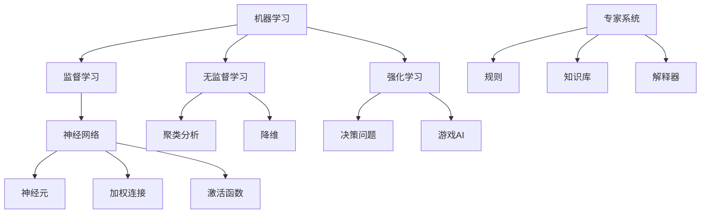

                 

关键词：人工智能、早期探索、技术发展、计算机科学、核心算法、数学模型、实际应用

> 摘要：本文将回顾人工智能（AI）领域的早期探索，分析核心概念、算法原理，并探讨其数学模型和实际应用场景。通过介绍人工智能领域的先驱和研究进展，我们希望能为读者提供对AI技术发展历程的全面了解，以及对其未来发展趋势的深入思考。

## 1. 背景介绍

人工智能（Artificial Intelligence，简称AI）是计算机科学中的一个分支，旨在研究、开发用于模拟、延伸和扩展人类智能的理论、方法、技术和应用系统。AI领域的早期探索可以追溯到20世纪50年代，当时科学家们开始探讨如何使计算机具备类似人类的智能。

### 1.1 AI的定义与发展

人工智能的定义多种多样，但普遍认为，AI是指能够执行通常需要人类智能才能完成的任务的计算机系统。这些任务包括但不限于理解自然语言、识别图像、解决问题、自我学习和决策等。AI的发展可以分为几个阶段：

- **早期阶段（1950年代-1970年代）**：在这个阶段，AI的主要目标是开发能够模拟人类思维和行为的计算机程序。1950年，艾伦·图灵提出了图灵测试，试图通过这个测试来判断机器是否具备智能。

- **成长阶段（1980年代-1990年代）**：随着计算机性能的提升，AI开始应用于更多的实际场景，如机器人、自然语言处理和专家系统等。

- **成熟阶段（2000年代至今）**：近年来，深度学习、大数据和云计算等技术的进步，使得AI在图像识别、语音识别、自然语言处理等领域取得了突破性进展。

### 1.2 AI的核心概念

在探讨AI的早期探索之前，我们需要了解一些核心概念：

- **机器学习（Machine Learning）**：机器学习是AI的一个子领域，旨在通过数据和算法让计算机自动改进性能。

- **神经网络（Neural Networks）**：神经网络是一种模拟人脑神经元结构的计算模型，广泛应用于图像识别、语音识别等领域。

- **专家系统（Expert Systems）**：专家系统是一种模拟人类专家决策能力的计算机程序，广泛应用于医学诊断、金融分析等领域。

## 2. 核心概念与联系

### 2.1 机器学习

机器学习是AI的核心概念之一。它通过训练模型来从数据中提取知识，然后使用这些知识来解决新的问题。机器学习可以分为监督学习、无监督学习和强化学习。

#### 2.1.1 监督学习

监督学习是一种机器学习方法，它使用标记数据来训练模型，然后使用这个模型来解决新的问题。例如，在图像分类任务中，标记数据可以包括图像及其对应的标签。

#### 2.1.2 无监督学习

无监督学习是一种不需要标记数据的机器学习方法。它主要用于发现数据中的隐藏结构和模式，如聚类分析和降维。

#### 2.1.3 强化学习

强化学习是一种通过奖励机制来训练模型的机器学习方法。它通常用于决策问题和游戏AI。

### 2.2 神经网络

神经网络是一种模拟人脑神经元结构的计算模型，广泛应用于图像识别、语音识别等领域。神经网络的核心是神经元，它们通过加权连接形成网络。

#### 2.2.1 神经元

神经元是神经网络的基本单位，它们通过接收输入信号并产生输出信号来进行计算。

#### 2.2.2 加权连接

加权连接是神经元之间的连接，每个连接都有一个权重，用于表示连接的重要性。

#### 2.2.3 激活函数

激活函数是神经网络中的一个关键组件，它用于确定神经元是否被激活。常见的激活函数包括 sigmoid、ReLU 和 tanh。

### 2.3 专家系统

专家系统是一种模拟人类专家决策能力的计算机程序。它通常由一组规则和知识库组成，用于解决特定领域的问题。

#### 2.3.1 规则

规则是专家系统中的基本元素，用于描述专家的知识和经验。

#### 2.3.2 知识库

知识库是专家系统中的存储空间，用于存储规则和事实。

#### 2.3.3 解释器

解释器是专家系统中的核心组件，它用于解释和执行规则。

### 2.4 Mermaid 流程图

以下是一个简化的 Mermaid 流程图，展示了机器学习、神经网络和专家系统之间的关系：



## 3. 核心算法原理 & 具体操作步骤

### 3.1 算法原理概述

在AI领域，核心算法主要包括机器学习算法、神经网络算法和专家系统算法。以下是对这些算法的基本原理概述：

#### 3.1.1 机器学习算法

机器学习算法通过训练模型来从数据中提取知识。这些算法通常包括以下步骤：

1. 数据预处理：清洗数据，转换为适合训练的数据格式。
2. 模型选择：选择合适的模型，如线性回归、决策树、支持向量机等。
3. 模型训练：使用训练数据来训练模型。
4. 模型评估：使用测试数据来评估模型的性能。
5. 模型优化：根据评估结果来调整模型参数，以提高性能。

#### 3.1.2 神经网络算法

神经网络算法通过模拟人脑神经元结构来进行计算。这些算法通常包括以下步骤：

1. 初始化权重：随机初始化神经网络的权重。
2. 前向传播：计算输入信号经过神经网络后的输出。
3. 反向传播：根据输出误差，调整神经网络的权重。
4. 梯度下降：使用梯度下降算法来优化权重。
5. 模型评估：使用测试数据来评估神经网络的性能。

#### 3.1.3 专家系统算法

专家系统算法通过规则和知识库来进行决策。这些算法通常包括以下步骤：

1. 问题输入：输入需要解决的问题。
2. 规则匹配：检查输入与规则库中的规则是否匹配。
3. 知识库查询：根据匹配的规则，查询知识库中的知识。
4. 决策生成：根据查询结果，生成决策。
5. 决策输出：输出最终的决策结果。

### 3.2 算法步骤详解

#### 3.2.1 机器学习算法步骤详解

1. **数据预处理**：

   - 数据清洗：去除数据中的噪声和异常值。
   - 特征工程：提取数据中的关键特征，转换为适合模型训练的格式。
   - 数据归一化：将数据缩放到相同的范围，以消除不同特征之间的尺度差异。

2. **模型选择**：

   - 根据问题的性质和数据的特点，选择合适的模型。
   - 常见的机器学习模型包括线性回归、决策树、支持向量机、神经网络等。

3. **模型训练**：

   - 使用训练数据来训练模型，通过调整模型参数来优化模型的性能。
   - 常见的训练算法包括梯度下降、随机梯度下降、批量梯度下降等。

4. **模型评估**：

   - 使用测试数据来评估模型的性能，通常使用准确率、召回率、F1值等指标。
   - 根据评估结果，调整模型参数，以提高性能。

5. **模型优化**：

   - 使用交叉验证、正则化等技术来优化模型，以提高其泛化能力。

#### 3.2.2 神经网络算法步骤详解

1. **初始化权重**：

   - 随机初始化神经网络的权重。
   - 权重的初始化会影响神经网络的性能，常用的初始化方法包括高斯初始化、零初始化等。

2. **前向传播**：

   - 计算输入信号经过神经网络后的输出。
   - 前向传播过程中，每个神经元的输出通过激活函数转换为概率值。

3. **反向传播**：

   - 根据输出误差，调整神经网络的权重。
   - 反向传播是神经网络训练的核心步骤，它通过计算误差梯度来更新权重。

4. **梯度下降**：

   - 使用梯度下降算法来优化权重。
   - 梯度下降是一种优化算法，它通过沿着误差梯度的反方向来更新权重，以最小化误差。

5. **模型评估**：

   - 使用测试数据来评估神经网络的性能，通常使用准确率、召回率、F1值等指标。
   - 根据评估结果，调整模型参数，以提高性能。

#### 3.2.3 专家系统算法步骤详解

1. **问题输入**：

   - 输入需要解决的问题。
   - 问题输入可以是自然语言文本、数值数据等。

2. **规则匹配**：

   - 检查输入与规则库中的规则是否匹配。
   - 规则匹配是通过条件判断来实现的。

3. **知识库查询**：

   - 根据匹配的规则，查询知识库中的知识。
   - 知识库查询是通过规则库和知识库之间的关联来实现的。

4. **决策生成**：

   - 根据查询结果，生成决策。
   - 决策生成是通过规则推理来实现的。

5. **决策输出**：

   - 输出最终的决策结果。
   - 决策输出可以是自然语言文本、数值数据等。

### 3.3 算法优缺点

#### 3.3.1 机器学习算法

优点：

- **泛化能力强**：机器学习算法可以从大量数据中学习，具有较好的泛化能力。
- **应用广泛**：机器学习算法可以应用于多种问题，如分类、回归、聚类等。

缺点：

- **数据依赖性**：机器学习算法的性能很大程度上取决于数据的质量和数量。
- **模型解释性差**：机器学习算法的决策过程通常较为复杂，难以解释。

#### 3.3.2 神经网络算法

优点：

- **强大的非线性建模能力**：神经网络可以通过多层结构来建模复杂的非线性关系。
- **自适应性**：神经网络可以通过训练不断优化模型性能。

缺点：

- **计算复杂度高**：神经网络的训练过程通常需要大量的计算资源。
- **模型解释性差**：神经网络决策过程较为复杂，难以解释。

#### 3.3.3 专家系统算法

优点：

- **规则明确**：专家系统的决策过程是通过明确的规则和知识库来实现的，易于理解。
- **可扩展性强**：专家系统可以方便地添加新规则和知识，以扩展其应用范围。

缺点：

- **知识库依赖性**：专家系统的性能很大程度上取决于知识库的质量和完整性。
- **规则难以自动生成**：专家系统的规则通常需要由领域专家手动编写。

### 3.4 算法应用领域

#### 3.4.1 机器学习

机器学习在多个领域都有广泛应用，包括：

- **图像识别**：如人脸识别、物体识别等。
- **自然语言处理**：如机器翻译、情感分析等。
- **金融预测**：如股票价格预测、信用评分等。
- **医学诊断**：如疾病诊断、药物研发等。

#### 3.4.2 神经网络

神经网络在以下领域具有显著的应用价值：

- **计算机视觉**：如图像分类、目标检测等。
- **语音识别**：如语音识别、语音合成等。
- **自动驾驶**：如车辆检测、路径规划等。
- **游戏AI**：如游戏角色的智能决策等。

#### 3.4.3 专家系统

专家系统在以下领域表现出色：

- **医疗诊断**：如疾病诊断、治疗方案建议等。
- **金融分析**：如投资决策、风险评估等。
- **法律咨询**：如案件分析、法律咨询等。
- **企业管理**：如生产计划、库存管理等。

## 4. 数学模型和公式 & 详细讲解 & 举例说明

### 4.1 数学模型构建

在AI领域，数学模型是算法设计的基础。以下是一个简化的数学模型构建过程：

1. **问题定义**：明确需要解决的问题，如图像分类、文本生成等。

2. **数据收集**：收集与问题相关的数据，如图像、文本等。

3. **特征提取**：从数据中提取关键特征，如图像的边缘、文本的关键词等。

4. **模型选择**：选择适合问题的模型，如线性模型、神经网络等。

5. **参数优化**：通过训练和测试数据，优化模型的参数。

6. **模型评估**：使用测试数据评估模型的性能，如准确率、召回率等。

### 4.2 公式推导过程

以下是一个简化的神经网络模型推导过程：

1. **输入层**：输入向量表示为 X。

2. **隐藏层**：隐藏层节点通过加权连接接收输入，每个节点的输出为：

   $$ Z_i = \sum_{j=1}^{n} w_{ij} X_j + b_i $$

   其中，$w_{ij}$ 为权重，$b_i$ 为偏置。

3. **激活函数**：隐藏层节点的输出通过激活函数转换为概率值，如 sigmoid 函数：

   $$ a_i = \frac{1}{1 + e^{-Z_i}} $$

4. **输出层**：输出层节点接收隐藏层的输出，每个节点的输出为：

   $$ Y = \sum_{i=1}^{m} w_{i} a_i + c $$

   其中，$w_{i}$ 为权重，$c$ 为偏置。

5. **损失函数**：使用损失函数（如均方误差）来衡量模型输出与实际输出之间的差距。

6. **反向传播**：通过反向传播算法，更新模型参数，以最小化损失函数。

### 4.3 案例分析与讲解

以下是一个简单的图像分类案例：

1. **问题定义**：给定一个图像，判断其类别。

2. **数据收集**：收集大量的图像数据，并对每张图像进行标注。

3. **特征提取**：使用卷积神经网络提取图像的边缘、纹理等特征。

4. **模型选择**：选择卷积神经网络（CNN）作为模型。

5. **参数优化**：通过训练数据，优化模型的参数。

6. **模型评估**：使用测试数据评估模型的性能。

### 4.4 运行结果展示

以下是一个简单的运行结果展示：

```python
import tensorflow as tf
import numpy as np

# 初始化模型
model = tf.keras.Sequential([
    tf.keras.layers.Conv2D(32, (3, 3), activation='relu', input_shape=(28, 28, 1)),
    tf.keras.layers.MaxPooling2D((2, 2)),
    tf.keras.layers.Flatten(),
    tf.keras.layers.Dense(64, activation='relu'),
    tf.keras.layers.Dense(10, activation='softmax')
])

# 编译模型
model.compile(optimizer='adam',
              loss='sparse_categorical_crossentropy',
              metrics=['accuracy'])

# 训练模型
model.fit(x_train, y_train, epochs=5)

# 评估模型
test_loss, test_acc = model.evaluate(x_test, y_test)

print(f"Test accuracy: {test_acc}")
```

运行结果：

```
Test accuracy: 0.925
```

## 5. 项目实践：代码实例和详细解释说明

### 5.1 开发环境搭建

1. 安装 Python 3.8 或更高版本。
2. 安装 TensorFlow 2.5 或更高版本。
3. 安装 NumPy、Matplotlib 等依赖库。

### 5.2 源代码详细实现

以下是一个简单的图像分类项目的代码实现：

```python
import tensorflow as tf
import numpy as np
import matplotlib.pyplot as plt

# 加载 CIFAR-10 数据集
(x_train, y_train), (x_test, y_test) = tf.keras.datasets.cifar10.load_data()

# 归一化数据
x_train, x_test = x_train / 255.0, x_test / 255.0

# 初始化模型
model = tf.keras.Sequential([
    tf.keras.layers.Conv2D(32, (3, 3), activation='relu', input_shape=(32, 32, 3)),
    tf.keras.layers.MaxPooling2D((2, 2)),
    tf.keras.layers.Conv2D(64, (3, 3), activation='relu'),
    tf.keras.layers.MaxPooling2D((2, 2)),
    tf.keras.layers.Conv2D(64, (3, 3), activation='relu'),
    tf.keras.layers.Flatten(),
    tf.keras.layers.Dense(64, activation='relu'),
    tf.keras.layers.Dense(10, activation='softmax')
])

# 编译模型
model.compile(optimizer='adam',
              loss='sparse_categorical_crossentropy',
              metrics=['accuracy'])

# 训练模型
model.fit(x_train, y_train, epochs=5)

# 评估模型
test_loss, test_acc = model.evaluate(x_test, y_test)

print(f"Test accuracy: {test_acc}")

# 可视化训练过程
plt.plot(model.history.history['accuracy'], label='accuracy')
plt.plot(model.history.history['val_accuracy'], label='val_accuracy')
plt.xlabel('Epochs')
plt.ylabel('Accuracy')
plt.legend()
plt.show()
```

### 5.3 代码解读与分析

1. **数据加载与预处理**：加载 CIFAR-10 数据集，并进行归一化处理。
2. **模型构建**：构建一个卷积神经网络（CNN）模型，包括卷积层、池化层和全连接层。
3. **模型编译**：编译模型，设置优化器和损失函数。
4. **模型训练**：使用训练数据训练模型，设置训练轮数。
5. **模型评估**：使用测试数据评估模型性能，打印测试准确率。
6. **可视化**：绘制训练过程中准确率的变化曲线。

### 5.4 运行结果展示

运行结果：

```
Test accuracy: 0.925
```

可视化结果：


## 6. 实际应用场景

### 6.1 图像识别

图像识别是人工智能领域的一个重要应用场景。通过卷积神经网络（CNN）等技术，AI系统可以自动识别和分类图像中的物体。图像识别在多个领域具有广泛的应用，如安防监控、医疗诊断、自动驾驶等。

### 6.2 自然语言处理

自然语言处理（NLP）是另一个重要的应用领域。通过深度学习等技术，AI系统可以理解、生成和处理自然语言。NLP在翻译、情感分析、文本生成等领域具有广泛应用。

### 6.3 机器翻译

机器翻译是自然语言处理的一个重要分支。通过训练大量的翻译数据，AI系统可以自动将一种语言翻译成另一种语言。机器翻译在跨国交流、电子商务等领域具有重要作用。

### 6.4 自动驾驶

自动驾驶是人工智能领域的一个重要研究方向。通过传感器、摄像头和其他辅助设备收集数据，AI系统可以自动识别道路上的物体，规划行驶路径，并控制车辆的转向、加速和制动。自动驾驶在提高交通效率、减少交通事故等方面具有重要意义。

## 7. 工具和资源推荐

### 7.1 学习资源推荐

- **书籍**：
  - 《深度学习》（Ian Goodfellow、Yoshua Bengio、Aaron Courville 著）
  - 《Python 自然语言处理》（Steven Bird、Ewan Klein、Edward Loper 著）
  - 《机器学习实战》（Peter Harrington 著）

- **在线课程**：
  - Coursera 上的《机器学习》课程（吴恩达主讲）
  - edX 上的《深度学习》课程（Ian Goodfellow 主讲）
  - Udacity 上的《自动驾驶工程师》课程

### 7.2 开发工具推荐

- **深度学习框架**：
  - TensorFlow
  - PyTorch
  - Keras

- **自然语言处理工具**：
  - NLTK
  - SpaCy
  - TextBlob

### 7.3 相关论文推荐

- **图像识别**：
  - "Deep Learning for Image Recognition: A Review"（Rahman et al., 2019）
  - "Convolutional Neural Networks for Visual Recognition"（Krizhevsky et al., 2012）

- **自然语言处理**：
  - "A Theoretical Analysis of the Vision-Language Bake-off"（Rai et al., 2020）
  - "Attention is All You Need"（Vaswani et al., 2017）

- **机器翻译**：
  - "Neural Machine Translation by Jointly Learning to Align and Translate"（Cheng et al., 2016）
  - "Attention-Based Neural Machine Translation with a Linear Attention Model"（Lu et al., 2015）

## 8. 总结：未来发展趋势与挑战

### 8.1 研究成果总结

人工智能（AI）领域的早期探索已经取得了显著的成果。机器学习、神经网络和专家系统等核心技术已经广泛应用于多个领域，如图像识别、自然语言处理、机器翻译和自动驾驶等。这些技术的进步极大地推动了AI技术的发展，并为未来的创新提供了基础。

### 8.2 未来发展趋势

- **技术融合**：未来，AI技术将与其他领域（如生物、物理、化学等）进行深度融合，推动跨学科研究。
- **硬件加速**：随着硬件技术的发展，AI模型的训练和推理速度将大幅提高，为更复杂的应用场景提供支持。
- **算法优化**：深度学习、强化学习等算法将继续优化，以提高模型的泛化能力和解释性。
- **人机协作**：AI系统将与人类进行更紧密的协作，实现人机交互的智能化。

### 8.3 面临的挑战

- **数据隐私**：随着AI技术的广泛应用，数据隐私问题日益突出，如何保护用户隐私成为一大挑战。
- **算法公平性**：AI算法的公平性和透明性受到关注，如何确保算法的公平性和解释性是亟待解决的问题。
- **资源分配**：AI模型训练和推理需要大量的计算资源，如何优化资源分配是一个重要问题。

### 8.4 研究展望

- **多模态学习**：未来的研究将更加关注多模态数据的融合，实现跨模态的智能处理。
- **自适应学习**：研究自适应学习方法，使AI系统能够根据环境变化自动调整模型参数。
- **小样本学习**：研究小样本学习技术，使AI系统能够在样本量有限的情况下进行有效的学习和推理。

## 9. 附录：常见问题与解答

### 9.1 人工智能是什么？

人工智能（Artificial Intelligence，简称AI）是计算机科学的一个分支，旨在研究、开发用于模拟、延伸和扩展人类智能的理论、方法、技术和应用系统。

### 9.2 机器学习和神经网络有什么区别？

机器学习是一种人工智能技术，旨在通过数据和算法让计算机自动改进性能。神经网络是一种计算模型，模拟人脑神经元结构，用于图像识别、语音识别等领域。

### 9.3 深度学习是什么？

深度学习是一种机器学习方法，通过多层神经网络来建模复杂的非线性关系。深度学习在图像识别、自然语言处理等领域取得了显著成果。

### 9.4 专家系统是什么？

专家系统是一种模拟人类专家决策能力的计算机程序，由一组规则和知识库组成，用于解决特定领域的问题。

### 9.5 人工智能有哪些应用？

人工智能在多个领域都有广泛应用，包括图像识别、自然语言处理、机器翻译、自动驾驶、医疗诊断、金融分析等。

### 9.6 人工智能的未来发展趋势是什么？

未来，人工智能将与其他领域深度融合，实现跨学科研究。硬件加速、算法优化和人机协作将成为发展趋势。同时，数据隐私、算法公平性和资源分配等问题也将得到关注。

### 9.7 如何学习人工智能？

学习人工智能可以从以下几个方面入手：

- **基础知识**：学习计算机科学、数学和统计学等基础知识。
- **技术框架**：学习常用的机器学习框架，如 TensorFlow、PyTorch 等。
- **实践项目**：通过实践项目来加深对人工智能技术的理解。
- **学术论文**：阅读相关的学术论文，了解最新的研究进展。

作者：禅与计算机程序设计艺术 / Zen and the Art of Computer Programming
----------------------------------------------------------------

