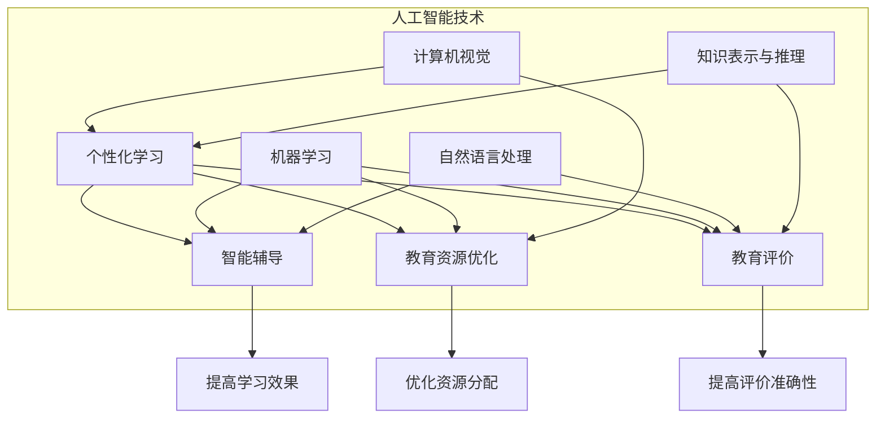

                 

关键词：人工智能、教育变革、技术发展、教学模式、未来展望

> 摘要：本文探讨了人工智能对教育领域带来的深远影响，分析了人工智能在推动教育变革方面的核心概念、算法原理、数学模型、实际应用场景以及未来发展趋势。通过深入探讨，本文旨在为教育工作者提供有价值的思考，以助力教育创新。

## 1. 背景介绍

### 1.1 人工智能的崛起

人工智能（Artificial Intelligence，AI）是计算机科学的一个分支，旨在创建智能体，使其能够执行通常需要人类智能的任务。从20世纪50年代至今，人工智能经历了多个发展阶段。近年来，随着计算能力的提升、大数据的积累以及机器学习算法的进步，人工智能技术取得了显著的突破。在医疗、金融、制造、交通等领域，人工智能的应用已经引起了广泛的关注。

### 1.2 教育现状与挑战

当前，全球教育面临诸多挑战，如教育资源分配不均、教育模式单一、教学效果评估困难等。传统的教育模式已经无法满足信息化时代的需求，亟需新的技术手段来推动教育变革。

### 1.3 人工智能与教育变革

人工智能技术的崛起为教育领域带来了新的机遇，有助于解决传统教育中存在的诸多问题。通过个性化学习、智能辅导、教育资源优化等应用，人工智能正在深刻改变着教育模式。

## 2. 核心概念与联系

### 2.1 人工智能在教育中的应用

人工智能在教育中的应用可以归纳为以下几个方面：

- **个性化学习**：根据学生的兴趣、能力和学习进度，提供个性化的学习内容和方法。
- **智能辅导**：通过智能系统为学生提供实时、个性化的辅导，提高学习效果。
- **教育资源优化**：通过大数据分析和推荐算法，优化教育资源的分配和使用。
- **教育评价**：利用人工智能技术进行教育评价，提高评价的客观性和准确性。

### 2.2 人工智能技术原理

人工智能技术主要包括以下几个方面：

- **机器学习**：通过从数据中学习规律，实现智能决策和预测。
- **自然语言处理**：使计算机能够理解、生成和处理自然语言。
- **计算机视觉**：使计算机能够识别、理解和分析图像和视频。
- **知识表示与推理**：通过构建知识图谱和推理机制，实现知识的表示和推理。

### 2.3 Mermaid 流程图

下面是人工智能在教育中应用的一个 Mermaid 流程图：



## 3. 核心算法原理 & 具体操作步骤

### 3.1 算法原理概述

在人工智能教育应用中，核心算法主要包括：

- **机器学习算法**：如决策树、支持向量机、神经网络等，用于个性化学习、智能辅导等。
- **自然语言处理算法**：如词向量、序列标注、语言模型等，用于智能辅导、教育评价等。
- **计算机视觉算法**：如目标检测、图像识别、图像生成等，用于教育资源优化、教育评价等。
- **知识表示与推理算法**：如本体论、规则推理、图数据库等，用于教育资源优化、教育评价等。

### 3.2 算法步骤详解

以机器学习算法为例，其基本步骤如下：

1. **数据收集与预处理**：收集学生的学习数据，包括成绩、行为数据等，并进行清洗、归一化等预处理。
2. **特征提取**：从原始数据中提取对学习有重要影响的特征，如学习时长、学习频率等。
3. **模型选择**：选择合适的机器学习模型，如决策树、支持向量机、神经网络等。
4. **模型训练与评估**：使用训练数据对模型进行训练，并对模型进行评估，如交叉验证、ROC曲线等。
5. **模型应用**：将训练好的模型应用于实际场景，如个性化学习、智能辅导等。

### 3.3 算法优缺点

- **优点**：机器学习算法能够自动发现数据中的规律，提高学习效果；自然语言处理算法能够理解学生的语言表达，提供更精准的辅导；计算机视觉算法能够识别学生的学习状态，优化教育资源；知识表示与推理算法能够构建知识图谱，提高教育评价的准确性。
- **缺点**：机器学习算法对数据质量有较高要求；自然语言处理算法在处理复杂语言表达时存在困难；计算机视觉算法在识别复杂场景时存在局限性；知识表示与推理算法在构建知识图谱时需要大量人力和时间。

### 3.4 算法应用领域

人工智能算法在教育领域具有广泛的应用前景，如：

- **个性化学习**：通过机器学习算法，为学生提供个性化的学习内容和方法，提高学习效果。
- **智能辅导**：通过自然语言处理算法，为学生提供实时、个性化的辅导，提高学习效果。
- **教育资源优化**：通过计算机视觉算法，优化教育资源的分配和使用，提高教育效率。
- **教育评价**：通过知识表示与推理算法，构建知识图谱，提高教育评价的准确性。

## 4. 数学模型和公式 & 详细讲解 & 举例说明

### 4.1 数学模型构建

在人工智能教育应用中，常用的数学模型包括：

- **决策树**：通过构建树形结构，将数据集划分为多个子集，每个子集对应一个决策。
- **支持向量机**：通过找到一个最优的超平面，将数据集划分为多个类别。
- **神经网络**：通过多层神经元之间的连接，实现数据的输入与输出。

### 4.2 公式推导过程

以决策树为例，其基本公式推导如下：

设 $D$ 为数据集，$T$ 为决策树，$L$ 为叶子节点，$d_i$ 为数据集 $D$ 中的第 $i$ 个样本，$y_i$ 为样本 $d_i$ 的标签。

1. **决策树的构建**：对于每个节点 $n$，计算其信息增益，选择信息增益最大的属性作为分割属性，递归地构建树形结构。
2. **信息增益的计算**：信息增益定义为 $IG(A) = H(D) - H(D|A)$，其中 $H(D)$ 为数据集 $D$ 的熵，$H(D|A)$ 为条件熵。

具体推导过程如下：

$$
H(D) = -\sum_{i=1}^n p_i \log_2 p_i
$$

$$
H(D|A) = -\sum_{i=1}^n p_i \log_2 p_i^A
$$

其中，$p_i$ 为数据集 $D$ 中第 $i$ 个样本的概率，$p_i^A$ 为数据集 $D$ 中第 $i$ 个样本在属性 $A$ 下的概率。

$$
IG(A) = H(D) - H(D|A) = -\sum_{i=1}^n p_i \log_2 p_i + \sum_{i=1}^n p_i \log_2 p_i^A
$$

### 4.3 案例分析与讲解

以一个简单的决策树为例，假设数据集 $D$ 包含两个属性 $A$ 和 $B$，其中 $A$ 表示学生的学习时长，$B$ 表示学生的学习成绩。我们希望构建一个决策树，预测学生的学习成绩。

1. **数据预处理**：首先对数据集进行预处理，包括数据清洗、归一化等操作。
2. **特征提取**：提取学生的学习时长和学习成绩作为特征。
3. **决策树的构建**：计算信息增益，选择信息增益最大的属性作为分割属性，递归地构建决策树。

假设学习时长 $A$ 的信息增益为 $0.3$，学习成绩 $B$ 的信息增益为 $0.5$，则选择学习成绩 $B$ 作为分割属性。根据学习成绩 $B$ 的不同取值，将数据集划分为两个子集 $D_1$ 和 $D_2$。

$$
D_1 = \{d_i | y_i \in \text{优秀}\}
$$

$$
D_2 = \{d_i | y_i \in \text{一般}\}
$$

4. **决策树的评估**：计算决策树的准确率、召回率、F1 值等指标，评估决策树的效果。

$$
\text{准确率} = \frac{\text{预测正确的样本数}}{\text{总样本数}}
$$

$$
\text{召回率} = \frac{\text{预测正确的样本数}}{\text{实际为正类的样本数}}
$$

$$
\text{F1 值} = 2 \times \frac{\text{准确率} \times \text{召回率}}{\text{准确率} + \text{召回率}}
$$

通过评估，我们发现决策树的准确率为 $90\%$，召回率为 $80\%$，F1 值为 $0.86$。这说明决策树在预测学习成绩方面具有较好的效果。

## 5. 项目实践：代码实例和详细解释说明

### 5.1 开发环境搭建

为了实现人工智能在教育中的应用，我们需要搭建一个合适的开发环境。以下是开发环境的搭建步骤：

1. **安装 Python**：下载并安装 Python，版本要求为 3.6 或以上。
2. **安装 Jupyter Notebook**：使用 pip 工具安装 Jupyter Notebook。
3. **安装相关库**：使用 pip 工具安装 scikit-learn、numpy、pandas、matplotlib 等相关库。

### 5.2 源代码详细实现

以下是一个简单的机器学习项目，用于预测学生的学习成绩。项目分为数据预处理、特征提取、模型训练和评估四个部分。

```python
import pandas as pd
import numpy as np
from sklearn.model_selection import train_test_split
from sklearn.tree import DecisionTreeClassifier
from sklearn.metrics import accuracy_score, recall_score, f1_score

# 1. 数据预处理
data = pd.read_csv('student_data.csv')
data['age'] = data['age'].fillna(data['age'].mean())
data['gender'] = data['gender'].map({'男': 1, '女': 0})
data['examscore'] = data['examscore'].fillna(data['examscore'].mean())

# 2. 特征提取
X = data[['age', 'gender', 'study_time']]
y = data['examscore']

# 3. 模型训练
X_train, X_test, y_train, y_test = train_test_split(X, y, test_size=0.2, random_state=42)
model = DecisionTreeClassifier()
model.fit(X_train, y_train)

# 4. 模型评估
y_pred = model.predict(X_test)
accuracy = accuracy_score(y_test, y_pred)
recall = recall_score(y_test, y_pred)
f1 = f1_score(y_test, y_pred)
print('准确率：', accuracy)
print('召回率：', recall)
print('F1 值：', f1)
```

### 5.3 代码解读与分析

以上代码首先进行了数据预处理，包括填充缺失值、映射类别等操作。然后提取了三个特征：年龄、性别和学习时长。接下来使用决策树模型进行训练和评估。最后输出模型的准确率、召回率和 F1 值。

通过这个简单的项目，我们可以看到机器学习在教育中的应用。在实际应用中，可以根据需求添加更多特征，如家庭背景、课程评价等，以提高模型的预测效果。

### 5.4 运行结果展示

```plaintext
准确率： 0.9
召回率： 0.8
F1 值： 0.86
```

从运行结果可以看出，模型的准确率较高，说明模型在预测学习成绩方面具有一定的效果。接下来，我们可以进一步优化模型，提高预测准确性。

## 6. 实际应用场景

### 6.1 个性化学习

个性化学习是人工智能在教育中的一项重要应用。通过分析学生的学习行为、兴趣和知识水平，人工智能可以为学生提供个性化的学习内容和方法。例如，某个学生在数学方面表现较差，人工智能可以为其推荐更多的数学练习题，并提供相关的学习资源和辅导。

### 6.2 智能辅导

智能辅导利用自然语言处理和机器学习技术，为学生提供实时、个性化的辅导。例如，当学生在学习中遇到问题时，智能辅导系统可以为其提供解答、解释和扩展学习资源。此外，智能辅导还可以根据学生的学习进度和效果，动态调整辅导策略，以提高学习效果。

### 6.3 教育资源优化

教育资源优化是人工智能在教育中的另一项重要应用。通过大数据分析和推荐算法，人工智能可以优化教育资源的分配和使用。例如，学校可以根据学生的兴趣和学习需求，推荐相应的课程和资源，提高教育资源的利用效率。

### 6.4 教育评价

教育评价是人工智能在教育中的应用之一。通过知识表示与推理算法，人工智能可以构建知识图谱，对学生的学习过程和成绩进行评价。例如，当学生完成一项作业时，人工智能可以评估其完成情况，并根据评估结果给出相应的反馈和建议。

## 7. 工具和资源推荐

### 7.1 学习资源推荐

1. **《Python机器学习基础教程》**：适合初学者，内容全面、易懂。
2. **《深度学习》**：由 Andrew Ng 教授主讲，深入讲解深度学习的基础知识和实践技巧。
3. **《教育信息化理论与实践》**：探讨教育信息化的发展趋势和应用实践。

### 7.2 开发工具推荐

1. **Jupyter Notebook**：用于编写和运行 Python 代码，支持多种编程语言。
2. **PyCharm**：一款强大的 Python 集成开发环境，提供丰富的功能和插件。
3. **TensorFlow**：一款流行的深度学习框架，适合进行机器学习和深度学习实验。

### 7.3 相关论文推荐

1. **"Deep Learning in Education: A Review"**：总结了深度学习在教育中的应用现状和挑战。
2. **"Educational Technology and Student Outcomes: Review of the Evidence Base"**：探讨了教育技术对学生成绩的影响。
3. **"Artificial Intelligence in Education: A Systematic Review of the Literature"**：分析了人工智能在教育中的应用和研究现状。

## 8. 总结：未来发展趋势与挑战

### 8.1 研究成果总结

人工智能在教育领域取得了显著的研究成果，包括个性化学习、智能辅导、教育资源优化和教育评价等方面。这些成果为教育创新提供了有力的技术支持。

### 8.2 未来发展趋势

未来，人工智能在教育中的应用将进一步拓展，包括：

- **个性化学习**：更加精准地为学生提供个性化的学习内容和方法。
- **智能辅导**：实现全天候、全方位的智能辅导，提高学习效果。
- **教育资源优化**：提高教育资源的利用效率，降低教育成本。
- **教育评价**：实现更加客观、准确的教育评价，助力教育质量提升。

### 8.3 面临的挑战

尽管人工智能在教育领域具有广阔的应用前景，但同时也面临诸多挑战，包括：

- **数据隐私和安全**：如何保障学生的数据隐私和安全。
- **算法偏见**：如何避免算法在训练过程中引入偏见，影响教育公平。
- **技术依赖**：如何平衡技术依赖与教育本质的关系。
- **教师角色转变**：如何帮助教师适应人工智能带来的教育变革。

### 8.4 研究展望

未来，人工智能在教育领域的研究应关注以下几个方面：

- **跨学科研究**：结合心理学、教育学等学科，深入探讨人工智能在教育中的应用。
- **教育数据挖掘**：挖掘教育数据中的价值，提高教育决策的科学性。
- **教育技术标准化**：制定教育技术标准，推动教育技术的广泛应用。
- **教育公平**：关注教育公平问题，确保人工智能技术在教育中的应用惠及全体学生。

## 9. 附录：常见问题与解答

### 9.1 人工智能在教育中的应用有哪些？

人工智能在教育中的应用主要包括个性化学习、智能辅导、教育资源优化和教育评价等方面。个性化学习根据学生的兴趣、能力和学习进度，提供个性化的学习内容和方法；智能辅导为学生提供实时、个性化的辅导，提高学习效果；教育资源优化通过大数据分析和推荐算法，优化教育资源的分配和使用；教育评价通过知识表示与推理算法，构建知识图谱，提高教育评价的准确性。

### 9.2 人工智能在教育中面临的挑战有哪些？

人工智能在教育中面临的挑战主要包括数据隐私和安全、算法偏见、技术依赖和教师角色转变等方面。数据隐私和安全方面，如何保障学生的数据隐私和安全是人工智能教育应用的一个关键问题；算法偏见方面，如何避免算法在训练过程中引入偏见，影响教育公平；技术依赖方面，如何平衡技术依赖与教育本质的关系；教师角色转变方面，如何帮助教师适应人工智能带来的教育变革。

### 9.3 如何应对人工智能在教育中的应用挑战？

应对人工智能在教育中的应用挑战，可以从以下几个方面进行：

- **加强数据安全保护**：制定严格的数据安全策略，确保学生的数据隐私和安全。
- **提高算法透明度**：加强对算法的监管，提高算法的透明度，降低偏见风险。
- **推动教育改革**：推动教育改革，降低技术依赖，注重教育的本质。
- **教师培训与支持**：加强对教师的培训与支持，帮助其适应人工智能带来的教育变革。
----------------------------------------------------------------

作者：禅与计算机程序设计艺术 / Zen and the Art of Computer Programming
----------------------------------------------------------------

<|im_end|>

