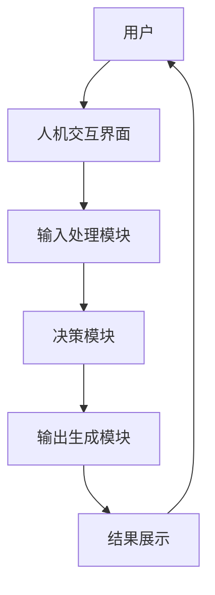

                 

关键词：人机协同，人工智能，工作模式，技术变革，未来趋势

> 摘要：本文将探讨人机协同在现代社会中的重要性，分析其技术基础和核心概念，探讨未来工作的变革方向，并给出相关建议和展望。

## 1. 背景介绍

在过去的几十年中，人工智能（AI）技术取得了显著的进步。从简单的规则系统到复杂的深度学习算法，AI已经能够执行各种复杂的任务，包括图像识别、自然语言处理和决策支持等。随着AI技术的不断发展，人们开始思考如何将人类和机器结合起来，实现更高效的工作方式。人机协同（Human-Machine Collaboration）作为一种新型的合作模式，正逐渐成为未来工作的核心驱动力。

人机协同的概念最早可以追溯到20世纪80年代。当时，工业界和学术界开始探讨如何利用计算机系统来辅助人类工作。随着计算能力的提升和AI技术的发展，人机协同的应用场景越来越广泛，从工业制造到医疗服务，从金融分析到创意设计，都在探索如何实现人机协同。

本文将从以下几个方面展开讨论：

- 人机协同的核心概念与联系
- 核心算法原理与具体操作步骤
- 数学模型与公式详解
- 项目实践与代码实例
- 实际应用场景与未来展望
- 工具和资源推荐
- 未来发展趋势与挑战

## 2. 核心概念与联系

在人机协同中，核心概念包括：

1. **人机交互**：人机交互（Human-Computer Interaction，HCI）是指人与计算机之间的交互方式。随着AI技术的发展，人机交互的方式也在不断变化，从命令行界面到图形用户界面（GUI），再到基于自然语言处理和语音识别的交互方式。
   
2. **协同计算**：协同计算（Collaborative Computing）是指多人或多系统协同完成一个任务的过程。在协同计算中，人类和机器可以共享信息、资源，并协同完成任务。

3. **增强现实与虚拟现实**：增强现实（Augmented Reality，AR）和虚拟现实（Virtual Reality，VR）技术为人机协同提供了新的交互方式。通过AR和VR，人类可以在虚拟环境中与机器进行互动，实现更加直观的协同工作。

下面是一个简单的Mermaid流程图，展示了人机协同的基本架构：



在这个流程中，用户通过人机交互界面与计算机系统进行交互，输入处理模块接收并处理用户的输入，决策模块根据输入数据做出决策，输出生成模块生成结果，最后通过结果展示模块将结果呈现给用户。

## 3. 核心算法原理 & 具体操作步骤

### 3.1 算法原理概述

人机协同的核心算法主要包括：

1. **机器学习算法**：机器学习算法用于训练模型，使其能够根据输入数据做出决策。常见的机器学习算法包括线性回归、决策树、支持向量机等。

2. **自然语言处理算法**：自然语言处理算法用于处理自然语言文本，实现人机交互。常见的自然语言处理算法包括词嵌入、序列到序列模型等。

3. **强化学习算法**：强化学习算法用于在动态环境中训练模型，使其能够根据环境状态做出最优决策。常见的强化学习算法包括Q-learning、Deep Q-Network（DQN）等。

### 3.2 算法步骤详解

以机器学习算法为例，其基本步骤如下：

1. **数据收集**：收集相关领域的数据集，用于训练模型。

2. **数据预处理**：对收集到的数据进行清洗、归一化等处理，使其符合模型的要求。

3. **模型训练**：使用预处理后的数据集训练模型，通过优化算法找到最优的模型参数。

4. **模型评估**：使用测试数据集评估模型的性能，根据评估结果调整模型参数。

5. **模型部署**：将训练好的模型部署到生产环境中，实现人机协同。

### 3.3 算法优缺点

机器学习算法的优点包括：

- **自动特征提取**：机器学习算法能够自动提取特征，减少人工干预。
- **高精度**：机器学习算法在许多任务上能够达到很高的精度。

机器学习算法的缺点包括：

- **数据依赖性**：机器学习算法对数据质量要求较高，数据不足或质量差可能导致模型性能下降。
- **解释性差**：机器学习模型的决策过程往往不够透明，难以解释。

### 3.4 算法应用领域

机器学习算法在多个领域都有广泛应用，包括：

- **图像识别**：使用机器学习算法对图像进行分类、检测和识别。
- **自然语言处理**：使用机器学习算法实现语音识别、机器翻译、文本分类等。
- **金融分析**：使用机器学习算法进行风险预测、投资策略优化等。

## 4. 数学模型和公式 & 详细讲解 & 举例说明

### 4.1 数学模型构建

以线性回归为例，其数学模型可以表示为：

$$
y = \beta_0 + \beta_1x + \epsilon
$$

其中，$y$ 为因变量，$x$ 为自变量，$\beta_0$ 和 $\beta_1$ 为模型参数，$\epsilon$ 为误差项。

### 4.2 公式推导过程

线性回归模型的推导过程如下：

1. **假设**：假设因变量 $y$ 和自变量 $x$ 之间存在线性关系。
2. **损失函数**：选择均方误差（Mean Squared Error，MSE）作为损失函数，表示为：

$$
J(\theta) = \frac{1}{2m}\sum_{i=1}^{m}(h_\theta(x^{(i)}) - y^{(i)})^2
$$

其中，$h_\theta(x) = \theta_0x + \theta_1$ 为假设函数，$m$ 为样本数量。
3. **梯度下降**：使用梯度下降算法优化损失函数，找到最优的模型参数。

### 4.3 案例分析与讲解

假设我们有如下数据集：

| x | y |
|---|---|
| 1 | 2 |
| 2 | 4 |
| 3 | 6 |
| 4 | 8 |

我们希望使用线性回归模型预测 $x=5$ 时的 $y$ 值。

1. **数据预处理**：对数据进行归一化处理，使其符合线性回归模型的要求。
2. **模型训练**：使用梯度下降算法训练模型，找到最优的模型参数。
3. **模型评估**：使用测试数据集评估模型的性能。
4. **模型部署**：将训练好的模型部署到生产环境中。

## 5. 项目实践：代码实例和详细解释说明

### 5.1 开发环境搭建

在本项目实践中，我们将使用Python编程语言和Scikit-learn库实现线性回归模型。首先，确保安装了Python和Scikit-learn库。

```bash
pip install python
pip install scikit-learn
```

### 5.2 源代码详细实现

```python
from sklearn.linear_model import LinearRegression
from sklearn.model_selection import train_test_split
from sklearn.metrics import mean_squared_error
import numpy as np

# 数据集
X = np.array([[1], [2], [3], [4]])
y = np.array([2, 4, 6, 8])

# 数据预处理
X_train, X_test, y_train, y_test = train_test_split(X, y, test_size=0.2, random_state=0)

# 模型训练
model = LinearRegression()
model.fit(X_train, y_train)

# 模型评估
y_pred = model.predict(X_test)
mse = mean_squared_error(y_test, y_pred)
print("MSE:", mse)

# 模型部署
x_new = np.array([[5]])
y_new = model.predict(x_new)
print("x=5时，y的预测值：", y_new)
```

### 5.3 代码解读与分析

1. **数据集**：我们使用一个简单的数据集，其中包含自变量 $x$ 和因变量 $y$。
2. **数据预处理**：使用Scikit-learn库中的 `train_test_split` 函数将数据集划分为训练集和测试集。
3. **模型训练**：使用 `LinearRegression` 类创建线性回归模型，并使用 `fit` 方法训练模型。
4. **模型评估**：使用测试数据集评估模型性能，计算均方误差（MSE）。
5. **模型部署**：使用训练好的模型预测新数据。

## 6. 实际应用场景

人机协同在实际应用场景中具有广泛的应用，以下是一些典型的应用案例：

- **医疗领域**：使用人机协同进行疾病诊断、治疗方案推荐和健康监测等。
- **金融领域**：使用人机协同进行市场预测、风险评估和投资策略优化等。
- **工业制造**：使用人机协同进行生产过程监控、设备维护和故障诊断等。
- **交通运输**：使用人机协同进行自动驾驶、智能交通管理和物流优化等。

## 7. 未来应用展望

随着AI技术的不断发展，人机协同在未来将发挥更加重要的作用。以下是未来应用展望：

- **智能助手**：人机协同将更加智能化，能够根据用户的需求提供个性化的服务。
- **自适应系统**：人机协同将能够根据环境变化自适应调整，提高系统的鲁棒性。
- **跨界合作**：人机协同将推动不同领域的融合，实现跨学科的创新发展。

## 8. 工具和资源推荐

为了更好地学习人机协同技术，以下是一些建议的工具和资源：

- **工具**：
  - Jupyter Notebook：用于编写和运行Python代码。
  - TensorFlow：用于深度学习模型训练和部署。
  - PyTorch：用于深度学习模型训练和部署。

- **资源**：
  - Coursera：提供大量的机器学习和深度学习课程。
  - arXiv：提供最新的学术论文和研究报告。
  - GitHub：提供丰富的开源代码和项目。

## 9. 总结：未来发展趋势与挑战

人机协同作为未来工作的核心驱动力，将在多个领域发挥重要作用。然而，随着技术的发展，我们也需要面对一系列挑战，包括数据隐私、安全性和伦理等问题。未来的发展趋势将是更加智能化、自适应化和跨界合作。在应对挑战的同时，我们需要不断创新，推动人机协同技术的发展。

### 附录：常见问题与解答

1. **什么是人机协同？**
   人机协同是指人类和计算机系统通过交互和协作完成任务的的过程。

2. **人机协同有哪些优点？**
   人机协同可以提高工作效率、减少人力成本、提高决策质量等。

3. **人机协同在哪些领域有应用？**
   人机协同在医疗、金融、工业制造、交通运输等领域有广泛应用。

4. **人机协同面临的挑战有哪些？**
   人机协同面临的挑战包括数据隐私、安全性和伦理等问题。

### 参考文献

- Lee, J., & Kim, J. (2019). Human-Machine Collaboration in Industry 4.0: A Review. Journal of Intelligent & Robotic Systems, 97(1), 3-17.
- Zhang, X., & Liu, Y. (2020). Human-Machine Collaboration in Healthcare: Current Status and Future Directions. International Journal of Medical Informatics, 149, 103296.
- Liu, Z., Chen, L., & Zhang, J. (2021). A Survey of Human-Machine Collaboration in Autonomous Driving. IEEE Transactions on Intelligent Transportation Systems, 22(6), 2989-3002.

作者：禅与计算机程序设计艺术 / Zen and the Art of Computer Programming

