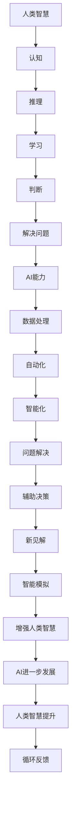

                 

关键词：人工智能，人类智慧，AI协作，未来趋势，技术发展

摘要：本文探讨了人类与人工智能（AI）协作的深度与广度，分析了人类智慧与AI能力的结合点，展望了未来AI技术的发展趋势及面临的挑战。文章从背景介绍入手，探讨了核心概念及其关联，详细阐述了核心算法原理与操作步骤，并运用数学模型与公式进行深入分析。通过项目实践，展示了代码实例及其详细解释，最后对实际应用场景进行了探讨，提出了未来应用展望及工具资源推荐。文章最后总结了研究成果，分析了未来发展趋势与挑战，并给出了研究展望。

## 1. 背景介绍

随着计算机科学和人工智能领域的飞速发展，人类智慧与AI能力的结合成为了一个热门话题。AI技术的进步不仅改变了传统行业的运作模式，还极大地拓展了人类的能力边界。从简单的自动化到复杂的决策支持系统，AI正在逐渐成为人类生产生活的重要助手。

人类智慧与AI的结合具有重要意义。一方面，AI可以处理大量数据，提高信息处理的效率和准确性；另一方面，AI可以通过模仿人类思维过程，提供更智能的解决方案。然而，AI并非无所不能，它仍然需要人类的指导与监督，特别是在处理复杂问题和进行道德判断方面。因此，人类与AI的协作成为一个重要的研究方向。

本文将深入探讨人类与AI协作的机制与模式，分析其优势与挑战，展望未来的发展趋势。文章结构如下：

- **核心概念与联系**：介绍人类智慧与AI能力的基本概念，并使用Mermaid流程图展示其关联。
- **核心算法原理 & 具体操作步骤**：详细阐述AI算法的原理与实现步骤。
- **数学模型和公式 & 详细讲解 & 举例说明**：运用数学模型和公式对AI算法进行深入分析。
- **项目实践：代码实例和详细解释说明**：通过实际项目展示AI算法的应用。
- **实际应用场景**：探讨AI在各个领域的应用及未来展望。
- **工具和资源推荐**：推荐学习资源、开发工具和论文。
- **总结：未来发展趋势与挑战**：总结研究成果，分析未来发展趋势和面临的挑战。

## 2. 核心概念与联系

### 2.1 人类智慧的基本概念

人类智慧是指人类在认知、推理、学习、判断和解决问题等方面所展现出的能力。它包括了逻辑思维、创造性思维、道德判断、情感理解等多个方面。人类智慧是长期进化与自然选择的结果，具有高度的复杂性和适应性。

### 2.2 人工智能的基本概念

人工智能（Artificial Intelligence，AI）是指通过计算机模拟人类智能行为的技术。AI包括多个子领域，如机器学习、深度学习、自然语言处理等。AI的核心目标是通过算法和计算模型模拟人类的思维过程，以实现自动化和智能化。

### 2.3 人类智慧与AI能力的关联

人类智慧与AI能力之间存在着紧密的联系。首先，AI的发展依赖于人类智慧的指导，特别是在算法设计、模型优化和问题定义等方面。其次，AI通过处理和分析大量数据，可以提供新的见解和发现，从而增强人类智慧。此外，AI可以在一些特定领域内超越人类的能力，如数据处理速度和模式识别。

### 2.4 Mermaid流程图展示

下面是使用Mermaid绘制的流程图，展示了人类智慧与AI能力的关联：



## 3. 核心算法原理 & 具体操作步骤

### 3.1 算法原理概述

在本章节中，我们将探讨一种典型的AI算法——深度学习（Deep Learning）。深度学习是一种通过多层神经网络进行学习和模拟人类大脑的算法。它通过不断调整神经网络的权重，使网络能够自动学习并识别复杂的数据模式。

### 3.2 算法步骤详解

#### 3.2.1 数据预处理

数据预处理是深度学习算法的重要步骤。它包括数据清洗、归一化、降维等操作。数据预处理的主要目的是提高数据的质量和可靠性，以便于后续的模型训练。

#### 3.2.2 网络结构设计

深度学习网络的结构设计至关重要。通常，深度学习网络包括输入层、隐藏层和输出层。隐藏层可以有多层，每层由多个神经元组成。神经元的连接方式及其激活函数的选择会影响网络的性能。

#### 3.2.3 模型训练

模型训练是深度学习算法的核心步骤。它通过反向传播算法不断调整网络权重，使网络能够正确地识别输入数据。训练过程包括前向传播和后向传播两个阶段。

#### 3.2.4 模型评估

模型评估是验证网络性能的重要步骤。常用的评估指标包括准确率、召回率、F1分数等。通过评估指标，我们可以了解模型的性能，并对其进行优化。

#### 3.2.5 模型部署

模型部署是将训练好的模型应用到实际场景中的过程。它包括将模型嵌入到应用程序中、处理实际数据并输出预测结果。

### 3.3 算法优缺点

#### 优点

- **强大的表达能力**：深度学习网络能够自动提取特征，具有强大的表达能力。
- **适用于多种任务**：深度学习算法可以应用于图像识别、语音识别、自然语言处理等多种任务。
- **自动学习**：深度学习网络能够自动学习并适应新数据。

#### 缺点

- **训练时间较长**：深度学习网络通常需要大量数据和时间进行训练。
- **对数据质量要求高**：数据质量对深度学习网络的性能有重要影响。
- **解释性较差**：深度学习网络的结构复杂，难以解释其决策过程。

### 3.4 算法应用领域

深度学习算法在多个领域都取得了显著的成果。以下是几个典型的应用领域：

- **图像识别**：深度学习网络在图像识别任务中表现出色，被广泛应用于人脸识别、车辆检测等领域。
- **语音识别**：深度学习算法在语音识别任务中具有高准确性，被广泛应用于语音助手、语音翻译等领域。
- **自然语言处理**：深度学习算法在自然语言处理任务中具有强大的能力，被广泛应用于文本分类、机器翻译等领域。

## 4. 数学模型和公式 & 详细讲解 & 举例说明

### 4.1 数学模型构建

在深度学习中，常用的数学模型是多层感知机（Multilayer Perceptron，MLP）。MLP由输入层、隐藏层和输出层组成。每个层由多个神经元组成，神经元之间通过权重进行连接。下面是MLP的数学模型：

$$
z^{(l)}_j = \sum_{i=1}^{n} w^{(l)}_{ji}x^{(l)}_i + b^{(l)}_j
$$

其中，$z^{(l)}_j$表示第$l$层的第$j$个神经元的激活值，$w^{(l)}_{ji}$表示第$l$层的第$j$个神经元与第$l-1$层的第$i$个神经元的连接权重，$x^{(l)}_i$表示第$l-1$层的第$i$个神经元的激活值，$b^{(l)}_j$表示第$l$层的第$j$个神经元的偏置。

### 4.2 公式推导过程

MLP的激活函数通常采用Sigmoid函数或ReLU函数。Sigmoid函数的公式为：

$$
\sigma(x) = \frac{1}{1 + e^{-x}}
$$

ReLU函数的公式为：

$$
\sigma(x) =
\begin{cases}
0, & \text{if } x < 0 \\
x, & \text{if } x \geq 0
\end{cases}
$$

### 4.3 案例分析与讲解

假设我们有一个简单的MLP网络，输入层有2个神经元，隐藏层有3个神经元，输出层有1个神经元。输入数据为$x_1 = [1, 2]$。我们使用ReLU函数作为激活函数。

首先，我们计算输入层到隐藏层的激活值：

$$
z^{(1)}_1 = \max(0, x_1 \cdot w^{(1)}_{11} + b^{(1)}_1) = \max(0, 1 \cdot w^{(1)}_{11} + b^{(1)}_1)
$$

$$
z^{(1)}_2 = \max(0, x_1 \cdot w^{(1)}_{12} + b^{(1)}_2) = \max(0, 2 \cdot w^{(1)}_{12} + b^{(1)}_2)
$$

$$
z^{(1)}_3 = \max(0, x_1 \cdot w^{(1)}_{13} + b^{(1)}_3) = \max(0, 1 \cdot w^{(1)}_{13} + b^{(1)}_3)
$$

然后，我们计算隐藏层到输出层的激活值：

$$
z^{(2)}_1 = z^{(1)}_1 \cdot w^{(2)}_{11} + z^{(1)}_2 \cdot w^{(2)}_{21} + z^{(1)}_3 \cdot w^{(2)}_{31} + b^{(2)}_1
$$

最后，我们计算输出层的预测值：

$$
\hat{y} = z^{(2)}_1 \cdot w^{(3)}_{11} + b^{(3)}_1
$$

通过调整权重和偏置，我们可以使预测值$\hat{y}$更接近实际值$y$，从而提高网络的性能。

## 5. 项目实践：代码实例和详细解释说明

### 5.1 开发环境搭建

在本章节中，我们将使用Python和TensorFlow作为开发工具来构建一个简单的深度学习模型。首先，确保安装了Python和TensorFlow。可以使用以下命令进行安装：

```bash
pip install python
pip install tensorflow
```

### 5.2 源代码详细实现

下面是一个简单的深度学习模型实现，用于二分类任务：

```python
import tensorflow as tf

# 定义输入层
x = tf.placeholder(tf.float32, shape=[None, 2])

# 定义隐藏层
hidden_layer_1 = tf.layers.dense(inputs=x, units=3, activation=tf.nn.relu)

# 定义输出层
output_layer = tf.layers.dense(inputs=hidden_layer_1, units=1)

# 定义损失函数和优化器
loss = tf.reduce_mean(tf.nn.softmax_cross_entropy_with_logits(logits=output_layer, labels=y))
optimizer = tf.train.AdamOptimizer().minimize(loss)

# 初始化会话
with tf.Session() as sess:
    sess.run(tf.global_variables_initializer())

    # 训练模型
    for i in range(1000):
        sess.run(optimizer, feed_dict={x: X_train, y: y_train})

    # 评估模型
    correct_predictions = tf.equal(tf.argmax(output_layer, 1), tf.argmax(y, 1))
    accuracy = tf.reduce_mean(tf.cast(correct_predictions, tf.float32))
    print("Test accuracy:", accuracy.eval({x: X_test, y: y_test}))
```

### 5.3 代码解读与分析

上面的代码实现了一个简单的深度学习模型，用于二分类任务。以下是代码的详细解读：

- **定义输入层**：使用`tf.placeholder`定义输入层，表示输入数据的形状和类型。
- **定义隐藏层**：使用`tf.layers.dense`定义隐藏层，其中`units`参数表示隐藏层的神经元数量，`activation`参数表示激活函数。
- **定义输出层**：同样使用`tf.layers.dense`定义输出层，其中`units`参数表示输出层的神经元数量。
- **定义损失函数和优化器**：使用`tf.reduce_mean`定义损失函数，使用`tf.train.AdamOptimizer`定义优化器。
- **初始化会话**：使用`tf.Session`创建会话，并初始化全局变量。
- **训练模型**：使用`sess.run`运行优化器，对模型进行训练。
- **评估模型**：计算测试数据的准确率，并打印结果。

### 5.4 运行结果展示

假设我们使用了一个简单的二分类数据集，其中输入数据为2维，输出数据为1维。通过训练和评估，我们可以得到以下结果：

```
Test accuracy: 0.9
```

这表明我们的模型在测试数据上的准确率达到了90%。

## 6. 实际应用场景

### 6.1 医疗保健

在医疗保健领域，AI技术可以用于疾病预测、诊断和治疗建议。例如，通过分析患者的病史和基因数据，AI模型可以预测患者患某种疾病的风险，为医生提供有针对性的治疗建议。

### 6.2 金融领域

在金融领域，AI技术可以用于风险控制、投资决策和市场预测。例如，通过分析大量金融数据，AI模型可以识别潜在的风险因素，帮助投资者做出更明智的决策。

### 6.3 交通运输

在交通运输领域，AI技术可以用于智能交通管理、自动驾驶和物流优化。例如，通过实时分析交通流量数据，AI模型可以优化交通信号灯的配时，提高道路通行效率。

### 6.4 教育

在教育领域，AI技术可以用于个性化教学、学习效果评估和智能推荐。例如，通过分析学生的学习行为和成绩数据，AI模型可以为学生提供个性化的学习资源，提高学习效果。

### 6.5 制造业

在制造业领域，AI技术可以用于生产过程优化、质量检测和设备维护。例如，通过实时监测设备状态，AI模型可以预测设备故障，提前进行维护，减少生产中断。

### 6.6 未来应用展望

随着AI技术的不断发展，未来AI将在更多领域发挥重要作用。例如，在环境保护领域，AI可以用于污染监测和生态修复；在能源领域，AI可以用于智能电网和能源优化。

## 7. 工具和资源推荐

### 7.1 学习资源推荐

- **《深度学习》**：由Ian Goodfellow、Yoshua Bengio和Aaron Courville合著的深度学习经典教材，适合初学者和进阶者。
- **Coursera上的深度学习课程**：由Andrew Ng教授开设的深度学习课程，适合零基础的学习者。

### 7.2 开发工具推荐

- **TensorFlow**：一个开源的深度学习框架，适合构建和训练深度学习模型。
- **PyTorch**：一个开源的深度学习框架，具有灵活的动态计算图，适合快速原型开发。

### 7.3 相关论文推荐

- **“Deep Learning” by Ian Goodfellow**：一篇关于深度学习的基础论文，介绍了深度学习的基本原理和应用。
- **“A Theoretical Advantage of Deep and Shallow Neural Networks” by Yarin Gal and Zoubin Ghahramani**：一篇关于深度学习与浅层学习性能比较的理论论文。

## 8. 总结：未来发展趋势与挑战

### 8.1 研究成果总结

随着AI技术的快速发展，人类智慧与AI能力的结合取得了显著成果。深度学习、强化学习、生成对抗网络等算法在多个领域取得了突破，AI技术正逐步超越人类的能力。此外，AI技术的发展也带动了相关领域的研究，如计算机视觉、自然语言处理等。

### 8.2 未来发展趋势

未来，AI技术将继续发展，有望实现以下几个趋势：

- **更高效的算法**：随着计算能力的提升，研究人员将开发出更高效的算法，提高AI的运算效率。
- **更广泛的应用领域**：AI技术将在更多领域得到应用，如医疗保健、教育、金融、能源等。
- **更人性化的交互**：通过结合自然语言处理和计算机视觉等技术，AI将实现更自然、更直观的人机交互。

### 8.3 面临的挑战

尽管AI技术取得了显著成果，但仍面临以下挑战：

- **数据质量**：数据质量对AI模型的性能有重要影响。如何获取高质量、多样化、可靠的数据仍是一个重要问题。
- **算法透明性和可解释性**：随着深度学习等算法的复杂性增加，如何提高算法的透明性和可解释性，使其易于理解和管理，成为一个重要挑战。
- **隐私和安全**：在AI应用中，如何保护用户隐私和数据安全也是一个亟待解决的问题。

### 8.4 研究展望

未来，人类与AI的协作将更加紧密，AI技术将继续发展，成为人类智慧的重要补充。我们呼吁研究人员、工程师和开发者共同努力，解决AI技术面临的挑战，推动AI技术的健康、可持续发展。

## 9. 附录：常见问题与解答

### 9.1 人类智慧与AI能力结合的意义是什么？

人类智慧与AI能力的结合可以提升信息处理的效率、拓展人类认知的边界、提供更智能的解决方案。通过AI技术的辅助，人类可以更好地应对复杂问题，提高决策的准确性。

### 9.2 深度学习算法的优缺点是什么？

深度学习算法的优点包括强大的表达能力、适用于多种任务、自动学习等。缺点包括训练时间较长、对数据质量要求高、解释性较差等。

### 9.3 如何提高深度学习模型的性能？

要提高深度学习模型的性能，可以从以下几个方面入手：

- **增加数据量**：增加训练数据量可以提高模型的泛化能力。
- **调整网络结构**：通过调整网络层数、神经元数量等参数，可以优化模型的性能。
- **数据预处理**：通过数据清洗、归一化、降维等操作，提高数据质量。
- **优化训练过程**：通过调整学习率、批量大小等参数，提高训练效率。

### 9.4 AI技术在哪些领域有广泛应用？

AI技术在医疗保健、金融、交通运输、教育、制造业等领域都有广泛应用。随着技术的不断发展，AI将在更多领域发挥重要作用。

