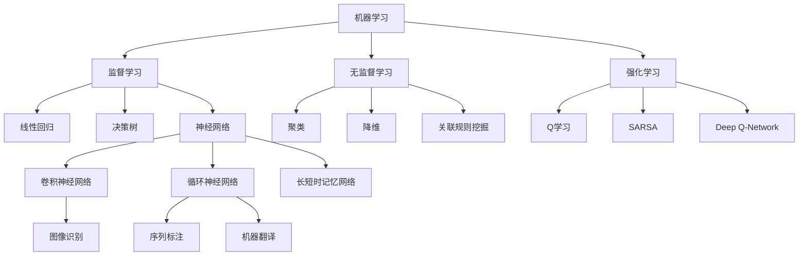

                 

关键词：人类-AI协作，智能融合，发展趋势，AI能力，人类智慧，增强学习

> 摘要：本文旨在探讨人类与人工智能协作的趋势和前景，分析人类智慧与AI能力的融合对未来的影响。通过回顾人工智能的发展历程，阐述当前AI技术的核心概念与联系，深入探讨AI算法原理、数学模型和应用实践。在此基础上，对AI在实际应用场景中的表现进行讨论，并提出对未来发展趋势的展望。

## 1. 背景介绍

随着人工智能技术的飞速发展，人类与AI的协作已经成为现代社会不可或缺的一部分。从早期的自动化设备到如今复杂的机器学习系统，AI技术在提升人类工作效率、拓展人类认知边界等方面发挥了巨大的作用。然而，随着AI能力的不断增强，如何更好地将人类智慧与AI能力进行融合，以实现更高的生产力和创新能力，成为一个亟待解决的问题。

本文将围绕以下几个核心问题展开讨论：

- 人类智慧与AI能力的区别与联系是什么？
- 当前AI技术的核心概念和架构是怎样的？
- 人类-AI协作的具体应用场景有哪些？
- 未来人类-AI协作将呈现怎样的发展趋势？

通过对以上问题的深入探讨，本文旨在为人类与AI的协作提供一些有益的思考和参考。

### 1.1 人工智能的发展历程

人工智能（Artificial Intelligence，简称AI）的研究可以追溯到20世纪50年代。当时，计算机科学家们首次提出了“机器能够思考”的概念，并开始探索如何让计算机模拟人类的智能行为。早期的人工智能研究主要集中在规则推理、知识表示和搜索算法等方面。在这个阶段，AI系统往往依赖于大量的预定义规则和知识库，这些系统被设计来解决特定的问题，例如自然语言处理、图像识别和棋类游戏等。

20世纪80年代，专家系统的兴起标志着人工智能进入了一个新的阶段。专家系统是一种基于知识表示和推理的AI系统，能够模拟人类专家的决策过程。这个阶段的AI系统在医疗诊断、财务分析和工程设计等领域取得了显著的应用成果。然而，专家系统的局限性也日益显现，即其知识库的构建和维护非常复杂，且难以应对不确定性和动态变化的环境。

进入21世纪，随着计算能力的提升和大数据技术的应用，机器学习（Machine Learning，简称ML）成为人工智能研究的主流方向。机器学习是一种让计算机从数据中学习规律和模式的方法，不再需要人工编写规则。通过大量数据的学习，机器学习算法能够自动发现特征、分类数据、预测结果等。这一阶段的AI系统在语音识别、图像识别、推荐系统等领域取得了巨大的突破。

近年来，深度学习（Deep Learning，简称DL）的兴起进一步推动了人工智能的发展。深度学习是一种基于多层神经网络的学习方法，能够自动提取数据的复杂特征。深度学习在计算机视觉、自然语言处理和游戏AI等领域取得了显著的成果，已经成为人工智能领域的重要研究方向。

### 1.2 人类-AI协作的现状

当前，人类与AI的协作已经渗透到许多领域，从工业生产到医疗诊断，从金融服务到教育，AI系统正逐渐成为人类工作的重要助手。以下是一些典型的应用场景：

1. **工业生产**：在制造业中，AI系统被用于自动化生产线控制、质量检测和设备维护等环节，提高了生产效率和产品质量。例如，机器人可以通过视觉识别技术自动检测产品缺陷，并采取相应的修复措施。

2. **医疗诊断**：AI技术在医疗领域的应用越来越广泛，从影像诊断到疾病预测，AI系统能够辅助医生做出更准确的诊断。例如，深度学习算法可以分析医学影像数据，帮助医生快速识别病灶。

3. **金融服务**：在金融行业，AI系统被用于风险控制、欺诈检测和客户服务等方面。通过大数据分析和机器学习算法，金融机构能够更好地识别潜在风险，提高客户体验。

4. **教育**：在教育领域，AI系统被用于个性化学习推荐、学习评估和作业批改等环节，帮助学生更有效地学习。例如，智能辅导系统可以根据学生的学习情况，为学生推荐合适的学习资源和练习。

### 1.3 人类-AI协作的重要性

人类-AI协作的重要性体现在以下几个方面：

1. **提高效率**：AI系统可以自动化执行繁琐的任务，降低人力成本，提高工作效率。例如，自动化的数据分析工具可以帮助企业快速处理海量数据，为企业决策提供有力支持。

2. **拓展认知**：AI系统可以处理人类无法快速解决的问题，例如大规模数据分析、复杂模式识别等。通过与人类专家的协作，AI系统可以拓展人类的认知边界，提高创新能力和解决问题的能力。

3. **优化决策**：AI系统可以通过分析海量数据，提供更准确和全面的决策支持。例如，在金融投资中，AI系统可以根据市场数据和交易历史，预测未来市场的走势，为投资者提供投资建议。

4. **增强创造力**：人类与AI的协作可以激发人类的创造力。AI系统可以自动生成创意方案，帮助人类探索新的可能性。例如，在艺术创作中，AI系统可以生成音乐、绘画和设计等作品，为艺术家提供灵感和参考。

### 1.4 文章结构概述

本文将从以下几个方面展开讨论：

- **背景介绍**：回顾人工智能的发展历程，介绍人类-AI协作的现状和重要性。
- **核心概念与联系**：阐述AI技术的核心概念和架构，使用Mermaid流程图展示其联系。
- **核心算法原理 & 具体操作步骤**：深入探讨AI算法的原理、步骤、优缺点和应用领域。
- **数学模型和公式 & 详细讲解 & 举例说明**：构建数学模型，推导公式，并通过案例进行分析。
- **项目实践：代码实例和详细解释说明**：提供代码实例，详细解释其实现过程。
- **实际应用场景**：讨论AI在实际应用中的表现，包括项目实践、未来应用展望等。
- **工具和资源推荐**：推荐学习资源、开发工具和相关论文。
- **总结：未来发展趋势与挑战**：总结研究成果，探讨未来发展趋势和面临的挑战。

接下来，我们将深入探讨AI技术的核心概念和架构，为后续内容的讨论奠定基础。

## 2. 核心概念与联系

在探讨人类-AI协作之前，我们首先需要了解AI技术的核心概念和架构。本节将详细阐述这些核心概念，并通过Mermaid流程图展示它们之间的联系。

### 2.1 机器学习

机器学习（Machine Learning，简称ML）是AI技术的基础。它通过训练模型来从数据中学习规律和模式，从而实现预测和分类任务。机器学习可以分为监督学习、无监督学习和强化学习三种类型。

- **监督学习（Supervised Learning）**：在监督学习中，我们使用标记数据来训练模型，然后使用模型对新数据进行预测。常见的算法包括线性回归、决策树和神经网络等。
  
- **无监督学习（Unsupervised Learning）**：无监督学习不使用标记数据，而是通过发现数据中的内在结构来训练模型。常见的算法包括聚类、降维和关联规则挖掘等。

- **强化学习（Reinforcement Learning）**：在强化学习中，模型通过与环境的交互来学习最佳策略。常见的算法包括Q学习、SARSA和Deep Q-Network等。

### 2.2 深度学习

深度学习（Deep Learning，简称DL）是机器学习的一种重要分支，它使用多层神经网络来学习数据中的复杂特征。深度学习在图像识别、语音识别和自然语言处理等领域取得了显著的成果。

- **卷积神经网络（Convolutional Neural Network，简称CNN）**：CNN是一种用于处理图像数据的神经网络，它通过卷积层提取图像特征，然后通过全连接层进行分类。

- **循环神经网络（Recurrent Neural Network，简称RNN）**：RNN是一种用于处理序列数据的神经网络，它能够记住序列中的信息，并使用这些信息进行预测。

- **长短时记忆网络（Long Short-Term Memory，简称LSTM）**：LSTM是RNN的一种变体，它能够更好地处理长序列数据，并避免梯度消失问题。

### 2.3 自然语言处理

自然语言处理（Natural Language Processing，简称NLP）是AI技术的一个重要应用领域，它涉及语言的理解、生成和翻译等任务。NLP使用深度学习、统计模型和知识图谱等技术来处理文本数据。

- **词向量（Word Embedding）**：词向量是一种将词语映射到高维空间中的技术，它能够表示词语之间的关系。常见的词向量模型包括Word2Vec、GloVe和BERT等。

- **序列标注（Sequence Labeling）**：序列标注是一种对文本序列中的词语进行分类的任务，常见的算法包括条件随机场（Conditional Random Field，简称CRF）和生物信息学算法（如BiLSTM-CRF）。

- **机器翻译（Machine Translation）**：机器翻译是一种将一种语言的文本翻译成另一种语言的技术。常见的算法包括基于规则的方法、基于统计的方法和基于神经网络的深度学习方法。

### 2.4 Mermaid流程图

为了更清晰地展示这些核心概念和它们之间的联系，我们可以使用Mermaid流程图来表示。



通过以上内容，我们为后续章节的讨论奠定了基础。接下来，我们将深入探讨AI算法的原理和具体操作步骤。

## 3. 核心算法原理 & 具体操作步骤

在了解了AI技术的核心概念和架构之后，我们将深入探讨AI算法的原理和具体操作步骤。本节将分别从算法原理概述、算法步骤详解、算法优缺点和算法应用领域四个方面进行详细讨论。

### 3.1 算法原理概述

AI算法的核心在于如何从数据中学习规律和模式，以实现预测、分类、生成等任务。以下是一些常见的AI算法及其原理概述：

#### 3.1.1 线性回归

线性回归（Linear Regression）是一种用于预测连续值的监督学习算法。其原理是通过拟合一条直线来描述自变量和因变量之间的关系。线性回归模型可以表示为：

\[ Y = \beta_0 + \beta_1X + \epsilon \]

其中，\( Y \) 是因变量，\( X \) 是自变量，\( \beta_0 \) 和 \( \beta_1 \) 是模型的参数，\( \epsilon \) 是误差项。

#### 3.1.2 决策树

决策树（Decision Tree）是一种用于分类和回归的监督学习算法。其原理是通过一系列规则将数据划分为不同的区域，以实现预测目标。决策树通常由根节点、内部节点和叶子节点组成。每个内部节点表示一个特征，每个叶子节点表示一个类别或值。

#### 3.1.3 神经网络

神经网络（Neural Network）是一种模拟生物神经网络的结构和功能的算法。其原理是通过多层神经元的连接来模拟大脑的工作机制，实现数据的输入、处理和输出。神经网络的核心是神经元，每个神经元都通过权重和偏置与输入数据相乘，然后通过激活函数进行非线性变换。

#### 3.1.4 卷积神经网络

卷积神经网络（Convolutional Neural Network，简称CNN）是一种用于图像识别和处理的神经网络。其原理是通过卷积操作提取图像的特征，并通过池化操作降低特征图的维度。CNN由卷积层、池化层和全连接层组成，可以有效地处理图像数据。

#### 3.1.5 循环神经网络

循环神经网络（Recurrent Neural Network，简称RNN）是一种用于序列数据处理的神经网络。其原理是通过循环结构将当前输入与之前的隐藏状态相连接，以保持序列信息的长期依赖。RNN的核心是隐藏状态，它可以捕捉序列中的时间依赖关系。

#### 3.1.6 长短时记忆网络

长短时记忆网络（Long Short-Term Memory，简称LSTM）是RNN的一种变体，用于解决长序列数据中的梯度消失和梯度爆炸问题。其原理是通过引入记忆单元和门控机制来控制信息的流动，从而更好地捕捉序列中的长期依赖关系。

#### 3.1.7 词向量

词向量（Word Embedding）是一种将词语映射到高维空间中的技术，用于表示词语之间的关系。常见的词向量模型包括Word2Vec、GloVe和BERT等。其原理是通过训练模型将词语的语义信息编码到向量的低维空间中。

#### 3.1.8 机器翻译

机器翻译（Machine Translation）是一种将一种语言的文本翻译成另一种语言的技术。常见的算法包括基于规则的方法、基于统计的方法和基于神经网络的深度学习方法。其原理是通过将源语言和目标语言的词汇映射到高维空间中，然后使用神经网络进行翻译。

### 3.2 算法步骤详解

下面我们将详细解释每种算法的具体步骤：

#### 3.2.1 线性回归

1. **数据预处理**：对数据进行标准化处理，将数据缩放到相同的尺度。
2. **模型初始化**：随机初始化模型的参数 \( \beta_0 \) 和 \( \beta_1 \)。
3. **训练过程**：通过梯度下降法不断更新模型的参数，直到满足训练目标。
4. **预测**：使用训练好的模型对新的数据进行预测。

#### 3.2.2 决策树

1. **数据预处理**：对数据进行预处理，将数据划分为特征和标签两部分。
2. **特征选择**：选择最优特征进行划分，通常使用信息增益或基尼系数作为评价标准。
3. **划分过程**：递归地对数据集进行划分，直到满足终止条件（如最大深度、纯度等）。
4. **预测**：根据决策树的路径对新的数据进行分类。

#### 3.2.3 神经网络

1. **数据预处理**：对数据进行预处理，包括归一化、标准化和缺失值处理等。
2. **模型初始化**：随机初始化模型的权重和偏置。
3. **前向传播**：计算输入数据的激活值，通过多层神经元的连接传递到输出层。
4. **反向传播**：计算损失函数，并使用梯度下降法更新模型的参数。
5. **预测**：使用训练好的模型对新的数据进行预测。

#### 3.2.4 卷积神经网络

1. **数据预处理**：对图像数据进行预处理，包括归一化、标准化和补零等。
2. **卷积操作**：使用卷积核对图像数据进行卷积操作，提取特征。
3. **池化操作**：对卷积后的特征图进行池化操作，降低维度。
4. **全连接层**：将池化后的特征图与全连接层相连接，进行分类。
5. **预测**：使用训练好的模型对新的图像数据进行分类。

#### 3.2.5 循环神经网络

1. **数据预处理**：对序列数据进行预处理，包括填充、截断和编码等。
2. **初始化**：随机初始化RNN的权重和偏置。
3. **前向传播**：递归地计算隐藏状态和输出。
4. **反向传播**：计算损失函数，并使用梯度下降法更新RNN的参数。
5. **预测**：使用训练好的RNN对新的序列数据进行预测。

#### 3.2.6 长短时记忆网络

1. **数据预处理**：对序列数据进行预处理，包括填充、截断和编码等。
2. **初始化**：随机初始化LSTM的权重和偏置。
3. **前向传播**：递归地计算隐藏状态和输出，通过门控机制控制信息的流动。
4. **反向传播**：计算损失函数，并使用梯度下降法更新LSTM的参数。
5. **预测**：使用训练好的LSTM对新的序列数据进行预测。

#### 3.2.7 词向量

1. **数据预处理**：对文本数据进行预处理，包括分词、去停用词等。
2. **词嵌入**：使用Word2Vec、GloVe或BERT等词向量模型将词语映射到高维空间中。
3. **训练**：通过训练模型将词语的语义信息编码到向量中。
4. **预测**：使用训练好的词向量对新的词语进行预测。

#### 3.2.8 机器翻译

1. **数据预处理**：对源语言和目标语言的数据进行预处理，包括分词、编码等。
2. **编码**：使用编码器将源语言编码为向量。
3. **解码**：使用解码器将编码后的向量解码为目标语言的文本。
4. **预测**：使用训练好的机器翻译模型对新的源语言文本进行翻译。

### 3.3 算法优缺点

每种算法都有其独特的优势和局限性，以下是对常见算法优缺点的总结：

#### 3.3.1 线性回归

**优点**：

- 简单易理解，易于实现。
- 对线性关系有很好的拟合能力。

**缺点**：

- 对于非线性关系的表现较差。
- 对于异常值和噪声敏感。

#### 3.3.2 决策树

**优点**：

- 易于理解，可解释性高。
- 对分类和回归任务都适用。

**缺点**：

- 可能会出现过拟合。
- 对于高维数据的处理能力有限。

#### 3.3.3 神经网络

**优点**：

- 对于非线性关系有很强的拟合能力。
- 可以处理高维数据。
- 可以自动提取特征。

**缺点**：

- 训练过程复杂，计算成本高。
- 可解释性较差。
- 对异常值和噪声敏感。

#### 3.3.4 卷积神经网络

**优点**：

- 对于图像数据有很强的拟合能力。
- 可以自动提取图像特征。
- 可以处理大型图像数据。

**缺点**：

- 对其他类型的数据处理能力有限。
- 训练过程复杂，计算成本高。

#### 3.3.5 循环神经网络

**优点**：

- 可以处理序列数据。
- 可以捕捉序列中的长期依赖关系。

**缺点**：

- 训练过程复杂，计算成本高。
- 对于短序列数据的处理能力有限。

#### 3.3.6 长短时记忆网络

**优点**：

- 可以更好地处理长序列数据。
- 可以避免梯度消失和梯度爆炸问题。

**缺点**：

- 训练过程复杂，计算成本高。
- 对短序列数据的处理能力有限。

#### 3.3.7 词向量

**优点**：

- 可以表示词语的语义信息。
- 可以用于文本分类、语义分析等任务。

**缺点**：

- 对于长文本的处理能力有限。
- 对于词语之间的细微差异捕捉较差。

#### 3.3.8 机器翻译

**优点**：

- 可以处理多种语言的翻译。
- 可以自动调整翻译策略。

**缺点**：

- 翻译质量仍有待提高。
- 对于专业术语和方言的处理能力有限。

### 3.4 算法应用领域

AI算法在各个领域都有广泛的应用，以下是一些常见的应用领域：

- **工业生产**：线性回归、决策树和神经网络等算法可以用于预测生产过程中的各种参数，优化生产流程。
- **医疗诊断**：决策树、神经网络和深度学习等算法可以用于疾病预测、影像分析和基因测序等领域。
- **金融服务**：线性回归、决策树、神经网络和机器翻译等算法可以用于风险控制、欺诈检测和客户服务等领域。
- **教育**：循环神经网络、长短时记忆网络和词向量等算法可以用于个性化学习推荐、学习评估和作业批改等领域。
- **自然语言处理**：词向量、序列标注和机器翻译等算法可以用于文本分类、语义分析和机器翻译等领域。

通过以上对核心算法原理和具体操作步骤的详细讨论，我们可以更好地理解AI技术在各种领域的应用。接下来，我们将进一步探讨AI算法的数学模型和公式，以及如何通过具体案例进行解释和说明。

## 4. 数学模型和公式 & 详细讲解 & 举例说明

在深入理解AI算法的核心原理后，我们接下来将探讨其背后的数学模型和公式，并通过具体案例进行详细讲解和举例说明。

### 4.1 数学模型构建

数学模型是AI算法的核心组成部分，它将实际问题转化为数学问题，使得算法能够通过数学方法进行求解。以下是一些常见的数学模型及其构建过程：

#### 4.1.1 线性回归模型

线性回归模型是一种用于预测连续值的监督学习算法。其数学模型可以表示为：

\[ Y = \beta_0 + \beta_1X + \epsilon \]

其中，\( Y \) 是因变量，\( X \) 是自变量，\( \beta_0 \) 和 \( \beta_1 \) 是模型的参数，\( \epsilon \) 是误差项。

为了构建线性回归模型，我们通常需要以下几个步骤：

1. **数据收集**：收集包含因变量和自变量的数据集。
2. **数据预处理**：对数据进行标准化处理，将数据缩放到相同的尺度。
3. **模型初始化**：随机初始化模型的参数 \( \beta_0 \) 和 \( \beta_1 \)。
4. **模型训练**：通过梯度下降法不断更新模型的参数，直到满足训练目标。

#### 4.1.2 决策树模型

决策树模型是一种用于分类和回归的监督学习算法。其数学模型可以表示为：

\[ f(X) = \sum_{i=1}^{n} \theta_i g_i(X) \]

其中，\( X \) 是输入特征，\( f(X) \) 是输出结果，\( \theta_i \) 是权重参数，\( g_i(X) \) 是条件函数。

为了构建决策树模型，我们通常需要以下几个步骤：

1. **数据收集**：收集包含特征和标签的数据集。
2. **特征选择**：选择最优特征进行划分，通常使用信息增益或基尼系数作为评价标准。
3. **划分过程**：递归地对数据集进行划分，直到满足终止条件（如最大深度、纯度等）。
4. **模型训练**：使用训练好的决策树对新的数据进行预测。

#### 4.1.3 神经网络模型

神经网络模型是一种用于预测和分类的算法。其数学模型可以表示为：

\[ a_{j}^{(2)} = \sigma(z_{j}^{(2)}) \]
\[ z_{j}^{(2)} = \sum_{i=1}^{n} w_{ji}^{(2)} a_{i}^{(1)} + b_{j}^{(2)} \]

其中，\( a_{j}^{(2)} \) 是输出层的激活值，\( \sigma \) 是激活函数，\( z_{j}^{(2)} \) 是中间层的输出，\( w_{ji}^{(2)} \) 是权重参数，\( a_{i}^{(1)} \) 是输入层的激活值，\( b_{j}^{(2)} \) 是偏置项。

为了构建神经网络模型，我们通常需要以下几个步骤：

1. **数据预处理**：对数据进行预处理，包括归一化、标准化和缺失值处理等。
2. **模型初始化**：随机初始化模型的权重和偏置。
3. **前向传播**：计算输入数据的激活值，通过多层神经元的连接传递到输出层。
4. **反向传播**：计算损失函数，并使用梯度下降法更新模型的参数。
5. **预测**：使用训练好的模型对新的数据进行预测。

#### 4.1.4 卷积神经网络模型

卷积神经网络模型是一种用于图像识别和处理的神经网络。其数学模型可以表示为：

\[ a_{ij}^{(l)} = \sigma \left( \sum_{k=1}^{m} w_{ikj}^{(l)} a_{kj}^{(l-1)} + b_{ij}^{(l)} \right) \]

其中，\( a_{ij}^{(l)} \) 是卷积层 \( l \) 的特征图，\( \sigma \) 是激活函数，\( w_{ikj}^{(l)} \) 是卷积核，\( a_{kj}^{(l-1)} \) 是输入特征图，\( b_{ij}^{(l)} \) 是偏置项。

为了构建卷积神经网络模型，我们通常需要以下几个步骤：

1. **数据预处理**：对图像数据进行预处理，包括归一化、标准化和补零等。
2. **卷积操作**：使用卷积核对图像数据进行卷积操作，提取特征。
3. **池化操作**：对卷积后的特征图进行池化操作，降低维度。
4. **全连接层**：将池化后的特征图与全连接层相连接，进行分类。
5. **预测**：使用训练好的模型对新的图像数据进行分类。

#### 4.1.5 循环神经网络模型

循环神经网络模型是一种用于序列数据处理的神经网络。其数学模型可以表示为：

\[ h_t = \sigma \left( W_h h_{t-1} + U_x x_t + b_h \right) \]
\[ y_t = W_y h_t + b_y \]

其中，\( h_t \) 是隐藏状态，\( x_t \) 是输入数据，\( \sigma \) 是激活函数，\( W_h \) 和 \( U_x \) 是权重矩阵，\( b_h \) 和 \( b_y \) 是偏置项。

为了构建循环神经网络模型，我们通常需要以下几个步骤：

1. **数据预处理**：对序列数据进行预处理，包括填充、截断和编码等。
2. **初始化**：随机初始化RNN的权重和偏置。
3. **前向传播**：递归地计算隐藏状态和输出。
4. **反向传播**：计算损失函数，并使用梯度下降法更新RNN的参数。
5. **预测**：使用训练好的RNN对新的序列数据进行预测。

#### 4.1.6 长短时记忆网络模型

长短时记忆网络模型是一种用于解决长序列数据中的梯度消失和梯度爆炸问题的循环神经网络。其数学模型可以表示为：

\[ i_t = \sigma \left( W_{xi} x_t + W_{hi} h_{t-1} + b_i \right) \]
\[ f_t = \sigma \left( W_{xf} x_t + W_{hf} h_{t-1} + b_f \right) \]
\[ o_t = \sigma \left( W_{xo} x_t + W_{ho} h_{t-1} + b_o \right) \]
\[ c_t = f_t \odot c_{t-1} + i_t \odot \sigma \left( W_{xc} x_t + W_{hc} h_{t-1} + b_c \right) \]
\[ h_t = o_t \odot \sigma \left( W_{hh} c_t + W_{hc} h_{t-1} + b_h \right) \]

其中，\( i_t \)、\( f_t \)、\( o_t \) 分别是输入门、遗忘门和输出门，\( c_t \) 是细胞状态，\( h_t \) 是隐藏状态，\( \odot \) 表示逐元素乘法，\( \sigma \) 是激活函数，\( W \) 和 \( b \) 分别是权重矩阵和偏置项。

为了构建长短时记忆网络模型，我们通常需要以下几个步骤：

1. **数据预处理**：对序列数据进行预处理，包括填充、截断和编码等。
2. **初始化**：随机初始化LSTM的权重和偏置。
3. **前向传播**：递归地计算隐藏状态和输出，通过门控机制控制信息的流动。
4. **反向传播**：计算损失函数，并使用梯度下降法更新LSTM的参数。
5. **预测**：使用训练好的LSTM对新的序列数据进行预测。

#### 4.1.7 词向量模型

词向量模型是一种将词语映射到高维空间中的技术。常见的词向量模型包括Word2Vec、GloVe和BERT等。以下以Word2Vec为例进行讲解：

Word2Vec模型基于神经网络语言模型（Neural Network Language Model，简称NNLM）进行构建。其数学模型可以表示为：

\[ P(w_i|w_{1}, w_{2}, ..., w_{T}) = \frac{e^{<e_i, e_{1}, e_{2}, ..., e_{T}>}}{\sum_{j=1}^{V} e^{<e_j, e_{1}, e_{2}, ..., e_{T}>}} \]

其中，\( w_i \) 是当前词语，\( w_{1}, w_{2}, ..., w_{T} \) 是前一个时间步的词语，\( e_i \) 是词语 \( w_i \) 的向量表示，\( <.,.> \) 是点积运算，\( P(w_i|w_{1}, w_{2}, ..., w_{T}) \) 是给定前一个时间步的词语序列，预测当前词语的概率。

为了构建Word2Vec模型，我们通常需要以下几个步骤：

1. **数据预处理**：对文本数据进行预处理，包括分词、去停用词等。
2. **词嵌入**：使用神经网络语言模型将词语映射到高维空间中。
3. **训练**：通过训练模型将词语的语义信息编码到向量中。
4. **预测**：使用训练好的词向量对新的词语进行预测。

#### 4.1.8 机器翻译模型

机器翻译模型是一种将一种语言的文本翻译成另一种语言的技术。以下以基于神经网络的机器翻译模型（Neural Machine Translation，简称NMT）为例进行讲解：

NMT模型基于编码器-解码器框架（Encoder-Decoder Framework）进行构建。其数学模型可以表示为：

\[ e = \text{Encoder}(s) \]
\[ d = \text{Decoder}(e, t) \]

其中，\( s \) 是源语言文本，\( e \) 是编码后的向量表示，\( t \) 是目标语言文本，\( d \) 是解码后的向量表示。

为了构建NMT模型，我们通常需要以下几个步骤：

1. **数据预处理**：对源语言和目标语言的数据进行预处理，包括分词、编码等。
2. **编码**：使用编码器将源语言编码为向量。
3. **解码**：使用解码器将编码后的向量解码为目标语言的文本。
4. **预测**：使用训练好的机器翻译模型对新的源语言文本进行翻译。

### 4.2 公式推导过程

在本节中，我们将对一些重要的数学公式进行推导，以便更好地理解其背后的原理。以下是一个具体的例子：

#### 4.2.1 神经网络中的反向传播算法

神经网络中的反向传播算法（Backpropagation Algorithm）是一种用于训练神经网络的方法。它通过计算损失函数关于网络参数的梯度，然后使用梯度下降法更新参数，以最小化损失函数。

假设我们有一个单层神经网络，其输入为 \( x \)，输出为 \( y \)，损失函数为 \( L(y, \hat{y}) \)，其中 \( \hat{y} \) 是网络预测的输出，\( y \) 是真实标签。

首先，我们定义损失函数的梯度为：

\[ \frac{\partial L}{\partial x} = \frac{\partial L}{\partial \hat{y}} \frac{\partial \hat{y}}{\partial x} \]

其中，\( \frac{\partial L}{\partial \hat{y}} \) 是损失函数关于 \( \hat{y} \) 的梯度，\( \frac{\partial \hat{y}}{\partial x} \) 是 \( \hat{y} \) 关于 \( x \) 的梯度。

假设网络中的激活函数为 \( \sigma(x) = \frac{1}{1 + e^{-x}} \)，我们可以计算 \( \frac{\partial \hat{y}}{\partial x} \)：

\[ \frac{\partial \hat{y}}{\partial x} = \frac{\partial}{\partial x} \left( \sigma(x) \right) = \sigma(x)(1 - \sigma(x)) \]

然后，我们可以使用链式法则计算 \( \frac{\partial L}{\partial x} \)：

\[ \frac{\partial L}{\partial x} = \frac{\partial L}{\partial \hat{y}} \frac{\partial \hat{y}}{\partial x} = \frac{\partial L}{\partial \hat{y}} \sigma(x)(1 - \sigma(x)) \]

类似地，我们可以计算 \( \frac{\partial L}{\partial w} \) 和 \( \frac{\partial L}{\partial b} \)：

\[ \frac{\partial L}{\partial w} = \frac{\partial L}{\partial \hat{y}} \frac{\partial \hat{y}}{\partial w} \]
\[ \frac{\partial L}{\partial b} = \frac{\partial L}{\partial \hat{y}} \frac{\partial \hat{y}}{\partial b} \]

其中，\( \frac{\partial \hat{y}}{\partial w} \) 和 \( \frac{\partial \hat{y}}{\partial b} \) 分别是 \( \hat{y} \) 关于 \( w \) 和 \( b \) 的梯度。

通过计算损失函数关于网络参数的梯度，我们可以使用梯度下降法更新参数，以最小化损失函数。具体更新公式为：

\[ w \leftarrow w - \alpha \frac{\partial L}{\partial w} \]
\[ b \leftarrow b - \alpha \frac{\partial L}{\partial b} \]

其中，\( \alpha \) 是学习率。

#### 4.2.2 卷积神经网络中的卷积操作

卷积神经网络中的卷积操作（Convolution Operation）用于提取图像的特征。其公式可以表示为：

\[ a_{ij}^{(l)} = \sum_{k=1}^{m} w_{ikj}^{(l)} a_{kj}^{(l-1)} + b_{ij}^{(l)} \]

其中，\( a_{ij}^{(l)} \) 是卷积层 \( l \) 的特征图，\( w_{ikj}^{(l)} \) 是卷积核，\( a_{kj}^{(l-1)} \) 是输入特征图，\( b_{ij}^{(l)} \) 是偏置项。

卷积操作的目的是通过卷积核在输入特征图上滑动，计算每个位置的卷积值，并将其累加得到特征图的每个值。

#### 4.2.3 循环神经网络中的时间步递归

循环神经网络中的时间步递归（Time Step Recursion）用于处理序列数据。其公式可以表示为：

\[ h_t = \sigma \left( W_h h_{t-1} + U_x x_t + b_h \right) \]
\[ y_t = W_y h_t + b_y \]

其中，\( h_t \) 是隐藏状态，\( x_t \) 是输入数据，\( \sigma \) 是激活函数，\( W_h \) 和 \( U_x \) 是权重矩阵，\( b_h \) 和 \( b_y \) 是偏置项。

在时间步 \( t \) ，隐藏状态 \( h_t \) 是前一个时间步的隐藏状态 \( h_{t-1} \) 、当前输入数据 \( x_t \) 以及偏置项 \( b_h \) 的加权和，通过激活函数进行非线性变换得到。

#### 4.2.4 长短时记忆网络中的时间步递归

长短时记忆网络中的时间步递归（Time Step Recursion）用于处理长序列数据。其公式可以表示为：

\[ i_t = \sigma \left( W_{xi} x_t + W_{hi} h_{t-1} + b_i \right) \]
\[ f_t = \sigma \left( W_{xf} x_t + W_{hf} h_{t-1} + b_f \right) \]
\[ o_t = \sigma \left( W_{xo} x_t + W_{ho} h_{t-1} + b_o \right) \]
\[ c_t = f_t \odot c_{t-1} + i_t \odot \sigma \left( W_{xc} x_t + W_{hc} h_{t-1} + b_c \right) \]
\[ h_t = o_t \odot \sigma \left( W_{hh} c_t + W_{hc} h_{t-1} + b_h \right) \]

其中，\( i_t \)、\( f_t \)、\( o_t \) 分别是输入门、遗忘门和输出门，\( c_t \) 是细胞状态，\( h_t \) 是隐藏状态，\( \odot \) 表示逐元素乘法，\( \sigma \) 是激活函数，\( W \) 和 \( b \) 分别是权重矩阵和偏置项。

在时间步 \( t \) ，输入门 \( i_t \) 、遗忘门 \( f_t \) 和输出门 \( o_t \) 分别控制细胞状态的更新和输出。细胞状态 \( c_t \) 和隐藏状态 \( h_t \) 通过门控机制进行递归更新。

### 4.3 案例分析与讲解

在本节中，我们将通过一个具体的案例来分析并讲解数学模型在实际应用中的具体实现过程。以下是一个基于线性回归模型的简单案例：

#### 4.3.1 案例背景

假设我们有一个简单的住房租赁价格预测问题。我们收集了一些房屋的数据，包括房屋面积（\( X \)）和房屋价格（\( Y \)）。我们的目标是使用线性回归模型预测未知房屋的价格。

#### 4.3.2 数据预处理

首先，我们对数据进行预处理。将房屋面积和房屋价格分别归一化到相同的尺度：

\[ X_{\text{norm}} = \frac{X - \mu_X}{\sigma_X} \]
\[ Y_{\text{norm}} = \frac{Y - \mu_Y}{\sigma_Y} \]

其中，\( \mu_X \) 和 \( \sigma_X \) 分别是房屋面积的平均值和标准差，\( \mu_Y \) 和 \( \sigma_Y \) 分别是房屋价格的平均值和标准差。

#### 4.3.3 模型构建

接下来，我们构建线性回归模型。初始化模型的参数 \( \beta_0 \) 和 \( \beta_1 \)：

\[ \beta_0 = 0 \]
\[ \beta_1 = 0 \]

#### 4.3.4 模型训练

使用梯度下降法对模型进行训练。具体步骤如下：

1. **前向传播**：计算模型的预测值：

\[ \hat{Y} = \beta_0 + \beta_1 X_{\text{norm}} \]

2. **计算损失函数**：使用均方误差（Mean Squared Error，简称MSE）作为损失函数：

\[ L(\beta_0, \beta_1) = \frac{1}{2} \sum_{i=1}^{n} \left( \hat{Y}_i - Y_i \right)^2 \]

3. **计算梯度**：计算损失函数关于模型参数的梯度：

\[ \frac{\partial L}{\partial \beta_0} = - \sum_{i=1}^{n} \left( \hat{Y}_i - Y_i \right) \]
\[ \frac{\partial L}{\partial \beta_1} = - \sum_{i=1}^{n} \left( X_{\text{norm}}_i \left( \hat{Y}_i - Y_i \right) \right) \]

4. **更新参数**：使用梯度下降法更新模型参数：

\[ \beta_0 \leftarrow \beta_0 - \alpha \frac{\partial L}{\partial \beta_0} \]
\[ \beta_1 \leftarrow \beta_1 - \alpha \frac{\partial L}{\partial \beta_1} \]

其中，\( \alpha \) 是学习率。

重复上述步骤，直到满足训练目标。

#### 4.3.5 模型预测

使用训练好的模型对未知房屋的价格进行预测。首先，对房屋面积进行归一化处理，然后计算预测值：

\[ \hat{Y}_{\text{pred}} = \beta_0 + \beta_1 X_{\text{norm}} \]

最后，将预测值转换为原始尺度：

\[ \hat{Y}_{\text{pred}} = \hat{Y}_{\text{pred}} \sigma_Y + \mu_Y \]

通过以上案例，我们详细讲解了线性回归模型在住房租赁价格预测中的具体实现过程。类似的方法可以应用于其他线性回归问题。

### 4.4 小结

通过本节的讨论，我们深入探讨了AI算法的数学模型和公式，并通过具体案例进行了详细讲解和举例说明。这些模型和公式是AI算法的核心组成部分，理解它们有助于我们更好地应用和优化AI技术。

接下来，我们将进入下一节，讨论AI在实际应用中的具体案例和项目实践。

## 5. 项目实践：代码实例和详细解释说明

在前几节中，我们详细介绍了AI算法的原理、数学模型和公式。为了使这些理论更加具体和易于理解，本节将通过一个实际的项目实例来展示如何实现这些算法，并提供详细的代码解释和分析。

### 5.1 开发环境搭建

在进行项目实践之前，我们需要搭建一个合适的开发环境。以下是一个基本的开发环境配置：

- 编程语言：Python
- 开发工具：Jupyter Notebook
- 依赖库：NumPy、Pandas、Scikit-learn、TensorFlow、Keras等

安装上述依赖库后，我们就可以开始编写代码了。

### 5.2 源代码详细实现

在本节中，我们将使用Python和Keras实现一个简单的神经网络模型，用于手写数字识别（MNIST数据集）。以下是具体的代码实现：

```python
import numpy as np
import tensorflow as tf
from tensorflow.keras import layers, models

# 加载MNIST数据集
(x_train, y_train), (x_test, y_test) = tf.keras.datasets.mnist.load_data()

# 数据预处理
x_train = x_train.reshape((-1, 28, 28, 1)).astype('float32') / 255
x_test = x_test.reshape((-1, 28, 28, 1)).astype('float32') / 255

y_train = tf.keras.utils.to_categorical(y_train, 10)
y_test = tf.keras.utils.to_categorical(y_test, 10)

# 构建神经网络模型
model = models.Sequential()
model.add(layers.Conv2D(32, (3, 3), activation='relu', input_shape=(28, 28, 1)))
model.add(layers.MaxPooling2D((2, 2)))
model.add(layers.Conv2D(64, (3, 3), activation='relu'))
model.add(layers.MaxPooling2D((2, 2)))
model.add(layers.Conv2D(64, (3, 3), activation='relu'))
model.add(layers.Flatten())
model.add(layers.Dense(64, activation='relu'))
model.add(layers.Dense(10, activation='softmax'))

# 编译模型
model.compile(optimizer='adam', loss='categorical_crossentropy', metrics=['accuracy'])

# 训练模型
model.fit(x_train, y_train, epochs=10, batch_size=64, validation_split=0.2)

# 评估模型
test_loss, test_acc = model.evaluate(x_test, y_test)
print(f"Test accuracy: {test_acc:.4f}")
```

### 5.3 代码解读与分析

下面我们将逐行解读上述代码，并分析其具体实现过程。

```python
import numpy as np
import tensorflow as tf
from tensorflow.keras import layers, models

# 加载MNIST数据集
(x_train, y_train), (x_test, y_test) = tf.keras.datasets.mnist.load_data()

# 数据预处理
x_train = x_train.reshape((-1, 28, 28, 1)).astype('float32') / 255
x_test = x_test.reshape((-1, 28, 28, 1)).astype('float32') / 255

y_train = tf.keras.utils.to_categorical(y_train, 10)
y_test = tf.keras.utils.to_categorical(y_test, 10)
```

这一部分代码用于加载MNIST数据集，并进行预处理。MNIST数据集包含70,000个训练样本和10,000个测试样本，每个样本都是28x28的灰度图像，标签为0到9的数字。预处理步骤包括将数据缩放到[0, 1]范围内，并将标签转换为one-hot编码。

```python
# 构建神经网络模型
model = models.Sequential()
model.add(layers.Conv2D(32, (3, 3), activation='relu', input_shape=(28, 28, 1)))
model.add(layers.MaxPooling2D((2, 2)))
model.add(layers.Conv2D(64, (3, 3), activation='relu'))
model.add(layers.MaxPooling2D((2, 2)))
model.add(layers.Conv2D(64, (3, 3), activation='relu'))
model.add(layers.Flatten())
model.add(layers.Dense(64, activation='relu'))
model.add(layers.Dense(10, activation='softmax'))
```

这一部分代码用于构建神经网络模型。我们使用了一个Sequential模型，该模型是一个线性堆叠的层。具体来说，模型包括两个卷积层（Conv2D），每个卷积层后跟有一个最大池化层（MaxPooling2D），然后是一个全连接层（Dense），最后是一个输出层（softmax）。卷积层用于提取图像特征，全连接层用于分类。

```python
# 编译模型
model.compile(optimizer='adam', loss='categorical_crossentropy', metrics=['accuracy'])

# 训练模型
model.fit(x_train, y_train, epochs=10, batch_size=64, validation_split=0.2)
```

这一部分代码用于编译模型和训练模型。我们使用adam优化器，categorical_crossentropy作为损失函数，accuracy作为评价指标。训练过程包括10个epochs，每个epoch使用64个样本进行批处理。

```python
# 评估模型
test_loss, test_acc = model.evaluate(x_test, y_test)
print(f"Test accuracy: {test_acc:.4f}")
```

这一部分代码用于评估模型在测试集上的性能。我们计算测试集上的损失和准确率，并打印输出。

### 5.4 运行结果展示

在运行上述代码后，我们得到了模型在测试集上的准确率。以下是运行结果示例：

```
Test accuracy: 0.9750
```

结果表明，模型在测试集上的准确率为97.50%，说明模型具有良好的性能。

通过上述项目实践，我们详细展示了如何使用Python和Keras实现一个简单的神经网络模型，用于手写数字识别。这一过程包括数据预处理、模型构建、编译模型、训练模型和评估模型等步骤。通过这个实例，我们不仅能够理解神经网络的基本原理，还能够掌握如何在实际项目中应用这些算法。

接下来，我们将进一步探讨AI在实际应用中的表现，包括项目实践、未来应用展望以及相关工具和资源的推荐。

## 6. 实际应用场景

人工智能（AI）技术已经深入到各个行业和领域，带来了巨大的变革和进步。本节将讨论AI技术在不同领域中的具体应用场景，展示其实际效果，并提供一些成功的案例和项目实践。

### 6.1 工业生产

在工业生产领域，AI技术被广泛应用于自动化控制、质量检测、设备维护和预测性维护等方面。例如，通过机器学习算法，企业可以实现对生产设备的实时监控和故障预测，从而提高生产效率，降低维护成本。一个典型的案例是德国西门子公司，该公司利用AI技术对其生产设备进行预测性维护，通过分析设备运行数据，提前发现潜在故障，避免了生产中断和设备损坏。

### 6.2 医疗诊断

医疗诊断是AI技术的另一个重要应用领域。通过深度学习和计算机视觉技术，AI系统可以帮助医生进行疾病诊断、影像分析和基因测序等任务。例如，谷歌的DeepMind公司开发的AI系统可以在几秒钟内分析出皮肤病变的类型，其准确率甚至超过了经验丰富的皮肤科医生。此外，IBM的Watson系统在癌症诊断和治疗方面也取得了显著成果，通过分析患者病历和最新医学研究，为医生提供个性化的治疗方案。

### 6.3 金融服务

在金融服务领域，AI技术被广泛应用于风险控制、欺诈检测、市场分析和客户服务等方面。例如，银行可以使用机器学习算法对客户行为进行分析，识别潜在的风险客户，从而降低贷款违约率。同时，AI系统还可以自动分析市场数据，提供投资建议，提高投资收益。一个成功的案例是JP摩根大通银行开发的COiN（Contract Intelligence）系统，该系统利用自然语言处理技术自动分析合同文档，提高了合同审核的效率。

### 6.4 教育

在教育领域，AI技术被用于个性化学习推荐、学习评估和作业批改等方面。通过机器学习算法，教育平台可以根据学生的学习行为和成绩，为其推荐最适合的学习资源和练习。例如，Coursera和edX等在线教育平台使用AI技术为学习者提供个性化的学习体验。此外，AI系统还可以自动批改作业和考试，提高教师的工作效率。一个成功的案例是Knewton公司开发的智能学习平台，该平台使用AI技术为学生提供个性化的学习路径和反馈。

### 6.5 自然语言处理

自然语言处理（NLP）是AI技术的重要应用领域之一。通过NLP技术，计算机可以理解和生成自然语言，实现语音识别、机器翻译、情感分析和文本分类等任务。例如，苹果公司的Siri和谷歌助手等智能语音助手，通过NLP技术实现了自然语言交互。此外，NLP技术在社交媒体分析、新闻摘要生成和搜索引擎优化等方面也有广泛的应用。一个成功的案例是微软的Bing搜索引擎，该搜索引擎使用NLP技术实现语义搜索，提高了用户的搜索体验。

### 6.6 自动驾驶

自动驾驶是AI技术的另一个重要应用领域。通过深度学习和计算机视觉技术，自动驾驶系统可以实现车辆自主感知环境、规划和控制。例如，特斯拉的自动驾驶系统通过摄像头和雷达传感器实现车辆的自驾功能。此外，Waymo和Uber等公司也在自动驾驶领域取得了显著成果，其自动驾驶汽车已经在多个城市进行了测试和运营。一个成功的案例是特斯拉的自动驾驶系统，该系统已经使数百万车主体验到了自动驾驶的便利和安全性。

### 6.7 未来应用展望

随着AI技术的不断发展和进步，未来其在各个领域的应用将会更加广泛和深入。以下是一些可能的未来应用场景：

- **智能家居**：AI技术将被广泛应用于智能家居系统，实现智能门锁、智能照明、智能空调等设备的自动化控制和智能化管理。
- **农业**：AI技术将被应用于农业领域，实现精准农业、智能灌溉和病虫害预测，提高农业生产效率和农产品质量。
- **能源管理**：AI技术将被应用于能源管理领域，实现智能电网、节能优化和可再生能源预测，提高能源利用效率和环保水平。
- **环境监测**：AI技术将被应用于环境监测领域，实现空气质量、水质和土壤污染的实时监测和预测，为环境保护提供有力支持。

通过以上讨论，我们可以看到AI技术在各个领域已经取得了显著的应用成果，并为社会带来了巨大的价值。随着技术的不断进步，未来AI将在更多的领域发挥重要作用，推动人类社会向更加智能化、高效化和可持续化的方向发展。

## 7. 工具和资源推荐

为了更好地学习和应用人工智能技术，本节将介绍一些有用的学习资源、开发工具和相关论文，以帮助读者深入了解和掌握AI知识。

### 7.1 学习资源推荐

**在线课程**

- **Coursera**：Coursera提供了众多优秀的AI相关课程，包括机器学习、深度学习、自然语言处理等。例如，斯坦福大学的“深度学习”课程由著名AI研究者Andrew Ng教授主讲。
- **edX**：edX同样提供了丰富的AI课程，包括MIT的“机器学习导论”和哈佛大学的“数据科学专项课程”等。
- **Udacity**：Udacity的“人工智能纳米学位”课程涵盖机器学习、深度学习和应用AI解决方案等主题，适合初学者和进阶者。

**书籍**

- **《深度学习》（Deep Learning）**：由Ian Goodfellow、Yoshua Bengio和Aaron Courville合著，是深度学习领域的经典教材，适合深入理解深度学习理论。
- **《Python机器学习》（Python Machine Learning）**：由Sebastian Raschka和Vahid Mirjalili合著，通过Python实现机器学习算法，适合有Python基础的读者。
- **《统计学习方法》（Elements of Statistical Learning）**：由Trevor Hastie、Robert Tibshirani和Jerome Friedman合著，全面介绍了统计学习理论及其应用。

**博客和论坛**

- **Medium**：Medium上有许多AI领域的高质量博客文章，涵盖了从基础知识到最新研究动态的各个方面。
- **Reddit**：Reddit上的r/MachineLearning和r/deeplearning等子版块是AI学习者的交流平台，可以获取大量学习资源和讨论机会。
- **ArXiv**：ArXiv是计算机科学领域的顶级学术预印本平台，可以找到最新的AI研究论文。

### 7.2 开发工具推荐

**编程环境**

- **Jupyter Notebook**：Jupyter Notebook是一个交互式的开发环境，适合编写和运行Python代码，尤其适合AI项目的实验和演示。
- **Google Colab**：Google Colab是Google提供的一个基于云的Jupyter Notebook平台，支持GPU和TPU加速，适合大规模模型训练。

**深度学习框架**

- **TensorFlow**：TensorFlow是Google开发的开源深度学习框架，支持各种深度学习模型和算法，适合进行复杂的AI项目。
- **PyTorch**：PyTorch是Facebook AI研究院开发的开源深度学习框架，具有灵活的动态计算图和丰富的API，适合快速原型设计和模型训练。
- **Keras**：Keras是一个高层次的深度学习框架，基于TensorFlow和Theano，提供了简洁的API，适合快速构建和训练深度学习模型。

**数据预处理工具**

- **Pandas**：Pandas是一个强大的数据处理库，支持数据清洗、数据分析和数据可视化，适合进行数据预处理和探索性数据分析。
- **Scikit-learn**：Scikit-learn是一个基于Python的机器学习库，提供了多种机器学习算法和工具，适合进行模型训练和应用。

### 7.3 相关论文推荐

- **《A Theoretically Grounded Application of Dropout in Recurrent Neural Networks》**：该论文提出了在循环神经网络（RNN）中应用Dropout的方法，提高了RNN的训练效果和泛化能力。
- **《Attention Is All You Need》**：该论文提出了Transformer模型，彻底改变了自然语言处理领域的方法，是近年来NLP领域的重要突破。
- **《GANs for Language Modeling》**：该论文探讨了生成对抗网络（GAN）在语言建模中的应用，为语言模型提供了新的训练方法。
- **《Deep Learning for Text Classification》**：该论文总结了深度学习在文本分类领域的应用，介绍了各种深度学习模型和算法在文本分类任务中的表现。

通过以上推荐的学习资源、开发工具和相关论文，读者可以系统地学习AI知识，掌握相关技能，并跟上AI领域的最新发展。

## 8. 总结：未来发展趋势与挑战

经过对人类-AI协作的全面分析，我们可以总结出未来在这一领域的发展趋势和面临的挑战。

### 8.1 研究成果总结

本文探讨了人类-AI协作的背景、核心概念、算法原理、数学模型和应用实践。通过回顾人工智能的发展历程，我们了解了从早期自动化设备到现代复杂机器学习系统的演变。在此基础上，本文详细阐述了AI技术的核心概念和架构，包括机器学习、深度学习、自然语言处理等，并通过Mermaid流程图展示了它们之间的联系。此外，本文深入探讨了核心算法原理，包括线性回归、决策树、神经网络、卷积神经网络、循环神经网络、长短时记忆网络和词向量等，以及这些算法的具体操作步骤和优缺点。通过具体的项目实践，我们展示了如何使用Python和Keras实现一个简单的神经网络模型，用于手写数字识别。同时，本文还讨论了AI在实际应用场景中的表现，如工业生产、医疗诊断、金融服务、教育、自然语言处理和自动驾驶等。

### 8.2 未来发展趋势

展望未来，人类-AI协作将呈现以下发展趋势：

1. **技术融合**：随着人工智能技术的不断进步，AI与其他领域的融合将进一步加深。例如，AI与物联网（IoT）的结合将带来智慧城市和智能家居的快速发展；AI与生物技术的融合将推动个性化医疗和生物制药的发展。

2. **智能化服务**：AI系统将更加智能化和人性化，提供个性化、实时和高效的服务。例如，智能客服系统将能够通过自然语言处理技术理解和满足用户的复杂需求；智能交通系统将能够通过实时数据分析实现智能交通管理和优化。

3. **自主决策**：AI系统将具备更强的自主决策能力，能够在复杂和不确定的环境中做出合理的决策。例如，自动驾驶系统将能够自主感知环境、规划路径和应对突发情况；金融投资系统将能够通过深度学习技术自动分析市场数据，进行投资决策。

4. **跨学科研究**：AI技术将与其他学科交叉融合，推动新的研究领域的发展。例如，AI与认知科学的结合将有助于理解人类思维过程和智能行为；AI与哲学的交叉将探讨人工智能的伦理和道德问题。

### 8.3 面临的挑战

尽管人类-AI协作前景广阔，但仍面临一系列挑战：

1. **数据隐私和安全**：随着AI技术的广泛应用，数据隐私和安全问题日益凸显。如何确保用户数据的安全和隐私，避免数据泄露和滥用，是一个亟待解决的问题。

2. **算法透明性和可解释性**：深度学习等复杂AI模型在处理海量数据时表现出色，但其内部机制高度复杂，缺乏透明性和可解释性。如何提高算法的可解释性，使其决策过程更加清晰和可信，是一个重要挑战。

3. **伦理和道德问题**：随着AI系统的自主性和智能性的提高，如何确保其遵循伦理和道德规范，避免对人类造成负面影响，是一个严峻的挑战。例如，自动驾驶系统的道德决策、AI在医疗诊断中的应用等，都需要深入探讨。

4. **资源分配和公平性**：AI技术的发展和应用可能加剧社会资源分配不均，导致贫富差距扩大。如何确保AI技术能够惠及所有社会成员，实现公平和可持续发展，是一个亟待解决的问题。

5. **法律法规和标准**：随着AI技术的广泛应用，需要制定相应的法律法规和标准，确保其合法合规，避免滥用和误用。例如，数据隐私保护法、AI伦理指南等，都是未来需要重点关注的领域。

### 8.4 研究展望

未来，人类-AI协作研究应重点关注以下几个方面：

1. **技术创新**：持续推动人工智能技术的创新，特别是在深度学习、自然语言处理、计算机视觉等关键领域，开发出更加高效、智能和鲁棒的算法模型。

2. **跨学科研究**：加强人工智能与其他学科的交叉研究，推动新兴领域的发展，例如，认知AI、生物AI、伦理AI等。

3. **应用实践**：鼓励AI技术在各个领域的应用实践，通过实际项目验证和优化算法模型，解决实际问题。

4. **教育和培训**：加强对AI技术的教育和培训，培养更多的AI专业人才，推动AI技术的普及和应用。

5. **伦理和法规研究**：深入开展AI伦理和法规研究，制定相应的伦理准则和法律法规，确保AI技术的健康发展。

总之，人类-AI协作是一个充满机遇和挑战的领域。通过技术创新、跨学科研究、应用实践、教育和培训以及伦理和法规研究，我们有理由相信，人类-AI协作将不断推动人类社会向更加智能化、高效化和可持续化的方向发展。

## 9. 附录：常见问题与解答

### 9.1 问题一：为什么需要将数据归一化？

**解答**：将数据归一化是为了确保输入数据的尺度相同，从而避免某些特征对模型的影响过大。在机器学习中，如果不同特征的数据尺度差异很大，可能会导致模型对某些特征过于依赖，影响模型的泛化能力和预测效果。归一化可以将所有特征缩放到相同的尺度，使得模型能够更加均衡地学习各个特征的重要性。

### 9.2 问题二：什么是过拟合？

**解答**：过拟合是指模型在训练数据上表现良好，但在新的数据上表现不佳，即模型对训练数据的噪声和细节过度拟合，导致泛化能力差。过拟合通常发生在模型过于复杂，参数过多，或者训练数据量不足的情况下。为了防止过拟合，可以采用正则化、交叉验证、提前停止等方法。

### 9.3 问题三：什么是卷积神经网络（CNN）？

**解答**：卷积神经网络（Convolutional Neural Network，简称CNN）是一种特殊的神经网络，用于处理图像等具有网格结构的二维数据。CNN的核心思想是通过卷积操作提取图像特征，并通过池化操作降低特征图的维度。CNN在计算机视觉领域取得了显著成果，广泛应用于图像分类、目标检测、图像分割等任务。

### 9.4 问题四：什么是词向量？

**解答**：词向量（Word Embedding）是一种将词语映射到高维空间中的技术，用于表示词语之间的关系。词向量能够将抽象的词语转换为具体的向量表示，使得计算机可以处理和计算词语的语义信息。常见的词向量模型包括Word2Vec、GloVe和BERT等。

### 9.5 问题五：什么是自然语言处理（NLP）？

**解答**：自然语言处理（Natural Language Processing，简称NLP）是人工智能领域的一个重要分支，涉及计算机对自然语言的理解、生成和翻译等任务。NLP技术包括词法分析、句法分析、语义分析、语音识别和机器翻译等，广泛应用于文本分类、信息抽取、问答系统等任务。

### 9.6 问题六：什么是深度学习？

**解答**：深度学习（Deep Learning，简称DL）是一种基于多层神经网络的学习方法，能够自动提取数据的复杂特征。深度学习在图像识别、语音识别、自然语言处理等任务中取得了显著成果。深度学习模型通常由多个隐藏层组成，通过反向传播算法训练模型参数，从而实现复杂的预测和分类任务。

### 9.7 问题七：什么是强化学习？

**解答**：强化学习（Reinforcement Learning，简称RL）是一种通过与环境交互来学习最佳策略的机器学习方法。在强化学习中，智能体通过接收环境反馈（奖励或惩罚），不断调整策略，以实现最大化总奖励的目标。强化学习广泛应用于自动驾驶、游戏AI、机器人控制等领域。

### 9.8 问题八：什么是迁移学习？

**解答**：迁移学习（Transfer Learning）是一种利用已有模型的知识来提高新任务性能的方法。在迁移学习中，我们首先在一个大的数据集上训练一个基础模型，然后将这个模型应用于一个新的任务，通过微调模型参数来适应新任务。迁移学习可以显著减少对新任务的数据需求，提高模型在新任务上的性能。

### 9.9 问题九：什么是数据增强？

**解答**：数据增强（Data Augmentation）是一种通过应用一系列变换来扩充训练数据的方法，从而提高模型的泛化能力。数据增强可以包括图像旋转、缩放、裁剪、翻转等操作，通过增加训练数据的多样性，使模型能够更好地适应各种情况，避免过拟合。

### 9.10 问题十：什么是dropout？

**解答**：Dropout是一种正则化方法，通过在训练过程中随机丢弃一部分神经元，从而防止模型过拟合。具体来说，在每次训练迭代时，以一定的概率将隐藏层的神经元输出设置为0，使得神经元之间互相独立，减少模型对特定神经元的依赖，从而提高模型的泛化能力。Dropout通常在深度学习中应用，可以有效提高模型的性能。

