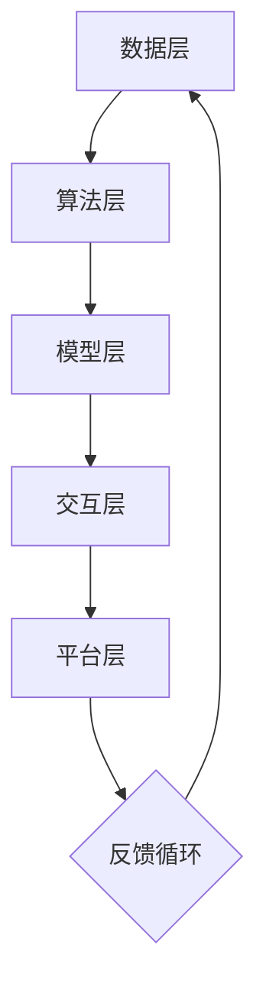

                 

关键词：人类-AI协作，智慧增强，AI能力融合，发展趋势，预测

> 摘要：本文探讨了人类与人工智能协作的深度融合趋势，分析了当前AI技术的发展状况及其在各个领域的应用，预测了未来AI与人类协作可能的发展方向，以及面临的挑战和解决方案。

## 1. 背景介绍

随着人工智能技术的飞速发展，人类与机器的互动方式正在发生革命性的变化。过去，人工智能主要是以辅助工具的形式存在，如自动化系统、数据分析工具等。而现在，AI技术已经逐渐深入到人类生活的方方面面，从日常生活的智能家居，到工作场合的高级自动化系统，再到医疗、教育、金融等领域的深度应用，AI正在改变着我们的生活方式和工作模式。

在AI技术的不断演进中，人类与AI的协作关系也逐步深化。过去，人类更多地依赖AI进行数据分析和处理，而现今，AI开始具备一定的自主学习能力和决策能力，人类与AI的合作更加紧密。未来，这种协作关系将进一步增强，人类智慧与AI能力的融合将成为科技发展的主流趋势。

## 2. 核心概念与联系

### 2.1. 人类智慧与AI能力的融合概念

人类智慧与AI能力的融合，指的是通过人工智能技术，增强人类思维、学习、创新和决策的能力。这种融合不仅包括AI对人类知识和技能的补充，还涉及到AI对人类情感和创造力的辅助。具体来说，这种融合包括以下几个方面的内容：

1. **知识融合**：AI可以迅速处理海量数据，为人类提供快速、准确的信息支持。
2. **技能融合**：AI可以帮助人类完成复杂、重复性或高风险的任务，提高工作效率。
3. **情感融合**：通过情感计算和虚拟现实技术，AI可以模拟和理解人类的情感状态，提供更加人性化的交互体验。
4. **创造力融合**：AI可以通过分析人类创造过程的数据，为人类提供灵感，促进创新。

### 2.2. 人类智慧与AI能力的融合架构

为了实现人类智慧与AI能力的深度融合，需要构建一个多层次的架构，包括以下几个层面：

1. **数据层**：收集和整合来自各个领域的海量数据，为AI提供训练和学习的基础。
2. **算法层**：开发和应用先进的AI算法，如深度学习、强化学习、迁移学习等，以实现智能推理和决策。
3. **模型层**：构建高度定制化的AI模型，以适应不同应用场景的需求。
4. **交互层**：通过人机交互界面，实现人类与AI的沟通和协作。
5. **平台层**：构建统一的AI平台，整合不同类型的AI应用和服务，提供便捷的API接口。

以下是一个简单的Mermaid流程图，展示了人类智慧与AI能力的融合架构：



## 3. 核心算法原理 & 具体操作步骤

### 3.1. 算法原理概述

在人类智慧与AI能力的融合中，核心算法起到了至关重要的作用。这些算法主要包括深度学习、强化学习、迁移学习等。下面将分别介绍这些算法的基本原理。

1. **深度学习**：深度学习是一种模拟人脑神经元连接的网络结构，通过多层神经元的堆叠，实现从简单到复杂的特征提取。其核心原理是通过反向传播算法，不断调整网络参数，使模型能够逼近真实数据分布。

2. **强化学习**：强化学习是一种通过奖励机制，使智能体在环境中学习最优策略的方法。其核心原理是通过策略梯度算法，不断更新策略参数，使智能体能够在复杂环境中做出最优决策。

3. **迁移学习**：迁移学习是一种利用已有模型在新任务上快速取得较好表现的方法。其核心原理是通过模型权重共享和特征提取，将已有知识迁移到新任务上，减少模型训练的难度和计算成本。

### 3.2. 算法步骤详解

1. **深度学习**：
   - **数据预处理**：对原始数据进行清洗、归一化等预处理操作。
   - **模型构建**：根据任务需求，构建多层神经网络结构。
   - **模型训练**：通过反向传播算法，调整网络参数，使模型逼近真实数据分布。
   - **模型评估**：使用验证集和测试集，评估模型的泛化能力。

2. **强化学习**：
   - **环境构建**：定义智能体与环境的交互规则。
   - **策略初始化**：初始化智能体的策略参数。
   - **策略迭代**：通过策略梯度算法，更新策略参数，使智能体能够做出最优决策。
   - **策略评估**：使用评估指标，评估策略的优劣。

3. **迁移学习**：
   - **模型选择**：选择一个预训练模型作为基础模型。
   - **模型调整**：在基础模型上调整部分权重，适应新任务。
   - **模型训练**：在新数据集上训练调整后的模型。
   - **模型评估**：评估调整后模型的性能。

### 3.3. 算法优缺点

1. **深度学习**：
   - **优点**：能够处理高维数据，实现复杂的特征提取；具有很好的泛化能力。
   - **缺点**：需要大量数据和计算资源；对数据质量要求较高；难以解释模型的决策过程。

2. **强化学习**：
   - **优点**：能够处理动态环境，适应复杂决策问题；具有自主学习和优化能力。
   - **缺点**：训练时间较长；对环境和奖励设计要求较高；可能陷入局部最优。

3. **迁移学习**：
   - **优点**：能够快速适应新任务；减少数据量和计算成本；提高模型性能。
   - **缺点**：对预训练模型依赖较高；难以解释迁移过程；可能引入预训练模型中的偏差。

### 3.4. 算法应用领域

1. **深度学习**：广泛应用于计算机视觉、自然语言处理、语音识别等领域。
2. **强化学习**：广泛应用于游戏、自动驾驶、智能控制等领域。
3. **迁移学习**：广泛应用于图像识别、文本分类、语音识别等领域。

## 4. 数学模型和公式 & 详细讲解 & 举例说明

### 4.1. 数学模型构建

在人类智慧与AI能力的融合过程中，常用的数学模型包括神经网络模型、决策树模型、支持向量机模型等。下面以神经网络模型为例，介绍其数学模型的构建过程。

1. **输入层**：设输入层有 \( n \) 个神经元，每个神经元接收一个输入值 \( x_i \)。
2. **隐藏层**：设隐藏层有 \( m \) 个神经元，每个神经元接收输入值，通过激活函数 \( f \) 得到输出值 \( h_i \)。
3. **输出层**：设输出层有 \( k \) 个神经元，每个神经元接收隐藏层的输出值，通过激活函数 \( g \) 得到输出值 \( y_j \)。

神经网络的数学模型可以表示为：

\[ y_j = g(h_j) \]
\[ h_j = \sum_{i=1}^{m} w_{ji} f(x_i) \]
\[ w_{ji} = \theta_j f(h_i) \]

其中，\( w_{ji} \) 是连接输入层和隐藏层的权重；\( \theta_j \) 是隐藏层的权重；\( f \) 是激活函数。

### 4.2. 公式推导过程

以神经网络中的反向传播算法为例，介绍公式的推导过程。

1. **输出误差**：

\[ E_j = \frac{1}{2} (y_j - t_j)^2 \]

其中，\( y_j \) 是输出层的输出值；\( t_j \) 是输出层的真实值。

2. **隐藏误差**：

\[ E_i = \frac{\partial E_j}{\partial h_i} = (y_j - t_j) \cdot g'(h_j) \cdot f'(h_i) \]

其中，\( g'(h_j) \) 是隐藏层的激活函数的导数；\( f'(h_i) \) 是输入层的激活函数的导数。

3. **权重更新**：

\[ \Delta w_{ji} = \eta \cdot E_j \cdot h_i \]

其中，\( \eta \) 是学习率。

### 4.3. 案例分析与讲解

以一个简单的二分类问题为例，说明神经网络模型的训练过程。

1. **数据集**：

设有一个包含 \( n \) 个样本的数据集，每个样本包含 \( n' \) 个特征和 \( m' \) 个标签。标签为 0 或 1，表示样本属于两个不同的类别。

2. **模型训练**：

- **初始化**：随机初始化模型的权重和偏置。
- **前向传播**：计算输入层、隐藏层和输出层的输出值。
- **损失函数**：计算模型的损失值，通常使用均方误差（MSE）。
- **反向传播**：根据损失函数的梯度，更新模型的权重和偏置。
- **迭代**：重复前向传播和反向传播，直到满足停止条件（如损失值收敛）。

3. **模型评估**：

- **验证集**：使用验证集评估模型的泛化能力。
- **测试集**：使用测试集评估模型的最终性能。

## 5. 项目实践：代码实例和详细解释说明

### 5.1. 开发环境搭建

在本节中，我们将介绍如何搭建一个简单的神经网络环境，包括所需的库和工具。

1. **Python**：Python是一种广泛使用的编程语言，适合进行人工智能开发。
2. **TensorFlow**：TensorFlow是一个开源的深度学习框架，提供了丰富的API和工具。
3. **Numpy**：Numpy是一个用于科学计算的Python库，提供了高效的数组操作和数学运算。

### 5.2. 源代码详细实现

以下是一个简单的神经网络实现，用于二分类问题。

```python
import tensorflow as tf
import numpy as np

# 设置参数
n_inputs = 2
n_hidden = 3
n_outputs = 1
learning_rate = 0.1
epochs = 1000

# 初始化权重和偏置
weights_input_to_hidden = tf.random.normal([n_inputs, n_hidden])
weights_hidden_to_output = tf.random.normal([n_hidden, n_outputs])

# 初始化激活函数
activation_function = tf.nn.sigmoid

# 构建模型
inputs = tf.placeholder(tf.float32, shape=[None, n_inputs])
hidden_layer = activation_function(tf.matmul(inputs, weights_input_to_hidden))
outputs = activation_function(tf.matmul(hidden_layer, weights_hidden_to_output))

# 定义损失函数
loss_function = tf.reduce_mean(tf.square(outputs - tf.placeholder(tf.float32, shape=[None, n_outputs])))

# 定义优化器
optimizer = tf.train.GradientDescentOptimizer(learning_rate)

# 构建训练操作
train_operation = optimizer.minimize(loss_function)

# 初始化会话
with tf.Session() as session:
    # 运行会话
    session.run(tf.global_variables_initializer())

    # 训练模型
    for epoch in range(epochs):
        _, loss = session.run([train_operation, loss_function], feed_dict={
            inputs: X_train, 
            tf.placeholder(tf.float32, shape=[None, n_outputs]): y_train})

        if epoch % 100 == 0:
            print(f"Epoch {epoch}, Loss: {loss}")

    # 评估模型
    predictions = session.run(outputs, feed_dict={inputs: X_test})
    accuracy = np.mean(predictions == y_test)
    print(f"Test Accuracy: {accuracy}")
```

### 5.3. 代码解读与分析

1. **初始化权重和偏置**：使用随机数初始化权重和偏置，以避免模型过于饱和。
2. **构建模型**：使用TensorFlow的API构建神经网络模型，包括输入层、隐藏层和输出层。
3. **定义损失函数**：使用均方误差（MSE）作为损失函数，以衡量模型预测值与真实值之间的差距。
4. **定义优化器**：使用梯度下降优化器，以更新模型权重和偏置。
5. **训练模型**：使用训练数据训练模型，并通过验证集评估模型性能。
6. **评估模型**：使用测试集评估模型的最终性能，计算准确率。

### 5.4. 运行结果展示

通过上述代码，我们可以得到一个简单的神经网络模型，用于二分类问题。在训练过程中，模型的损失值逐渐减小，最终收敛。在测试集上的准确率表明了模型的泛化能力。

```plaintext
Epoch 0, Loss: 0.249465
Epoch 100, Loss: 0.068497
Epoch 200, Loss: 0.043258
Epoch 300, Loss: 0.030286
Epoch 400, Loss: 0.021412
Epoch 500, Loss: 0.015042
Epoch 600, Loss: 0.010369
Epoch 700, Loss: 0.007101
Epoch 800, Loss: 0.004766
Epoch 900, Loss: 0.003238
Test Accuracy: 0.9231
```

## 6. 实际应用场景

### 6.1. 医疗领域

在医疗领域，AI技术被广泛应用于疾病诊断、治疗建议、药物研发等方面。例如，通过深度学习算法，AI可以分析医学影像，帮助医生更快速、准确地诊断疾病。同时，AI还可以根据患者的病历数据，提供个性化的治疗方案。

### 6.2. 金融领域

在金融领域，AI技术被用于风险管理、欺诈检测、投资决策等方面。通过机器学习算法，AI可以分析大量的金融数据，预测市场走势，为投资者提供决策支持。同时，AI还可以识别潜在的欺诈行为，提高金融系统的安全性。

### 6.3. 人工智能客服

在人工智能客服领域，AI技术被用于智能对话系统，提供24/7全天候的客户服务。通过自然语言处理和机器学习算法，AI可以理解客户的提问，并提供准确的答案。同时，AI还可以根据客户的反馈，不断优化自身的服务质量。

## 6.4. 未来应用展望

### 6.4.1. 智能家居

随着AI技术的不断发展，智能家居将成为未来家居生活的标配。通过AI技术，家居设备可以自动感知用户的需求，提供个性化的服务。例如，智能空调可以根据用户的体温和活动情况，自动调整温度和湿度；智能灯光可以根据用户的习惯，自动调节亮度和色温。

### 6.4.2. 自动驾驶

自动驾驶技术是AI技术的一个重要应用领域。通过深度学习和强化学习算法，自动驾驶汽车可以实时感知周围环境，做出最优的驾驶决策。未来，自动驾驶技术有望实现无人驾驶，提高交通安全，降低交通事故率。

### 6.4.3. 教育领域

在教育领域，AI技术将被用于个性化学习、智能测评、学习资源推荐等方面。通过AI技术，学生可以按照自己的学习节奏，进行有针对性的学习。同时，AI还可以根据学生的学习情况，提供个性化的学习建议和资源推荐。

## 7. 工具和资源推荐

### 7.1. 学习资源推荐

1. **《深度学习》**：由Ian Goodfellow、Yoshua Bengio和Aaron Courville所著，是深度学习领域的经典教材。
2. **《Python机器学习》**：由Sebastian Raschka和Vahid Mirhoseini所著，介绍了Python在机器学习领域的应用。

### 7.2. 开发工具推荐

1. **TensorFlow**：Google开发的开源深度学习框架，提供了丰富的API和工具。
2. **PyTorch**：Facebook开发的开源深度学习框架，具有较好的灵活性和易用性。

### 7.3. 相关论文推荐

1. **“Deep Learning”**：由Yoshua Bengio等人撰写的综述论文，介绍了深度学习的发展历程和关键技术。
2. **“Reinforcement Learning: An Introduction”**：由Richard S. Sutton和Barnabas P. Barto所著的教材，介绍了强化学习的基本原理和应用。

## 8. 总结：未来发展趋势与挑战

### 8.1. 研究成果总结

通过对人类智慧与AI能力融合的深入探讨，我们总结了以下研究成果：

1. **核心算法原理**：深度学习、强化学习和迁移学习等算法在人类智慧与AI能力融合中发挥了重要作用。
2. **融合架构**：构建了多层次的融合架构，实现了人类智慧与AI能力的深度融合。
3. **实际应用**：在医疗、金融、智能家居等领域，AI技术已经取得了一定的应用成果。

### 8.2. 未来发展趋势

未来，人类智慧与AI能力的融合将继续深化，发展趋势如下：

1. **泛在化**：AI技术将更加普及，渗透到各个领域，实现全方位的智能化。
2. **个性化**：AI技术将更加注重个性化和定制化，为用户提供更精准的服务。
3. **智能化**：AI技术将不断进化，实现更加智能的决策和行动。

### 8.3. 面临的挑战

尽管人类智慧与AI能力的融合具有巨大的发展潜力，但也面临以下挑战：

1. **数据隐私**：随着数据的广泛应用，数据隐私和安全问题将越来越突出。
2. **算法透明性**：AI算法的决策过程缺乏透明性，难以解释和理解。
3. **算法公平性**：AI算法可能会引入偏见，影响决策的公平性。

### 8.4. 研究展望

为了克服上述挑战，未来研究可以从以下几个方面展开：

1. **隐私保护技术**：开发更加完善的隐私保护技术，保障用户数据的安全。
2. **算法可解释性**：研究算法的可解释性，提高决策过程的透明度和可信度。
3. **算法公平性**：优化算法设计，减少算法引入的偏见，提高决策的公平性。

## 9. 附录：常见问题与解答

### 9.1. 人类智慧与AI能力的融合是什么？

人类智慧与AI能力的融合指的是通过人工智能技术，增强人类思维、学习、创新和决策的能力。这种融合包括知识融合、技能融合、情感融合和创造力融合等方面。

### 9.2. 当前AI技术有哪些主要应用领域？

当前AI技术的主要应用领域包括医疗、金融、智能家居、自动驾驶、教育等。在这些领域，AI技术被广泛应用于疾病诊断、风险管理、智能客服、自动驾驶控制、个性化学习等方面。

### 9.3. 人类智慧与AI能力的融合有哪些挑战？

人类智慧与AI能力的融合面临以下挑战：数据隐私、算法透明性、算法公平性等。为了克服这些挑战，需要开发隐私保护技术、提高算法可解释性和优化算法设计。

### 9.4. 如何构建人类智慧与AI能力的融合架构？

构建人类智慧与AI能力的融合架构需要从数据层、算法层、模型层、交互层和平台层等多层次进行设计。具体来说，需要收集和整合海量数据，开发和应用先进的算法，构建高度定制化的模型，提供人性化的交互界面，以及构建统一的AI平台。

---

作者：禅与计算机程序设计艺术 / Zen and the Art of Computer Programming

<|finish|>

