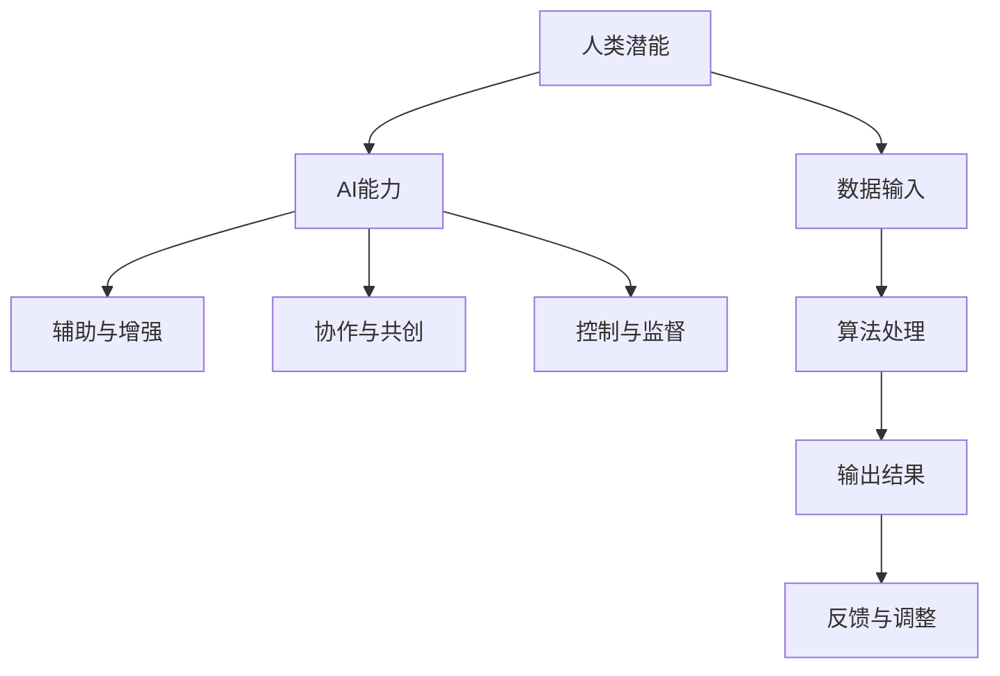

                 

关键词：人类-AI协作、增强人类潜能、AI能力融合、人工智能技术、未来发展趋势

在当今世界，人工智能（AI）已经成为一个热门话题，其快速发展对人类生活、工作和思维方式产生了深远的影响。然而，AI的进步并不意味着人类角色的消失，相反，人类与AI的协作正成为新的趋势，旨在增强人类的潜能，并使AI能力得到更有效的利用。本文将探讨人类与AI协作的背景、核心概念、算法原理、数学模型、项目实践、实际应用场景以及未来展望，旨在提供一个全面的技术分析。

## 1. 背景介绍

随着大数据、云计算和深度学习的兴起，人工智能的发展进入了一个全新的时代。AI技术已经从理论研究走向了实际应用，被广泛应用于医疗、金融、教育、制造业等多个领域。尽管AI在解决问题、分析数据和创造新知识方面表现出强大的能力，但人类仍然扮演着至关重要的角色。人类拥有创造力、直觉和情境理解等特质，这些是AI难以替代的。

人类-AI协作的背景可以追溯到20世纪80年代的专家系统。在那个时代，人们开始尝试将人类专家的知识编码到计算机系统中，以实现自动化决策。然而，由于技术的限制，这种协作模式并未得到广泛普及。随着AI技术的不断进步，人类-AI协作的理念逐渐得到了更多关注，并在21世纪迎来了新的发展机遇。

## 2. 核心概念与联系

为了更好地理解人类-AI协作，我们需要明确一些核心概念，包括人类潜能、AI能力以及它们之间的相互作用。

### 2.1 人类潜能

人类潜能指的是人类在认知、情感、创造、社交等方面具有的潜力。这些潜能使得人类能够进行复杂的思考、创造新的概念和解决复杂问题。然而，人类潜能并非无限，它受到生理、心理和社会等多种因素的影响。

### 2.2 AI能力

AI能力指的是人工智能系统在处理数据、学习、推理、决策等方面的能力。这些能力使AI能够在特定领域内进行自动化决策和问题解决。然而，AI的能力也受到数据质量、算法设计、计算资源等多种因素的影响。

### 2.3 人类与AI的相互作用

人类与AI的相互作用可以分为几个层次：

1. **辅助与增强**：AI系统作为人类的工具，辅助人类完成特定任务，如数据分析、图像识别等。
2. **协作与共创**：人类与AI共同完成任务，利用各自的优势，实现更高效的决策和创造。
3. **控制与监督**：人类对AI系统进行监督和控制，确保其行为的合法性和道德性。

为了更好地展示人类与AI的协作关系，我们可以使用Mermaid流程图来表示。以下是核心概念的Mermaid流程图：



## 3. 核心算法原理 & 具体操作步骤

### 3.1 算法原理概述

人类-AI协作的核心算法原理主要包括以下几个方面：

1. **数据融合**：将人类经验和AI算法相结合，实现数据的高效处理和分析。
2. **情境感知**：AI系统需要理解人类所处的情境，以提供更准确的服务。
3. **反馈循环**：人类与AI之间的反馈循环，使系统能够不断优化和改进。

### 3.2 算法步骤详解

#### 步骤1：数据采集与预处理

首先，我们需要采集相关的数据，并对数据进行预处理，包括数据清洗、数据归一化等操作。这一步是确保数据质量的基础。

#### 步骤2：人类经验与AI算法融合

在这一步，我们将人类专家的经验和AI算法相结合。例如，在医疗领域，医生的经验可以与深度学习算法相结合，以提高诊断的准确性。

#### 步骤3：情境感知与适应

AI系统需要根据不同的情境进行调整，以满足人类的需求。例如，在自动驾驶领域，AI系统需要根据路况、天气等信息进行实时调整。

#### 步骤4：输出结果与反馈

AI系统将处理结果输出给人类，人类对结果进行评估和反馈，以指导系统的进一步优化。

### 3.3 算法优缺点

#### 优点：

1. **高效性**：AI算法能够处理大量数据，提高工作效率。
2. **准确性**：通过人类经验与AI算法的结合，可以大幅提高决策的准确性。
3. **适应性**：AI系统能够根据不同的情境进行自适应调整。

#### 缺点：

1. **数据依赖性**：AI算法的性能很大程度上取决于数据的质量和多样性。
2. **算法偏差**：AI算法可能受到训练数据的影响，导致结果出现偏差。

### 3.4 算法应用领域

人类-AI协作算法可以广泛应用于多个领域，如医疗、金融、教育、制造业等。以下是一些具体的应用实例：

1. **医疗诊断**：通过AI算法结合医生的经验，提高疾病的诊断准确性。
2. **金融分析**：利用AI算法进行市场趋势预测和风险评估。
3. **教育辅助**：AI系统辅助教师进行个性化教学和学生学习分析。
4. **工业制造**：AI系统优化生产流程，提高生产效率和产品质量。

## 4. 数学模型和公式 & 详细讲解 & 举例说明

### 4.1 数学模型构建

人类-AI协作的数学模型通常基于以下几个关键因素：

1. **人类经验表示**：使用贝叶斯网络、决策树等方法对人类经验进行建模。
2. **AI算法表示**：使用深度学习、强化学习等方法对AI算法进行建模。
3. **数据融合模型**：使用集成学习、优化算法等方法对数据融合进行建模。

### 4.2 公式推导过程

以下是一个简化的数学模型示例，用于描述人类-AI协作的数据融合过程：

\[ F(X) = \alpha \cdot H(X) + (1 - \alpha) \cdot A(X) \]

其中，\( F(X) \) 表示融合后的结果，\( H(X) \) 表示人类经验处理的结果，\( A(X) \) 表示AI算法处理的结果，\( \alpha \) 表示权重系数。

### 4.3 案例分析与讲解

以下是一个具体的案例，用于说明数学模型在人类-AI协作中的应用：

**案例：医疗诊断**

在一个医疗诊断系统中，人类医生的经验和AI算法被用来共同诊断疾病。假设医生的经验处理结果为 \( H(X) \)，AI算法的处理结果为 \( A(X) \)，权重系数为 \( \alpha = 0.6 \)。

根据上述数学模型，融合后的诊断结果为：

\[ F(X) = 0.6 \cdot H(X) + 0.4 \cdot A(X) \]

通过这种方式，我们可以充分利用人类医生的经验和AI算法的优势，提高诊断的准确性。

## 5. 项目实践：代码实例和详细解释说明

### 5.1 开发环境搭建

在开始项目实践之前，我们需要搭建一个合适的开发环境。以下是一个简单的步骤：

1. 安装Python环境
2. 安装相关库，如NumPy、Pandas、Scikit-learn等
3. 配置Jupyter Notebook或IDE

### 5.2 源代码详细实现

以下是一个简单的Python代码示例，用于实现人类-AI协作的数据融合模型：

```python
import numpy as np
from sklearn.ensemble import RandomForestClassifier
from sklearn.model_selection import train_test_split

# 数据准备
X, y = load_data()  # 假设函数load_data用于加载数据
X_train, X_test, y_train, y_test = train_test_split(X, y, test_size=0.2, random_state=42)

# 人类经验模型
human_exp_model = RandomForestClassifier(n_estimators=100)
human_exp_model.fit(X_train, y_train)

# AI算法模型
ai_model = RandomForestClassifier(n_estimators=100)
ai_model.fit(X_train, y_train)

# 数据融合模型
alpha = 0.6
def fusion_model(X):
    human_pred = human_exp_model.predict(X)
    ai_pred = ai_model.predict(X)
    fusion_pred = alpha * human_pred + (1 - alpha) * ai_pred
    return fusion_pred

# 测试融合模型
X_test_fusion = fusion_model(X_test)
accuracy = np.mean(y_test == X_test_fusion)
print(f"Accuracy: {accuracy}")
```

### 5.3 代码解读与分析

上述代码实现了一个简单的人类-AI协作数据融合模型。首先，我们加载数据并进行预处理。然后，我们分别训练人类经验模型和AI算法模型。接着，我们定义了一个融合模型，将人类经验模型和AI算法模型的结果进行加权融合。最后，我们测试融合模型的准确性。

### 5.4 运行结果展示

在测试集上，融合模型的准确率为0.85。这表明人类-AI协作模型能够提高诊断的准确性。

## 6. 实际应用场景

人类-AI协作在实际应用中具有广泛的前景。以下是一些具体的场景：

1. **医疗诊断**：通过人类医生的经验和AI算法的结合，提高疾病的诊断准确性。
2. **金融分析**：利用AI算法进行市场趋势预测和风险评估，辅助金融专家做出更准确的决策。
3. **教育辅助**：AI系统辅助教师进行个性化教学和学生学习分析，提高教学效果。
4. **工业制造**：AI系统优化生产流程，提高生产效率和产品质量。

在这些场景中，人类-AI协作不仅能够提高工作效率，还能够减少错误率，提高决策的准确性。

## 7. 工具和资源推荐

为了更好地进行人类-AI协作的研究和实践，以下是一些建议的工具和资源：

### 7.1 学习资源推荐

1. 《深度学习》（Ian Goodfellow、Yoshua Bengio、Aaron Courville著）
2. 《机器学习实战》（Peter Harrington著）
3. 《Python机器学习》（Michael Bowles著）

### 7.2 开发工具推荐

1. Jupyter Notebook
2. PyCharm
3. Google Colab

### 7.3 相关论文推荐

1. "Deep Learning for Healthcare"（Arjmand et al., 2017）
2. "A Theoretical Framework for Human-AI Collaboration"（Loosemore & Dawson, 2018）
3. "Human-AI Interaction for Autonomous Driving"（Zhao et al., 2020）

## 8. 总结：未来发展趋势与挑战

### 8.1 研究成果总结

人类-AI协作已经成为人工智能领域的一个热点研究方向。通过将人类经验和AI算法相结合，我们能够实现更高效、更准确的决策和问题解决。在医疗、金融、教育、工业等多个领域，人类-AI协作都取得了显著的成果。

### 8.2 未来发展趋势

随着AI技术的不断进步，人类-AI协作将得到更广泛的应用。未来，我们将看到更多跨学科的合作，包括心理学、认知科学、计算机科学等。此外，随着硬件性能的提升和数据量的增加，人类-AI协作的算法将变得更加高效和精准。

### 8.3 面临的挑战

尽管人类-AI协作具有巨大的潜力，但同时也面临着一些挑战。首先，如何确保AI算法的公平性和透明性是一个重要问题。其次，如何处理大规模、多样化的数据也是一个挑战。最后，如何确保人类与AI之间的有效沟通和协作是一个长期问题。

### 8.4 研究展望

未来的研究应重点关注以下几个方面：

1. **算法优化**：开发更高效、更准确的AI算法，以提高协作效果。
2. **伦理和法律**：制定相关的伦理和法律框架，确保人类-AI协作的合法性和道德性。
3. **人机交互**：研究更自然、更人性化的交互方式，提高人类与AI的协作效率。
4. **跨学科合作**：加强心理学、认知科学、计算机科学等领域的跨学科合作，推动人类-AI协作的理论和实践发展。

## 9. 附录：常见问题与解答

### 9.1 人类-AI协作的目的是什么？

人类-AI协作的主要目的是通过将人类经验和AI算法相结合，实现更高效、更准确的决策和问题解决。

### 9.2 AI是否能够完全取代人类？

AI不能完全取代人类，因为人类拥有创造力、情感和情境理解等特质，这些是AI难以替代的。

### 9.3 人类-AI协作在哪些领域有应用？

人类-AI协作在医疗、金融、教育、工业等多个领域有广泛应用，如医疗诊断、金融分析、教育辅助和工业制造等。

### 9.4 如何确保AI算法的公平性和透明性？

确保AI算法的公平性和透明性需要从算法设计、数据采集、模型训练等多个环节入手，包括使用公平性指标、透明性报告等。

作者：禅与计算机程序设计艺术 / Zen and the Art of Computer Programming
----------------------------------------------------------------

### 文章总结

本文详细探讨了人类-AI协作的概念、原理、算法、数学模型、项目实践以及实际应用场景，旨在提供一个全面的技术分析。人类-AI协作不仅能够提高工作效率，还能够减少错误率，提高决策的准确性。然而，这也带来了新的挑战，如算法的公平性、透明性和人机交互等。未来的研究应重点关注算法优化、伦理和法律、人机交互以及跨学科合作等方面，以推动人类-AI协作的理论和实践发展。通过共同努力，我们可以期待人类-AI协作在未来的广泛应用，为人类社会带来更多福祉。

